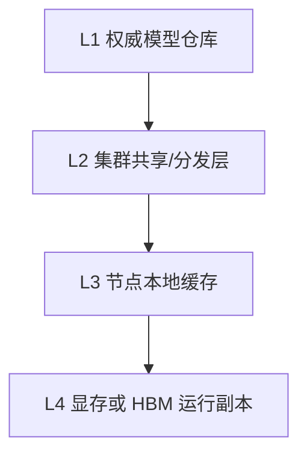

# 模型文件存在哪里——从权威仓库到显存/HBM的四层存储

:::info 系列与定位
**系列**：《NVIDIA＋昇腾双资源池 AI 推理集群：从 0 到部署、运维与故障排查》
**阶段**：第五阶段——模型存储
**本文定位**：模型制品、存储分层、目录规范与选型基础篇
:::

:::tip 系列约定
资源池 A = **NVIDIA GPU**（vLLM）· 资源池 B = **华为昇腾 NPU**（vLLM-Ascend）· 同一 Kubernetes · 共享存储/网关/监控 · **禁止**跨池组成同一分布式模型实例。
:::

部署大模型时，经常听到一句话：「把模型挂载进容器就可以了。」这句话只说了最后一个动作，没有回答模型从哪里来、哪个副本是权威版本、NVIDIA 版和昇腾版是否使用相同文件、多个 Pod 同时启动会不会打爆存储、本地缓存坏了能否重建、旧版本何时删除、权重被替换时如何防止加载一半新一半旧、PVC 误删后是否连底层数据一起删除。

本篇先不急着部署 NFS 或 Ceph，而是建立模型存储的整体结构。后面三篇会分别落到 NFS、CephFS/对象存储和缓存预热。

本站对照：[大模型文件存储方案](../../storage/ai-workloads/06-大模型文件在%20Kubernetes%20中的存储方案.md) · [AI 存储 IO 模型](../../storage/ai-workloads/01-AI工作负载的存储IO模型.md) · [对象存储与模型仓库](../../storage/ai-workloads/04-对象存储与模型仓库设计.md)。

## 1. 模型文件不只是几个权重分片 {/* #一模型文件不只是几个权重分片 */}

| 分类 | 常见内容 | 缺失后果 |
|------|----------|----------|
| 配置 | config.json、生成配置 | 架构或参数无法识别 |
| 权重 | Safetensors、PyTorch 分片等 | 模型无法加载 |
| 索引 | 权重分片索引 | 无法正确定位张量 |
| Tokenizer | tokenizer 配置、词表、merges | 输入输出不一致 |
| Chat Template | 对话模板 | 提示格式和效果变化 |
| 自定义代码 | 模型实现、Processor | 特殊架构无法加载 |
| 多模态组件 | Vision/Audio Processor | 多模态功能不可用 |
| 量化信息 | GPTQ/AWQ/其他配置 | 加载格式或精度错误 |
| 转换产物 | 昇腾或特定框架产物 | 目标硬件无法使用 |
| 校验信息 | Manifest、SHA256 | 无法确认文件完整性 |
| 许可证 / 回归记录 | License、测试结果 | 合规与生产准入风险 |

因此，「模型版本」不能只用目录更新时间表示，必须有明确 Manifest。

## 2. 模型存储的四层结构 {/* #二模型存储的四层结构 */}



| 层 | 职责 | 回答的问题 |
|----|------|------------|
| L1 权威模型仓库 | 保存经过审批、可追溯、不可变的正式版本 | 哪个版本才是正式版本？ |
| L2 集群共享/分发层 | 让 K8s 节点高效获得权重（NFS/CephFS/对象存储等） | 集群如何拿到正式版本？ |
| L3 节点本地缓存 | 减少重复网络读取和冷启动（NVMe 等） | 这台机器能否快速重复启动？ |
| L4 设备运行副本 | 显存/HBM、部分 CPU 内存、KV Cache 等 | 当前进程正在使用哪个运行副本？ |

本地缓存不是唯一副本，节点损坏后必须可以重新下载。Pod 退出后，L4 通常消失。

## 3. 为什么必须区分「权威来源」和「缓存」 {/* #三为什么必须区分权威来源和缓存 */}

如果把节点本地目录当成唯一模型仓库，会出现：节点故障丢模型、节点间不一致、无法确认最新版本、扩容无来源、手工复制遗漏、回滚找不到旧版、清理误删唯一副本。

```text
权威模型仓库：不可随意删除，可审计，可恢复
共享/分发层：可以重新同步
节点缓存：随时允许失效并重建
设备副本：随 Pod 生命周期创建和释放
```

判断一个目录是不是缓存，可以问：「把这个目录全部删除后，能否从另一个受控位置自动、完整地恢复？」如果不能，它就不是缓存。

## 4. 双资源池中的「同一个模型」可能有多个制品 {/* #四双资源池中的同一个模型可能有多个制品 */}

逻辑模型可能叫 `company-chat-model-v3`，但实际制品可能包括：源权重 BF16、NVIDIA vLLM 使用版本、NVIDIA 量化版、昇腾 vLLM-Ascend 版本、昇腾转换/编译产物、Tokenizer 与 Chat Template。

不能假定两池只要挂载完全相同的字节目录就一定能运行。

```text
/model-registry/company-chat-model/
├── source/3.0.0/
├── tokenizer/3.0.0/
├── nvidia/bf16-3.0.0/  int8-3.0.0/
├── ascend/bf16-3.0.0/  optimized-3.0.0/
└── validation/3.0.0/
```

如果两池确实能共享同一份源权重，通过引用或 Manifest 表达关系，而不是复制后假装它们永远一致。

## 5. 目录必须不可变，不能原地覆盖 {/* #五目录必须不可变不能原地覆盖 */}

错误：`/models/company-model/latest/` 原地覆盖——可能造成 Pod 读到新旧混合文件。

正确：版本目录不可变。

```text
/models/company-model/nvidia/bf16-3.0.0/
/models/company-model/nvidia/bf16-3.0.1/
```

发布流程：上传临时目录 → 校验哈希 → 生成 Manifest → 最小加载测试 → 原子发布正式版本 → 更新平台映射 → 新 Pod 使用新路径。

不要让正在运行的 Pod 使用会被原地修改的目录。

## 6. Manifest 应该记录什么 {/* #六manifest-应该记录什么 */}

```yaml
schemaVersion: 1
logicalModel: company-chat-model
artifactVersion: 3.0.0-nvidia-bf16
vendor: nvidia
framework: vllm
precision: bf16
source:
  model: company-chat-model
  revision: 3.0.0
compatibility:
  imageDigest: sha256:<推理镜像摘要>
  minDeviceMemoryGiB: 80
files:
  - path: config.json
    size: <字节数>
    sha256: <哈希>
validation:
  report: validation/report-3.0.0.md
publishedAt: <ISO8601时间>
owner: <团队>
```

昇腾制品单独记录：CANN、vLLM-Ascend、转换工具与参数、目标产品、所需 HBM、产物哈希。Manifest 本身也应有签名或摘要，并与发布审批关联。

## 7. 模型存储的 I/O 特征 {/* #七模型存储的-io-特征 */}

1. 单文件很大
2. 启动时突发读取
3. 通常读多写少
4. 既有大文件吞吐，也有元数据压力
5. 冷启动比稳态更依赖存储

验收不能只看 `df -h`，还要测并发顺序读、随机读、元数据、缓存命中和故障恢复。

## 8. 常见存储方案对照 {/* #八常见存储方案对照 */}

| 方案 | 多节点共享 | 吞吐与扩展 | 运维复杂度 | 适合角色 |
|------|------------|------------|------------|----------|
| 容器镜像内置权重 | 通过镜像分发 | 大镜像拉取慢 | 版本和仓库压力大 | 小模型、极少变更 |
| NFS | POSIX 共享 | 受服务器和网络限制 | 较低 | 小中规模共享模型目录 |
| CephFS | RWX/共享文件系统 | 可横向扩展 | 中高 | 规模化共享 POSIX 模型目录 |
| Ceph RGW/S3 | 对象接口 | 容量和分发扩展较好 | 中高 | 权威仓库、跨集群分发 |
| Ceph RBD | 常见 RWO | 单卷性能较好 | 中 | 单 Pod/单节点缓存卷 |
| 节点本地 NVMe | 不自动共享 | 本地读取快 | 需分发和清理 | 可重建热缓存 |
| emptyDir | Pod 内 | 随 Pod/节点生命周期 | 低 | 单 Pod 临时下载区 |

生产常用组合：对象存储或受控 CephFS 作权威仓库 + CephFS/NFS 作共享发布层 + 节点 NVMe 作热缓存 + 显存/HBM 作运行层。

## 9. 九～十一、PV / PVC / StorageClass、访问模式与 ReclaimPolicy {/* #九十一pv--pvc--storageclass访问模式与-reclaimpolicy */}

链路：`Pod → PVC → PV → NFS/CephFS/RBD 等后端`。

| AccessMode | 含义 |
|------------|------|
| RWO | 一个节点读写 |
| ROX | 多节点只读 |
| RWX | 多节点读写 |
| RWOP | 单个 Pod 读写 |

访问模式不是性能保证。生产模型目录推荐：发布流程受控读写；推理 Pod 只读挂载。

:::caution ReclaimPolicy 是模型安全红线
动态 PV 可能默认 Delete——删除 PVC 时可能同时删除底层资产。权威仓库优先评估 `Retain`，但 Retain 不是备份。
:::

上线前必须演练：误删 Deployment/Pod/PVC/PV、存储节点故障、文件误删恢复。

## 10. 十二～十三、只读挂载与缓存分离 {/* #十二十三只读挂载与缓存分离 */}

```yaml
volumes:
  - name: model-repository
    persistentVolumeClaim:
      claimName: model-repository-pvc
containers:
  - name: inference
    volumeMounts:
      - name: model-repository
        mountPath: /models
        readOnly: true
```

```text
/models        正式权重，只读
/model-cache   可重建缓存，可写
/tmp           临时文件，可写
/logs          日志
```

把 HF_HOME、XDG_CACHE_HOME 等重定向到可写缓存卷，不要写进正式版本目录。

## 11. 为什么不建议把大型权重直接塞进推理镜像 {/* #十四为什么不建议把大型权重直接塞进推理镜像 */}

大镜像导致：Registry 膨胀、推拉慢、小改动重建巨型镜像、清理困难、节点磁盘压力、两池重复存放、权限难分离。大型 LLM 通常更适合「软件镜像」和「模型制品」分开版本化。

## 12. 对象存储与文件系统的根本区别 {/* #十五对象存储与文件系统的根本区别 */}

文件系统：POSIX 路径与 open/read/mmap。对象存储：Bucket/Key 与 S3 API。基础方案是下载到本地 → 校验 → 原子放入节点缓存 → 从本地路径加载。不要默认用 FUSE 把对象存储伪装成普通文件系统后直接跑生产大模型。

## 13. 十六～十七、容量与性能规划 {/* #十六十七容量与性能规划 */}

逻辑容量：`Σ（每个模型 × 保留版本 × 各厂商制品）`，再加元数据、快照、副本/纠删、临时空间、备份、节点缓存、安全水位。

性能按「集体重启」规划：例如 120GB × 20 Pod ÷ 600s ≈ 4GB/s 平均有效吞吐需求（未计开销）。优先同节点复用本地缓存。测试含：单/多 Pod、多节点冷启动、存储故障时冷启动、缓存命中与未命中。

## 14. 十八～十九、发布安全与权限 {/* #十八十九发布安全与权限 */}

状态机：`UPLOADING → VERIFYING → STAGING → APPROVED → PUBLISHED → DEPRECATED → ARCHIVED`。

| 身份 | 权限 |
|------|------|
| 推理 Pod | 只读指定模型版本 |
| 发布流水线 | 写入 Staging、发布正式版本 |
| 平台管理员 | 管理策略，不直接日常改权重 |
| 开发人员 | 读取获批模型、写个人测试区 |
| 缓存组件 | 读取源仓库、写本地缓存 |

凭证不得写入模型目录、Git 明文、镜像层或日志。启用 `trust_remote_code` 前必须审查代码。

## 15. 二十～二十一、备份与双池故障域 {/* #二十二十一备份与双池故障域 */}

不可变版本、快照、副本、备份、异地复制解决不同问题——重要模型至少要有：不可变版本 + 存储级保护 + 独立备份或跨故障域副本 + 定期恢复演练。

若两池共享同一 CephFS/NFS：算力设备故障可能只影响一个池；共享存储故障可能同时影响两池冷启动。双池容灾必须记录公共依赖（存储、DNS、镜像仓、网关、控制面、网络核心）。

## 16. 选型决策表 {/* #二十二选型决策表 */}

- **NFS**：规模较小、需要简单 POSIX、并发可控
- **CephFS**：已有稳定 Ceph、需横向扩展 RWX、具备运维能力
- **对象存储**：权威仓库、跨集群分发、可下载再加载
- **本地 NVMe**：冷启动敏感、同节点反复启动、可自动重建

通常是组合使用，不是四选一。

## 17. 常见错误 {/* #二十三常见错误 */}

1. 把多台客户端磁盘容量相加成 NFS 容量
2. 用 `latest` 目录原地覆盖权重
3. 推理 Pod 拥有模型目录写权限
4. 删除 PVC 前不检查 ReclaimPolicy
5. 只测单 Pod 读取速度
6. 把本地缓存当备份
7. 认为副本数等于备份
8. 两池目录同名就认为内容一致

## 18. 二十四～二十五、检查表与练习 {/* #二十四二十五检查表与练习 */}

检查表覆盖：权威仓库、四层路径、两池制品、不可变版本、Manifest、只读挂载、缓存分离、ReclaimPolicy、备份演练、容量与冷启动压测、审批、最小权限、公共存储故障分析。

练习：列文件清单、区分制品、写 Manifest 草案、算容量、画 L1～L4、查写权限与 ReclaimPolicy、设计 20 Pod 冷启动压测。

## 19. 本篇小结 {/* #二十六本篇小结 */}

```text
模型不是一个随便复制的目录
而是有版本、摘要、兼容性和生命周期的制品

权威模型仓库
→ 集群共享/分发层
→ 节点本地缓存
→ CPU 内存与显存/HBM 运行副本
```

生产设计必须做到：权威来源唯一明确；版本不可变；两池制品分别管理；推理只读；缓存可重建；并发冷启动经过压测；删除与恢复可控。

下一篇将使用最容易入门的共享文件系统 NFS，把服务器导出、Kubernetes PV/PVC、只读挂载、性能测试和故障排查完整走一遍。

## 20. 参考资料 {/* #参考资料 */}

- [Persistent Volumes](https://kubernetes.io/docs/concepts/storage/persistent-volumes/)
- [Volumes](https://kubernetes.io/docs/concepts/storage/volumes/)
- [Storage Classes](https://kubernetes.io/docs/concepts/storage/storage-classes/)
- [Hugging Face: Understand caching](https://huggingface.co/docs/huggingface_hub/guides/manage-cache)

## 21. 相关链接 {/* #相关链接 */}

- [专栏目录](./00-专栏目录.md)
- [Ceph 三种接口选型](../../storage/ceph/08-ai-workloads/30-AI集群中的Ceph接口选型.md)
- [Ceph 学习路线](../../storage/ceph/00-Ceph学习路线.md)

← [第 16 篇](./16-两个资源池如何分配模型和业务.md) · → [第 18 篇：使用 NFS 构建双池共享模型存储](./18-使用NFS构建双池共享模型存储.md)
