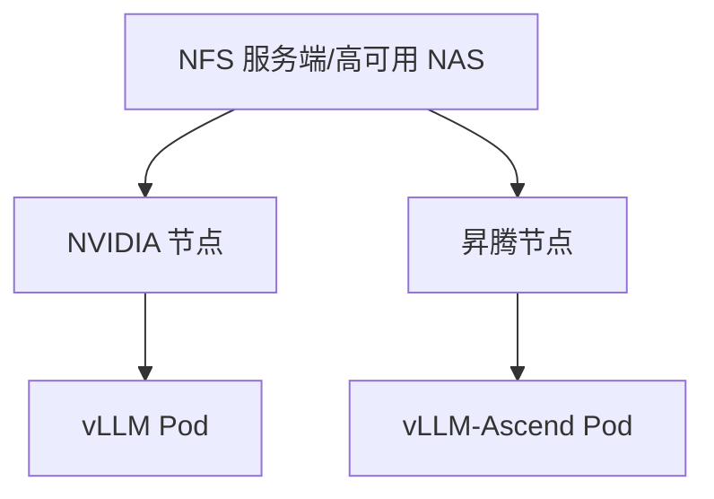

# 使用NFS搭建双资源池共享模型存储

:::info 系列与定位
**系列**：《NVIDIA＋昇腾双资源池 AI 推理集群：从 0 到部署、运维与故障排查》  
**阶段**：第五阶段——模型存储  
**本文定位**：NFS 服务器、Kubernetes 挂载、性能验收与故障排查篇
:::

:::tip 系列约定
资源池 A = **NVIDIA GPU**（vLLM）· 资源池 B = **华为昇腾 NPU**（vLLM-Ascend）· 同一 Kubernetes · 共享存储/网关/监控 · **禁止**跨池组成同一分布式模型实例。
:::

NFS 是最容易让小白理解的共享存储：一台 NFS 服务器导出目录，多台 NVIDIA 和昇腾节点通过网络挂载同一目录。

:::caution 常见误解
10 台客户端每台 2TB，同时挂载一台 2TB 的 NFS 服务器，NFS 可用容量仍主要是服务端的 2TB，不会自动变成 20TB。NFS 负责「共享服务端文件系统」，不会自动把客户端本地盘聚合成分布式存储。
:::

本篇目标：准备 NFS 服务端 → 安全导出模型目录 → 所有 K8s 节点验证挂载 → 创建 PV/PVC → NVIDIA 和昇腾 Pod 只读使用 → 完成性能、故障和恢复验收。

本站对照：[NFS 在 AI 集群中的使用](../../storage/nfs/01-NFS在AI集群中的使用与性能分析.md) · [第 17 篇四层存储](./17-模型文件到底存在哪里.md)。

---

## 一、NFS 在双资源池中的位置



两池可共享：源模型、Tokenizer、Chat Template、公共配置、经确认可共用的权重。应分别使用：厂商专用转换产物、量化或优化制品、编译缓存、运行时缓存、推理镜像。

目录仍沿用第 17 篇规范：

```text
/srv/nfs/models/
└── company-model-a/
    ├── source/  tokenizer/  nvidia/  ascend/  validation/
```

---

## 二、NFS 适合多大规模

**适合**：入门实验；小中规模推理；成熟 NAS；模型数量和并发冷启动不高；需要 POSIX 路径；暂不想承担 Ceph 复杂度。

**谨慎**：数十台节点同时加载百 GB 模型；故障时大量 Pod 同时重建；单机/单网卡/单磁盘；跨机房高可用；百万级小文件；维护窗口不可接受；无快照备份告警。

性能取决于服务端 CPU/内存、磁盘、网络、NFS 版本、并发、客户端缓存、挂载参数与文件布局。单机 NFS 天然容易形成容量、带宽和故障集中点。

---

## 三、生产 NFS 需要怎样的服务端

双电源；RAID 或可靠后端；高速网络与 Bond；独立存储网；高可用 NFS/NAS；VIP；快照备份；监控告警；备用容量。

单机 NFS 宕机时：正在读的进程可能阻塞；新 Pod 挂载失败；扩容与重建失败；已完全加载进内存/设备的服务可能暂时继续；访问模型目录的进程可能进入不可中断等待。

---

## 四、规划示例

| 项目 | 示例值 |
|------|--------|
| NFS 服务地址 | 10.20.0.10（生产用 VIP） |
| 导出目录 | /srv/nfs/models |
| 计算节点网段 | 10.20.0.0/16 |
| 发布机 | 10.10.1.50 |
| NFS 版本 | 先验证 NFSv4.1 |
| 模型只读组 GID | 2000 |
| Kubernetes PVC | model-repository-pvc |

实际环境必须替换 IP、网段、路径、用户和协议版本。

---

## 五～七、安装服务端、目录权限与 /etc/exports

```bash
# RHEL 系
sudo dnf install -y nfs-utils
sudo systemctl enable --now nfs-server

# Debian/Ubuntu
sudo apt-get install -y nfs-kernel-server
sudo systemctl enable --now nfs-kernel-server
```

```bash
sudo groupadd -g 2000 model-readers
sudo install -d -o root -g model-readers -m 0750 /srv/nfs/models
```

不要 `chmod -R 777`。

```text
/srv/nfs/models 10.20.0.0/16(ro,sync,root_squash,no_subtree_check) 10.10.1.50(rw,sync,root_squash,no_subtree_check)
```

```bash
sudo exportfs -rav
sudo exportfs -v
```

| 参数 | 含义 |
|------|------|
| ro / rw | 计算只读 / 发布可写 |
| sync | 同步写语义更稳妥 |
| root_squash | 降低远程 root 权限 |
| no_subtree_check | 避免部分子目录检查问题 |

不要随意使用 `no_root_squash`。NFSv4 伪根配置会影响客户端路径，以服务端实际导出为准。

---

## 八～十、防火墙、客户端与宿主机验证

```bash
ping -c 3 10.20.0.10
nc -vz 10.20.0.10 2049
```

所有目标节点安装 `nfs-utils` 或 `nfs-common`。

```bash
sudo mkdir -p /mnt/model-nfs-test
sudo mount -t nfs4 \
  -o ro,hard,nfsvers=4.1,timeo=600,retrans=2 \
  10.20.0.10:/srv/nfs/models \
  /mnt/model-nfs-test
```

验证只读后 `umount`。宿主机手工挂载失败时，不要进入 Kubernetes 层排查。

---

## 十一、为什么建议 hard 挂载

hard 在服务端暂时不可用时持续重试，避免应用把短暂故障误认为正常失败；soft 可能超时返回错误，大文件完整性风险更高。代价是长期故障时进程可能长时间阻塞——必须有存储高可用、监控与 SOP。

---

## 十二～十三、静态 NFS PV 与 PVC

```yaml
apiVersion: v1
kind: PersistentVolume
metadata:
  name: model-repository-nfs-pv
spec:
  capacity:
    storage: 2Ti
  accessModes:
    - ReadOnlyMany
  persistentVolumeReclaimPolicy: Retain
  storageClassName: nfs-model-static
  mountOptions:
    - nfsvers=4.1
    - hard
    - timeo=600
    - retrans=2
  nfs:
    server: 10.20.0.10
    path: /srv/nfs/models
    readOnly: true
```

:::tip
`capacity` 字段主要用于 Kubernetes 绑定匹配，不一定会在 NFS 后端强制限制目录配额。真正容量和配额要在服务端实现。
:::

```yaml
apiVersion: v1
kind: PersistentVolumeClaim
metadata:
  name: model-repository-pvc
  namespace: ai-prod
spec:
  accessModes:
    - ReadOnlyMany
  storageClassName: nfs-model-static
  volumeName: model-repository-nfs-pv
  resources:
    requests:
      storage: 2Ti
```

PVC 是 Namespace 级对象；跨 Namespace 共享需单独设计。

---

## 十四～十五、两池只读测试 Pod

NVIDIA / 昇腾 Pod 均：`fsGroup: 2000`、`volumeMounts.readOnly: true`、申请对应扩展资源、挂载同一 `model-repository-pvc`，分别读取 `nvidia/` 与 `ascend/` 版本路径。

同一 PVC ≠ 两池加载同一厂商制品目录。

---

## 十六～十七、NFS CSI 动态创建

适合：团队开发空间、评测结果、临时共享、Namespace 独立子目录。不一定适合固定权威模型仓库。

使用官方 Chart、固定版本、同步镜像、配置两池 Toleration。StorageClass 示例使用 `provisioner: nfs.csi.k8s.io`，权威相关卷建议 `reclaimPolicy: Retain`。动态 PVC 的 `storage` 请求不一定自动形成后端硬配额。

---

## 十八、为什么模型加载可能拖垮 NFS

20 Pod × 120GB = 2.4TB；若有效吞吐 1GB/s，约需 2400s（未计开销）。惊群触发：大规模扩容、节点批量重启、Device Plugin 升级、全量发版、故障恢复重试、两池同时发布。

解决：节点本地缓存、分批发布、预热、限制并行启动、PDB/发布策略、提升后端网络、大规模考虑 CephFS/对象分发（第 20 篇）。

---

## 十九～二十、性能测试与监控

用 `fio` 测顺序读；多节点并发；`find` 元数据；真实冷启动分段计时。不要在生产随意 `drop_caches`。

监控：服务端容量/inode、磁盘、nfsd、网络；客户端挂载、重传、RPC 超时、D 状态；业务加载耗时与缓存命中率。

---

## 二十一、常见故障

| 现象 | 方向 |
|------|------|
| PVC Pending | SC/AccessMode/容量/volumeName/是否已绑定 |
| FailedMount | 网络 2049、手工挂载、dmesg、events |
| Permission denied | UID/GID、fsGroup、root_squash、SELinux/ACL |
| 读取很慢 | 客户端→网络→nfsd→Page Cache→磁盘 |
| umount busy | findmnt/fuser/lsof，勿轻易强制卸载 |
| 大量 D 状态 | 先恢复 NFS/网络，再处理进程与节点 |

---

## 二十二～二十四、发布、备份与迁移

发布：Staging → 校验 → 加载测试 → 同文件系统原子 rename → Manifest → 更新 Deployment。

备份：快照、独立备份、Manifest 一并恢复、完整模型加载验收。

扩容/迁移：扩后端、提网络、拆导出、加缓存、迁 CephFS/对象存储；用 StorageClass/PVC 隐藏后端 IP；全量+增量+灰度切换。

---

## 二十五～二十六、验收清单与练习

覆盖服务端高可用与权限、K8s 客户端与只读挂载、Retain、性能与冷启动、FailedMount/D 状态 SOP、公共依赖记录。练习从搭测试 NFS、两池挂载、压测、停服观察、恢复到灰度迁移方案。

---

## 二十七、本篇小结

```text
NFS 容量来自服务端，不来自客户端磁盘相加
生产模型目录默认只读
静态 NFS PV 容量字段不等于后端硬配额
权威模型卷优先使用 Retain
必须测试多节点同时冷启动
单机 NFS 必须明确高可用和备份方案
```

下一篇进入 Ceph：比较 CephFS、RBD 和 RGW 在模型场景中的作用，并通过 CSI 让 Kubernetes 使用 CephFS 共享模型目录。

---

## 参考资料

- [NFS Volume](https://kubernetes.io/docs/concepts/storage/volumes/#nfs)
- [Persistent Volumes](https://kubernetes.io/docs/concepts/storage/persistent-volumes/)
- [Storage Classes](https://kubernetes.io/docs/concepts/storage/storage-classes/)
- [NFS CSI Driver](https://github.com/kubernetes-csi/csi-driver-nfs)

---

## 相关链接

- [专栏目录](./00-专栏目录.md)
- [第 17 篇](./17-模型文件到底存在哪里.md)
- [Ceph 接入 Kubernetes](../../storage/ceph/04-client-usage/15-Ceph接入Kubernetes.md)

---

← [第 17 篇](./17-模型文件到底存在哪里.md) · → [第 19 篇：CephFS、对象存储与 CSI](./19-CephFS对象存储和CSI怎么选.md)
