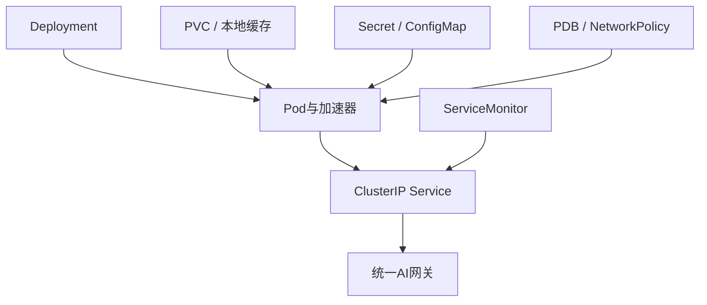

# 生产级Kubernetes部署清单——把“能运行”变成“可上线”

:::info 系列与定位
**系列**：《NVIDIA＋昇腾双资源池 AI 推理集群：从 0 到部署、运维与故障排查》
**阶段**：第七阶段——生产服务
**本文定位**：生产部署基线、YAML 骨架、发布与回滚检查表
:::

:::tip 系列约定
资源池 A = **NVIDIA GPU**（vLLM）· 资源池 B = **华为昇腾 NPU**（vLLM-Ascend）· 同一 Kubernetes · 共享存储/网关/监控 · **禁止**跨池组成同一分布式模型实例。
:::

前面已经完成两类资源池、共享存储、模型预热，以及 NVIDIA vLLM 和 vLLM-Ascend 部署。此时 Pod 能启动，并不等于服务可以安全上线。

生产级部署至少要回答：模型加载十几分钟时探针会不会反复杀掉？Pod `Running` 时模型是否真的能回答？升级时还有没有可用副本？节点维护时能否避免同时驱逐所有副本？客户端断开后推理是否仍占设备？怎样限制谁能访问推理端口？新版本错误时能否快速回滚？

本文不再重复驱动和推理框架安装，而是把第 22、23 篇的工作负载提升为可发布、可观测、可回滚的生产服务。

对照：[第 22 篇 NVIDIA 部署](./22-在NVIDIA机器部署原生vLLM.md) · [第 23 篇昇腾部署](./23-在昇腾机器部署vLLM-Ascend.md) · [第 24 篇多机通信](./24-多卡多机NCCL路线与HCCL路线.md)。

## 1. 学完本文应掌握什么 {/* #一学完本文应掌握什么 */}

区分「容器存活」「服务就绪」和「业务可用」；为冷启动设计 startup/readiness/liveness；正确选择滚动更新、蓝绿或停机更新；用 PDB 和拓扑分散降低计划内中断风险；配置资源、权限、存储、优雅终止和网络边界；发布前完成合成请求与指标验收；通过 Deployment 历史快速回滚；为两池维护同结构、不同参数的部署模板。

## 2. 什么叫「生产级」 {/* #二什么叫生产级 */}

| 能力 | 最低要求 | 验收方式 |
|------|----------|----------|
| 可重复 | 镜像、模型、配置可追溯 | 不可变版本或摘要 |
| 可调度 | 只进入正确资源池 | Label、Taint、设备资源 |
| 可用 | 未加载完成不接流量 | readiness 和合成请求 |
| 可恢复 | 故障能重启、切换、回滚 | 故障与回滚演练 |
| 可观测 | 能看请求、队列、显存/HBM 和错误 | 指标、日志、Trace、告警 |
| 可保护 | 身份、权限、网络和密钥受控 | 网关鉴权、RBAC、NetworkPolicy |
| 可变更 | 发布步骤、门槛和停止条件明确 | 发布 SOP |
| 可容量化 | 知道一个副本需要多少完整设备组 | 压测和容量表 |

:::caution
同一个分布式推理实例内部不能混用 NVIDIA GPU 与昇腾 NPU。双资源池的统一发生在 Kubernetes 控制面、网关、存储和运维层，不发生在一个模型进程组内部。
:::

## 3. 一个生产服务包含哪些对象 {/* #三一个生产服务包含哪些对象 */}



| 对象 | 作用 | 不应承担的职责 |
|------|------|----------------|
| Deployment | 副本、更新、回滚 | 编排跨多机紧耦合 Rank 组 |
| LWS/专用 Operator | 多机推理组 | 普通单 Pod 副本管理 |
| Service | 稳定服务发现和负载入口 | 用户认证、Token 配额 |
| Gateway/Ingress | TLS、鉴权、限流、路由 | 设备调度 |
| PDB | 约束部分自愿驱逐 | 防止掉电、进程崩溃 |
| NetworkPolicy | 限制 Pod 网络访问 | 替代应用鉴权 |
| ServiceMonitor | 指标采集声明 | 保存业务日志 |

多机紧耦合实例应使用 LeaderWorkerSet、Ray、MPI Operator 或厂商编排，不要把相互依赖的 Rank 伪装成几个独立 Deployment 副本。

## 4. 上线前必须冻结四类版本 {/* #四上线前必须冻结四类版本 */}

| 类型 | 应记录 |
|------|--------|
| 镜像 | 仓库、tag、digest、CUDA/CANN、vLLM/vLLM-Ascend、构建流水线编号；不用 `latest` |
| 模型 | revision、权重哈希、Tokenizer、Chat Template、量化、最大上下文、业务别名 |
| 运行参数 | TP/PP、dtype/量化、max-model-len、内存利用率、max-num-seqs、端口与 API 前缀 |
| 平台兼容矩阵 | 节点型号 → 固件 → 驱动 → Runtime → 框架镜像 → 模型格式 → 已验证参数 |

「另一池同版本能运行」不能作为本池兼容性证据。

## 5. 生产 YAML 骨架 {/* #五生产-yaml-骨架 */}

下面以 NVIDIA 池单机单卡副本为例，是教学骨架，不是万能可直接上线模板。

```yaml
apiVersion: v1
kind: ServiceAccount
metadata:
  name: model-a
  namespace: ai-serving
automountServiceAccountToken: false
---
apiVersion: v1
kind: ConfigMap
metadata:
  name: model-a-config
  namespace: ai-serving
data:
  MODEL_PATH: /models/model-a
  SERVED_MODEL_NAME: company-model-a
  MAX_MODEL_LEN: "8192"
---
apiVersion: apps/v1
kind: Deployment
metadata:
  name: model-a-nvidia
  namespace: ai-serving
  labels:
    app.kubernetes.io/name: model-a
    app.kubernetes.io/component: inference
    accelerator.vendor: nvidia
spec:
  replicas: 2
  minReadySeconds: 30
  progressDeadlineSeconds: 1800
  strategy:
    type: RollingUpdate
    rollingUpdate:
      maxUnavailable: 0
      maxSurge: 1
  selector:
    matchLabels:
      app.kubernetes.io/name: model-a
      accelerator.vendor: nvidia
  template:
    metadata:
      labels:
        app.kubernetes.io/name: model-a
        app.kubernetes.io/component: inference
        accelerator.vendor: nvidia
        resource-pool: nvidia-pool
    spec:
      serviceAccountName: model-a
      automountServiceAccountToken: false
      priorityClassName: ai-online-high
      terminationGracePeriodSeconds: 180
      nodeSelector:
        accelerator.vendor: nvidia
        resource-pool: nvidia-pool
      tolerations:
        - key: accelerator
          operator: Equal
          value: nvidia
          effect: NoSchedule
      topologySpreadConstraints:
        - maxSkew: 1
          topologyKey: kubernetes.io/hostname
          whenUnsatisfiable: DoNotSchedule
          labelSelector:
            matchLabels:
              app.kubernetes.io/name: model-a
              accelerator.vendor: nvidia
      containers:
        - name: server
          image: registry.example.com/ai/vllm-nvidia:0.10.0-company.3
          imagePullPolicy: IfNotPresent
          args:
            - --model=$(MODEL_PATH)
            - --served-model-name=$(SERVED_MODEL_NAME)
            - --host=0.0.0.0
            - --port=8000
            - --max-model-len=$(MAX_MODEL_LEN)
            - --tensor-parallel-size=1
          envFrom:
            - configMapRef:
                name: model-a-config
          ports:
            - name: http
              containerPort: 8000
          resources:
            requests:
              cpu: "8"
              memory: 32Gi
              nvidia.com/gpu: "1"
            limits:
              cpu: "8"
              memory: 32Gi
              nvidia.com/gpu: "1"
          startupProbe:
            httpGet:
              path: /health
              port: http
            periodSeconds: 10
            timeoutSeconds: 3
            failureThreshold: 180
          readinessProbe:
            httpGet:
              path: /health
              port: http
            periodSeconds: 5
            timeoutSeconds: 2
            failureThreshold: 3
          livenessProbe:
            httpGet:
              path: /health
              port: http
            periodSeconds: 30
            timeoutSeconds: 3
            failureThreshold: 5
          lifecycle:
            preStop:
              exec:
                command: ["/bin/sh", "-c", "sleep 20"]
          securityContext:
            allowPrivilegeEscalation: false
            capabilities:
              drop: ["ALL"]
          volumeMounts:
            - name: models
              mountPath: /models
              readOnly: true
            - name: shm
              mountPath: /dev/shm
            - name: cache
              mountPath: /cache
      volumes:
        - name: models
          persistentVolumeClaim:
            claimName: models-ro
        - name: shm
          emptyDir:
            medium: Memory
            sizeLimit: 16Gi
        - name: cache
          emptyDir:
            sizeLimit: 20Gi
---
apiVersion: v1
kind: Service
metadata:
  name: model-a-nvidia
  namespace: ai-serving
  labels:
    app.kubernetes.io/name: model-a
    accelerator.vendor: nvidia
spec:
  type: ClusterIP
  selector:
    app.kubernetes.io/name: model-a
    accelerator.vendor: nvidia
  ports:
    - name: http
      port: 8000
      targetPort: http
```

生产推理优先 ClusterIP，由统一网关暴露，不要给每个模型都创建 NodePort 或公网 LoadBalancer。应用不访问 Kubernetes API 时，不要自动挂载 ServiceAccount Token。

## 6. 怎样把模板改成昇腾池 {/* #六怎样把模板改成昇腾池 */}

| 项目 | NVIDIA 池 | 昇腾池 |
|------|-----------|--------|
| Deployment / Service | `model-a-nvidia` | `model-a-ascend` |
| 节点 / 资源池标签 | `nvidia` / `nvidia-pool` | `ascend` / `ascend-pool` |
| Taint 容忍 | `accelerator=nvidia` | `accelerator=ascend` |
| 设备资源名 | `nvidia.com/gpu` | 以已安装 Device Plugin 实际公布名为准 |
| 镜像与参数 | CUDA/vLLM 已验证组合 | CANN/vLLM-Ascend 已验证组合 |
| 健康检查 | `/health` | 按冻结镜像实测确认 |

```bash
kubectl get node -l accelerator.vendor=ascend \
  -o custom-columns=NAME:.metadata.name,ALLOCATABLE:.status.allocatable
```

不要从网络文章复制一个昇腾资源名后直接写进生产 YAML。

## 7. 三种探针应该怎样分工 {/* #七三种探针应该怎样分工 */}

| 探针 | 职责 | 注意 |
|------|------|------|
| startupProbe | 给冷启动留时间；成功前 readiness/liveness 不接管 | 窗口按 P99 冷启动设置，如 10s×180≈30 分钟 |
| readinessProbe | 决定是否接流量；失败通常不重启，但从端点移除 | 浅 `/health` 可能不够，应用合成请求补充 |
| livenessProbe | 只处理无法自行恢复的卡死 | 比 readiness 保守，勿把高延迟当死亡 |

探针不是业务验收。建议：Kubernetes 探针（秒级）+ 外部合成请求（1～5 分钟）。

## 8. 滚动更新为什么经常卡在设备容量上 {/* #八滚动更新为什么经常卡在设备容量上 */}

`maxUnavailable: 0` + `maxSurge: 1` 要求先额外创建新副本——资源池中还要有一个完整推理副本的空闲资源。若每副本 8 卡且全部已分配：新 Pod Pending → 永不 Ready → 旧 Pod 不删 → 发布停滞。

| 方案 | 可用性 | 额外设备 | 适用 |
|------|--------|----------|------|
| 滚动更新 | 高 | 至少一个完整副本 | 有预留容量 |
| 蓝绿 | 高 | 一套新版本容量 | 大版本、强验证 |
| 金丝雀 | 高 | 少量新版本容量 | 按流量逐步验证 |
| Recreate | 有中断 | 无 | 非关键或资源极紧张 |

`progressDeadlineSeconds` 也要覆盖冷启动和调度时间。

## 9. PDB 能保护什么，不能保护什么 {/* #九pdb-能保护什么不能保护什么 */}

```yaml
apiVersion: policy/v1
kind: PodDisruptionBudget
metadata:
  name: model-a-nvidia
  namespace: ai-serving
spec:
  minAvailable: 1
  selector:
    matchLabels:
      app.kubernetes.io/name: model-a
      accelerator.vendor: nvidia
```

两副本时 `minAvailable: 1` 表示自愿中断（如 drain）时至少保留一个健康副本。PDB **不能**保证：掉电、内核崩溃、硬件故障、直接删 Pod、错误滚动策略、两副本同故障域、Ready 但业务不可用。维护前同时检查 PDB、Pod、Deployment。必须配合 `topologySpreadConstraints` 或反亲和分散到不同主机。

## 10. 资源配置与 QoS {/* #十资源配置与-qos */}

```text
单副本设备数 = TP × PP（以实际框架拓扑为准）
总设备需求 = 副本数 × 单副本设备数 + 发布预留 + 故障预留
```

CPU/内存不能随便写；Guaranteed QoS（requests=limits）利于稳定，但过低 limit 会节流——先压测再留余量。内存型 emptyDir 的 `/dev/shm` 占用仍受 Pod 内存和节点容量约束。

## 11. 优雅终止不是简单 sleep {/* #十一优雅终止不是简单-sleep */}

```text
端点进入终止 → preStop → SIGTERM
→ 等待 terminationGracePeriodSeconds → 超时 SIGKILL
```

`preStop` 的 `sleep 20` 只是缓冲，不是真正排空。完整方案：readiness 先失败 → 网关停发新请求 → 应用处理 SIGTERM → 等待在途结束 → 超时有明确处置；客户端重试要有幂等边界。最长生成 120 秒时，`terminationGracePeriodSeconds: 30` 通常不够。

```bash
kubectl delete pod -n ai-serving POD_NAME
kubectl get pod -n ai-serving POD_NAME -w
```

## 12. 十二～十三、权限、密钥与 NetworkPolicy {/* #十二十三权限密钥与-networkpolicy */}

基线：`allowPrivilegeEscalation: false`、`capabilities.drop: ["ALL"]`；镜像支持时再加 `readOnlyRootFilesystem` / `runAsNonRoot`，但须实测。敏感数据用 Secret 或外部密钥系统；客户端凭证与内部服务凭证分离。

```yaml
apiVersion: networking.k8s.io/v1
kind: NetworkPolicy
metadata:
  name: model-a-allow-gateway
  namespace: ai-serving
spec:
  podSelector:
    matchLabels:
      app.kubernetes.io/name: model-a
  policyTypes:
    - Ingress
  ingress:
    - from:
        - namespaceSelector:
            matchLabels:
              kubernetes.io/metadata.name: ai-gateway
          podSelector:
            matchLabels:
              app.kubernetes.io/component: ai-gateway
      ports:
        - protocol: TCP
          port: 8000
```

生效前确认 CNI 支持；若默认拒绝 Egress，须显式放行 DNS、存储、监控等真实依赖。

## 13. 发布前的七道门 {/* #十四发布前的七道门 */}

1. **静态检查**：`kubectl apply --dry-run=server`、`kubectl diff`、CI Schema/策略/扫描
2. **调度检查**：正确资源池、设备数、不跨池、副本分散、无意外 hostPath
3. **模型完整性**：revision、哈希、Tokenizer、Chat Template
4. **健康和日志**：`rollout status`、logs、EndpointSlice
5. **非流式合成请求**：状态、JSON、模型别名、输出、时延
6. **流式请求**：首 Token、缓冲、断开后任务释放
7. **容量和故障**：P50/P95/P99、TTFT、显存/HBM、删 Pod、PDB、回滚

```bash
curl -sS http://model-a-nvidia.ai-serving.svc:8000/v1/chat/completions \
  -H 'Content-Type: application/json' \
  -d '{
    "model": "company-model-a",
    "messages": [{"role": "user", "content": "只回答OK"}],
    "temperature": 0,
    "max_tokens": 8
  }'
```

## 14. 标准发布与回滚 SOP {/* #十五标准发布与回滚-sop */}

**发布前**：变更单含镜像/模型/参数/矩阵；同型号预验证；有额外完整设备组；告警清零或说明；已保存回滚命令；业务确认窗口与停止条件。

```bash
kubectl apply -f deployment.yaml
kubectl rollout status deployment/model-a-nvidia -n ai-serving --timeout=30m
kubectl rollout history deployment/model-a-nvidia -n ai-serving
```

**放量门槛**：Ready、合成成功、错误率/TTFT 未触停止线、显存与队列正常、无设备或通信错误。

```bash
kubectl rollout undo deployment/model-a-nvidia -n ai-serving
```

回滚 Deployment 不一定回滚外部模型目录和网关配置。发布单须把三者视作一个版本集合：工作负载 + 模型 + 路由配置。

## 15. 常见故障排查 {/* #十六常见故障排查 */}

| 现象 | 方向 |
|------|------|
| Pending | 设备不足、nodeSelector、Toleration、拓扑过严、PVC、配额 |
| 反复重启无明显错误 | startup/liveness、OOMKilled、冷启动窗口过短 |
| Running 但无端点 | Service selector、Label、readiness、EndpointSlice |
| 滚动卡住 | 新副本 Pending；增容量/改策略，勿随意删光旧副本 |
| 无法 drain | PDB；先确认他节点有完整设备组 |
| 删 Pod 流式中断 | readiness、网关排空、SIGTERM、宽限期、客户端重试 |

## 16. 十七～十八、双池检查表与练习 {/* #十七十八双池检查表与练习 */}

**公共层**：Namespace/RBAC 最小化；版本可追溯；探针基于真实冷启动；ClusterIP；跨节点分散；PDB 已演练；NetworkPolicy 已验证；流式/非流式合成；发布与回滚条件明确；可观测已接入。
**NVIDIA**：vendor/pool/taint、`nvidia.com/gpu` 与 TP/PP、CUDA/驱动/vLLM 冻结。
**昇腾**：vendor/pool/taint、资源名来自当前 Plugin、固件/驱动/CANN/vLLM-Ascend 冻结。

**练习 1**：16 卡池、每副本 4 卡、已跑 3 副本——算 `maxSurge: 1` 能否创建新副本；容忍一台 4 卡维护是否够；不够时选扩容、降副本还是改策略。
**练习 2**：人为延长启动，观察探针过短与合理时的行为。
**练习 3**：发布不会 Ready 的测试版本，验证进展失败、旧副本仍服务、`rollout undo`、网关与模型目录是否也需回滚。

## 17. 本篇小结 {/* #十九本篇小结 */}

```text
版本冻结 → 正确调度 → 模型启动 → 就绪接流量
→ 指标与合成请求验收 → 小流量放量 → 稳态运行
→ 故障排空与回滚
```

五个结论：Running ≠ Ready ≠ 业务可用；三种探针职责不同；`maxSurge` 需要真实空闲设备；PDB 只约束部分自愿中断，须配合拓扑分散；两池模板结构可统一，镜像/资源名/参数/验收必须分别维护。

下一篇将把两个池的内部 Service 收敛到统一 AI 网关，对外暴露 OpenAI 兼容接口，并处理 TLS、鉴权、限流、流式响应和可观测性。

## 18. 参考资料 {/* #参考资料 */}

- [Configure Liveness, Readiness and Startup Probes](https://kubernetes.io/docs/tasks/configure-pod-container/configure-liveness-readiness-startup-probes/)
- [Deployments](https://kubernetes.io/docs/concepts/workloads/controllers/deployment/)
- [Pod Disruption Budgets](https://kubernetes.io/docs/concepts/workloads/pods/disruptions/)
- [Topology Spread Constraints](https://kubernetes.io/docs/concepts/scheduling-eviction/topology-spread-constraints/)
- [Container Lifecycle Hooks](https://kubernetes.io/docs/concepts/containers/container-lifecycle-hooks/)
- [Security Context](https://kubernetes.io/docs/tasks/configure-pod-container/security-context/)
- [Network Policies](https://kubernetes.io/docs/concepts/services-networking/network-policies/)
- [vLLM Kubernetes](https://docs.vllm.ai/en/latest/deployment/k8s.html)

## 19. 相关链接 {/* #相关链接 */}

- [专栏目录](./00-专栏目录.md)
- [第 24 篇：NCCL 与 HCCL 多卡多机](./24-多卡多机NCCL路线与HCCL路线.md)
- [第 22 篇：NVIDIA 池部署原生 vLLM](./22-在NVIDIA机器部署原生vLLM.md)
- [第 23 篇：昇腾池部署 vLLM-Ascend](./23-在昇腾机器部署vLLM-Ascend.md)

← [第 24 篇](./24-多卡多机NCCL路线与HCCL路线.md) · → [第 26 篇：统一OpenAI兼容网关](./26-通过网关暴露统一OpenAI兼容接口.md)
