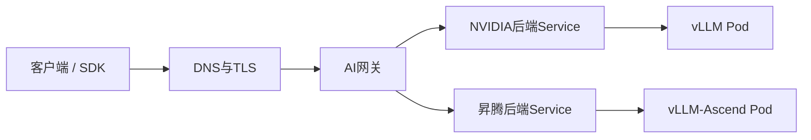
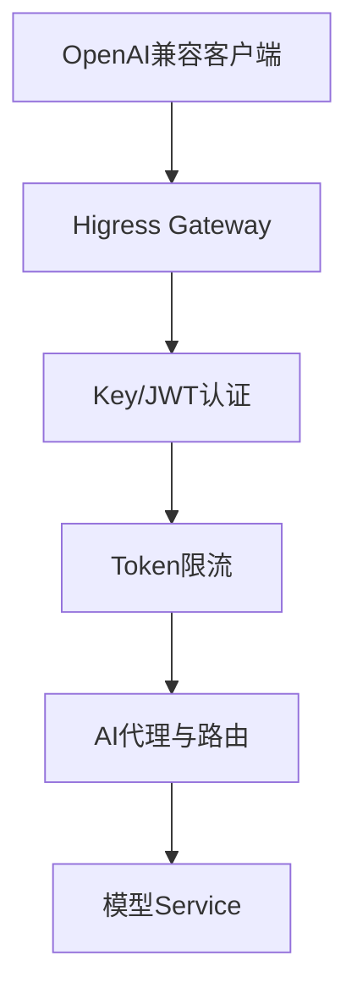

# 用统一网关暴露OpenAI兼容接口——TLS、鉴权、限流与流式传输

:::info 系列与定位
**系列**：《NVIDIA＋昇腾双资源池 AI 推理集群：从 0 到部署、运维与故障排查》  
**阶段**：第七阶段——生产服务  
**本文定位**：统一入口、OpenAI 兼容协议、Higress/NGINX 落地与安全验收篇
:::

:::tip 系列约定
资源池 A = **NVIDIA GPU**（vLLM）· 资源池 B = **华为昇腾 NPU**（vLLM-Ascend）· 同一 Kubernetes · 共享存储/网关/监控 · **禁止**跨池组成同一分布式模型实例。
:::

[第 25 篇](./25-编写生产级双池Kubernetes部署模板.md) 已经把推理服务变成集群内部的生产工作负载。NVIDIA 池有 `model-a-nvidia.ai-serving.svc:8000`，昇腾池有 `model-a-ascend.ai-serving.svc:8000`。

若把这两个地址直接交给用户，会遇到：用户需要知道底层硬件；每个模型单独做 TLS；API Key 散落；无法按租户限流审计；切换资源池要改客户端；流式可能被代理缓冲；无法统一记录首 Token 时延和 Token 用量。

正确做法是提供稳定入口：

```text
https://ai-api.example.com/v1/chat/completions
model = company-model-a
```

客户端只认识业务模型别名，不认识 NVIDIA、昇腾、Pod IP 或内部 Service。

---

## 一、学完本文应掌握什么

画出客户端到推理 Pod 的完整请求链；解释模型别名为何与硬件解耦；区分 TLS、认证、授权、限流和后端 API Key；正确代理普通响应与 SSE；用 Higress 或 NGINX 建立入口；设置连接、首 Token、流空闲和总请求超时；设计不泄露 Prompt 和密钥的访问日志；验证 401/403/413/429/5xx 和客户端中断。

---

## 二、请求经过哪些层



| 层 | 主要职责 |
|----|----------|
| DNS/LB | 稳定域名、把流量送到网关 |
| TLS | 传输加密、服务端身份验证，必要时 mTLS |
| AI 网关 | 客户端认证、租户授权、限流、路由、审计、指标 |
| Kubernetes Service | 找到同一后端的就绪 Pod |
| vLLM / vLLM-Ascend | 模型推理、OpenAI 兼容协议 |
| Pod/设备 | 实际计算 |

网关不是设备调度器。GPU/NPU 节点选择仍由 Label、Taint 和扩展资源完成。

---

## 三、先统一 API 契约

**统一域名和路径**：`POST /v1/chat/completions`、`GET /v1/models`。embeddings、rerank、responses 等需逐个验证后列入契约。

**统一业务模型别名**：客户端请求 `company-model-a`；底层可能是不同 revision 与厂商目录。业务别名必须稳定，物理权重目录、镜像和硬件类型可以变化。

| 协议项 | 验证内容 |
|--------|----------|
| 普通 / 流式响应 | 状态码、JSON、usage；`text/event-stream`、分块与结束标记 |
| 模型字段 | 别名是否一致 |
| 错误格式 | 400、401、404、429、5xx 结构 |
| Tool Calling / Structured Output | 字段、流式增量、Schema 边界 |
| Token 统计 | 输入、输出、缓存 Token 口径 |
| 取消请求 | 客户端断开后后端是否停止 |

兼容不等于完全一致。

---

## 四、必须分开的两类凭证

```text
客户端Key ──验证于──> 网关
网关内部Key ──验证于──> 推理后端
```

客户端凭证识别：谁、哪个租户、能访问哪些模型、多少配额。后端凭证防止绕过网关。两类 Key 不能相同，内部 Key 不能返回给客户端，也不能写入访问日志。

推荐顺序：TLS → 提取身份 → 验证签名或 API Key → 校验租户与模型权限 → 检查并发/QPS/Token 配额 → 路由后端。

---

## 五、为什么 AI 网关不能只做 QPS 限流

100 Token 与 34000 Token 的请求成本完全不同。只限制「每秒 10 个请求」仍可能被少量超长请求压垮。

| 保护 | 解决的问题 |
|------|------------|
| 请求体大小限制 | 防止异常巨大的 HTTP Body |
| QPS/请求速率 | 防止短时请求洪峰 |
| 并发限制 | 限制同时占用推理槽的请求 |
| Token 配额 | 按输入/输出工作量计量 |

模型服务层还要限制 `max_model_len`、`max_tokens`、`max_num_seqs`、批处理与 KV 容量。入口侧可近似计算输入并对 `max_tokens` 做预算；出口侧再按真实 usage 结算。过载时应尽早返回明确 429，而不是全部等到 504。

---

## 六、选择 Higress 还是 NGINX

| 维度 | Higress AI Gateway | NGINX 基线代理 |
|------|--------------------|----------------|
| OpenAI 协议感知 | 有 AI 代理和模型相关能力 | 默认只理解 HTTP |
| API Key/JWT、Token 限流、AI 指标 | 插件化较完整 | 需配置或外接组件 |
| 多模型路由/回退 | AI 场景能力较完整 | 需自行设计 |
| 简单透明代理 | 可以 | 很适合 |
| 运维复杂度 | 需学习插件与控制面 | 配置简单，高级能力需自建 |

生产多租户优先评估 Higress 等 AI Gateway；小规模内网单一模型可先用 NGINX。无论选哪种，先定义 API、安全、流式和可观测契约。

---

## 七、Higress 落地思路



实施顺序：安装兼容版本 → 配置证书 → 创建指向模型 Service 的路由 → Key/JWT Auth → 租户与模型授权 → Redis + AI Token 限流 → AI Statistics → 验证 SSE/错误码/超时 → 再配置多后端权重与故障回退。

第一阶段先只接一个稳定后端：

```text
ai-api.example.com/v1/* → model-a-nvidia.ai-serving.svc:8000
```

昇腾后端通过等价性验收后，再进入第 28 篇双池路由。

| 需求 | Higress 能力 |
|------|--------------|
| 后端 OpenAI 协议转换/代理 | AI Proxy |
| API Key / JWT | Key Auth / JWT Auth |
| Token 维度配额 | AI Token Rate Limit |
| AI 指标、日志和 Trace | AI Statistics |

生产清单应固定 Higress 版本，并以该版本官方文档生成配置。平台配置表至少包含：外部域名、路径、业务模型、默认后端、客户认证、允许租户、请求体上限、单租户并发、Token 配额、连接超时、流空闲超时、日志脱敏。

---

## 八、用 Gateway API 表达基础路由

```yaml
apiVersion: gateway.networking.k8s.io/v1
kind: HTTPRoute
metadata:
  name: model-a-api
  namespace: ai-serving
spec:
  parentRefs:
    - name: ai-public-gateway
      namespace: ai-gateway
  hostnames:
    - ai-api.example.com
  rules:
    - matches:
        - path:
            type: PathPrefix
            value: /v1
      backendRefs:
        - name: model-a-nvidia
          port: 8000
```

跨命名空间挂到 Gateway 时看 Listener 的 `allowedRoutes`；`backendRefs` 跨命名空间引用 Service 时需要 ReferenceGrant。检查 Status 中的 Accepted、ResolvedRefs，不要只看对象已创建。Gateway API 不会自动完成租户认证、Token 计费或模型语义兼容。

---

## 九、NGINX 最小可用配置

```nginx
upstream model_a_backend {
    least_conn;
    server model-a-nvidia.ai-serving.svc.cluster.local:8000;
    keepalive 64;
}

server {
    listen 443 ssl http2;
    server_name ai-api.example.com;

    ssl_certificate     /etc/nginx/tls/tls.crt;
    ssl_certificate_key /etc/nginx/tls/tls.key;

    client_max_body_size 10m;

    location /v1/ {
        proxy_pass http://model_a_backend;
        proxy_http_version 1.1;
        proxy_set_header Connection "";

        proxy_set_header Host $host;
        proxy_set_header X-Request-ID $request_id;
        proxy_set_header X-Real-IP $remote_addr;
        proxy_set_header X-Forwarded-For $proxy_add_x_forwarded_for;
        proxy_set_header X-Forwarded-Proto $scheme;

        proxy_connect_timeout 5s;
        proxy_send_timeout 600s;
        proxy_read_timeout 600s;

        proxy_buffering off;
        proxy_cache off;
    }
}
```

| 配置 | 作用 |
|------|------|
| `proxy_http_version 1.1` + `Connection ""` | 上游长连接与流式基础 |
| `proxy_buffering off` / `proxy_cache off` | 避免 SSE 被成批发送、不缓存生成结果 |
| `proxy_read_timeout` | 两次上游读取之间的空闲时间 |
| `client_max_body_size` | 限制请求体 |
| `X-Request-ID` | 串联客户端、网关和后端日志 |

`proxy_read_timeout 600s` 不表示整个请求只能跑 600 秒。还缺：客户端认证授权、Token 配额、分布式限流、细粒度审计、自动故障切换、内容安全、密钥轮换。不要把「HTTPS 能访问」当成网关建设完成。

---

## 十～十一、流式 SSE 与分层超时

SSE 典型：`Content-Type: text/event-stream`，`data:` 分块，`data: [DONE]`。链路上任何一层缓冲或过早超时，都可能变成「后端已逐 Token 生成，客户端最后一次性收到」。

```bash
curl -N https://ai-api.example.com/v1/chat/completions \
  -H 'Authorization: Bearer CLIENT_API_KEY' \
  -H 'Content-Type: application/json' \
  -d '{
    "model": "company-model-a",
    "messages": [{"role": "user", "content": "从1慢慢数到20"}],
    "stream": true,
    "max_tokens": 100
  }'
```

一起检查：客户端 SDK、公网/内网 LB 空闲超时、网关缓冲、HTTP 版本、后端 flush、Service Mesh。

| 超时 | 含义 | 常见处理 |
|------|------|----------|
| 连接超时 | 网关连接后端 | 较短，秒级 |
| 请求头/体超时 | 客户端上传允许多久 | 防慢速攻击 |
| 排队超时 | 最多等多久才执行 | 超时后 429/503 |
| 首 Token 超时 | 多久必须收到第一个 Token | 对体验关键 |
| 流空闲超时 | 两数据块之间最大间隔 | 防止僵尸连接 |
| 总请求期限 | 整个生成最多多久 | 由业务 SLO 决定 |

最终受最短那一层限制：客户端 &lt; 外部 LB &lt; 网关 &lt; Mesh &lt; 后端。

---

## 十二～十三、访问日志与安全基线

**推荐字段**：timestamp、request_id/trace_id、tenant_id、user_id_hash、model_alias、backend_pool、backend_service、http_status、stream、时长、TTFT、input/output tokens、queue_time、retry_count、fallback_reason。

**默认不记录**：Authorization、完整 API Key、原始 Prompt、完整输出、附件、身份证/手机号等。审计留存须单独授权、脱敏、加密和保留期限设计。

安全基线：外部只开放 TLS；证书续期告警；客户端 Key 与后端 Key 分离；Key 有租户/模型/环境范围与轮换吊销；Authorization 不进日志；请求体限制；QPS/并发/Token 均有预算；CORS 最小化；管理接口不公网；网关到后端受 NetworkPolicy；异常与认证失败有告警。

:::caution
不要让客户端控制内部路由头。`X-AI-Pool: nvidia|ascend` 只能供可信运维或内部灰度使用；外部同名 Header 应删除、覆盖或拒绝。
:::

---

## 十四、完整验收用例

| 用例 | 期望 |
|------|------|
| 正常非流式 / 流式 | 成功；流式逐块到达，记录首块与总时长 |
| 无认证 | 401，不转发后端 |
| 无模型权限 | 403 或平台拒绝状态，有审计 |
| 请求体过大 | 尽早 413，不全量转后端 |
| 超过配额 | 429；如有 `Retry-After` 客户端应遵守 |
| 后端不可用 | 状态码与超时符合预期；告警；不误重试非幂等；不泄露内部地址 |
| 客户端中断 | 后端活动请求与设备利用率及时下降 |

---

## 十五、常见故障排查

| 现象 | 方向 |
|------|------|
| 普通正常、流式一次性返回 | curl `-N` → Content-Type → 网关缓冲 → 外层 LB → Mesh → 后端 flush |
| 固定 60 秒断开 | 逐层核对客户端、外部 LB、网关、Sidecar、后端超时 |
| 502 | Service/EndpointSlice、Ready、NetworkPolicy、上游重置、后端崩溃 |
| 504 | 区分执行慢、队列过长、首 Token 慢、无响应、超时太短；过载应限流/扩容/快速失败，勿盲目改 1 小时 |
| 租户互相影响 | 按身份和模型设配额/并发/优先级 |
| 能绕过网关直访后端 | NodePort/LB、NetworkPolicy、后端内部 Key |

```bash
kubectl get svc,endpointslice -n ai-serving
kubectl get pod -n ai-serving -o wide
kubectl logs -n ai-gateway GATEWAY_POD --tail=200
```

---

## 十六～十七、上线检查表与练习

**API 契约**：域名路径别名稳定；流式/非流式通过；错误结构有文档；高级功能逐项验收。  
**安全**：TLS、认证授权轮换、密钥隔离、后端仅网关、日志不落密钥与 Prompt。  
**容量保护**：请求体/上下文/输出上限；QPS/并发/Token 已压测；429 与退避已验证；各层超时一致。  
**可观测**：request_id 贯穿；状态码/TTFT/总时延/Token；按租户模型资源池聚合；5xx/429/认证失败告警。

**练习 1**：NGINX 最小入口测普通、流式、后端缩 0、客户端中断。  
**练习 2**：为两个租户设计可用模型、最大并发、每分钟 Token、最大上下文、优先级，解释为何不能只设 QPS。  
**练习 3**：故意打开代理缓冲再用 `curl -N` 观察，关闭后对比首块时间，写入运维手册。

---

## 十八、本篇小结

```text
客户端
→ 统一域名和 OpenAI 兼容契约
→ TLS、认证、授权
→ QPS、并发、Token 保护
→ 路由与流式代理
→ NVIDIA 或昇腾推理 Service
```

六个结论：客户端只认识业务模型别名；客户端与后端凭证必须分离；AI 限流不能只有 QPS；SSE 需逐层查缓冲与超时；网关日志记性能与路由，默认不记 Prompt 和密钥；OpenAI 兼容是需要测试的协议契约。

下一篇解决：一个后端有多个副本时怎样均衡流量，以及怎样根据队列、TTFT 等指标安全扩缩容。

---

## 参考资料

- [Higress](https://higress.io/)
- [Gateway API HTTP Routing](https://gateway-api.sigs.k8s.io/guides/http-routing/)
- [NGINX HTTP Proxy](https://nginx.org/en/docs/http/ngx_http_proxy_module.html)
- [vLLM Security](https://docs.vllm.ai/en/latest/security/)

---

## 相关链接

- [专栏目录](./00-专栏目录.md)
- [第 25 篇：生产级 K8s 部署清单](./25-编写生产级双池Kubernetes部署模板.md)
- [第 27 篇：多副本负载均衡与自动扩缩容](./27-多副本负载均衡与自动扩缩容.md)

---

← [第 25 篇](./25-编写生产级双池Kubernetes部署模板.md) · → [第 27 篇：多副本负载均衡与扩缩容](./27-多副本负载均衡与自动扩缩容.md)
