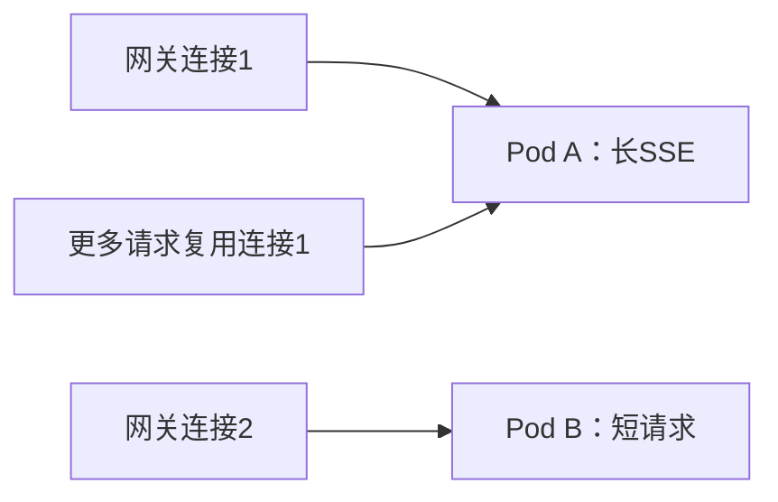
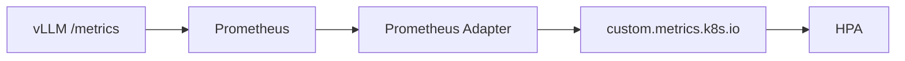

# 多副本、负载均衡与扩缩容——让推理服务既扛流量又不抖动

:::info 系列与定位
**系列**：《NVIDIA＋昇腾双资源池 AI 推理集群：从 0 到部署、运维与故障排查》  
**阶段**：第七阶段——生产服务  
**本文定位**：推理副本、长连接负载均衡、HPA 自定义指标与容量保护篇
:::

:::tip 系列约定
资源池 A = **NVIDIA GPU**（vLLM）· 资源池 B = **华为昇腾 NPU**（vLLM-Ascend）· 同一 Kubernetes · 共享存储/网关/监控 · **禁止**跨池组成同一分布式模型实例。
:::

[第 26 篇](./26-通过网关暴露统一OpenAI兼容接口.md) 已经建立统一 OpenAI 兼容入口。现在假设 NVIDIA 池中运行两个模型副本。把 `replicas: 1` 改成 `2` 很容易，但生产问题才刚开始：两个 Pod 是否真的各承担一半工作？长时间 SSE 会不会都粘在一个 Pod？GPU 利用率高是否就该扩容？新 Pod 加载 15 分钟期间流量怎么办？HPA 创建了 Pod 但资源池没有空闲卡怎么办？流量下降后怎样避免频繁缩扩？

本文把「扩副本」拆成负载均衡、容量指标、调度容量、冷启动和稳定性五个部分。

---

## 一、学完本文应掌握什么

正确理解一个「推理副本」实际包含几张卡；解释 Service 为何不理解 Token 和 KV Cache；为普通请求、SSE 和前缀缓存选择路由策略；用 vLLM 队列、TTFT、KV Cache 判断容量；建立 Prometheus → HPA 自定义指标链路；设计适合冷启动的扩缩容速度与稳定窗口；处理 Pod 扩出却因设备不足 Pending；通过限流、排队上限和 429 保护系统。

---

## 二～三、什么是一个副本；多副本解决什么

| 形态 | 一个副本包含什么 |
|------|------------------|
| 单卡推理 | 1 个 Pod + 1 张 GPU/NPU |
| 单机多卡 TP | 1 个 Pod + 同机多张设备 |
| 多机 TP/PP | 1 个 Leader + 多个 Worker + 多台机器 |
| Prefill/Decode 分离 | 多个不同角色组成一个服务单元 |

`replicas: 2` 的业务含义是两个可独立完成请求的完整推理实例。单副本 4 张 GPU 时，2 副本需要 8 张，3 副本需要 12 张。跨机模型的扩容单位应是完整分布式组，不能只增加其中一个 Rank。

多副本可提升吞吐、降低单副本故障影响、支持滚动更新。**不能**自动解决：模型不正确、共享故障存储、副本同机、流量打到未 Ready 端点、资源池无设备、下游故障。

---

## 四～五、Service 怎样分配流量；AI 负载均衡策略

ClusterIP Service 把流量送到 Ready Endpoint，工作在连接层，不知道 Prompt Token、预计生成时长、谁在排队、KV 是否更空、谁刚预热、是否命中前缀缓存。HTTP Keep-Alive 和 SSE 会让 TCP 长时间停在同一后端——「两个 Endpoint」≠「工作量各占 50%」。



| 策略 | 优点 | 缺点 | 适用 |
|------|------|------|------|
| Round Robin | 简单 | 不理解请求成本和长连接 | 请求较均匀 |
| Least Connections | 适合长连接基础策略 | 连接数 ≠ Token 工作量 | SSE 较多 |
| Least Requests | 更接近实时负载 | 仍不理解 Prompt 长度 | 网关支持活动请求统计 |
| Queue-Aware | 送到队列较短副本 | 需实时指标 | 高并发推理 |
| Prefix-Cache-Aware | 提升共享前缀命中 | 可能造成热点 | 固定系统 Prompt、多轮会话 |
| 一致性哈希 | 会话/前缀稳定落点 | 扩缩容重映射、负载可能不均 | 明确需要粘性 |

起步：网关 `least_conn` / least-request → 观察活动请求、等待队列、TTFT → 再评估队列感知 → 确认缓存收益高于热点风险后再上前缀感知。不要默认 Cookie 粘性；无状态 OpenAI 请求通常不需要会话固定。

---

## 六～七、vLLM 容量指标；什么适合触发扩容

上线前在冻结镜像中核对实际指标名：

```bash
kubectl port-forward -n ai-serving pod/POD_NAME 8000:8000
curl -s http://127.0.0.1:8000/metrics | less
```

| 指标（稳定文档示例） | 用途 |
|----------------------|------|
| `num_requests_running` / `waiting` | 执行并发 / 是否排队 |
| `kv_cache_usage_perc` | 缓存压力 |
| `time_to_first_token_seconds` | 用户体验与 Prefill |
| `inter_token_latency` / `e2e_request_latency` | Decode 与整体 SLO |
| `request_queue_time` / prefill / decode 时间 | 扩容与过载判断 |
| `prompt_tokens` / `generation_tokens` | 工作量统计 |

| 信号 | 角色 | 注意 |
|------|------|------|
| 等待队列 / 排队时间 | **主要扩容信号** | 短时尖峰勿立刻扩出需 15 分钟启动的副本 |
| TTFT | SLO 保护 | 适合告警；高分位直连 HPA 可能迟滞抖动 |
| KV Cache | 容量解释 | 可能只是少量超长请求，不是唯一扩容信号 |
| GPU/NPU 利用率 | 解释指标 | 低不一定空闲，高不一定要扩；不适合唯一 HPA 信号 |
| 网关并发与 429 | 入口保护 | 与过载策略配合 |

推荐组合：主要用每 Pod 等待队列；SLO 看 TTFT 与错误率；解释看 KV、活动请求、Token 吞吐、设备利用率。

---

## 八～九、HPA 自定义指标链路与示例



ServiceMonitor 示意（端口名、权限按环境调整）：

```yaml
apiVersion: monitoring.coreos.com/v1
kind: ServiceMonitor
metadata:
  name: model-a-nvidia
  namespace: monitoring
spec:
  namespaceSelector:
    matchNames: ["ai-serving"]
  selector:
    matchLabels:
      app.kubernetes.io/name: model-a
      accelerator.vendor: nvidia
  endpoints:
    - port: http
      path: /metrics
      interval: 15s
```

记录规则示意（按实际 Label 调整）：

```yaml
groups:
  - name: ai-serving-capacity
    rules:
      - record: vllm_queue_depth
        expr: sum by (namespace, pod) (vllm:num_requests_waiting)
```

确认自定义指标 API 有返回后再建生产 HPA：

```bash
kubectl get --raw \
  '/apis/custom.metrics.k8s.io/v1beta1/namespaces/ai-serving/pods/*/vllm_queue_depth'
```

```yaml
apiVersion: autoscaling/v2
kind: HorizontalPodAutoscaler
metadata:
  name: model-a-nvidia
  namespace: ai-serving
spec:
  scaleTargetRef:
    apiVersion: apps/v1
    kind: Deployment
    name: model-a-nvidia
  minReplicas: 2
  maxReplicas: 6
  metrics:
    - type: Pods
      pods:
        metric:
          name: vllm_queue_depth
        target:
          type: AverageValue
          averageValue: "4"
  behavior:
    scaleUp:
      stabilizationWindowSeconds: 0
      selectPolicy: Max
      policies:
        - type: Pods
          value: 1
          periodSeconds: 60
    scaleDown:
      stabilizationWindowSeconds: 900
      selectPolicy: Min
      policies:
        - type: Pods
          value: 1
          periodSeconds: 600
```

含义示例：至少 2 热副本、最多 6、平均队列目标 4、每分钟最多 +1、缩容前观察 15 分钟、每 10 分钟最多 -1。真正阈值来自 TTFT SLO、冷启动、稳定吞吐、Prompt/输出分布、空闲设备和成本。多指标时 HPA 通常取最大建议值；先用一个可靠队列指标，再逐步加保护信号。

---

## 十～十一、扩 Pod ≠ 扩设备；min/maxReplicas

```text
HPA 从 2 扩到 3 → 创建新 Pod → 无完整设备组 → Pending → 实际容量仍是 2
```

三层：请求层（并发槽/限流，毫秒～秒）→ Pod 层（推理副本，分钟～几十分钟）→ 节点层（服务器，分钟～小时）。在线关键模型应保留热容量。

`minReplicas` 考虑高可用、基线流量、维护、冷启动、故障域；关键服务通常不适合 `0`。`maxReplicas` 须满足：

```text
maxReplicas × 单副本设备数 ≤ 资源池可分给该模型的设备配额
```

并为其它模型、发布 Surge、故障恢复留容量。例：32 卡池中模型 A 预算 16 卡、每副本 4 卡 → `maxReplicas = 4`；HPA 写成 10 也只会 Pending。

---

## 十二～十四、冷启动、慢缩容与过载策略

冷启动分段：调度 → 镜像 → PVC → 模型读取 → 装入显存/HBM → 编译/图 → 预热 → readiness。冷启动 15 分钟时，HPA 看到当前队列已经太晚——保留热副本、定时/预测扩容、预热、入口并发控制、排队上限与快速 429、非关键降级。

缩容要慢，避免扩缩容抖动：扩容相对快但受设备与预热限制；缩容观察较长稳定窗口；每次只缩少量完整副本；缩容前完成连接排空。

过载：正常区立即执行 → 排队区短时等待 → 拒绝区快速 429/503。客户端用指数退避与抖动，避免重试风暴。

---

## 十五～十六、双池分别扩缩容；与发布冲突

```text
Deployment/model-a-nvidia + HPA/model-a-nvidia  （按 pool=nvidia）
Deployment/model-a-ascend + HPA/model-a-ascend  （按 pool=ascend）
```

原因：单副本设备数、吞吐、冷启动、指标实现、配额、镜像与故障域都可能不同。建议 Label：`model_alias`、`accelerator_vendor`、`resource_pool`、`namespace`、`pod`；勿用 GPU 序号、请求 ID 等高基数 Label。

HPA 管理副本后，勿让 GitOps 固定覆盖 `spec.replicas`。`maxReplicas` 时滚动仍可能需要 Surge 设备。版本混跑须确认 API/别名/质量/指标 revision；不允许混跑则用蓝绿。

---

## 十七～十八、压测验收与故障排查

压测须覆盖短中长 Prompt、短长输出、流式/非流式、逐级并发、业务高级功能。记录单副本基线后再测多副本扩展效率：

```text
扩展效率 = 实际多副本吞吐 ÷（单副本吞吐 × 副本数）
```

按 Pod 看请求数、活动请求、队列、Token、TTFT、设备——请求数相同但 Token 差巨大仍不算均匀。

| 现象 | 方向 |
|------|------|
| HPA `<unknown>` | Prometheus 数据、Adapter、RBAC、Label、APIService |
| 已扩容但 Pending | 设备不足；扩节点、调预算，或网关限流/降级 |
| 负载极不均 | 长连接复用、粘性、Token 差异、readiness 抖动、端点、前缀热点 |
| 十几分钟扩缩一次 | 指标噪声、阈值过近、缩容窗口太短、周期批任务 |
| 利用率不高但 TTFT 差 | 队列、CPU/Tokenizer、Prompt、网络、通信、KV |
| Ready 后立刻报错 | 健康接口过浅；合成请求与预热门槛 |

```bash
kubectl get hpa -n ai-serving -w
kubectl get pod -n ai-serving -l app.kubernetes.io/name=model-a -w
kubectl describe hpa model-a-nvidia -n ai-serving
```

---

## 十九～二十、生产检查表与练习

**副本与调度**：设备拓扑已定义；最低副本跨节点或已接受风险；PDB/优雅终止已演练；max 不超配额；发布预留完整设备组。  
**负载均衡**：流式不压单 Pod；无必要不粘性；可按 Pod 观察；缓存感知经热点与故障测试。  
**HPA**：自定义指标可查；按 Pod 映射；阈值来自压测；扩容考虑冷启动；缩容窗口够长；指标缺失行为已测。  
**过载保护**：网关并发/QPS/Token；队列最大长度或等待；429 策略；客户端退避。

练习：对比 Round Robin 与 Least Connections 下流式分布；打通队列 HPA 全链路并记入 SOP；制造设备不足 Pending；填写双池单副本设备数、Token/s、P95 冷启动、min/max、发布与故障预留表。

---

## 二十一、本篇小结

```text
真实请求工作量 → 网关分配 → Pod 活动请求与队列
→ Prometheus → HPA → 调度完整设备组
→ 模型加载与预热 → readiness → 新容量接流量
```

六个结论：一个推理副本可能占多张卡甚至多台机器；Service 不理解 Token/队列/KV；队列和 TTFT 比单纯利用率更接近业务压力；HPA 只扩 Pod 不会创造设备；大模型要求热容量、相对快扩与慢缩；两池必须分别计算能力并分别扩缩容。

下一篇将把同一个业务模型同时部署在两个资源池，并实现权重分流、灰度、熔断、故障回退和灾备演练。

---

## 参考资料

- [Horizontal Pod Autoscaling](https://kubernetes.io/docs/tasks/run-application/horizontal-pod-autoscale/)
- [Deployments](https://kubernetes.io/docs/concepts/workloads/controllers/deployment/)
- [Topology Spread Constraints](https://kubernetes.io/docs/concepts/scheduling-eviction/topology-spread-constraints/)
- [vLLM Production Metrics](https://docs.vllm.ai/en/latest/serving/metrics.html)
- [vLLM Kubernetes](https://docs.vllm.ai/en/latest/deployment/k8s.html)

---

## 相关链接

- [专栏目录](./00-专栏目录.md)
- [第 26 篇：统一 OpenAI 兼容网关](./26-通过网关暴露统一OpenAI兼容接口.md)
- [第 28 篇：同模型双池路由与故障切换](./28-同模型双池部署统一路由与故障切换.md)

---

← [第 26 篇](./26-通过网关暴露统一OpenAI兼容接口.md) · → [第 28 篇：同模型双池路由与容灾](./28-同模型双池部署统一路由与故障切换.md)
