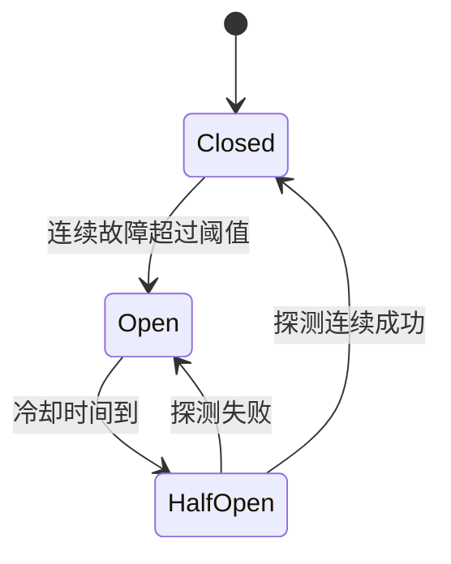
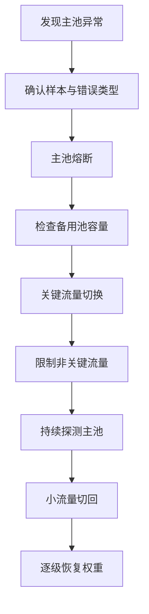

# 同模型双池路由与容灾——权重分流、熔断、回退和演练

:::info 系列与定位
**系列**：《NVIDIA＋昇腾双资源池 AI 推理集群：从 0 到部署、运维与故障排查》
**阶段**：第七阶段——生产服务
**本文定位**：NVIDIA 与昇腾同模型等价性、统一路由和灾难恢复实战篇
:::

:::tip 系列约定
资源池 A = **NVIDIA GPU**（vLLM）· 资源池 B = **华为昇腾 NPU**（vLLM-Ascend）· 同一 Kubernetes · 共享存储/网关/监控 · **禁止**跨池组成同一分布式模型实例。
:::

同一个业务模型已经分别部署为 `model-a-nvidia` 与 `model-a-ascend`，都能接收 `model = company-model-a`。但「双池都有 Pod」不等于「已具备双池容灾」。真正容灾还要回答：两边输出是否等价？正常流量怎样分配？怎样识别某池故障？哪些失败可安全切池？SSE 已发出一半怎么办？备用池是否有空闲容量？切换后怎样防止备用池被压垮？恢复后何时切回？

本篇拆成五道关：

```text
语义等价 → 路由策略 → 故障判定 → 安全回退 → 容量与演练
```

对照：[第 26 篇网关](./26-通过网关暴露统一OpenAI兼容接口.md) · [第 27 篇扩缩容](./27-多副本负载均衡与自动扩缩容.md)。

## 1. 学完本文应掌握什么 {/* #一学完本文应掌握什么 */}

为两池同模型建立等价性验收；区分主动—主动、主动—备用、灰度和人工切换；用 Gateway API 表达权重分流与内部 Header 灰度；解释「按权重路由」≠「自动故障回退」；按 HTTP 阶段和错误类型决定是否切池重试；为 SSE、Tool Calling 建立幂等边界；用健康、队列、SLO、设备状态驱动熔断；计算故障后剩余池能承接多少流量；编写并执行双池容灾演练 SOP。

## 2. 双池容灾的三个层次 {/* #二双池容灾的三个层次 */}

| 层次 | 含义 | 说明 |
|------|------|------|
| 1 部署冗余 | 两池都有模型实例 | 只证明能分别启动 |
| 2 流量冗余 | 网关能按策略发到任一池 | 路由可控，故障时未必安全切换 |
| 3 业务容灾 | 等价性、发现、安全回退、备用容量、降级、可观测、演练 | 才称生产容灾 |

## 3. 第一道关：业务等价 {/* #三第一道关业务等价 */}

同名模型不一定等价：revision、Tokenizer、Chat Template、量化、最大上下文、框架版本、算子浮点、默认采样、Tool Calling/JSON、停止词都可能不同。两池即使输入与 seed 相同，也不应承诺逐 Token 完全一致；验收关注业务语义、协议和质量边界。

| 项目 | 是否必须一致 |
|------|--------------|
| 业务别名、Tokenizer、Chat Template、默认生成参数 | 是 |
| 基础 revision | 原则上是 |
| 权重哈希 | 视格式转换方式 |
| 量化 | 需通过质量验收 |
| 最大上下文 / Tool Calling | 对外契约取共同边界 |
| 框架镜像 | 不要求同名，但均冻结 |

测试集覆盖：普通/长上下文、中英数码、边界长度、流式与非流式、停止词、JSON、Tool Calling、安全策略、超时取消与错误响应。验收维度：协议、功能、质量、性能、稳定、安全。只有通过的共同能力才能进统一 API 契约。

## 4. 双池常见运行模式 {/* #四双池常见运行模式 */}

| 模式 | 要点 |
|------|------|
| 主动—主动 | 如 70/30；两侧持续被真实流量验证，但一致性与运维更复杂 |
| 主动—备用 | 策略清晰；备用须合成请求或极小真实流量，防链路腐化 |
| 灰度 | 按租户/Header/比例验证新版本、镜像、硬件、参数 |
| 能力路由 | 按上下文、量化、Tool Calling、合规、专属容量确定性路由 |
| 人工紧急切换 | 受审计的一键开关；不能依赖临时改客户端地址 |

## 5. 五～六、Gateway API 权重分流与 Header 灰度 {/* #五六gateway-api-权重分流与-header-灰度 */}

```yaml
apiVersion: gateway.networking.k8s.io/v1
kind: HTTPRoute
metadata:
  name: model-a-dual-pool
  namespace: ai-serving
spec:
  parentRefs:
    - name: ai-public-gateway
      namespace: ai-gateway
  hostnames:
    - ai-api.example.com
  rules:
    - matches:
        - path:
            type: PathPrefix
            value: /v1
      backendRefs:
        - name: model-a-nvidia
          port: 8000
          weight: 70
        - name: model-a-ascend
          port: 8000
          weight: 30
```

权重是相对比例，总和不要求必须等于 100。检查 HTTPRoute Status（Accepted、ResolvedRefs）与 EndpointSlice。70/30 是大量请求下的期望比例，不保证每 10 个请求精确 7:3；长连接与工作量差异会让「请求数比例」≠「Token 工作量比例」。同时观察请求数、输入/输出 Token、活动并发、设备时间与成本。

按 Header 灰度时，外部客户端的 `X-AI-Pool` 必须删除或覆盖；只有可信灰度系统可设置；决策进审计；不能绕过租户配额与模型权限。更稳妥按已认证租户声明或网关内部元数据路由。

## 6. 七～八、权重分流 ≠ 故障回退；哪些错误允许切池 {/* #七八权重分流--故障回退哪些错误允许切池 */}

权重只表达「新请求怎样选择后端」，不天然表达连接失败/504/无 Endpoint 后自动再试另一池。重试、熔断、故障转移取决于网关实现与显式配置。

| 场景 | 默认是否切池 |
|------|--------------|
| 400 / 401 / 403 / 租户配额 429 | 否 |
| 404 模型别名错误 | 通常否 |
| 后端容量饱和 429 | 可评估（另一池有容量且策略允许） |
| 建连失败、无 Ready Endpoint/503 | 可以 |
| 响应前连接重置、504 且尚未返回响应 | 谨慎 |
| 已发送 SSE 首块后中断 | 默认否 |
| Tool Calling 已执行工具后失败 | 否，除非有幂等设计 |

:::caution
区分两类 429：配额 429 不能切池绕过；容量 429 可评估备用池。504 危险：网关超时不证明后端未执行，无条件重试可能导致双池同时消耗计算。
:::

## 7. SSE 与 Tool Calling 的回退边界 {/* #九sse-与-tool-calling-的回退边界 */}

- **尚未向客户端发响应**：可按策略尝试备用池。
- **已发送首 Token**：无法可靠拼接两段生成；默认终止并报告流中断，不透明切池。客户端重发须新 request_id，并明确是否接受重复计费与不同输出。
- **Tool Calling**：邮件、工单、库写、付款等须业务幂等键与去重；网关无法单独保证外部工具不重复执行。

```text
SSE首字节前：可以有限回退
SSE首字节后：终止并向客户端报告流中断
```

## 8. 熔断：怎样判断一个池不该继续接流量 {/* #十熔断怎样判断一个池不该继续接流量 */}

Pod Ready 不够：仍可能 500、TTFT 极差、队列暴涨、设备错误、格式错误、错误 revision。

| 层 | 信号 |
|----|------|
| Kubernetes | Ready Endpoint、副本、Pending、重启 |
| 设备/运行时 | GPU/NPU 健康、显存/HBM、驱动、通信错误 |
| 推理引擎 | 活动请求、队列、KV、OOM、5xx |
| 业务 | 合成请求、TTFT、输出结构、关键任务正确率 |



组合：最小样本、时间窗口、错误率、TTFT/队列、合成请求、恢复迟滞。偶发 500 勿立刻权重归零；大面积掉线与无 Endpoint 可更快触发。

## 9. 十一～十二、Fallback 策略与备用容量 {/* #十一十二fallback-策略与备用容量 */}

设计表至少含：主/备后端、可回退与不可回退错误、最大尝试次数、总 Deadline、SSE 边界、备用并发上限、熔断窗口、审计字段。具体插件字段以 Higress 等冻结版本文档为准。

常见错误：两池平时都 95% 使用率却互为备用——切换成功后备用池队列暴涨、TTFT 恶化、OOM/429/504，业务上仍不可用。故障后须满足备用池可用余量 ≥ 关键负载 `Lcritical`。

| 等级 | 故障时策略 |
|------|------------|
| P0 核心在线 | 优先切备用，保留并发配额 |
| P1 普通在线 | 限并发或缩短最大输出 |
| P2 离线批处理 | 暂停、排队或延后 |
| 测试流量 | 立即停止 |

备用池必须是热的；RTO 2 分钟而冷启动 P95 18 分钟时，冷备无法满足。

## 10. 十三～十五、恢复目标、自动切换与灰度切回 {/* #十三十五恢复目标自动切换与灰度切回 */}

定义：检测时间、切换时间、RTO、在途请求损失、性能/功能降级。对无状态推理，「数据 RPO」常表现为在途请求与部分流式输出是否丢失。



切回阶梯：0%（合成）→ 1% → 5% → 20% → 50% → 目标权重。每级设最小观察时间、样本、错误率/TTFT/设备错误停止线，以及一键退回上一级。切回过快会造成振荡。

## 11. 十六～十七、可观测与安全边界 {/* #十六十七可观测与安全边界 */}

请求级：request_id、model_alias、tenant_id、selected_pool/backend、route_policy_version、attempt、fallback 字段、response_started、status、TTFT、duration、tokens。聚合：每池请求/Token、成功率与 429/5xx、TTFT、队列、熔断状态、回退成功率、流式中断、备用余量、权重与实际偏差。`request_id` 适合日志/Trace，不适合 Prometheus Label。

安全：外部不能指定内部资源池；切池不能绕过授权与租户 Token 配额；两池内部 Key 分别管理；路由变更需 RBAC 与审计；日志不记 Prompt/完整 Key；Tool Calling 有幂等；自动回退有最大次数与总 Deadline。错误权重或错误 Service 名可能持续失败——须 Schema 检查、引用解析、预发验证、小流量灰度、审计回滚。

## 12. 十八～十九、演练剧本与记录 {/* #十八十九演练剧本与记录 */}

演练前：负责人与停止权限、测试租户、记录当前权重容量、备用热副本 Ready、一键回滚、通知业务方。

| 场景 | 验证点 |
|------|--------|
| 主池一个 Pod 故障 | Endpoint、剩余副本、PDB、HPA、TTFT/队列 |
| 主池全部 Endpoint 不可用 | 熔断检测、切备用、首字节前回退、容量保护、告警审计 |
| 主池返回 500 | 最小样本、错误率窗口、熔断 |
| SSE 中途断开 | 不透明拼接；客户端得到明确失败 |
| 备用池容量不足 | P0 可进、P1 限流、P2 暂停、无无限排队 |
| 恢复与切回 | 0→1→5→20→目标；HalfOpen、停止线、回滚 |

记录：时间、策略版本、初始权重、注入方式、首告警/熔断/关键恢复时间、备用峰值队列与 TTFT、中断数、回退成功率、切回时间、未达标项与整改人期限。

## 13. 常见故障排查 {/* #二十常见故障排查 */}

| 现象 | 方向 |
|------|------|
| 配置 70/30 实际近 100/0 | backendRef 解析、Ready Endpoint、更高优先级 Header、长连接、样本量、统计口径、是否支持权重 |
| 主池故障仍约 70% 失败 | 只有权重无健康驱逐/重试/Fallback |
| 切换后备用迅速 504 | 热副本、队列、KV、利用率、并发限制；立刻保 P0 |
| 同一请求计费两次 | 504 重试、原后端仍执行、取消传播、计费去重 |
| SSE 重复开头/内容突变 | 首字节后错误跨池回退 |
| 主池恢复后熔断反复开关 | HalfOpen 样本与迟滞不足；根因未消除 |
| 两池都成功但质量不一致 | 等价性矩阵：Tokenizer、模板、量化、默认参数、框架 |

## 14. 二十一～二十二、生产检查表与练习 {/* #二十一二十二生产检查表与练习 */}

**等价性**：revision/Tokenizer/模板核对；协议功能质量性能验收；对外取共同边界；差异项确定性路由。
**路由**：两 Service 独立健康；权重小流量验证；灰度 Header 不可伪造；策略版本审计回滚；请求与 Token 分布可观测。
**回退与熔断**：4xx/429/5xx 矩阵；SSE 首字节后不透明回退；最大尝试与 Deadline；样本时间窗与恢复迟滞；配额 429 不切池。
**容量**：故障后关键负载已算；热副本与设备余量；P0/P1/P2；冷启动与 RTO 关系明确；切换不压垮备用。
**演练**：单 Pod、整池无 Endpoint、SSE 中断、备用不足、恢复切回均已演练。

练习：建等价性表并跑 ≥50 用例；验证权重不是回退；填错误矩阵；做 Token/s 容量算术；执行完整演练并出整改清单。

## 15. 本篇小结 {/* #二十三本篇小结 */}

```text
双池版本冻结 → 业务等价性验收 → 统一模型别名
→ 权重或能力路由 → 多层健康判断 → 错误分类
→ 首字节前有限回退 → 熔断与备用容量保护
→ 灰度切回 → 定期演练
```

七个结论：两池不必逐 Token 一致，但必须业务等价；权重分流 ≠ 故障回退；400/401/403 与配额 429 不能切池绕过；SSE 首字节后默认不透明跨池重放；熔断不能只看 Pod Ready；没有热副本和备用容量，切换只会变成过载；未经演练的容灾只是假设。

至此，第七阶段「生产服务」结束。下一阶段进入第 29～32 篇：NVIDIA/昇腾专项运维、统一监控告警，以及毕业实战与 SOP 沉淀。

## 16. 参考资料 {/* #参考资料 */}

- [Gateway API Traffic Splitting](https://gateway-api.sigs.k8s.io/guides/traffic-splitting/)
- [Gateway API HTTP Routing](https://gateway-api.sigs.k8s.io/guides/http-routing/)
- [Higress AI Gateway](https://higress.io/)
- [vLLM Production Metrics](https://docs.vllm.ai/en/latest/serving/metrics.html)

## 17. 相关链接 {/* #相关链接 */}

- [专栏目录](./00-专栏目录.md)
- [第 27 篇：多副本负载均衡与扩缩容](./27-多副本负载均衡与自动扩缩容.md)
- [第 29 篇：NVIDIA 资源池日常运维与故障排查](./29-NVIDIA资源池日常运维与故障排查.md)

← [第 27 篇](./27-多副本负载均衡与自动扩缩容.md) · → [第 29 篇：NVIDIA池专项运维](./29-NVIDIA资源池日常运维与故障排查.md)
