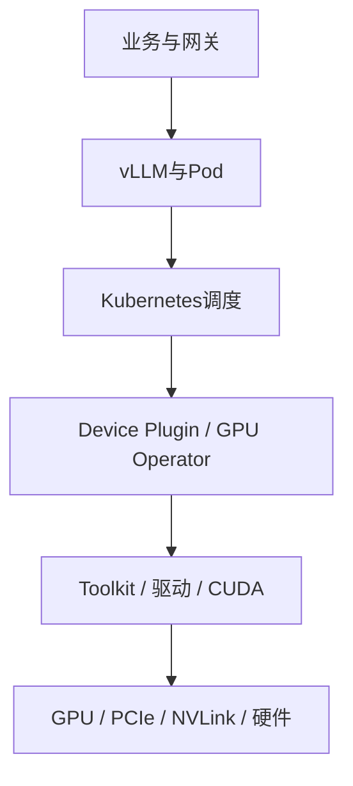

# NVIDIA资源池专项运维——从日常巡检到Xid、ECC与设备隔离

:::info 系列与定位
**系列**：《NVIDIA＋昇腾双资源池 AI 推理集群：从 0 到部署、运维与故障排查》
**阶段**：第八阶段——运维与毕业
**本文定位**：NVIDIA 池值班入口、故障分层、维护变更与证据采集篇
:::

:::tip 系列约定
资源池 A = **NVIDIA GPU**（vLLM）· 资源池 B = **华为昇腾 NPU**（vLLM-Ascend）· 同一 Kubernetes · 共享存储/网关/监控 · **禁止**跨池组成同一分布式模型实例。
:::

前 28 篇已经让 NVIDIA 池能够调度、部署 vLLM、接入网关并参与双池容灾。本篇进入 Day-2 运维：值班怎样发现异常、判断影响、隔离设备、恢复服务，并留下足够证据完成根因分析。

「模型请求失败，GPU 好像有问题」的根因可能在网关、vLLM、调度、Device Plugin、Toolkit、驱动、显存、NVLink/PCIe、电源散热或主板。若不分层，常见操作是反复重启 Pod/节点或升级驱动，既扩大影响也破坏现场。

对照：[NCCL Timeout 排查](../../gpu/cluster/troubleshooting/07-NCCL%20Timeout%20排查流程.md) · [六层排障](../../gpu/cluster/troubleshooting/02-GPU%20集群六层排障模型.md) · [Xid 排查](../../gpu/cluster/troubleshooting/06-NVIDIA%20Xid%20错误排查.md)。

## 1. 学完本文应掌握什么 {/* #一学完本文应掌握什么 */}

建立每日/每周/变更前巡检；从业务到硬件逐层定位；解读 `nvidia-smi`；区分容器 OOM、CUDA OOM 与硬件故障；处理 Xid、ECC、页退休与行重映射；判断 Allocatable 减少是调度还是 Unhealthy；维护窗口安全隔离/排空/升级/恢复；用 DCGM、device-plugin 与内核日志留证；明确业务运行时不能执行的操作。

## 2. 六层排障模型 {/* #二六层排障模型 */}



| 层 | 常见现象 | 首批证据 |
|----|----------|----------|
| 业务与网关 | 429、502、504、TTFT 升高 | 网关日志、请求 ID、SLO |
| vLLM 与 Pod | OOM、退出、探针失败 | Pod 状态、当前/上次日志 |
| 调度 | Pending、设备不足 | Events、Quota、Allocatable |
| Device Plugin/Operator | GPU 资源消失、组件异常 | DaemonSet/ClusterPolicy、日志 |
| Toolkit/驱动/CUDA | OCI Hook、NVML、版本不兼容 | runtime、nvidia-smi、驱动日志 |
| GPU/互联/硬件 | Xid、ECC、掉卡、NVLink | dmesg、DCGM、BMC、拓扑 |

原则：先确认业务影响，再确认故障层；先采证，再改现场；先隔离故障设备，再讨论修复。

## 3. 三～四、资产基线与日常巡检 {/* #三四资产基线与日常巡检 */}

每 GPU 节点记录：服务器/BMC、OS、GPU UUID 与 PCI、互联拓扑、驱动/Operator/Toolkit/DCGM、Label/Taint/Allocatable、承载模型与性能基线。

```bash
nvidia-smi -L
nvidia-smi --query-gpu=index,uuid,pci.bus_id,name,serial --format=csv,noheader
nvidia-smi --help-query-gpu
```

长期关联优先用 **GPU UUID 和 PCI Bus ID**，不要只使用 `GPU 0`。

**K8s**：Ready、Capacity/Allocatable、Label/Taint、Pressure。
**组件**：`kubectl get pods -A | grep -E 'nvidia|gpu-operator|dcgm'`。
**主机**：`nvidia-smi`、query-gpu、`nvidia-smi dmon`。
**业务**：副本 Ready、合成请求、成功率、TTFT、队列、KV、Token、重启次数。

设备利用率正常但业务 504 → 可能在网关/队列/进程；业务正常但持续 ECC/Xid → 也不能忽略。

## 4. 五～六、读懂 nvidia-smi；GPU 与 Pod 对应 {/* #五六读懂-nvidia-smigpu-与-pod-对应 */}

顶部 CUDA Version 通常是驱动最高支持的兼容版本，不等于容器 Toolkit。应用内用 PyTorch/`torch.version.cuda` 与镜像清单核对。显存高不一定是泄漏——看同等负载后基线是否持续上升、KV 能否回收、活动请求是否归零。利用率必须与 TTFT、队列、Token/s 一起看。

```bash
kubectl get pod -n ai-serving POD_NAME -o wide
kubectl exec -n ai-serving POD_NAME -- nvidia-smi -L
kubectl exec -n ai-serving POD_NAME -- sh -c 'printf "%s\n" "$NVIDIA_VISIBLE_DEVICES"'
```

DCGM Exporter 标签随版本变化，先 port-forward 看真实样本，不要假设标签名。

## 5. 七～十、常见故障：Pending、Runtime、容器看不见 GPU、版本不兼容 {/* #七十常见故障pendingruntime容器看不见-gpu版本不兼容 */}

**Pending / GPU 不足**：对比物理卡数、Capacity、Allocatable；查 Events、Quota、Label/Taint、MIG 资源名；Allocatable 少于物理数时查 Device Plugin 是否标 Unhealthy / Xid。

**OCI/NVML/初始化错误**：先主机 `nvidia-smi`/`lsmod`；再 Toolkit 与 containerd 配置（勿与 Operator 争夺）；查变更历史（内核/驱动/containerd/双驱动）。

**主机有卡、容器没有**：申请扩展资源 → 调度到 NVIDIA 节点 → Device Plugin 分配 → Runtime 注入 → 容器内 NVML/CUDA。不要用 `privileged: true`「修复」。

**CUDA 版本链**：GPU Compute Capability → 宿主机驱动 → 容器 CUDA 用户态 → PyTorch/vLLM。同型号正常节点对照同镜像。勿现场乱换 `.so`。

## 6. OOM 分两类 {/* #十一oom-分两类 */}

| 类型 | 现象 | 方向 |
|------|------|------|
| 容器内存 OOM | `OOMKilled`、退出码 137 | 主机 RAM、Pod limit |
| CUDA OOM | 应用日志 `CUDA out of memory` | 权重、max-model-len、KV、并发、TP、量化、意外占卡、入口限制 |

先保护流量 → 保存请求长度与参数 → 确认显存构成 → 降并发/上下文或扩 TP → 真实压测。不要只碰运气调 `gpu-memory-utilization`。

## 7. 十二～十三、Xid 与 ECC {/* #十二十三xid-与-ecc */}

```bash
sudo dmesg -T | grep -i -E 'NVRM|Xid'
kubectl logs -n GPU_OPERATOR_NAMESPACE DEVICE_PLUGIN_POD \
  -c nvidia-device-plugin --since=2h
```

关键 Xid 可能被 Device Plugin 标 Unhealthy，Allocatable 减少。Xid 79（fallen off the bus）等严重信号：切流、停调度、采证、维护窗口查硬件；不要只删 Device Plugin Pod 让卡「回来」。事故记录须含时间、UUID/PCI、节点、完整消息、业务 Pod、版本、温度功耗 ECC、是否复发。

```bash
nvidia-smi -q -d ECC
nvidia-smi -q -d PAGE_RETIREMENT
nvidia-smi -q -d ROW_REMAPPER
```

看 Correctable/Uncorrectable、短时增长、Pending retirement/remap、Row Remap Failure、任务失败与 RMA。Pending 生效前须排空相关进程并走审批。采证完成前不要为「面板变绿」清计数。

## 8. 十四～十五、NVLink/NCCL 与 MIG {/* #十四十五nvlinknccl-与-mig */}

```bash
nvidia-smi topo -m
nvidia-smi nvlink --status
```

NCCL 超时顺序：某 Rank 更早 OOM → Rank/World Size → 网络/端口 → 网卡/DNS → 拓扑/NVLink → RDMA → NCCL 版本与环境变量。调试变量限窗口，用完关闭。

MIG 多一层：物理 GPU → GI → CI → K8s 资源 → Pod。变更 Profile 是破坏性操作。不要用整卡告警阈值直接套所有 MIG 实例。

## 9. DCGM 与 Exporter {/* #十六dcgm-与-exporter */}

```text
GPU/NVML/DCGM → Exporter :9400/metrics → Prometheus → Grafana/Alertmanager
```

常见类别：利用率、显存、温度、功耗、Xid、ECC、PCIe/NVLink、Profiling。以实际 `curl .../metrics` 为准。Operator 管理时改支持的 ConfigMap，勿直接改 DaemonSet。`dcgmi diag` 等主动诊断只在批准维护窗口、无业务设备上运行。

## 10. 十七～十八、节点隔离与驱动升级 SOP {/* #十七十八节点隔离与驱动升级-sop */}

**先隔离**：关键 Xid、不可纠正 ECC、掉总线、反复掉线、NVLink 严重异常、温控/供电异常、驱动崩溃。

```text
cordon → 网关切流 → 评估 PDB 与 drain → 采证 → 修复验证 → uncordon → 小流量恢复
```

验证：`nvidia-smi`、卡数/UUID、Capacity/Allocatable、无 Unhealthy、DCGM、测试 Pod、合成请求、压测与通信。

**升级**：兼容矩阵、备份 Values、回滚包、非关键 Canary；出现卡数异常、Plugin 重启、DCGM 丢失、性能回退、NCCL 失败、新 Xid/ECC、无法回滚则停止批量。按故障域分批。

## 11. 十九～二十一、性能退化、证据包与值班决策树 {/* #十九二十一性能退化证据包与值班决策树 */}

先确认模型 revision、Token 分布、并发、参数、镜像相同；再分解网关→队列→Prefill→Decode→网络；对比设备侧；同镜像同权重做节点 A/B。

证据包目录建议含 timeline、impact、k8s、gpu、system、application；脱敏，不保存 Key 与完整 Prompt。

```text
业务告警
├─ 所有池都失败？→ 网关/存储/K8s公共层
└─ 仅NVIDIA池？
   ├─ Pod无Ready？Pending→调度/Plugin；重启→探针/OOM/驱动
   └─ Ready但请求失败？
      ├─ vLLM日志 → 框架/模型/显存
      ├─ Xid/ECC → 隔离采证
      ├─ NCCL超时 → Rank/网络/拓扑
      └─ 无明显错误 → 合成请求、网关与SLO分解
```

## 12. 常见错误做法 {/* #二十二常见错误做法 */}

一出问题就重启节点；只看利用率；删 Device Plugin 恢复 Allocatable；生产 Pod 开 privileged；业务运行时 GPU Reset 或高级诊断；驱动升级只验证 `nvidia-smi`。

## 13. 二十三～二十四、巡检表与练习 {/* #二十三二十四巡检表与练习 */}

**每班/每日**：节点 Ready、Capacity/Allocatable、Operator 无异常重启、无新 Xid/不可纠正 ECC、温功耗显存趋势、合成请求与 TTFT/队列/错误率基线内。
**每周**：UUID 资产、ECC/页退休/行重映射趋势、拓扑、Pending/Unhealthy 历史、告警 Runbook、安全公告。
**变更前后**：Canary 与回滚、关键流量可承接、基线已存、测完再放全量权重。

练习：建节点基线；模拟资源不足并区分「用完」与 Allocatable 异常；区分两类 OOM；隔离演练；编写 Xid Runbook。

## 14. 本篇小结 {/* #二十五本篇小结 */}

```text
业务SLO → K8s影响范围 → Pod/vLLM
→ Device Plugin健康 → 驱动/DCGM(Xid/ECC)
→ 拓扑/BMC → 隔离、修复、验证、灰度恢复
```

七个结论：用 UUID/PCI 而非索引；驱动 CUDA Version ≠ 容器 Toolkit；容器 OOM 与 CUDA OOM 是两类；Allocatable 减少可能是关键 Xid 隔离；ECC 看类型趋势 Pending 与失败；Reset/诊断/升级须排空后维护窗口；先切流采证再重启。

下一篇用同一套分层方法处理昇腾池：`npu-smi`、Device Plugin、NPU Exporter、CANN 版本链和 HCCL/RoCE。

## 15. 参考资料 {/* #参考资料 */}

- [nvidia-smi Documentation](https://docs.nvidia.com/deploy/nvidia-smi/)
- [GPU Operator Troubleshooting](https://docs.nvidia.com/datacenter/cloud-native/gpu-operator/latest/troubleshooting.html)
- [DCGM Exporter](https://docs.nvidia.com/datacenter/cloud-native/gpu-telemetry/latest/dcgm-exporter.html)
- [NVIDIA Xid Errors](https://docs.nvidia.com/deploy/xid-errors/)

## 16. 相关链接 {/* #相关链接 */}

- [专栏目录](./00-专栏目录.md)
- [第 28 篇：同模型双池路由与容灾](./28-同模型双池部署统一路由与故障切换.md)
- [NCCL Timeout 排查](../../gpu/cluster/troubleshooting/07-NCCL%20Timeout%20排查流程.md)
- [第 30 篇：昇腾资源池日常运维](./30-昇腾资源池日常运维与故障排查.md)

← [第 28 篇](./28-同模型双池部署统一路由与故障切换.md) · → [第 30 篇：昇腾池专项运维](./30-昇腾资源池日常运维与故障排查.md)
