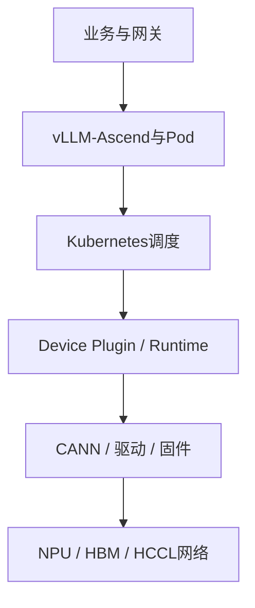

# 昇腾资源池专项运维——npu-smi、故障ConfigMap、CANN与HCCL排障

:::info 系列与定位
**系列**：《NVIDIA＋昇腾双资源池 AI 推理集群：从 0 到部署、运维与故障排查》  
**阶段**：第八阶段——运维与毕业  
**本文定位**：昇腾池值班入口、设备健康、软件栈、参数面网络与维护 SOP 篇
:::

:::tip 系列约定
资源池 A = **NVIDIA GPU**（vLLM）· 资源池 B = **华为昇腾 NPU**（vLLM-Ascend）· 同一 Kubernetes · 共享存储/网关/监控 · **禁止**跨池组成同一分布式模型实例。
:::

[第 29 篇](./29-NVIDIA资源池日常运维与故障排查.md) 建立了 NVIDIA 池运维方法。本篇沿用相同排障思路，工具与软件栈切换为昇腾体系。

```text
业务API → vLLM-Ascend → PyTorch/torch_npu → CANN
→ Ascend Docker Runtime → Ascend Device Plugin
→ 驱动与固件 → NPU/HBM → HCCS 或 HCCL/RoCE 参数面
```

与 NVIDIA 池在平台层可统一，但必须独立维护：固件/驱动/CANN 兼容矩阵、vLLM-Ascend 镜像、Device Plugin 资源名、`npu-smi`/`hccn_tool`、NPU Exporter、HCCL 网络与故障码、设备隔离与厂商支持流程。

对照：[第 23 篇昇腾部署](./23-在昇腾机器部署vLLM-Ascend.md) · [第 24 篇 HCCL](./24-多卡多机NCCL路线与HCCL路线.md)。

---

## 一、学完本文应掌握什么

用六层模型定位昇腾故障；建立 NPU/固件/驱动/CANN/镜像基线；用 `npu-smi` 看健康与 HBM；从故障 ConfigMap 判断隔离；区分资源缺失、Runtime 与 CANN 版本错误；用 `hccn_tool` 查 Link/IP/TLS/HCCL；部署验证 NPU Exporter；安全隔离升级诊断恢复；建立证据包与 Runbook。

---

## 二、昇腾池六层排障模型



| 层 | 常见现象 | 首批证据 |
|----|----------|----------|
| 业务与网关 | 5xx、504、TTFT 上升 | 网关日志、SLO、请求 ID |
| vLLM-Ascend 与 Pod | 退出、OOM、算子错误 | Pod 日志、探针 |
| 调度 | Pending、NPU 不足 | Events、Quota、Allocatable |
| Device Plugin/Runtime | 资源消失、设备未注入 | DaemonSet 日志、故障 ConfigMap |
| CANN/驱动/固件 | 初始化失败、库或算子不匹配 | 版本文件、安装信息、驱动日志 |
| NPU/HBM/HCCL | 芯片不健康、网口 Down、集合通信超时 | npu-smi、hccn_tool、设备日志 |

顺序：确认影响 → 缩到池/模型/节点/设备 → 采证 → 隔离 → 修复 → 分层验收 → 灰度恢复。

---

## 三～四、组件认识与资产基线

常见组件：Ascend Docker Runtime、Device Plugin、NPU Exporter、Volcano、HCCL-Controller、NodeD/Resilience（后几项按场景选用）。最小纳管通常至少：驱动/固件、CANN、Runtime、Device Plugin；生产强烈建议 NPU Exporter。支持范围按 Atlas 型号、MindCluster、K8s、容器 Runtime 核对。

每节点记录：服务器/BMC、NPU Device/Chip ID、Device IP/RoCE、固件驱动 CANN torch_npu vLLM-Ascend、Runtime/Plugin/Exporter、Label/Taint/资源名、模型与性能基线。

```bash
npu-smi info -l
npu-smi info
cat /usr/local/Ascend/driver/version.info
cat /usr/local/Ascend/firmware/version.info
find /usr/local/Ascend -maxdepth 3 \( -name '*install.info' -o -name 'version.info' \)
```

路径随安装方式变化；文件不存在时查产品安装指南，不要创建同名文件假装版本存在。业务镜像中核对 `torch`/`torch_npu`/`vllm`/`vllm-ascend`。可运行组合应整体冻结。

---

## 五～六、日常巡检与读懂 npu-smi

```bash
kubectl get nodes -l accelerator.vendor=ascend \
  -o custom-columns=NAME:.metadata.name,ALLOCATABLE:.status.allocatable
kubectl get pods -A -o wide | grep -Ei 'ascend|mindx|npu|device-plugin'

npu-smi info -h
npu-smi info -t health -i 0 -c 0
npu-smi info -t common -i 0

for i in {0..7}; do
  hccn_tool -i "${i}" -link -g
  hccn_tool -i "${i}" -ip -g
  hccn_tool -i "${i}" -tls -g | grep switch
done
```

资源名随产品与插件变化，先看完整 allocatable。业务侧查合成请求、TTFT、排队、HBM、利用率、HCCL 错误。

`npu-smi` 覆盖设备列表、健康、温功耗、HBM、AI Core、进程、ECC 等；不同 Atlas 产品字段与映射可能不同，手册应保存目标产品实际回显。HBM 高不一定泄漏——结合活动请求、队列、同等负载基线、版本趋势、残留进程与 OOM 日志。生产用 Exporter 持续采集，命令行用于现场确认。

---

## 七、Device Plugin 故障 ConfigMap

```bash
kubectl describe configmap \
  -n kube-system \
  mindx-dl-deviceinfo-NODE_NAME
```

常见信息可能含 `huawei.com/Ascend910`、`*-Fault`、`*-NetworkUnhealthy`、`*-Recovering`、`*-Unhealthy`、`UpdateTime`。故障等级语义：`NotHandle` 继续监视；`PreSeparate` 预隔离/降级；`Separate` 应隔离。具体字符串以当前版本文档为准。

:::caution
不要手工修改故障 ConfigMap——会被覆盖，并可能造成调度与真实硬件不一致。
:::

对比三份：`npu-smi` 物理健康、故障 ConfigMap、Capacity/Allocatable。不一致时查更新时间、Plugin 日志、驱动通信与组件版本。

---

## 八～十、Pending、容器看不见 NPU、版本不兼容

**Pending**：查 Events；确认实际资源名；常见原因：用完、资源名错、Label/Taint、Quota、Plugin 未注册、Unhealthy、拓扑不满足。对照 Plugin 日志中的设备 ID。

**容器看不见 NPU**：申请正确资源 → 昇腾节点 → Plugin 分配 → Runtime 注入 → CANN → `torch_npu`。镜像无 `npu-smi` 时继续查设备文件与框架初始化。不要挂全部 `/dev` 或 `privileged: true`。

**兼容性**：Atlas → 固件 → 驱动 → CANN → Python → PyTorch → torch_npu → vLLM → vLLM-Ascend → 模型量化。同型号正常节点 A/B；勿现场复制 `.so` 或混装 CANN；修复应产出可重建镜像并更新兼容矩阵。

---

## 十一、主机 OOM 与 HBM OOM

| 类型 | 现象 | 方向 |
|------|------|------|
| 主机/容器 OOM | `OOMKilled`、137、MemoryPressure | Pod limit、节点内存 |
| HBM OOM | 设备内存分配失败日志 | 权重/精度、上下文、KV、并发、TP/PP、图工作区、残留进程、版本开销变化 |

先限流 → 保存 Token 与参数 → 查 HBM/进程 → 降并发或上下文或调整并行 → 按目标版本压测。不要把 NVIDIA 显存比例参数原样套到昇腾。

---

## 十二、HCCL 超时与多机通信

超时不一定是网络：先查最早失败 Rank（OOM、文件缺失、崩溃、Rank/World Size、端口）。再查参数面：

```bash
for i in {0..7}; do hccn_tool -i "${i}" -link -g; done
for i in {0..7}; do hccn_tool -i "${i}" -net_health -g; done
for i in {0..7}; do hccn_tool -i "${i}" -ip -g; done
hccn_tool -i 0 -ping -g address TARGET_DEVICE_IP
for i in {0..7}; do hccn_tool -i "${i}" -tls -g | grep switch; done
for i in {0..7}; do hccn_tool -i "${i}" -optical -g; done
for i in {0..7}; do hccn_tool -i "${i}" -fec -g; done
```

检查 Link UP、IP 唯一、TLS 一致、光模块与 FEC。HCCL Test 只在维护窗口用配套版本工具执行。

---

## 十三～十四、Unhealthy 与 npu-smi 卡住

确认 Allocatable、故障 ConfigMap（设备名、fault_type/code/level/time、NetworkUnhealthy、更新时间），对照 `npu-smi` health，查 Plugin 与 NPU 日志路径（按部署清单，勿只搜一个固定目录）。按等级：NotHandle 观察 → PreSeparate 准备迁移 → Separate 切流隔离。复位/换件/RMA 查官方故障码文档。

`npu-smi` 卡住：`timeout 10 npu-smi info`、查 `/dev/davinci*`、内核日志。持续卡住则停调度、切流、采证，维护窗口按手册恢复。

---

## 十五、NPU Exporter

```text
NPU驱动与容器信息 → NPU Exporter → Prometheus → Grafana/Alertmanager
```

```bash
kubectl get pod,svc -A | grep -i npu-exporter
kubectl port-forward -n NPU_NAMESPACE pod/NPU_EXPORTER_POD LOCAL_PORT:METRICS_PORT
curl -s http://127.0.0.1:LOCAL_PORT/metrics | head
```

HTTP 无认证时用 NetworkPolicy 限制，或按官方启用 HTTPS。指标示例可能含 `npu_chip_info_utilization`、used/total memory、hbm_*——正式告警前必须看本集群 `/metrics` 与版本文档。容器关联失败时查 containerMode、socket 路径、挂载与 CRI 权限。驱动升级前按指南停业务并处理 Exporter 等依赖。

---

## 十六～十七、隔离维护与成套升级 SOP

优先隔离：Separate 级、反复掉卡、管理命令失败、严重 HBM/ECC、网口 Down/高误码、温控供电异常、驱动崩溃。

```text
cordon → 网关切流 → 查 PDB 与完整 HCCL 实例
→ 采证 → 按官方修复 → 验收 → uncordon → 小流量恢复
```

多机实例须整组迁移，不只看单个 Pod。验收：健康、设备数、ConfigMap 无待隔离、Allocatable、Plugin/Exporter、测试 Pod、`torch_npu`、通信、合成请求与压测。

升级必须成套：新 CANN/torch_npu/vLLM-Ascend 互相依赖。Canary：cordon → 切流 → 排空 → 停依赖 → 官方顺序升级 → 验证设备/镜像/HCCL/压测。停止条件：健康异常、Plugin 无法注册、Exporter 缺失、初始化失败、算子/模型兼容失败、HCCL/TTFT 恶化、无法回退。两池不能同时进入高风险变更。

---

## 十八～二十、性能退化、证据包与值班决策树

锁定对比条件后分解：网关 → 排队 → Prefill → Decode → HCCL → 网络；对照 AI Core、HBM、温功耗、CPU/NUMA、RoCE、HCCL 带宽；同镜像同模型做节点 A/B。

证据包建议含 timeline、impact、k8s（含 deviceinfo ConfigMap）、npu、versions、system、application；脱敏。

```text
仅昇腾池异常
├─ Pod无Ready？
│  ├─ Pending → 资源名/配额/标签/污点 或 Plugin/Unhealthy
│  └─ 重启 → 主机OOM / HBM OOM / CANN算子驱动
└─ Ready但请求失败？
   ├─ 单机也失败 → 模型/框架/设备
   ├─ 仅多机失败 → Rank/HCCL/Device网络
   ├─ 故障ConfigMap异常 → 按等级隔离
   └─ 性能下降 → 队列/Prefill/Decode/HCCL分解
```

---

## 二十一、常见错误做法

只看 Pod Running；手工删故障 ConfigMap 字段；所有 HCCL 超时都怪交换机；NVIDIA 参数原样复制；现场混装 CANN 动态库；无排空就复位或升级驱动。

---

## 二十二～二十三、巡检表与练习

**每班/每日**：节点 Ready、Capacity/Allocatable、Plugin/Exporter、无新 Separate、健康温功耗 HBM、HCCL Link、合成请求与 TTFT/队列。  
**每周**：资产、故障码与网络不健康历史、Device IP/TLS/拓扑基线、Exporter 完整性、安全公告、告警 Runbook。  
**变更前后**：Canary/回滚/双池容量保护、兼容矩阵、基线、设备 Runtime 框架模型 HCCL 验证、观察后再全量权重。

练习：建已验证版本矩阵；只读扫描故障 ConfigMap；维护窗口建 HCCL 网络基线；区分主机 OOM 与 HBM OOM；完整节点隔离演练。

---

## 二十四、本篇小结

```text
业务SLO → vLLM-Ascend与Pod → K8s资源
→ 故障ConfigMap → Runtime/CANN版本链
→ npu-smi → hccn_tool → 隔离、修复、验证、灰度恢复
```

七个结论：资源名与 `npu-smi` 字段以当前产品/插件/版本为准；固件驱动 CANN torch_npu vLLM-Ascend 是兼容整体；故障 ConfigMap 是证据不能手删字段；HBM OOM 与 `OOMKilled` 是两类；HCCL 超时先查最早 Rank 再查 Link/IP/TLS/FEC/光模块；Exporter 指标从实际 `/metrics` 确认；复位与软件栈升级必须排空、分批并完成模型验收。

下一篇将把 NVIDIA DCGM、昇腾 NPU Exporter、Kubernetes、vLLM、网关、存储和合成请求统一到一套监控与告警体系。

---

## 参考资料

- [昇腾 MindCluster 文档](https://www.hiascend.com/document)
- [vLLM Ascend](https://vllm-ascend.readthedocs.io/)
- [第 24 篇：NCCL 与 HCCL](./24-多卡多机NCCL路线与HCCL路线.md)

---

## 相关链接

- [专栏目录](./00-专栏目录.md)
- [第 29 篇：NVIDIA 池专项运维](./29-NVIDIA资源池日常运维与故障排查.md)
- [第 23 篇：昇腾池部署 vLLM-Ascend](./23-在昇腾机器部署vLLM-Ascend.md)
- [第 31 篇：双资源池统一监控与告警](./31-双资源池统一监控性能分析与告警.md)

---

← [第 29 篇](./29-NVIDIA资源池日常运维与故障排查.md) · → [第 31 篇：统一监控与告警](./31-双资源池统一监控性能分析与告警.md)
