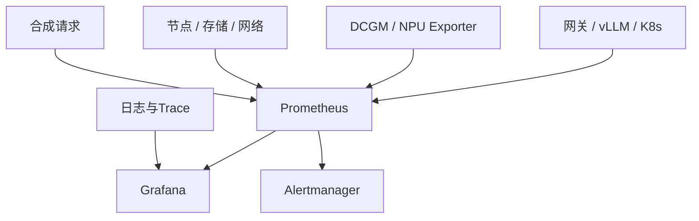

# 双资源池统一监控与告警——从设备指标到业务SLO

:::info 系列与定位
**系列**：《NVIDIA＋昇腾双资源池 AI 推理集群：从 0 到部署、运维与故障排查》
**阶段**：第八阶段——运维与毕业
**本文定位**：Prometheus 统一采集、Grafana 分层看板、告警降噪与 SLO 篇
:::

:::tip 系列约定
资源池 A = **NVIDIA GPU**（vLLM）· 资源池 B = **华为昇腾 NPU**（vLLM-Ascend）· 同一 Kubernetes · 共享存储/网关/监控 · **禁止**跨池组成同一分布式模型实例。
:::

[第 29](./29-NVIDIA资源池日常运维与故障排查.md)、[第 30](./30-昇腾资源池日常运维与故障排查.md) 篇分别建立了两池专项运维。生产值班不能在两个互不关联的设备面板之间猜测：GPU 利用率 80% 业务是否正常？HBM 高是缓存还是泄漏？504 出在网关、队列、Pod 还是设备？一个节点掉线为何收到几百条重复告警？

统一监控不是把所有指标塞进同一个 Prometheus，而是建立因果链：

```text
业务成功率与TTFT
→ 网关状态、路由和限流
→ vLLM队列、Prefill、Decode、KV Cache
→ Pod、调度与存储
→ GPU/NPU、通信网络
→ 节点、机房与硬件
```

## 1. 学完本文应掌握什么 {/* #一学完本文应掌握什么 */}

设计双池统一可观测架构；区分指标/日志/Trace/事件/合成监控；统一 Label；接入 DCGM、NPU Exporter、vLLM、网关、K8s、存储网络；定义成功率、TTFT、TPOT、队列与 Token SLO；正确编写 Waiting、设备错误与队列告警；用 Alertmanager 分组/抑制/静默/路由降噪；用 promtool 测规则；形成「发现—定位—处置—复盘」闭环。

## 2. 统一可观测架构 {/* #二统一可观测架构 */}



| 信号 | 回答的问题 | 示例 |
|------|------------|------|
| Metrics | 多少、多久、趋势 | 错误率、TTFT、温度、队列 |
| Logs | 具体发生了什么 | Xid、CANN 错误、路由 |
| Traces | 哪一层变慢 | 网关→vLLM→工具 |
| Events | 集群对象变化 | FailedScheduling、Evicted |
| Synthetic | 用户视角是否可用 | 定时 OpenAI 兼容请求 |

Pod Ready ≠ 回答正确；HTTP 200 ≠ 首 Token 及时；利用率 ≠ 业务吞吐；无 ERROR 日志 ≠ 无性能问题。

## 3. 三～四、七层监控与组件清单 {/* #三四七层监控与组件清单 */}

| 层 | 必监控 | 典型来源 |
|----|--------|----------|
| 业务 SLO | 可用率、TTFT、TPOT、完成率 | 网关、合成请求 |
| 网关 | 请求、状态码、限流、路由、重试 | Higress/NGINX |
| 推理引擎 | 队列、KV、Token、Prefill/Decode | vLLM `/metrics` |
| Kubernetes | Pod、Deployment、调度、重启、配额 | kube-state-metrics、kubelet |
| 加速器 | 利用率、显存/HBM、温度、功耗、错误 | DCGM / NPU Exporter |
| 节点与通信 | CPU、RAM、磁盘、网卡、RDMA/RoCE | node_exporter、交换机 |
| 存储与外部 | NFS/Ceph、对象存储、DNS、证书 | 存储指标、blackbox |

定位从上往下：用户影响 → 模型/租户/池 → 网关或后端 → 全 Pod 或单 Pod → 节点/设备或公共依赖。

公共层：Prometheus、Operator、Alertmanager、Grafana、kube-state-metrics、node_exporter、blackbox、日志、OTel（按需）。NVIDIA：DCGM/Exporter、Operator、NVRM/Xid。昇腾：NPU Exporter、故障 ConfigMap、Plugin/Runtime 日志、现场诊断。网络存储：Ceph/NFS、交换机、RDMA、DNS/TLS。

## 4. 五～六、统一 Label 与先验证采集 {/* #五六统一-label-与先验证采集 */}

建议维度：`cluster`、`environment`、`namespace`、`service`、`model_alias`、`accelerator_vendor`、`resource_pool`、`node`、`pod`、`device_id`、受控 `revision`。

不适合做 Prometheus Label：`request_id`、`trace_id`、完整用户 ID、Prompt、URL 参数、堆栈、会话 ID。NVIDIA 用 GPU UUID（保留 PCI）；昇腾记录节点与设备/芯片标识——两池 `device_id=0` 不是同一实体。

```bash
# Targets 确认 up、时长、错误为空
curl -s http://DCGM_EXPORTER:9400/metrics | grep '^DCGM_' | head
curl -s http://NPU_EXPORTER:METRICS_PORT/metrics | grep '^npu_' | head
curl -s http://VLLM_SERVICE:8000/metrics | grep '^vllm:' | head
```

还要确认：非长期空/固定 0；Label 映射正确；单位正确；计数器重启行为；无重复抓取；时钟同步。`up == 0` 是抓取失败，不等于业务一定失败，但盲区必须告警。

## 5. 七～九、vLLM 指标、黄金信号与 SLO {/* #七九vllm-指标黄金信号与-slo */}

```yaml
apiVersion: monitoring.coreos.com/v1
kind: ServiceMonitor
metadata:
  name: model-a
  namespace: monitoring
spec:
  namespaceSelector:
    matchNames: [ai-serving]
  selector:
    matchLabels:
      app.kubernetes.io/name: model-a
  endpoints:
    - port: http
      path: /metrics
      interval: 15s
      scrapeTimeout: 10s
```

两池 Service 都匹配时，用 Relabel 补 `accelerator_vendor`/`resource_pool`。常用指标：`num_requests_running/waiting`、`kv_cache_usage_perc`、TTFT/ITL/e2e、queue/prefill/decode 时间、prompt/generation tokens——NVIDIA vLLM 与 vLLM-Ascend 可能有差异，以冻结镜像实际 `/metrics` 为准。

| 黄金信号 | AI 推理具体化 |
|----------|----------------|
| 流量 | 请求/s、输入/输出 Token/s、活动并发、流式连接数 |
| 错误 | 4xx 分原因、429 分配额/容量、5xx、流中断、回退失败 |
| 延迟 | 网关、队列、TTFT、Prefill、TPOT/ITL、完整请求（受输出长度影响） |
| 饱和度 | 等待队列、KV、活动请求、显存/HBM、利用率、可用容量、网关并发 |

SLO：可用率按「认证合法 + Deadline 内 + 协议正确 + 无流中断」定义（用户参数错误的 4xx 通常不算平台故障）；TTFT/TPOT 分开，按长度区间分层，避免把原始 Token 数做成无限基数 Label；错误预算过快消耗时应暂停高风险发布；P0/P1/P2 不同严格度。两池可有不同内部性能基线，对外统一别名的 SLO 由路由保证。

## 6. 常用 PromQL 模板 {/* #十常用-promql-模板 */}

（指标名、Label、单位须与实际样本核对。）

```promql
sum by (namespace, pod) (vllm:num_requests_waiting{namespace="ai-serving"})

histogram_quantile(
  0.95,
  sum by (le, model_name, accelerator_vendor) (
    rate(vllm:time_to_first_token_seconds_bucket[5m])
  )
)

DCGM_FI_DEV_FB_USED / clamp_min(DCGM_FI_DEV_FB_TOTAL, 1)
npu_chip_info_hbm_used_memory / clamp_min(npu_chip_info_hbm_total_memory, 1)

kube_deployment_status_replicas_unavailable{namespace="ai-serving"} > 0
increase(kube_pod_container_status_restarts_total{namespace="ai-serving"}[15m]) > 0
kube_node_status_condition{condition="Ready",status="true"} == 0
```

标签缺失时先 Relabel/Recording Rule 规范化，勿让查询静默返回空。HBM 与普通 memory 语义不同，勿无说明地 `or` 混用。

## 7. 正确告警「容器持续 Waiting 15 分钟」 {/* #十一正确告警容器持续-waiting-15-分钟 */}

避免 `avg_over_time(...[15m]) == 1` 等易混淆写法。推荐当前状态 + `for`：

```yaml
- alert: AIContainerWaitingTooLong
  expr: |
    max by (namespace, pod, container, reason) (
      kube_pod_container_status_waiting_reason{
        namespace="ai-serving",
        reason=~"CrashLoopBackOff|ImagePullBackOff|ErrImagePull|CreateContainerConfigError|CreateContainerError"
      } == 1
    )
  for: 15m
  labels:
    severity: warning
    team: ai-platform
  annotations:
    summary: "容器持续Waiting超过15分钟"
    description: "{{ $labels.namespace }}/{{ $labels.pod }} 容器 {{ $labels.container }} 持续处于 {{ $labels.reason }}。"
    runbook_url: "https://runbook.example.com/ai/container-waiting"
```

保留 `pod`/`container` 使每实例独立；`for` 负责连续 15 分钟。两个实例只收到一封通知时：查 PromQL 时序数、规则 Label、Alertmanager 是合并还是真丢实例——模板应列出组内所有 Pod。

## 8. 十二～十四、设备/推理告警、分级与 Alertmanager {/* #十二十四设备推理告警分级与-alertmanager */}

```yaml
- alert: NvidiaGpuXidDetected
  expr: max_over_time(DCGM_FI_DEV_XID_ERRORS[5m]) > 0
  labels: {severity: critical, team: ai-platform, accelerator_vendor: nvidia}
  annotations:
    summary: "NVIDIA GPU检测到Xid"
    description: "节点 {{ $labels.node }} GPU {{ $labels.UUID }} 出现Xid={{ $value }}，请先隔离并保存内核日志。"

- alert: VllmRequestQueueSustained
  expr: |
    sum by (namespace, pod, model_name) (
      vllm:num_requests_waiting{namespace="ai-serving"}
    ) > 0
  for: 5m
  labels: {severity: warning, team: ai-platform}
  annotations:
    summary: "vLLM请求持续排队"
    description: "{{ $labels.pod }} 等待请求持续5分钟，当前值 {{ $value }}。"

- alert: AscendNpuHbmUsageHigh
  expr: |
    (npu_chip_info_hbm_used_memory
     / clamp_min(npu_chip_info_hbm_total_memory, 1)) > 0.95
  for: 10m
  labels: {severity: warning, team: ai-platform, accelerator_vendor: ascend}
  annotations:
    summary: "昇腾NPU HBM使用率持续过高"
    description: "实例 {{ $labels.instance }} 设备 {{ $labels.id }} HBM比例为 {{ $value | humanizePercentage }}。"
```

上线前核对 Xid 指标恢复语义、HBM Label（是否叫 `id`）与队列阈值（生产未必 `>0`，应按 TTFT SLO 与压测设定）。

| 级别 | 含义 | 行动 |
|------|------|------|
| critical/page | 影响 P0 或即将中断 | 立即值班响应 |
| warning/ticket | 风险或容量趋势 | 工作时间工单 |
| info | 变更/恢复/趋势 | 记录，不叫醒 |

适合 Page：可用率骤降、Ready 副本没了、双池无法服务 P0、大面积设备隔离、公共层故障。不适合：单卡利用率高、无业务影响的单次重启、短时队列、计划维护。告警应优先描述用户可感知症状，再用原因告警帮助定位。

```yaml
route:
  receiver: ai-default
  group_by: [cluster, alertname, resource_pool]
  group_wait: 30s
  group_interval: 5m
  repeat_interval: 4h

inhibit_rules:
  - source_matchers: ['alertname="NodeDown"']
    target_matchers: ['alertname=~"PodNotReady|ExporterDown|DeviceMetricsMissing"']
    equal: [cluster, node]
```

分组只改变通知形式，不减少 Prometheus Alert 实例。节点 Down 抑制同节点下游噪声，但保留业务 SLO。静默匹配 `cluster`/`node`/`resource_pool`/`maintenance_id`，须有截止时间。路由按 severity/team/environment；Webhook 等走密钥系统。

## 9. 十五～十八、Grafana、合成监控、日志与 Trace {/* #十五十八grafana合成监控日志与-trace */}

看板：业务总览 → 模型容量 → NVIDIA 池 → 昇腾池 → K8s/基础设施；支持从 `model_alias` 下钻到池、Pod、节点、设备。

Blackbox 证明连通与证书，不证明模型正确。业务合成：定时固定小 Prompt 的 chat completions，验证 TLS/认证/路由/JSON/别名/TTFT/双池灰度/回退；独立租户与配额；可识别但不造高基数 Label。

日志记 request_id、租户哈希、模型、池、状态、TTFT、tokens、fallback；默认不记 Authorization、Key、Prompt、输出、附件。Trace 至少贯穿 `X-Request-ID`；`request_id` 不进 Prometheus Label。

## 10. 十九～二十一、Recording Rule、规则测试与监控自监控 {/* #十九二十一recording-rule规则测试与监控自监控 */}

```yaml
- record: ai:vllm_queue_depth
  expr: sum by (namespace, pod, model_name) (vllm:num_requests_waiting)
- record: ai:nvidia_fb_usage_ratio
  expr: DCGM_FI_DEV_FB_USED / clamp_min(DCGM_FI_DEV_FB_TOTAL, 1)
- record: ai:ascend_hbm_usage_ratio
  expr: npu_chip_info_hbm_used_memory / clamp_min(npu_chip_info_hbm_total_memory, 1)
```

统一指标保留必要来源 Label，勿把两池平均后丢资源池信息。还可沉淀 `ai:request_rate5m`、`ai:error_ratio5m`、`ai:ttft_p95_5m`、`ai:ready_replicas` 等。

```bash
promtool check rules alerts.yml
promtool test rules alerts-test.yml
```

Prometheus Operator 的 PrometheusRule 含 CRD 外壳，CI 可先提取 `spec.groups` 再跑 promtool。至少测：正常不触发、`for` 后触发、恢复重置、两 Pod 两实例、节点抑制、指标缺失不误健康。再验证通知模板列出组内实例、恢复通知、Runbook、接收者、静默范围。

监控系统本身：Target 缺失、磁盘/WAL、规则评估、Alertmanager、通知失败、Grafana、Exporter 漂移、时钟。HA Alertmanager 时 Prometheus 应配置全部实例，不要只指向一个 VIP。Dead Man's Switch：持续 Firing 心跳，外部收不到则链路可能断。

## 11. 二十二～二十三、常见错误与 TTFT 升高定位 {/* #二十二二十三常见错误与-ttft-升高定位 */}

利用率高直接 Critical；所有错误无 `for`；聚合丢 Pod；把分组当成丢告警；只告原因不告症状；无 Runbook；阈值抄自网络文章。

TTFT 升高：确认范围（模型/租户/池/Pod）→ 网关 429/5xx/权重 → 队列/Prefill/Prompt/KV → 利用率与设备错误 → 存储/DNS/CPU/发布时间线。同时发生 ≠ 因果，但可缩小范围。

## 12. 二十四～二十五、验收清单与练习 {/* #二十四二十五验收清单与练习 */}

**采集**：网关/vLLM/K8s/节点/设备/存储 Target 齐全；DCGM 与 NPU Exporter 覆盖目标节点；指标名/单位/Label 已冻结；Exporter 故障本身告警；双池可关联模型、Pod、节点、设备。

**SLO**：可用率分母与成功定义明确；TTFT、TPOT、总时延分开；按模型与长度分层；错误预算可计算；双池降级期间 SLO 明确。

**告警**：每条有 owner、severity、Runbook；PromQL 保留正确实例 Label；`for`/阈值/恢复已测；节点/公共层可抑制下游噪声；维护 Silence 有截止；通知模板列出组内实例。

**安全与可靠性**：指标端点受网络或认证保护；日志不落 Prompt/密钥；Prometheus/Alertmanager 有备份与 HA；通知失败与 Dead Man's Switch 已监控；时间同步正常。

**练习**：画监控地图标出单点与盲区；两 Pod `ImagePullBackOff` 验证 Waiting 双实例与恢复；建 `company-model-a` 双池同模型看板；为排队告警写 promtool 用例（4 分钟不告、5 分钟告、中间恢复重置）；模拟节点故障验证抑制且业务 SLO 仍可见。

## 13. 本篇小结 {/* #二十六本篇小结 */}

```text
用户请求与SLO → 网关 → vLLM队列/TTFT/Token
→ K8s副本 → DCGM/NPU Exporter → 节点通信存储
→ 告警分组、抑制与Runbook
```

八个结论：利用率不能替代成功率与 TTFT；延迟须拆开；两池原始指标不同但 Label 与业务 SLO 应统一；Waiting 用当前状态 + `for` 并保留 Pod Label；分组 ≠ 丢实例；节点抑制不能压掉业务影响；可行动告警须有 Owner/级别/对象/Runbook；监控与通知链路本身也要被监控和演练。

端到端综合实战将双池部署、模型上线、网关、监控、压测、容灾演练与 SOP 验收放在同一环境中验证。

## 14. 参考资料 {/* #参考资料 */}

- [Prometheus：Alertmanager](https://prometheus.io/docs/alerting/latest/alertmanager/)
- [Prometheus：规则单元测试与 promtool](https://prometheus.io/docs/prometheus/latest/configuration/unit_testing_rules/)
- [vLLM Production Metrics](https://docs.vllm.ai/en/latest/serving/metrics.html)
- [DCGM Exporter](https://docs.nvidia.com/datacenter/cloud-native/gpu-telemetry/latest/dcgm-exporter.html)
- [kube-state-metrics](https://github.com/kubernetes/kube-state-metrics)

## 15. 相关链接 {/* #相关链接 */}

- [专栏目录](./00-专栏目录.md)
- [第 30 篇：昇腾池专项运维](./30-昇腾资源池日常运维与故障排查.md)
- [第 29 篇：NVIDIA 池专项运维](./29-NVIDIA资源池日常运维与故障排查.md)
- [第 32 篇：从裸机到生产综合实战](./32-从裸机到生产综合实战故障演练与SOP.md)
- [附录 F：容量计算表](./95-附录F-模型显存HBM设备副本和故障容量计算表.md)
- [附录 G：PromQL、告警与 Grafana 看板](./96-附录G-PromQL告警规则与Grafana看板清单.md)

← [第 30 篇](./30-昇腾资源池日常运维与故障排查.md) · → [第 32 篇：从裸机到生产——综合实战、故障演练与 SOP](./32-从裸机到生产综合实战故障演练与SOP.md)
