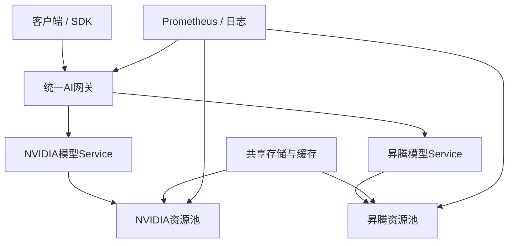

# 综合实战与SOP沉淀——完成双资源池AI集群毕业项目

:::info 系列与定位
**系列**：《NVIDIA＋昇腾双资源池 AI 推理集群：从 0 到部署、运维与故障排查》  
**阶段**：第八阶段——运维与毕业  
**本文定位**：全系列毕业实战、上线验收、故障演练、Runbook 与能力评估篇
:::

:::tip 系列约定
资源池 A = **NVIDIA GPU**（vLLM）· 资源池 B = **华为昇腾 NPU**（vLLM-Ascend）· 同一 Kubernetes · 共享存储/网关/监控 · **禁止**跨池组成同一分布式模型实例。
:::

前 31 篇已分别讲清硬件、Kubernetes、双资源池、存储、vLLM、网关、扩缩容、容灾与监控。本篇不再引入新的大系统，而是把知识组合成可交付项目：

```text
空白服务器 → 同一Kubernetes
→ NVIDIA / 昇腾双资源池
→ 同一业务模型双后端
→ 统一OpenAI兼容API
→ 存储、网关、监控
→ 压测、切流、故障演练
→ 部署手册、值班SOP、验收报告
```

完成后你不只是「看过教程」，而是拥有一套可重复部署、运维和解释的双资源池 AI 推理平台样板。

---

## 一、毕业标准

| 能力 | 你要能独立做到 |
|------|----------------|
| 架构 | 画出客户端到 GPU/NPU 全路径；说清统一层与独立层；解释为何不能混用两类设备组成同一分布式实例；按模型/SLO/容量/成本选放置 |
| 部署 | HA Kubernetes；两池就绪；合适存储组合；vLLM / vLLM-Ascend；统一网关 |
| 运维 | 看健康；处理 Pending/OOM/Xid/NPU/NCCL·HCCL；升级维护回滚；按 Runbook 处置 |
| 可靠性 | 定义可用率/TTFT/TPOT/容量 SLO；探针/PDB/拓扑/优雅终止；双池权重/熔断/回退；演练并量化 RTO 与请求损失 |

---

## 二、毕业项目目标架构



固定约定：同一控制面；共享模型存储、网关、监控；两套驱动、运行时、镜像、设备插件与专项 SOP。

```text
NVIDIA：accelerator.vendor=nvidia  resource-pool=nvidia-pool  accelerator=nvidia:NoSchedule
昇腾：  accelerator.vendor=ascend  resource-pool=ascend-pool  accelerator=ascend:NoSchedule
```

---

## 三、实验环境与生产起点

| 角色 | 最小学习 | 推荐生产起点 |
|------|----------|--------------|
| 控制面 | 1（无 HA） | 3，跨故障域 |
| NVIDIA 节点 | 1 | ≥2，副本分散与维护 |
| 昇腾节点 | 1 | ≥2 |
| 网关 | 可放通算节点 | ≥2 副本，独立故障域 |
| 监控 | 通算节点 | HA 或可恢复，不与业务同灭 |
| 存储 | NFS 学习 | 按 SLA：Ceph/NAS/对象存储 |

两台机器并不自动等于高可用：若一个模型副本本身跨两台，仍可能只有一个完整实例。总量由单副本设备数、吞吐、Surge 与故障预留决定。

---

## 四、交付物与仓库结构

交付：架构设计、资产清单、兼容矩阵、容量规划、安装手册、部署清单、配置仓库、模型验收、压测报告、监控告警清单、演练报告、发布回滚 SOP、值班 Runbook、安全权限清单——不能只交一堆 YAML。

```text
ai-dual-pool-platform/
├── docs/          # architecture, compatibility, capacity, acceptance, DR
├── inventory/     # hosts, accelerators, network-topology
├── manifests/     # base, nvidia-pool, ascend-pool, storage, serving, gateway, monitoring
├── tests/         # smoke, benchmark, equivalence, alerts
├── runbooks/      # common, nvidia, ascend
└── changes/       # releases, rollback
```

Secret、证书私钥与真实 API Key 不得进入普通 Git 仓库。

---

## 五～六、第一～二关：需求边界、资产与兼容

| 问题 | 项目答案示例 |
|------|--------------|
| 对外模型 | `company-model-a` |
| 形态 | 在线 OpenAI 兼容推理 |
| 最大上下文 / TTFT | 容量验证后分层确定 |
| 可用率 | 如 99.9%，业务批准 |
| 峰值 Token/s | 业务预测 + 压测 |
| 一池故障保多少 | 至少保护 P0 |
| 数据出网 / Prompt 记录 | 决定网关与日志策略；默认不记明文 |
| 维护窗口 | 时间与审批明确 |

退出：契约与 SLO 明确；安全边界清楚；不用「先装再说」代替需求分析。

```bash
lscpu; free -h; lsblk; ip -br address; uname -r
nvidia-smi -L; nvidia-smi topo -m
npu-smi info -l; npu-smi info
```

兼容矩阵分别维护：NVIDIA（GPU→驱动→Toolkit→CUDA→PyTorch→vLLM）、昇腾（NPU→驱动→CANN→torch_npu→vLLM-Ascend）、公共（OS→内核→K8s→containerd→CNI→CSI）。

```text
单副本设备数 = TP × PP（以目标拓扑为准）
稳态设备数 = 单副本 × 稳态副本
总规划 = 稳态 + Surge + 节点故障预留 + 测试/机动
```

退出：稳定设备标识与拓扑；两套已验证版本组合；容量算术成立；共享存储/网络/电力单点已识别。

---

## 七～八、第三～四关：K8s 基线与双池就绪

完成主机名/DNS/时间、内核、containerd、HA 控制面、CNI、安全审计、资源预留、证书监控、备份恢复。验收：`kubectl get nodes -o wide`、`pods -A`、`/readyz?verbose`。勿在加速器节点上堆控制面与监控重负载。

```bash
kubectl label node NVIDIA_NODE accelerator.vendor=nvidia resource-pool=nvidia-pool --overwrite
kubectl taint  node NVIDIA_NODE accelerator=nvidia:NoSchedule --overwrite
kubectl label node ASCEND_NODE  accelerator.vendor=ascend resource-pool=ascend-pool --overwrite
kubectl taint  node ASCEND_NODE  accelerator=ascend:NoSchedule --overwrite
```

NVIDIA：Capacity/Allocatable、`nvidia|gpu-operator|dcgm`、测试 Pod 可申请 `nvidia.com/gpu`、容器内 `nvidia-smi`、PyTorch CUDA、UUID 正确、DCGM 可抓。  
昇腾：Allocatable、Device Plugin、测试 Pod 资源名正确、`torch_npu`、故障 ConfigMap、NPU Exporter。

退出：两池独立申请设备且不跨厂商；Capacity 与资产一致；指标可关联 Pod；单机通信基线已存。

---

## 九～十一、第五～六关：存储、内存算术与双后端

| 数据 | 思路 |
|------|------|
| 原始模型仓库 | 对象存储或受控仓库 |
| 共享只读权重 | CephFS/NFS（按规模与 SLA） |
| 节点热缓存 | 本地 NVMe |
| 镜像 | 两套独立路径/标签 |
| 运行日志 | 日志平台，不放模型目录 |

```text
/models/company-model-a/revision-20260801/
├── manifest.json  tokenizer/  weights/  checksums.sha256
```

逻辑版本可共享；权重格式不同则分存并在 Manifest 建来源关系。两池分别填：权重、Runtime/工作区、KV 预算、单卡可用、TP/PP、最大上下文/并发、安全余量——参数来自压测，保证真实并发与最长请求不 OOM。

对象：`model-a-nvidia` / `model-a-ascend`（Deployment + Service）。统一：namespace、别名 `company-model-a`、健康检查、日志字段、安全、端口、发布流程。独立：镜像、资源名、Selector/Toleration、TP/PP/内存、驱动 Runtime、专项指标与 Runbook。

```bash
kubectl get deployment,pod,svc,endpointslice -n ai-serving
# 分别对 model-a-nvidia / model-a-ascend 调 /v1/chat/completions，含 stream:true
```

等价性：协议、Tokenizer/模板、长上下文、停止词、JSON/Tool、质量用例、TTFT/TPOT、错误格式。性能差异记入权重与容量。

---

## 十二～十三、第七～八关：网关与双池容灾

入口：`https://ai-api.example.com/v1/chat/completions`，`model=company-model-a`。必备：TLS、租户授权、内外 Key 分离、体/上下文/输出限制、QPS/并发/Token 配额、SSE 无缓冲、`request_id`/Trace、双池路由、日志脱敏。

| 用例 | 预期 |
|------|------|
| 正常非流式 / 流式 | 200 结构正确；逐块返回 |
| 无 Key / 无权限 / 体过大 / 配额 | 401 / 403 / 413 / 429 |
| 无 Endpoint | 受控 503 或回退 |
| 客户端断开 | 后端尽快取消 |

客户端不知底层池；外部不可绕过网关。模式：主动—主动、主动—备用、灰度、能力路由。错误矩阵：4xx 鉴权类不切池；租户 429 不切；容量 429 可评估；建连失败/503 可切（受 Deadline）；504 谨慎；SSE 首 Token 后默认不透明回退；有副作用 Tool 须幂等。

```text
一池故障后可用余量 ≥ 必须保护的 P0
否则：P0 保留 · P1 限流/缩短输出 · P2 暂停 · 测试流量关闭
```

退出：权重与实际分布验证；分流与失败回退分开配置；熔断有迟滞与 HalfOpen；人工一键切换与回滚可用。

---

## 十四～十五、第九～十关：监控与压测

接入：网关、vLLM 双栈、kube-state-metrics、kubelet、node_exporter、DCGM、NPU Exporter、存储网络、合成请求、日志/Trace。顶层看板：可用率与错误预算、吞吐、TTFT/TPOT、429/5xx、队列与 KV、双池权重与实际分布、Ready/设备余量、Xid/NPU 故障。每条告警：对象、severity、owner、当前值与影响、Runbook、合理 `for`、恢复通知、已测规则。

压测请求集含短中长 Prompt、短长输出、流式/非流式、并发、Tool/JSON、真实 Token 分布。单副本分别测两池吞吐、TTFT/TPOT、队列、错误、显存/HBM、利用率、CPU/RAM、功耗。找到舒适线 / 警戒线 / 崩溃线——生产跑在舒适线。扩展效率 = 多副本吞吐 ÷（单副本 × 副本数）。HPA 验证记录：超阈值 → 建议副本 → 调度 → 设备 → 预热 → Ready → 队列下降的完整时间。

---

## 十六～十八、演练原则、六个演练与评分

开始前：范围与目标、审批、测试租户/环境、停止条件、回滚、值班与观察、初始状态记录；避免同时对两池注入故障。禁止未经批准：生产 Reset、拔线断电关端口、删生产 PVC/模型、同时停两池、清硬件证据、扩大权限或关安全控制。优先可逆模拟。

| 演练 | 操作要点 | 验证重点 |
|------|----------|----------|
| 1 单 Pod | 删测试范围模型 Pod | Endpoint、补建、预热、告警、流式在途 |
| 2 单节点维护 | 切流→cordon→PDB→排空→回归 | 拓扑分散与 Surge |
| 3 单池不可用 | 主池无 Ready Endpoint（勿毁硬件） | 熔断、切流、P0 保护、SSE 边界、灰度切回 |
| 4 Exporter 不可用 | 停采集或阻断 | `up=0`、面板显示缺失非 0、业务告警仍在 |
| 5 存储变慢 | 测环境限速/清缓存 | 冷启动、startupProbe、发布 Deadline |
| 6 通信失败 | 隔离环境错误配置 | 最早失败 Rank、Device IP、TLS/Link |

评分：MTTD、MTTA、MTTR、失败请求、中断流、备用池峰值队列、告警数量、人工步骤、回滚时间——目标是找真实边界，不是漂亮数字。

---

## 十九～二十一、事件响应、时间线与 Runbook

**0～5 分钟**：确认真实性、声明级别与负责人、影响面、停高风险发布、切走故障后端、保护 P0。  
**5～15 分钟**：业务/网关 → vLLM/Pod → 调度/Plugin → 驱动设备 → 网络存储。  
**之后**：回滚、切池、换副本、隔离节点、降流量——先恢复服务，不做未验证新升级。恢复后逐步权重、确认告警、存证据、复盘整改。

```markdown
## INC-YYYYMMDD-001
## 影响 / 时间线 / 证据 / 临时处置 / 根因 / 整改
```

事实、推测、结论分开；不改历史时间线迁就结论。

Runbook 须含：含义、用户影响、自动化、5 分钟快速检查、分层排查、安全处置、禁止操作、升级条件、恢复验收、证据清单、联系人——当班人员要知道下一步做什么、看到什么、何时停。

---

## 二十二～二十四、SOP 目录、发布与上线评审

**公共**：安装扩节点、发布回滚、路由变更、Key 轮换、扩缩容、节点维护、存储故障、监控变更、证书、双池切换、事故复盘。  
**NVIDIA**：Operator/Plugin、CUDA/驱动、CUDA OOM、Xid、ECC/页退休/行重映射、NVLink/NCCL、MIG、驱动升级。  
**昇腾**：Runtime/Plugin、CANN/torch_npu、HBM OOM、故障 ConfigMap、npu-smi、HCCL/Device IP/TLS、Exporter、固件驱动 CANN 升级。

发布前：变更含镜像/模型/参数/路由；兼容矩阵更新；Canary 过；Surge 设备组；无未解释 Critical；回滚已验；窗口明确。发布中：正确池、探针、合成、小流量、TTFT/队列/错误/设备健康、未触停止线再放量。发布后：覆盖业务周期、ReplicaSet 明确、HPA/PDB、路由分布、归档。

上线评审覆盖架构单点与隔离、容量与一池故障 P0、TLS/鉴权/不可绕过/脱敏、探针 PDB、回退矩阵、告警 Runbook、六个演练完成。

---

## 二十五～二十六、100 分评分与两周冲刺

| 领域 | 分 | 合格标准 |
|------|----|----------|
| 架构与边界 | 10 | 统一层与独立层说得清 |
| 资产与兼容 | 10 | 清单与两套矩阵完整 |
| Kubernetes | 10 | HA、网络、隔离、调度 |
| NVIDIA 池 | 10 | 部署、监控、Xid/ECC SOP |
| 昇腾池 | 10 | 部署、监控、故障/HCCL SOP |
| 模型与存储 | 10 | 版本、内存、缓存可追溯 |
| 网关与安全 | 10 | TLS、鉴权、限流、SSE |
| 容量与性能 | 10 | 真实压测与边界 |
| 监控与告警 | 10 | SLO、分层看板、Runbook |
| 容灾与演练 | 10 | 切换、切回、记录与整改 |

60～69 实验部署；70～79 参与生产运维；80～89 独立负责；90～100 设计标准并带领演练。安全绕过、数据丢失、无法回滚或未经演练的生产操作——即使其他项高分也不应判定毕业。

两周学习冲刺：D1–2 设计 → D3–4 K8s/存储 → D5–6 双池 → D7–8 模型 → D9 网关 → D10 监控 → D11–12 压测 → D13 六个演练 → D14 交付与答辩。生产项目通常更长；两周冲刺 ≠ 未经测试可直接上线。

---

## 二十七、架构答辩问题

1. 为何同一 K8s 可管两池，但一个 TP 实例不能混用 GPU/NPU？  
2. Pending 时如何区分设备用完与 Plugin 隔离？  
3. `nvidia-smi` 的 CUDA Version 为何 ≠ 容器 Toolkit 版本？  
4. 昇腾故障 ConfigMap 能否手工删 Unhealthy？为何？  
5. CUDA OOM、HBM OOM 与 K8s OOMKilled 区别？  
6. NCCL/HCCL 超时为何先找最早失败 Rank？  
7. 为何 Service 轮询 ≠ Token 工作量均衡？  
8. 为何利用率不适合单独触发扩容？  
9. 为何权重分流 ≠ 故障回退？  
10. SSE 已出首 Token 后为何不能透明切池？  
11. 一池故障如何保护 P0 限制 P1/P2？  
12. Alertmanager 两告警一封通知是否等于漏报？  
13. 如何证明备用池真能满足 RTO？  
14. 重启节点前为何先采证据？  
15. 怎样判断驱动升级可继续批量推进？

能清晰回答并现场验证，才算真正掌握。

---

## 二十八、全系列 32 篇学习地图

| 阶段 | 篇 | 主题 |
|------|----|------|
| 一 基础 | 1～4 | 全貌、推理、硬件概念、集群与资源池 |
| 二 架构 | 5～8 | 为何两池、总体架构、资产、兼容与容量 |
| 三 建池 | 9～12 | 系统初始化、HA K8s、NVIDIA 池、昇腾池 |
| 四 调度 | 13～16 | Label/Taint、配额、整卡共享、业务分配 |
| 五 存储 | 17～20 | 四层存储、NFS、Ceph/CSI、分发缓存预热 |
| 六 推理 | 21～24 | 显存/HBM、vLLM、vLLM-Ascend、NCCL/HCCL |
| 七 生产 | 25～28 | 部署清单、网关、多副本 HPA、双池容灾 |
| 八 运维毕业 | 29～32 | NVIDIA/昇腾专项运维、统一监控、综合实战 |

主线到第 32 篇正式结束。后续专题用「进阶篇 A01…」或附录，不再把主线悄悄扩成 33、34，以免目录与已发文章失一致。

---

## 二十九～三十、从会用到精通；最终检查表

会用：按文档部署、看 Pod/设备、基本命令。  
熟练：独立发布回滚、定位常见 OOM/调度/通信、读监控告警。  
精通：跨层因果、兼容与容量标准、故障中先保护业务、区分证据/推测/根因、可回滚变更、他人能按 Runbook 处置、演练持续改进。

精通不是记更多命令，而是知道：最重要风险、需要哪份证据、哪个动作最安全、影响什么、如何验证恢复、如何防再发。

- [ ] 能画出计算→显存/HBM→互联→网卡→存储→调度→网关全图  
- [ ] 能独立部署两池并验收同一业务模型  
- [ ] 能解释输出差异并做等价性测试  
- [ ] 能设计存储/缓存/预热与生产探针/PDB/优雅终止  
- [ ] 能设计网关认证、限流、SSE、超时  
- [ ] 能计算副本、设备、Surge、故障容量  
- [ ] 能配置双池权重、熔断、安全回退  
- [ ] 能排查 Xid/ECC/NPU/NCCL·HCCL  
- [ ] 能从 SLO 下钻到 Pod/节点/设备；能测并降噪告警  
- [ ] 完成切换恢复演练；有可交值班的 Runbook  
- [ ] 高风险操作有审批、回滚与验收  

某项未完成不是失败，而是下一轮补强目标。

---

## 三十一、本篇小结

```text
需求与SLO → 资产、兼容与容量 → Kubernetes底座
→ NVIDIA与昇腾双池 → 模型存储与两套推理后端
→ 统一OpenAI网关 → 多副本、扩缩容与双池容灾
→ 指标、日志、Trace与告警 → 压测、演练与SOP
```

十条原则：统一的是平台不是混合实例；兼容矩阵分厂商；设备/内存/故障容量先算术；Running/Ready/业务可用三层；权重路由、负载均衡、故障回退三能力；利用率须与队列/TTFT/Token 同看；故障先保护业务、隔离、存证；高风险修复可回滚且在窗口执行；未经演练的容灾与未经测试的告警只是设想；最终交付是系统、标准、证据与可执行 SOP，不是 YAML。

至此，《NVIDIA＋昇腾双资源池 AI 推理集群：从 0 到部署、运维与故障排查》**32 篇主线全部完成**。

---

## 参考资料

- [Kubernetes：调试节点](https://kubernetes.io/docs/tasks/debug/debug-cluster/debug-node/)
- [Kubernetes：Pod Disruptions](https://kubernetes.io/docs/concepts/workloads/pods/disruptions/)
- [Prometheus：规则单元测试](https://prometheus.io/docs/prometheus/latest/configuration/unit_testing_rules/)
- [Prometheus：Alertmanager](https://prometheus.io/docs/alerting/latest/alertmanager/)
- [NVIDIA GPU Operator Troubleshooting](https://docs.nvidia.com/datacenter/cloud-native/gpu-operator/latest/troubleshooting.html)
- [vLLM Kubernetes Deployment](https://docs.vllm.ai/en/latest/deployment/k8s.html)

---

## 相关链接

- [专栏目录](./00-专栏目录.md)
- [第 31 篇：统一监控与告警](./31-双资源池统一监控性能分析与告警.md)
- [第 28 篇：同模型双池路由与容灾](./28-同模型双池部署统一路由与故障切换.md)
- [附录 I：发布变更 SOP](./附录I-发布变更维护容灾与复盘SOP模板.md)
- [附录 J：验收与毕业清单](./附录J-部署验收性能基准容灾演练与毕业清单.md)
- [附录 F：容量计算表](./附录F-模型显存HBM设备副本和故障容量计算表.md)

---

← [第 31 篇](./31-双资源池统一监控性能分析与告警.md) · 专栏完结 · → [附录 A：术语对照](./附录A-NVIDIA与昇腾术语对照表.md)
