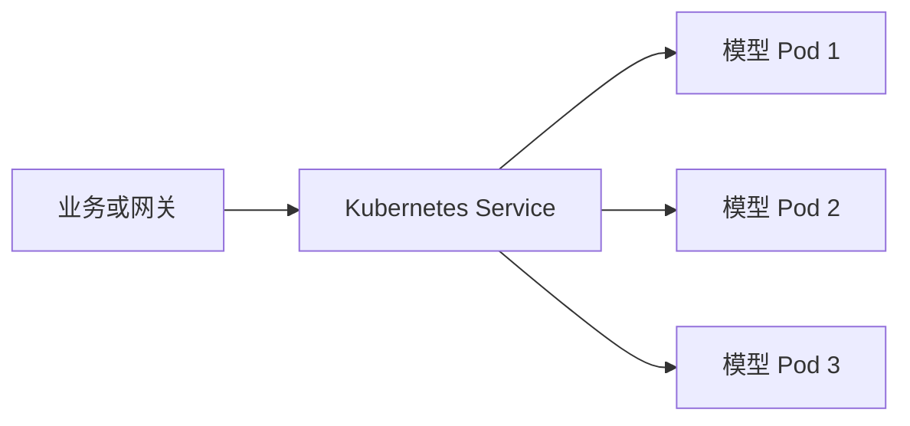
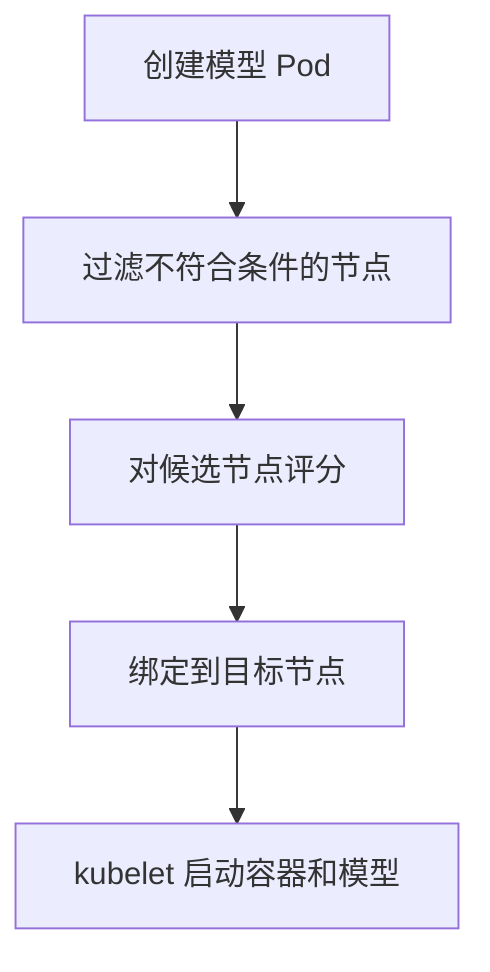

# 集群、节点、Pod、Service和资源池是什么

:::info 系列与定位
**系列**：《NVIDIA＋昇腾双资源池 AI 推理集群：从 0 到部署、运维与故障排查》  
**阶段**：第一阶段——小白基础  
**本文定位**：Kubernetes 概念入门篇
:::

:::tip 系列约定
资源池 A = **NVIDIA GPU**（vLLM）· 资源池 B = **华为昇腾 NPU**（vLLM-Ascend）· 同一 Kubernetes · 共享存储/网关/监控 · **禁止**跨池组成同一分布式模型实例。
:::

前面三篇已经建立了整体架构、模型推理和硬件软件栈。接下来要回答一个关键问题：

> Kubernetes 到底怎样把一个模型服务放到正确的 NVIDIA 或昇腾服务器上？

回答这个问题之前，需要先认识集群、节点、Pod、Deployment、Service、Device Plugin 和资源池。K8s 细节可回看 [Kubernetes 学习路线](../../platform/kubernetes/00-Kubernetes学习路线.md)；本文只建立双资源池语境下的概念地图。

---

## 一、为什么需要集群

如果只有一台服务器，可以手动启动一个模型进程：

```text
一台服务器
→ 安装驱动
→ 安装推理框架
→ 启动模型
→ 开放端口
```

但当机器和模型越来越多，会遇到：

- 不知道哪台机器还有空闲设备
- 服务停止后需要人工重新启动
- 模型端口和地址难以统一管理
- 配置、密钥和存储挂载方式不一致
- 升级时容易中断业务
- NVIDIA 和昇腾任务容易部署到错误节点
- 无法统一做权限、配额和监控

Kubernetes 把许多服务器组成一个可统一管理的集群，并通过声明式配置维护期望状态。

---

## 二、控制节点和工作节点

### 控制节点

控制节点负责管理集群，包括：

- 接收 API 请求
- 保存集群状态
- 进行调度决策
- 控制副本数量
- 检测并修正实际状态

可以把控制节点理解为「管理中心」。它通常不承担模型计算。生产环境建议把控制节点与昂贵的加速器工作节点分离。

### 工作节点

工作节点真正运行 Pod。在双资源池集群中，工作节点至少分为：

| 类型 | 典型负载 |
|------|----------|
| 普通工作节点 | 网关、监控等公共服务 |
| NVIDIA 工作节点 | vLLM 模型 Pod |
| 昇腾工作节点 | vLLM-Ascend 模型 Pod |

一台服务器加入集群后会成为 Node。可以使用以下命令查看：

```bash
kubectl get nodes -o wide
```

---

## 三、Pod 是什么

Pod 是 Kubernetes 调度和运行容器的基本单位。

模型服务通常不会把容器直接裸跑在节点上，而是放入 Pod：

```text
Pod
├── 模型服务容器
├── 可选的初始化容器
├── 配置
├── 存储挂载
└── GPU/NPU 资源申请
```

Pod 具有自己的：

- IP 地址
- 容器
- 资源限制
- 环境变量
- 存储卷
- 健康状态

:::caution 注意
Pod 不是一台永久存在的虚拟机。Pod 被删除、重建或迁移后，名称和 IP 都可能改变。因此业务系统不应该直接依赖某个 Pod IP。
:::

---

## 四、Deployment 是什么

Deployment 用于管理一组相同 Pod 的期望状态。

例如我们声明：

> `qwen-nvidia` 模型服务应该始终有 2 个副本

如果其中一个 Pod 异常退出，Deployment 控制器会尝试创建新的 Pod，使实际副本数重新达到 2。

Deployment 还可以完成：

- 副本扩缩容
- 滚动升级
- 版本回滚
- Pod 模板管理

不过模型服务比普通 Web 服务更特殊：

- 镜像和模型权重很大
- 启动需要较长时间
- 必须等待模型真正加载完成
- 每个副本需要 GPU 或 NPU
- 随意重建可能带来长时间冷启动

所以后续生产部署必须合理配置启动探针、就绪探针、优雅终止和升级策略。

---

## 五、Service 解决什么问题

Pod IP 会变化，但 Service 提供相对稳定的访问入口。

关系可以理解为：



Service 根据 Label 选择后端 Pod，并把请求转发给其中一个健康实例。

在本系列中通常会形成：

```text
qwen-nvidia-service → NVIDIA 资源池中的模型 Pod
qwen-ascend-service → 昇腾资源池中的模型 Pod
```

统一 AI 网关再根据路由策略选择这两个 Service 中的一个。

---

## 六、Namespace 是什么

Namespace 用于在同一个 Kubernetes 集群中划分逻辑管理空间，例如：

- `ai-prod`
- `ai-test`
- `monitoring`
- `gateway-system`

它常用于：

- 权限隔离
- 配额管理
- 环境隔离
- 资源分类
- 名称范围管理

但是 **Namespace 不等于资源池**。

即使 Pod 位于 `ai-prod` Namespace，如果没有节点选择和资源申请，它仍可能被调度到不合适的节点。

可以记住：

```text
Namespace 回答「谁管理这些工作负载」
资源池回答「这些工作负载使用哪类机器」
```

---

## 七、Kubernetes 怎样认识 GPU 和 NPU

Kubernetes 默认只理解 CPU、内存等通用资源，并不会天然知道节点上有几张 GPU 或 NPU。

Device Plugin 负责把厂商设备信息报告给 Kubernetes：

```text
物理加速器
→ 驱动和容器运行环境
→ Device Plugin
→ kubelet
→ Kubernetes 可调度扩展资源
```

- NVIDIA 资源池使用 NVIDIA 相关 Device Plugin 或 GPU Operator 管理设备
- 昇腾资源池使用对应 Ascend Device Plugin 管理设备

Device Plugin 正常后，可以在节点可分配资源中看到设备数量。检查入口包括：

```bash
kubectl describe node <节点名称>
```

重点查看：

- Capacity
- Allocatable
- Allocated resources

如果宿主机能看到设备，但 Kubernetes 节点中没有对应扩展资源，问题通常位于容器运行环境、Device Plugin 或 kubelet 对接层，而不是模型本身。

---

## 八、什么是资源池

资源池不是必须安装的一个单独软件，它通常是通过一组规则把同类节点组织起来形成的逻辑概念。

例如：

```text
NVIDIA 资源池
├── gpu-node-01
├── gpu-node-02
└── gpu-node-03

昇腾资源池
├── npu-node-01
├── npu-node-02
└── npu-node-03
```

资源池通常依靠以下机制实现：

| 机制 | 作用 |
|------|------|
| Node Label | 描述节点属于哪类资源池 |
| Taint | 阻止普通 Pod 误入加速器节点 |
| Toleration | 允许指定 Pod 进入对应节点 |
| NodeSelector / NodeAffinity | 要求 Pod 选择指定类型节点 |
| 扩展资源 | 申请实际 GPU 或 NPU |
| ResourceQuota | 限制部门或 Namespace 可使用数量 |
| PriorityClass | 决定资源紧张时的业务优先级 |

:::tip
资源池不是只贴一个 Label 就完成了。真正可靠的资源池需要「节点分类＋调度限制＋设备申请＋配额＋监控」共同实现。
:::

---

## 九、调度器如何选择节点

创建 Pod 以后，Kubernetes 调度器需要为它寻找合适节点。

可以把过程简化为：



过滤时可能检查：

- 节点是否 Ready
- CPU 和内存是否足够
- GPU/NPU 是否足够
- Label 是否匹配
- Taint 是否被容忍
- 存储卷能否挂载
- 节点亲和性是否满足
- CPU 架构是否与镜像匹配

如果没有节点满足全部条件，Pod 会停留在 Pending 状态。

此时最重要的检查命令是：

```bash
kubectl describe pod <Pod名称> -n <Namespace>
```

查看底部 Events，通常能看到调度失败原因。

---

## 十、一个模型 Pod 需要声明什么

下面是 NVIDIA 模型 Pod 的概念性片段：

```yaml
spec:
  nodeSelector:
    accelerator.vendor: nvidia
    resource-pool: nvidia-pool
  containers:
    - name: model-server
      image: registry.example.com/ai/vllm-nvidia:version
      resources:
        limits:
          nvidia.com/gpu: 1
```

它表达了两个要求：

1. 只选择带有 NVIDIA 资源池标签的节点
2. 申请一张由 NVIDIA Device Plugin 暴露的 GPU

昇腾 Pod 也需要类似的节点约束和设备申请，但扩展资源名称必须以实际 Ascend Device Plugin 版本暴露的名称为准，不能凭经验硬编码。

生产模板还需要补充：

- Toleration
- PVC 模型挂载
- ConfigMap 与 Secret
- StartupProbe / ReadinessProbe / LivenessProbe
- 优雅终止
- PDB
- 日志和监控端口

这些内容会在 [第 25 篇](./25-编写生产级双池Kubernetes部署模板.md) 完整实现。

---

## 十一、PV 和 PVC 为什么与模型部署有关

模型权重通常很大，不适合每次都打进容器镜像。

Kubernetes 通过 PV 和 PVC 管理存储：

- PV 代表一份可用存储资源
- PVC 代表工作负载提出的存储申请
- Pod 挂载 PVC 后访问模型目录
- CSI 负责 Kubernetes 与具体存储系统对接

例如：

```text
NFS / CephFS
  ↓ PV / StorageClass
PVC
  ↓
NVIDIA 模型 Pod 和昇腾模型 Pod
```

共享存储解决模型集中管理问题，本地 NVMe 缓存解决模型加载性能问题。两者不是非此即彼，生产环境经常组合使用。

---

## 十二、模型服务为什么需要探针

Pod 处于 Running，只表示容器进程已经启动，不表示模型已经加载完成。

模型服务通常需要较长时间读取权重、分配设备内存和初始化推理引擎，因此需要区分：

| 探针 | 含义 |
|------|------|
| StartupProbe | 模型是否完成启动 |
| ReadinessProbe | 现在是否能够接收流量 |
| LivenessProbe | 进程是否已经失去工作能力 |

如果就绪探针设计错误，Service 可能把请求过早发送给尚未加载完成的模型 Pod，从而出现连接失败或 504。

如果存活探针过于激进，模型还没有启动完成就会被反复重启，形成 CrashLoop 或长时间不可用。

---

## 十三、双资源池中最重要的边界

**管理可以统一**

- Kubernetes 控制面
- Namespace 和 RBAC
- 存储管理
- 网关
- 监控告警
- 发布流程

**运行环境必须分开**

- 驱动和固件
- CUDA 与 CANN
- 容器运行环境
- Device Plugin
- 模型镜像
- NCCL 与 HCCL
- 专项故障处理

**服务接口可以再次统一**

两个资源池分别提供服务，再由网关统一为：

```text
/v1/models
/v1/chat/completions
/v1/completions
```

这就是双资源池架构中「底层分开、上层统一」的基本思想。

---

## 十四、本篇练习

### 练习 1：查看集群对象

如果已有 Kubernetes 环境，执行：

```bash
kubectl get nodes -o wide
kubectl get namespaces
kubectl get pods -A
kubectl get deployments -A
kubectl get services -A
kubectl get pv
kubectl get pvc -A
```

尝试解释每类对象的作用。

### 练习 2：查看节点资源

```bash
kubectl describe node <节点名称>
```

找出：

- CPU Capacity 与 Allocatable
- Memory Capacity 与 Allocatable
- 扩展设备资源
- 节点 Label
- 节点 Taint
- 当前资源分配情况

### 练习 3：分析 Pending Pod

找一个 Pending Pod 或创建一个无法满足资源条件的测试 Pod，然后执行：

```bash
kubectl describe pod <Pod名称> -n <Namespace>
```

阅读 Events，并判断属于资源不足、标签不匹配、污点不匹配还是存储问题。

---

## 十五、本篇小结

本篇需要记住以下关系：

```text
Node 提供计算资源
Pod 承载模型容器
Deployment 维护 Pod 副本
Service 提供稳定访问入口
Device Plugin 把 GPU/NPU 报告给 Kubernetes
PV/PVC 为 Pod 挂载模型存储
资源池通过节点分类和调度策略形成
```

资源池不是一个单独的 Kubernetes 对象，也不是简单的 Namespace。一个可用的双资源池需要同时具备：

```text
节点标签
+ 污点与容忍
+ 节点亲和性
+ GPU/NPU 资源申请
+ 配额和优先级
+ 监控与运维规则
```

到这里，第一阶段的基础地图已经完成。下一阶段将进入真实架构设计，首先回答为什么要把 NVIDIA 和昇腾放在同一个集群，以及这种设计带来了哪些收益、边界和成本。

---

## 相关链接

- [专栏目录](./00-专栏目录.md)
- [Kubernetes 学习路线](../../platform/kubernetes/00-Kubernetes学习路线.md)
- GPU 侧：Device Plugin / 调度 / Pending：[05](../../platform/gpu-cluster/device-runtime/01-Kubernetes%20如何识别和管理%20GPU.md) · [13](../../platform/gpu-cluster/scheduling-sharing/01-Kubernetes%20GPU%20节点标签与调度策略.md) · [14](../../platform/gpu-cluster/scheduling-sharing/02-GPU%20节点%20Taint%20与%20Toleration%20实践.md) · [08](../../platform/gpu-cluster/troubleshooting/01-GPU%20Pod%20一直%20Pending%20的排查流程.md)
- 探针深化：[大模型服务 Kubernetes 探针设计](../../ai-systems/inference/serving/04-大模型服务%20Kubernetes%20探针设计.md)

---

← [第 3 篇](./03-GPU与NPU显存与HBM及CUDA与CANN.md) · → [第 5 篇：为什么一个集群要划分两个算力资源池](./05-为什么一个集群要划分两个算力资源池.md)
