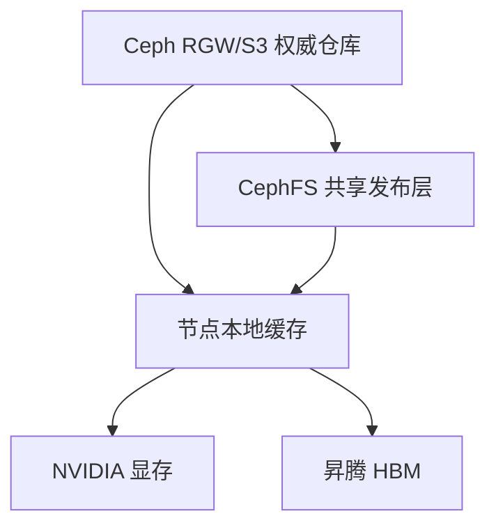

# CephFS、对象存储与CSI——为双资源池构建可扩展模型存储

:::info 系列与定位
**系列**：《NVIDIA＋昇腾双资源池 AI 推理集群：从 0 到部署、运维与故障排查》  
**阶段**：第五阶段——模型存储  
**本文定位**：Ceph 三种接口选型、Kubernetes CSI 接入与排障篇
:::

:::tip 系列约定
资源池 A = **NVIDIA GPU**（vLLM）· 资源池 B = **华为昇腾 NPU**（vLLM-Ascend）· 同一 Kubernetes · 共享存储/网关/监控 · **禁止**跨池组成同一分布式模型实例。
:::

[第 18 篇](./18-使用NFS构建双池共享模型存储.md) 使用 NFS 让 NVIDIA 和昇腾节点共享模型目录。随着节点、模型和并发冷启动增加，团队通常会考虑 Ceph。

但「使用 Ceph 存模型」仍然不够具体，因为 Ceph 提供三种主要接口：

- **RBD**：块存储
- **CephFS**：共享文件系统
- **RGW**：S3 兼容对象存储

它们都建立在 Ceph 底层 RADOS 之上，但应用看到的访问方式完全不同。本篇重点回答：哪一种最适合直接挂载模型目录；哪一种适合权威模型仓库；哪一种适合单 Pod 或缓存卷；Kubernetes 如何通过 CSI 使用；存储故障如何从 PVC 查到 MDS、MON 和 OSD。

本篇不重复完整 Ceph 集群部署。MON、MGR、OSD、MDS、RGW 和 CRUSH 原理应结合本站 [Ceph 学习路线](../../foundations/storage/ceph/00-Ceph学习路线.md) 深入学习。对照：[Ceph 三种接口选型](../../foundations/storage/ceph/PartIX-AI场景/30-AI集群中的Ceph接口选型.md) · [CSI 挂载链路](../../foundations/storage/ai-workloads/05-Kubernetes-CSI挂载链路与故障排查.md) · [对象存储与模型仓库](../../foundations/storage/ai-workloads/04-对象存储与模型仓库设计.md) · [Ceph 接入 Kubernetes](../../foundations/storage/ceph/PartIV-存储使用实战/15-Ceph接入Kubernetes.md)。

---

## 一、先看三种接口的区别

| 接口 | 应用看到什么 | 常见 K8s 访问 | 多节点共享 | 模型场景定位 |
|------|--------------|---------------|------------|--------------|
| RBD | 块设备/文件系统 | Ceph-CSI RBD PVC | 常见为 RWO | 单 Pod 数据盘、缓存卷 |
| CephFS | POSIX 文件目录 | Ceph-CSI CephFS PVC | RWX/ROX | 共享模型目录 |
| RGW | Bucket/Object/S3 API | SDK、OBC、下载工具 | API 并发访问 | 权威模型仓库、跨集群分发 |

Rook 官方存储架构文档也将 Ceph RBD 描述为常见 RWO 块卷、CephFS 描述为可供多节点应用使用的 RWX 共享文件系统，RGW 通过 S3 兼容接口访问 Bucket。

---

## 二、模型存储推荐组合



并不是所有环境都必须同时使用三种接口。

**简化方案**：CephFS 既作为受控仓库，也作为共享加载目录 + 节点本地缓存。

**规模化方案**：RGW 保存权威、不可变制品 → 发布/同步到 CephFS 或直接分发到节点缓存 → 推理从本地缓存加载。

**RBD 的位置**：每个推理 Pod 独立缓存；构建/转换任务工作盘；模型发布流水线临时空间；需要块设备语义的数据库或制品服务。它通常不是「几十个节点共同挂载同一个模型目录」的首选。

---

## 三、CephFS 为什么适合共享模型目录

CephFS 提供目录和文件语义，应用可以直接使用：

```text
/models/company-model-a/nvidia/3.0.0/config.json
/models/company-model-a/ascend/3.0.0/model-00001.safetensors
```

推理框架可以使用普通本地路径：

```bash
vllm serve /models/company-model-a/nvidia/3.0.0
```

**CephFS 内部简化理解**：MDS 管理目录、文件名和元数据；OSD 保存实际数据对象；MON 维护集群成员和状态共识；MGR 提供管理与监控；Ceph-CSI 把 Kubernetes PVC 与 CephFS 连接起来。

**模型场景的优点**：多节点共享；目录结构直观；适配依赖本地路径的框架；容量可横向扩展；CSI 动态创建子卷；可结合 Ceph 认证和快照；NVIDIA、昇腾节点使用相同 PVC 模式。

**需要付出的复杂度**：Ceph 集群自身运维；MDS 元数据性能；OSD 容量与恢复；MON 网络连通；Ceph-CSI 控制器和节点插件；CephX 密钥与 Secret；网络和故障域规划。

---

## 四～五、CephFS 并不自动比 NFS 更快；元数据压力

CephFS 有横向扩展能力，但实际性能取决于：OSD 数量与介质；副本或纠删码；MDS 数量和缓存；Ceph 公共/集群网络；客户端内核；文件数量和目录布局；并发读取；集群是否处于恢复、回填或 Scrub；CSI 挂载方式；数据是否命中客户端 Page Cache。

一个配置不合理、长期 `HEALTH_WARN`、容量接近满水位的 Ceph，可能比成熟 NAS 更差。选型应比较同样 20 个 Pod 并发冷启动、同样模型大小、同样网络条件、同样 SLO，而不是只比较产品名称。

大模型权重通常是少量大文件，有利于顺序吞吐；但模型仓库可能包含大量版本目录、Tokenizer 小文件、Hugging Face 缓存软链接、临时下载、编译缓存、开发分支——这些会增加 MDS 压力。

建议：正式制品目录不可变；缓存和临时文件不写入正式 CephFS 模型目录；避免每次启动递归扫描整个仓库；模型目录按逻辑模型和版本分层；监控 MDS 请求、缓存和延迟；大量小文件缓存放本地盘；发布过程使用 Manifest 直接定位文件。

---

## 六、RBD 为什么更像一块远程硬盘

RBD 把 Ceph 中的对象映射成块设备，Kubernetes 通常将其格式化后挂载为文件系统。

```yaml
apiVersion: v1
kind: PersistentVolumeClaim
metadata:
  name: model-build-workspace
  namespace: ai-platform
spec:
  accessModes:
    - ReadWriteOnce
  volumeMode: Filesystem
  storageClassName: ceph-rbd
  resources:
    requests:
      storage: 500Gi
```

**适合**：单个构建 Pod 工作区；模型转换临时盘；一个 Pod 独占的持久缓存；需要快照或克隆的工作盘；不需要多节点同时挂载同一文件系统。

**不适合直接解决**：20 台 NVIDIA/昇腾节点同时读取同一个共享 POSIX 模型目录。共享文件系统场景应使用 CephFS。

---

## 七～八、RGW 对象存储；不要默认把 S3 FUSE 当 CephFS

RGW 提供 S3 兼容对象接口，模型制品可以按 Bucket 和 Key 组织：

```text
s3://model-registry/
└── company-model-a/
    ├── source/3.0.0/
    ├── nvidia/bf16-3.0.0/
    ├── ascend/bf16-3.0.0/
    └── manifests/
```

**优点**：适合不可变大对象；API 访问和跨集群分发；可独立设置 Bucket 权限；容易按 Key 版本化；支持生命周期策略；发布流水线易于集成；不要求客户端挂载文件系统。

**局限**：推理框架通常需要本地目录或专用加载插件；POSIX rename、mmap、目录语义不同；下载完成前不能直接当成本地完整文件；需要管理凭证、Endpoint 和重试；Bucket 误配置也可能造成数据暴露。

推荐基础模式：

```text
RGW 下载到节点临时目录
→ 校验 Manifest 和 SHA256
→ 原子移动到本地缓存正式目录
→ 推理从本地路径加载
```

某些工具可以把 S3 Bucket 挂成目录，但这不意味着它具备完全相同的 POSIX 语义和性能。必须专项验证：mmap、随机读取、大文件分片、rename 原子性、一致性、断线重试、文件锁、缓存失效、多 Pod 并发、框架兼容性。

对小白最稳妥的基线：

```text
需要直接路径 → CephFS
需要权威仓库/分发 → RGW
需要单卷块设备 → RBD
```

---

## 九、Kubernetes CSI 在中间做什么

```text
PVC 创建
→ CSI Provisioner 创建 CephFS 子卷或 RBD 镜像
→ PV 生成并绑定
→ Pod 调度到节点
→ CSI Node 插件挂载卷
→ 容器看到目录
```

**Controller 侧**：Provision、Delete、Attach/Detach（取决于卷类型）、扩容、快照等。  
**Node 侧**：在目标节点执行 Stage/Publish；调用内核或用户态客户端挂载；将卷提供给 kubelet 和 Pod。

排查必须区分：

| 现象 | 方向 |
|------|------|
| PVC 未创建卷 | Controller / 后端问题 |
| PVC 已 Bound 但 Pod 挂载失败 | Node 插件 / 网络 / 客户端问题 |
| 已挂载但读取慢 | CephFS / MDS / OSD / 网络 / 应用问题 |

---

## 十～十一、Rook 内置 vs 外部 Ceph；不要让加速器节点承担 OSD

**模式 A：Rook 在 Kubernetes 中管理 Ceph**  
优点：Kubernetes 原生管理、自动化程度高、CSI 集成方便。风险：K8s 和 Ceph 故障域耦合；运维需同时理解两套系统；节点、磁盘和网络设计要求高。

**模式 B：使用外部 Ceph 集群**  
Ceph 由独立存储团队或独立节点管理，Kubernetes 只部署 CSI 并导入连接信息。优点：计算与存储生命周期分离；存储故障域更清晰；多个 K8s 集群可共享后端。风险：网络和权限配置更复杂；跨团队排障；CSI 与外部 Ceph 版本兼容需要治理。

双资源池推理集群通常更推荐独立存储故障域，特别是不要在没有评估的情况下把 Ceph OSD 和关键 GPU/NPU 工作负载混在同一批节点。

技术上可以让同一节点同时运行计算和存储，但会产生相关风险：GPU/NPU 业务占用 CPU、内存和 PCIe；OSD 恢复占用磁盘和网络；节点维护同时损失算力与存储副本；驱动升级重启影响 OSD；Device Plugin 故障处理可能误操作存储 Pod；故障定位难以区分计算还是存储；高负载推理与 Ceph 恢复相互干扰。

入门和生产基线优先：

```text
控制节点独立
NVIDIA 计算节点独立
昇腾计算节点独立
Ceph 存储节点独立
```

资源有限时若必须混部，要做资源预留、优先级、网络隔离、维护演练和故障域评估。

---

## 十二～十三、部署前检查；不要盲抄 StorageClass

```bash
ceph -s
ceph health detail
ceph df
ceph osd tree
ceph fs status
```

至少确认：MON 满足高可用设计；OSD 数量和故障域满足保护策略；CephFS 已有可用 MDS；没有长期未处理的 `HEALTH_ERR`；容量未接近关键水位；网络连通；恢复/回填对业务性能影响可接受。

```bash
kubectl get csidriver
kubectl get pods -A | grep -E 'csi|rook|ceph'
kubectl get storageclass
```

确认 Ceph-CSI Node DaemonSet 能进入：NVIDIA 污点节点、昇腾污点节点、普通工作节点。如果 CSI Node Pod 没有两个资源池 Toleration，PVC 可以 Bound，但模型 Pod 可能在加速器节点挂载失败。

CephFS StorageClass 通常包含：CSI Provisioner 名称、clusterID、fsName、数据池、CephX 用户 Secret、reclaimPolicy、mountOptions、扩容等参数。这些值与实际 Ceph 部署、Rook 命名空间和版本强相关。

正确流程：从当前 Rook/Ceph 版本官方示例开始 → 替换真实 clusterID、fsName 和 Secret → 设置 Retain/Delete 策略 → 检查内外部集群路径 → 测试创建、挂载、扩容和删除 → 归档最终 YAML。

---

## 十四～十五、CephFS 模型 PVC 与只读推理挂载

假设平台已经提供 `StorageClass: cephfs-models-retain`：

```yaml
apiVersion: v1
kind: PersistentVolumeClaim
metadata:
  name: cephfs-model-repository
  namespace: ai-prod
spec:
  accessModes:
    - ReadWriteMany
  volumeMode: Filesystem
  storageClassName: cephfs-models-retain
  resources:
    requests:
      storage: 5Ti
```

```bash
kubectl apply -f cephfs-model-pvc.yaml
kubectl get pvc cephfs-model-repository -n ai-prod
kubectl describe pvc cephfs-model-repository -n ai-prod
kubectl get pv <绑定PV> -o yaml
```

重点检查：Bound；StorageClass 正确；ReclaimPolicy 符合模型安全要求；CephFS 子卷已创建；PV 没有绑定到错误 Namespace/PVC。

PVC 可以是 RWX，但生产推理容器仍应只读：

```yaml
spec:
  securityContext:
    fsGroup: 2000
  containers:
    - name: inference
      image: <对应厂商推理镜像>
      volumeMounts:
        - name: models
          mountPath: /models
          readOnly: true
        - name: cache
          mountPath: /model-cache
  volumes:
    - name: models
      persistentVolumeClaim:
        claimName: cephfs-model-repository
    - name: cache
      emptyDir:
        sizeLimit: 300Gi
```

正式生产更可能把 cache 改为节点本地 NVMe 路径或独立缓存卷，第 20 篇会详细实现。

同一 Namespace 中的 NVIDIA 和昇腾 Deployment 可以引用同一 PVC，但分别读取：

```text
/models/company-model-a/nvidia/<版本>
/models/company-model-a/ascend/<版本>
```

不要把厂商目录选择交给容器内自动猜测，Deployment 参数应明确模型路径。

---

## 十六～十七、对象存储接入与 Key 规范

**方式 A：已有企业 S3/RGW**  
平台提供 Endpoint、Bucket、Access Key/Secret Key 或临时凭证、CA 证书、网络策略、只读权限。Pod 通过 SDK、CLI 或分发组件下载。

**方式 B：Rook ObjectBucketClaim**  
Rook 可通过 ObjectBucketClaim 创建 Bucket，并把连接信息和凭证放入 ConfigMap/Secret。具体 API 和 StorageClass 以目标 Rook 版本为准。

```yaml
apiVersion: objectbucket.io/v1alpha1
kind: ObjectBucketClaim
metadata:
  name: model-registry-bucket
  namespace: ai-platform
spec:
  generateBucketName: model-registry
  storageClassName: <RGW_BUCKET_STORAGECLASS>
```

创建后必须限制 Secret 读取权限，不能让所有 Namespace 访问模型仓库写凭证。

对象存储没有传统目录，斜杠只是 Key 前缀。推荐：

```text
models/<逻辑模型>/<vendor>/<artifact-version>/manifest.yaml
models/<逻辑模型>/<vendor>/<artifact-version>/files/...
```

不要覆盖 `models/company-model/nvidia/latest/model.safetensors`。推荐新版本新 Key；`latest` 只作为小型指针或模型注册平台映射。上传完成标记：先上传所有分片 → 上传 Manifest → 完成校验 → 最后写入 READY 对象或更新注册状态。消费者只有看到完整 Manifest 和 READY 后才允许下载。

---

## 十八、Ceph 数据保护如何影响容量

**三副本示例**：近似理解 `100TB 原始容量 ÷ 3 ≈ 33TB` 理论数据容量；还要保留系统、元数据、恢复和安全水位，实际可安全使用容量更低。

**纠删码示例**：若数据块为 k、校验块为 m，理论空间放大约为 `(k + m) / k`。不同接口、元数据池和写入模式有具体要求。

不要只用 `ceph df` 的原始容量直接承诺模型可用空间。

---

## 十九～二十、CephFS 性能测试与监控分层

```bash
fio --name=cephfs-model-read \
  --filename=/models/<测试大文件> \
  --rw=read \
  --bs=4M \
  --iodepth=8 \
  --direct=1 \
  --numjobs=1 \
  --runtime=120 \
  --time_based \
  --group_reporting

time find /models/<测试模型目录> -type f -printf '%p\n' >/dev/null
```

多节点并发冷启动：在 NVIDIA 和昇腾节点分批启动真实模型，观察 MDS/OSD 延迟、Ceph 网络、CSI 挂载耗时、Pod Ready 时间、恢复/回填影响。故障条件测试前需存储团队批准，且不能破坏生产数据或违反保护策略。

| 层级 | 关注点 |
|------|--------|
| 集群层 | health、MON Quorum、OSD Up/In、PG、Nearfull/Full、Recovery、Slow Ops、容量 |
| CephFS/MDS | Active/Standby、请求延迟、元数据缓存、Session、Cap 回收 |
| CSI 层 | Provision/Mount 失败、Controller/Node Pod、操作时延、Secret、节点插件覆盖率 |
| 模型业务层 | PVC 绑定时间、Volume Mount、权重吞吐、加载时间、并发冷启动成功率、缓存命中率 |

---

## 二十一、PVC Pending 排查

```bash
kubectl describe pvc <PVC> -n <NS>
kubectl get events -n <NS> --sort-by='.lastTimestamp'
kubectl get storageclass <SC> -o yaml
kubectl get pods -A | grep -E 'csi|rook|ceph'
kubectl logs -n <CSI_NAMESPACE> <CSI_CONTROLLER_POD> \
  --all-containers --tail=200
```

常见原因：StorageClass 名称错误；CSI Provisioner 未运行；Secret 名称或 Namespace 错误；clusterID/fsName 错误；CephFS 或 MDS 不可用；Ceph 权限不足；容量或健康状态异常；网络无法访问 MON；目标版本参数不兼容。

不要只看 Rook Operator 日志；真正 Provision 请求可能发生在 Ceph-CSI Controller。

---

## 二十二、PVC Bound 但 Pod FailedMount

```bash
kubectl describe pod <POD> -n <NS>
kubectl get pod <POD> -n <NS> -o wide
kubectl get pod -n <CSI_NAMESPACE> -o wide | grep <NODE>
kubectl logs -n <CSI_NAMESPACE> <CSI_NODE_POD> \
  --all-containers --tail=200
```

常见原因：CSI Node DaemonSet 没有容忍 GPU/NPU Taint；节点无法连接 Ceph MON；内核 Ceph 模块或 ceph-fuse 客户端问题；CephX 认证失败；Secret 轮换不一致；DNS、MTU 或路由问题；节点时间偏差；挂载参数不支持。RBD 和 CephFS 问题应分别沿对应 CSI 链路检查，并确认客户端能访问 MON 端点。

---

## 二十三、已挂载但模型加载慢

按顺序检查：

1. **应用层**：是否递归扫描整个仓库；是否随机读取大量分片；是否启用不适合网络文件系统的加载方式；是否每个 Pod 重复复制；是否缓存未命中。
2. **节点层**：CPU、内存和 Page Cache；节点到 Ceph 网络；客户端挂载方式；内核日志；CSI 挂载参数。
3. **CephFS 层**：`ceph fs status`；`ceph tell mds.<MDS_NAME> status`。
4. **OSD 层**：`ceph -s`；`ceph health detail`；`ceph osd perf`；`ceph df`。关注 Slow Ops、OSD 延迟、PG 不洁净、Recovery/Backfill、Nearfull、磁盘或网络瓶颈。

:::caution
不要看到模型慢就直接增加 MDS 数量。大文件数据吞吐主要还依赖 OSD 和网络；MDS 主要处理元数据。
:::

---

## 二十四、Ceph 故障对双池的影响

| 故障 | 影响 |
|------|------|
| 一个 OSD 故障 | 集群可能继续服务，但恢复和回填占用磁盘与网络，模型加载变慢 |
| MDS Active 故障 | Standby 接管需要时间，期间元数据操作可能受影响 |
| MON Quorum 异常 | 新客户端连接和集群管理受影响，严重时整个存储不可用 |
| Ceph 接近 Full | 写入和恢复能力受限，可能引发严重故障 |
| 计算池与 Ceph 共用网络 | NCCL/HCCL 与 Ceph 恢复争抢网络，推理和存储同时抖动 |

因此网络设计要区分：管理网络、业务请求网络、计算互联网络、存储访问/复制网络。是否物理隔离取决于规模，但带宽和故障域必须明确。

---

## 二十五～二十六、安全、Secret、ReclaimPolicy 与备份

**CephX 最小权限**：推理客户端只需要读取指定 CephFS 路径，不应拥有整个 Ceph 集群管理权限。

**Kubernetes Secret**：放在 CSI 要求的 Namespace；RBAC 限制读取；不在文章、Git 和日志中写真实 Key；建立轮换流程；轮换前验证现有挂载和新挂载行为。

**RGW 凭证**：每个应用/团队独立身份；推理缓存组件只读；发布流水线写指定前缀；禁止匿名 Bucket；使用 TLS 和可信 CA；记录对象访问审计。

即使 CephFS PVC 是 RWX，推理 Pod 仍使用 `readOnly: true`；发布流水线使用独立 PVC 或身份写入。

模型 StorageClass 应明确 `reclaimPolicy: Retain`（或由平台确认何时可用 Delete）。**Retain 仍然不是备份**——Ceph 副本、CephFS 快照和对象版本化都在同一 Ceph 故障域时，无法替代独立备份。重要模型应有不可变版本、Ceph 层数据保护、快照或对象版本、独立备份、恢复到新 CephFS/新 Bucket 的演练、Manifest 哈希验证。

删除前必须查看真实字段：

```bash
kubectl get pvc <PVC> -n <NS> -o yaml
kubectl get pv <PV> -o yaml
kubectl get storageclass <SC> -o yaml
```

不要凭 StorageClass 名字中的 retain 判断。

---

## 二十七、NFS 迁移到 CephFS 的步骤

1. 创建 CephFS 测试 StorageClass/PVC  
2. 从 NFS 全量复制到 CephFS Staging  
3. 校验文件数、大小和 SHA256  
4. 在两池测试节点挂载 CephFS  
5. 启动 NVIDIA 与昇腾测试模型  
6. 执行业务回归和并发冷启动测试  
7. 暂停旧仓库发布  
8. 最终增量同步  
9. 新 PVC 灰度发布少量副本  
10. 分批切换所有模型  
11. 保留 NFS 只读回退期  
12. 验证备份后再下线旧路径  

复制工具必须保留或重新设置 UID、GID、权限、软链接和时间信息，并对最终内容做哈希校验。

---

## 二十八、选型结论表

| 需求 | 推荐起点 |
|------|----------|
| 小规模、已有 NAS、追求简单 | NFS |
| 多节点共享 POSIX 目录、已有 Ceph | CephFS |
| 权威模型仓库、跨集群分发 | RGW/S3 |
| 单 Pod 构建盘或持久缓存 | RBD |
| 极致冷启动 | 共享源 + 节点 NVMe 缓存 |
| 两池共用源权重但厂商产物不同 | 统一注册表 + 分 vendor 目录 |
| 高可用要求 | 存储独立故障域 + 缓存 + 备份恢复 |

---

## 二十九～三十、生产验收清单与练习

**Ceph 集群**：版本和支持周期明确；MON、MGR、OSD、MDS 满足高可用；故障域和 CRUSH 规则经过检查；容量水位和恢复余量充足；健康告警接入统一平台；完成 OSD、MDS 和存储节点故障演练；模型数据有独立备份。

**Kubernetes/CSI**：Ceph-CSI 版本与 Kubernetes/Ceph 兼容；CSI Controller 正常；CSI Node Pod 覆盖两种加速器节点；Toleration 和 NodeSelector 正确；StorageClass 参数来自目标版本官方文档；ReclaimPolicy 明确；PVC 创建、挂载、扩容和删除已测试；Secret 遵循最小权限。

**模型业务**：两池分别读取正确 vendor 目录；推理 Pod 只读挂载；缓存和编译产物不写入正式模型目录；多节点并发冷启动达标；Ceph 恢复期间 SLO 经过测试；RGW 下载具备哈希校验；本地缓存可自动重建；NFS/CephFS 迁移有回滚方案。

**练习**：列出当前 Ceph 的 MON、MGR、OSD、MDS 和 RGW；执行 `ceph -s`、`ceph df` 和 `ceph fs status` 并解释结果；创建测试 CephFS PVC；在 NVIDIA 和昇腾节点分别挂载；验证多节点读取和只读限制；创建测试 RBD PVC 并比较访问模式；通过测试 Bucket 上传小型模型制品并下载校验；模拟 CSI Node Pod 缺少 Toleration，观察 FailedMount；设计 NFS 到 CephFS 的灰度迁移；画出 Ceph 故障会同时影响两个算力池的公共依赖图。

---

## 三十一、本篇小结

```text
CephFS：给多个节点共享 POSIX 模型目录
RBD：给单 Pod/单节点提供块卷
RGW：作为 S3 兼容权威仓库与分发入口
Ceph-CSI：连接 Kubernetes PVC 和 Ceph 后端

RGW 或受控 CephFS 保存正式制品
→ CephFS 共享或对象下载
→ 节点 NVMe 缓存
→ NVIDIA 显存 / 昇腾 HBM
```

同时要警惕：Ceph 是两个算力池的公共依赖。算力双池不能自动解决共享存储故障，必须通过存储高可用、本地缓存、备份和恢复演练补齐。

下一篇将实现最后一段链路：怎样把模型从 NFS/CephFS/RGW 安全分发到节点本地缓存，避免大量 Pod 同时启动打爆共享存储，并完成版本校验、预热和垃圾回收。

---

## 参考资料

- [Ceph Architecture](https://docs.ceph.com/en/latest/architecture/)
- [Ceph File System](https://docs.ceph.com/en/latest/cephfs/)
- [Ceph Erasure Code](https://docs.ceph.com/en/latest/rados/operations/erasure-code/)
- [Rook Storage Architecture](https://rook.io/docs/rook/latest/Getting-Started/storage-architecture/)
- [Rook Example Configurations](https://rook.io/docs/rook/latest/CRDs/Cluster/ceph-cluster-crd/)
- [Rook CSI Common Issues](https://rook.io/docs/rook/latest/Troubleshooting/ceph-csi-common-issues/)
- [Persistent Volumes](https://kubernetes.io/docs/concepts/storage/persistent-volumes/)

---

## 相关链接

- [专栏目录](./00-专栏目录.md)
- [第 18 篇：使用 NFS 搭建双资源池共享模型存储](./18-使用NFS构建双池共享模型存储.md)
- [第 17 篇：模型文件到底存在哪里](./17-模型文件到底存在哪里.md)
- [Ceph 学习路线](../../foundations/storage/ceph/00-Ceph学习路线.md)
- [Ceph 三种接口选型](../../foundations/storage/ceph/PartIX-AI场景/30-AI集群中的Ceph接口选型.md)
- [CSI 挂载链路与故障排查](../../foundations/storage/ai-workloads/05-Kubernetes-CSI挂载链路与故障排查.md)

---

← [第 18 篇](./18-使用NFS构建双池共享模型存储.md) · → [第 20 篇：模型分发、节点缓存与预热](./20-模型分发镜像管理缓存与预热.md)
