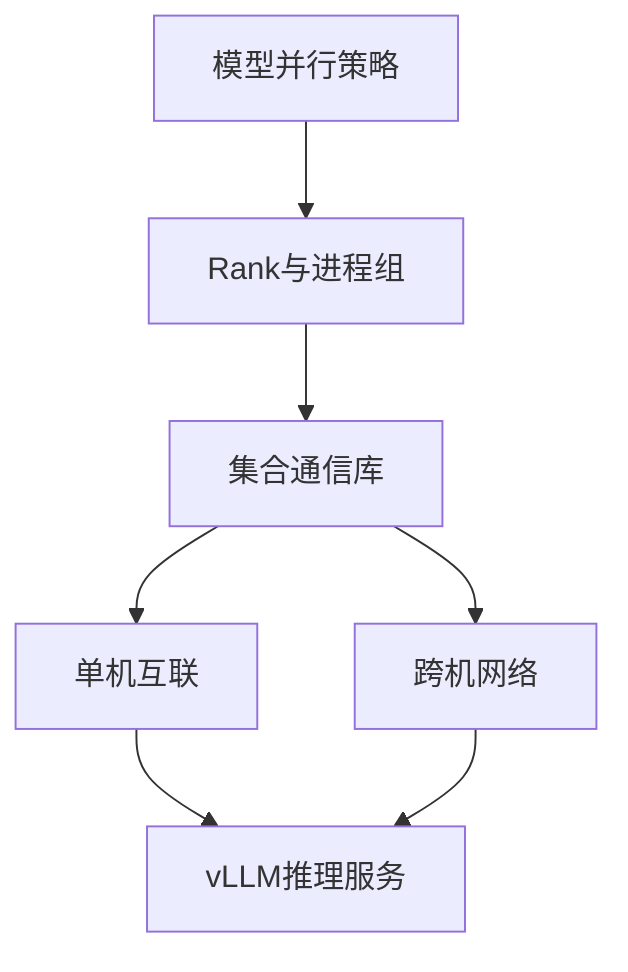
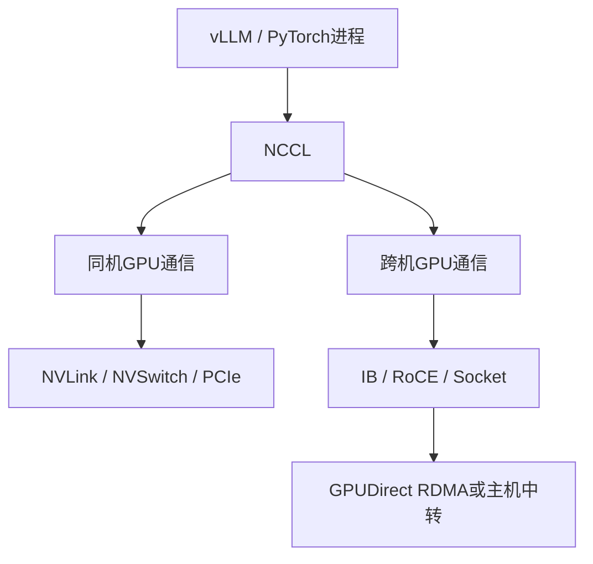
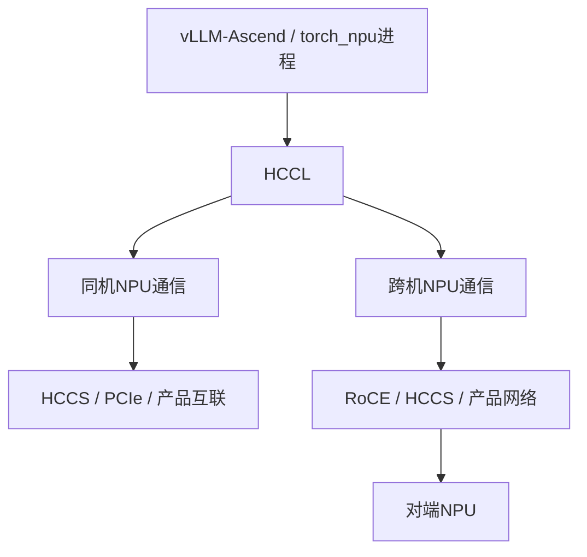
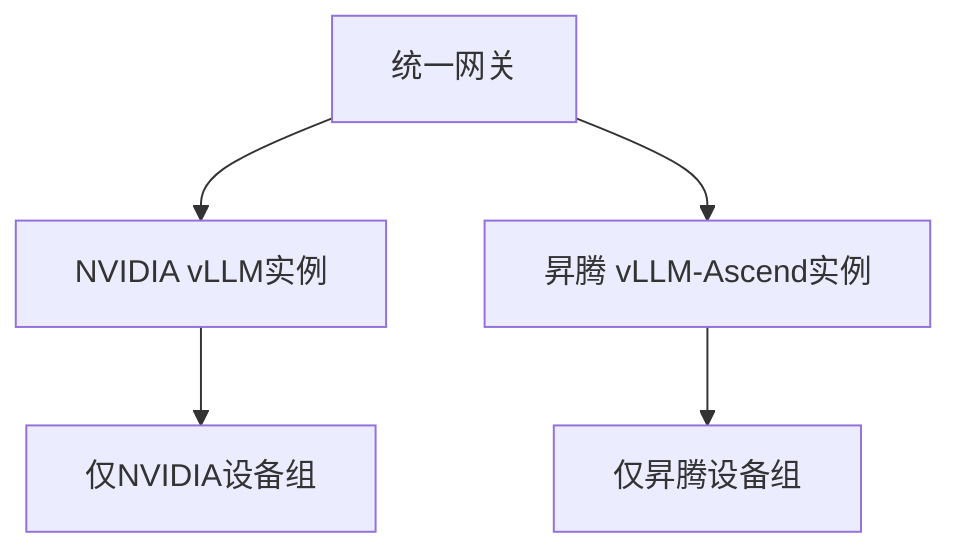

# 多卡多机推理——理解NCCL与HCCL两条通信链路

:::info 系列与定位
**系列**：《NVIDIA＋昇腾双资源池 AI 推理集群：从 0 到部署、运维与故障排查》  
**阶段**：第六阶段——两套机器部署推理  
**本文定位**：并行通信原理、多机部署前验收与集合通信排障篇
:::

:::tip 系列约定
资源池 A = **NVIDIA GPU**（vLLM）· 资源池 B = **华为昇腾 NPU**（vLLM-Ascend）· 同一 Kubernetes · 共享存储/网关/监控 · **禁止**跨池组成同一分布式模型实例。
:::

[第 22 篇](./22-在NVIDIA机器部署原生vLLM.md) 和 [第 23 篇](./23-在昇腾机器部署vLLM-Ascend.md) 分别在 NVIDIA、昇腾节点上部署了单机多卡推理。当模型无法放进一台服务器，或单机吞吐无法满足需求时，就会进入多机推理。

最常见的误解是：两台机器互相 ping 通 → 容器端口能访问 → 多机推理应该就能运行。实际上，多机推理至少包含：控制与进程编排网络、集合通信 Bootstrap、GPU/NPU 数据面、RDMA/RoCE 或 Socket 传输、Rank 和设备映射、模型与软件版本一致性。

NVIDIA 使用 NCCL，昇腾使用 HCCL。两条链路目标相似，但设备、拓扑、工具、配置和故障表现不同。



对照：[NCCL Timeout 排查](../../platform/gpu-cluster/troubleshooting/07-NCCL%20Timeout%20排查流程.md) · [GPU 拓扑感知调度](../../platform/gpu-cluster/scheduling-sharing/12-GPU%20集群拓扑感知调度.md)。

---

## 一、学完本文应掌握什么

解释 TP、PP、DP、EP 为什么需要不同通信；理解 Rank、World Size 和进程组；画出 NCCL 与 HCCL 从进程到物理链路的路径；区分单机 NVLink/HCCS 和跨机 IB/RoCE/TCP；在启动 vLLM 前独立验证设备、网络和集合通信；判断故障层；为多机推理设计隔离、安全、监控和变更；明白一个分布式实例绝不能混用 NVIDIA GPU 和昇腾 NPU。

---

## 二、为什么大模型推理需要通信

| 并行方式 | 切分对象 | 主要通信 | 对网络敏感度 | 常见目标 |
|----------|----------|----------|--------------|----------|
| TP | 层内张量 | AllReduce/AllGather/ReduceScatter | 很高 | 让单个模型跨多卡 |
| PP | 模型层/阶段 | 点对点传激活 | 中到高 | 跨设备/节点容纳模型 |
| DP | 模型副本 | 请求调度、部分控制通信 | 视实现而定 | 提升吞吐和可用性 |
| EP | MoE 专家 | All-to-All 等 | 很高 | 分散专家权重与计算 |

**TP**：频率高、对时延和带宽敏感。若 TP 跨服务器，几乎每层都可能碰到跨机网络——网络较弱时，跨机 TP 可能让更多设备得到更差性能。

**PP**：通信频率通常低于 TP，但存在流水线气泡和阶段不均衡。跨机互联较弱时，有时会优先让 TP 留在单机内、跨机用 PP；是否更优必须对目标模型实测。

**DP**：主要用于吞吐横向扩展和副本容错。

**EP**：对网络双向带宽、拥塞和负载均衡非常敏感。

---

## 三、理解 Rank、World Size 与进程组

| 概念 | 含义 |
|------|------|
| Rank | 每个参与进程的唯一编号（0、1、2…）；Rank 0 常承担初始化协调，但不是「性能永远最强的主卡」 |
| Local Rank | 当前节点内进程编号，用于映射本机设备 |
| World Size | 一个通信组中的总进程数；两机×每机 4 卡 = 8 |

对一个模型并行组，常见：`模型并行 World Size ≈ TP × PP`。再有多个 DP 副本时，会形成多个模型并行组或更大拓扑，具体 Rank 编排由引擎决定。

**所有 Rank 必须一致**：World Size；Rank 唯一且连续；模型与 Tokenizer；镜像与软件版本；TP/PP/EP；数据类型与量化；通信接口与端口；关键环境变量；模型路径及内容摘要。

:::caution
典型故障：Rank 3 模型加载失败退出 → 其他 Rank 继续等待 → 最后看到 NCCL/HCCL 超时。通信超时不一定是网络故障，也可能是某个 Rank 更早 OOM 或文件错误。
:::

---

## 四～五、NVIDIA 的 NCCL 路径与昇腾的 HCCL 路径



同机路径由拓扑、驱动、P2P 和 NCCL 选择决定。跨机常见：GPU → PCIe/NVLink → RDMA NIC → IB/RoCE → 对端。若 GPUDirect RDMA 不可用，可能经 CPU 内存中转。



不同产品代际物理路径不同（如 Atlas A2 单机 HCCS、跨机 RDMA；A3 又不同）。不能笼统写「昇腾多机一定是某一种 RoCE 拓扑」，必须按服务器产品、NPU 型号、组网和官方部署指南确认。

---

## 六、两条通信链路的对照

| 层级 | NVIDIA 路径 | 昇腾路径 |
|------|-------------|----------|
| 推理引擎 | vLLM | vLLM + vLLM-Ascend |
| PyTorch 设备后端 | CUDA | torch_npu |
| 集合通信 | NCCL | HCCL |
| 单机高速互联 | NVLink/NVSwitch 等 | HCCS/产品互联等 |
| 跨机数据面 | IB/RoCE/Socket | RoCE/HCCS/产品支持网络 |
| 设备状态 | `nvidia-smi` | `npu-smi info` |
| 集合通信压测 | nccl-tests | 目标 CANN/产品配套 HCCL 测试工具 |
| 常用接口变量 | `NCCL_SOCKET_IFNAME` | `HCCL_IF_IP`、`HCCL_SOCKET_IFNAME` |

共同原则：自动选择优先，多网卡或选错路径时才明确指定；先验证物理和 RDMA，再验证集合通信；调试变量不应无期限固化；每个节点相同软件栈；生产通信网隔离；性能以实测为准。

---

## 七、单机多卡先验收什么

跨机前必须先证明每台机器内部健康。

**NVIDIA**：

```bash
nvidia-smi
nvidia-smi topo -m
nvidia-smi topo -p2p p
nvidia-smi topo -p2p n
./build/all_reduce_perf -b 8 -e 128M -f 2 -g 8
```

保存 algbw、busbw、错误计数、GPU 拓扑、NCCL 版本、测试时间。不要拿不同型号/版本/消息大小/拓扑的 busbw 直接横向比较。

**昇腾**：

```bash
npu-smi info
cat /etc/hccn.conf

for id in $(seq 0 7); do
  hccn_tool -i "${id}" -link -g
  hccn_tool -i "${id}" -net_health -g
done
```

然后使用与目标 CANN/产品配套的 HCCL 测试工具。不要用来源不明的二进制，也不要用 NCCL 测试结果直接判断 HCCL。

**单机验收标准**：设备全部健康；P2P/高速互联符合设计；集合通信正确性通过；带宽无坏卡/坏链路离群；连续多轮稳定；无温度/功耗/ECC/链路错误；同型号节点结果在合理区间。只有全部节点单机验收通过，才开始跨机。

---

## 八～九、控制面与数据面；跨机基础网络验收

| 平面 | 承担 |
|------|------|
| 控制/Bootstrap | 进程发现、Ray/编排、Rank 初始化、服务注册、健康检查与日志 |
| 高速数据面 | NCCL/HCCL 集合通信、大量张量传输、TP/EP 高频交换 |

明确：哪个 IP 用于 vLLM/Ray；哪个接口用于 Bootstrap；哪组 HCA/NPU 网络用于 RDMA；哪些端口开放；Pod 内接口名。多网卡最容易出现节点 A 选业务网、节点 B 选存储网 → IP 都存在但路径不对 → 初始化挂起。

```bash
hostname -f
ip -br address
ip route
ip rule
ip link show <interface>
ss -lntup
nc -vz <peer-ip> <port>
rdma link
ibv_devices
ibv_devinfo
```

检查主机名唯一、接口 UP、路由对称、DNS、无重叠网段、时钟同步；两端 MTU 一致；按最小范围放通端口。普通 Ping 成功不代表大包、RoCE 或 RDMA 正常。NCCL 会自动发现跨机接口；若某接口虽 UP 但节点间不可通信，初始化可能失败或挂起。

---

## 十～十一、NCCL 跨机验收与诊断变量

**第 1 步**：用批准的 RDMA 工具测读/写带宽、延迟、双向流量、不同消息大小、多 Rail、稳定性。TCP `iperf3` 只能验证 Socket，不能证明 GPUDirect RDMA。

**第 2 步**：跨机 nccl-tests（示意，值不可照抄）：

```bash
export NCCL_SOCKET_IFNAME='=bond0.310'
export NCCL_IB_HCA='=mlx5_0:1,mlx5_1:1'

mpirun \
  -np 16 -N 8 \
  -H gpu-node-01:8,gpu-node-02:8 \
  -x NCCL_DEBUG=INFO \
  -x NCCL_SOCKET_IFNAME \
  -x NCCL_IB_HCA \
  ./build/all_reduce_perf_mpi \
  -b 8 -e 1G -f 2 -g 1
```

**第 3 步**：日志确认 Bootstrap IP、NET/IB 还是 NET/Socket、GDRDMA、mlx5 设备、拓扑与 Channel。示例：`[send] via NET/IB/GDRDMA` vs `[send] via NET/Socket`。

**第 4 步**：集合通信正确、稳定且达标后，再启动多机 vLLM。默认单机用 multiprocessing，多机常用 Ray；目标版本也可能提供 `--nnodes`/`--node-rank`/`--master-addr`/`--master-port`，以冻结镜像中 `vllm serve --help` 为准。

```bash
export NCCL_DEBUG=INFO
export NCCL_DEBUG_SUBSYS=INIT,NET,GRAPH,COLL
# 仅隔离问题的回退实验，不能当生产方案：
# export NCCL_IB_DISABLE=1
```

排障完成后移除临时变量。长期固化调试变量可能导致性能下降、崩溃或挂起。

---

## 十二～十三、HCCL 跨机验收与接口变量

```bash
npu-smi info
cat /etc/hccn.conf

for id in $(seq 0 7); do
  hccn_tool -i "${id}" -link -g
  hccn_tool -i "${id}" -net_health -g
  hccn_tool -i "${id}" -gateway -g
done

# 数据面连通（命令随产品变化，先看帮助）
hccn_tool --help
for id in $(seq 0 7); do
  hccn_tool -i "${id}" -ping -g address <peer-npu-ip>
done
```

然后跑官方推荐的 HCCL 测试：AllReduce 正确性、AllGather/ReduceScatter、All-to-All（EP）、不同消息大小、单机与跨机带宽、稳定性。再启动 vLLM-Ascend——所有节点同一镜像 Digest、相同兼容栈、模型内容一致、并行参数一致、Rank 不重复、网卡与端口正确。

多机故障时常核对：`HCCL_IF_IP`、`GLOO_SOCKET_IFNAME`、`TP_SOCKET_IFNAME`、`HCCL_SOCKET_IFNAME` 是否指向选定 NIC。变量组合跟随目标模型教程和版本。

| 变量 | 作用 |
|------|------|
| `HCCL_IF_IP` | 指定主机通信 NIC 的 IP；优先于接口名与自动选择 |
| `HCCL_SOCKET_IFNAME` | 按接口名前缀选择主机 NIC |
| `HCCL_IF_BASE_PORT` | 起始端口，会占用一段范围，按目标 CANN 文档放通防火墙 |

推荐过程：先记录自动选择结果 → 选错时明确控制面/数据面 → 所有节点一致设置 → 集合通信压测 → vLLM-Ascend 压测 → 保存配置、理由和回滚值。不要同时乱配多个变量。

---

## 十四、Kubernetes 中的多机推理不能只靠普通 Deployment

分布式模型实例需要一组相互依赖的 Pod：一起调度 → Rank 唯一 → 网络与设备就绪 → 同步启动 → 关键 Worker 失败时协调处理。普通 Deployment 可能出现：第一个 Pod 占满卡、第二个 Pending；Rank 0 先超时；滚动更新混新旧版本；Service 把业务请求发到 Worker 端口。

| 方式 | 适用场景 | 注意点 |
|------|----------|--------|
| vLLM Ray 脚本/集群 | 裸机或受控容器验证 | 网络、生命周期、安全要自管 |
| 多机 mp | 目标版本支持且拓扑简单 | nnodes、Rank、Master 端口必须一致 |
| LeaderWorkerSet | K8s 多机推理 | Leader+Workers 生命周期模型 |
| Volcano/PodGroup | 需要 Gang Scheduling | 要安装并维护调度组件 |
| Ascend mind-cluster/Operator | 昇腾拓扑与故障恢复 | 与产品和组件版本强相关 |

核心要求：分布式实例整体发布；同一镜像 Digest 和配置；Gang Scheduling 或等效能力；不把外部请求随机发给内部 Worker；区分 API/控制/集合通信端口；失败时整组重建或按引擎恢复；更新时禁止新旧版本混组。

---

## 十五～十六、多机参数示意

**NVIDIA**（2 节点×4 GPU，TP=4，PP=2，示意）：

```bash
vllm serve /models/company-model-a/nvidia/3.0.0-bf16 \
  --tensor-parallel-size 4 \
  --pipeline-parallel-size 2 \
  --distributed-executor-backend ray \
  --max-model-len 8192 \
  --max-num-seqs 16
```

Ray 如何启动、资源如何映射、NIC 如何选择，按目标版本官方多机文档。支持 mp 时用 `--nnodes`/`--node-rank`/`--master-addr`/`--master-port`，不能与 Ray 参数混用。

**昇腾**：先决定 TP 是否跨机、PP 如何跨机、是否用 DP/EP、教程是否验证该组合、HCCL 用哪组接口、由谁生成 Rank 与设备映射。

```bash
export HCCL_IF_IP='<this-node-host-ip>'
export HCCL_SOCKET_IFNAME='<host-interface>'
export GLOO_SOCKET_IFNAME='<host-interface>'
export TP_SOCKET_IFNAME='<host-interface>'
```

然后按目标模型的 vLLM-Ascend 官方教程启动。不要从另一个模型教程剪贴启动命令。

---

## 十七、同一个实例为什么不能混用 GPU 和 NPU

错误设想：4 张 NVIDIA GPU + 4 张昇腾 NPU → TP=8。不可行：CUDA 与 CANN 不同；PyTorch CUDA 与 torch_npu 不同；NCCL 与 HCCL 不是同一进程组后端；算子/内存/图执行不同；没有这种透明混合分片能力；vLLM 与 vLLM-Ascend 是两套运行环境。



双池是在服务层统一路由和容灾，不是在一个集合通信 World 中混卡。

---

## 十八、通信故障的七层排查法

| 层 | 检查内容 |
|----|----------|
| 1 调度与资源 | Worker 是否同时获得设备；数量；Rank 映射；是否跨错资源池；拓扑调度 |
| 2 容器与版本 | 镜像/模型 Digest、驱动可见性、PyTorch/vLLM、NCCL 或 CANN/HCCL、参数、环境变量 |
| 3 进程和 Rank | World Size、Rank 唯一、Master 地址端口、是否有 Rank 提前退出、时间同步；找最早失败的 Rank |
| 4 IP 与 Socket | 地址、路由、监听、连通；多网卡选错、防火墙、MTU |
| 5 RDMA/设备网络 | `rdma link`/`ibv_*` 或 `hccn.conf`/`hccn_tool`；再做跨节点数据面测试 |
| 6 集合通信 | nccl-tests + NCCL_DEBUG，或 HCCL 测试工具与接口/IP/端口 |
| 7 vLLM 与业务 | Ray/mp、模型分片、TP/PP/EP、OOM、请求长度并发、网关 |

---

## 十九～二十、典型故障矩阵；不要用增大 Timeout 掩盖根因

| 现象 | 更可能的层 | 第一检查项 |
|------|------------|------------|
| Worker Pod Pending | 调度 | 设备数、Label/Taint、Gang Scheduling |
| 某个 Worker 立即退出 | 版本/模型/容量 | 该 Worker 最早日志 |
| 所有 Rank 初始化超时 | Socket/接口/配置 | Master、NIC、端口、全量日志 |
| 只有一个 Rank 超时 | Rank/局部链路 | Rank 映射、该节点设备与网络 |
| NCCL 走 NET/Socket | RDMA 未启用/未选中 | HCA、插件、GDR、容器设备 |
| 单机快、跨机慢 | 跨机网络 | RDMA 带宽、Rail、GDR、拥塞 |
| HCCL 建链失败 | HCCN/IP/Rank | `hccn.conf`、接口变量、NPU IP |
| 小消息正常、大消息失败 | MTU/拥塞/缓冲 | RDMA 压测、交换机计数器 |
| 集合测试通过但 vLLM 卡住 | 框架/模型 | Ray/mp、分片、OOM、参数 |

增大超时有合理场景（加载慢、首次编译、大规模初始化、官方教程要求）。若根因是接口选错、Rank 缺失、防火墙、RDMA Down、Worker OOM、版本不一致——把超时从 10 分钟改为 60 分钟只会让故障发现晚 50 分钟。正确顺序：定位最早失败点 → 修复一致性或连通 → 重做集合通信测试 → 再按正常启动时间设合理 Timeout。

---

## 二十一～二十二、性能调优顺序与安全

```text
冻结变量 → 测物理与基础网络 → 测集合通信
→ 测引擎空载启动 → 测业务负载 → 一次只改一个参数
```

不要同时改 TP 数 + NCCL/HCCL 算法 + Batch + 上下文 + CPU 绑定。

安全最低要求：集合通信网与公网隔离；专用 VLAN/VRF 或物理网络；仅允许参与节点与必要端口；禁止未授权 Pod 进 RDMA 网络；Ray Dashboard/Master/Worker 不暴露公网；镜像与模型用 Digest；变更接口/端口/证书/RDMA 经审批和回滚演练。不要把 `hostNetwork: true` / `privileged: true` 当成解决所有网络问题的固定模板。

---

## 二十三～二十四、监控、告警与变更规则

共同指标：Ready Worker 数、Rank 启动/退出、集合通信初始化耗时、超时与重试、接口吞吐、丢包/错误、RDMA 端口、模型启动时长、TTFT/TPOT/P99。NVIDIA 另加 NVLink/PCIe/NCCL/IB/GDR/Xid；昇腾另加 HCCS/HCCL/NPU 网络健康/HCCN 漂移。告警应能关联：服务 → 分布式实例 → Worker/Rank → 节点 → 设备 → NIC/端口。

一个分布式实例中的所有 Worker 必须作为整体升级。禁止 Node A 先升新 NCCL/CANN、Node B 仍旧版本却组成同一 World。安全过程：独立兼容矩阵 → 单节点 → 两节点 → 目标规模集合通信 → 准确性与性能 → 完整新实例 → 预热 → 网关灰度 → 观察 → 再下线旧实例。

---

## 二十五～二十七、生产验收、故障演练与练习

**架构**：TP/PP/DP/EP 明确；单实例单 Vendor；控制网与数据面已画图；Rank/World Size/设备映射已记录；编排与失败策略已选定。  
**节点**：单机设备与集合通信通过；固件驱动 Runtime 镜像一致；时钟 DNS 正常；无坏卡坏链路。  
**网络**：IP/路由/MTU/VLAN；防火墙最小放通；RDMA/NPU 数据面；PFC/ECN 经网络团队验收；多网卡选择有记录；跨机集合通信达标。  
**引擎**：Digest 一致；并行参数一致；Rank 可同时启动；Worker 退出时整组行为符合预期；冷启动与压测通过。  
**运维**：日志可关联 Rank；监控完备；通信网隔离；调试变量已清理；故障与整组回滚已演练。

演练（仅批准的测试环境）：错误网卡；缺少一个 Worker；版本不一致；RDMA 回退；长时间压力。

练习：画出同机/跨机四条物理路径；建立通信基线表；从日志识别 NCCL/HCCL 路径；设计 8 卡跨两机的 TP=8 vs TP=4+PP=2 方案并用压测选择。

---

## 二十八、本篇小结

```text
TP、PP、DP、EP 对应不同通信模式
Rank、World Size、设备映射和版本必须在所有 Worker 上一致
NVIDIA：NCCL 连接 NVLink/PCIe 与 IB/RoCE/Socket
昇腾：HCCL 连接 HCCS/产品互联与跨机网络
验收顺序：单机设备 → 基础网络 → RDMA/设备网络 → 集合通信 → vLLM
通信超时可能来自某个 Rank 更早的模型、版本或 OOM 故障
一个分布式实例绝不能混用 NVIDIA GPU 与昇腾 NPU
双池统一发生在服务网关和路由层，而不是集合通信层
```

至此，第六阶段「在两套机器上部署推理」完成。下一阶段将进入生产服务：部署清单、统一网关、多副本扩缩容以及同模型双池路由与容灾。

---

## 参考资料

- [vLLM Parallelism and Scaling](https://docs.vllm.ai/en/latest/serving/parallelism_scaling.html)
- [vLLM Distributed Troubleshooting](https://docs.vllm.ai/en/latest/serving/distributed_troubleshooting.html)
- [vLLM LWS](https://docs.vllm.ai/en/latest/deployment/frameworks/lws.html)
- [vLLM Security](https://docs.vllm.ai/en/latest/security/)
- [NCCL Environment Variables](https://docs.nvidia.com/deeplearning/nccl/user-guide/docs/env.html)
- [NCCL Networking Troubleshooting](https://docs.nvidia.com/deeplearning/nccl/user-guide/docs/troubleshooting.html)
- [nccl-tests](https://github.com/NVIDIA/nccl-tests)
- [Ascend HCCL Overview](https://www.hiascend.com/document)
- [vLLM Ascend Large-Scale EP](https://vllm-ascend.readthedocs.io/en/latest/user_guide/feature_guide/large_scale_ep.html)

---

## 相关链接

- [专栏目录](./00-专栏目录.md)
- [第 23 篇：昇腾池部署 vLLM-Ascend](./23-在昇腾机器部署vLLM-Ascend.md)
- [NCCL Timeout 排查流程](../../platform/gpu-cluster/troubleshooting/07-NCCL%20Timeout%20排查流程.md)

---

← [第 23 篇](./23-在昇腾机器部署vLLM-Ascend.md) · → [第 25 篇：生产级K8s部署清单](./25-编写生产级双池Kubernetes部署模板.md)
