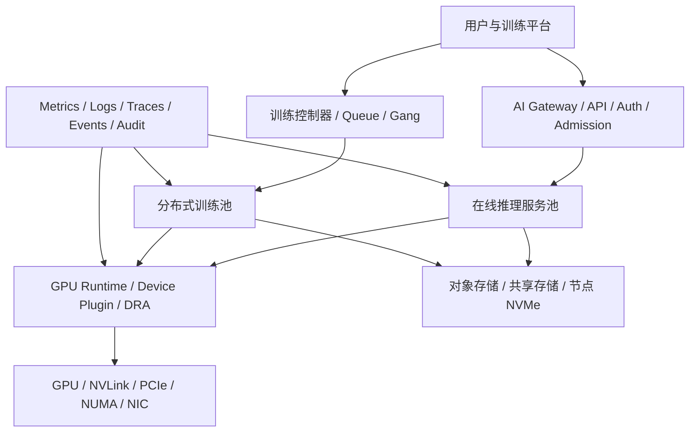

# 生产级 Kubernetes GPU 集群：需求、分层架构与容量设计

生产 GPU 集群不是“Kubernetes + GPU Operator + 几台 GPU 服务器”。一套能够长期运行的架构必须同时满足：

```text
模型能正确运行
GPU/NVLink/NIC/存储拓扑匹配
训练能整组调度与恢复
推理有 SLO、扩缩容和优雅发布
多租户资源可控
驱动和固件可升级回滚
硬件故障能隔离、诊断和重新上线
容量、成本和操作均可观测、可审计
```

本文不假设某种规模或厂商型号。示例数字只用于演示方法，不能替代真实业务需求、设备兼容矩阵和目标负载压测。

## 1. 学习目标

完成本文后，应能够：

- 从训练、推理、开发和平台工作负载推导架构；
- 划分控制面、系统服务池、推理池、训练池和共享开发池；
- 设计 GPU runtime、队列、Gang、拓扑与多租户；
- 选择对象存储、共享存储和本地 NVMe 分层；
- 计算稳态、故障、升级和突发 GPU 容量；
- 建立 SLO、告警、巡检、变更与事故闭环；
- 输出一份可执行的架构决策和验收清单。

## 2. 从需求开始，而不是从组件清单开始

### 2.1 工作负载画像

| 负载 | 关键问题 |
|---|---|
| 在线推理 | TTFT/TPOT/P99、并发、KV Cache、发布、流式请求 |
| 离线推理 | 吞吐、批量调度、成本、可重试 |
| 单机训练 | NVLink/NVSwitch、HBM、CPU 数据加载、本地存储 |
| 多机训练 | Gang、NCCL/RDMA、Checkpoint、故障恢复、扩展效率 |
| Notebook/开发 | 共享、空闲回收、隔离、成本、交互体验 |
| 平台服务 | Registry、Gateway、监控、控制器、DNS、证书 |

### 2.2 SLO 与恢复目标

至少定义：

```yaml
inference:
  availability_slo: example
  ttft_p99: example
  tpot_p99: example
  max_stream_duration: example
training:
  max_queue_wait: example
  checkpoint_rpo: example
  recovery_rto: example
platform:
  api_availability: example
  node_repair_slo: example
```

如果没有 SLO，就无法判断需要多少副本、是否预留 surge GPU、Checkpoint 多久一次以及多大故障域可接受。

### 2.3 约束

- GPU 型号、数量、显存、NVLink/NVSwitch；
- 服务器 CPU/NUMA、PCIe、NIC、NVMe；
- IB/RoCE/以太网和交换 Fabric；
- 机房电力、散热、机架和故障域；
- 存储吞吐、容量和接口；
- 驱动/CUDA/框架兼容矩阵；
- 安全、合规、数据驻留；
- 预算和交付周期。

## 3. 参考分层



可以拆成六个平面：

1. Kubernetes 控制面；
2. GPU 设备与运行时；
3. 调度、队列和配额；
4. 网络与存储数据面；
5. 训练/推理服务；
6. 可观测性、可靠性、安全和自动化。

## 4. 控制面与系统服务池

### 4.1 控制面

生产通常需要：

- 奇数 etcd/control-plane 成员；
- API Server 前的高可用入口；
- etcd 定期备份、加密、恢复演练；
- 控制面与 GPU worker 故障域隔离；
- 证书、时间、DNS 和审计；
- 升级 skew 与回滚方案。

“三控制面”不自动等于高可用。如果三台在同一物理机架/电源/交换机，仍然是单故障域。

### 4.2 系统服务池

CoreDNS、Ingress/Gateway、Registry cache、监控、日志和控制器不应默认与高负载 GPU 任务争抢 CPU、内存、磁盘和网络。
单独 CPU worker 池便于：

- 保证系统服务资源；
- GPU 节点维护时控制面仍可用；
- 避免训练 I/O/网络影响 Gateway 和监控；
- 降低昂贵 GPU 节点承载非 GPU Pod。

## 5. GPU 节点池设计

### 5.1 按不可替代约束分池

| 节点池 | 典型特点 | 关键策略 |
|---|---|---|
| 在线推理 | 固定模型、低延迟、稳定版本 | 独占、反亲和、优先级、发布余量 |
| 多机训练 | 高速 RDMA、大规模 GPU | Gang、拓扑、Checkpoint、可抢占策略 |
| 单机高密度 | NVSwitch/大 HBM | TP/单机训练，保护机内拓扑 |
| 开发共享 | 短任务、Notebook | Time-Slicing/MIG/HAMi、idle 回收 |
| 系统/验收 | 测试驱动与新硬件 | 不承载生产流量、Canary 升级 |

不要按组织名称分出几十个小池，导致 GPU 碎片；也不要把驱动、GPU 型号、网络能力完全不同的节点混成一个无标签池。

### 5.2 标签、污点与来源

```yaml
labels:
  accelerator.example.com/vendor: nvidia
  accelerator.example.com/model: example
  accelerator.example.com/pool: inference
  accelerator.example.com/fabric: nvlink-rdma
taints:
  - key: accelerator.example.com/gpu
    value: "true"
    effect: NoSchedule
```

自定义 label 必须有命名规范、控制器来源和防篡改策略。应用使用 affinity/toleration；不要让普通租户任意修改 Node label。

### 5.3 版本环

建议建立：

```text
lab/canary 节点
 -> 小生产池
 -> 主生产池
 -> 最后高风险/大规模池
```

驱动、内核、固件、GPU Operator 和 Fabric Manager 不应全群同时升级。

## 6. GPU 运行时层

```text
PCIe GPU
 -> NVIDIA Driver / Fabric Manager
 -> Container Toolkit / CDI
 -> Device Plugin / DRA Driver
 -> kubelet Capacity/Allocatable
 -> Pod device injection
 -> CUDA Framework
```

需要做出决策：

- 驱动由宿主机镜像还是 GPU Operator 管理；
- containerd 使用哪种 runtime/CDI 模式；
- device plugin 的 MIG/shared 策略；
- 是否采用 DRA 及其成熟度；
- GFD/NFD 标签来源；
- DCGM/Exporter 权限和版本；
- 兼容矩阵、升级与回滚。

每个节点上线前通过资产、驱动、CUDA、DCGM、拓扑和业务基线门禁。

## 7. 调度、队列和配额

### 7.1 原生调度

负责 Node selector/affinity、taint/toleration、资源、拓扑分布、PriorityClass、PVC 等约束。

### 7.2 批任务调度

多机训练需要：

- Queue/Quota；
- Gang/PodGroup；
- fair-share/DRF；
- priority/preemption；
- backfill；
- Job lifecycle；
- 整组失败与重试。

Volcano、Kueue 与训练控制器解决的层次不同，选型时写清谁负责准入、谁负责 Pod 调度、谁负责 Job 恢复。

### 7.3 GPU 共享

| 模式 | HBM 隔离 | 计算隔离 | 典型场景 |
|---|---|---|---|
| 整卡 | 独占 | 独占 | 生产推理/训练 |
| Time-Slicing | 通常无硬隔离 | 时间共享 | 轻量开发 |
| MPS | 有进程级能力但需验证 | 共享执行 | 受控同信任负载 |
| MIG | 硬件显存/计算分区 | 较强 | 固定小规格服务 |
| HAMi 等 | 实现相关 | 实现相关 | 平台化共享 |

共享模式需要单独节点池、配额、性能基线和故障域说明。

## 8. 拓扑感知

调度不只满足“4 张 GPU”：

```text
GPU-GPU: NVLink/NVSwitch/PCIe
GPU-CPU: NUMA
GPU-NIC: PCIe/NUMA/GDR
GPU-NVMe: 本地数据路径
Node-Switch: Rail/Leaf/Zone
PVC: 存储拓扑
```

TP 组偏好同一 NVLink 域，多机训练偏好正确 GPU-NIC/Rail，模型冷启动还受数据位置影响。实现方式可以是：

- 预划分同构节点池；
- Node label/affinity；
- Topology Manager/CPU Manager；
- Volcano/自定义 scheduler plugin；
- DRA topology 信息；
- 网络/存储感知控制器。

详见 [GPU、网卡、存储联合拓扑调度](../ai-infra-end-to-end/05-GPU网卡存储联合拓扑调度.md)。

## 9. 网络架构

建议明确分层：

```text
管理/API 网络
Pod/Service 网络
存储网络
训练 RDMA Fabric
带外 BMC 网络
```

是否物理隔离取决于规模和预算，但逻辑角色、QoS、故障域和观测必须明确。

### 9.1 训练网络

- IB 或 RoCEv2；
- GPUDirect RDMA；
- GPU-NIC NUMA/PCIe 亲和；
- Rail-optimized placement；
- RoCE PFC/ECN/DCQCN；
- NCCL 基线与慢 rank 检测。

### 9.2 推理网络

- Gateway/Auth/限流；
- 流式响应和 idle timeout；
- EndpointSlice/readiness；
- token-aware 负载均衡；
- NetworkPolicy 与多租户；
- 跨区流量和模型副本。

## 10. 存储与模型分发

```text
对象存储/模型 Registry（长期事实源）
  -> 校验和 manifest
  -> 共享文件层或下载器
  -> 节点 NVMe cache
  -> 页缓存/CPU 内存
  -> GPU HBM
```

### 10.1 接口选择

| 场景 | 常见选择 |
|---|---|
| 模型制品事实源 | S3/RGW/对象存储 |
| 多 Pod 共享模型目录 | NFS/CephFS |
| 数据库/通用 PVC | RBD/块存储 |
| 节点热模型 | Local NVMe/cache |
| 大训练数据 | 并行文件系统/对象数据层/专用方案 |
| Checkpoint | 共享高性能层 + 对象长期层 |

### 10.2 防止启动风暴

- 不可变模型 revision；
- manifest/checksum/签名；
- 并发下载限制；
- staging 与完成标记；
- 节点 cache 水位/淘汰；
- 新旧版本双份容量；
- 回源保护和 pre-warm；
- 冷/热缓存启动指标。

## 11. 在线推理架构

```text
Client
 -> API Gateway/Auth/Quota
 -> Admission/Router
 -> Model Service Replica（每副本可能 TP=N）
 -> vLLM Scheduler/KV Cache
 -> GPU/NCCL
```

生产要求：

- ≥2 独立故障域副本（按 SLO）；
- token-aware 准入/限流；
- startup/liveness/readiness；
- TTFT/TPOT/queue/KV；
- Canary/Blue-Green；
- SIGTERM/drain/streaming；
- 基于队列与 SLO 的扩缩容；
- 模型质量门禁与版本回滚。

## 12. 分布式训练架构

```text
提交训练
 -> Queue/Admission
 -> Gang 获得完整 GPU
 -> rank/rendezvous
 -> 数据读取
 -> forward/backward
 -> NCCL collective
 -> optimizer
 -> Checkpoint
```

要求：

- 训练控制器与 Job 语义；
- 整组调度、整组失败；
- topology-aware placement；
- NCCL/RDMA 基线；
- Checkpoint RPO/RTO；
- 数据位置与 sampler 恢复；
- 抢占/弹性策略；
- step time 和扩展效率。

## 13. 可观测性

### 13.1 四类信号

```text
业务：SLO、TTFT、TPOT、QPS、queue、quality
平台：Pod、Node、scheduler、queue、quota、rollout
资源：GPU HBM/SM/Xid/ECC、CPU、NIC、storage
链路：Trace/request ID、rank、model revision、GPU UUID
```

### 13.2 不能只部署 Prometheus

还需要：

- recording rules 与多窗口告警；
- 日志集中与时间同步；
- Event/Audit 保留；
- dashboard 按租户/模型/节点；
- 资产和拓扑数据；
- Runbook 与 OnCall；
- 告警去重、抑制和所有权；
- 监控自身 SLO。

## 14. 安全与多租户

- Namespace、RBAC、ServiceAccount；
- ResourceQuota、LimitRange、Queue quota；
- NetworkPolicy/多网络隔离；
- PSA/准入策略；
- Secret/KMS；
- 镜像签名、SBOM、漏洞管理；
- 模型制品来源、checksum、权限；
- 禁止普通租户 privileged/hostPath/任意 Node label；
- 调试与 DCGM 工具最小权限；
- API 审计和发布审批。

GPU 共享场景还要防止跨租户显存、侧信道、性能干扰和错误故障域扩大。

## 15. 容量模型

### 15.1 在线推理

```text
required_replicas = ceil(target_load / safe_capacity_per_replica)
steady_gpu = required_replicas × gpu_per_replica
```

生产总量还要加：

```text
failure reserve
+ rollout surge
+ traffic burst
+ fragmentation
+ canary/shadow
+ maintenance reserve
```

### 15.2 训练

容量不仅是 GPU 数：

```text
可同时运行 Job 数
队列等待 SLO
单 Job world size
节点连续 GPU 和拓扑
RDMA rail/带宽
数据/Checkpoint 带宽
失败重算成本
```

### 15.3 N+1/N+故障域

“空闲 8 张卡”不代表一台 8 卡节点故障后仍可接管一个 TP=8 副本。容量必须按最小调度单元、节点和区域故障域计算。

## 16. 高可用与灾难恢复

| 层级 | 故障 | 恢复设计 |
|---|---|---|
| Pod | 进程/OOM | 控制器重建、readiness 摘流 |
| GPU | Xid/掉卡 | 整副本失败、cordon/诊断 |
| Node | NotReady | 跨节点副本、训练整组恢复 |
| Rack/Leaf/Rail | 网络/电源 | 拓扑分布、多故障域 |
| Storage | 服务/数据 | HA、备份、对象版本、恢复演练 |
| Control Plane | etcd/API | 多成员、备份、API LB |
| Region/Cluster | 大故障 | 多集群制品、DNS/路由、数据 RPO |

PDB 不能防止节点宕机，只约束部分主动驱逐。高可用来自真实副本、故障域和恢复能力。

## 17. 变更与升级

```text
兼容矩阵
 -> lab/canary node
 -> drain/maintenance
 -> driver/runtime/operator upgrade
 -> GPU/NVLink/RDMA/业务验收
 -> 小池
 -> 分批主池
 -> 观察
```

升级单元包括 OS、kernel、firmware、driver、Fabric Manager、Toolkit、device plugin、DCGM、Kubernetes 和框架。
明确哪些可以独立回滚，哪些需要节点重启。

## 18. 架构决策记录

每个重大决策写 ADR：

```text
问题与约束
候选方案
选择与原因
容量/性能数据
故障模式
安全影响
升级/回滚
重新评估条件
```

例如“为什么采用 RoCE 而非 IB”“为什么推理池整卡独占”“为什么对象存储作为模型事实源”，都应有证据而非口号。

## 19. 从零建设阶段

1. 需求、SLO、资产与兼容矩阵；
2. 网络/存储/机架物理设计；
3. Kubernetes 控制面与系统池；
4. 单台 GPU 节点驱动/runtime 验收；
5. GPU Operator/device plugin/DCGM；
6. 节点池、队列和配额；
7. 单机 CUDA/TP/NCCL；
8. 多机 RDMA/NCCL；
9. 模型存储、缓存和 Checkpoint；
10. 推理/训练平台；
11. SLO、告警、Runbook；
12. 升级、故障和恢复演练；
13. 逐步接入生产租户。

## 20. 架构验收

### 基础平台

- [ ] 控制面/etcd 备份和恢复通过；
- [ ] 系统服务与 GPU 负载隔离；
- [ ] 节点资产、版本和拓扑可查询；
- [ ] 驱动/runtime/device plugin 有升级回滚。

### 计算、网络和存储

- [ ] CUDA、NVLink、PCIe、RDMA 和 NCCL 有基线；
- [ ] GPU-NIC/NUMA/Rail 放置符合设计；
- [ ] 模型分发、cache、Checkpointer 有容量和故障策略；
- [ ] 冷启动与存储风暴经过测试。

### 调度与多租户

- [ ] 节点池、label/taint、Queue/Quota 明确；
- [ ] Gang、priority、preemption 有演练；
- [ ] GPU 共享只在指定池；
- [ ] 拓扑调度失败有可解释 Event。

### 可靠性

- [ ] 推理 SLO、训练 RPO/RTO 有数据；
- [ ] rollout/failure/maintenance reserve 已计算；
- [ ] Pod、GPU、Node、Rack 和存储故障演练通过；
- [ ] OnCall、Runbook、RCA 和自动化边界明确。

## 21. 掌握标准

### 入门

- 能画出控制面、GPU runtime、调度、网络和存储；
- 能部署单节点 GPU Pod 和监控；
- 能解释训练与推理需求差异。

### 进阶

- 能设计节点池、Gang、RDMA、模型存储和多租户；
- 能计算副本、TP、升级和故障余量；
- 能建立端到端指标与故障树。

### 生产级

- 能从 SLO 和约束做架构取舍；
- 能交付兼容矩阵、ADR、容量模型、Runbook 与验收报告；
- 能通过升级、故障和灾备演练证明架构而不是只画图。

## 参考资料

- [Kubernetes Production Environment](https://kubernetes.io/docs/setup/production-environment/)
- [Creating Highly Available Clusters with kubeadm](https://kubernetes.io/docs/setup/production-environment/tools/kubeadm/high-availability/)
- [NVIDIA GPU Operator](https://docs.nvidia.com/datacenter/cloud-native/gpu-operator/latest/)
- [NVIDIA GPU Debug Guidelines](https://docs.nvidia.com/deploy/gpu-debug-guidelines/index.html)
- [Volcano Scheduler](https://volcano.sh/en/docs/)

下一篇：[GPU 集群完整部署实录](./02-GPU%20集群完整部署实录.md)。
