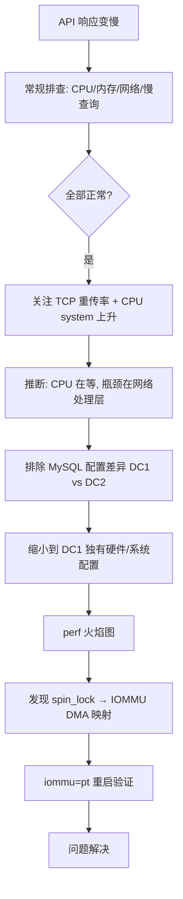

# MySQL 高配机器 IOMMU 锁竞争性能排查记录

> **原文来源**：[顶配机器跑 MySQL，性能反而更差？：一次性能根因追查全记录](https://zhuanlan.zhihu.com/p/2052117690249228656)（作者：iopanda，知乎）

## 1. 摘要 {/* #摘要 */}

CPU 只用了 4%，内存稳稳的，网络没打满，慢查询也找不到——那系统在慢什么？

本文记录一次从 MySQL 慢查询一路追到 Linux 内核的排查过程。最终根因并非 MySQL 配置或 SQL 本身，而是 **128 核 AMD EPYC + Intel E810-C 网卡 + IOMMU 默认开启** 在高并发小包 OLTP 场景下引发的 **IOMMU DMA 映射锁竞争**。修复方案是在内核启动参数中设置 `iommu=pt`（passthrough 模式），API 吞吐量提升至修改前的三倍，大促平稳通过。

## 2. 背景 {/* #1-背景 */}

### 2.1 系统架构 {/* #11-系统架构 */}

传统三层架构：**Spring → 缓存 → ProxySQL → MySQL 主从**。

随着业务量增长，团队选择垂直扩展（升机器、不改架构）。数据库服务器规格：

| 项目 | 配置 |
|------|------|
| CPU | 128 核 AMD EPYC |
| 内存 | 1 TB |
| 存储 | 2×2 TB NVMe SSD RAID 0 |
| 网络 | 10 Gbps |
| 部署 | DC1、DC2 各承担一半流量，规格完全一致 |

### 2.2 问题时间线 {/* #12-问题时间线 */}

- **去年 9 月大促**：DC1 出现 API 响应变慢，初步定位到 DB 层，标记为风险项。
- **9 月～12 月**：团队做了 MySQL 参数调优、慢查询日志清理，感觉有所好转。
- **12 月大促**：问题再次出现，且比 9 月更严重，交由本文作者主导根因分析。

## 3. 第一轮：常规排查，全部正常 {/* #2-第一轮常规排查全部正常 */}

从最基础的地方看起：CPU 负载、慢查询日志、查询计划。

| 指标 | 观察结果 | 是否正常 |
|------|----------|----------|
| CPU 使用率 | 约 4%（128 核峰值期间连 10% 都不到） | 看似正常 |
| 内存 | 稳定在 930 GB（InnoDB Buffer Pool 占满） | 正常 |
| 网络 | 10 Gbps 带宽，流量不到一半 | 正常 |
| 慢查询 | 查询计划正常，无索引问题；问题时段的查询单独重跑速度正常 | 正常 |

常规排查的每一条路，都走到了死胡同。

### 3.1 两个异常信号 {/* #21-两个异常信号 */}

1. **TCP 重传率**：slowness 期间显著升高。
2. **CPU system 使用率**：平时低于 1%，问题发生时涨到 3%。


数字本身不大，但方向很重要。

### 3.2 关键推断 {/* #22-关键推断 */}

系统明显有瓶颈，但 CPU 只用了 4%——**CPU 根本不是瓶颈**。

工厂产能很强大，但物料进不来，工人都在等着。CPU 在等什么？

结合 TCP 重传率上升，答案指向 **网络层**——不是带宽打满（带宽有富余），而是网络处理流程里某个环节出了问题。CPU system 使用率上升，说明 CPU 频繁切换到内核态，内核在忙什么？这是后续整个排查的核心问题。

## 4. 排除 MySQL 配置差异 {/* #3-排除-mysql-配置差异 */}

在深入内核之前，先排除 DC1 与 DC2 的 MySQL 配置是否一致。

逐项对比：Buffer Pool 大小、连接数限制、InnoDB 各项配置……**完全一致**。

如果是 MySQL 参数导致的问题，理论上两个 DC 都会出现，但 DC2 一切正常。此路可排除。

### 4.1 缩小问题范围 {/* #31-缩小问题范围 */}

剩余差异只剩硬件层面：

- 两批机器申请时间不同
- 网卡型号不完全一样
- 内核版本也有差异

**问题的范围从「MySQL 配置或查询逻辑」缩小到了「DC1 独有的硬件或系统配置」。**

## 5. 进入内核：perf 与火焰图 {/* #4-进入内核perf-与火焰图 */}

要知道内核在忙什么，只能直接观测。工具是 **perf**：在问题复现期间录制一分钟的内核事件采样，生成火焰图。

### 5.1 火焰图读法 {/* #41-火焰图读法 */}

- 每个色块的**宽度**代表该函数占用的 CPU 时间比例，越宽越耗时。
- 色块**往上堆叠**是调用栈：最顶层是正在执行的函数，下面是调用它的函数。

### 5.2 发现：`native_queued_spin_lock_slowpath` {/* #42-发现nativequeuedspinlockslowpath */}

火焰图里有一大片宽度异常的色块，对应函数：


```text
native_queued_spin_lock_slowpath
```

关键词解读：

- `spin_lock`：自旋锁
- `slowpath`：慢路径——锁竞争激烈，CPU 频繁争同一把锁，争不到就在原地空转等待

这不是在做任何有价值的计算，是纯粹的浪费。

### 5.3 调用链 {/* #43-调用链 */}

顺着调用树往下找锁的来源：

```text
tcp_sendmsg
  → iommu_dma_map_page
    → native_queued_spin_lock_slowpath
```

**TCP 发包 → IOMMU DMA 地址映射 → 大量 CPU 核心争同一把锁。**

线索汇聚到了 **IOMMU**。

## 6. IOMMU 是什么 {/* #5-iommu-是什么 */}

**IOMMU**（Input-Output Memory Management Unit）是 CPU 芯片组里负责 I/O 内存管理的硬件单元。

### 6.1 与 DMA 的关系 {/* #51-与-dma-的关系 */}

网卡、NVMe 等设备读写内存时走 **DMA**（Direct Memory Access）——设备直接访问内存，不经过 CPU，能极大减轻 CPU 负担。但 DMA 需要内存地址，设备用的是自己的虚拟地址，不是物理地址。

IOMMU 的工作：在设备发起 DMA 请求时，把虚拟地址实时翻译成物理内存地址。


IOMMU 当前处于开启状态（`Default domain type: Translated`）：


### 6.2 主要价值 {/* #52-主要价值 */}

1. **安全隔离**：设备只能访问被授权的内存区域。
2. **虚拟化支持**：为容器和虚拟机提供更强的内存隔离，也是 VFIO 设备直通的基础。

开启 IOMMU 本身没有问题。问题出在这台机器的**具体组合**上。

## 7. 为什么高配机器反而更慢 {/* #6-为什么高配机器反而更慢 */}

需要把三个因素放在一起看。

### 7.1 AMD EPYC 的 NUMA 结构 {/* #61-amd-epyc-的-numa-结构 */}

128 核 EPYC 不是一整块均质芯片，内部由多个 **CCD**（Core Complex Die）拼在一起。每组 CCD 有自己的本地内存控制器，整体形成多个 **NUMA 节点**——访问本地内存快，跨节点访问要多一跳。

IOMMU 单元同样分布在 NUMA 节点之间，每个 IOMMU 负责管理自己节点范围内的地址映射，维护一张**共享的 IOVA 页表**。

### 7.2 Intel E810-C 的工作方式 {/* #62-intel-e810-c-的工作方式 */}

E810-C 是 Intel 数据中心级高速网卡。每发送或接收一个数据包，都要通过 IOMMU 完成一次完整的 DMA 地址映射：**申请映射 → 传输数据 → 释放映射**。每一次映射都需要更新共享页表，写页表必须加锁。

### 7.3 MySQL OLTP 的流量特征 {/* #63-mysql-oltp-的流量特征 */}

MySQL OLTP 是典型的「**海量小包**」模式——大量并发连接，每个查询都很短，每条 TCP 包都很小，但数量极多。繁忙实例每秒处理的网络包数量可达**数十万量级**。

### 7.4 三者叠加 {/* #64-三者叠加 */}

```text
128 核并发处理网络请求
  × 每个请求触发一次 IOMMU 地址映射
  × 每次映射对共享页表加锁
  = 锁竞争烈度指数级放大
```

**核心越多，并发量越高，锁竞争越激烈。128 核是这个竞争的放大器，而不是解法。**

这就是为什么顶配机器反而更慢。

## 8. 修复：iommu=pt（Passthrough 模式） {/* #7-修复iommuptpassthrough-模式 */}

### 8.1 现实障碍 {/* #71-现实障碍 */}

IOMMU 模式是内核启动参数，修改后必须重启服务器。私有云团队不会轻易重启生产机器，「我们觉得可能是这个原因」不是充分理由。

### 8.2 Intel 官方依据 {/* #72-intel-官方依据 */}

Intel E810-C 官方配置手册中，针对高性能部署场景的建议：

> **For best performance, set `iommu=pt` in the kernel boot parameters.**

有了这个依据，申请重启的理由就充分了。

### 8.3 Passthrough 模式解决了什么 {/* #73-passthrough-模式解决了什么 */}

`iommu=pt`（passthrough，穿透模式）下，IOMMU **不再做地址转换**——网卡发起 DMA 请求时直接使用物理地址，IOMMU 层透明放行。没有地址翻译 → 没有页表更新 → 没有锁竞争。

`native_queued_spin_lock_slowpath` 出现的根源彻底消失。

**代价**：关闭了 IOMMU 的内存隔离保护。对于专门跑 MySQL 的可信服务器，这个代价通常可接受。

### 8.4 修复效果对比 {/* #74-修复效果对比 */}


| 层级 | 修改前 | 修改后 |
|------|--------|--------|
| API 层 | 存在 slowness | 最大吞吐量达修改前 **3 倍**，slowness 消失 |
| DB 层 CPU | 使用率约 4%，被锁堵住 | 使用率突破 25%，峰值用户态达 50%；system 从 3% 降回 0.3% |
| 内核层 | 火焰图大片 spin_lock | spin_lock 色块消失，CPU 时间主要在 SQL 相关调用栈 |

今年 3 月大促，系统平稳通过，没有任何 slowness。

## 9. 为什么私有云默认开了 IOMMU {/* #8-为什么私有云默认开了-iommu */}

该规格机器的内核配置原本是为 **Hadoop** 场景优化的，不是为 MySQL：

| 工作负载 | 流量特征 | IOMMU 开销 |
|----------|----------|------------|
| Hadoop | 批量文件读写，数据块动辄几百 MB，包大数量少 | 每次映射开销被大量数据摊薄，可忽略 |
| MySQL OLTP | 海量小包，每秒数以万计 | 每次映射成本无法摊薄，128 核并发放大成瓶颈 |

同时，私有云上跑着大量 Kubernetes 服务，IOMMU 对容器内存隔离有价值，默认开启有其合理性。

**没有人注意到**：同一批机器被拿去跑 MySQL 时，面对的是完全不同的流量模式。

### 9.1 触发条件（三要素同时成立） {/* #81-触发条件三要素同时成立 */}

1. 高核数 CPU（128 核 EPYC）
2. 海量小包工作负载（MySQL OLTP）
3. IOMMU 开启（默认配置）

缺任何一个，问题都不会出现。

## 10. 排查方法论总结 {/* #9-排查方法论总结 */}

### 10.1 当所有指标都「正常」时 {/* #91-当所有指标都正常时 */}

性能问题里有一类最难处理：所有指标看起来都正常，但系统就是慢。这种情况往往意味着瓶颈不在你习惯看的那一层。

### 10.2 排查路径回顾 {/* #92-排查路径回顾 */}



### 10.3 实用 Checklist {/* #93-实用-checklist */}

1. **CPU 低但系统慢**：不要假设 CPU 是瓶颈，思考 CPU 在等什么（I/O、锁、内核态开销）。
2. **关注 system CPU**：用户态低、system 态升高，往往指向内核或驱动层问题。
3. **TCP 重传率**：带宽未满但重传升高，问题可能在网络栈处理路径而非带宽本身。
4. **跨 DC 对比**：配置一致但表现不同，优先查硬件和 OS 层差异（网卡型号、内核版本、启动参数）。
5. **perf + 火焰图**：当应用层指标都正常时，直接观测内核在忙什么。
6. **查厂商文档**：Intel E810-C 等硬件的官方手册常含高性能场景的内核参数建议。

### 10.4 核心启示 {/* #94-核心启示 */}

每个组件单独看都没有问题，但它们以一种没有人设计过的方式组合在了一起：

- MySQL 正常
- EPYC 正常
- E810-C 正常
- IOMMU 正常
- 私有云的配置决策也有其道理

就是这堆「正常」叠在一起，把系统压慢了。

**性能工程里最反直觉的地方：很多时候，你要找的不是「哪里坏了」，而是「哪几个没坏的东西，在什么条件下，会互相绊住」。**

## 11. 相关概念速查 {/* #10-相关概念速查 */}

| 概念 | 说明 |
|------|------|
| IOMMU | I/O 内存管理单元，负责 DMA 虚拟地址到物理地址的翻译 |
| DMA | 设备直接访问内存，绕过 CPU |
| IOVA | I/O Virtual Address，设备侧使用的虚拟地址 |
| `iommu=pt` | IOMMU passthrough 模式，跳过地址翻译，提升性能但关闭内存隔离 |
| NUMA | 非统一内存访问，多 CCD 架构下本地/远程内存访问延迟不同 |
| CCD | Core Complex Die，AMD EPYC 的基本计算单元 |
| spin_lock slowpath | 自旋锁竞争激烈时的慢路径，CPU 空转等待 |
