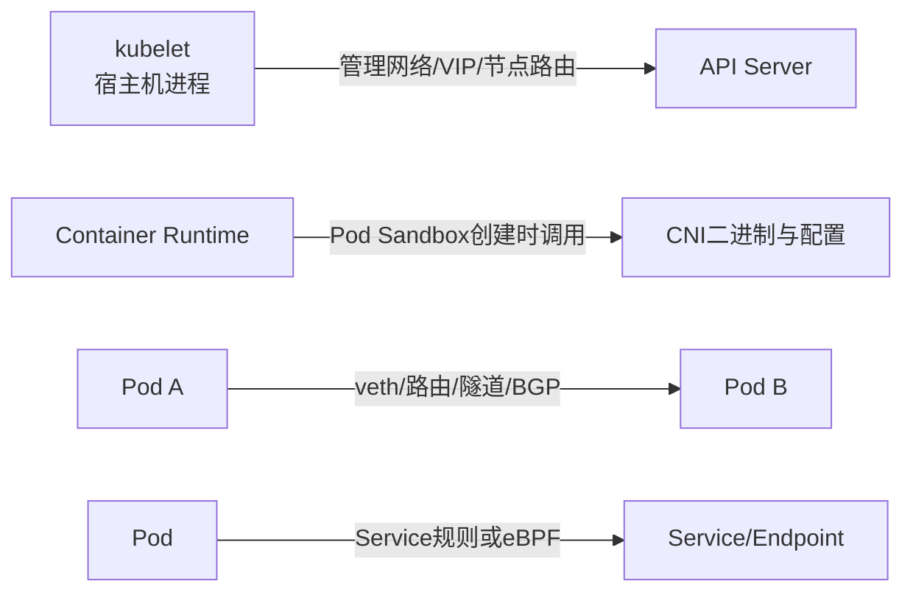

# CNI DaemonSet 滚动更新导致节点 NotReady：故障复盘与错误归因校正

一次CNI组件变更后，节点开始陆续显示 `NotReady`。与此同时，新的
`calico-node` Pod卡在Init阶段，kubelet日志出现访问API Server失败，现场很容易得出下面的结论：

```text
CNI DaemonSet滚动更新
→ 旧CNI Pod被删除
→ 节点网络中断
→ kubelet无法上报心跳
→ Node NotReady
```

这条链路看起来完整，但其中至少有三个不能只靠时间相关性证明的跳跃：

1. CNI主要负责Pod网络，不等于kubelet使用的宿主机管理网络；
2. `maxUnavailable: 1` 如果真的遇到一个始终不可用的新Pod，更新通常应停在预算边界，而不是无限继续破坏节点；
3. PodDisruptionBudget不会约束DaemonSet控制器自身的滚动更新。

因此，本文不会把“同时发生”直接写成“根因已经确认”，而是把案例拆成：**现场事实、机制校正、
证据链、止损恢复、发布设计和演练方法**。读完后，应能回答以下问题：

- CNI配置缺失究竟会影响新Pod、已有Pod，还是宿主机到API Server的连接？
- 为什么一个 `Init:CrashLoopBackOff` 的CNI Pod不一定能解释Node `NotReady`？
- DaemonSet的 `maxUnavailable`、`maxSurge` 和 `minReadySeconds` 分别控制什么？
- 节点心跳到底看Node Status还是Lease？
- 为什么增加PDB不能阻止这类滚动更新事故？
- 控制面还能访问和节点已经失联时，应分别怎样止损？

## 1. 事故摘要

| 项目 | 现场信息 |
| --- | --- |
| Kubernetes | v1.25，具体补丁版本待补充 |
| 网络插件 | Calico，现场日志示例为v3.26 |
| 变更 | 更新CNI DaemonSet的镜像或配置挂载 |
| 初始现象 | 节点陆续显示 `NotReady` |
| CNI现象 | 新 `calico-node` Pod卡在Init阶段 |
| Init日志 | CNI配置文件路径或挂载不符合新版本预期 |
| kubelet现象 | 访问API Server出现 `no route to host` |
| 更新策略 | 现场声称 `RollingUpdate`、`maxUnavailable: 1` |
| 临时处置 | 回滚CNI DaemonSet |
| 待补证 | CNI变更如何改变宿主机到API Server的真实数据路径 |
| 关键矛盾 | 新Pod一直不Ready时，更新为何仍能继续到后续节点 |

事故材料能够证明“CNI发布、CNI Pod异常、Node异常在时间上相关”，但还不能单独证明它们之间的
完整因果关系。合格的故障复盘必须把“看到的事实”和“对事实的解释”分开。

## 2. 先画清四条不同的网络路径

判断CNI是否能让节点 `NotReady` 之前，先区分四条经常被混在一起的路径。



### 2.1 kubelet到API Server

kubelet是宿主机进程，通常通过节点管理网、控制面VIP或API Server节点IP访问控制面。它不需要先
创建一个普通Pod网络命名空间，才能发出HTTPS请求。

常见kubelet kubeconfig中的地址类似：

```yaml
clusters:
- cluster:
    server: https://control-plane-vip.example.com:6443
```

这条路径通常由宿主机网卡、路由、DNS、负载均衡和防火墙决定。

### 2.2 创建Pod Sandbox时调用CNI

从Kubernetes v1.24开始，CNI配置的加载和调用由实现CRI的容器运行时负责。创建普通Pod Sandbox时，
大致链路为：

```text
kubelet
→ CRI RunPodSandbox
→ containerd/CRI-O读取CNI配置
→ 调用/opt/cni/bin中的插件
→ 创建veth、分配IP、写路由和策略
```

如果 `/etc/cni/net.d` 没有有效配置，最直接的结果通常是：**新的非hostNetwork Pod无法完成Sandbox
网络创建**。事件里可能出现：

```text
FailedCreatePodSandBox
NetworkPluginNotReady
no CNI configuration file in /etc/cni/net.d
```

这并不自动等价于“宿主机无法访问API Server”。

### 2.3 已有Pod的数据面

CNI ADD已经创建好的接口、路由、隧道和规则，并不会因为安装CNI二进制的Init Container退出就必然
立即消失。但是，Calico Felix、BIRD或eBPF组件停止后，策略、路由收敛和新状态同步可能逐渐失效。

因此要分别验证：

- 已有同节点Pod通信；
- 已有跨节点Pod通信；
- 新Pod能否创建Sandbox；
- Pod到Service、DNS和公网；
- 宿主机到API Server。

### 2.4 CNI守护Pod自身的启动路径

典型 `calico-node` DaemonSet使用 `hostNetwork: true`，目的之一就是避免网络插件启动依赖尚未建立
的Pod网络。其Init Container还会把CNI二进制和配置安装到宿主机路径。

如果一个CNI DaemonSet本身没有使用host network，或者启动必须先依赖由自己提供的Pod网络，就形成了
明显的引导循环，必须重新检查安装清单和厂商支持方式。

## 3. 第一处校正：CNI故障不必然导致Node NotReady

Node变成 `NotReady` 表示控制面认为节点不健康或长时间收不到心跳。它是一个结果，不是根因分类。

下面几种情况都可能表现为Node `NotReady`：

- kubelet进程退出、卡死或频繁重启；
- 节点CPU、内存、PID或磁盘出现严重压力；
- 节点到API Server的宿主机网络中断；
- API Server或其负载均衡入口异常；
- 证书、时间、DNS或防火墙配置错误；
- 容器运行时异常使kubelet内部状态检查失败；
- 网络组件修改了宿主机路由、iptables/nftables或eBPF程序；
- CNI问题只影响Pod网络，但同时还存在另一个宿主机网络故障。

### 3.1 CNI如何间接切断kubelet路径

CNI更新确实可能成为Node失联的触发点，但必须证明具体机制。例如：

1. kubelet配置的API地址是ClusterIP，错误地依赖了Service数据面；
2. API Server VIP的路由或策略由网络插件接管，更新时被删除或替换；
3. Calico Felix清理或重写了宿主机iptables/nftables/eBPF规则；
4. BGP、隧道或策略路由承载了节点到控制面的唯一通路；
5. 新旧版本的数据平面模式、接口匹配或主机端点策略不兼容；
6. 更新引发资源耗尽，kubelet心跳只是连带受害者。

只有找到这些中间证据，才能写成：

```text
某项CNI变更
→ 某条宿主机路由/规则/程序发生具体变化
→ 到API Server地址的TCP连接失败
→ Lease停止续约
→ Node Ready变为Unknown
```

不能只写成：

```text
CNI Pod没Ready
→ 所以节点网络断了
```

### 3.2 `NetworkUnavailable` 与 `Ready` 不是同一个Condition

Node中存在多个Condition：

- `Ready=True/False/Unknown`；
- `NetworkUnavailable=True/False`；
- `MemoryPressure`；
- `DiskPressure`；
- `PIDPressure`。

网络插件通常负责清除 `NetworkUnavailable`，但 `Ready=Unknown` 常表示Node Lifecycle Controller在
监控窗口内没有收到节点心跳。排障时必须查看Condition的 `status`、`reason`、`message` 和
`lastTransitionTime`，不能只看 `kubectl get nodes` 的一列摘要。

```bash
kubectl get node <node-name> -o jsonpath='{range .status.conditions[*]}{.type}{"\t"}{.status}{"\t"}{.reason}{"\t"}{.lastTransitionTime}{"\t"}{.message}{"\n"}{end}'
```

## 4. 第二处校正：节点心跳不只是Node Status

现代Kubernetes的节点心跳有两种：

1. kubelet更新Node对象的 `.status`；
2. kubelet更新 `kube-node-lease` 命名空间中的Lease。

Lease是更轻量、更高频的心跳。排查Node失联时，必须同时检查Node Condition和Lease的
`renewTime`：

```bash
kubectl get lease -n kube-node-lease <node-name> -o yaml
kubectl get node <node-name> -o yaml
```

如果Lease持续更新而Node Status暂时没有变化，不能判断节点已经失联；如果二者都停止，则应继续确认
kubelet进程、到API Server的TCP/TLS连接和控制面状态。

常见默认值会随版本和发行版配置变化。官方当前文档中，Lease常见更新间隔为10秒，Node Monitor
Grace Period常见默认值为50秒；较老版本或发行版可能配置为40秒。事故使用Kubernetes v1.25，
复盘时应读取真实配置，不能拿另一版本默认值拼出精确到秒的时间线。

```bash
# kubeadm静态Pod部署示例；托管集群和其他发行版的配置位置不同
sudo grep -nE 'node-monitor-(grace-period|period)' \
  /etc/kubernetes/manifests/kube-controller-manager.yaml

sudo grep -nE 'nodeStatus(Update|Report)Frequency|nodeLeaseDurationSeconds' \
  /var/lib/kubelet/config.yaml
```

`node-monitor-period` 是控制器检查状态的周期，不是“经过这个周期后再从Unknown转换成NotReady”的
独立固定阶段。命令行摘要可能把 `Ready=Unknown` 的节点显示为 `NotReady`，所以不要构造
“40秒Unknown、再过5秒False”的固定状态机。

## 5. 第三处校正：DaemonSet更新不是简单的串行for循环

DaemonSet的 `RollingUpdate` 由控制器反复协调期望状态和当前状态。关键参数是：

| 参数 | 含义 | 常见默认值 | 风险 |
| --- | --- | --- | --- |
| `maxUnavailable` | 更新中最多允许多少个旧守护Pod不可用 | 1 | 数值越大，允许同时先停掉的旧Pod越多 |
| `maxSurge` | 有旧Pod可用时，最多允许多少节点先额外创建新Pod | 0 | 同节点双实例可能争用host port、锁和宿主机文件 |
| `minReadySeconds` | 新Pod Ready后至少稳定多久才算Available | 0 | 0可能让短暂假Ready推动更新继续 |
| `type: OnDelete` | 只有旧Pod被人工删除时才替换 | 不适用 | 降低自动扩散，但把节奏和验证责任交给运维 |

### 5.1 `maxUnavailable: 1` 应该意味着什么

当 `maxSurge: 0`、`maxUnavailable: 1` 时，控制器可以先删除一个旧Pod，再创建新Pod。若新Pod一直
没有Available，正常情况下更新应受不可用预算限制。

因此，如果现场出现“新CNI Pod永远卡Init，但节点仍一台接一台失联”，这不是对机制的证明，反而是
必须调查的矛盾。至少检查：

- 实际生效的 `maxUnavailable` 是否真的是1；
- 是否有多个CNI DaemonSet、Operator或GitOps控制器同时变更；
- 新Pod是否曾短暂Ready，然后功能性网络才失败；
- Readiness是否只检查进程，没有检查路由、BGP或数据面；
- `minReadySeconds` 是否为0；
- 节点失联是否让DaemonSet的期望节点集合和可用数计算发生变化；
- 是否有人持续手工删除Pod或重复执行发布；
- 节点失联其实由独立的全局配置变更造成，而不是逐Pod替换造成。

### 5.2 `maxUnavailable: 25%` 不是更安全

把配置从1改成25%，意味着控制器最多可以同时让约四分之一的DaemonSet Pod不可用。对于CNI、
存储、GPU设备插件等节点关键组件，这通常会扩大故障域。

`maxUnavailable` 不是“先建后删比例”；“允许先额外创建新Pod”的参数是 `maxSurge`。但CNI组件
是否允许同一节点短暂运行两个版本，必须由对应产品文档和实际演练确认，不能自行开启。

### 5.3 `minReadySeconds` 防的是短暂假Ready

如果新CNI Pod在进程启动后立刻Ready，但几十秒后才因BGP、Felix、eBPF或路由错误失效，默认
`minReadySeconds: 0` 可能让控制器继续更新后续节点。

可在产品支持和探针可靠的前提下设置稳定窗口：

```yaml
spec:
  minReadySeconds: 60
  updateStrategy:
    type: RollingUpdate
    rollingUpdate:
      maxUnavailable: 1
      maxSurge: 0
```

这个配置不是万能保险。Readiness若不能反映真实网络能力，等待再久也只是验证一个错误信号。

## 6. 第四处校正：PDB挡不住DaemonSet自身滚动更新

PodDisruptionBudget主要约束通过Eviction API发起的自愿中断，例如遵循PDB的节点维护工具。
工作负载控制器执行自身滚动更新时，不受PDB限制；直接删除Pod也可能绕过PDB。

所以为 `calico-node` 增加下面的对象，并不能阻止DaemonSet控制器替换Pod：

```yaml
apiVersion: policy/v1
kind: PodDisruptionBudget
metadata:
  name: calico-node-pdb
spec:
  minAvailable: 90%
```

PDB不是完全没有用途，但不能被写成这起事故的发布防线。真正控制DaemonSet更新节奏的是：

- DaemonSet的更新策略；
- 新Pod的功能性Readiness；
- 稳定观察窗口；
- 分阶段发布与人工闸门；
- GitOps、Operator和发布平台的停止条件。

## 7. 重建一条可以被证伪的事故时间线

事故时间线不能凭默认参数推算，应从API对象、Events、日志和监控中还原。

| 时间 | 需要的证据 | 能证明什么 |
| --- | --- | --- |
| T0 | Git/Helm/Operator审计、DaemonSet generation | 何时提交了什么变更 |
| T1 | 旧Pod `deletionTimestamp` | 哪个节点最先开始替换 |
| T2 | Init Container开始与退出日志 | CNI安装或配置为什么失败 |
| T3 | 新Pod Ready转换历史 | 控制器为何有资格继续更新 |
| T4 | 主机路由、规则、BGP、Felix日志 | 数据面何时发生什么变化 |
| T5 | kubelet访问API Server错误 | 节点管理路径何时中断 |
| T6 | Lease `renewTime`停止 | 控制面何时收不到轻量心跳 |
| T7 | Node Condition转换 | 控制面何时把节点判为异常 |
| T8 | 下一个旧Pod删除 | 控制器或其他发布者为何继续 |

如果拿不到T3、T4和T8的证据，就只能写“高度相关”，不能写“完整根因已经证明”。

## 8. 第一阶段：先保护业务并冻结扩散

### 8.1 先确认谁拥有这个DaemonSet

CNI可能由裸YAML、Helm、GitOps或Operator管理。先找所有权：

```bash
kubectl get ds <cni-daemonset> -n <namespace> -o yaml
kubectl get ds <cni-daemonset> -n <namespace> \
  -o jsonpath='{.metadata.ownerReferences}{"\n"}{.metadata.labels}{"\n"}{.metadata.annotations}{"\n"}'
```

如果由Operator或GitOps管理，直接修改生成出的DaemonSet可能几秒后又被覆盖。正确顺序通常是：

1. 停止或暂停上层发布源的错误协调；
2. 在声明源中恢复上一份已验证配置；
3. 再观察底层DaemonSet收敛。

### 8.2 DaemonSet没有通用的pause语义

Deployment可以暂停Rollout，但不能假设DaemonSet也支持同样的发布暂停。可选的受控止损方法包括：

- 立即回滚声明源和DaemonSet Revision；
- 在确认控制器所有权后，把策略暂时切换为 `OnDelete`，阻止自动替换剩余旧Pod；
- 禁止流水线、Operator或值文件再次推送错误模板；
- 保存现场证据后，只修复已经受影响的节点。

临时切换策略示例：

```bash
kubectl patch daemonset <cni-daemonset> -n <namespace> --type=merge \
  -p '{"spec":{"updateStrategy":{"type":"OnDelete","rollingUpdate":null}}}'
```

该命令不会自动修好已经损坏的节点，也不会把错误Pod模板恢复为旧版本。它只用于阻止自动扩散，
并且可能被上层控制器覆盖。

### 8.3 不要做的操作

- 不要批量删除所有CNI Pod；
- 不要把 `maxUnavailable` 从1调大；
- 不要把PDB当成滚动更新刹车；
- 不要反复重启所有节点的kubelet掩盖根因；
- 不要在没有备份规则和路由的情况下执行全量iptables/nftables清理；
- 不要同时修改镜像、配置目录、数据面模式、MTU和探针；
- 不要让GitOps与人工修复相互覆盖。

## 9. 第二阶段：从集群视角锁定发布节奏

### 9.1 查看所有关键DaemonSet

```bash
kubectl get daemonset -A -o wide

kubectl get daemonset -A \
  -o custom-columns='NS:.metadata.namespace,NAME:.metadata.name,DESIRED:.status.desiredNumberScheduled,CURRENT:.status.currentNumberScheduled,READY:.status.numberReady,UPDATED:.status.updatedNumberScheduled,AVAILABLE:.status.numberAvailable,UNAVAILABLE:.status.numberUnavailable'
```

重点不是只看CNI，还要看 `kube-proxy`、节点DNS、存储节点插件、GPU设备插件和监控Agent是否在同一
时间发生变更。

### 9.2 查看真实更新策略

```bash
kubectl get daemonset <cni-daemonset> -n <namespace> \
  -o jsonpath='{.spec.updateStrategy}{"\n"}{.spec.minReadySeconds}{"\n"}'

kubectl rollout status daemonset/<cni-daemonset> -n <namespace> --timeout=30s
kubectl rollout history daemonset/<cni-daemonset> -n <namespace>
```

查看ControllerRevision有助于确认集群里实际保存了哪些版本：

```bash
kubectl get controllerrevision -n <namespace> \
  -l k8s-app=<cni-label-value> --sort-by=.revision
```

### 9.3 建立Pod、Revision与Node对应关系

```bash
kubectl get pods -n <namespace> -l k8s-app=<cni-label-value> \
  -o custom-columns='POD:.metadata.name,NODE:.spec.nodeName,PHASE:.status.phase,READY:.status.containerStatuses[*].ready,REVISION:.metadata.labels.controller-revision-hash,CREATED:.metadata.creationTimestamp'

kubectl get events -n <namespace> --sort-by=.lastTimestamp
```

需要回答：

- 第一个被替换的是哪个节点？
- 新Pod是否曾Ready？Ready持续了多久？
- 下一个Pod删除时，上一个Pod是否已被控制器计为Available？
- 是否存在第二个发布者或第二个DaemonSet？

## 10. 第三阶段：Pod与CRI层定位启动失败

### 10.1 不要只看主容器日志

CNI Pod卡在Init阶段时，主容器可能从未启动。应查看所有Init Container状态：

```bash
kubectl describe pod <cni-pod> -n <namespace>

kubectl get pod <cni-pod> -n <namespace> -o jsonpath='{range .status.initContainerStatuses[*]}{.name}{"\t"}{.state}{"\t"}{.lastState}{"\n"}{end}'

kubectl logs <cni-pod> -n <namespace> -c install-cni
kubectl logs <cni-pod> -n <namespace> -c install-cni --previous
```

如果节点已经无法通过API Server返回日志，再登录节点直接查询CRI。

### 10.2 使用crictl查看运行时事实

```bash
sudo crictl pods --name <cni-pod-prefix>
sudo crictl ps -a --name install-cni
sudo crictl inspect <container-id>
sudo crictl logs <container-id>
sudo crictl info
```

还要查看运行时日志。Kubernetes v1.25中，容器运行时负责加载CNI配置：

```bash
sudo journalctl -u containerd --since '30 minutes ago'
sudo journalctl -u crio --since '30 minutes ago'
```

不要把“crictl中看到两个Exited容器”直接写成两个容器都发生了同一种错误。Init Container退出、
主容器未启动、旧容器被正常终止，在CRI里都可能显示为Exited，需要分别查看退出码、Reason和日志。

## 11. 第四阶段：检查宿主机CNI文件

在受影响节点和健康节点上分别执行，并保存结果用于对比：

```bash
sudo ls -la /etc/cni/net.d
sudo ls -la /opt/cni/bin
sudo find /etc/cni/net.d -maxdepth 1 -type f -printf '%f\t%s\t%TY-%Tm-%Td %TH:%TM:%TS\n'

sudo stat /etc/cni/net.d/<expected-conflist>
sudo sha256sum /etc/cni/net.d/<expected-conflist>
sudo sha256sum /opt/cni/bin/<expected-plugin>
```

需要核对：

- DaemonSet挂载的宿主机目录与运行时读取目录是否一致；
- ConfigMap Key、目标文件名和 `subPath` 是否一致；
- 新版本是否改变了CNI配置模板或默认路径；
- 文件是“原本不存在”，还是Init Container先删除后写入失败；
- 权限、SELinux/AppArmor和只读挂载是否阻止写入；
- 目录中存在多个 `.conf`/`.conflist` 时，运行时最终选择了哪个文件；
- CNI二进制与配置版本是否配套；
- 升级是否改变了Kubernetes Datastore凭据和证书路径。

以下日志只能证明安装阶段失败：

```text
Failed to create CNI config
config file /host/etc/cni/net.d/10-calico.conflist not found
```

它仍不能独立证明“已有路由被删除”或“kubelet管理网络被切断”。

## 12. 第五阶段：证明宿主机到API Server的真实路径

这是把CNI异常与Node `NotReady` 串起来的关键层。

### 12.1 确认kubelet访问哪个地址

```bash
sudo awk '/server:/{print $2}' /etc/kubernetes/kubelet.conf
sudo awk '/server:/{print $2}' /var/lib/kubelet/kubeconfig
```

发行版可能使用其他路径。记录得到的是域名、VIP、节点IP还是ClusterIP。

### 12.2 查询路由决策

```bash
getent ahostsv4 <api-server-hostname>
ip route get <api-server-ip>
ip rule show
ip route show table all
```

`ip route get` 比只看 `ip route` 更关键，因为它会给出内核针对目标地址选择的出口、源地址和下一跳。

### 12.3 分层测试连接

```bash
ping -c 3 <gateway-or-api-ip>
nc -vz -w 3 <api-server-ip> 6443
curl -k --connect-timeout 3 https://<api-server-ip>:6443/livez
```

`curl`返回401或403仍可能说明TCP和TLS路径正常；`no route to host`、超时、拒绝连接分别指向不同层次，
不能混为“网络不通”。

### 12.4 对比数据面状态

```bash
ip -br link
ip -br address
ip route show
ip rule show

sudo iptables-save
sudo nft list ruleset
sudo bpftool prog show
sudo bpftool map show
```

命令输出可能很大，应在健康节点和故障节点各保存一份，再做结构化差异比较。根据Calico模式继续检查：

- BGP：Peer状态、内核路由和下一跳；
- IPIP/VXLAN：隧道接口、MTU和Underlay可达性；
- eBPF：程序挂载点、Map和Service处理；
- HostEndpoint：主机策略是否误拦截控制面流量。

只有发现更新前后某条路由、规则或eBPF程序发生了能够解释API连接失败的变化，因果链才闭合。

## 13. 第六阶段：kubelet、Lease与控制面交叉验证

### 13.1 kubelet日志

```bash
sudo systemctl status kubelet --no-pager
sudo journalctl -u kubelet --since '30 minutes ago' -o short-precise
```

常见日志要分类：

| 日志 | 更可能的层次 |
| --- | --- |
| `FailedCreatePodSandBox` | CRI/CNI创建Pod网络 |
| `NetworkPluginNotReady` | 运行时没有可用CNI配置或状态 |
| `Failed to update lease` | kubelet到API Server链路或鉴权 |
| `Failed to update node status` | kubelet到API Server链路或API异常 |
| `x509` | 证书、时间或SAN |
| `no route to host` | 主机路由、邻居、防火墙返回或链路 |
| `connection refused` | 目标端口未监听、LB后端或本机策略 |
| `i/o timeout` | 丢包、黑洞、拥塞或对端无响应 |

### 13.2 Lease时间线

```bash
kubectl get lease -n kube-node-lease <node-name> \
  -o jsonpath='{.spec.renewTime}{"\n"}'

kubectl get node <node-name> \
  -o jsonpath='{range .status.conditions[?(@.type=="Ready")]}{.status}{"\t"}{.reason}{"\t"}{.lastHeartbeatTime}{"\t"}{.lastTransitionTime}{"\n"}{end}'
```

把以下时间放在同一张图上：

- DaemonSet模板变更；
- 旧CNI Pod删除；
- 新CNI Pod Ready/NotReady；
- 宿主机数据面变化；
- kubelet首次访问API失败；
- Lease最后一次续约；
- Node Condition转换。

### 13.3 排除控制面入口故障

从至少一个健康节点和一个故障节点测试同一个API入口，同时检查：

```bash
kubectl get --raw='/readyz?verbose'
kubectl get endpoints kubernetes -n default -o wide
kubectl get pods -n kube-system -l component=kube-apiserver -o wide
```

如果所有节点同时访问失败，优先调查API Server、负载均衡或控制面网络；如果只有已更新节点失败，再把
注意力收敛到节点差异。

## 14. 紧急恢复Runbook

恢复目标分为两个：**阻止更多健康节点受影响**，以及**让已失联节点重新获得控制面连接**。

### 14.1 控制面仍能管理健康节点

1. 停止GitOps、Operator或流水线继续推送；
2. 保存DaemonSet、ConfigMap、ControllerRevision、Events和Pod状态；
3. 切换 `OnDelete` 或立即恢复上一版声明；
4. 不再删除健康节点上的旧CNI Pod；
5. 先在一台隔离节点验证修复版本；
6. 验证节点、Pod、Service和业务路径后再继续。

回滚示例：

```bash
kubectl rollout history daemonset/<cni-daemonset> -n <namespace>
kubectl rollout undo daemonset/<cni-daemonset> -n <namespace> --to-revision=<revision>
kubectl rollout status daemonset/<cni-daemonset> -n <namespace> --timeout=5m
```

如果CNI由Operator生成，应回滚Operator的Installation资源、Helm Values或Git声明，而不是只回滚生成物。

### 14.2 节点已经无法访问控制面

当kubelet不能访问API Server时，控制面修改了DaemonSet模板也无法立即让该节点收到新Pod定义。需要使用
SSH、带外管理或自动化平台修复节点的最小管理路径。

建议步骤：

1. 保存当前CNI目录、路由、规则和日志；
2. 与同角色健康节点对比；
3. 恢复已验证的CNI配置、二进制或宿主机路由；
4. 先验证节点到API Server的TCP/TLS连接；
5. 观察Lease恢复更新；
6. 等Node恢复Ready后，再处理CNI Pod和普通Pod网络；
7. 一次只恢复一台，保留观察窗口。

不要未经判断就重启containerd和kubelet。重启可能清除短期现场、触发更多Sandbox重建，并把配置错误
放大。只有确认组件需要重新加载且已有回滚方案时才执行。

### 14.3 恢复验收

节点显示Ready只是第一层验收，还必须验证：

```text
Host → API Server
新建Pod → 获得IP并Ready
同节点Pod → Pod
跨节点Pod → Pod
Pod → ClusterIP → Endpoint
Pod → CoreDNS
Pod → 外部依赖
NetworkPolicy允许与拒绝路径
```

至少跨过一个 `minReadySeconds + 监控窗口` 后，才允许处理下一台节点。

## 15. 如何安全发布CNI DaemonSet

### 15.1 发布前必须知道的所有权和兼容矩阵

记录并评审：

- Kubernetes、容器运行时和CNI版本兼容性；
- 安装方式：Operator、Helm还是裸YAML；
- 配置和二进制宿主机路径；
- 数据面：iptables、nftables还是eBPF；
- 路由模式：BGP、IPIP、VXLAN或无封装；
- MTU、IPPool、HostEndpoint和NetworkPolicy变化；
- 新旧版本能否在同一节点并存；
- 回滚是否会降级CRD、配置格式或数据面状态。

### 15.2 发布前做声明与宿主机差异检查

```bash
kubectl diff -f <rendered-manifest.yaml>
helm template <release> <chart> -f <values.yaml> > <rendered-manifest.yaml>
kubectl get daemonset <cni-daemonset> -n <namespace> -o yaml > <before-daemonset.yaml>
kubectl get configmap <cni-config> -n <namespace> -o yaml > <before-configmap.yaml>
```

重点审查：镜像Digest、Init Container、hostPath、ConfigMap Key、目标文件名、权限、环境变量、探针、
hostNetwork、容忍、优先级和更新策略。

### 15.3 CNI没有天然的分区滚动更新

DaemonSet不像StatefulSet那样提供通用的partition更新。常见安全策略是：

- 先在版本和网络拓扑相同的预生产集群验证；
- 使用独立标签和受支持的安装方式建立小规模Canary节点池；
- 对关键组件使用 `OnDelete`，由自动化一次替换一台并执行验收；
- 或使用 `maxUnavailable: 1`、可靠Readiness和足够 `minReadySeconds`；
- 只有厂商明确支持同节点双实例时，才评估 `maxSurge`。

`OnDelete`不等于手工随意操作。成熟做法是由脚本或发布平台执行：

```text
选择一台Canary节点
→ 记录基线
→ 删除旧Pod
→ 等新Pod稳定
→ 执行网络合成测试
→ 检查Node Lease和业务SLI
→ 人工/策略闸门
→ 下一台
```

### 15.4 功能性Readiness比进程存活更重要

CNI Readiness至少应覆盖产品支持的关键能力，例如：

- Felix或等价节点代理健康；
- BGP模式下必要Peer就绪；
- 路由或隧道接口存在；
- eBPF模式下程序和Map加载成功；
- Datastore/API可达；
- CNI配置与二进制已经正确安装。

Pod内Readiness仍可能无法覆盖跨节点、Service和宿主机管理路径，因此还要配套集群外的合成探测。

### 15.5 明确自动停止条件

发布平台出现任一条件都应停止继续替换：

- 新增Node `NotReady`；
- Lease延迟超过阈值；
- CNI DaemonSet `numberUnavailable > 0` 超过观察窗口；
- `FailedCreatePodSandBox` 快速增长；
- 跨节点、DNS或Service合成探测失败；
- API Server连接错误增长；
- 网络丢包、时延或BGP Peer异常；
- Readiness反复抖动。

## 16. 监控与告警设计

### 16.1 DaemonSet收敛

使用kube-state-metrics关注：

- `kube_daemonset_status_desired_number_scheduled`；
- `kube_daemonset_status_updated_number_scheduled`；
- `kube_daemonset_status_number_ready`；
- `kube_daemonset_status_number_available`；
- `kube_daemonset_status_number_unavailable`；
- `kube_daemonset_status_number_misscheduled`。

不要只告警“不可用数量大于0”。发布窗口可能短暂出现1个不可用实例，应结合持续时间、组件级别、
节点Condition和业务探测。

### 16.2 Node与kubelet

- Node Ready Condition；
- Node Lease最后续约年龄；
- kubelet重启和API请求失败；
- runtime network not ready；
- `FailedCreatePodSandBox` Events；
- 节点到API VIP的TCP/TLS合成探测。

### 16.3 网络功能

- 新Pod Sandbox创建成功率与耗时；
- 同节点和跨节点Pod RTT、丢包；
- Service与DNS成功率；
- BGP Peer或隧道状态；
- Felix/eBPF/策略编程错误；
- 每种节点池、可用区和网络模式分别观测。

## 17. 安全实验：不用破坏生产CNI也能理解机制

### 17.1 实验一：普通DaemonSet更新预算

在测试集群部署一个无特权的示例DaemonSet，设置：

```yaml
spec:
  minReadySeconds: 30
  updateStrategy:
    type: RollingUpdate
    rollingUpdate:
      maxUnavailable: 1
      maxSurge: 0
```

修改镜像并观察：

```bash
kubectl get daemonset <test-ds> -n <test-ns> -w
kubectl get pods -n <test-ns> -l app=<test-app> -o wide -w
kubectl get controllerrevision -n <test-ns> --sort-by=.revision
```

然后让新版本Readiness失败，验证控制器是否停在不可用预算边界。这个实验可以直接检验“严格串行”的
直觉，而不用触碰真实CNI。

### 17.2 实验二：区分CNI配置缺失与宿主机网络

只能在可重建的隔离节点或测试集群中进行：

1. 记录宿主机到API Server路由和连接；
2. 记录现有Pod网络；
3. 模拟运行时没有有效CNI配置；
4. 尝试创建一个新的普通Pod；
5. 同时验证宿主机到API Server是否仍然可达；
6. 恢复配置并验证新Pod创建。

预期学习结果是：新Pod网络创建失败与kubelet宿主机连接是两个需要分别验证的对象。

### 17.3 实验三：Readiness与真实数据面错位

构造一个“进程已启动但功能检查失败”的测试DaemonSet，对比：

- 只检查进程的Readiness；
- 检查真实依赖的Readiness；
- `minReadySeconds: 0`；
- 非零稳定窗口。

观察控制器何时继续更新下一节点，理解“Pod Ready不等于节点网络可用”。

## 18. 最终RCA应该怎样写

一个可审计的结论可以采用以下结构：

### 18.1 已确认事实

```text
发布系统在T0修改了CNI DaemonSet的某字段。
node-a旧Pod在T1删除，新Pod在T2执行install-cni失败。
node-a宿主机到API VIP的路由在T3从A变为B。
kubelet从T4开始无法连接API Server，Lease停在T5。
Node Ready在T6变为Unknown。
控制器因为新Pod曾Ready且minReadySeconds=0，在T7继续替换node-b。
```

### 18.2 根因

根因必须精确到错误配置和机制，例如：

```text
新版本配置把宿主机CNI目录挂载到错误路径，安装脚本先删除旧配置后写入失败；
同时Readiness只检查calico-node主进程，没有覆盖宿主机路由和CNI文件安装结果，
使故障Pod短暂被计为Available并推动Rollout继续。
```

如果没有路由变化和Ready历史证据，就不要写入这段，只能保留为待验证假设。

### 18.3 促成因素

- 没有同拓扑预生产验证；
- 变更同时包含镜像和配置路径；
- 没有Canary节点池或人工闸门；
- `minReadySeconds` 为0；
- 缺少Node Lease与网络合成探测；
- kubelet访问控制面入口依赖易受CNI影响的路径；
- 回滚资产和带外修复没有演练。

### 18.4 无效防线

- 把Pod Ready当作数据面健康；
- 以为 `maxUnavailable: 1` 可以覆盖所有异常；
- 以为PDB可以阻止DaemonSet控制器更新；
- 以为重启kubelet能够修复CNI配置；
- 只观察Node状态，没有关联ControllerRevision和Lease。

## 19. 生产检查清单

### 19.1 发布前 {/* #发布前 */}

- [ ] 明确CNI由Operator、Helm、GitOps还是裸YAML管理；
- [ ] 锁定Kubernetes、CRI、CNI和内核兼容矩阵；
- [ ] 审查Init Container、hostPath、配置文件名和二进制路径；
- [ ] 确认 `hostNetwork`、PriorityClass和容忍配置；
- [ ] 记录 `maxUnavailable`、`maxSurge` 和 `minReadySeconds`；
- [ ] 确认新旧版本能否同节点并存；
- [ ] 在同拓扑预生产环境执行升级和回滚；
- [ ] 准备已验证的旧镜像、旧配置和带外修复方案；
- [ ] 确认kubelet到API Server不依赖ClusterIP；
- [ ] 定义自动停止条件和业务负责人。

### 19.2 发布中 {/* #发布中 */}

- [ ] 第一台节点作为Canary；
- [ ] 对齐DaemonSet Revision、Pod、Node、Lease和业务时间线；
- [ ] 验证新Pod Sandbox创建；
- [ ] 验证同节点、跨节点、Service、DNS和外部访问；
- [ ] 检查API Server入口和kubelet日志；
- [ ] 等待稳定窗口，不以瞬时Ready为通过；
- [ ] 任一新增Node异常立即停止扩散。

### 19.3 发布后 {/* #发布后 */}

- [ ] DaemonSet所有期望、更新、Ready、Available数量一致；
- [ ] 所有Node Lease持续更新；
- [ ] 无新增 `FailedCreatePodSandBox`；
- [ ] BGP、隧道或eBPF数据面稳定；
- [ ] 业务SLI和网络合成测试通过；
- [ ] 保存变更证据、验收结果和回滚点；
- [ ] 在观察窗口结束后再关闭事件。

## 20. 总结

这类事故最重要的知识不是“节点逐台NotReady就先查DaemonSet”，而是建立可验证的分层模型：

```text
DaemonSet控制器
→ Pod模板、更新预算与Readiness
→ Init Container和CNI宿主机文件
→ CRI创建Pod Sandbox
→ 路由、隧道、iptables/nftables/eBPF数据面
→ kubelet到API Server的宿主机路径
→ Node Lease与Node Condition
→ Service、业务与集群故障面
```

排障时可以从时间相关性开始，但必须通过路径、状态和日志完成因果闭环。尤其要记住：

1. CNI故障主要先影响Pod网络，Node心跳是否受影响要单独证明；
2. `maxUnavailable` 越大允许同时不可用的节点越多；
3. `maxSurge` 才是先建后删能力，但关键DaemonSet未必允许双实例；
4. PDB不限制工作负载控制器自身的滚动更新；
5. Node `NotReady` 是症状，Lease、宿主机API路径和真实Condition才是证据；
6. 对CNI的安全发布需要Canary、功能性探测、稳定窗口、停止条件和带外回滚。

## 21. 延伸阅读

- [DaemonSet](../../cloud-native/kubernetes/controllers/04-DaemonSet.md)
- [Pod中断与PDB](../../cloud-native/kubernetes/pods-workloads/08-Pod中断预算.md)
- [Kubernetes网络架构概述](../../networking/kubernetes/cni/01-概述.md)
- [Calico网络：从Pod veth到BGP、VXLAN与eBPF数据路径](../../networking/kubernetes/cni/03-Calico.md)
- [kubectl Pod调试与现场取证](../../cloud-native/kubernetes/commands/04-kubectl-Pod调试与现场取证.md)
- [kubectl工作负载发布与节点维护](../../cloud-native/kubernetes/commands/05-kubectl工作负载发布与节点维护.md)

## 22. 参考资料

- [Kubernetes：DaemonSet](https://kubernetes.io/docs/concepts/workloads/controllers/daemonset/)
- [Kubernetes：Perform a Rolling Update on a DaemonSet](https://kubernetes.io/docs/tasks/manage-daemon/update-daemon-set/)
- [Kubernetes API：DaemonSetUpdateStrategy](https://kubernetes.io/docs/reference/kubernetes-api/workload-resources/daemon-set-v1/#DaemonSetSpec)
- [Kubernetes：Node Status与Heartbeats](https://kubernetes.io/docs/reference/node/node-status/)
- [Kubernetes：Network Plugins](https://kubernetes.io/docs/concepts/extend-kubernetes/compute-storage-net/network-plugins/)
- [Kubernetes：Disruptions与PodDisruptionBudget边界](https://kubernetes.io/docs/concepts/workloads/pods/disruptions/)
- [Calico：Install CNI Plugin](https://docs.tigera.io/calico/latest/getting-started/kubernetes/hardway/install-cni-plugin)
- [Calico：Install calico/node](https://docs.tigera.io/calico/latest/getting-started/kubernetes/hardway/install-node)
