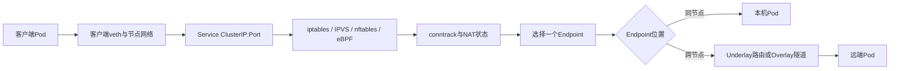

# 凌晨一点的那通告警：Pod 直连正常但 ClusterIP 偶发超时

凌晨一点，开发在群里问：

> 订单服务偶发超时，但Pod IP直连秒回，是不是网络出问题了？

从同一个客户端测试，直接请求一个后端Pod很快，请求Service的ClusterIP却偶尔要等待3秒。服务器没有宕机，
节点之间也不是完全不通，现场很容易把问题归给“底层网络”或者“kube-proxy坏了”。

这次没有立即重启组件。检查发起请求所在节点的连接跟踪状态后，证据逐渐指向一个更隐蔽的原因：
**conntrack表在流量突增时达到上限，新连接的首包被内核丢弃；流量回落、旧条目过期以后，服务又自行恢复。**

这类故障最危险的地方就在于它会“自己好”：如果只在恢复后看CPU、内存和Pod状态，所有指标都可能是绿色，
真正的丢包已经发生在更早的几分钟里。

本文不仅复盘这次事件，也建立一套可以重复使用的Kubernetes Service排障方法。读完后，应能回答：

- Pod IP正常、ClusterIP超时，究竟缩小了哪些范围，又不能排除什么？
- 一个请求经过Service时，EndpointSlice、kube-proxy、conntrack和CNI分别做了什么？
- 怎样用计数器、内核日志和抓包证明conntrack真的在丢包？
- 为什么“调大 `nf_conntrack_max`”只能止血，不能代替根因治理？
- MTU问题为什么会表现为小包正常、大包超时？
- iptables、IPVS、nftables和eBPF集群分别应该检查什么？

## 1. 事故摘要

| 项目 | 现象 |
| --- | --- |
| 报警时间 | 凌晨01:00左右 |
| 业务现象 | 订单请求偶发3秒超时，重试后可能成功 |
| 直连测试 | 从排障终端请求某个Pod IP，响应很快 |
| Service测试 | 请求ClusterIP时延抖动，偶尔连接超时 |
| Pod状态 | 后端Pod整体Running，未发现统一重启 |
| 节点状态 | Ready，CPU和内存没有明显异常 |
| 关键证据 | 故障客户端所在节点的conntrack使用率接近上限，内核出现table full丢包日志，丢包计数同期增长 |
| 自恢复原因 | 突发流量结束后，部分连接跟踪条目过期，表中重新出现空位 |
| 根因 | 短连接和重试放大造成连接跟踪表耗尽，容量与回收策略未覆盖业务峰值 |
| 处置原则 | 先抑制连接风暴并恢复容量，再治理短连接、重试、监控和容量模型 |

这份结论不是从“ClusterIP慢”直接猜出来的，而是由四类证据共同支持：

1. 故障集中在需要建立新NAT状态的连接，已有连接受影响较小；
2. 问题与特定客户端节点相关，把请求迁移到其他节点后明显缓解；
3. `nf_conntrack_count / nf_conntrack_max` 在故障窗口逼近100%；
4. 内核日志和 `conntrack -S` 的丢包增量与业务超时在同一时间发生。

如果缺少其中的关键证据，就只能把conntrack写成“怀疑项”，不能写成已经确认的根因。

## 2. 先纠正一个直觉：直连正常不等于网络完全正常

“Pod IP直连正常、Service超时”确实很有价值，它说明应该优先检查两条路径之间的差异。但这句话只有在
以下条件一致时才有较强证明力：

- 测试从同一个客户端Pod或同一个节点发起；
- 使用相同的协议、端口、请求体和超时；
- 直连的是Service这一次真正选择的同一个Endpoint；
- 测试次数足够，能够覆盖偶发问题；
- 没有因为Host、TLS SNI、Service Mesh或应用路由进入不同逻辑。

只手工挑一个健康Pod直连一次，不能排除这些情况：

- Service后面混入了一个慢Pod或错误Pod；
- EndpointSlice仍包含正在终止、未就绪或端口错误的Endpoint；
- `internalTrafficPolicy: Local` 使部分节点没有可用本地Endpoint；
- 会话保持或拓扑感知把流量送往不同后端；
- 只有某个客户端节点的conntrack、规则或路由异常；
- Service Mesh或eBPF代理改变了实际数据路径；
- Pod IP测试是小响应，Service请求触发了大报文或不同应用逻辑。

所以更准确的结论是：

> 直连Pod稳定而ClusterIP不稳定，应优先检查“Endpoint选择和Service转发路径”，但仍要通过同源、同后端、
> 同请求的对照实验完成证明。

## 3. 一个ClusterIP请求到底经过了什么

先把路径画清楚，再决定在哪里取证。



Kubernetes控制面不会为ClusterIP启动一个真正监听该地址的进程。Service控制器维护Service对象，
EndpointSlice控制器记录后端，节点上的服务代理或eBPF数据面监听这些对象并编程转发规则。

典型Linux节点会在连接首包到达时完成：

```text
匹配 ClusterIP:ServicePort
→ 选择一个可用 EndpointIP:TargetPort
→ 修改目标地址（DNAT）
→ 在 conntrack 中记录原始方向、回复方向和 NAT 映射
→ 根据修改后的目标地址路由到后端 Pod
→ 回复流量依据连接状态完成反向转换
```

需要注意两个边界：

1. **Service不等于Overlay。** Service负责虚拟地址和后端选择；选中跨节点Endpoint后，才可能继续走
   VXLAN、IPIP、Geneve等Overlay，也可能直接走BGP或普通Underlay路由。
2. **conntrack不只服务于ClusterIP。** 普通Pod连接也可能被连接跟踪。ClusterIP的DNAT强依赖首包建立
   NAT状态，因此表满时常更容易暴露，但不能据此认定直连流量一定不经过conntrack。

## 4. 不要用ping判断ClusterIP是否正常

ClusterIP表达的是“某个虚拟IP上的某个TCP、UDP或SCTP端口”，并不保证响应ICMP Echo。下面的测试：

```bash
ping <cluster-ip>
```

无论成功还是失败，都不能完整证明Service业务端口是否正常。应该从真实调用方所在的网络命名空间，
使用真实协议测试：

```bash
curl -sS -o /dev/null \
  --connect-timeout 2 --max-time 5 \
  -w 'code=%{http_code} connect=%{time_connect} start=%{time_starttransfer} total=%{time_total}\n' \
  http://<cluster-ip>:<service-port>/<health-path>

nc -vz -w 2 <cluster-ip> <service-port>
```

如果服务使用HTTPS，还要保持Host和SNI一致。直接请求IP可能进入默认证书或默认虚拟主机：

```bash
curl -sS --resolve <service-domain>:<service-port>:<cluster-ip> \
  --connect-timeout 2 --max-time 5 \
  https://<service-domain>:<service-port>/<health-path>
```

## 5. 第一步不是查内核，而是核对Service与EndpointSlice

Service超时时，最便宜、最安全的检查是确认控制面告诉节点“应该转发到哪里”。

### 5.1 检查选择器、端口和流量策略

```bash
kubectl get service <service-name> -n <namespace> -o yaml

kubectl get service <service-name> -n <namespace> \
  -o jsonpath='{.spec.clusterIP}{"\n"}{.spec.ports}{"\n"}{.spec.selector}{"\n"}{.spec.internalTrafficPolicy}{"\n"}{.spec.sessionAffinity}{"\n"}'
```

重点检查：

- `port` 到 `targetPort` 是否正确；
- 命名端口是否在所有Pod中都解析为同一个容器端口；
- selector是否误选了其他版本、任务Pod或未完成初始化的Pod；
- 是否配置了 `sessionAffinity: ClientIP`；
- 是否使用 `internalTrafficPolicy: Local`；
- Headless Service、ExternalName或无selector Service是否被当成普通ClusterIP分析。

当 `internalTrafficPolicy: Local` 生效时，节点只把内部流量交给本地Endpoint；节点没有本地Endpoint时，
流量会被丢弃。这种问题经常表现为“从某些节点访问正常，从另一些节点访问失败”。

### 5.2 EndpointSlice才是主要检查对象

```bash
kubectl get endpointslice -n <namespace> \
  -l kubernetes.io/service-name=<service-name> -o wide

kubectl get endpointslice -n <namespace> \
  -l kubernetes.io/service-name=<service-name> -o yaml
```

逐个核对：

- `addresses` 是否属于预期Pod；
- `ports[].port` 和协议是否正确；
- `conditions.ready`、`serving`、`terminating`；
- `nodeName` 和 `zone` 是否表现出节点或可用区集中性；
- Pod已经删除后，旧Endpoint是否仍残留；
- 变更发生时EndpointSlice是否频繁抖动。

再把Endpoint地址映射回Pod：

```bash
kubectl get pods -n <namespace> -o wide --show-labels
kubectl describe service <service-name> -n <namespace>
kubectl get events -n <namespace> --sort-by=.lastTimestamp
```

### 5.3 对每一个Endpoint做同条件采样

不要只挑一个Pod验证。应从发生故障的同一个客户端连续访问全部Endpoint，并保持协议、端口、Host和
请求内容一致：

```bash
for endpoint_ip in <endpoint-ip-1> <endpoint-ip-2> <endpoint-ip-3>; do
  for sample_id in 1 2 3 4 5; do
    curl -sS -o /dev/null --connect-timeout 2 --max-time 5 \
      -H 'Host: <service-domain>' \
      -w "endpoint=${endpoint_ip} code=%{http_code} connect=%{time_connect} total=%{time_total}\n" \
      "http://${endpoint_ip}:<target-port>/<health-path>"
  done
done
```

如果只有一个Endpoint慢，优先检查那个Pod、节点、应用线程池和依赖；如果所有Endpoint直连稳定，而
ClusterIP的新连接失败，再继续检查节点服务数据面。

## 6. 用测试矩阵把故障定位到节点、Endpoint和连接阶段

偶发故障最怕只执行一次命令。建议至少建立下面的矩阵：

| 维度 | 对照组 |
| --- | --- |
| 客户端 | 原客户端Pod、同节点另一个Pod、其他节点Pod、宿主机 |
| 目标 | ClusterIP、每一个Endpoint IP、Service域名 |
| 连接 | 每次新建连接、复用Keep-Alive连接 |
| 报文 | 小请求、大请求或大响应 |
| 后端位置 | 同节点Endpoint、跨节点Endpoint |
| 时间 | 正常窗口、故障窗口、恢复窗口 |

可以用循环记录新建连接的成功率和阶段耗时：

```bash
for sample_id in $(seq 1 100); do
  date '+%F %T.%3N'
  curl -sS -o /dev/null \
    --connect-timeout 2 --max-time 5 \
    -H 'Connection: close' \
    -w 'remote=%{remote_ip} code=%{http_code} connect=%{time_connect} start=%{time_starttransfer} total=%{time_total}\n' \
    http://<cluster-ip>:<service-port>/<health-path>
  sleep 0.2
done
```

观察重点：

- `time_connect` 接近超时：优先看SYN丢包、conntrack、规则、路由和后端监听；
- 连接很快但 `time_starttransfer` 很高：优先看应用排队和后端依赖；
- 只有大请求失败：优先看MTU、PMTU、分片和代理缓冲；
- 只有新连接失败、已有连接稳定：conntrack容量、SYN路径和监听队列优先级上升；
- 只有某个客户端节点失败：检查该节点本地conntrack和规则；
- 失败概率接近某个Endpoint占比：检查后端集合。

## 7. conntrack为什么会让Service“悄悄超时”

### 7.1 conntrack保存的不是连接日志，而是内核转发状态

Linux Netfilter使用连接跟踪表识别一条流的状态。一个典型TCP条目会记录：

- 原始五元组：源地址、源端口、目标地址、目标端口、协议；
- 回复方向五元组；
- TCP状态与超时时间；
- NAT前后的地址和端口映射；
- 可能附带的标记、helper、accounting和其他扩展。

ClusterIP连接的首包需要建立状态，后续包和回复包才能使用同一套DNAT与反向转换。当表无法接纳新条目
时，新连接可能表现为：

```text
客户端发送 SYN
→ 节点无法建立所需 conntrack/NAT 状态
→ 首包或后续回复被丢弃
→ 客户端重传 SYN
→ 重传仍可能被丢弃
→ connect timeout
```

内核不会向应用返回一句“conntrack满了”。应用看到的通常只有超时，所以它被称为静默丢包。

### 7.2 为什么故障会自行消失

conntrack条目都有超时。突发请求停止后，短连接、TIME_WAIT相关状态或UDP条目会逐渐回收，
`nf_conntrack_count` 下降，新连接重新有机会插入，于是业务看起来“自己恢复了”。

这不是故障真正消失，而是系统暂时离开了容量悬崖。下一次连接风暴仍会复发。

### 7.3 为什么直连Pod可能看起来正常

即使普通Pod连接也可能进入conntrack，直连和Service仍可能出现不同现象：

- ClusterIP需要建立DNAT及回复方向映射，缺少状态更容易失败；
- 直连测试恰好复用了已有连接，Service测试在建立新连接；
- 直连测试来自另一台conntrack未满的节点；
- 直连只命中了一个健康Endpoint；
- Service请求量大，抽样更容易撞上表满窗口；
- 防火墙对 `UNTRACKED`、`INVALID` 和NAT流量的处理不同。

因此，“直连成功”是线索，不是conntrack只影响Service的证明。

## 8. 怎样证明conntrack表真的满了

### 8.1 在正确的节点看count和max

conntrack压力首先是节点局部问题。应检查**发起连接的Pod所在节点**，以及路径中实际执行Service NAT的
节点，而不是随便登录一个控制节点。

```bash
cat /proc/sys/net/netfilter/nf_conntrack_count
cat /proc/sys/net/netfilter/nf_conntrack_max

sysctl net.netfilter.nf_conntrack_count
sysctl net.netfilter.nf_conntrack_max
```

计算使用率：

```text
conntrack_utilization = nf_conntrack_count / nf_conntrack_max
```

接近100%说明风险很高，但单个瞬时值仍不足以证明发生了丢包。故障可能在你登录前已经恢复，因此必须
保留时序指标。

### 8.2 查内核有没有明确报告table full

```bash
sudo dmesg -T | grep -iE 'nf_conntrack.*(full|drop)'

sudo journalctl -k --since '30 minutes ago' \
  | grep -iE 'nf_conntrack.*(full|drop)'
```

典型信息如下：

```text
nf_conntrack: nf_conntrack: table full, dropping packet
```

这条日志非常关键，但还需要把时间与业务超时对齐。日志限速也可能让实际丢包很多、日志只有少量几行，
不能用日志行数估算丢包量。

### 8.3 看conntrack统计的增量，而不是只看累计值

```bash
sudo conntrack -S
sleep 10
sudo conntrack -S
```

`conntrack -S` 通常按CPU输出统计。重点关注：

- `drop`：因缺少conntrack条目等原因被丢弃的包；
- `early_drop`：表满时尝试提前回收条目；
- `insert_failed`：新条目插入失败；
- `invalid`：无法归类到有效连接状态的包；
- `search_restart`：哈希查找重启次数，高增量可能表示查找竞争或压力。

不要看到历史累计值非零就直接定案。正确做法是计算故障窗口内的增量，并与请求超时、内核日志和
利用率曲线对齐。`insert_failed` 也可能来自元组冲突等原因，不能单独等同于“表满”。

### 8.4 谨慎分析条目组成

先看总体网络状态：

```bash
ss -s
sudo conntrack -C
```

需要进一步分析时，可以在低峰或测试节点抽取条目，按协议、状态、源地址和目标端口聚合。生产表已经很大
时，不要贸然把整个 `conntrack -L` 输出到终端：全表遍历和海量输出本身会增加节点压力。

可先检查内核Slab占用：

```bash
grep -E '^nf_conntrack' /proc/slabinfo
sudo slabtop -o
```

再根据现场工具和性能预算进行限时采样。需要回答的不是“总共有多少连接”，而是：

- 哪种协议占得最多？
- 哪种TCP状态占得最多？
- 哪些源地址或工作负载制造了最多新连接？
- 哪些目标地址和端口被集中访问？
- 是否存在DNS、监控探针、服务发现或健康检查风暴？
- 上游重试是否在故障后继续放大连接数？

## 9. 本次故障的证据链

故障发生时，没有重启kube-proxy，也没有重建Service。排查过程可以还原为：

| 时间 | 操作与发现 | 判断 |
| --- | --- | --- |
| 01:00 | 开发报告ClusterIP偶发3秒超时 | 确认用户侧现象，不先归因 |
| 01:02 | 从同一客户端对ClusterIP和全部Endpoint连续采样 | Endpoint本身稳定，Service新连接失败 |
| 01:05 | 从不同节点重复测试 | 故障明显集中在原客户端所在节点 |
| 01:07 | 检查该节点conntrack使用率 | `count/max` 已逼近容量上限 |
| 01:08 | 查内核日志和两次 `conntrack -S` | table full日志出现，drop与early_drop继续增长 |
| 01:10 | 业务请求量回落，conntrack条目开始过期 | 使用率和超时率同步下降 |
| 01:12 | ClusterIP恢复稳定 | 没有组件重启，符合容量压力自行缓解特征 |
| 白天复盘 | 关联网关和应用连接指标 | 短连接突增叠加重试放大，连接复用不足 |

关键判断不是“看到conntrack很高”，而是下面这条可验证的因果链：

```text
连接新建速率突增
→ 活跃和等待回收的conntrack条目增长
→ count逼近max
→ 内核无法为部分新流建立跟踪/NAT状态
→ drop与table full日志增长
→ Service新连接出现SYN重传和超时
→ 流量回落、旧条目过期
→ count下降，业务自行恢复
```

## 10. 应急止损：先恢复余量，不破坏现场

### 10.1 先控制连接制造速度

如果能够确认来源，优先采用业务影响最小的措施：

- 暂停异常批任务、压测或高频健康检查；
- 对异常调用方限流，而不是对整个集群停流；
- 关闭无上限重试，使用指数退避、抖动和总重试预算；
- 启用或恢复HTTP/gRPC连接池和Keep-Alive；
- 临时把部分客户端工作负载调度到conntrack有余量的节点；
- 扩容客户端节点，分散节点级连接跟踪压力。

迁移工作负载只是止血。如果制造连接的逻辑不变，新节点仍会被填满。

### 10.2 受控提高nf_conntrack_max

确认节点内存和哈希表压力允许后，可以临时提高上限：

```bash
sudo sysctl -w net.netfilter.nf_conntrack_max=<new-limit>
```

操作前后记录：

```bash
sysctl net.netfilter.nf_conntrack_count
sysctl net.netfilter.nf_conntrack_max
cat /sys/module/nf_conntrack/parameters/hashsize
grep -E '^nf_conntrack' /proc/slabinfo
```

不能把上限随意扩大十倍。每个条目的实际内存开销与内核版本、协议、NAT和扩展功能有关，表越大还会
增加内存、哈希冲突和遍历成本。应在目标内核上用Slab指标测量，而不是套用一个固定“每连接多少字节”的
经验数。

还要确认参数由谁管理。kube-proxy配置中的 `conntrack.maxPerCore` 和 `conntrack.min` 可能在启动时设置
上限，节点初始化脚本或sysctl配置也可能再次覆盖。永久修改应只保留一个明确的配置源。

### 10.3 不要在事故中直接清空conntrack

下面这类操作会破坏已建立连接和NAT映射：

```text
conntrack -F
```

除非已经明确接受全节点连接中断并有完整回退方案，否则不要把“清表”作为常规修复。它会让数据库连接、
长连接、控制面连接和业务会话同时重建，新的连接风暴可能比原故障更严重。

### 10.4 不要盲目缩短established超时

内核常见默认的 `nf_conntrack_tcp_timeout_established` 是432000秒，也就是5天；但kube-proxy、发行版、
节点初始化配置或不同版本可能设置其他值。应先读取真实环境：

```bash
sysctl net.netfilter.nf_conntrack_tcp_timeout_established
sysctl net.netfilter.nf_conntrack_tcp_timeout_time_wait
sysctl net.netfilter.nf_conntrack_udp_timeout
sysctl net.netfilter.nf_conntrack_udp_timeout_stream
```

`ESTABLISHED` 超时针对长时间没有看到报文的已建立流，不是所有短连接的统一回收开关。直接从5天改成
1天可能伤害长时间空闲但仍应保持的数据库、消息、控制面或设备连接。

正确步骤是：

1. 先按协议和状态分析谁占表；
2. 找到连接没有正常关闭或复用不足的上游；
3. 根据业务允许的最大空闲时间选择参数；
4. 在Canary节点验证长连接、故障恢复和内存；
5. 再通过节点配置系统统一发布。

## 11. 根治：用容量模型代替“把表调大一点”

连接跟踪容量可以先用Little's Law建立近似模型：

```text
需要的活跃条目数 ≈ 峰值新建连接速率 × 条目平均存活时间
规划上限 ≈ 活跃条目数 × 突发系数 × 安全余量
```

例如峰值每秒新建连接数很高，即使每条只保留几十秒，也可能迅速积累大量条目。如果异常重试把新建速率
翻倍，系统会在很短时间跨过容量悬崖。

容量规划至少需要这些数据：

- 每个节点的峰值新建连接数，而不是全局平均；
- TCP、UDP和其他协议占比；
- 各状态的平均和高分位存活时间；
- Service NAT、出网SNAT、NetworkPolicy和主机防火墙对conntrack的依赖；
- 节点可用内存、Slab增长和内核回收行为；
- 发布、故障转移、定时任务和重试风暴时的突发系数；
- 单节点故障后流量转移到其他节点的N+1容量。

应用侧治理通常比无限扩表更有效：

- HTTP/1.1连接池和Keep-Alive；
- HTTP/2或gRPC多路复用；
- 数据库、Redis和消息客户端连接池；
- 重试预算、指数退避和熔断；
- 健康检查周期与并发控制；
- 避免每条业务请求都重新做DNS、TCP和TLS握手；
- 找到连接泄漏、异常半连接和未关闭响应体。

## 12. 第二类常见原因：MTU与PMTU黑洞

如果故障呈现“小请求正常、大响应超时”，conntrack就不应是唯一优先项。此时要检查路径MTU。

### 12.1 Service本身不会强制流量走Overlay

Service规则选择Endpoint并完成地址转换。只有Endpoint位于其他节点，且集群网络采用封装模式时，后续
路径才会增加VXLAN、IPIP、Geneve或加密封装开销。

例如Underlay MTU为1500时，IPv4 VXLAN常见Pod MTU会配置为1450，但这个值不是所有环境的标准答案。
IPv6、WireGuard、云网络二次封装、跨AZ链路和厂商实现都会改变有效MTU，必须根据实际封装计算并实测。

### 12.2 PMTU黑洞的典型表现

```text
小报文通过
→ 大报文超过路径MTU
→ 中间设备需要分片或返回ICMP Fragmentation Needed / Packet Too Big
→ DF禁止分片，或者ICMP差错报文被防火墙丢弃
→ 发送端不知道应该减小报文
→ TCP持续重传
→ 应用超时
```

### 12.3 正确测试实际Endpoint路径

先检查接口和路由：

```bash
ip -br link
ip link show
ip route get <endpoint-ip>
tracepath -n <endpoint-ip>
```

在允许ICMP的IPv4路径上，可以从1472字节载荷开始向下测试；1472加20字节IPv4头和8字节ICMP头正好
是1500。测试目标应是实际节点或Endpoint路径，不要用ClusterIP的ICMP结果判断Service端口：

```bash
ping -M do -s 1472 -c 3 <endpoint-or-node-ip>
ping -M do -s 1450 -c 3 <endpoint-or-node-ip>
ping -M do -s 1400 -c 3 <endpoint-or-node-ip>
```

IPv6头长度和隧道开销不同，不能照搬1472。还要注意网卡TSO/GSO/GRO会让宿主机抓包看到大于物理MTU
的逻辑报文，必要时在发送端、隧道外层接口和接收端同时抓包。

```bash
sudo tcpdump -ni any \
  '(icmp and icmp[0] == 3 and icmp[1] == 4) or icmp6'
```

### 12.4 修复原则

- 统一规划Underlay、Pod和隧道接口MTU；
- 把所有潜在封装层和云厂商限制纳入计算；
- 保证ICMP Fragmentation Needed和IPv6 Packet Too Big能够返回；
- 在明确边界处评估TCP MSS Clamping，但不要用它掩盖错误的基础MTU；
- 同时验证同节点、跨节点、跨可用区和出网路径；
- 通过大报文合成探测持续验证，而不是只用默认小包ping。

## 13. 第三类常见原因：Service规则和数据面实现

### 13.1 先确认集群到底使用什么实现

现代集群不能再只问“iptables还是IPVS”。Linux上的kube-proxy支持iptables、IPVS和nftables模式；
有些集群还会使用Cilium或Calico eBPF等实现替代kube-proxy。

```bash
kubectl get daemonset -n kube-system kube-proxy -o wide
kubectl get configmap -n kube-system kube-proxy -o yaml
kubectl logs -n kube-system daemonset/kube-proxy --tail=200
```

如果ConfigMap中 `mode` 为空，不能只凭空值下结论，应结合kube-proxy启动日志、参数和实际规则判断。
托管集群也可能隐藏或改造这部分配置。

如果根本没有kube-proxy，再确认CNI是否接管Service：

```bash
cilium status
cilium service list
```

具体命令取决于产品和版本。不要因为找不到 `KUBE-SVC-*` 规则就立即判断Service损坏。

### 13.2 iptables模式检查

```bash
sudo iptables-save -t nat \
  | grep -E '<cluster-ip>|KUBE-SVC|KUBE-SEP'

sudo iptables-save -t filter \
  | grep -E 'KUBE-FORWARD|KUBE-SERVICES'
```

检查Service链是否存在、是否引用正确Endpoint、计数器是否增长，以及规则同步时间是否与Endpoint变更一致。
不要在生产节点上直接清空iptables规则。

### 13.3 IPVS模式检查

```bash
sudo ipvsadm -Ln
sudo ipvsadm -Ln --stats --rate
ip address show kube-ipvs0
```

检查虚拟服务、协议、调度算法、Real Server、权重、活动连接和非活动连接。还要检查kube-proxy日志、
conntrack和内核版本，不能把所有UDP超时笼统归结为“IPVS有UDP Bug”。

Kubernetes当前文档已经把IPVS模式标记为弃用，并建议迁移到nftables等实现。对仍运行IPVS的集群，
这意味着应该制定经过验证的迁移计划，而不是在事故中临时切模式。

### 13.4 nftables模式检查

```bash
sudo nft list ruleset
sudo nft monitor trace
```

`nft monitor trace` 可能产生大量输出，生产使用时必须添加准确过滤条件并短时采集。nftables模式对内核
版本有要求，升级前应检查发行版内核和Kubernetes版本兼容性。

### 13.5 eBPF模式检查

eBPF数据面通常要检查：

- Service与Backend Map是否包含正确地址；
- 程序是否挂载在预期网卡、cgroup或TC Hook；
- Map更新失败、容量和丢包原因；
- NetworkPolicy、主机防火墙和Service负载均衡是否由同一产品接管；
- 升级前后Map格式和程序版本是否兼容。

使用厂商提供的状态、Service列表、Monitor和Bugtool命令，避免用iptables思维解释所有eBPF路径。

## 14. 用抓包回答“包到底消失在哪里”

当对象状态和计数器还不能闭环时，抓包是最直接的证据。至少在这些位置选择两处以上同步观察：

```text
客户端Pod eth0
→ 客户端节点veth/宿主机入口
→ Service转换前后
→ 隧道内层与外层接口
→ 后端节点入口
→ 后端Pod eth0
```

基础过滤示例：

```bash
sudo tcpdump -ni any \
  'host <client-ip> and (host <cluster-ip> or host <endpoint-ip>) and tcp port <port>' \
  -tttt -vvv
```

重点识别：

| 抓包表现 | 更可能的方向 |
| --- | --- |
| 客户端反复发SYN，转换后没有包 | Service规则、conntrack/NAT或本机过滤 |
| Endpoint收到SYN但不回SYN-ACK | 应用未监听、backlog、后端防火墙 |
| Endpoint回包但客户端节点看不到 | 反向路由、隧道、NetworkPolicy |
| 回包到达节点但未还原到客户端 | conntrack/NAT状态、非对称路由 |
| 小段通过，大段反复重传 | MTU、PMTU或中间设备丢包 |
| 只有一个Endpoint失败 | Endpoint或其节点问题 |

抓包中的TCP校验和错误可能来自Checksum Offload，不要只凭宿主机发送方向的 `bad cksum` 判定真实坏包。

## 15. 还必须排除的几类问题

### 15.1 后端SYN backlog或应用队列满

Pod进程存在不等于端口能够及时接受新连接：

```bash
ss -lntp
ss -s
nstat -az | grep -E 'ListenOverflows|ListenDrops|TCPReqQFull'
```

如果客户端SYN到达Pod但后端没有及时回复，应继续检查监听队列、线程池、GC、依赖和CPU限流。

### 15.2 NetworkPolicy和主机防火墙

检查策略是否只允许Pod CIDR却遗漏Service转换后的实际源地址，或者不同节点的SNAT行为不同：

```bash
kubectl get networkpolicy -A
sudo iptables-save -t filter
sudo nft list ruleset
```

### 15.3 非对称路由与rp_filter

请求和回复走不同网卡、不同网关或不同隧道时，conntrack可能无法把回复匹配到原连接，严格反向路径过滤
也可能丢包：

```bash
ip route get <endpoint-ip>
ip route get <client-ip>
sysctl net.ipv4.conf.all.rp_filter
sysctl net.ipv4.conf.default.rp_filter
```

不要为了验证假设就全局关闭 `rp_filter`。先用路由和抓包证明非对称路径，再按网络设计选择模式。

### 15.4 kube-proxy规则同步延迟

Service或EndpointSlice频繁变化时，检查kube-proxy日志和指标中的同步错误、同步耗时、最后成功时间。
控制面对象已经更新而节点规则仍旧，才支持“规则同步滞后”的判断。

### 15.5 Service Mesh或应用代理

如果Pod注入了Sidecar，ClusterIP和Pod IP请求可能经过不同的透明代理规则。要检查Envoy监听器、Cluster、
Endpoint健康、连接池、熔断和iptables/eBPF重定向，不能只看kube-proxy。

## 16. 常见误操作与为什么无效

### 16.1 一上来重启kube-proxy

重启可能重新同步规则，也可能暂时改变时间窗口，但会丢失现场并掩盖根因。conntrack表满、后端慢或MTU
错误不会因为重启kube-proxy得到根治。

### 16.2 删除并重建Service

ClusterIP和规则重新分配会扩大变更面，也可能影响DNS、客户端缓存和依赖方。只有控制面对象本身错误且已
有回滚方案时才应该修改Service。

### 16.3 只调大nf_conntrack_max

它能增加缓冲，却不能消除短连接风暴、无限重试和连接泄漏。没有监控和容量模型时，更大的表只会让下一次
故障来得更晚、消耗更多内存。

### 16.4 看到直连正常就甩给网络组

Service路径同时涉及控制面对象、节点数据面、内核状态、CNI路径和应用后端。“网络组”不是一个可验证的
故障层。工单应包含源、目标、协议、时间、失败率、路径和已经取得的证据。

### 16.5 为了性能临时切换代理模式

iptables、IPVS、nftables和eBPF之间的切换会改变规则、会话和运维工具，是一次数据面迁移，不是事故中的
无风险开关。应该在测试集群完成兼容、回滚和存量连接验证。

## 17. 一套可以直接执行的排障Runbook

### 17.1 阶段一：固定事实

```text
[ ] 记录故障开始时间、请求ID、源Pod/Node、Service、端口和超时阶段
[ ] 从原调用方持续采样，不只执行一次curl
[ ] 分开记录DNS、TCP连接、TLS、首字节和总耗时
[ ] 保留正常、故障和恢复窗口的指标
```

### 17.2 阶段二：验证Service对象与后端

```text
[ ] 检查selector、port、targetPort和协议
[ ] 检查EndpointSlice的ready/serving/terminating
[ ] 逐个直连所有Endpoint，而不是只测一个Pod
[ ] 检查internalTrafficPolicy、sessionAffinity和拓扑策略
[ ] 判断失败是否与某个Endpoint、节点或可用区相关
```

### 17.3 阶段三：验证连接跟踪

```text
[ ] 在实际客户端节点读取count和max
[ ] 查同一时间的kernel table full日志
[ ] 对比conntrack -S前后增量
[ ] 区分新连接与复用连接
[ ] 分析协议、状态、源和目标构成
[ ] 检查重试风暴、短连接和健康检查
```

### 17.4 阶段四：验证MTU与路径

```text
[ ] 对比Pod、隧道和Underlay接口MTU
[ ] 使用tracepath或DF大包测试真实Endpoint路径
[ ] 同节点和跨节点分别测试
[ ] 检查ICMP Fragmentation Needed / Packet Too Big
[ ] 在内外层接口同步抓包
```

### 17.5 阶段五：验证服务数据面

```text
[ ] 确认iptables、IPVS、nftables还是eBPF
[ ] 核对Service到Backend编程结果
[ ] 检查规则同步日志和指标
[ ] 检查NetworkPolicy、主机防火墙和非对称路由
[ ] 必要时多点抓包定位最后出现和首先消失的位置
```

### 17.6 阶段六：处置与验收

```text
[ ] 先限制异常连接制造者和重试放大
[ ] 参数调整前记录基线、配置所有者和回滚值
[ ] 不清空全节点conntrack
[ ] 验证新连接、已有长连接、小包和大包
[ ] 验证同节点、跨节点和全部Endpoint
[ ] 观察一个完整高峰，并确认计数器不再持续增长
```

## 18. 监控与告警

### 18.1 conntrack容量

node_exporter常见指标包括：

```text
node_nf_conntrack_entries
node_nf_conntrack_entries_limit
```

使用率：

```promql
node_nf_conntrack_entries
/
node_nf_conntrack_entries_limit
```

可根据环境设置多级阈值，例如持续5分钟超过70%预警、超过85%严重告警，同时结合增长速度减少误报。
阈值不是固定标准；如果突发速度很快，70%到100%可能只需要几十秒，还必须预测耗尽时间。

建议监控：

- 当前条目数、上限、使用率和增长率；
- `drop`、`early_drop`、`insert_failed` 的节点级增量；
- TCP新建连接速率、各状态数量；
- 节点Slab中的conntrack内存；
- Service连接成功率、SYN重传和连接耗时；
- 按节点、工作负载和调用方拆分的连接量；
- 应用重试率、连接池命中率和Keep-Alive复用率。

### 18.2 Service黑盒探测

至少从不同节点池持续探测：

- Service域名；
- ClusterIP业务端口；
- 每个Endpoint；
- 小响应和接近业务上限的大响应；
- 同节点和跨节点路径。

监控只看Pod Ready不能发现这种故障。Ready说明探针在某条路径上成功，不代表所有客户端节点的Service
转发都健康。

## 19. 安全实验：在测试集群复现和观察

不要通过填满生产conntrack表学习这个机制。可以在可销毁的隔离节点或网络命名空间中进行实验：

1. 部署一个ClusterIP Service和多个后端Pod；
2. 记录正常时的Service/Endpoint请求成功率；
3. 用受控连接发生器逐步提高新建连接速率；
4. 同时采集count、max、`conntrack -S`、内核日志和抓包；
5. 观察已有连接和新连接的差异；
6. 停止负载，观察条目过期和服务恢复；
7. 分别验证连接复用、重试退避和受控扩容的效果。

实验必须设置：

- 独立节点或独立测试集群；
- 明确的最大并发和停止条件；
- 带外管理入口；
- 不承载控制面和生产业务；
- 自动停止负载的超时保护。

这个实验的目的不是制造更大的表，而是建立四条曲线之间的关系：

```text
新建连接速率
→ conntrack条目数量
→ 内核丢包计数
→ Service连接超时率
```

## 20. 复盘结论

凌晨一点的这次告警没有靠重启解决。真正有价值的动作，是先把“Pod IP正常、ClusterIP超时”拆成一条条
可以观测的数据路径，再用节点级证据确认丢包位置。

最终结论可以压缩为四句话：

1. Pod直连正常只能缩小范围，不能证明所有Endpoint和Pod网络都健康；
2. Service转发依赖Endpoint选择、节点数据面和连接状态，任何一层都可能静默丢包；
3. conntrack根因必须由容量、内核日志、丢包增量、节点相关性和抓包共同证明；
4. 调大表是应急措施，连接复用、重试治理、容量模型和持续监控才是长期修复。

面对偶发超时，最容易做的是重启，最难也最重要的是保留现场。系统并不会故意隐藏答案；只是答案往往不在
一个绿色面板里，而在请求经过的每一跳、每一个状态和同一时间轴上。

## 21. 延伸阅读

- [Kubernetes Service原理](../../networking/kubernetes/service-routing/02-Service.md)
- [Kubernetes网络架构概述](../../networking/kubernetes/service-routing/01-概述.md)
- [conntrack命令详解](../../networking/commands/19-conntrack命令详解.md)
- [iptables命令详解](../../networking/commands/18-iptables命令详解.md)
- [Calico网络：从Pod veth到BGP、VXLAN与eBPF数据路径](../../networking/kubernetes/cni/03-Calico.md)
- [网络故障排查方法与工具](../../networking/troubleshooting/10-网络故障排查方法与工具.md)

## 22. 参考资料

- [Kubernetes：Virtual IPs and Service Proxies](https://kubernetes.io/docs/reference/networking/virtual-ips/)
- [Kubernetes：EndpointSlices](https://kubernetes.io/docs/concepts/services-networking/endpoint-slices/)
- [Kubernetes：Service Internal Traffic Policy](https://kubernetes.io/docs/concepts/services-networking/service-traffic-policy/)
- [Kubernetes：kube-proxy Configuration API](https://kubernetes.io/docs/reference/config-api/kube-proxy-config.v1alpha1/)
- [Linux Kernel：Netfilter Conntrack Sysfs Variables](https://docs.kernel.org/networking/nf_conntrack-sysctl.html)
- [Netfilter：conntrack Manual](https://www.netfilter.org/projects/conntrack-tools/conntrack-manpage.html)
- [Calico：Configure MTU to Maximize Network Performance](https://docs.tigera.io/calico/latest/networking/configuring/mtu)
