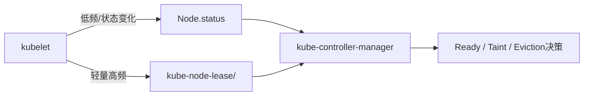

# 三台节点同时 NotReady：从 Lease、PLEG 到 containerd 运行时故障

凌晨02:03，三台工作节点几乎同时进入 `NotReady`。节点还能SSH，kubelet进程也显示Active，但Pod状态不再
收敛，容器操作大量超时。

故障初期很容易把现象概括成：

```text
containerd-shim 数量很多
→ shim 泄漏
→ containerd 卡死
→ kubelet PLEG 不健康
→ 三台节点 NotReady
```

这条链路有可能成立，但仅凭进程数量不能证明“shim泄漏”。containerd Runtime v2允许一个shim管理同一
Kubernetes Pod内的多个容器，shim数量也不能直接和 `crictl ps` 的Running业务容器数量比较。

最终复盘确认的是：**一个高频CronJob允许任务并发重叠，失败任务又配置了过高重试预算，持续制造Pod
Sandbox创建和销毁；三个节点的containerd在高频生命周期操作与清理异常叠加下进入高CPU、FD增长和CRI
超时，kubelet无法及时完成运行时状态检查与PLEG relist，节点健康状态转为异常。**

是否存在特定版本的shim泄漏，是需要版本、任务映射、残留资源和复现实验继续证明的促成因素，不能用一条
`ps | wc -l` 直接写成最终根因。

本文将完成四件事：

1. 区分 `Ready=False`、`Ready=Unknown` 和命令行显示的 `NotReady`；
2. 解释Lease、kubelet同步循环、PLEG、CRI、containerd与shim的关系；
3. 重建这次多节点故障的证据链和安全恢复过程；
4. 给出一套适用于CPU、GPU和NPU节点的通用NotReady排障Runbook。

## 1. 事故摘要

| 项目 | 信息 |
| --- | --- |
| 影响时间 | 02:03—02:17 |
| 影响节点 | 三台工作节点，几乎同时异常 |
| 控制面 | API Server和etcd仍可用 |
| Node现象 | `kubectl get nodes` 显示NotReady |
| kubelet | 进程Active，日志反复出现Runtime/PLEG健康检查超时 |
| containerd | 服务进程仍Active，但CRI请求延迟高或超时，CPU和FD明显增长 |
| 工作负载 | 高频CronJob重叠执行，失败Pod快速创建与删除 |
| 直接原因 | containerd无法在健康检查时间内响应，kubelet运行时状态与PLEG同步受阻 |
| 根因 | 缺少任务并发、重试和生命周期上限，造成跨节点Pod Sandbox churn并压垮运行时控制面 |
| 促成因素 | containerd/shim清理异常、节点运行时容量监控不足、告警只看Node Ready |
| 恢复 | 先停止任务源头，再逐节点保存证据并恢复containerd/kubelet，完成业务与节点验收 |

“服务进程Active”和“服务能够及时响应请求”是两回事。systemd只知道containerd主进程没有退出，
不知道CRI的 `Status`、`ListPodSandbox`、`ListContainers` 和生命周期请求是否能在时限内完成。

## 2. NotReady不是一个单一故障类型

### 2.1 先读Ready Condition的真实值

`kubectl get nodes` 为了展示方便，会把多种异常概括为 `NotReady`。排障时必须读取Node对象：

```bash
kubectl get node <node-name> \
  -o jsonpath='{range .status.conditions[*]}{.type}{"\t"}{.status}{"\t"}{.reason}{"\t"}{.lastHeartbeatTime}{"\t"}{.lastTransitionTime}{"\t"}{.message}{"\n"}{end}'
```

`Ready` 的关键状态：

| 状态 | 含义 | 优先方向 |
| --- | --- | --- |
| `True` | kubelet认为节点健康 | 不代表GPU、网卡和所有业务正常 |
| `False` | kubelet仍能报告状态，但认为节点不健康 | Runtime、PLEG、资源压力、CNI、配置 |
| `Unknown` | 控制面在宽限期内没有收到节点心跳 | 节点掉电、管理网、kubelet、TLS、API通路 |

当前官方文档中，`node-monitor-grace-period` 常见默认值为50秒，但不同Kubernetes版本和发行版可以修改。
复盘必须读取真实控制器配置，不能拿固定的40秒拼事故时间线。

### 2.2 Pressure不等于已经发生OOM或磁盘写满

常见Condition：

- `MemoryPressure=True`：内存可用量触及kubelet驱逐信号；不等于已经发生Host OOM；
- `DiskPressure=True`：nodefs、imagefs或containerfs的空间或inode触及阈值；
- `PIDPressure=True`：可用PID触及阈值；
- `NetworkUnavailable=True`：节点网络没有正确配置；
- `Ready=False`：读取具体Reason和Message，不能只看状态名称。

压力Condition能够缩小方向，但不能代替节点侧的内核、文件系统和cgroup证据。

### 2.3 SchedulingDisabled不是Condition

`SchedulingDisabled` 是 `kubectl get nodes` 对 `.spec.unschedulable=true` 的展示，表示节点被cordon。一个节点
可以同时显示：

```text
Ready,SchedulingDisabled
NotReady,SchedulingDisabled
```

它不能解释节点为什么不健康。

## 3. Node为什么需要两种心跳

kubelet会更新两类对象：

1. Node `.status`：包含Condition、Capacity、Allocatable和组件版本等较重状态；
2. `kube-node-lease` 中的同名Lease：只需高频更新 `spec.renewTime`。



检查命令：

```bash
kubectl get lease -n kube-node-lease <node-name> -o yaml

kubectl get lease -n kube-node-lease <node-name> \
  -o jsonpath='{.spec.renewTime}{"\n"}'
```

判断方式：

| Node状态 | Lease | 解释 |
| --- | --- | --- |
| `Ready=False` | 持续更新 | kubelet仍能联系API，但本地健康检查失败 |
| `Ready=Unknown` | 停止更新 | kubelet无法或没有继续向API续约 |
| Node状态暂未变化 | Lease持续更新 | 心跳仍在，Node Status更新频率更低 |
| 多节点Lease同时停止 | 同一时间 | 优先查共享API入口、网络、证书、时间或批量变更 |

Lease更新和Node Status更新是独立路径。不要只看 `lastHeartbeatTime`，也不要只看一个Lease时间就忽略
控制面的健康状态。

## 4. kubelet、PLEG和CRI分别在做什么

### 4.1 kubelet不是只负责“启动容器”

kubelet在节点上持续执行多个协调循环：

- 从API Server获取分配给本节点的Pod；
- 比较期望Pod状态与本地真实状态；
- 通过CRI调用containerd或CRI-O；
- 调用CNI创建和删除Pod网络；
- 挂载Volume；
- 执行Probe、资源统计、镜像垃圾回收和驱逐；
- 更新Node Status与Lease。

因此，一个卡住的Runtime可能不让kubelet进程退出，却会使它无法完成Pod生命周期同步。

### 4.2 PLEG解决什么问题

PLEG是Pod Lifecycle Event Generator。它定期从容器运行时获取本节点Pod和容器状态，与上一次结果比较，
生成“容器启动、退出、Pod变化”等生命周期事件，推动kubelet后续同步。

简化路径：

```text
PLEG触发relist
→ kubelet通过CRI获取Pod Sandbox与Container状态
→ 与本地缓存比较
→ 生成生命周期事件
→ Pod Worker继续协调期望状态
```

如果CRI长时间不响应，PLEG无法完成relist，日志可能出现：

```text
PLEG is not healthy
container runtime status check may not have completed yet
skipping pod synchronization
```

“PLEG不健康”是症状分类，不自动等于containerd进程泄漏。下列问题都可能让relist变慢：

- containerd CPU、内存、FD或线程耗尽；
- Snapshotter、OverlayFS或磁盘I/O卡顿；
- CNI ADD/DEL阻塞；
- 大量Pod和Sandbox同时创建、停止或清理；
- containerd、runc或shim版本缺陷；
- 挂载、Unmount或D状态进程阻塞；
- CRI Socket、锁竞争或事件积压。

### 4.3 systemctl Active为什么仍然会故障

```bash
systemctl status containerd --no-pager
```

`Active: active (running)` 只能证明主进程存在。还要验证服务能力：

```bash
timeout 5 crictl info
timeout 5 crictl pods
timeout 5 crictl ps -a
```

如果这些只读请求超时，说明Runtime控制路径已经不健康。命令本身失败时还要确认 `/etc/crictl.yaml` 指向
正确CRI Socket，避免把客户端配置错误当成Runtime卡死。

## 5. containerd shim是什么

containerd自身负责镜像、Snapshot、Metadata和上层生命周期协调，但不会直接成为所有容器进程的父进程。
Runtime v2通过shim与runc等OCI Runtime交互。

```mermaid
flowchart LR
    K["kubelet"] -->|"CRI"] C["containerd"]
    C -->|"Task API / ttrpc"] S["containerd-shim-runc-v2"]
    S --> R["runc"]
    R --> P["容器进程"]
    S --> E["退出状态、stdio、进程回收"]
```

shim的价值包括：

- containerd重启时，已经运行的容器不必跟着全部退出；
- 管理容器进程、stdio和退出状态；
- 承担文件系统挂载生命周期和子进程回收；
- 为containerd提供Runtime Task接口。

对于Kubernetes工作负载，containerd的 `io.containerd.runc.v2` 通常按照
`io.kubernetes.cri.sandbox-id` 将同一Pod中的容器分组到一个shim。因此：

```text
shim数量 != crictl ps显示的Running业务容器数
shim数量 != Kubernetes Pod数量的永久固定比例
```

镜像容器、已退出容器、Pod Sandbox、多容器Pod和正在清理的Task都会影响观察结果。

## 6. 怎样证明shim真的孤立或泄漏

### 6.1 先使用不包含grep自身的进程查询

```bash
pgrep -af 'containerd-shim'

ps -eo pid,ppid,lstart,stat,%cpu,%mem,args \
  | awk '/[c]ontainerd-shim/{print}'
```

进程很多只是容量线索，不是根因结论。

### 6.2 获取containerd和CRI看到的对象

```bash
sudo ctr -n k8s.io tasks list
sudo ctr -n k8s.io containers list
sudo crictl pods -a
sudo crictl ps -a
```

`crictl ps` 默认只显示Running Container；必须加 `-a`，并同时查看Pod Sandbox。`ctr` 是containerd原生
视角，`crictl` 是CRI视角，两者语义不同，不能简单做行数相减。

### 6.3 从shim启动参数提取ID并做映射

Runtime v2 shim参数通常包含Namespace和ID。应逐个回答：

- Namespace是否为 `k8s.io`；
- ID对应哪个Sandbox或Task；
- containerd Metadata中对象是否存在；
- shim Socket和Bundle是否存在；
- shim是否仍有容器子进程；
- 对象是否正在正常终止或垃圾回收；
- containerd日志是否持续报告删除、Unmount、Task Delete或事件失败。

可以检查运行目录，但路径会随containerd版本和Runtime变化：

```bash
sudo find /run/containerd/io.containerd.runtime.v2.task/k8s.io \
  -mindepth 1 -maxdepth 1 -type d -printf '%f\n'
```

不要删除这里的目录。它们是运行时状态，不是普通临时文件。

### 6.4 “孤立shim”的最低证据标准

只有同时满足类似条件，才可以把某个shim标记为疑似孤立：

```text
shim持续存在且不在正常退出窗口
+ 对应Task/Sandbox/Container已不存在
+ 没有仍应运行的容器进程
+ containerd无法完成Shutdown/Delete或重连
+ 日志存在对应生命周期清理失败
+ 多次采样数量持续单向增长
```

要写成“某版本containerd存在shim泄漏”，还需要：

- 精确的containerd、runc、内核和CRI配置；
- 可复现的工作负载与操作序列；
- 升级到包含修复的版本后现象消失；
- 上游Issue、补丁或厂商结论；
- 排除正常Sandbox和终止宽限期。

### 6.5 不要手工批量kill shim

shim可能仍然持有容器、stdio、退出状态和挂载。直接kill可能造成：

- 运行中容器失去管理；
- containerd Metadata与真实进程不一致；
- 挂载和网络命名空间残留；
- kubelet反复重建Sandbox；
- 现场进一步破坏。

需要处理疑似孤立shim时，应先隔离节点、建立映射、保存日志，并按照对应containerd版本的上游或厂商流程
处理。

## 7. 现场的第一批证据

### 7.1 控制面视角

```bash
kubectl get nodes -o wide

kubectl get node <node-name> -o yaml
kubectl describe node <node-name>

kubectl get lease -n kube-node-lease <node-name> -o yaml

kubectl get events -A --sort-by='.lastTimestamp'

kubectl get pods -A \
  --field-selector spec.nodeName=<node-name> -o wide
```

需要回答：

- 三台节点是 `Ready=False` 还是 `Ready=Unknown`？
- Lease同时停止，还是仍在更新？
- 节点是否属于同一机架、网段、节点池或变更批次？
- 最近是否部署了相同DaemonSet、Job、CronJob或节点配置？
- 控制面、API负载均衡和其他节点是否正常？
- `MemoryPressure`、`DiskPressure`、`PIDPressure` 是否同时出现？

### 7.2 节点侧时间线

```bash
date --iso-8601=seconds
uptime
systemctl status kubelet containerd --no-pager

journalctl -u kubelet --since '30 minutes ago' -o short-iso
journalctl -u containerd --since '30 minutes ago' -o short-iso
journalctl -k --since '30 minutes ago' -o short-iso
```

日志要保存完整时间戳，不要只用 `tail -100`。高频错误可能在几秒内冲掉最初的异常，集中日志也可能因
节点网络故障没有收到最后一段。

### 7.3 Runtime容量和响应

```bash
timeout 5 crictl info
timeout 5 crictl pods
timeout 5 crictl ps -a

systemctl show containerd \
  -p MainPID -p TasksCurrent -p MemoryCurrent -p LimitNOFILE

containerd_pid="$(systemctl show -p MainPID --value containerd)"
ls "/proc/${containerd_pid}/fd" | wc -l

pidstat -p "${containerd_pid}" 1 10
```

如果声明“FD泄漏”，必须同时保存当前值、进程Limit、随时间增长曲线和FD类型，而不是看到一个大数字就
下结论。

```bash
sudo ls -l "/proc/${containerd_pid}/fd" \
  | sed -n '1,100p'
```

全量枚举可能产生大量输出，应限制采样范围。

## 8. 事故时间线

| 时间 | 事实 | 当时判断 |
| --- | --- | --- |
| 02:03 | 三台Worker同时NotReady | 单机硬件故障概率下降，共享变更或工作负载优先级上升 |
| 02:04 | API Server、etcd和其他节点正常 | 排除整个控制面不可用 |
| 02:05 | 异常节点Condition与Lease时间接近 | kubelet健康/上报路径异常 |
| 02:06 | kubelet进程Active，但Runtime与PLEG日志快速增长 | 进程存活不等于同步循环健康 |
| 02:07 | `crictl info` 明显变慢或超时 | Runtime控制路径故障 |
| 02:08 | containerd CPU、FD和生命周期请求积压 | 运行时资源或内部处理受压 |
| 02:09 | 三节点同时存在大量失败Sandbox与Task清理记录 | 搜索共同工作负载来源 |
| 02:10 | 定位到重叠CronJob和过高重试预算 | 找到持续制造Pod生命周期事件的入口 |
| 02:11 | 暂停CronJob并停止继续创建新Job | 先停止放大器 |
| 02:12 | 逐节点保存Runtime和shim映射 | 区分运行对象、终止对象和疑似残留 |
| 02:13 | 逐节点受控恢复Runtime | 避免三台同时操作扩大业务影响 |
| 02:15 | CRI恢复，PLEG重新完成relist，Lease恢复 | 运行时链路恢复 |
| 02:17 | 三台节点重新Ready，完成业务验收 | 进入根因与预防阶段 |

## 9. 错误任务怎样形成Sandbox风暴

原始口头描述称“Job配置了 `restartPolicy: Always`”。这在标准Kubernetes API中不能成立：Job Pod模板只
允许 `Never` 或 `OnFailure`，`Always` 会被API校验拒绝。

所以复盘不能照抄口头结论，必须查看真实对象、Managed Fields和审计日志：

```bash
kubectl get cronjob <name> -n <namespace> -o yaml
kubectl get job -n <namespace> \
  -l batch.kubernetes.io/cronjob-name=<name> -o yaml
kubectl get pods -n <namespace> --show-labels
```

一种能够真实制造大量失败Pod的配置组合是：

```yaml
apiVersion: batch/v1
kind: CronJob
metadata:
  name: import-task
spec:
  schedule: "* * * * *"
  concurrencyPolicy: Allow
  jobTemplate:
    spec:
      parallelism: 20
      completions: 20
      backoffLimit: 100
      template:
        spec:
          restartPolicy: Never
          initContainers:
            - name: prepare
              image: example.invalid/prepare:<pinned-tag>
              command: ["sh", "-c", "exit 1"]
          containers:
            - name: worker
              image: example.invalid/worker:<pinned-tag>
```

风险链路：

```text
每分钟创建一个新Job
+ concurrencyPolicy允许前一个未结束时继续创建
+ parallelism一次创建多个Pod
+ initContainer必定失败
+ restartPolicy Never使Pod失败
+ 高backoffLimit促使Job继续创建替代Pod
→ 三个节点持续创建/销毁Sandbox、Network Namespace、CNI、Shim和Mount
→ containerd与kubelet生命周期控制面被压垮
```

这份Manifest只用于解释机制，不能部署到生产或共享测试集群。

## 10. 根因应该怎样表述

### 10.1 已确认的直接原因

```text
containerd的CRI请求在故障窗口持续超时
→ kubelet无法及时获取Runtime与Pod生命周期状态
→ PLEG relist超过健康窗口
→ kubelet跳过部分Pod同步并报告节点不健康
→ Node Ready转为False；严重时Lease也停止更新
```

### 10.2 已确认的根因

```text
CronJob缺少并发限制、活动期限和合理失败策略
→ 多批失败Job重叠
→ 高并发Sandbox生命周期操作分散到三台节点
→ Runtime控制面持续过载
```

### 10.3 促成因素

- containerd/shim生命周期清理出现异常或速度低于创建速度；
- 没有对Job新建速率、失败Pod数量和Sandbox churn告警；
- 没有对containerd CRI延迟、FD、CPU和PLEG指标告警；
- 多台节点运行相同版本和配置，形成同质化故障；
- CronJob变更没有经过并发、重试和资源策略审查；
- 告警从Node NotReady开始，发现时间已经太晚。

### 10.4 仍需证明的事项

- 是否为特定containerd/runc版本缺陷；
- 是否存在真正无法映射到Task/Sandbox的孤立shim；
- 清理阻塞在Unmount、CNI DEL、shim Shutdown还是Metadata；
- 为何三台节点的异常时间如此接近；
- 升级Runtime或降低生命周期速率后，现象是否可重复消失。

把“仍需证明”保留下来，比写一个听起来完整但证据不足的根因更专业。

## 11. 紧急止损顺序

### 11.1 第一优先级：停止制造新Pod

如果来源是CronJob，先暂停：

```bash
kubectl patch cronjob <cronjob-name> -n <namespace> \
  --type=merge -p '{"spec":{"suspend":true}}'
```

然后确认没有新的Job继续出现：

```bash
kubectl get cronjob <cronjob-name> -n <namespace>
kubectl get jobs -n <namespace> --sort-by=.metadata.creationTimestamp
kubectl get pods -n <namespace> -w
```

如果由GitOps或发布平台管理，还要暂停上层声明源，否则手工修改可能马上被恢复。

### 11.2 隔离受影响节点

控制面仍可写时：

```bash
kubectl cordon <node-name>
```

NotReady Taint通常已经阻止新Pod，但显式cordon可以防止节点短暂恢复后立刻接收新负载，并留下明确维护
意图。

### 11.3 保存证据后再恢复Runtime

最少保存：

- Node、Lease、Event和本节点Pod清单；
- kubelet、containerd和内核日志；
- containerd、runc、内核与CNI版本；
- CRI请求响应时间；
- Tasks、Containers、Sandbox和shim映射；
- containerd CPU、内存、FD、Tasks与磁盘I/O；
- 故障工作负载的完整YAML和审计时间线。

### 11.4 一次恢复一个节点

确认业务容忍、数据和带外入口后，先在一台节点受控重启containerd：

```bash
sudo systemctl restart containerd
sudo systemctl status containerd --no-pager
timeout 5 sudo crictl info
```

Runtime v2 shim的设计允许containerd重新连接运行任务，但具体行为取决于版本、Runtime状态和故障类型，
不能承诺重启一定不影响容器。

只有containerd恢复响应后，才判断是否需要重启kubelet：

```bash
sudo systemctl restart kubelet
sudo systemctl status kubelet --no-pager
```

如果kubelet本身正常并已经自动恢复，不需要为了“流程完整”额外重启。

### 11.5 不要直接批量删除分区节点上的Pod

节点失联时，API对象状态可能落后于节点真实状态。直接删除Pod并在其他节点重建，可能造成：

- 原节点业务进程仍在运行，形成双实例；
- Stateful服务双写；
- Local PV数据无法迁移；
- RWO卷发生Multi-Attach或强制Detach风险；
- 分布式任务出现旧Rank与新Rank并存。

需要强制重建前，应先完成节点Fencing或确认原实例停止，并根据工作负载的幂等性、存储和一致性做决定。

## 12. 恢复验收

### 12.1 kubelet与Lease

```bash
kubectl get node <node-name> -w
kubectl get lease -n kube-node-lease <node-name> -o yaml
journalctl -u kubelet --since '10 minutes ago' -o short-iso
```

确认：Lease持续续约、Ready恢复、PLEG错误停止增长、Node Condition没有反复抖动。

### 12.2 Runtime

```bash
timeout 5 crictl info
timeout 5 crictl pods
timeout 5 crictl ps -a
sudo ctr -n k8s.io tasks list
```

确认CRI延迟恢复，Task数量稳定，containerd CPU、FD和内存不再持续单向增长。

### 12.3 系统组件

```bash
kubectl get pods -n kube-system -o wide \
  --field-selector spec.nodeName=<node-name>

kubectl get pods -A -o wide \
  --field-selector spec.nodeName=<node-name>
```

检查CNI、kube-proxy、CSI Node、Node Exporter、日志Agent和设备插件，不要只看Node Ready。

### 12.4 业务路径

至少验证：

```text
新Pod Sandbox创建
同节点Pod通信
跨节点Pod通信
DNS与ClusterIP
镜像拉取
Volume挂载
业务读写与依赖
GPU/NPU节点还要验证设备资源和最小计算任务
```

观察一个足以覆盖任务周期和业务高峰的窗口后，再执行：

```bash
kubectl uncordon <node-name>
```

## 13. 通用Node NotReady排障Runbook

### 13.1 第0—2分钟：控制面定范围

```bash
kubectl get nodes -o wide
kubectl describe node <node-name>
kubectl get lease -n kube-node-lease <node-name> -o yaml
kubectl get events -A --sort-by='.lastTimestamp'
```

判断：

- 单节点还是多节点；
- `False` 还是 `Unknown`；
- Lease是否停止；
- 是否存在共同机架、网段、节点池或变更；
- 控制面是否健康；
- 哪个Condition最先变化。

### 13.2 第2—4分钟：登录能力和kubelet

优先使用经过授权的SSH或带外入口：

```bash
uptime
systemctl status kubelet --no-pager
journalctl -u kubelet --since '20 minutes ago' -o short-iso
systemctl show kubelet -p ActiveState -p SubState -p ExecMainStatus
```

重点搜索：

```text
lease
failed to update node status
x509 / certificate
container runtime
PLEG
pod sandbox
CNI
eviction
image filesystem
volume
too many open files
```

### 13.3 第4—6分钟：Runtime和Pod生命周期

```bash
systemctl status containerd --no-pager
journalctl -u containerd --since '20 minutes ago' -o short-iso
timeout 5 crictl info
timeout 5 crictl pods
timeout 5 crictl ps -a
sudo ctr plugins ls
```

判断CRI Socket、Runtime响应、Snapshotter、Sandbox、CNI和生命周期清理是否异常。

### 13.4 第6—8分钟：资源压力

```bash
free -h
vmstat 1 5
cat /proc/pressure/memory
cat /proc/pressure/cpu
cat /proc/pressure/io

df -hT
df -ih
findmnt
iostat -xz 1 5

cat /proc/sys/kernel/pid_max
ps -e --no-headers | wc -l
systemd-cgtop --iterations=3
```

Rocky Linux 9通常使用cgroup v2，不能照搬旧的
`/sys/fs/cgroup/memory/kubepods/memory.usage_in_bytes` 路径。先确认：

```bash
stat -fc %T /sys/fs/cgroup
systemd-cgls
```

### 13.5 第8—10分钟：网络、时间与证书

```bash
grep -n 'server:' /etc/kubernetes/kubelet.conf
ip -br address
ip route
getent hosts <api-server-hostname>
nc -vz -w 3 <api-server-hostname> 6443
openssl s_client -connect <api-server-hostname>:6443 \
  -servername <api-server-hostname> </dev/null

timedatectl status
chronyc tracking
journalctl -u kubelet | grep -iE 'x509|certificate|not yet valid|expired'
```

`curl -k` 可以验证TCP/TLS入口是否响应，但跳过了证书校验。返回401或403通常仍说明网络和TLS端点可达，
不等于kubelet鉴权已经成功。

## 14. 资源压力怎么正确排查

### 14.1 内存

```bash
free -h
vmstat 1 10
ps -eo pid,ppid,stat,%mem,rss,comm --sort=-rss | head -n 30
journalctl -k -b | grep -iE 'oom-killer|out of memory|killed process'
cat /proc/pressure/memory
```

`MemoryPressure=True` 表示达到kubelet驱逐信号，不自动证明kubelet已经被OOM Killer杀死。只有内核OOM日志、
进程退出状态和内存时间线才能确认Host OOM。

### 14.2 磁盘和inode

```bash
df -hT
df -ih
journalctl --disk-usage
sudo crictl images
sudo crictl ps -a
journalctl -k -b | grep -iE 'I/O error|read-only|EXT4-fs|XFS|nvme'
```

不要在I/O已经异常时立即对 `/var/lib/containerd` 做无限制递归 `du`，它可能进一步加重Metadata和磁盘
压力。也不要直接删除containerd Snapshot、Metadata或kubelet Pod目录。

`crictl rmi --prune` 清理的是未使用镜像，不是“已退出容器日志”。执行前应确认镜像回拉能力、磁盘收益和
业务启动风险。

### 14.3 PID与FD

```bash
cat /proc/sys/kernel/pid_max
ps -e --no-headers | wc -l
ps -eo user,pid,ppid,nlwp,stat,comm --sort=-nlwp | head -n 30

systemctl show containerd kubelet \
  -p MainPID -p TasksCurrent -p TasksMax -p LimitNOFILE
```

PIDPressure可以来自进程或线程增长。FD问题要比较 `fd` 数量与 `LimitNOFILE`，并分析Socket、Pipe、文件和
匿名inode类型。

### 14.4 读取真实驱逐配置

常见默认Hard Eviction阈值包括Linux内存可用量低于100Mi、nodefs可用空间低于10%、imagefs低于15%等，
但只要自定义其中一项，其他默认值是否合并还取决于 `MergeDefaultEvictionSettings` 和版本。

事故中应读取真实配置：

```bash
sudo grep -nE 'eviction|imageGCHighThresholdPercent|imageGCLowThresholdPercent' \
  /var/lib/kubelet/config.yaml
```

不要把文档默认值当成现场事实。

## 15. 证书问题不要只运行kubeadm certs

Node NotReady涉及的证书至少分三类：

1. kubelet访问API Server的Client证书；
2. kubelet HTTPS端点的Serving证书；
3. kubeadm管理的控制面和kubeconfig证书。

```bash
sudo readlink -f /var/lib/kubelet/pki/kubelet-client-current.pem

sudo openssl x509 \
  -in /var/lib/kubelet/pki/kubelet-client-current.pem \
  -noout -subject -issuer -dates

sudo kubeadm certs check-expiration
kubectl get csr
```

`kubeadm certs check-expiration` 主要检查 `/etc/kubernetes/pki` 和kubeadm管理的kubeconfig证书，不能代替
kubelet Client证书轮换检查。时间漂移也会造成证书“尚未生效”或“已过期”的假象。

## 16. CNI异常与Node NotReady的边界

```bash
ls -la /etc/cni/net.d
ls -la /opt/cni/bin

kubectl get pods -A -o wide \
  --field-selector spec.nodeName=<node-name>

journalctl -u containerd -u kubelet \
  | grep -iE 'CNI|NetworkPluginNotReady|FailedCreatePodSandBox'
```

CNI配置缺失最直接的影响通常是新Pod Sandbox无法创建。它是否导致Node `Ready=False/Unknown`，取决于
Runtime健康检查、CNI状态上报和宿主机到API Server的真实路径，不能写成“CNI坏了，所以节点必然
NotReady”。

## 17. 无法SSH时能不能用kubectl debug

控制面可用、节点kubelet和Runtime仍能创建Pod时，可以使用官方能力：

```bash
kubectl debug node/<node-name> -it \
  --image=<approved-debug-image> \
  --profile=sysadmin
```

节点根文件系统通常挂载在 `/host`。但它有三个边界：

- 节点已经掉电或网络不可达时不能工作；
- kubelet/containerd正是故障对象时，调试Pod可能无法创建；
- `sysadmin` Profile权限很高，必须受RBAC、审计和镜像准入约束。

因此它是SSH的补充，不是带外管理的替代品。第三方 `kubectl node-shell` 也不能突破一个已经失效的kubelet
和Runtime。

## 18. 不要在NotReady事故中做什么

### 18.1 不看日志就重启kubelet

如果根因是Runtime、磁盘、网络或证书，重启kubelet只会丢失现场，甚至制造更多同步压力。

### 18.2 把drain或强删Pod当通用答案

`drain` 可能受PDB、Eviction API、Volume和节点不可达影响而等待；强删Pod又可能在网络分区场景制造双实例。
应先明确业务控制器、数据、Fencing和容忍时间。

### 18.3 手工kill所有containerd-shim

这可能破坏运行容器、挂载和Runtime Metadata。先证明对象孤立，再使用版本对应的恢复流程。

### 18.4 删除 `/var/lib/containerd` 或 `/var/lib/kubelet`

这些目录保存Runtime Snapshot、Metadata、Pod状态和Volume信息。递归删除不是磁盘清理方式。

### 18.5 给所有Pod随意添加Limits就宣布根治

Requests、Limits、QoS和节点资源预留都很重要，但Runtime控制面压力还取决于Pod生命周期速率、镜像、CNI、
磁盘和内核资源。一个很小的失败Pod也能通过无限创建造成故障。

## 19. 任务型工作负载的防护

### 19.1 CronJob并发与历史

```yaml
apiVersion: batch/v1
kind: CronJob
metadata:
  name: import-task
spec:
  schedule: "*/10 * * * *"
  concurrencyPolicy: Forbid
  startingDeadlineSeconds: 120
  successfulJobsHistoryLimit: 1
  failedJobsHistoryLimit: 3
  jobTemplate:
    spec:
      backoffLimit: 3
      activeDeadlineSeconds: 900
      ttlSecondsAfterFinished: 3600
      template:
        spec:
          restartPolicy: Never
          containers:
            - name: worker
              image: example.invalid/worker:<pinned-tag>
              resources:
                requests:
                  cpu: 100m
                  memory: 128Mi
                limits:
                  cpu: "1"
                  memory: 1Gi
```

参数职责：

| 参数 | 控制什么 |
| --- | --- |
| `concurrencyPolicy: Forbid` | 上一次任务未完成时跳过新的重叠执行 |
| `startingDeadlineSeconds` | 错过调度后允许补执行的最大窗口 |
| `backoffLimit` | Job失败重试预算 |
| `activeDeadlineSeconds` | Job最长活动时间 |
| `ttlSecondsAfterFinished` | 完成后对象回收，不等同日志保留策略 |
| `podFailurePolicy` | 按退出码或Pod Condition决定Fail、Ignore或Count |
| Requests/Limits | 调度预算和容器资源边界 |

不是所有CronJob都应该使用 `Forbid`。如果业务允许并行，需要通过幂等性、最大并发和容量模型明确上限。

### 19.2 准入策略

可以使用ValidatingAdmissionPolicy、Kyverno或Gatekeeper对任务型工作负载检查：

- Job只能使用 `Never` 或 `OnFailure`；
- 必须设置合理的 `backoffLimit` 和 `activeDeadlineSeconds`；
- 高频CronJob必须声明并发策略；
- 容器必须配置资源Requests；
- 禁止未锁定的镜像Tag；
- 高并发Job需要队列、配额或专用节点池。

准入策略先以Audit模式观察，再逐步Enforce，避免一次阻断现有生产任务。

## 20. 监控与告警

### 20.1 不要等Node NotReady才报警

建议分层监控：

| 层次 | 指标 |
| --- | --- |
| Node | Ready Condition、Lease年龄、Taint、重启、PSI |
| kubelet | PLEG relist间隔/耗时、Runtime操作延迟与错误、Pod Worker延迟 |
| containerd | CPU、内存、FD、Tasks、GRPC延迟、Snapshot和事件错误 |
| 工作负载 | Pod创建/失败速率、Job失败、CronJob重叠、Sandbox churn |
| 资源 | 磁盘空间、inode、I/O延迟、PID、Slab、OOM和文件系统错误 |

### 20.2 Node Ready告警

以kube-state-metrics常见指标为例：

```promql
kube_node_status_condition{
  condition="Ready",
  status=~"false|unknown"
} == 1
```

应关联节点池、可用区和同一时间异常节点数量。三个节点同时NotReady比单节点异常更可能指向共享变更、网络
或工作负载放大器。

### 20.3 PLEG与Runtime

不同版本暴露的指标名称和标签可能变化，常见方向包括：

```promql
histogram_quantile(
  0.99,
  sum by (instance, le) (
    rate(kubelet_pleg_relist_duration_seconds_bucket[5m])
  )
)
```

```promql
sum by (instance, operation_type) (
  rate(kubelet_runtime_operations_errors_total[5m])
)
```

部署前先查询 `/metrics` 中实际存在的序列，不要把示例规则直接发布到所有版本集群。

### 20.4 工作负载放大器

需要提前发现：

- 每分钟新建Pod数量突增；
- Pending、Failed和Unknown Pod增长；
- Job Active/Failed数量异常；
- 同一CronJob存在多个Active Job；
- Sandbox创建和删除失败；
- containerd shim、Tasks、FD和CPU单向增长。

## 21. Node Problem Detector的正确定位

Node Problem Detector可以把部分内核、Runtime和系统守护进程问题转换成Node Condition或Event，帮助在
SSH之前获得线索。它不能替代：

- BMC与硬件监控；
- kubelet和containerd指标；
- 集中日志；
- Service和业务合成探测；
- 人工RCA。

生产部署应锁定Release、审查规则、控制镜像和权限，并先验证事件量。不要直接应用长期变化的 `master`
分支远程YAML。

## 22. 安全实验

不要通过压垮生产containerd学习PLEG。可以在可销毁测试节点创建一个严格受限的失败Job：

```yaml
apiVersion: batch/v1
kind: Job
metadata:
  name: bounded-failure-lab
spec:
  backoffLimit: 2
  activeDeadlineSeconds: 60
  ttlSecondsAfterFinished: 300
  template:
    spec:
      restartPolicy: Never
      containers:
        - name: fail
          image: busybox:<pinned-tag>
          command: ["sh", "-c", "exit 42"]
          resources:
            requests:
              cpu: 10m
              memory: 16Mi
            limits:
              cpu: 100m
              memory: 64Mi
```

观察：

```bash
kubectl get job,pod -w
kubectl describe job bounded-failure-lab
kubectl get events --sort-by='.lastTimestamp'
```

学习目标是理解Job重试、Pod替换和Runtime生命周期，不是制造无限Pod或故意填满PID、FD和磁盘。

## 23. 一份可审计的RCA模板

### 23.1 影响

```text
哪些节点、Pod和服务受影响？
持续多久？
是否发生数据重复、任务重跑或流量中断？
```

### 23.2 事实时间线

```text
CronJob何时创建Job
→ Pod/Sandbox创建速率何时增加
→ containerd延迟、CPU和FD何时变化
→ PLEG何时首次超时
→ Lease和Ready何时变化
→ 暂停任务后何时停止增长
→ Runtime恢复后何时恢复心跳
```

### 23.3 因果链

每一个箭头都要有指标、日志、对象或抓包支持。把“同时发生”与“前者导致后者”分开。

### 23.4 恢复为什么有效

回答：

- 暂停CronJob后，什么指标停止增长？
- 重启containerd前后，CRI延迟有什么变化？
- PLEG和Lease在什么时间恢复？
- 业务为什么能够安全重建？
- 是否存在未经Fencing的旧实例？

### 23.5 永久修复

- 工作负载并发、重试、截止时间和资源策略；
- containerd/runc修复版本和升级证据；
- Runtime与PLEG监控；
- Node故障隔离与Fencing；
- 恢复演练和发布准入。

## 24. 总结

这次故障最容易得到的结论是“shim太多，重启containerd就好了”。但一个高质量复盘必须继续追问：

1. Node究竟是 `Ready=False` 还是 `Unknown`？
2. Lease是否仍在更新？
3. PLEG慢在CRI、磁盘、CNI、Mount还是Runtime内部？
4. shim能否映射到真实Sandbox和Task？
5. 谁在持续制造Pod生命周期事件？
6. 为什么三台节点在同一时间进入相同故障？
7. 重启为什么有效，永久修复又是什么？

最终应记住的路径是：

```text
任务并发与失败策略
→ Pod/Sandbox生命周期速率
→ kubelet与CRI请求
→ containerd、shim、runc、CNI和Snapshotter
→ PLEG relist与Pod同步
→ Node Condition和Lease
→ 调度、驱逐与业务影响
```

NotReady只是控制面看到的结果。真正的运维能力，是沿这条路径把“哪个环节停止前进”证明出来，并在不
破坏证据、不制造双实例和不扩大故障面的前提下恢复节点。

## 25. 相关内容

- [GPU节点NotReady完整排查](../../gpu/cluster/troubleshooting/08-GPU%20节点%20NotReady%20的处理流程.md)
- [CNI DaemonSet更新导致节点NotReady故障复盘](./08-CNI-DaemonSet滚动更新导致节点NotReady故障复盘.md)
- [多环境集群新增节点纳管与验收](../../cloud-native/kubernetes/operations/cluster/05-多环境集群新增节点纳管与验收.md)
- [crictl命令详解](../../cloud-native/kubernetes/commands/11-crictl命令详解.md)
- [ctr命令详解](../../cloud-native/kubernetes/commands/12-ctr命令详解.md)
- [Node](../../cloud-native/kubernetes/scheduling/02-Node.md)

## 26. 参考资料

- [Kubernetes：Node Status](https://kubernetes.io/docs/reference/node/node-status/)
- [Kubernetes：Leases](https://kubernetes.io/docs/concepts/architecture/leases/)
- [Kubernetes：Jobs](https://kubernetes.io/docs/concepts/workloads/controllers/job/)
- [Kubernetes：CronJob](https://kubernetes.io/docs/concepts/workloads/controllers/cron-jobs/)
- [Kubernetes：Node-pressure Eviction](https://kubernetes.io/docs/concepts/scheduling-eviction/node-pressure-eviction/)
- [Kubernetes：Debugging Nodes with kubectl](https://kubernetes.io/docs/tasks/debug/debug-cluster/kubectl-node-debug/)
- [Kubernetes：Monitor Node Health](https://kubernetes.io/docs/tasks/debug/debug-cluster/monitor-node-health/)
- [containerd：Runtime v2](https://github.com/containerd/containerd/blob/main/docs/runtime-v2.md)
