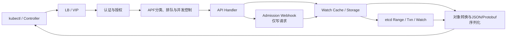
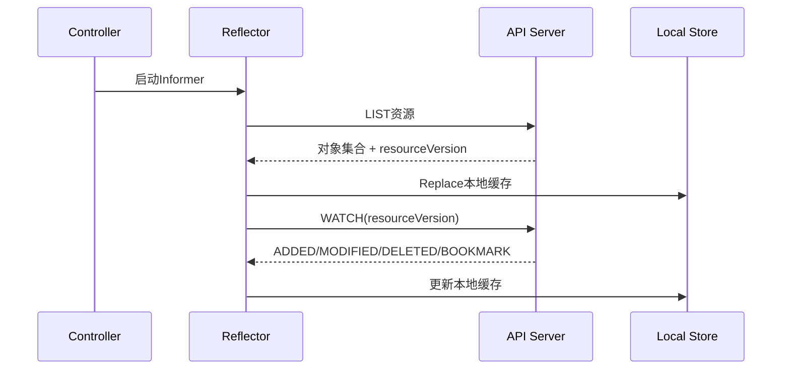
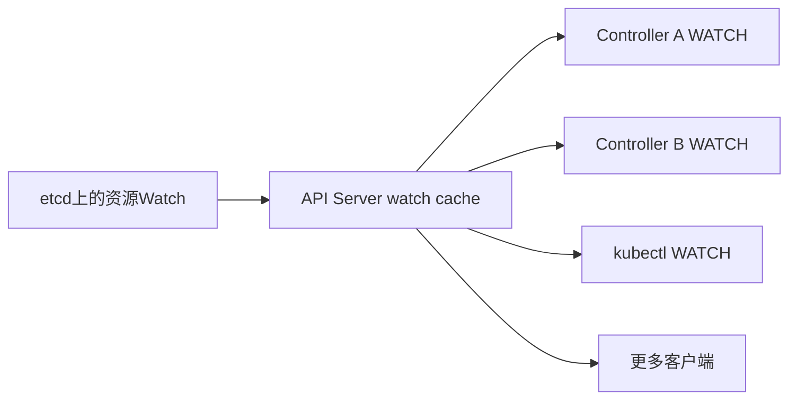
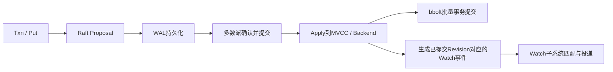

# API Server 间歇性卡顿：从秒级探针到 LIST/WATCH 重连风暴

API Server 每隔一段时间卡住3～8秒，随后又自行恢复。`etcdctl endpoint health` 正常，磁盘利用率不高，
控制面CPU也没有持续打满。这样的故障最难处理：一分钟粒度的图表看起来平滑，故障发生时所有进程又都
活着。

这类现象不能直接归结为“etcd慢”或“Watcher太多”。正确方法是先把一次请求拆成排队、执行、存储和响应
四段，再通过秒级探针、API Server直方图、APF指标、审计日志与etcd指标建立同一条时间线。

本文复盘的最终结论是：**一个控制器在滚动更新和异常重连期间反复执行大范围LIST，再重新建立WATCH，
形成短时请求与序列化风暴；API Priority and Fairness（APF）开始排队，普通API请求的TTFB随之升高。etcd
backend commit也在同一时段变慢，但它只是同一轮控制面压力下的相关信号，不能据此写成“Watcher在bbolt
写锁中逐个投递事件”。**

本文的目标不是背一个故障答案，而是学会证明以下问题：

1. 慢在负载均衡、TLS、API Server排队、处理、etcd还是响应序列化；
2. 是稳定的WATCH连接多，还是WATCH反复断开后产生了昂贵的全量LIST；
3. backend commit、WAL fsync和etcd请求延迟分别说明什么；
4. 哪些是事实、相关性、推断和仍需验证的假设；
5. 怎样止损、修复和验收，而不靠重启碰运气。

## 1. 事故摘要

| 项目 | 信息 |
| --- | --- |
| 现象 | `kubectl` 和业务控制器访问API Server时偶发3～8秒延迟 |
| 周期 | 每隔数分钟出现一次，每次持续约3～5秒 |
| 健康检查 | API Server与etcd健康端点大部分时间返回成功 |
| 常规资源 | CPU、磁盘利用率和网络无持续饱和 |
| 关键证据 | 慢窗口内APF等待时间上升，LIST请求量、返回对象数与响应字节同时突增 |
| 请求来源 | 同一ServiceAccount与User-Agent在控制器滚动更新后集中执行LIST/WATCH |
| etcd现象 | Range延迟和backend commit尾延迟在部分窗口升高，WAL fsync没有同步升高 |
| 直接原因 | 大范围LIST、反复重连与对象序列化占用API Server并发和CPU，引发排队 |
| 根因 | 控制器Watch范围过宽、重连缺少退避，滚动期间多个实例同时初始化Informer |
| 促成因素 | 只监控健康状态和分钟平均值，未按verb/resource/client观察控制面负载 |
| 恢复 | 暂停异常控制器扩散，缩小Watch范围并限制并发，随后滚动恢复 |

:::note 结论边界
表中的根因必须由审计日志、控制器日志、请求指标和变更时间线共同证明。如果现场只有一张
`backend_commit` 曲线，就只能说“etcd Backend提交曾变慢”，不能直接复制本文的根因。
:::

## 2. 为什么常规检查会显示“一切正常”

### 2.1 健康不等于低延迟

`/livez`、`/readyz` 和 `etcdctl endpoint health` 回答的是组件在当前采样点能否完成健康检查。它们不能证明：

- 过去一分钟没有出现3秒尖刺；
- 所有资源、所有verb和所有API Server实例都同样快；
- 请求没有在APF队列、认证授权、Webhook、存储或序列化阶段停留；
- 负载均衡器后面的每一个控制面实例都健康；
- P99满足业务SLO。

因此，健康端点成功与用户请求偶发超时可以同时成立。

### 2.2 短时间采样不能完成排除

以下检查有价值，但只能回答采样窗口里的局部问题：

```bash
iostat -x 1 10
ping -c 20 <etcd-peer-ip>
kubectl top pod -n kube-system
etcdctl endpoint status --cluster -w table
```

如果尖刺每十分钟才出现3秒，连续观察10秒很可能什么也看不到。`%util` 不高也不能证明fsync尾延迟正常，
CPU平均值不高也不能排除单核热点、cgroup限流、Go GC或短时调度停顿。

### 2.3 Prometheus并非一定会漏掉短尖刺

“15秒抓取间隔一定看不到3秒故障”并不准确：

- Gauge只保存抓取时刻的瞬时值，确实可能错过两次抓取之间的尖刺；
- Counter会累计，期间新增的错误或请求通常不会丢失；
- Histogram bucket也会累计观察值，短时慢请求仍会进入桶；
- 但15秒抓取间隔限制了时间定位精度，小样本P99也容易失真。

所以需要的是**直方图/计数器 + 秒级外部探针 + 审计时间线**，而不是把全部指标改成1秒抓取。

## 3. 先画清一条API请求经过的路径

一次资源请求不只是“API Server访问etcd”：



延迟可以来自任意一段：

| 层次 | 常见问题 | 主要证据 |
| --- | --- | --- |
| 客户端与入口 | DNS、TCP、TLS、LB坏实例、重试 | 分阶段curl、逐实例直连、LB日志 |
| 认证与授权 | Webhook慢、证书校验、外部鉴权超时 | API Server指标、Webhook日志、审计阶段 |
| APF | 队列堆积、并发席位不足、429 | `apiserver_flowcontrol_*` |
| Admission | Mutating/Validating Webhook超时 | Webhook延迟、失败与超时日志 |
| API处理 | 大LIST、对象转换、压缩、GC、CPU限流 | verb/resource维度直方图、pprof、容器指标 |
| Watch cache | 初始化、缓存落后、无法命中、事件分发慢 | watch cache指标、API Server日志 |
| etcd | Range/Txn慢、Leader异常、WAL/Backend慢 | etcd请求、Raft、WAL、Backend指标 |
| 返回链路 | 大响应、客户端读取慢、网络重传 | 响应字节、TTFB/total、抓包与TCP指标 |

只有先确定哪一段变慢，后面的源码分析才有意义。

## 4. 第一阶段：用高频探针抓住慢窗口

### 4.1 不要拿大LIST当唯一探针

直接请求 `/api/v1/nodes` 会把认证、授权、存储、Node数量、对象大小、序列化和网络混在一起。集群规模变化后，
同一个探针的成本也会变化。应同时设置三类探针：

1. `/readyz?verbose`：判断实例是否就绪；
2. 单个已知对象的GET：观察正常资源请求路径；
3. 有上限、可分页的LIST：观察集合读取与序列化路径。

不要复用 `apiserver-kubelet-client` 私钥或管理员证书。应为探针创建专用身份，只授予读取一个无敏感资源的
最小权限，并保护证书、Token和输出文件。

### 4.2 分解DNS、连接、TLS、TTFB和总时间

下面示例使用专用只读客户端证书。先经过LB测用户路径，再将地址分别指向每台API Server进行对比：

```bash
API_URL="https://<api-vip>:6443"
PROBE_NODE="<known-node-name>"

while true; do
  date -Ins
  curl --silent --show-error --output /dev/null \
    --connect-timeout 2 --max-time 10 \
    --cacert /etc/kubernetes/probes/ca.crt \
    --cert /etc/kubernetes/probes/probe.crt \
    --key /etc/kubernetes/probes/probe.key \
    --write-out 'code=%{http_code} remote=%{remote_ip} dns=%{time_namelookup} connect=%{time_connect} tls=%{time_appconnect} ttfb=%{time_starttransfer} total=%{time_total}\n' \
    "${API_URL}/api/v1/nodes/${PROBE_NODE}"
  sleep 1
done
```

读法：

- `connect` 上升：优先查LB、TCP队列和网络；
- `tls - connect` 上升：查TLS握手、CPU和连接复用；
- `ttfb - tls` 上升：请求已经到达服务端，重点查APF、Handler、存储和序列化；
- `total - ttfb` 上升：查响应体大小、服务端发送、客户端读取和网络质量；
- 只有某个 `remote` 慢：优先隔离该API Server实例，而不是笼统地说“集群慢”。

:::warning 探针也会制造负载
生产环境不要无限运行高频大LIST。1秒一次的单对象GET也应设定结束时间、超时、失败退避和专用身份，并
评估API Server规模。长期探测优先交给Blackbox Exporter或等价探针系统。
:::

### 4.3 同时保留服务端关联信息

客户端日志至少保留：

- 纳秒或毫秒级时间戳；
- API Server目标实例；
- HTTP状态码；
- DNS、TCP、TLS、TTFB和总时间；
- 请求资源与verb；
- 服务端返回的审计ID或Trace ID（如果已启用）。

这一步的产物不是“curl有时很慢”，而是一组可以与Prometheus、审计日志和组件日志对齐的时间窗口。

## 5. 第二阶段：先在API Server内部切层

### 5.1 请求延迟和请求量

API Server请求耗时是Histogram，应该从bucket计算分位数：

```promql
histogram_quantile(
  0.99,
  sum by (le, instance, verb, resource) (
    rate(apiserver_request_duration_seconds_bucket[2m])
  )
)
```

再看同一窗口内请求量是否突增：

```promql
sum by (instance, verb, resource, code) (
  rate(apiserver_request_total[2m])
)
```

先回答四个问题：

1. 只有 `LIST` 慢，还是GET、CREATE和UPDATE也慢；
2. 只有Pods/Secrets/某个CRD慢，还是所有资源都慢；
3. 只有一个API Server实例慢，还是全部实例同时慢；
4. 延迟上升时QPS、返回对象数和响应字节是否同步增长。

分位数窗口越短，时间定位越准，但样本越少。样本不足时同时看bucket增量、最大请求Trace与审计记录，不要
把只有几次请求的P99当作稳定统计结论。

### 5.2 APF排队与拒绝

API Priority and Fairness会给请求分类、分配并发席位并在过载时排队。重点指标：

```promql
apiserver_flowcontrol_current_inqueue_requests

histogram_quantile(
  0.99,
  sum by (le, instance, priority_level, flow_schema) (
    rate(apiserver_flowcontrol_request_wait_duration_seconds_bucket[2m])
  )
)

sum by (instance, priority_level, flow_schema, reason) (
  rate(apiserver_flowcontrol_rejected_requests_total[2m])
)
```

如果总请求耗时上升，而执行时间基本稳定、APF等待时间明显上升，慢点在“排队”；如果APF等待不高但执行
时间上升，则继续看Webhook、存储、CPU/GC和响应序列化。

WATCH受APF管理，但建立后的WATCH不会永远占据普通执行席位。不能用“有一万个长连接”直接推出“API
Server的一万个并发槽都被占满”。

### 5.3 写请求要单独检查Webhook

只有CREATE/UPDATE/PATCH/DELETE明显变慢时，优先检查Admission Webhook：

```promql
histogram_quantile(
  0.99,
  sum by (le, name, type, operation) (
    rate(apiserver_admission_webhook_admission_duration_seconds_bucket[2m])
  )
)
```

如果GET和LIST也同步变慢，Admission不是共同路径，应该继续寻找共享的APF、CPU、存储、审计后端或入口层
问题。

### 5.4 进程活着不代表没有运行时停顿

还要对齐：

- API Server进程CPU与容器CPU限流；
- `go_gc_duration_seconds`、Heap增长和GC频率；
- Goroutine数量与文件描述符；
- 审计后端错误和写入延迟；
- API聚合层和外部认证/鉴权Webhook；
- API Server日志中的超长请求Trace。

在生产环境采集pprof可能增加负载并包含敏感调用信息，应先限定时间、访问权限和保存位置；不要把“开pprof”
当作第一条命令。

## 6. 第三阶段：用审计日志找到是谁在请求

### 6.1 审计事件不是普通Kubernetes资源

不能使用下面这种方式列出审计历史：

```text
kubectl get --raw /apis/audit.k8s.io/v1/events
```

`audit.k8s.io/v1` 定义的是审计事件格式与策略API，不代表集群提供一个可供LIST的持久审计资源。审计记录
由API Server写入配置的日志文件或Webhook后端，应查询实际审计后端。

### 6.2 用最小Metadata策略记录LIST/WATCH

下面是针对排障窗口的示意策略；上线前要与现有策略合并，第一条匹配规则生效：

```yaml
apiVersion: audit.k8s.io/v1
kind: Policy
omitStages:
  - RequestReceived
rules:
  - level: Metadata
    verbs: ["list", "watch"]
    resources:
      - group: ""
        resources: ["pods", "services", "endpoints", "configmaps", "secrets"]
      - group: "apps"
        resources: ["deployments", "daemonsets", "statefulsets"]
  - level: Metadata
```

`Metadata` 不记录请求体和响应体，风险低于 `RequestResponse`，但身份、资源名、IP等仍可能敏感。修改API
Server审计配置通常涉及控制面静态Pod重建，必须通过变更流程进行；如果已经有集中审计，直接查询，不要为
一次排障贸然重启全部控制面。

对JSON Lines审计日志可先做基本聚合：

```bash
jq -r '
  select(.verb == "list" or .verb == "watch") |
  [
    .requestReceivedTimestamp,
    .user.username,
    .userAgent,
    .verb,
    .objectRef.resource,
    (.objectRef.namespace // "-") ,
    (.responseStatus.code // 0)
  ] | @tsv
' /var/log/kubernetes/audit/audit.log
```

需要重点寻找：

- 同一个ServiceAccount/User-Agent突然出现大量LIST；
- 每个Namespace分别建立相同资源的LIST/WATCH；
- WATCH经常结束，紧接着重新LIST；
- `410 Gone`、`too old resource version`、超时和连接重置；
- 控制器发布、扩缩容或Leader切换与请求风暴时间吻合。

审计记录能看到WATCH请求建立与结束阶段，但不能简单地把历史行数当成“当前存活Watcher数”。

### 6.3 回到控制器日志找重连原因

client-go控制器常见线索包括：

```text
Failed to watch
failed to list
too old resource version
context deadline exceeded
the server has asked for the client to provide credentials
EOF
connection reset by peer
```

必须进一步判断：

- 是网络/LB主动断开长连接；
- API Server重启或watch cache重建；
- 客户端使用了过旧的 `resourceVersion`；
- 客户端没有指数退避，所有副本同时重连；
- 滚动更新期间旧Pod未退出，新Pod又同时初始化全部Informer；
- 每个Namespace创建一个Informer，造成范围碎片化；
- 控制器不断CrashLoop，每次启动都重新LIST。

“定期resync”通常是在本地Informer缓存上重新触发处理，不等于每次都重新向API Server做全量LIST。不要看到
`resyncPeriod` 就直接判定它是LIST风暴根因。

## 7. LIST、WATCH、Informer、watch cache与etcd是什么关系

### 7.1 控制器侧：先LIST，再WATCH

典型SharedInformer内部由Reflector执行 `ListAndWatch`：



正常稳定的WATCH主要传输增量事件。真正昂贵的常常是以下模式：

```text
连接中断
→ WATCH失败
→ 无法从原resourceVersion继续
→ 重新LIST大量对象
→ 建立新WATCH
→ 多副本同时重复
```

所以“Watcher很多”和“LIST/WATCH重连风暴”是两个问题。前者可能只是大量稳定的长连接，后者会在短时间
制造大LIST、JSON/Protobuf编码、内存分配、GC、APF排队与网络发送。

### 7.2 API Server侧：watch cache负责缓存和扇出

API Server的Cacher为资源维护watch cache。它从底层存储执行ListAndWatch，保存近期对象变化，再把事件扇
出给多个API客户端。多数客户端WATCH并不是“一条客户端WATCH对应etcd中的一条WATCH”。



缓存无法满足请求、缓存重新初始化或请求的一致性语义不同时，API Server才可能访问底层存储。具体行为会随
Kubernetes版本、资源类型、请求参数和特性门控变化，排障必须以当前版本指标和源码为准。

### 7.3 `etcd_debugging_mvcc_watcher_total` 不能直接归属到某个Operator

该指标表示某个etcd成员进程当前持有的MVCC watcher数量。它不包含Kubernetes用户、Namespace和User-Agent
标签，也不等于API Server收到的WATCH HTTP请求数。因此不能这样推理：

```text
API审计里某Operator有8200条WATCH记录
≈ etcd里有8200个Watcher
≈ 8200个Watcher都由这个Operator创建
```

另外：

```bash
etcdctl get / --prefix --keys-only | wc -l
```

统计的是当前Key数量，不是Watcher数量。

要做客户端归属，应组合API Server审计、`apiserver_request_total`、User-Agent、ServiceAccount、控制器日志和
连接时间线；etcd watcher指标只用于观察底层watch负载趋势。

## 8. etcd写入、Backend commit和Watch投递不能混成一件事

### 8.1 简化写入链路

一次etcd写请求的关键路径可简化为：



bbolt同一时刻只允许一个写事务，这是理解Backend写竞争的基础。但不能进一步写成“etcd一定在持有bbolt
写锁时遍历所有Watcher，并等待所有客户端收完事件”。Backend事务提交与Watch匹配/投递属于不同子系统，
是否互相影响、在哪个锁范围内影响，必须针对运行版本阅读调用链和做Profile证明。

慢Watcher可能增加事件缓存、内存、Goroutine和发送压力；大量事件也可能让etcd或API Server繁忙。但这不
等价于“Watcher数量线性增加bbolt Commit持锁时间”。

### 8.2 三组指标分别回答什么

etcd的WAL fsync与Backend commit都是Histogram：

```promql
histogram_quantile(
  0.99,
  sum by (le, instance) (
    rate(etcd_disk_wal_fsync_duration_seconds_bucket[2m])
  )
)
```

```promql
histogram_quantile(
  0.99,
  sum by (le, instance) (
    rate(etcd_disk_backend_commit_duration_seconds_bucket[2m])
  )
)
```

```promql
histogram_quantile(
  0.99,
  sum by (le, instance, grpc_method) (
    rate(grpc_server_handling_seconds_bucket{grpc_service="etcdserverpb.KV"}[2m])
  )
)
```

不同版本的指标名和标签可能变化，上线规则前应检查该集群 `/metrics` 的真实输出。读法如下：

| 现象 | 能说明什么 | 仍不能排除什么 |
| --- | --- | --- |
| WAL fsync P99高 | Raft日志持久化慢 | 磁盘、虚拟化、调度、文件系统、设备队列 |
| Backend commit P99高 | Backend提交阶段慢 | fsync、脏页回写、锁竞争、大事务、Snapshot、CPU停顿 |
| WAL正常、Backend高 | 问题更靠近Backend而非WAL | 仍不能排除同一块盘和OS造成的Backend I/O尾延迟 |
| etcd Range高 | API Server底层读取慢 | 网络、Leader、线性读、结果规模、etcd CPU |
| watcher_total高 | etcd成员持有的Watcher多 | 哪个Kubernetes客户端创建、是否真的导致请求慢 |
| API LIST高、etcd Range不高 | API Server自身或缓存路径更可疑 | 序列化、APF、CPU/GC、客户端读响应慢 |

### 8.3 `endpoint health` 正常为何仍可能有尾延迟

Health探测是小请求和单次采样。它既不模拟大范围LIST，也不保证采样发生在尖刺窗口。必须比较：

- 每个成员而不是只经过一个Endpoint；
- P50、P95、P99与最大值，而不是只看平均值；
- KV Range/Txn、WAL fsync、Backend commit、Raft proposal和peer RTT；
- 故障窗口、正常窗口和变更窗口。

## 9. 本次事件如何建立证据链

### 9.1 第一步：证明慢点在服务端处理

秒级探针显示TCP与TLS耗时稳定，但TTFB从几十毫秒升至数秒；逐实例探针显示所有API Server都受影响，排除
单个LB后端实例故障，调查范围进入API Server及其共享依赖。

### 9.2 第二步：证明主要是排队和LIST

同一时间窗口内：

- `apiserver_request_duration_seconds` 的LIST P99先升高；
- `apiserver_flowcontrol_request_wait_duration_seconds` 随后升高；
- GET也变慢，但自身执行时间变化较小；
- LIST QPS、返回对象数与API Server CPU/Heap分配同时抬升；
- 没有集中出现Admission Webhook超时。

这说明大LIST先消耗执行能力，随后其他请求开始排队，而不是所有请求都在某个Webhook里等待。

### 9.3 第三步：把请求归属到具体客户端

审计日志显示，同一ServiceAccount和User-Agent在每次慢窗口开始前都出现以下序列：

```text
多个控制器Pod几乎同时启动
→ 对多个Namespace和多种资源发起LIST
→ 建立WATCH
→ WATCH很快断开
→ 缺少足够退避，再次LIST
```

Deployment变更时间、Pod启动时间、控制器Reflector日志和审计时间完全吻合。停止新副本继续扩散后，LIST
突发与APF排队立即回落；保留一个实例观察时，尖刺消失。这是比“Watcher数量很多”更强的因果证据。

### 9.4 第四步：正确解释etcd相关曲线

etcd Range和Backend commit在部分窗口上升，说明底层也承受了额外压力；但WAL fsync稳定，且API Server的
LIST/APF变化出现得更早。现场没有Mutex Profile或源码级证据证明Watcher遍历延长了bbolt写锁。

因此复盘写成：

> LIST/WATCH重连风暴是已证实根因；etcd Backend提交尾延迟是放大因素或共同压力信号。Watcher在bbolt
> 写锁内投递导致提交变慢的假设不成立，不能作为结论。

这一区分非常重要：相关曲线能指出调查方向，不能自动组成调用栈。

## 10. 止损：先阻断请求风暴，再动控制面

推荐顺序：

1. 冻结相关控制器的滚动发布或继续扩容；
2. 确认Leader Election是否有效，避免多个副本同时执行相同控制循环；
3. 在业务允许时只保留一个健康实例，观察LIST QPS与APF队列是否回落；
4. 通过APF隔离非关键控制器，保障Node心跳、Leader Election和核心系统请求；
5. 检查API Server和etcd是否已经恢复到基线；
6. 保存指标、审计日志、控制器日志和变更记录后再实施长期修复。

下面命令会改变控制器状态，只能在确认对象、影响范围与回滚方法后执行：

```bash
kubectl -n <namespace> rollout pause deployment/<controller>

kubectl -n <namespace> scale deployment/<controller> --replicas=1
```

不要一上来重启kube-apiserver或etcd。重启可能暂时断开全部WATCH并制造更大的重连峰值，还会清空部分进程
指标，使证据消失。

## 11. 长期修复

### 11.1 缩小控制器观察范围

- 只Watch真正需要的资源类型；
- 能按Namespace、Label或Field筛选时不要全局观察；
- 不要为每个Namespace无上限地创建独立Informer；
- 避免读取Secret正文，权限和数据面都遵循最小范围；
- 大集合使用分页，避免一次返回全部对象；
- 使用WATCH bookmark和正确的 `resourceVersion` 恢复策略。

不能为了降低请求量，直接从现有ClusterRole里随意删除ConfigMap、Secret或Event权限。权限缺失可能让控制器
进入失败重试，反而制造更大风暴。应根据控制器功能开关、官方RBAC和现场调用证据调整。

### 11.2 让重连具有退避和抖动

客户端应具备：

- 指数退避与随机抖动；
- QPS/Burst限制；
- 合理的请求超时；
- WATCH断开后优先从可用resourceVersion续传；
- 只有在资源版本不可恢复时才重新LIST；
- 多副本启动错峰，避免惊群；
- 对 `410 Gone`、429、5xx和网络错误分别统计。

### 11.3 正确处理高可用控制器

多个Pod不等于多个实例都要执行相同LIST/WATCH。可通过Leader Election让非Leader保持待命，也可以让副本按
明确的Shard划分资源范围。选择取决于恢复时间和吞吐需求。

把Deployment一律改成 `Recreate` 虽能避免滚动期间新旧Pod短暂重叠，却会牺牲可用性，也不能解决单实例稳态
的错误重连。优先修复Leader Election、优雅退出、Watch范围和退避；再根据实际初始化成本设置
`maxSurge`、`maxUnavailable` 和启动错峰。

### 11.4 APF是隔离带，不是扩容按钮

可为低优先级自研控制器配置独立FlowSchema与PriorityLevel，使其过载时不挤占Node心跳、内置控制器和Leader
Election。但盲目提高并发份额只会把压力推向CPU、etcd和Webhook。

调整前要验证：

```bash
kubectl get flowschemas.flowcontrol.apiserver.k8s.io
kubectl get prioritylevelconfigurations.flowcontrol.apiserver.k8s.io
```

任何APF变更都要在压测或灰度环境验证关键请求的排队、拒绝和饥饿情况。

### 11.5 升级不能代替根因修复

新版本Kubernetes和etcd可能包含watch cache、内存、存储与可观测性改进，但不能使用“新版本更快”代替证据。
升级前要完成：

- Kubernetes与etcd版本兼容矩阵；
- 发行说明和已知问题审查；
- 备份与Restore演练；
- 同规模对象和LIST/WATCH模型的基准测试；
- 逐成员/逐控制面升级与回滚方案；
- 升级前后相同PromQL与探针对比。

## 12. 监控与告警设计

### 12.1 API Server四类信号

| 类别 | 指标或数据 | 告警目的 |
| --- | --- | --- |
| 用户体验 | 秒级GET探针、HTTP错误率、TTFB | 发现短时卡顿和坏实例 |
| 请求结构 | `apiserver_request_total`，按verb/resource/code | 发现LIST、写入或错误风暴 |
| 排队 | APF等待、队列、拒绝、执行席位 | 区分排队与执行慢 |
| 执行 | 请求延迟、Webhook、CPU/限流、GC、响应大小 | 定位Handler内部瓶颈 |

### 12.2 etcd四类信号

| 类别 | 指标 | 关注点 |
| --- | --- | --- |
| 请求 | gRPC Range/Txn/Watch延迟与失败 | 哪种操作变慢 |
| Raft | proposal pending/failed、Leader changes、peer RTT | 共识和成员网络 |
| 持久化 | WAL fsync、Backend commit、Snapshot | 磁盘与Backend尾延迟 |
| 容量 | DB大小、quota、compaction、defrag、watcher趋势 | 空间、碎片与长期增长 |

### 12.3 变化告警比固定Watcher阈值更有用

不同规模集群的稳定Watcher基线不同。单独规定“超过5000就告警”容易误报。更实用的是组合条件：

```text
Watcher或WATCH建立速率显著偏离历史基线
AND LIST QPS/返回对象数上升
AND APF等待或API请求P99上升
```

再用ServiceAccount、User-Agent、资源类型和发布事件做归因。

## 13. 验收方案

修复完成不能只看“kubectl现在不卡了”。至少完成以下验收：

1. 连续运行单对象GET探针，覆盖一个完整业务高峰和控制器发布周期；
2. API Server各实例P99、错误率和APF等待恢复并稳定在基线；
3. 控制器发布期间LIST没有按副本数成倍放大；
4. 主动断开WATCH后，客户端有退避且能从resourceVersion恢复；
5. 模拟一个API Server实例重启，没有出现全局重连惊群；
6. etcd Range、WAL fsync和Backend commit满足各自SLO；
7. Node Lease、Leader Election和关键系统控制器不受低优先级流量影响；
8. 审计与日志中没有持续的 `too old resource version`、429和失败重试。

建议把结果记录成对比表：

| 指标 | 修复前 | 修复后 | 目标 |
| --- | ---: | ---: | ---: |
| 单对象GET P99 | 5.2 s | 80 ms | &lt; 200 ms |
| LIST峰值QPS | 180 | 12 | &lt; 30 |
| APF等待P99 | 3.6 s | 15 ms | &lt; 100 ms |
| 每次发布的全量LIST次数 | 64 | 4 | 与分片/Leader设计一致 |
| etcd Range P99 | 320 ms | 18 ms | &lt; 50 ms |
| Backend commit P99 | 140 ms | 12 ms | &lt; 25 ms |

表中数值只是记录格式，实际目标必须根据集群规模、硬件和SLO制定。

## 14. 可复用排障Runbook

### 14.1 五分钟内

```text
确认影响资源、verb、用户和API Server实例
→ 分解DNS/TCP/TLS/TTFB/total
→ 查HTTP code、超时和APF队列
→ 保存故障时间窗口
```

### 14.2 十五分钟内

```text
按verb/resource/instance查看请求直方图
→ 区分排队、执行、Webhook和存储
→ 对齐etcd Range/WAL/Backend/Raft
→ 查询审计日志的ServiceAccount与User-Agent
→ 对齐Deployment、Leader与重启事件
```

### 14.3 做出变更前

```text
写出“证据—推断—反证”
→ 明确止损对象和影响范围
→ 保留指标与日志
→ 先停止异常请求源
→ 再决定是否隔离、扩容或重启组件
```

### 14.4 结论模板

```text
事实：故障窗口内LIST QPS、APF等待与TTFB同时上升。
事实：审计显示请求集中来自ServiceAccount X，且与Deployment Y滚动时间一致。
事实：暂停Y后LIST与延迟恢复，其他变量未改变。
推断：Y的多副本初始化和重连策略制造LIST/WATCH风暴。
放大因素：etcd Range与Backend commit尾延迟在部分窗口升高。
未证实：Watcher在bbolt写锁内投递导致Backend commit变慢。
修复：限制观察范围、启用Leader Election、重连退避、发布错峰与APF隔离。
验收：发布与单实例故障期间，API和etcd的P99持续满足SLO。
```

## 15. 常见误判

### 15.1 “etcd健康，所以一定不是etcd”

错误。健康检查成功只能证明采样点完成小请求，不能证明尾延迟和大请求正常。

### 15.2 “backend commit高，所以就是磁盘坏了”

方向合理但证据不足。还要看WAL、设备延迟、脏页、CPU调度、大事务、Snapshot、Defrag和锁Profile。

### 15.3 “Watcher很多，所以bbolt写锁被Watcher占住”

这是把两个子系统拼成了一个未经验证的调用栈。先证明版本源码中的锁范围，再用Profile或Trace验证。

### 15.4 “审计日志有一万条WATCH，所以etcd有一万个Watcher”

错误。审计记录是API请求历史，API Server watch cache还会把底层事件扇出给多个客户端。

### 15.5 “把ClusterRole权限删掉就能减压”

可能导致控制器失败重试或功能失效。权限应根据功能范围和调用证据最小化，而不是在事故中试错。

### 15.6 “改成Recreate就彻底解决”

它只能避免滚动阶段的新旧副本重叠，还会制造服务空窗；错误的稳态重连、观察范围和退避仍然存在。

### 15.7 “升级etcd后延迟下降，所以旧版Watcher实现就是根因”

升级会同时改变代码、重启状态、缓存、数据布局和运行环境。没有对照实验与Profile，不能从结果倒推出某个
源码锁就是根因。

## 16. 从这次事故应该掌握什么

这类问题真正训练的是四项能力：

1. **时间分辨率**：短尖刺需要累积型直方图和秒级外部探针共同捕获；
2. **分层能力**：将总延迟拆成连接、排队、执行、存储和返回；
3. **源码边界**：理解Informer、API Server Cacher、etcd Watch与bbolt Backend各自负责什么；
4. **证据纪律**：指标相关不是锁调用关系，健康成功不是性能达标，重启恢复也不是根因证明。

面对“磁盘正常、网络正常、etcd健康，但API Server就是慢”，最有效的问题不是“哪个组件坏了”，而是：

> 哪类请求、在哪个实例、经过哪一段时开始等待；这个等待能否与一个具体客户端、变更事件和下游指标在
> 同一秒内对齐？

能回答这个问题，间歇性卡顿就不再是玄学。

## 17. 参考资料

- [Kubernetes API Priority and Fairness](https://kubernetes.io/docs/concepts/cluster-administration/flow-control/)
- [Kubernetes Metrics Reference](https://kubernetes.io/docs/reference/instrumentation/metrics/)
- [Kubernetes Auditing](https://kubernetes.io/docs/tasks/debug/debug-cluster/audit/)
- [Kubernetes API concepts：LIST 与 WATCH](https://kubernetes.io/docs/reference/using-api/api-concepts/)
- [kube-apiserver Cacher源码](https://github.com/kubernetes/apiserver/blob/master/pkg/storage/cacher/cacher.go)
- [etcd Metrics](https://etcd.io/docs/v3.6/metrics/)
- [etcd Performance](https://etcd.io/docs/v3.6/op-guide/performance/)
