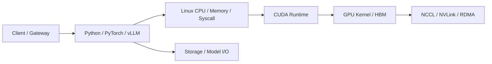

# 性能工程学习路线

性能工程不是“看到哪个指标高就调哪个参数”，而是一套可复现的证据链：

```text
定义用户问题
→ 固定工作负载与环境
→ 建立基线
→ 分层采集证据
→ 形成瓶颈假设
→ 使用更精细工具验证
→ 单变量修改
→ A/B 复测
→ 检查正确性和回归
```

对于 AI Infra，常见链路是：



不同工具回答不同问题，不能互相替代。

## 1. 模块目录

| 顺序 | 文章 | 主要问题 |
| --- | --- | --- |
| 01 | [Linux perf、strace 与火焰图](./01-Linux-perf-strace与火焰图.md) | CPU 在算什么、等什么系统调用、热点调用栈在哪里 |
| 02 | [eBPF 与 bpftrace 网络和 I/O 分析](./02-eBPF与bpftrace网络和IO分析.md) | 如何低侵入观察内核延迟分布和异常路径 |
| 03 | [Nsight Systems 端到端时间线分析](./03-Nsight-Systems端到端时间线分析.md) | CPU、CUDA、Kernel、Memcpy、NCCL 如何在时间轴上关联 |
| 04 | [Nsight Compute CUDA Kernel 分析](./04-Nsight-Compute-CUDA-Kernel分析.md) | Kernel 受计算、显存、Occupancy 还是 Warp Stall 限制 |
| 05 | [PyTorch Profiler 训练与推理分析](./05-PyTorch-Profiler训练与推理分析.md) | PyTorch Operator 如何映射到 CPU 与 CUDA 活动 |
| 06 | [LLM 压测、容量曲线与成本模型](./06-LLM压测容量曲线与成本模型.md) | 最大吞吐、SLO 容量、安全水位和单位成本如何计算 |

## 2. 工具边界

| 工具 | 观察层 | 适合回答 | 不适合直接回答 |
| --- | --- | --- | --- |
| strace | 系统调用 | 卡在哪个 syscall、错误码、调用时间 | CPU 用户态函数热点 |
| perf stat | CPU/PMU 汇总 | IPC、Cache Miss、分支、切换 | 哪个函数造成问题 |
| perf record | CPU 调用栈 | On-CPU 热点 | GPU Kernel 内部 |
| 火焰图 | 栈样本可视化 | 热路径宽度和调用关系 | 事件先后时间线 |
| eBPF/bpftrace | 内核/用户动态探针 | 延迟分布、I/O、网络、调度 | 完整 GPU 时间线 |
| Nsight Systems | 系统级 GPU 时间线 | CPU/CUDA/Kernel/NCCL 空洞和重叠 | 单 Kernel 指令级瓶颈 |
| Nsight Compute | CUDA Kernel | Roofline、Occupancy、Memory、Stall | 整个请求为什么排队 |
| PyTorch Profiler | Framework Operator | Operator、Shape、CPU/CUDA、Memory | 内核网络与系统全部细节 |
| LLM 压测 | 用户结果 | TTFT、TPOT、吞吐、SLO 容量 | 根因本身 |

## 3. 正确的下钻顺序

```text
用户 SLO / 压测曲线
  ↓
服务指标：Queue、TTFT、TPOT、KV Cache
  ↓
系统指标：CPU、内存、网络、磁盘、GPU
  ↓
Nsight Systems / perf 时间线
  ↓
热点 Operator / Kernel
  ↓
Nsight Compute / eBPF 精确验证
```

不要在不知道热点 Kernel 名称时直接用 Nsight Compute 收集全部 Kernel 的所有 Section。
Kernel Replay 和大量指标会显著改变程序执行。

## 4. 性能实验必须固定什么

### 4.1 软件 {/* #软件 */}

```text
OS / Kernel
Driver / CUDA
PyTorch / vLLM
模型 Revision
量化与 dtype
镜像 Digest
启动参数
```

### 4.2 硬件 {/* #硬件 */}

```text
CPU 型号与 NUMA
内存容量与频率
GPU 型号、数量和拓扑
PCIe/NVLink
NIC/RDMA
本地盘/共享存储
```

### 4.3 工作负载 {/* #工作负载 */}

```text
输入 Token 分布
输出 Token 分布
请求到达模型
并发
Prefix Cache 冷/热
Stream 比例
TP/PP/DP/EP
```

### 4.4 环境状态 {/* #环境状态 */}

```text
GPU 时钟、温度、功耗
节点是否共享
模型缓存冷热
CPU Governor
后台任务
网络和存储基线
```

## 5. 基线与对照组

每次实验至少包含：

```text
Baseline
Candidate
Rollback / Re-run Baseline
```

建议交替：

```text
A1 → B1 → A2 → B2
```

如果只跑 A 后跑 B，可能把温度、缓存和流量变化误认为参数收益。

结果要同时记录：

- 中位数。
- 尾部。
- 方差或置信区间。
- 错误率。
- 正确性。
- 资源和功耗。

## 6. 先观测再采样

Profiler 本身会产生开销。

推荐等级：

```text
L0 现有 Metrics/Logs/Trace
L1 低频系统采样
L2 短窗口 perf/eBPF/Nsight Systems
L3 单请求/单 Kernel 精细 Profiling
```

生产采集原则：

- 时间窗口尽量短。
- 先限制 PID、Container、GPU、Kernel。
- 不采集 Prompt、Token 或敏感内存。
- 保存工具版本、命令和采集开销。
- 使用 Canary 或隔离副本。
- 采集后确认 Probe/Session 已停止。

## 7. 三类性能问题

### 7.1 Latency {/* #latency */}

单个请求完成多快：

- TTFT。
- TPOT/ITL。
- E2E。
- P50/P95/P99。

### 7.2 Throughput {/* #throughput */}

单位时间完成多少工作：

- QPS。
- Prompt tokens/s。
- Generation tokens/s。
- Samples/s。

### 7.3 Efficiency {/* #efficiency */}

完成单位工作消耗多少资源：

- GPU 秒/请求。
- Joule/token。
- 元/百万 token。
- 有效 tokens/显存 GiB。

吞吐提升但错误率、功耗或 P99 翻倍，不一定是优化。

## 8. 模块综合实验

选一个 vLLM 服务，执行：

1. 用 `vllm bench serve` 画出到达率—TTFT/TPOT/吞吐曲线。
2. 选择接近饱和但未崩溃的点。
3. 用 `perf` 确认 API Server/Tokenizer 的 CPU 热点。
4. 用 bpftrace 检查系统调用、块 I/O 或网络异常分布。
5. 用 Nsight Systems 对齐 Python、CUDA、Kernel 和 NCCL。
6. 从时间线选择一个热点 Kernel。
7. 用 Nsight Compute 判断其计算/带宽/Occupancy/Stall。
8. 用 PyTorch Profiler 对齐 Framework Operator。
9. 修改一个参数或实现。
10. 完整复测 SLO、吞吐、正确性和成本。

## 9. 模块验收

- [ ] 能区分观测、采样、Trace 和 Profile。
- [ ] 能写出可复现的性能实验配置。
- [ ] 能使用 strace 和 perf 判断 CPU/系统调用问题。
- [ ] 能使用 bpftrace 输出延迟直方图。
- [ ] 能用 Nsight Systems 找到 GPU 时间线空洞。
- [ ] 能用 Nsight Compute 分析一个确定 Kernel。
- [ ] 能用 PyTorch Profiler 对齐 Operator 与 CUDA。
- [ ] 能画出 LLM 过载曲线并确定 SLO 容量。
- [ ] 能计算单位 token/请求成本。
- [ ] 能证明修改带来的收益而不是测量噪音。

## 10. 参考资料

- [Linux Kernel perf security](https://docs.kernel.org/admin-guide/perf-security.html)
- [bpftrace Documentation](https://bpftrace.org/docs/latest)
- [NVIDIA Nsight Systems](https://docs.nvidia.com/nsight-systems/)
- [NVIDIA Nsight Compute](https://docs.nvidia.com/nsight-compute/)
- [PyTorch Profiler](https://docs.pytorch.org/docs/stable/profiler.html)
- [vLLM CLI Benchmarks](https://docs.vllm.ai/en/stable/cli/)
