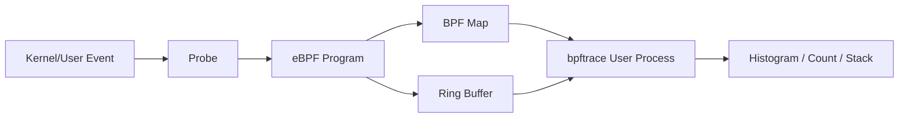

# eBPF 与 bpftrace 网络和 I/O 分析

传统指标告诉我们：

```text
磁盘 await 很高
TCP retrans 增长
系统调用变慢
```

但很难回答：

```text
哪个进程？
哪类请求大小？
延迟分布如何？
慢发生在内核哪一段？
只影响哪个容器或 Cgroup？
```

eBPF 可以在内核验证后安全执行受限程序，并通过 Probe 采集事件、在 Map 中聚合。
bpftrace 提供接近 awk/DTrace 风格的高级语言，适合快速动态追踪。

## 1. 数据路径



核心收益：

- 内核侧先过滤和聚合。
- 不必为每个事件都切换到用户态。
- 可按 PID、TID、Cgroup、端口等筛选。
- 能输出分布而不是只有平均值。

## 2. Probe 类型

| Probe | 位置 | 特点 |
| --- | --- | --- |
| tracepoint | 内核静态事件 | 接口相对稳定，优先使用 |
| rawtracepoint | 原始 Tracepoint | 开销可能更低，参数更底层 |
| kprobe/kretprobe | 内核函数入口/返回 | 灵活但依赖内核实现 |
| uprobe/uretprobe | 用户态二进制函数 | 可追踪库/应用函数 |
| USDT | 应用预埋静态探针 | 语义清楚，需要应用支持 |
| profile | 定时采样 | CPU 栈和火焰图 |
| hardware/software | PMU/软件事件 | Cache Miss、Fault 等 |

生产优先级：

```text
稳定 Tracepoint/USDT
→ 必要时 Kprobe/Uprobe
```

内核函数名和参数可能随版本变化，Kprobe 脚本不能无验证跨版本使用。

## 3. 先发现 Probe

列出 syscall：

```bash
bpftrace -l 'tracepoint:syscalls:sys_enter_*'
```

列出 block：

```bash
bpftrace -l 'tracepoint:block:*'
```

查看参数：

```bash
bpftrace -lv 'tracepoint:syscalls:sys_enter_read'
```

执行任何脚本前先用 `-l/-lv` 验证当前内核字段，不要直接复制其他发行版脚本。

## 4. bpftrace 程序结构

```text
probe /predicate/ {
  action
}
```

示例：

```bash
bpftrace -e '
tracepoint:raw_syscalls:sys_enter
{
  @[comm] = count();
}'
```

含义：

- 每次系统调用进入时触发。
- 按进程名 `comm` 聚合。
- `count()` 在 Map 中计数。

按进程名不一定唯一；精确分析应结合 PID/Cgroup。

## 5. Map 与基数

```text
@[key] = aggregation()
```

常用聚合：

- `count()`。
- `sum()`。
- `min()`/`max()`。
- `avg()`。
- `hist()`。
- `lhist()`。

高风险写法：

```text
@[pid, tid, user_id, filename, timestamp] = ...
```

Key 组合可能无限增长，消耗内核 Map 内存。

生产应：

- 使用有限维度。
- 定时打印并 `clear()`。
- 设置 Map 上限。
- 限制 PID/Cgroup。
- 避免记录请求内容。

## 6. 系统调用延迟直方图

以 `read` 为例：

```bash
bpftrace -e '
tracepoint:syscalls:sys_enter_read
{
  @start[tid] = nsecs;
}

tracepoint:syscalls:sys_exit_read
/@start[tid]/
{
  @read_us = hist((nsecs - @start[tid]) / 1000);
  delete(@start[tid]);
}'
```

为什么按 `tid` 关联：

- 同一线程在一次同步 syscall 进入到退出之间不会同时发起第二个同类 syscall。
- PID 下多个线程必须分开。

还要处理：

- 线程异常退出留下的 Key。
- 只跟踪目标进程/Cgroup。
- 异步 I/O 不完全符合一次 enter/exit 即业务完成。

## 7. 按返回值统计读取

官方 one-liner 思路：

```bash
bpftrace -e '
tracepoint:syscalls:sys_exit_read
/args.ret > 0/
{
  @[comm] = sum(args.ret);
}'
```

读取大小分布：

```bash
bpftrace -e '
tracepoint:syscalls:sys_exit_read
/args.ret >= 0/
{
  @[comm] = hist(args.ret);
}'
```

如果模型加载出现大量几十字节的小读，需要检查：

- Tokenizer/配置小文件。
- Python Import。
- 文件格式。
- mmap/page fault。
- 共享文件系统元数据。

## 8. CPU Profile

对 PID 以 99Hz 采样用户栈：

```bash
bpftrace -e '
profile:hz:99
/pid == TARGET_PID/
{
  @[ustack] = count();
}'
```

实际运行前把 `TARGET_PID` 替换为数字，且需要可用用户符号/栈回溯。

内核+用户组合：

```text
@[kstack, ustack] = count()
```

数据量和符号处理更重，应缩短窗口。

## 9. Page Fault

按进程统计：

```bash
bpftrace -e '
software:faults:1
{
  @[comm, pid] = count();
}'
```

Page Fault 多不等于一定慢：

- Minor Fault 可能很快。
- Major Fault 才通常涉及存储。
- 模型首次 mmap 时 Fault 增长可能正常。

要与：

- Fault 类型。
- 存储延迟。
- RSS/Page Cache。
- 模型加载阶段。

一起分析。

## 10. 块 I/O 分析方法

典型阶段：

```text
Application syscall
→ VFS / Filesystem
→ Block layer issue
→ Device
→ Block complete
```

需要测两类时间：

```text
Queue Time：进入块层到设备 Issue
Device Time：Issue 到 Complete
```

不同 Kernel Tracepoint 字段可能变化，先执行：

```bash
bpftrace -lv 'tracepoint:block:block_rq_issue'
bpftrace -lv 'tracepoint:block:block_rq_complete'
```

再根据当前 Kernel 的 Request 标识关联。

生产中可优先使用发行版已验证的：

```text
biolatency
biotop
biosnoop
```

等 BCC/bpftrace 工具，但必须核对工具来源、版本和字段。

### 10.1 结果判断 {/* #结果判断 */}

| 现象 | 假设 |
| --- | --- |
| Queue 高、Device 低 | 块层排队、调度、并发过高 |
| Queue 低、Device 高 | 设备/后端本身慢 |
| 小 I/O 极多 | 应用 I/O 模型或元数据问题 |
| 单进程异常 | 应用行为 |
| 全节点异常 | 设备、内核或共享资源 |

NFS/CephFS 的远端等待不一定进入本地 Block Device，需要转向网络和客户端 Tracepoint。

## 11. 网络分析方法

关键链路：

```text
Application send/recv
→ Socket
→ TCP
→ qdisc
→ Driver
→ NIC
```

关注：

- connect latency。
- accept queue。
- TCP retransmit。
- RTT。
- send/recv size。
- socket buffer。
- drop。

先发现可用 Tracepoint：

```bash
bpftrace -l 'tracepoint:tcp:*'
bpftrace -l 'tracepoint:sock:*'
bpftrace -l 'tracepoint:net:*'
```

字段随内核版本核对：

```bash
bpftrace -lv 'tracepoint:tcp:tcp_retransmit_skb'
```

如果使用成熟工具，可关注：

```text
tcpconnect
tcplife
tcpretrans
tcpdrop
tcprtt
```

但工具必须与 Kernel/BTF/发行版匹配。

## 12. 调度延迟与 Off-CPU

请求慢但 CPU 不高时，线程可能在等待调度。

需要区分：

```text
Runnable but not running
Sleeping on I/O/lock
CPU throttled by cgroup
Blocked in kernel
```

常用事件：

```text
sched:sched_wakeup
sched:sched_switch
sched:sched_process_exit
```

建立 Off-CPU 栈时，要在线程离开 CPU 时保存栈，在重新运行时累积时间。

这是较复杂脚本，优先使用版本匹配、经过验证的 `offcputime`/`runqlat` 工具，不要在生产
临时拼接未测试脚本。

## 13. Cgroup 与容器过滤

同一节点可能运行多个 Pod。只按 `comm="python"` 会混合所有容器。

可按：

- Host PID/TID。
- Cgroup ID。
- Mount/Network Namespace。
- Pod Cgroup 路径。

过滤前先确认节点使用：

```text
Cgroup v1 or v2
systemd cgroup driver
containerd/CRI-O
```

bpftrace 支持与 Cgroup 相关的内建值和函数，但可用方式取决于版本。使用当前官方文档和
`bpftrace --info` 核对。

## 14. 在 Kubernetes 中部署的风险

eBPF Agent 常需要：

- BPF 相关 Capability。
- 读取 `/sys/kernel/btf`。
- 访问 TraceFS。
- Host PID/Cgroup 信息。

风险：

- 可观察其他租户进程。
- Map/Probe 配置错误影响节点。
- 高事件率导致 CPU 或 Ring Buffer 压力。
- 内核版本/BTF 不兼容。

控制：

- 专用诊断 DaemonSet，默认不运行高开销脚本。
- RBAC 和节点范围限制。
- 脚本白名单。
- 最大持续时间。
- Map/事件速率上限。
- 审计谁在何节点运行了什么 Probe。
- Kill Switch。

## 15. 丢事件与测量开销

Ring Buffer 满、用户态处理跟不上时可能丢事件。

需要记录：

- Lost Events。
- Map Size。
- Probe Hit Rate。
- bpftrace CPU/Memory。
- 目标服务吞吐变化。

优化顺序：

```text
增加内核侧过滤
→ 改逐事件输出为 Map 聚合
→ 降低采样率
→ 缩小 PID/Cgroup
→ 缩短时间
```

`printf` 每个事件通常比 `count/hist` 聚合更昂贵。

## 16. AI Infra 场景

### 16.1 场景 1：模型加载慢 {/* #场景-1模型加载慢 */}

顺序：

1. 应用分段计时。
2. `read` size/latency。
3. Page Fault。
4. NFS/TCP 或 Block I/O。
5. CPU 反序列化。
6. H2D Copy。

### 16.2 场景 2：TTFT 偶发尖峰 {/* #场景-2ttft-偶发尖峰 */}

检查：

- API Worker run queue latency。
- futex/Off-CPU。
- TCP retransmit。
- Major Fault。
- CPU Cgroup throttling。

### 16.3 场景 3：NCCL Timeout {/* #场景-3nccl-timeout */}

eBPF 可帮助看 Host TCP/RDMA Control Path，但 GPU Collective、RDMA NIC 和交换机还需要：

- Nsight Systems。
- NCCL 日志。
- `rdma`/IB 计数器。
- NIC/交换机 Telemetry。

eBPF 不是所有网络问题的单一答案。

## 17. 一个安全脚本模板

```bpftrace
BEGIN
{
  printf("Tracing for a bounded diagnostic window...\n");
}

tracepoint:syscalls:sys_enter_read
/pid == $1/
{
  @start[tid] = nsecs;
}

tracepoint:syscalls:sys_exit_read
/pid == $1 && @start[tid]/
{
  @read_latency_us = hist((nsecs - @start[tid]) / 1000);
  delete(@start[tid]);
}

interval:s:10
{
  print(@read_latency_us);
  clear(@read_latency_us);
}

END
{
  clear(@start);
  clear(@read_latency_us);
}
```

运行：

```bash
bpftrace read-latency.bt <PID>
```

生产前先在匹配内核的实验节点验证语法、字段、开销和退出清理。

## 18. 常见错误

### 18.1 直接复制 Kprobe 地址/参数 {/* #直接复制-kprobe-地址参数 */}

内核升级后函数可能内联、改名或参数变化。

### 18.2 每个事件都 printf {/* #每个事件都-printf */}

高频路径可能产生巨大开销和丢事件。

### 18.3 Map Key 无界 {/* #map-key-无界 */}

按文件名、地址、TID 永久累积会耗尽 Map。

### 18.4 忽略容器过滤 {/* #忽略容器过滤 */}

把整个节点所有 Python/网络事件归因给目标 Pod。

### 18.5 平均值代替分布 {/* #平均值代替分布 */}

网络和 I/O 常由 P99/P999 尾部决定用户体验。

### 18.6 Probe 看到相关性就断言根因 {/* #probe-看到相关性就断言根因 */}

还需要与 SLO 时间线、应用 Trace 和对照实验验证。

## 19. 实验

1. 列出本机 syscall、block、tcp、sched Tracepoint。
2. 检查字段而不是复制示例。
3. 输出 read size 和 latency Histogram。
4. 对目标 PID 采样 99Hz 用户栈。
5. 构造缓存冷读与热读，比较 Fault/I/O。
6. 构造网络重传实验环境，观察 TCP Tracepoint。
7. 对比逐事件 printf 与 Map 聚合的开销。
8. 在容器节点验证 PID 与 Cgroup 过滤。

## 20. 验收清单

- [ ] 能解释 Probe、eBPF Program、Map 和 Ring Buffer。
- [ ] 能选择 Tracepoint/Kprobe/Uprobe。
- [ ] 能先发现 Probe 和参数。
- [ ] 能写 enter/exit 延迟 Histogram。
- [ ] 能控制 Map 基数和清理。
- [ ] 能区分本地 Block I/O 与远端文件系统。
- [ ] 能分析调度、网络和 Page Fault 的方向。
- [ ] 能按 PID/Cgroup 缩小容器范围。
- [ ] 能监控 Lost Event 和采集开销。
- [ ] 能说明 eBPF 的权限与多租户风险。

## 21. 参考资料

- [bpftrace Documentation 0.24](https://bpftrace.org/docs/release_024/docs)
- [bpftrace Language](https://bpftrace.org/docs/release_024/language)
- [bpftrace One-Liner Tutorial](https://bpftrace.org/tutorial-one-liners)
- [Linux Kernel BPF Documentation](https://docs.kernel.org/bpf/)

下一篇进入 GPU 时间线，使用 Nsight Systems 把 CPU、CUDA API、Memcpy、Kernel、NVTX
与 NCCL 放到同一个时间轴上。
