# Nsight Systems 端到端时间线分析

Nsight Systems 回答的是：

> 在一段时间内，CPU、CUDA Runtime、GPU Kernel、Memcpy 和通信按什么顺序发生？哪里有
> 空洞、等待或没有重叠？

它不负责回答一个 CUDA Kernel 内部为什么只有 40% 峰值带宽。后者使用 Nsight Compute。

```text
Nsight Systems：先找到“哪个阶段/哪个 Kernel/哪段等待”
Nsight Compute：再分析“这个 Kernel 内部为什么慢”
```

---

## 1. 时间线包含什么

```mermaid
gantt
    title 简化的推理 Step
    dateFormat X
    axisFormat %L
    section CPU
    Scheduler             :0, 8
    CUDA Launch           :8, 12
    Output Process        :35, 42
    section GPU Stream 0
    H2D                   :12, 15
    Attention Kernel      :15, 25
    MLP Kernel            :25, 35
    section NCCL
    AllReduce             :22, 29
```



可观察：

- CPU 线程运行/睡眠。
- CUDA API 调用。
- CUDA Kernel。
- H2D/D2H/D2D Memcpy。
- CUDA Stream。
- NVTX Range。
- NCCL/MPI 等通信。
- OS Runtime/线程调度。
- GPU Metrics（受平台和权限限制）。

---

## 2. 采集前准备

记录：

```bash
nsys --version
nvidia-smi
python -c "import torch; print(torch.__version__)"
```

保存：

- Nsight Systems 版本。
- Driver/CUDA。
- GPU 型号。
- 应用镜像 Digest。
- 模型 Revision。
- 启动参数。
- 采集命令。
- 请求负载。

Nsight 工具版本与 Driver/GPU 支持矩阵应参考目标版本官方文档。

---

## 3. 第一次采集

对一个可控程序：

```bash
nsys profile \
  --trace=cuda,nvtx \
  --duration=20 \
  --sample=none \
  --cpuctxsw=none \
  --output=llm-baseline \
  <application> <args>
```

生成：

```text
llm-baseline.nsys-rep
```

该命令强调 CUDA/NVTX，关闭 CPU Sampling 和 Context Switch 以降低数据量。需要 CPU
线程分析时再开启相关采集。

### 重要：Duration 后进程行为

当前 Nsight Systems CLI 对“由它启动的应用”在采集结束后的处理受 `--kill` 等选项控制。
分析在线服务前必须查：

```bash
nsys profile --help
```

不要因为设置 `--duration` 意外终止生产服务。优先在隔离副本、测试进程或受控 Canary
采集。

---

## 4. 默认分析与低开销 Trace

默认：

```bash
nsys profile <application> <args>
```

会根据平台采集默认 API、CPU Sampling 和调度信息。

有限 Trace：

```bash
nsys profile \
  --trace=cuda,nvtx \
  --sample=none \
  --cpuctxsw=none \
  --duration=20 \
  --output=limited-trace \
  <application> <args>
```

选择原则：

| 目的 | 采集 |
| --- | --- |
| 只看 CUDA 时间线 | cuda,nvtx |
| CPU 为什么没有 Launch | CPU Sampling/Context Switch |
| 多卡通信 | cuda,nvtx,nccl（按版本支持） |
| MPI 应用 | mpi/NVTX wrapper（按支持） |
| 系统 I/O/调度 | OS Runtime/FTrace，权限和开销更高 |

---

## 5. NVTX：给时间线加入业务语义

没有 NVTX 时，时间线只有：

```text
cudaLaunchKernel
ncclKernel_AllReduce
fused_attention...
```

加入 NVTX 后可以看到：

```text
request
  ├─ tokenize
  ├─ scheduler
  ├─ prefill
  ├─ decode_step
  └─ output
```

PyTorch 示例：

```python
import torch

torch.cuda.nvtx.range_push("prefill")
try:
    output = model(input_ids)
finally:
    torch.cuda.nvtx.range_pop()
```

或使用 context manager 封装。

### NVTX 命名

推荐低基数：

```text
phase=prefill
phase=decode
op=attention
op=allreduce
batch_class=small
```

不要把 Prompt、用户信息放入 NVTX。

Request ID 可用于短期隔离采集，但会产生大量唯一字符串，应限制采集范围和敏感性。

---

## 6. 用 NVTX 控制采集窗口

官方 CLI 支持按 NVTX Capture Range 开始/停止：

```bash
nsys profile \
  --capture-range=nvtx \
  --capture-range-end=stop \
  --nvtx-capture=profiler@service \
  --output=nvtx-window \
  <application> <args>
```

不同版本可能使用短选项或参数名差异，执行前用 `nsys profile --help` 核对。

这种方式适合：

- 跳过模型加载。
- 跳过 Warmup。
- 只采一个压测阶段。
- 控制报告大小。

官方示例也可使用：

```text
-c nvtx -w true -p MESSAGE@DOMAIN
```

具体采用目标版本展示的形式。

---

## 7. 多进程 vLLM

典型进程：

```text
API Server
EngineCore
Worker Rank 0
Worker Rank 1
...
```

采集需要覆盖子进程：

- 由 `nsys profile` 启动整个进程树。
- 使用目标版本支持的 child-process/target-process 选项。
- 为 Rank 设置可识别的进程名/NVTX Domain。

如果只采 API Server，会看到 HTTP/CPU，却看不到 Worker GPU Kernel。

分析前确认每个 CUDA Context 属于哪个：

```text
PID
Rank
GPU UUID
TP/PP/DP/EP Group
```

---

## 8. GUI 时间线阅读顺序

### 第一步：确定业务窗口

通过：

- NVTX。
- 请求时间。
- 压测 Phase。
- CUDA Context。

缩小到 1～10 个代表性 Iteration。

### 第二步：看 GPU 是否有空洞

```text
GPU Busy ━━━━━━━     ━━━━━━━
                gap
```

空洞可能来自：

- CPU 没有及时 Launch。
- Scheduler。
- Tokenization。
- 同步 API。
- NCCL 等待。
- 数据准备。

### 第三步：沿空洞向上找 CPU

检查空洞之前：

- 最后一个 CUDA API。
- CPU Thread 是否运行。
- 是否 `cudaDeviceSynchronize`。
- 是否等待 Future/Queue/Futex。
- 是否发生 Context Switch。

### 第四步：看 Stream 是否重叠

- Compute 与 Memcpy 是否重叠。
- 多 Stream 是否实际并发。
- NCCL 是否与可重叠计算同时进行。
- 不必要的 Default Stream 同步。

### 第五步：找到热点 Kernel

按：

- 总时间。
- 调用次数。
- 单次时间。
- 与 SLO 阶段的对应关系。

选择下一步 Nsight Compute 目标。

---

## 9. 常见模式：CPU Launch Gap

时间线：

```text
CPU:  work -- gap -- cudaLaunch -- gap -- cudaLaunch
GPU:       idle        kernel      idle
```

可能原因：

- Python 调度/输出处理。
- CPU 单线程。
- GIL/锁。
- Tokenizer。
- Kernel Launch 数量过多。
- CPU 被 Cgroup Throttle。

验证：

- CPU Sampling 栈。
- perf 火焰图。
- `sched`/Off-CPU。
- 增大 Batch 后 Kernel 数是否减少。

---

## 10. 常见模式：同步阻塞

```text
CPU: cudaLaunch → cudaDeviceSynchronize(wait)
GPU: kernel ━━━━━━━━━━━━━━━━━━━━━━━━━━━
```

同步有时是业务需要，但过多同步会破坏 Pipeline。

常见来源：

- `.item()` 把 GPU 值取回 CPU。
- 同步日志/检查。
- CPU 立即消费 GPU 结果。
- 错误的 Stream/Event 使用。
- Profiler/Debug 配置。

不能简单删除同步；需要保证依赖和正确性。

---

## 11. 常见模式：大量小 Kernel

```text
K1 K2 K3 K4 K5 K6 K7 ...
```

如果 Kernel 单次极短，Launch/调度开销占比上升。

方向：

- Kernel Fusion。
- CUDA Graph。
- 增大 Batch。
- 使用优化 Attention/MLP Kernel。
- 减少 Python/Framework Dispatch。

需要用 Nsight Compute 验证 Kernel 本身和 Launch 配置。

---

## 12. 常见模式：Memcpy 无法重叠

理想：

```text
Compute: [Kernel A][Kernel B]
Copy:       [H2D]   [D2H]
```

实际串行：

```text
[H2D][Kernel A][D2H][Kernel B]
```

检查：

- Host Memory 是否 Pinned。
- Copy 是否异步。
- Stream 和依赖 Event。
- 数据是否每 Step 重复搬运。
- Tensor 是否在错误设备。
- H2D 大小与频率。

---

## 13. 常见模式：NCCL 等待

多 GPU 时间线：

```text
Rank 0: Compute ━━━ AllReduce ━━━ Compute
Rank 1: Compute ━━━━━━━ AllReduce ━ Compute
```

Rank 0 先到 Collective 后等待 Rank 1。

真正根因可能在 Rank 1 的：

- GPU 降频。
- Kernel 更慢。
- CPU Launch 延迟。
- PCIe/NVLink/NIC。
- 输入/Batch 不一致。

不要只优化 NCCL；先找最晚到达 Rank。

---

## 14. Prefill/Decode 时间线

### Prefill

- 大 GEMM。
- Attention。
- KV 写入。
- TP Collective。

### Decode

- 大量重复小 Step。
- 每 Step 多个 Kernel/Collective。
- 单次 Launch/通信延迟更敏感。

混合批次要用 NVTX 标注：

```text
scheduled_prefill_tokens
scheduled_decode_tokens
running_sequences
```

避免把 Prefill 长 Kernel 误认为 Decode 退化。

---

## 15. CLI 统计

```bash
nsys stats llm-baseline.nsys-rep
```

常见报告：

```bash
nsys stats \
  --report cuda_api_sum \
  --report cuda_gpu_kern_sum \
  llm-baseline.nsys-rep
```

查看当前版本报告：

```bash
nsys stats --help-reports
```

可导出 CSV/SQLite 进行 A/B 对比。不要只凭 GUI 截图比较。

### 统计重点

- CUDA API 总时间/调用次数。
- Kernel 总时间/平均/中位/最大。
- Memcpy 时间和字节。
- NVTX Range 总时间。
- OS Runtime 等待。

---

## 16. A/B 对比

比较前必须保证：

- 相同模型、硬件、请求。
- 相同 Warmup。
- 相同采集选项。
- 相同 Kernel 名字映射。

对比：

```text
GPU active ratio
CPU launch gap
Kernel count
Kernel total duration
Memcpy overlap
NCCL overlap/wait
NVTX phase duration
```

Profiler 下的绝对延迟与无 Profiler 可能不同，最终收益仍要用无采集压测验证。

---

## 17. Kubernetes 采集

建议流程：

1. 建立专用 Canary Pod。
2. 固定到目标 GPU 节点。
3. 挂载可写报告目录。
4. 确保 Nsight CLI、Driver 与权限匹配。
5. 只对 Canary 发送可控流量。
6. 短窗口采集。
7. 导出报告后退出 Profiler Pod。

避免：

- 对全部 Replica 同时采集。
- 把报告写满节点系统盘。
- 用特权容器长期运行。
- 在多租户报告中暴露进程和路径。

---

## 18. 常见错误

### 一上来采全部 Trace

报告巨大、开销高、重点被淹没。

### 只看 GPU 利用率轨道

看不到是哪一个 Kernel、Memcpy 或 Collective。

### 把时间线空洞等于 GPU 问题

空洞常由 CPU/Scheduler/同步导致。

### 用 Systems 判断 Kernel 内部瓶颈

Systems 给出时长和顺序，不给完整指令级原因。

### 忽略多 Rank 最慢者

Collective 的等待可能来自另一张 GPU。

### 采集窗口包含加载和 Warmup

启动行为掩盖稳态。

---

## 19. 实验

1. 对 PyTorch 小程序采 20 秒 CUDA/NVTX。
2. 用 NVTX 标记 Warmup、Prefill、Decode。
3. 故意加入 `.item()`，观察同步。
4. 故意每步 H2D Copy，观察 Memcpy 串行。
5. 比较单卡与 TP=2 的 Collective。
6. 用 `nsys stats` 导出 Kernel/API 汇总。
7. 选出一个总时间最高且与目标阶段相关的 Kernel。
8. 在无 Profiler 条件复测基线，记录采集开销。

## 20. 验收清单

- [ ] 能区分 Nsight Systems 与 Compute。
- [ ] 能控制 Trace、时间和进程范围。
- [ ] 能用 NVTX 标记业务阶段。
- [ ] 能从 GPU 空洞回溯到 CPU。
- [ ] 能识别同步、小 Kernel、Memcpy 串行。
- [ ] 能比较多 Rank 到达 Collective 的时间。
- [ ] 能使用 `nsys stats` 生成可比较结果。
- [ ] 能从时间线选出 Nsight Compute 目标 Kernel。
- [ ] 能安全地在 Canary/Kubernetes 采集。

## 21. 官方资料

- [Nsight Systems User Guide](https://docs.nvidia.com/nsight-systems/UserGuide/)
- [Nsight Systems Documentation](https://docs.nvidia.com/nsight-systems/)

下一篇使用 Nsight Compute 分析选中的 CUDA Kernel，理解 Roofline、Occupancy、Memory
Workload 和 Warp Stall。
