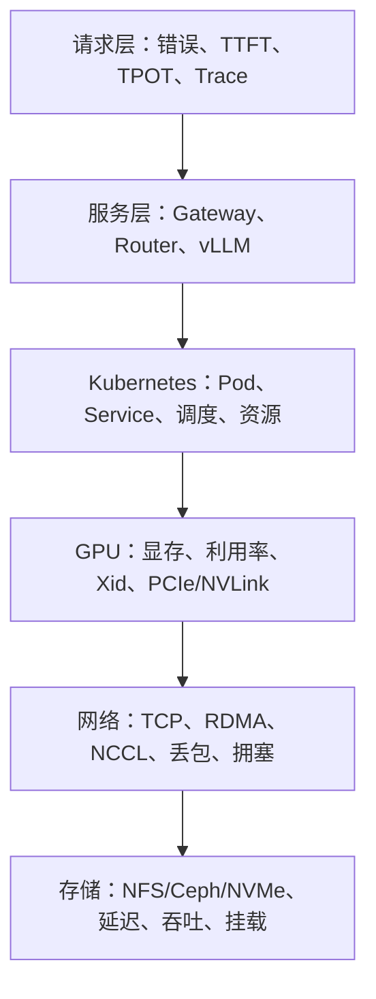
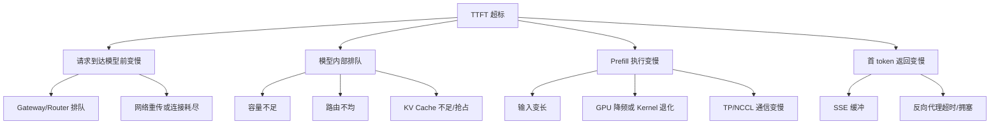

# AI 平台事件响应、证据链与 RCA

事件响应的技术目标不是“尽快执行几个常用命令”，而是同时完成三件事：

1. **止损**：缩短用户受影响时间。
2. **保留证据**：避免重启、漂移和日志轮转抹掉根因。
3. **验证因果**：证明哪个变化经过什么机制导致了什么症状。

AI 平台比普通 Web 服务多了 GPU、显存、NCCL/RDMA、模型文件和推理调度器等层次。
如果没有统一证据链，很容易在 Kubernetes、网络、存储和算法团队之间反复转交。

---

## 1. 从症状出发，不从组件告警出发

优先级最高的入口是用户症状：

```text
可用性下降
TTFT 超标
TPOT 抖动
流式响应中断
冷启动过慢
训练任务无进展
```

组件指标是定位证据，不是事件影响本身：

| 组件现象 | 可能的用户影响 | 也可能没有影响 |
| --- | --- | --- |
| GPU 利用率 100% | 排队、TTFT 变高 | 正常满载运行 |
| KV Cache 95% | 抢占、请求等待 | 工作集仍然可容纳 |
| 网卡丢包 | NCCL 重传、TPOT 抖动 | 非业务接口丢包 |
| Ceph slow ops | 模型加载变慢 | 在线实例已完全缓存 |
| Pod 重启 | 请求失败 | 已被优雅摘流且容量充足 |

事件应以 SLO、业务流量和受影响范围定级，再使用组件证据定位。

---

## 2. 事件开始后的前 15 分钟

### 2.1 第 0～3 分钟：确认告警可信

检查：

- SLO 长短窗口是否同时超阈值。
- valid events 分母是否正常。
- 指标采集是否中断。
- 真实用户、合成探测和日志是否互相印证。
- 受影响的是单模型、单租户、单区域还是整个平台。

不要因为某个 Grafana 图为空就直接判断服务没有流量。

### 2.2 第 3～8 分钟：冻结变量并建立时间线

记录：

```text
T0 首个异常事件
T1 SLO 开始偏离
T2 首次告警
T3 人员确认
T4 第一次止损动作
T5 指标恢复
```

同时查询 T0 前后发生的变化：

- 模型 revision 发布。
- Gateway、vLLM、驱动或 CUDA 镜像更新。
- HPA/自定义扩缩容动作。
- GPU 节点加入、下线或重启。
- NetworkPolicy、路由、MTU、PFC/ECN 变更。
- StorageClass、挂载参数、Ceph/NFS 维护。
- 配额、优先级和调度规则变更。

### 2.3 第 8～15 分钟：选择可逆止损动作

止损顺序通常是：

```text
停止继续扩大影响
  → 回滚最近变更
  → 摘除异常实例或故障域
  → 切换到健康容量
  → 对非关键流量限流
  → 降低上下文/输出上限或关闭高成本特性
```

每个动作都要记录执行时间和预期信号，例如：

```text
动作：将 canary 权重从 10% 调为 0
预期：2 分钟内 canary 请求速率归零，5 分钟 SLO 错误率下降
回滚：恢复原权重
```

如果动作后关键指标没有按预期变化，这条假设就需要降权。

---

## 3. AI 平台六层证据链



排查不是固定从上到下执行全部命令，而是先用请求层确定症状，再沿证据指向下钻。

---

## 4. 请求层证据

### 必采数据

- SLO 的 good、bad、valid event 数。
- 错误按 `result_reason` 分类。
- TTFT、TPOT、E2E 直方图。
- 请求到达率、并发和排队长度。
- 受影响请求的 Trace ID。
- 模型、revision、区域、实例和 workload class。

PromQL 示例：

```promql
sum by (result_reason) (
  rate(llm_gateway_requests_total{
    slo_eligible="true"
  }[5m])
)
```

```promql
histogram_quantile(
  0.99,
  sum by (le, model_family) (
    rate(llm_request_ttft_seconds_bucket[5m])
  )
)
```

```promql
max by (model_family, pod) (
  vllm:num_requests_waiting
)
```

### 关键判断

| 现象 | 下一步 |
| --- | --- |
| 5xx 上升但 TTFT 正常 | 查发布、实例错误、依赖失败 |
| TTFT 上升且 waiting 增长 | 查容量、Prefill、KV Cache、路由不均 |
| TPOT 上升但 TTFT 正常 | 查 Decode 调度、GPU 降频、通信 |
| 只有冷启动慢 | 查存储、镜像、模型下载和反序列化 |
| 单 Pod 异常 | 比较同模型健康 Pod，而不是看全局平均 |

---

## 5. 服务与 Kubernetes 证据

### 5.1 保存资源快照

```bash
kubectl get deploy,rs,pod,svc,endpointslice -n ai-serving -o wide
kubectl get events -n ai-serving --sort-by=.metadata.creationTimestamp
kubectl describe pod -n ai-serving <pod-name>
kubectl logs -n ai-serving <pod-name> --all-containers --since=2h --timestamps
kubectl logs -n ai-serving <pod-name> --all-containers --previous --timestamps
```

`--previous` 只在容器重启且旧日志仍可用时有效，应尽早采集。

### 5.2 检查发布差异

```bash
kubectl rollout history deployment/<deployment-name> -n ai-serving
kubectl get deployment/<deployment-name> -n ai-serving -o yaml
kubectl get replicaset -n ai-serving -l app=<app-name> -o wide
```

需要保存而不是只看：

- Image digest，不只看可变 tag。
- ConfigMap/Secret 版本或内容哈希。
- 启动参数。
- GPU resource、CPU/memory requests 与 limits。
- nodeSelector、Affinity、Toleration、TopologySpreadConstraints。
- readiness、liveness、startupProbe。
- terminationGracePeriod 与 preStop。

### 5.3 检查流量是否打到未就绪实例

```bash
kubectl get endpointslice -n ai-serving \
  -l kubernetes.io/service-name=<service-name> -o yaml
```

关注 Endpoint 的：

```text
conditions.ready
conditions.serving
conditions.terminating
nodeName
zone
```

滚动发布期间的 5xx 经常不是模型推理错误，而是就绪、摘流和优雅退出时间没有对齐。

---

## 6. GPU 与显存证据

### 6.1 主机快照

```bash
nvidia-smi
nvidia-smi -q
nvidia-smi topo -m
nvidia-smi dmon -s pucvmet -c 10
```

至少记录：

- GPU 型号、UUID、驱动版本。
- 温度、功耗、时钟、P-State。
- GPU 和显存利用率。
- ECC、retired pages、Xid。
- PCIe link generation/width。
- GPU、NIC、CPU NUMA 拓扑。

### 6.2 关键关联

| 推理现象 | GPU 证据 |
| --- | --- |
| waiting 增长、GPU 利用率低 | 路由、CPU Tokenizer、数据搬运或进程卡死 |
| waiting 增长、GPU 利用率高 | 容量不足或批处理策略不合适 |
| TPOT 周期性抖动 | 时钟、功耗、抢占、通信、GC/CPU 干扰 |
| 突发请求失败 | Xid、OOM、容器重启 |
| 单卡慢 | PCIe 降链、热降频、ECC 或拓扑问题 |

显存占用高不一定异常。vLLM 会主动预留 KV Cache；要结合 waiting、preemption、
KV Cache 使用率和请求长度判断。

---

## 7. 网络与通信证据

### 7.1 TCP/IP 服务链路

```bash
ss -s
ss -tinp
ip -s link
ethtool -S <interface>
tc -s qdisc show dev <interface>
```

关注：

- retransmit、timeout、listen drop。
- NIC rx/tx drop、error、missed。
- qdisc drop 和 backlog。
- MTU 是否端到端一致。
- 多路径是否出现单路径拥塞。

### 7.2 RDMA/RoCE/InfiniBand

```bash
rdma link show
ibstat
ibv_devinfo
perfquery
```

关注：

- Port state 与 physical state。
- link layer、速率和宽度。
- SymbolError、LinkDowned、PortRcvErrors。
- PFC pause、ECN/CNP 和拥塞计数。
- GID、VLAN、MTU、路由配置。

### 7.3 NCCL

保留 NCCL 日志时要带时间和拓扑信息：

```text
NCCL_DEBUG=INFO
NCCL_DEBUG_SUBSYS=INIT,NET,GRAPH,COLL
NCCL_DEBUG_FILE=/var/log/nccl.%h.%p.log
```

生产环境长期启用详细 Debug 可能产生大量日志，应在受控时间窗采集。

---

## 8. 存储与模型加载证据

### 8.1 主机 I/O

```bash
iostat -xz 1 10
pidstat -d 1 10
mount
findmnt
```

关注：

- `await`、队列深度、吞吐和 IOPS。
- 读放大和大量小文件。
- 页缓存命中与内存回收。
- NFS/CephFS 挂载参数。
- 模型文件是否来自本地缓存。

### 8.2 NFS

```bash
nfsstat -c
nfsiostat 1 10
mountstats
```

关注 RPC retrans、平均 RTT、执行时间和不同操作类型。

### 8.3 Ceph

```bash
ceph -s
ceph health detail
ceph osd perf
ceph pg stat
ceph tell osd.* dump_historic_ops
```

生产执行前确认 Ceph 命令版本和权限；优先使用只读查询。

### 8.4 冷启动分段计时

不要只记录“Pod 启动用了 8 分钟”，应拆成：

```text
调度等待
→ 镜像拉取
→ PVC/CSI 挂载
→ 模型文件读取或下载
→ 反序列化
→ H2D 拷贝
→ KV Cache 初始化
→ CUDA Graph/Warmup
→ readiness 成功
```

只有分段计时后，才能判断问题属于调度、网络、存储、CPU 还是 GPU。

---

## 9. 标准事件证据包

建议每次事件生成不可变目录：

```text
incident-20260807-llm-ttft/
  00-metadata.yaml
  01-timeline.md
  02-slo/
    availability.json
    ttft.json
    traffic.json
  03-kubernetes/
    pods.yaml
    events.txt
    endpointslices.yaml
    rollout-history.txt
  04-application/
    gateway.log
    model-server.log
    traces.json
  05-gpu/
    nvidia-smi.txt
    nvidia-smi-q.txt
    topology.txt
  06-network/
    ip-link.txt
    ethtool-stats.txt
    rdma-link.txt
  07-storage/
    iostat.txt
    mountstats.txt
    ceph-health.txt
  08-changes/
    deployment-before.yaml
    deployment-after.yaml
  checksums.sha256
```

`00-metadata.yaml` 至少记录：

```yaml
incident_id: INC-2026-0807-001
start_time: "2026-08-07T10:12:00+08:00"
collection_time: "2026-08-07T10:24:00+08:00"
cluster: prod-ai-east
region: cn-east-1
namespace: ai-serving
service: llm-chat
model_revision: llama-70b-r42
collector: oncall-user
```

证据包必须脱敏；不得收集 prompt、token、Secret、完整用户身份等敏感数据。

---

## 10. 从时间相关走向因果关系

“发布后出现故障”只是相关性。完整因果链应包含：

```text
变化
→ 直接机制
→ 中间技术信号
→ 用户症状
```

示例：

```text
将 max_num_batched_tokens 从 8192 调到 32768
→ 长 Prefill 批次占用 GPU 时间更久
→ waiting 增长，短请求排队
→ TTFT P99 从 1.2s 升到 5.8s
→ TTFT SLO 快速燃烧
```

这条链需要四类证据：

1. 配置 Diff 证明变化存在。
2. 调度/Profiler 数据证明机制发生。
3. 指标时间线证明中间信号与症状同步。
4. 回滚或受控复现实验证明反事实成立。

---

## 11. 故障树分析

以“TTFT 超标”为顶层事件：



每个叶子节点都要有“支持证据”和“反对证据”。例如：

| 假设 | 支持证据 | 反对证据 | 状态 |
| --- | --- | --- | --- |
| 容量不足 | waiting、并发和 GPU busy 同升 | 扩容后应恢复 | 待验证 |
| 存储变慢 | 仅冷启动实例异常 | 在线实例 TTFT 也变慢 | 降权 |
| 路由不均 | 单 Pod waiting 远高于同组 | 哈希规则显示倾斜 | 高可信 |

---

## 12. RCA 文档结构

一份技术 RCA 至少包括：

1. **影响**：时间、范围、请求数、SLO 和用户症状。
2. **检测**：由哪个 SLI 发现，是否存在检测延迟。
3. **时间线**：只写带时间戳的事实与动作。
4. **技术根因**：完整因果链。
5. **促成因素**：让影响扩大或恢复变慢的条件。
6. **止损与恢复**：每个动作及验证信号。
7. **为什么防线没有拦住**：测试、发布门禁、限流、告警、回滚。
8. **改进项**：代码、配置、观测、容量和自动化。
9. **验证计划**：如何证明改进有效。

### 根因、触发因素和促成因素

不要把三者混在一起：

```text
触发因素：发布了新批处理参数。
技术根因：参数使 Prefill 批次过大，调度器长期占用执行槽位。
促成因素：没有 TTFT 发布门禁；路由器不能感知实例队列；回滚需人工。
```

---

## 13. 改进项必须可验证

不合格：

```text
加强监控。
提高稳定性。
后续注意配置。
```

合格：

```text
在发布流水线对 short/medium/long 三类请求执行 15 分钟压测；
若 Canary TTFT P99 比 Stable 退化超过 15%，自动阻止权重提升。
Owner: inference-platform
Deadline: 2026-08-21
Evidence: pipeline run + Prometheus query + rollback test
```

改进项类型建议覆盖：

| 类型 | 示例 |
| --- | --- |
| 消除根因 | 修复调度器公平性 |
| 限制影响 | 单实例队列上限、熔断、故障域隔离 |
| 加快检测 | 新增 TTFT SLO 和 missing-data 告警 |
| 加快恢复 | 自动回滚、预热备用容量 |
| 增强证据 | Trace 关联 model revision 和 Pod UID |

---

## 14. 故障演练

在隔离环境至少演练：

1. Canary 返回 5xx。
2. 单个推理 Pod 队列卡死。
3. GPU Xid 导致 Worker 退出。
4. RoCE 丢包导致多卡推理通信变慢。
5. NFS/Ceph 延迟导致冷启动超时。
6. 指标采集链路中断。

每次演练验收：

- SLO 是否按预期触发。
- 证据包是否在日志轮转前完成。
- 是否能在时间线中区分事实和假设。
- 止损动作是否有明确验证与回滚。
- RCA 是否能构造完整因果链。

## 15. 参考资料

- [Google SRE Workbook：Incident Response](https://sre.google/workbook/incident-response/)
- [Google SRE Book：Postmortem Culture](https://sre.google/sre-book/postmortem-culture/)
- [Kubernetes：Debug Pods](https://kubernetes.io/docs/tasks/debug/debug-application/debug-pods/)

下一篇把事件中反复发生的证据采集、诊断和处置步骤转化为安全自动化。
