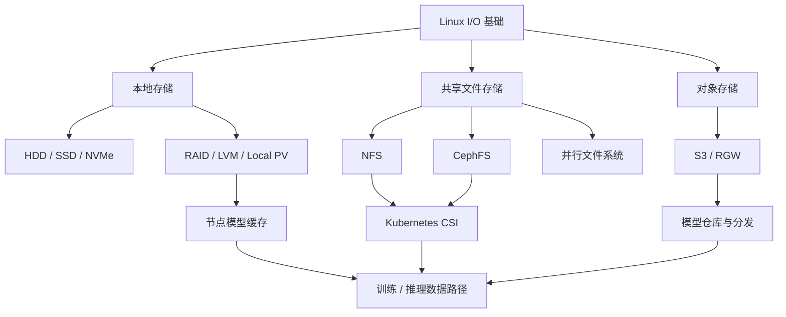

# 存储技术学习路线

存储不是某一个产品。完整的存储模块应同时回答：

- 应用使用的是块、文件还是对象接口？
- 数据经过页缓存还是 Direct I/O？
- 数据位于本地 NVMe、NFS、Ceph 还是对象存储？
- Kubernetes 如何完成供应、挂载和回收？
- 多个 GPU 节点并发读模型时，瓶颈在哪里？
- 模型为什么已经下载完成，GPU 仍然迟迟不能 Ready？

本模块不预设“Ceph 一定优于 NFS”。先学习接口语义和 I/O 路径，再按业务选择实现。

---

## 一、模块结构



### 存储命令参考库

- [存储命令参考库：从块设备到 NFS、Ceph 与 S3](./commands/00-存储命令参考库学习路线.md)
- 已完成 28 篇命令文章，按“块设备与挂载 → 文件系统与容量 → 性能与介质 → LVM/RAID → NFS/RPC → Ceph → S3”学习。
- 每篇都包含对象模型、版本和参数族、输出判读、安全边界、生产排障与实验；危险的修复、格式化、阵列、对象删除和同步操作单独标记。

---

## 二、第一阶段：存储与 Linux I/O 基础

需要掌握：

1. 块、文件、对象三种接口的差异。
2. VFS、文件系统、块层、驱动和设备的调用关系。
3. 页缓存、预读、回写和脏页。
4. Buffered I/O、Direct I/O、mmap、AIO、io_uring。
5. IOPS、吞吐、延迟、队列深度和并发之间的关系。
6. fsync、close、写入成功和持久化语义。

### 已有文章

| 序号 | 文章 | 实验 |
| --- | --- | --- |
| 01 | [理解三种存储类型](./ceph/01-overview/02-理解三种存储类型.md) | 分别使用文件、块设备和 S3 API |
| 02 | [Linux VFS 与一次 read 的完整路径](./linux-io/01-Linux%20VFS与一次read的完整路径.md) | 使用 strace、iostat、perf/eBPF 分层观察 |
| 03 | [页缓存、预读、回写与 Direct I/O](./linux-io/02-页缓存预读回写与Direct%20IO.md) | 比较冷读、热读、mmap 和绕过缓存 |
| 04 | [存储性能指标与 fio 压测方法](./linux-io/03-存储性能指标与fio压测方法.md) | 设计顺序/随机、读/写、块大小和队列实验 |

---

## 三、第二阶段：本地存储与 NVMe

适合场景：

- 节点模型缓存。
- 临时数据集和预处理。
- Checkpoint staging。
- 对延迟要求高、可以重建的数据。

已有文章：

- [本地 NVMe 与 Local PV 实践](./ai-workloads/03-本地NVMe与Local-PV实践.md)

进阶文章：

- [NVMe 队列、Namespace 与性能模型](./local-storage/01-NVMe队列Namespace与性能模型.md)
- [RAID、LVM 与文件系统选型](./local-storage/02-RAID%20LVM与文件系统选型.md)
- [节点模型缓存与容量水位治理](./ai-workloads/08-节点模型缓存与容量水位治理.md)

---

## 四、第三阶段：NFS

NFS 适合快速构建共享文件存储，尤其适用于：

- 多节点共享模型文件。
- 中小规模数据集。
- ReadWriteMany 工作负载。
- 已有 NAS 设备或文件权限体系。

学习入口：

- [NFS 学习路线](./nfs/00-NFS学习路线.md)
- [NFS 在 AI 集群中的使用与性能分析](./nfs/01-NFS在AI集群中的使用与性能分析.md)

需要最终具备：

- 能部署 NFSv4 共享并完成客户端挂载。
- 能解释 RPC、状态、锁、缓存和一致性。
- 能使用 nfsstat、nfsiostat、mountstats 定位性能问题。
- 能处理 stale file handle、权限、挂载卡住和服务端故障。
- 能通过 CSI 在 Kubernetes 中安全使用 NFS。

---

## 五、第四阶段：Ceph

Ceph 同时提供块、文件和对象接口：

```text
RBD    → 块存储
CephFS → 共享文件存储
RGW    → S3/Swift 对象存储
```

Ceph 已有完整独立专栏：

- [Ceph 从零基础到生产运维学习路线](./ceph/00-Ceph学习路线.md)

建议按下面顺序学习：

```text
三种存储接口
→ RADOS / OSD / MON / MGR / MDS / RGW
→ Object / PG / CRUSH
→ 副本 / 纠删码 / 一致性
→ cephadm 部署
→ RBD / CephFS / RGW
→ ceph-csi
→ 监控、故障、性能、安全和灾备
```

AI 集群选型可继续阅读：

- [Ceph 三种接口在 AI 集群中的选型](./ceph/08-ai-workloads/30-AI集群中的Ceph接口选型.md)

---

## 六、第五阶段：对象存储与模型仓库

对象存储不提供传统 POSIX 文件语义，但适合：

- 模型制品和数据集版本管理。
- 大对象分发。
- 跨集群复制。
- 生命周期、权限和不可变制品。

已有文章：

- [对象存储与模型仓库设计](./ai-workloads/04-对象存储与模型仓库设计.md)

进阶文章：

| 文章 | 技术重点 |
| --- | --- |
| [对象存储与模型仓库设计](./ai-workloads/04-对象存储与模型仓库设计.md) | Bucket、Object、版本与制品仓库 |
| [S3 Multipart、Range 与大模型分发](./object-storage/01-S3%20Multipart、Range与模型分发.md) | 并行上传下载、断点续传、Checksum 与回源保护 |
| [节点模型缓存与容量水位治理](./ai-workloads/08-节点模型缓存与容量水位治理.md) | 并发控制、原子发布、缓存淘汰 |

---

## 七、第六阶段：Kubernetes CSI

必须理解：

```text
PVC
→ StorageClass
→ external-provisioner
→ ControllerPublish
→ NodeStage
→ NodePublish
→ 容器 Mount Namespace
```

已有文章：

- [Kubernetes CSI 挂载链路与故障排查](./ai-workloads/05-Kubernetes-CSI挂载链路与故障排查.md)
- [Ceph 接入 Kubernetes](./ceph/04-client-usage/15-Ceph接入Kubernetes.md)

需要能区分：

- PVC Pending。
- VolumeAttachment 失败。
- NodeStage/NodePublish 失败。
- 容器权限问题。
- 存储正常但应用读取慢。

---

## 八、第七阶段：AI 工作负载 I/O

训练和推理的 I/O 模型不同：

| 场景 | 主要 I/O | 关键指标 |
| --- | --- | --- |
| 模型冷启动 | 大量顺序读、多实例并发 | GB/s、首字节、缓存命中 |
| 训练数据加载 | 多文件、随机/顺序混合 | samples/s、GPU data stall |
| Checkpoint | 周期性大写入 | 写入时间、带宽、恢复点目标 |
| 在线推理 | 运行后 I/O 较少 | 冷启动、日志和临时文件 |
| 多模态推理 | 在线读取图片/音视频 | 对象延迟、解码和 CPU |

已有串联文章：

- [AI 工作负载的存储 I/O 模型](./ai-workloads/01-AI工作负载的存储IO模型.md)
- [GPUDirect Storage 原理与实践](./ai-workloads/02-GPUDirect-Storage原理与实践.md)
- [模型文件从存储加载到 GPU 显存的完整路径](../projects/ai-infra-end-to-end/02-模型文件从存储加载到GPU显存的完整路径.md)

---

## 九、选型方法

| 需求 | 常见选择 | 需要验证 |
| --- | --- | --- |
| 简单共享目录 | NFS | 单点、吞吐、客户端数量 |
| Kubernetes 块存储 | RBD | 延迟、故障恢复、CSI |
| 多节点共享 POSIX | CephFS / NFS / 并行文件系统 | 元数据、小文件、并发 |
| 模型仓库 | S3 / RGW | 下载并发、版本和完整性 |
| 节点热缓存 | 本地 NVMe | 淘汰、回源、节点故障 |
| 大规模训练数据 | 并行文件系统 / 对象存储数据层 | 聚合带宽、数据加载器 |

选型结论必须来自目标负载压测，不应只比较产品功能表。

---

## 十、模块验收

- [ ] 能画出一次 read 从应用到设备的路径。
- [ ] 能说明 NFS、CephFS、RBD 和 S3 的语义差异。
- [ ] 能部署 NFS 和 Ceph 实验环境。
- [ ] 能在 Kubernetes 中动态供应和挂载存储。
- [ ] 能使用 fio 构造与业务接近的负载。
- [ ] 能使用 iostat、pidstat、nfsstat 和 Ceph 指标定位瓶颈。
- [ ] 能设计模型仓库、节点缓存和回源保护。
- [ ] 能解释模型从存储进入页缓存、主机内存和 GPU HBM 的路径。
