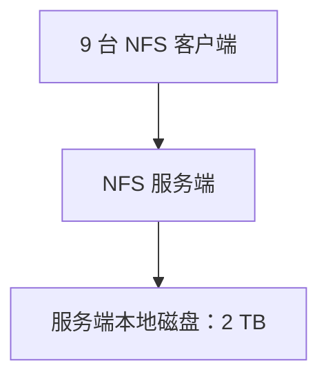
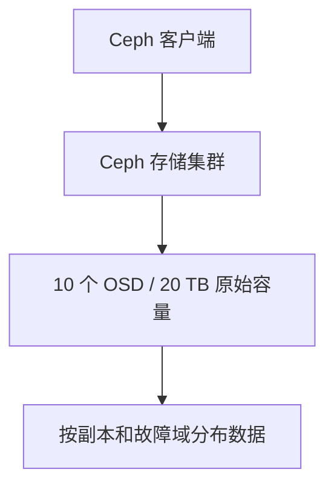

# 从 NFS 到 Ceph：为什么我们需要分布式存储

《Ceph 从零基础到生产运维实战》第 1 篇

很多人第一次接触 Ceph，都是从一个看似简单的问题开始：

> 我有 10 台服务器，每台有一块 2 TB 磁盘，怎样把这些磁盘合并起来使用？

如果在其中一台服务器上部署 NFS，然后让另外 9 台服务器挂载，最终得到的共享空间仍然只有 **2 TB**。其他服务器只是使用这台 NFS 服务器提供的目录，并没有把自己的磁盘贡献进来。

Ceph 要解决的，正是**多台服务器的磁盘如何组成统一存储**，以及其中部分服务器或磁盘故障后，**数据如何继续可用**的问题。

本文不急着部署 Ceph。我们先回答三个基础问题：

1. NFS 和 Ceph 的本质区别是什么？
2. Ceph 为什么能够把多台服务器组成存储集群？
3. 10 台 2 TB 服务器部署 Ceph 后，真正能使用多少空间？

## 先理解 NFS 在做什么

NFS（Network File System）是一种网络文件系统协议。它允许一台服务器把本地目录共享出去，其他服务器通过网络挂载这个目录。

例如：

- NFS 服务端：`192.168.1.10`
- 本地磁盘：2 TB
- 共享目录：`/data/nfs`
- 客户端：另外 9 台服务器

客户端执行挂载：

```bash
mount -t nfs4 192.168.1.10:/data/nfs /mnt/nfs
```

此后，客户端访问 `/mnt/nfs`，实际读写的是 `192.168.1.10` 上的磁盘。



因此，不管有多少客户端挂载：

**共享容量 = NFS 服务端提供的容量**

客户端数量变多，只会增加访问者，不会增加存储容量。

### NFS 的主要优点

- 部署简单，Linux 原生支持
- 客户端可以像访问本地目录一样访问共享文件
- 适合小规模文件共享、安装包目录和内部资料目录
- 对运维人员的学习成本相对较低

### 单机 NFS 的主要问题

**1. 容量受单机限制**

如果 NFS 服务端只有 2 TB，客户端看到的共享空间就只有 2 TB。除非给服务端增加磁盘、扩展 RAID 或接入外部存储，否则容量不会因为客户端增加而增长。

**2. 存在单点故障**

NFS 服务端宕机、操作系统故障、网络中断或者磁盘损坏，都可能让所有客户端无法访问共享目录。

虽然可以通过 Keepalived、Pacemaker、共享存储或者云 NAS 构建高可用，但这已经不再是最简单的单机 NFS 架构。

**3. 性能集中在一台服务器**

所有客户端的读写流量都会集中到 NFS 服务端。随着客户端和并发量增加，服务端的磁盘、网卡、CPU 都可能成为瓶颈。

**4. 扩容方式受限**

传统 NFS 通常是在服务端内部扩容磁盘，而不是把其他服务器的本地磁盘直接加入同一个共享存储池。

这并不意味着 NFS 不好。NFS 的优势就是简单。问题在于：当我们开始要求**横向扩容、自动恢复和多节点高可用**时，它就不一定是最合适的方案。

## Ceph 在做什么

Ceph 是一个分布式存储系统。它可以把多台服务器上的磁盘组织成统一的存储集群，并在这套集群之上提供：

- **RBD** 块存储
- **CephFS** 文件存储
- **RGW** 对象存储

Ceph 底层的统一存储系统叫作 **RADOS**。客户端写入 RBD、CephFS 或 RGW 的数据，最终都会转换成 RADOS 对象，分布到多个 OSD 上保存。

其中，**OSD** 可以暂时理解为：负责管理数据磁盘、处理数据读写和副本恢复的 Ceph 服务。

如果 10 台服务器各提供一块 2 TB 数据盘，那么这些磁盘可以作为 OSD 加入 Ceph 集群：



与 NFS 不同，Ceph 的数据不是只保存在某一台固定文件服务器上，而是按照存储池、副本策略和 CRUSH 规则分布到多个 OSD。

Ceph 官方架构文档说明，Ceph 客户端提交的数据会以 RADOS 对象的形式保存在 OSD 中，OSD 负责具体的数据读写、复制和恢复。后续文章会详细解释 MON、MGR、OSD、Pool、PG 和 CRUSH 的关系。

## Ceph 的核心能力

### 1. 横向扩容

传统单机存储常见的扩容方式是给原服务器增加磁盘。Ceph 除了可以给已有节点增加磁盘，还可以增加新的存储节点。

新 OSD 加入后，Ceph 可以重新调整数据分布。容量和整体吞吐能力能够随着磁盘及节点数量增加而扩展。

不过，增加节点并不意味着业务性能一定按比例增长。网络、数据恢复、磁盘类型、故障域和业务访问模型都会影响最终效果。

### 2. 数据冗余

Ceph 可以保存多个数据副本。以三副本为例，同一份数据通常会保存在三个不同的 OSD 上。

如果故障域配置为 `host`，Ceph 会尽量把副本放到不同服务器，从而避免一台服务器故障后丢失这份数据的全部副本。

需要注意：

- 三副本不是把同一份数据随意复制三遍，而是按照 CRUSH 规则和故障域进行放置。
- 如果错误地把多个副本放在同一台物理服务器，即使副本数是 3，这台服务器宕机时仍然可能同时失去多个副本。

### 3. 自动检测与恢复

OSD 发生故障后，Ceph 会更新集群状态，并根据剩余副本进行恢复和回填，使数据重新达到目标副本数。

因此，Ceph 所说的「自愈」并不是磁盘自己恢复了，而是：

1. 集群发现副本不足
2. 从健康副本读取数据
3. 在其他可用 OSD 上重新生成缺失副本
4. 恢复到预期的数据保护级别

自动恢复也会消耗磁盘和网络资源，所以生产环境需要在恢复速度与业务性能之间取得平衡。

### 4. 去中心化的数据访问

Ceph 客户端从 MON 获取集群地图后，可以通过 CRUSH 计算数据所在位置，并直接与目标 OSD 通信。数据读写不需要全部经过一个中心文件服务器。

这也是理解 Ceph 架构的重要起点：

- **MON** 维护集群状态，但不承载普通业务数据
- **OSD** 真正保存数据并处理读写
- **CRUSH** 负责计算数据应该放在哪里
- **客户端** 能够直接访问对应 OSD

### 5. 同一集群提供多种存储接口

同一套 RADOS 集群可以同时向不同业务提供：

| 存储类型 | Ceph 组件 | 常见使用场景 |
| --- | --- | --- |
| 块存储 | RBD | 虚拟机磁盘、云平台云盘、Kubernetes 持久卷 |
| 文件存储 | CephFS | 多服务器共享目录、模型文件、用户目录 |
| 对象存储 | RGW | 图片、视频、备份文件、日志归档、S3 应用 |

## 10 台 2TB 服务器到底能用多少空间

假设有 10 台服务器，每台提供一块完整的 2TB 数据盘：

```text
原始容量 = 10 × 2 TB = 20 TB
```

但 20TB 只是 **Raw Capacity**（原始容量），不是业务最终可用容量。

### 使用三副本

如果存储池配置为三副本：

```text
理论可用容量 = 20 TB ÷ 3 ≈ 6.67 TB
```

为了给数据恢复、回填、数据不均衡及系统运行保留空间，不应该把 6.67TB 全部用满。假设再预留 20%：

```text
建议业务使用容量 = 6.67 TB × 80% ≈ 5.33 TB
```

所以，在这个简化案例中：

| 项目 | 容量 |
| --- | --- |
| 原始容量 | 20 TB |
| 三副本理论可用容量 | 约 6.67 TB |
| 预留 20% 后的建议业务容量 | 约 5.33 TB |

实际环境中还要考虑：

- 厂商标称 TB 与操作系统显示 TiB 的换算差异
- BlueStore 元数据占用
- 磁盘容量并非完全一致
- OSD 之间的数据分布不可能始终绝对均匀
- Ceph 的 Nearfull、Backfillfull 和 Full 阈值
- 某个节点故障后，剩余节点是否还有足够空间完成恢复

因此，**5.33 TB 是用于理解容量关系的估算值，不是精确的生产容量承诺**。

### 为什么三副本只剩三分之一

因为业务写入 1GB 数据时，底层需要保存约 3GB 副本数据：

```text
业务数据：1 GB
副本数量：3
底层占用：约 3 GB
```

Ceph 牺牲了一部分容量，换取磁盘或服务器故障时的数据可用性。

### 两副本是否可以节省空间

两副本的理论可用容量为：

```text
20 TB ÷ 2 = 10 TB
```

但两副本意味着一个副本故障后，数据只剩下一份。在恢复完成前，如果剩余副本再次故障，就存在数据丢失风险。

测试环境可以根据实际情况使用两副本；对重要生产数据，应根据可靠性目标、硬件规模和故障域谨慎设计，不能只追求容量利用率。

## Ceph 不是什么

理解 Ceph 的能力，也要理解它的边界。

### 1. Ceph 不等于备份

多副本可以应对部分磁盘和节点故障，但无法自动防止：

- 用户误删除
- 应用错误覆盖数据
- 勒索软件
- 集群级误操作
- 机房级灾难

副本、快照、备份和异地容灾是不同层次的数据保护手段。

### 2. Ceph 不一定比单机存储延迟更低

Ceph 的数据需要通过网络访问，并且可能涉及多副本写入。它的优势是分布式能力、扩展性和可靠性，不是所有场景下的单次 IO 延迟都一定低于本地 NVMe。

### 3. Ceph 不是装完就不用维护

生产 Ceph 集群需要持续关注：

- 集群健康状态
- OSD 和 PG 状态
- 磁盘、网络和容量
- 数据恢复进度
- 慢请求
- 版本升级和安全更新

### 4. Ceph 并不适合所有小规模场景

如果只有两三台服务器，只需要共享少量文件，并且能够接受短时间维护，NFS 或云 NAS 可能更经济、更容易维护。

Ceph 的优势通常会在以下需求出现时更加明显：

- 存储容量需要持续横向扩展
- 不能接受单台存储服务器故障
- 需要块、文件或对象存储
- 有较多虚拟机或 Kubernetes 持久化数据
- 团队具备分布式存储运维能力

## NFS 与 Ceph 怎么选择

| 对比项 | 单机 NFS | Ceph |
| --- | --- | --- |
| 部署复杂度 | 低 | 高 |
| 数据位置 | NFS 服务端磁盘 | 分布在多个 OSD |
| 横向扩容 | 较弱 | 强 |
| 单点问题 | 默认存在 | 可以构建多节点高可用 |
| 数据自动恢复 | 通常没有 | 支持 |
| 存储类型 | 文件存储 | 块、文件、对象 |
| 运维成本 | 较低 | 较高 |
| 典型场景 | 小规模共享目录 | 云平台、虚拟化、容器平台和大型共享存储 |

可以用一句话总结：

> **NFS 主要解决「把一台服务器的目录共享出去」；Ceph 主要解决「把多台服务器的磁盘组成可扩展、可恢复的统一存储系统」。**

## 本篇总结

通过这一篇，需要记住以下结论：

1. 10 台服务器挂载同一个 NFS，不代表获得 10 台服务器的磁盘容量
2. NFS 客户端使用的是 NFS 服务端提供的空间
3. Ceph 可以让多台服务器贡献磁盘，并组成统一存储集群
4. Ceph 通过副本、CRUSH 和自动恢复提高数据可靠性
5. 10 台 2TB 服务器的原始容量是 20TB
6. 三副本理论可用容量约 6.67TB，预留 20% 后建议业务使用约 5.33TB
7. Ceph 多副本不是备份，生产环境仍然需要独立的备份与容灾方案

**RBD、CephFS 和 RGW 到底有什么区别，业务应该如何选择？**


## 自测题

1. 为什么 9 台服务器挂载一台 2TB 的 NFS 服务器后，共享容量仍然是 2TB？
2. Ceph 中的 OSD 主要负责什么？
3. 三副本情况下，20TB 原始容量的理论可用容量是多少？
4. 为什么生产 Ceph 集群不能把容量使用到 100%？
5. Ceph 多副本为什么不能代替备份？

如果能够不看正文回答以上问题，就已经掌握了进入 Ceph 世界的第一组基础概念。

## 参考资料

- [Ceph 官方架构文档](https://docs.ceph.com/en/latest/architecture/)
- [Ceph 存储集群文档](https://docs.ceph.com/en/latest/rados/)
- [Ceph 术语表](https://docs.ceph.com/en/latest/glossary/)

→ [第 2 篇：理解三种存储类型](./02-理解三种存储类型.md)
