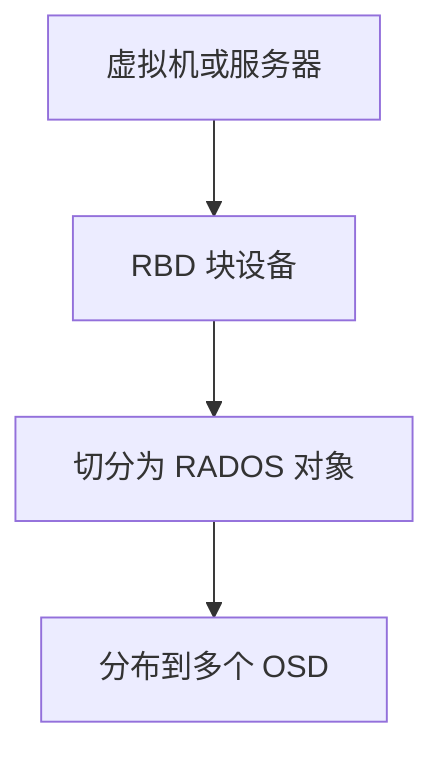
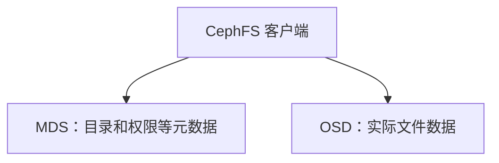
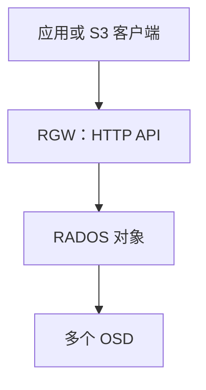
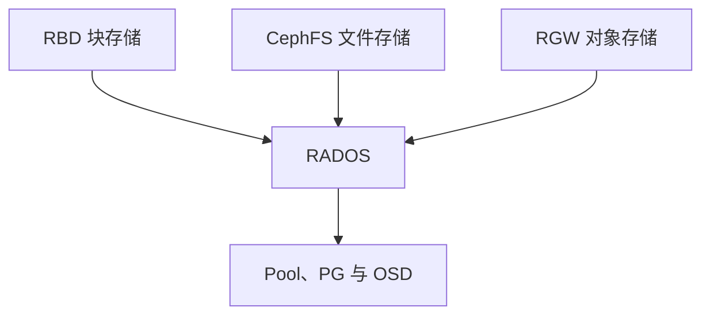
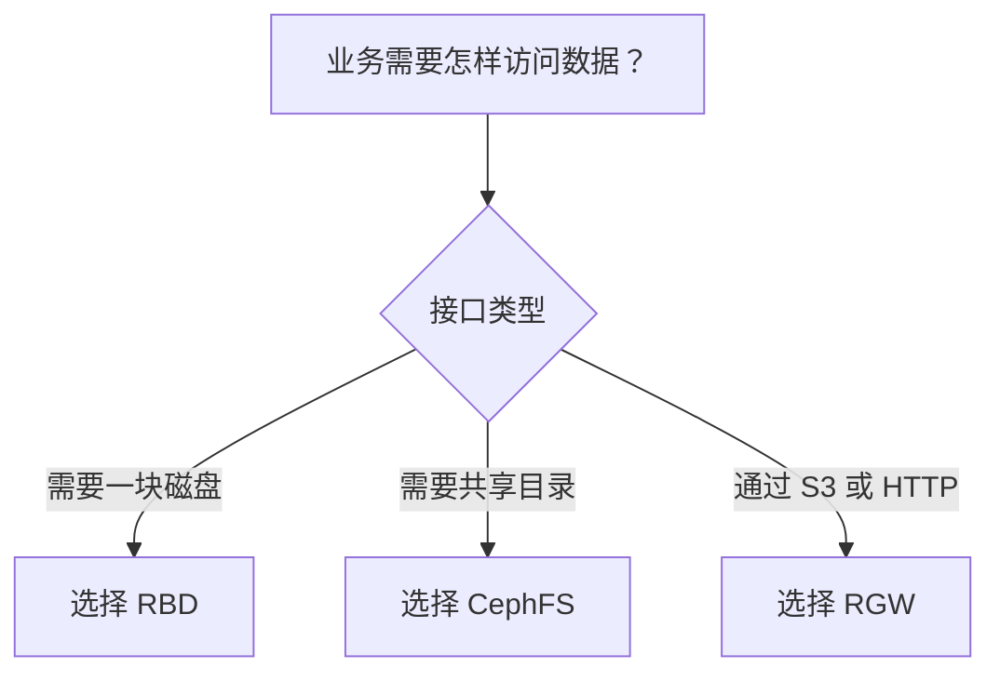

# 一次讲清块、文件和对象存储：RBD、CephFS 与 RGW 怎么选

《Ceph 从零基础到生产运维实战》第 2 篇

← [第 1 篇：为什么需要 Ceph](./01-为什么需要Ceph.md)

上一篇我们知道，Ceph 可以把多台服务器的磁盘组成统一存储集群。但部署 Ceph 之前，还有一个必须先弄清的问题：

> 业务需要的究竟是块存储、文件存储，还是对象存储？

很多 Ceph 初学者会直接把 CephFS 理解成「更强大的 NFS」，或者认为 RBD、CephFS 和 RGW 只是三种不同的挂载方式。实际上，它们提供的是**三种不同的存储接口**，数据组织方式、访问协议和使用场景都不一样。

本文将从业务视角说明：

- 什么是块存储、文件存储和对象存储
- RBD、CephFS 和 RGW 分别解决什么问题
- 三种存储最终如何落到同一套 RADOS 集群
- 面对真实业务需求时应该如何选择

## 1. 存储不仅是「有多少空间」 {/* #存储不仅是有多少空间 */}

假设我们拥有一个 10TB 存储空间，业务提出三个需求：

1. 给虚拟机提供一块 200GB 系统盘
2. 让 20 台服务器共同访问一个共享目录
3. 让应用通过 HTTP 接口上传和下载图片

虽然三个需求都需要「存储数据」，但访问方式完全不同：

| 业务需求 | 需要的存储接口 |
| --- | --- |
| 虚拟机需要一块磁盘 | 块存储 |
| 多台服务器共享目录 | 文件存储 |
| 应用通过 HTTP 上传对象 | 对象存储 |

因此，选择存储不能只看容量，还要看业务希望**怎样访问数据**。

## 2. 块存储：Ceph RBD {/* #块存储ceph-rbd */}

### 2.1 什么是块存储 {/* #什么是块存储 */}

块存储向客户端提供的不是目录，而是一块类似硬盘的设备。

客户端得到块设备以后，还需要进行分区、格式化和挂载：

```bash
mkfs.xfs /dev/rbd0
mount /dev/rbd0 /data
```

这与给服务器添加一块物理硬盘或云硬盘的使用方式非常相似。

Ceph 提供的块存储叫作 **RBD**（RADOS Block Device）。在 Ceph 中创建的虚拟块设备通常称为 **RBD Image**。



### 2.2 RBD 的主要特点 {/* #rbd-的主要特点 */}

Ceph 官方文档指出，RBD 支持精简配置、在线调整容量，并将数据条带化地分布到多个 OSD 上，同时能够利用 RADOS 提供的副本、快照和强一致性能力。

**精简配置**

创建一个 100GB 的 RBD 镜像，不代表 Ceph 立刻占用 100GB 物理空间。通常只有实际写入的数据才会占用后端容量。

这提高了空间利用率，但也带来**超分风险**。如果创建的 RBD 总容量超过集群实际容量，必须做好容量监控，避免后端空间耗尽。

**可扩容**

RBD 镜像可以调整容量。扩展镜像后，还需要根据客户端的分区和文件系统类型完成对应扩容。

**快照和克隆**

RBD 可以创建时间点快照，也可以基于快照快速克隆镜像，适合虚拟机模板和测试环境批量创建。

需要注意，快照仍然依赖原 Ceph 集群，**不等同于独立备份**。

### 2.3 RBD 怎么访问 {/* #rbd-怎么访问 */}

常见方式包括：

- Linux 内核 RBD 模块
- librbd 用户态库
- QEMU/KVM 直接访问
- OpenStack Cinder
- Kubernetes Ceph CSI

### 2.4 RBD 适合什么场景 {/* #rbd-适合什么场景 */}

- 虚拟机系统盘和数据盘
- OpenStack 云硬盘
- Kubernetes 持久卷
- 需要独立磁盘语义的数据库或应用
- 需要快照、克隆和快速创建磁盘的场景

### 2.5 RBD 使用时的注意事项 {/* #rbd-使用时的注意事项 */}

普通文件系统如 XFS、ext4 通常**不能**在多台服务器上同时读写同一个 RBD 镜像，否则可能破坏文件系统。

因此，在常规场景中，一个 RBD 卷通常由一个节点挂载读写。如果确实需要多个节点共享块设备，必须使用支持集群访问的文件系统或由上层应用负责并发协调。

## 3. 文件存储：CephFS {/* #文件存储cephfs */}

### 3.1 什么是文件存储 {/* #什么是文件存储 */}

文件存储直接向客户端提供目录和文件层次结构。客户端可以使用熟悉的命令访问：

```bash
cd /mnt/cephfs
mkdir project
cp model.bin /mnt/cephfs/project/
ls -lh /mnt/cephfs/project/
```

Ceph 提供的分布式文件系统叫作 **CephFS**。

CephFS 旨在提供接近 POSIX 语义的文件系统，可以通过 Linux 内核客户端或 `ceph-fuse` 挂载。多个客户端可以同时挂载同一个 CephFS。

### 3.2 CephFS 中的数据和元数据 {/* #cephfs-中的数据和元数据 */}

文件系统不只有文件内容，还包含大量元数据，例如：

- 文件名
- 目录层级
- 所属用户和用户组
- 权限
- inode
- 文件大小和时间属性

CephFS 引入了 **MDS**（Metadata Server）处理文件系统元数据。



这里有一个非常重要的原理：

> **MDS 主要管理元数据，不是所有文件数据都必须经过 MDS 转发。**

客户端从 MDS 获取必要的元数据和能力授权后，可以直接与底层 RADOS 交互，读写保存在 OSD 中的文件数据。

这种设计避免了所有数据都经过单一文件服务器，但 MDS 本身的状态和性能仍然是 CephFS 运维的重要观察对象。

### 3.3 CephFS 怎么访问 {/* #cephfs-怎么访问 */}

Linux 客户端常见的两种挂载方式：

- 内核客户端挂载
- FUSE 客户端挂载

内核客户端通常性能更好；FUSE 客户端升级灵活，并且不完全依赖操作系统内核自带的 Ceph 客户端版本。实际选择需要结合操作系统、Ceph 版本和功能兼容性。

### 3.4 CephFS 适合什么场景 {/* #cephfs-适合什么场景 */}

- 多台服务器共享目录
- Kubernetes 中需要 ReadWriteMany 的共享存储
- AI 模型文件、数据集和公共资源目录
- 用户家目录
- 内容管理、媒体处理和公共文件服务

### 3.5 CephFS 与 NFS 有什么区别 {/* #cephfs-与-nfs-有什么区别 */}

从客户端体验看，它们都可以挂载为目录；但底层架构不同：

| 对比项 | NFS | CephFS |
| --- | --- | --- |
| 数据位置 | 通常集中在 NFS 服务端后端存储 | 分布在多个 OSD |
| 数据访问 | 通过 NFS 服务端 | 客户端可直接访问 RADOS 中的数据 |
| 横向扩容 | 取决于 NFS 后端存储 | 可以增加 OSD 和节点 |
| 元数据 | 由 NFS 服务端文件系统处理 | 由 MDS 服务处理 |
| 自动恢复 | 取决于后端方案 | 由 Ceph 副本和恢复机制提供 |
| 运维复杂度 | 较低 | 较高 |

CephFS 并不是简单地把 NFS 服务端部署成多个副本，而是建立在 RADOS 之上的分布式文件系统。

## 4. 对象存储：Ceph RGW {/* #对象存储ceph-rgw */}

### 4.1 什么是对象存储 {/* #什么是对象存储 */}

对象存储不向客户端提供传统磁盘或目录，而是通过 API 管理对象。

一个对象通常包含：

- 对象数据
- 对象名称或 Key
- 对象元数据

对象一般保存在 Bucket 中，应用通过 HTTP 接口上传、下载或删除对象。

例如：

```text
Bucket：images
Object Key：2026/08/avatar-001.png
```

访问对象时，应用关心的是 Bucket 和 Key，而不是文件位于哪块磁盘、哪个分区或哪个传统目录。

### 4.2 Ceph RGW 是什么 {/* #ceph-rgw-是什么 */}

Ceph 的对象存储网关叫作 **RGW**（RADOS Gateway），对应的守护进程是 `radosgw`。

RGW 是面向客户端的 HTTP 服务，它接收对象存储请求，完成认证、Bucket 及对象处理，然后把数据存入 RADOS。



Ceph RGW 提供兼容 Amazon S3 和 OpenStack Swift 基本数据访问模型的接口，并拥有独立的对象存储用户管理体系。

这里的「兼容 S3」不表示它就是 AWS S3，也不应默认所有 AWS 扩展功能都完全一致。业务接入前需要验证具体 API 和功能兼容性。

### 4.3 RGW 适合什么场景 {/* #rgw-适合什么场景 */}

- 图片、音频和视频
- 安装包及大文件分发
- 日志归档
- 备份文件
- 应用上传附件
- 数据湖和非结构化数据
- 需要通过 HTTP/S3 API 访问存储的系统

### 4.4 对象存储和文件存储不是一回事 {/* #对象存储和文件存储不是一回事 */}

对象存储通常不提供完整的 POSIX 文件系统语义：

- 不能把对象 API 简单理解为普通 Linux 文件操作
- 目录往往只是对象 Key 的前缀
- 修改对象中间一部分数据的方式与块设备不同
- 文件锁、权限和原子操作语义也与本地文件系统不同

虽然可以通过某些工具把 S3 Bucket 模拟挂载为目录，但不代表它获得了与 CephFS 完全相同的语义和性能。

如果现有应用只能读写本地目录，优先考虑 CephFS；如果应用原生支持 S3 API，RGW 通常更自然。

## 5. 三种存储为什么可以共用一个 Ceph 集群 {/* #三种存储为什么可以共用一个-ceph-集群 */}

RBD、CephFS 和 RGW 提供了不同的上层接口，但底层都使用 RADOS：



它们的转换关系可以这样理解：

| 上层服务 | 客户端看到的内容 | 底层处理方式 |
| --- | --- | --- |
| RBD | 一块虚拟磁盘 | 把块设备数据切分成 RADOS 对象 |
| CephFS | 目录和文件 | 文件映射为对象，MDS 管理文件系统元数据 |
| RGW | Bucket 和 Object | RGW 将对象存储请求转换为 RADOS 操作 |

同一集群可以同时提供三种服务，但生产环境通常要通过不同 Pool、CRUSH 规则、设备类别和配额进行资源隔离，避免不同业务互相争抢容量和性能。

## 6. RBD、CephFS 和 RGW 对比 {/* #rbdcephfs-和-rgw-对比 */}

| 对比项 | RBD | CephFS | RGW |
| --- | --- | --- | --- |
| 类型 | 块存储 | 文件存储 | 对象存储 |
| 客户端看到 | 虚拟磁盘 | 目录和文件 | Bucket 和 Object |
| 访问方式 | 内核 RBD、librbd、CSI、QEMU | 内核挂载、FUSE、CSI | HTTP、S3、Swift |
| 是否需要文件系统 | 通常需要客户端格式化 | 已经是文件系统 | 不需要传统文件系统 |
| 多客户端共享 | 需要上层协调 | 支持共享挂载 | 天然面向多客户端 API 访问 |
| 典型场景 | 虚拟机、数据库、云硬盘、PVC | 共享目录、模型和数据集 | 图片、视频、备份、日志归档 |
| 主要管理对象 | RBD Image | 文件和目录 | Bucket 和 Object |
| 关键组件 | RBD / librbd | MDS | RGW |

## 7. 业务应该怎么选择 {/* #业务应该怎么选择 */}

可以按照下面的思路判断：



**场景一：给虚拟机提供系统盘**

选择 RBD。虚拟机需要的是一块可分区、格式化和随机读写的虚拟磁盘。

**场景二：20 台服务器共享模型文件**

通常选择 CephFS。各服务器可以把同一个文件系统挂载为目录，共享模型、配置或数据集。

如果模型分发流程本身支持从 S3 下载，也可以使用 RGW，具体取决于应用访问模式。

**场景三：网站保存用户上传的图片**

如果应用支持 S3 接口，通常选择 RGW。对象存储便于通过 API 管理大量非结构化文件。

**场景四：Kubernetes 有状态应用**

- 单 Pod 独占卷：通常使用 RBD
- 多 Pod 共享读写目录：通常使用 CephFS
- 应用原生通过 S3 保存数据：使用 RGW

**场景五：MySQL 数据目录**

通常考虑 RBD，而不是 CephFS 或 RGW，因为 MySQL 需要块设备上的文件系统语义和随机读写能力。

但「可以使用」不等于「一定性能最好」。上线前还需要验证延迟、IOPS、吞吐量、故障切换和数据库自身的高可用方案。

## 8. 常见误区 {/* #常见误区 */}

**误区一：CephFS 就是高可用 NFS**

两者都可以给客户端提供共享目录，但数据访问路径、扩展方式和元数据架构不同。

**误区二：RBD 可以直接当共享目录使用**

RBD 提供的是块设备。格式化为普通 XFS 或 ext4 后，不应该被多台服务器同时读写挂载。

**误区三：对象存储就是容量更大的文件系统**

对象存储使用 Bucket、Key 和 API 访问数据，不具备完整的传统文件系统语义。

**误区四：三种服务必须部署三个 Ceph 集群**

它们可以共用同一套 RADOS 集群。但生产环境需要做好存储池、容量和性能隔离。

**误区五：选择 Ceph 以后不需要考虑应用架构**

存储只能提供底层能力。数据库一致性、应用多活、文件并发写入和备份策略，仍然需要由上层系统正确设计。

## 9. 本篇总结 {/* #本篇总结 */}

通过这一篇，需要掌握以下结论：

1. RBD 向客户端提供虚拟块设备，适合虚拟机、数据库和持久卷
2. CephFS 提供共享文件系统，适合多客户端访问目录和文件
3. RGW 提供 S3/Swift 兼容对象接口，适合图片、视频、备份和日志归档
4. 三种服务的底层都是 RADOS
5. MDS 主要处理 CephFS 元数据，文件数据由客户端直接访问 RADOS
6. RGW 是对象存储网关，不是传统文件系统
7. 存储选型要从业务访问接口出发，而不是只看容量

**MON、MGR、OSD、MDS、RGW 分别负责什么，它们之间是如何协作的？**

## 10. 自测题 {/* #自测题 */}

1. RBD、CephFS 和 RGW 分别向客户端提供什么接口？
2. 为什么普通 XFS 文件系统不能在多台服务器上同时挂载同一个 RBD 卷？
3. CephFS 中的 MDS 是否负责转发所有文件数据？
4. RGW 兼容 S3 接口是否等于拥有 AWS S3 的全部功能？
5. Kubernetes 中，单 Pod 独占卷和多 Pod 共享目录分别更适合使用什么？
6. 为什么三种存储服务可以运行在同一个 Ceph 集群中？

### 10.1 参考答案 {/* #参考答案 */}

1. RBD提供块设备接口；CephFS提供共享POSIX文件系统；RGW提供S3/Swift风格对象API。
2. 普通XFS/ext4假设自己独占块设备并在本地维护元数据缓存，多主机并发挂载会发生不可协调的元数据写入和缓存冲突，导致文件系统损坏；多节点写需集群文件系统或上层协调。
3. 不负责。MDS管理命名空间、目录、权限和文件元数据；客户端取得布局与能力后通常直接和OSD交换文件数据。
4. 不等于。RGW实现兼容接口及一组特性，但AWS的服务能力、限制、IAM生态、事件、存储类别和边缘集成不能据此全部等同，必须按目标版本逐项验证。
5. 单Pod独占的RWO卷通常用RBD；多个Pod需要同时访问同一目录时通常用CephFS的RWX。对象API场景则直接使用RGW而不是PVC。
6. 三者最终都把数据组织成RADOS对象并存入Pool，只是由librbd、CephFS/MDS和RGW分别提供不同上层语义，因此可共享同一MON/MGR/OSD基础集群，并通过Pool与权限隔离。

## 11. 参考资料 {/* #参考资料 */}

- [Ceph 官方架构文档](https://docs.ceph.com/en/latest/architecture/)
- [Ceph Block Device 文档](https://docs.ceph.com/en/latest/rbd/)
- [CephFS 文档](https://docs.ceph.com/en/latest/cephfs/)
- [CephFS IO Path](https://docs.ceph.com/en/latest/cephfs/file-layouts/)
- [Ceph Object Gateway 文档](https://docs.ceph.com/en/latest/radosgw/)
- [Ceph S3 API 文档](https://docs.ceph.com/en/latest/radosgw/s3/)

→ [第 3 篇：Ceph 整体架构](../02-architecture/03-Ceph整体架构.md)
