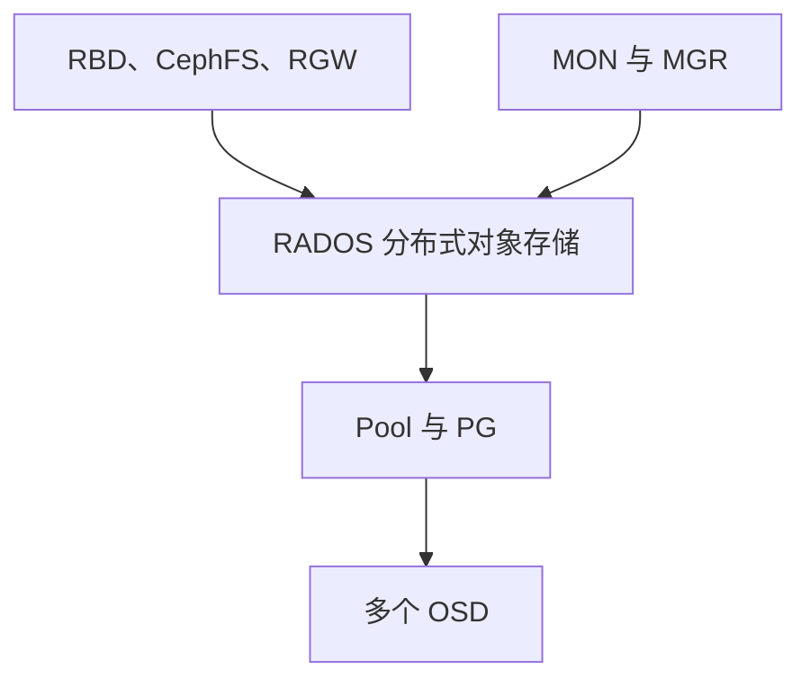
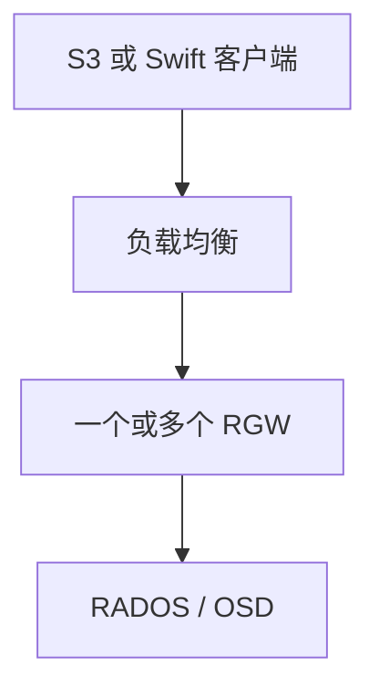
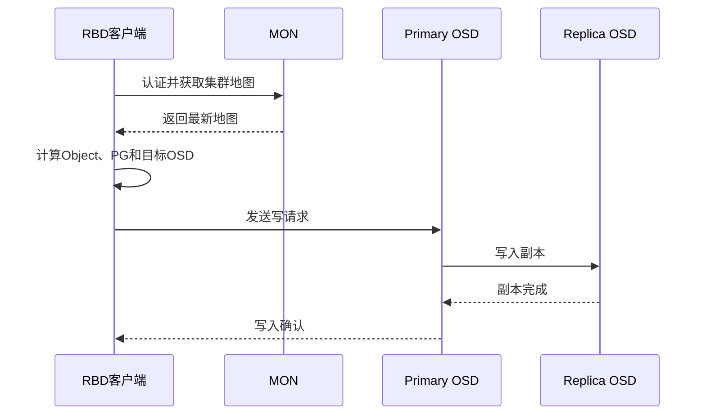

# Ceph 整体架构：MON、MGR、OSD、MDS 和 RGW 如何协作

《Ceph 从零基础到生产运维实战》第 3 篇

← [第 2 篇：理解三种存储类型](../01-overview/02-理解三种存储类型.md)

前两篇解决了两个问题：

1. Ceph 为什么比单机 NFS 更适合构建可扩展的分布式存储
2. RBD、CephFS 和 RGW 分别向业务提供什么类型的存储接口

接下来要真正走进 Ceph 内部。

很多新人第一次查看 Ceph 集群，会看到 MON、MGR、OSD、MDS、RGW 等一组缩写。只记住它们的中文名称并没有太大意义，更重要的是理解：

- 谁负责维护集群状态
- 谁真正保存业务数据
- 谁处理文件系统元数据
- 客户端读写数据时，请求经过哪些组件
- 某个组件故障后，会影响哪些业务

本文将从整体架构出发，把这些组件放到一条完整的数据链路中理解。


## 先建立 Ceph 的分层视图

为了便于理解，可以把 Ceph 分成四层：

| 层次 | 主要组件 | 作用 |
| --- | --- | --- |
| 业务接入层 | RBD、CephFS、RGW | 向业务提供块、文件和对象接口 |
| 元数据与网关层 | MDS、RGW | 处理 CephFS 元数据或对象 API 请求 |
| RADOS 数据层 | OSD、Pool、PG、CRUSH | 保存、分布、复制和恢复数据 |
| 集群控制与管理层 | MON、MGR | 维护集群状态，提供管理和监控能力 |

其中，**RADOS** 是 Ceph 的底座。RBD、CephFS 和 RGW 最终都把数据保存到 RADOS 中。



这张图需要先记住两个关键点：

1. **真正保存业务数据的是 OSD**
2. **MON 和 MGR 非常重要，但普通业务数据不会全部经过它们转发**

## RADOS：Ceph 的底层存储系统

RADOS 全称为 Reliable Autonomic Distributed Object Store，可以理解为 Ceph 底层的可靠、自主管理的分布式对象存储系统。

无论业务使用的是：

- 一块 RBD 虚拟磁盘
- 一个 CephFS 文件
- 一个通过 S3 接口上传的 RGW 对象

数据最终都会转换成 RADOS 对象，保存在不同 OSD 中。

RADOS 负责的核心能力包括：

- 数据对象存储
- 数据副本或纠删码
- 数据分布
- 故障检测
- 数据恢复和回填
- 数据一致性检查
- 集群容量扩展

因此，RBD、CephFS 和 RGW 并不是三套完全独立的存储系统，而是建立在同一个 RADOS 底座之上的三种访问方式。

## MON：集群状态的权威来源

MON 是 Monitor 的缩写，中文通常称为监视器。

「监视器」这个翻译容易让新人误以为 MON 只是做监控告警。实际上，MON 最重要的职责是：

> **保存并维护 Ceph 集群状态的权威副本。**

### MON 维护哪些信息

Ceph 集群不是静态的。OSD 可能上线或下线，节点可能故障，Pool 配置可能修改，MDS 和 MGR 的状态也会发生变化。

MON 维护的集群地图主要包括：

| 集群地图 | 主要内容 |
| --- | --- |
| Monitor Map | MON 成员及地址 |
| OSD Map | OSD 状态、Pool 和部分数据放置信息 |
| CRUSH Map | OSD 拓扑、故障域和数据放置规则 |
| MDS Map | CephFS 与 MDS 状态 |
| Manager Map | MGR 状态 |

客户端和其他 Ceph 守护进程会从 MON 获取最新的集群地图。

### MON 为什么需要 Quorum

多个 MON 之间需要对关键集群状态达成一致，这个多数派集合称为 **Quorum**（仲裁）。

生产环境通常部署奇数个 MON：

| MON 数量 | 形成 Quorum 所需数量 | 可容忍故障数 |
| --- | --- | --- |
| 1 | 1 | 0 |
| 3 | 2 | 1 |
| 5 | 3 | 2 |

三个 MON 中只剩一个时，虽然这个 MON 进程可能仍然存活，但无法形成多数派，集群就失去了正常的仲裁能力。

因此，高可用不是「MON 进程还活着」，而是「足够数量的 MON 可以互相通信并形成 Quorum」。

### MON 是否转发业务数据

通常不会。

客户端首先连接 MON 完成认证并获取集群地图，然后根据地图和 CRUSH 规则计算目标 OSD，直接与 OSD 通信。

如果所有数据都必须经过 MON，MON 就会变成中心瓶颈和单点。Ceph 正是通过「客户端获取地图后直接访问 OSD」避免这种问题。

### 查看 MON 状态

```bash
ceph mon stat
ceph quorum_status
ceph mon dump
```

这些命令分别用于查看 MON 总体状态、Quorum 详情和 Monitor Map。

## MGR：集群管理与监控中心

MGR 是 Manager 的缩写，主要负责收集集群运行信息，并向管理、监控和编排功能提供接口。

### MGR 主要做什么

MGR 的常见职责包括：

- 收集 OSD、MON 等组件上报的性能数据
- 提供 Ceph Dashboard
- 通过 Prometheus 模块暴露监控指标
- 运行 Balancer、Crash、Alerts 等管理模块
- 为 Cephadm Orchestrator 提供管理能力
- 展示容量、吞吐量、IOPS 和集群状态

可以把 MON 和 MGR 的区别简单概括为：

| 组件 | 重点职责 |
| --- | --- |
| MON | 维护集群关键状态和集群地图 |
| MGR | 管理、监控、统计和扩展模块 |

### Active 与 Standby MGR

Ceph 通常运行一个 Active MGR 和一个或多个 Standby MGR。

Active MGR 负责运行大部分管理模块；Active 发生故障后，Standby 可以接替。这样可以避免 Dashboard、Prometheus 指标和管理模块长期不可用。

### MGR 故障会不会让业务 IO 立即中断

一般不会直接中断正常的 RADOS 数据读写，因为 MGR 不在普通数据 IO 主链路中。

但是，MGR 故障会影响 Dashboard、监控指标、部分管理命令和编排功能。长期没有可用 MGR 也不属于正常运行状态，必须及时恢复。

### 查看 MGR 状态

```bash
ceph mgr stat
ceph mgr dump
ceph mgr module ls
```

## OSD：真正保存和处理数据的核心组件

OSD 是 Object Storage Daemon 的缩写，是 Ceph 数据面的核心。

OSD 负责：

- 在本地存储设备上保存 RADOS 对象
- 处理客户端读写请求
- 与其他 OSD 复制数据
- 检测其他 OSD 的存活状态
- 执行 Recovery 和 Backfill
- 执行 Scrub 和 Deep Scrub
- 向 MON 和 MGR 上报状态及性能数据

### OSD 等于一块磁盘吗

严格来说，OSD 是一个守护进程和对应的逻辑存储单元，不是磁盘本身。

在常见的 BlueStore 部署中，通常一块数据盘对应一个 OSD，但一个 OSD 还可能使用独立的 DB 或 WAL 设备。因此，「有多少块数据盘就有多少个 OSD」可以用于快速理解，却不是完整定义。

例如：

```text
osd.0 → /dev/sdb
osd.1 → /dev/sdc
osd.2 → /dev/sdd
```

### Up/Down 和 In/Out 不是一回事

OSD 有两组非常重要的状态：

| 状态 | 含义 |
| --- | --- |
| up | OSD 进程正在运行并可以通信 |
| down | OSD 进程不可用或无法正常通信 |
| in | OSD 参与数据放置 |
| out | OSD 不再作为数据放置目标 |

因此可能出现：

- **up + in**：正常工作
- **down + in**：OSD 异常，但数据映射暂时仍包含它
- **down + out**：OSD 不可用，并已被排除出数据放置
- **up + out**：进程运行，但不承担正常数据放置

这些状态会在后面的 OSD 故障排查文章中反复出现。

### OSD 之间如何协作

在副本池中，一个 PG 会对应一组 OSD。其中一个是 **Primary OSD**，其余是 **Replica OSD**。

客户端通常把写请求发送给 Primary OSD，由 Primary 协调其他 Replica 完成副本写入。满足当前写入确认条件后，Primary 再向客户端确认。

### 查看 OSD 状态

```bash
ceph osd stat
ceph osd tree
ceph osd df
ceph osd dump
```

## MDS：CephFS 的元数据服务

MDS 是 Metadata Server 的缩写，**只在使用 CephFS 时需要**。

如果集群只使用 RBD 或 RGW，不需要因为这两种服务专门部署 MDS。

### 什么是文件系统元数据

CephFS 中的元数据包括：

- 文件名和目录结构
- inode
- 文件所有者和所属组
- 权限
- 时间属性
- 客户端会话和文件锁等状态

MDS 负责管理这些元数据，让客户端能够执行 `ls`、`cd`、`mkdir`、打开文件和权限检查等文件系统操作。

### MDS 是否保存文件数据

MDS 不负责转发所有文件内容。

CephFS 客户端获得所需的元数据和能力授权后，会直接访问 RADOS 中的文件数据。这样可以避免所有文件 IO 都集中经过 MDS。

### Active 与 Standby MDS

为了实现高可用，CephFS 通常至少准备：

- 一个 Active MDS
- 一个 Standby MDS

Active 故障后，Standby 可以接管对应的 MDS Rank。切换过程中，CephFS 元数据操作可能短暂停顿。

### 查看 MDS 和 CephFS 状态

```bash
ceph fs status
ceph mds stat
ceph fs dump
```

## RGW：对象存储访问网关

RGW 是 RADOS Gateway 的缩写，它向外提供兼容 S3 和 Swift 基本数据模型的 HTTP 接口。

应用不需要理解 Pool、PG 和 OSD，只需要通过 Bucket、Object Key、Access Key 和 Secret Key 访问对象。

### RGW 在链路中的位置



RGW 主要负责：

- 接收 HTTP 请求
- 身份认证和权限检查
- 处理 Bucket 和 Object 操作
- 将对象请求转换为 RADOS 操作
- 管理 RGW 用户和对象元数据

### RGW 是否保存对象数据

对象数据最终保存在 RADOS 中。RGW 是访问网关，不应该被理解成对象数据只存放在 RGW 服务器本地。

因此，可以部署多个 RGW 实例并在前面配置负载均衡，提高接口容量和可用性。

### RGW 故障影响什么

如果只有一个 RGW 实例，它故障后，S3 或 Swift 接口会不可用，但底层 RADOS 数据仍然存在，RBD 和 CephFS 通常不会因此中断。

如果部署多个 RGW 并正确配置负载均衡，单个 RGW 实例故障时可以由其他实例继续提供服务。

### 查看 RGW 服务

在 Cephadm 管理的集群中可以使用：

```bash
ceph orch ls --service_type rgw
ceph orch ps --daemon_type rgw
```

## Ceph 客户端：真正发起数据访问的一方

Ceph 客户端不只指一台 Linux 服务器，也可以是：

- Linux 内核 RBD 客户端
- QEMU 或其他使用 librbd 的程序
- CephFS 内核或 FUSE 客户端
- Kubernetes Ceph CSI
- 通过 HTTP 访问 RGW 的 S3 客户端
- 直接使用 librados 的应用程序

不同客户端的接口不同，但它们最终都访问同一套 RADOS 集群。

### 客户端为什么必须先联系 MON

客户端在访问数据前，需要完成两件事：

1. 使用 CephX 身份和密钥完成认证
2. 从 MON 获取最新的集群地图

客户端有了集群地图后，才能判断有哪些 OSD、OSD 当前状态如何，以及数据应该访问哪个 PG 和 OSD。

## 一次 RBD 写入是怎么完成的

先用一个简化流程把所有组件串起来。假设虚拟机向 RBD 写入一段数据：



把这个过程拆开：

1. 客户端连接 MON，完成认证并获取 Cluster Map
2. RBD 把块设备数据切分为 RADOS 对象
3. 客户端根据对象、Pool、PG 和 CRUSH 计算目标 OSD
4. 客户端直接把请求发给 Primary OSD
5. Primary OSD 协调 Replica OSD 完成副本写入
6. 达到当前写入确认条件后，Primary 向客户端返回成功

需要特别注意：

- MON 提供地图，不转发这次业务数据
- MGR 负责管理和监控，不转发这次业务数据
- RBD 不需要 MDS
- 真正处理数据的是 OSD

## 不同存储服务需要哪些组件

| 使用场景 | 基础组件 | 额外组件或客户端 |
| --- | --- | --- |
| RBD 块存储 | MON、MGR、OSD | 内核 RBD、librbd 或 Ceph CSI |
| CephFS 文件存储 | MON、MGR、OSD | MDS 以及内核 / FUSE 客户端 |
| RGW 对象存储 | MON、MGR、OSD | RGW 以及 S3 / Swift 客户端 |

三个容易混淆的结论：

1. RBD 没有一个所有数据都必须经过的中央 RBD 服务器
2. MDS 只服务 CephFS，不负责 RBD 和 RGW
3. RGW 是对象接口网关，业务对象最终仍保存在 OSD 中

## 组件故障会产生什么影响

| 故障场景 | 可能影响 |
| --- | --- |
| 三个 MON 中的一个故障 | Quorum 仍在，通常可以继续服务，但产生健康告警 |
| MON 失去多数派 | 集群地图无法正常达成一致，属于严重故障 |
| Active MGR 故障且有 Standby | MGR 发生切换，管理和监控功能短暂受影响 |
| 单个 OSD 故障 | 相关 PG 可能降级，集群根据策略恢复副本 |
| Active MDS 故障且有 Standby | CephFS 元数据服务切换，文件操作可能短暂停顿 |
| 单个 RGW 故障且有其他实例 | 负载均衡将请求转到其他 RGW |

故障影响不是只由「某个进程是否存活」决定，还与副本数、Quorum、Standby 数量、故障域和剩余容量有关。

## 常见误区

**误区一：MON 是 Ceph 的数据中心**

MON 是集群状态的权威来源，但普通业务数据不存放在 MON 中，也不需要由 MON 转发。

**误区二：MGR 和 MON 是一回事**

MON 负责关键集群状态和一致性，MGR 负责管理、监控、统计和扩展模块，两者职责不同。

**误区三：一个 OSD 就是一个物理硬盘**

常见部署通常一块数据盘对应一个 OSD，但 OSD 的准确含义是守护进程及其逻辑存储单元。

**误区四：部署 CephFS 必须让所有数据经过 MDS**

MDS 主要处理文件系统元数据。客户端获得能力授权后可以直接访问 RADOS 中的文件数据。

**误区五：RGW 故障意味着 Ceph 数据丢失**

RGW 是访问网关。RGW 进程故障会影响对象接口，但对象数据仍保存在 RADOS 中。

## 本篇总结

这一篇需要记住以下内容：

1. RADOS 是 RBD、CephFS 和 RGW 共同的底层存储系统
2. MON 维护集群地图和关键状态，并通过 Quorum 保证一致性
3. MGR 负责管理、监控、统计和扩展模块
4. OSD 真正保存对象、处理读写、复制和恢复数据
5. MDS 只为 CephFS 管理文件系统元数据
6. RGW 把 S3/Swift 请求转换为 RADOS 操作
7. 客户端先从 MON 获取地图，再直接访问目标 OSD
8. 普通业务数据不会全部经过 MON 或 MGR

**业务数据如何变成 Object，Object 为什么属于 Pool，又如何通过 PG 找到 OSD？**


## 自测题

1. MON 和 MGR 的职责有什么区别？
2. 为什么三个 MON 最多只能容忍一个 MON 故障？
3. OSD 的 up/down 和 in/out 分别表示什么？
4. MDS 是否参与 RBD 数据读写？
5. RGW 服务器故障后，对象数据是否一定丢失？
6. RBD 客户端为什么要先连接 MON？
7. 一次 RBD 写入过程中，哪个组件负责协调副本写入？

## 参考资料

- [Ceph 官方架构文档](https://docs.ceph.com/en/latest/architecture/)
- [Ceph 存储集群文档](https://docs.ceph.com/en/latest/rados/)
- [Monitor 配置参考](https://docs.ceph.com/en/latest/rados/configuration/mon-config-ref/)
- [Ceph Manager 管理文档](https://docs.ceph.com/en/latest/mgr/)
- [Ceph OSD 命令文档](https://docs.ceph.com/en/latest/rados/operations/control/#osd)
- [CephFS IO Path](https://docs.ceph.com/en/latest/cephfs/file-layouts/)
- [Ceph Object Gateway 文档](https://docs.ceph.com/en/latest/radosgw/)

→ [第 4 篇：Ceph 数据组织原理](./04-Ceph数据组织原理.md)
