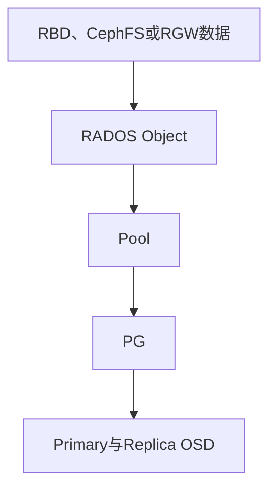
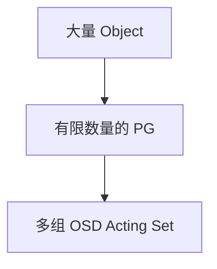
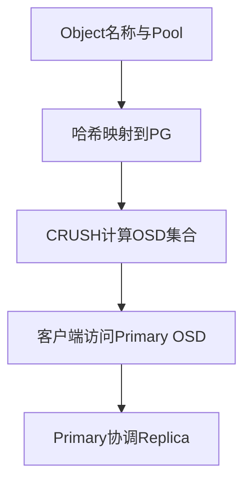
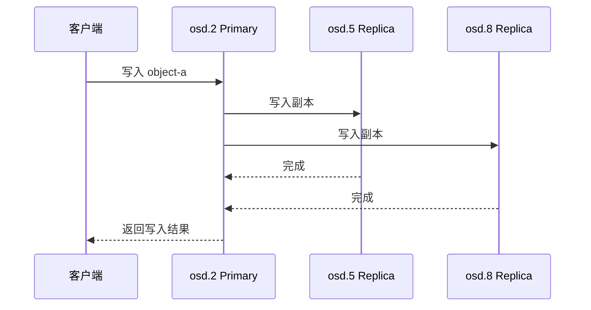
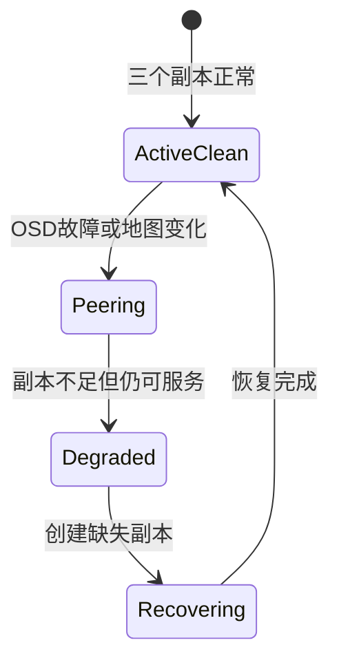

# Ceph 数据组织原理：Object、Pool、PG 与 OSD 到底是什么关系

《Ceph 从零基础到生产运维实战》第 4 篇

← [第 3 篇：Ceph 整体架构](./03-Ceph整体架构.md)

上一篇讲完 Ceph 整体架构后，我们已经知道：

- MON 维护集群地图
- MGR 负责管理和监控
- OSD 真正保存和处理数据
- 客户端获得集群地图后直接访问 OSD

但这里还缺少最关键的一环：

> 集群中可能有成百上千个 OSD，客户端怎么知道一段数据应该写入哪些 OSD？

Ceph 不是把业务文件名直接记录成「位于 osd.3」。它在业务数据与 OSD 之间加入了 Object、Pool 和 PG 等逻辑层，再由 CRUSH 计算数据位置。

本文要讲清下面这条 Ceph 数据定位链路：

```text
业务数据 → RADOS Object → Pool → PG → 一组 OSD
```

理解这条链路后，后续学习 PG 故障、OSD 恢复、CRUSH 规则和性能分析才会真正连贯起来。


## 先看整体关系



可以先用一个不完全严谨、但便于入门的比喻：

| Ceph 概念 | 类比 | 准确含义 |
| --- | --- | --- |
| Object | 包裹 | RADOS 实际管理的数据对象 |
| Pool | 业务仓库 | 对象所属的逻辑存储池 |
| PG | 分拣批次 | 将大量对象组合后映射到一组 OSD |
| OSD | 仓库中的存储单元 | 真正保存对象并处理读写的守护进程 |

这个比喻只用于建立第一印象。PG 不是磁盘分区，Pool 也不是服务器目录，后面会给出准确解释。

## Object：RADOS 实际管理的数据单位

Ceph 底层不是直接以「虚拟磁盘」「Linux 文件」或「S3 对象」的形式统一管理数据，而是把上层数据转换为 **RADOS Object**。

### 不同业务数据如何变成 Object

**RBD**

一个 RBD 镜像会被切分成多个 RADOS 对象。虚拟机看到的是一块连续磁盘，RADOS 看到的则是一组对象。

**CephFS**

CephFS 文件的数据会映射成一个或多个 RADOS 对象；目录结构、权限和 inode 等文件系统元数据由 MDS 管理，并持久化到专用 Pool 中。

**RGW**

应用上传的 S3 对象会由 RGW 转换成底层 RADOS 对象。较大的对象在底层可能采用多个 RADOS 对象组织。

因此，需要区分：

> 用户看到的文件、RBD 镜像或 S3 Object，并不总是与一个 RADOS Object 一一对应。

### Object 包含什么

从数据定位角度看，一个 RADOS 对象至少需要关注：

- 对象名称
- 所属 Pool
- 对象数据
- 对象扩展属性和元数据
- 可选的 Namespace

对象名称和 Pool 共同参与后续的数据定位。同名对象可以存在于不同 Pool 中，因为 Pool 提供了逻辑隔离。

## Pool：对象所属的逻辑存储池

Ceph 官方文档把 Pool 定义为存放 RADOS 对象的逻辑分区。

可以根据业务和数据保护要求创建不同 Pool，例如：

```text
rbd-vm-pool       虚拟机磁盘
cephfs-data       CephFS文件数据
cephfs-metadata   CephFS元数据
rgw-data          RGW对象数据
```

### Pool 决定哪些策略

Pool 通常关联以下配置：

| 配置 | 作用 |
| --- | --- |
| 副本或纠删码类型 | 决定数据保护方式 |
| size | 副本池的目标副本数量 |
| min_size | 允许 IO 所需的最低副本条件 |
| PG 数量与 Autoscaler | 决定对象被分成多少组 |
| CRUSH Rule | 决定使用哪些设备和故障域 |
| Quota | 限制 Pool 容量或对象数 |
| Application Tag | 标记 Pool 供 RBD、CephFS、RGW 等应用使用 |

### Pool 是不是一组固定磁盘

默认情况下不一定。

多个 Pool 可以共同使用相同的 OSD 集合，只是拥有不同的数据保护、PG 和应用配置。

如果希望某个 Pool 只使用 SSD，另一个 Pool 只使用 HDD，需要通过 Device Class 和 CRUSH Rule 实现，而不是仅仅创建两个不同名称的 Pool。

### Pool 是不是目录

不是。

Pool 是 RADOS 逻辑层概念，不是 Linux 文件系统目录。客户端通常通过 RBD、CephFS、RGW 或 librados 访问 Pool 中的对象。

### 查看 Pool

```bash
ceph osd lspools
ceph osd pool ls detail
ceph osd pool autoscale-status
```

这些命令分别用于查看 Pool 列表、详细配置和 PG 自动伸缩建议。

## PG：Object 与 OSD 之间的逻辑中间层

PG 是 Placement Group 的缩写，中文通常称为归置组或放置组。

PG 是 Ceph 新人最容易混淆的概念。最重要的定义是：

> **大量 Object 先映射到有限数量的 PG，再由 PG 映射到一组 OSD。**



### 为什么不让 Object 直接映射 OSD

假设集群中有十亿个对象。如果 Ceph 需要逐个记录每个对象的放置位置、历史状态和恢复过程，管理成本会非常高。

加入 PG 后，Ceph 可以把一批对象作为一个逻辑组进行：

- 数据放置
- 副本管理
- Peering
- Recovery
- Backfill
- Scrub 状态管理

官方 PG 设计说明指出，使用 PG 这一层间接映射，可以减少逐对象跟踪放置历史带来的元数据和处理开销。

### PG 属于谁

每个 PG 只属于一个 Pool。

PG ID 通常由 Pool ID 和 PG 编号组成，例如：

```text
3.a
```

可以把它理解为：

```text
Pool ID：3
该 Pool 中的 PG 编号：a（十六进制）
```

### PG 会保存在哪些 OSD 上

一个 PG 会通过 CRUSH 映射到一组 OSD。这组当前负责该 PG 的 OSD 称为 **Acting Set**。

假设一个三副本 PG 当前映射结果为：

```text
acting [2,5,8]
```

通常表示：

```text
osd.2：Primary OSD
osd.5：Replica OSD
osd.8：Replica OSD
```

Acting Set 中的第一个 OSD 通常是 Primary，负责协调该 PG 的客户端请求和副本操作。

### PG 是不是越多越好

不是。

PG 太少可能导致：

- 数据分布粒度过粗
- OSD 容量不均衡
- 部分 OSD 负载偏高

PG 太多也会增加：

- OSD 内存消耗
- Peering 复杂度
- 集群状态维护成本
- Recovery 和管理开销

现代 Ceph 通常建议使用 **PG Autoscaler** 结合 Pool 目标容量和业务情况管理 PG 数量，而不是新人直接套用一个固定公式。

## OSD：PG 最终映射到的存储单元

OSD 真正保存 PG 中的对象，并处理数据读写、副本和恢复。

### 一个 OSD 会包含多少 PG

一个 OSD 通常同时承载多个 Pool 的多个 PG 副本。例如：

```text
osd.2
├── 1.3
├── 1.a
├── 3.2
└── 5.f
```

这不表示 OSD 本地存在对应的普通 Linux 目录，而是表示这些 PG 的对象由该 OSD 负责保存和管理。

### 一个 PG 会对应多少 OSD

由 Pool 的数据保护策略决定：

- 三副本 Pool：PG 通常对应三个 OSD
- 两副本 Pool：PG 通常对应两个 OSD
- 纠删码 Pool：PG 对应 k + m 个数据块和校验块位置

所以，三副本表示一个 PG 的对象在三份 OSD 位置上保存，不是说一个对象会属于三个不同 PG。

### Up Set 与 Acting Set

排障时可能看到两组 OSD：

- **Up Set**：根据当前 CRUSH 规则计算出的目标 OSD 集合
- **Acting Set**：当前实际负责这个 PG 的 OSD 集合

集群健康稳定时，两者通常一致。在故障、恢复、临时映射或迁移期间，它们可能不同。

## 对象是如何找到 OSD 的

下面把完整定位过程串起来。

### 第一步：确定 Object 属于哪个 Pool

业务使用 RBD、CephFS、RGW 或 librados 访问数据时，首先已经确定了目标 Pool。

不同 Pool 可以采用不同副本数、纠删码配置和 CRUSH 规则。

### 第二步：Object 映射到 PG

Ceph 根据对象名称的哈希结果和 Pool 的 PG 配置，把 Object 稳定映射到某个 PG。

这里使用「稳定映射」很重要：同一个对象在集群地图不变时，会计算到相同 PG，而不是每次随机选择。

### 第三步：PG 通过 CRUSH 映射到 OSD 集合

客户端结合：

- PG
- OSD Map
- CRUSH Map
- Pool 的 CRUSH Rule
- 副本或纠删码策略

计算出该 PG 的目标 OSD 集合。

### 第四步：客户端访问 Primary OSD

客户端向 Primary OSD 发送请求。Primary 负责协调 Replica OSD 完成所需的副本操作。



这一设计带来了两个重要结果：

1. 客户端不需要向中心服务器查询每个对象的位置
2. 集群扩容或 OSD 变化后，可以通过新的地图重新计算数据位置

## 一次三副本写入过程

假设对象 `object-a` 属于 `pool-a`，最终映射到 PG `3.a`，Acting Set 为 `[2,5,8]`。



简化流程如下：

1. 客户端根据地图计算出 PG 和 Acting Set
2. 客户端向 Primary `osd.2` 发送写请求
3. Primary 协调 `osd.5` 和 `osd.8` 写入副本
4. 按照当前 Pool 策略达到必要写入条件
5. Primary 向客户端确认写入结果

实际 Ceph 写入还涉及日志、事务、对象版本和一致性等机制，但入门阶段先掌握 Primary 协调副本这一主线。

### 读取时访问谁

在普通副本池的常规读取路径中，客户端通常向 Primary OSD 请求数据。Ceph 也存在副本读取和读取均衡相关能力，但不能简单理解成客户端每次随意读取任意一个副本。

## OSD 故障后 PG 会发生什么

假设 PG `3.a` 原来的 Acting Set 为：

```text
[2,5,8]
```

如果 `osd.5` 发生故障，集群可能经历下面的过程：



### 1. OSD 被检测为 Down

其他 OSD 和 MON 发现 `osd.5` 无法正常通信，新的 OSD Map 反映其状态变化。

### 2. PG 执行 Peering

PG 相关 OSD 交换状态和日志，确认谁拥有权威、完整的数据版本，并决定当前是否能够继续提供 IO。

### 3. PG 进入降级状态

如果仍有足够副本满足 Pool 的最低 IO 条件，PG 可能继续提供服务，但会显示 `degraded` 或 `undersized` 等状态。

### 4. 开始 Recovery 或 Backfill

Ceph 选择新的 OSD 补充副本，并从健康副本复制缺失数据。

### 5. 恢复 Active+Clean

当目标副本数恢复、对象状态一致后，PG 重新回到理想状态 `active+clean`。

## 常见 PG 状态怎么理解

`ceph -s` 会汇总 PG 状态。一个 PG 可以同时包含多个状态，例如 `active+undersized+degraded`。

| PG 状态 | 基本含义 |
| --- | --- |
| active | PG 可以处理客户端请求 |
| clean | 对象副本数量和状态符合要求 |
| active+clean | 正常理想状态 |
| peering | OSD 正在协商 PG 的权威状态 |
| degraded | 部分对象缺少目标副本 |
| undersized | PG 当前 OSD 数量少于 Pool 配置的目标数量 |
| recovering | 正在恢复缺失或过期对象 |
| backfilling | 正在向新的 OSD 批量迁移和填充数据 |
| inactive | PG 暂时不能正常处理 IO |
| inconsistent | Scrub 发现对象副本之间存在不一致 |

需要注意：

- `degraded` 不一定表示数据已经丢失，但数据保护级别下降
- `active` 不等于 `clean`，能提供 IO 的 PG 仍可能处于降级状态
- `inactive` 比单纯 `degraded` 更严重，因为它已经影响数据访问
- 不要看到 `inconsistent` 就立即执行 Repair，应先分析不一致来源和权威副本

详细处理方法会放到后面的 PG 故障实战文章中。

## 如何从 Object 定位到 OSD

Ceph 提供了一个非常实用的只读查询命令：

```bash
ceph osd map <pool-name> <object-name>
```

例如：

```bash
ceph osd map pool-a object-a
```

输出会包含类似信息：

```text
osdmap e120 pool 'pool-a' (3) object 'object-a' -> pg 3.a -> up ([2,5,8], p2) acting ([2,5,8], p2)
```

可以这样解读：

| 输出 | 含义 |
| --- | --- |
| e120 | OSD Map 版本 Epoch |
| Pool ID 3 | pool-a 对应的数字 ID |
| pg 3.a | 对象映射到的 PG |
| up [2,5,8] | CRUSH 计算出的目标 OSD 集合 |
| acting [2,5,8] | 当前实际处理该 PG 的 OSD 集合 |
| p2 | Primary 为 osd.2 |

这条命令是理解数据分布和排查特定对象问题的重要工具。

其他常用只读命令：

```bash
ceph pg stat
ceph pg dump pgs_brief
ceph osd tree
ceph osd df
ceph osd pool ls detail
ceph osd pool autoscale-status
```

生产集群排查时应优先使用只读命令确认状态，再决定是否执行修改、Repair、Out 或删除操作。

## 为什么 OSD 数量和 PG 分布会影响均衡

Ceph 通过哈希和 CRUSH 实现近似均匀的数据分布，但不是把每个 OSD 精确写到完全相同的字节数。

最终分布会受到以下因素影响：

- PG 数量
- Pool 数量
- 副本或纠删码配置
- OSD 权重和容量
- CRUSH 层级和故障域
- 设备类型
- 数据对象大小及数量
- OSD 新增、故障和恢复过程

如果 PG 数量太少，少数 PG 的数据量较大，就可能出现明显容量偏差。增加 PG 可以提高分布粒度，但 PG 过多也会增加资源消耗。

因此，判断集群是否均衡不能只看 OSD 数量，还需要结合 Pool、PG、CRUSH 和实际数据量分析。

## 常见误区

**误区一：PG 就是磁盘分区**

PG 是逻辑放置组，不是 Linux 分区，也不能使用 `df` 直接查看某个 PG 的容量。

**误区二：Pool 就是一个目录**

Pool 是 RADOS 逻辑分区。CephFS 目录、RBD 镜像和 RGW Bucket 都不能直接与 Pool 画等号。

**误区三：一个 Object 固定记录在某个 OSD 上**

Object 先映射到 PG，PG 再通过当前集群地图和 CRUSH 规则映射到 OSD。集群变化后，目标 OSD 可能改变。

**误区四：三副本代表一个 Object 属于三个 PG**

一个 Object 属于一个 PG。三副本表示该 PG 的对象由三个 OSD 位置保存。

**误区五：PG 越多，性能一定越好**

PG 太多会增加内存、Peering 和管理开销。应结合 Autoscaler 和集群规模规划。

**误区六：Pool 天然隔离物理磁盘**

不同 Pool 默认可能共用同一组 OSD。要实现 SSD、HDD 或业务级物理隔离，需要设计 CRUSH Rule 和 Device Class。

## 本篇总结

这一篇最重要的是记住下面这条链路：

```text
业务数据 → RADOS Object → Pool → PG → OSD Acting Set
```

具体结论包括：

1. RBD、CephFS 和 RGW 的数据最终都会转换为 RADOS Object
2. Object 必须属于某个 Pool
3. Pool 决定数据保护、PG、CRUSH 规则和配额等策略
4. Object 先映射到 PG，再由 PG 映射到一组 OSD
5. PG 降低了逐对象跟踪位置和恢复状态的管理成本
6. Acting Set 中的 Primary OSD 负责协调请求和副本操作
7. OSD 故障后，PG 会经历 Peering、降级和恢复过程
8. `active+clean` 是 PG 的理想状态
9. `ceph osd map` 可以查询特定对象对应的 PG 和 OSD

**CRUSH 为什么不需要一张「每个对象位于哪块磁盘」的中心索引表，又如何保证副本分散在不同服务器和机架？**


## 自测题

1. Object、Pool、PG 和 OSD 之间是什么关系？
2. 为什么 Ceph 不直接逐个记录所有 Object 所在的 OSD？
3. 一个 PG 是否可以同时属于两个 Pool？
4. 三副本 PG 的 Acting Set 通常包含几个 OSD？
5. up 集合和 acting 集合有什么区别？
6. `active+degraded` 是否表示 PG 完全无法访问？
7. Pool 不同是否代表底层一定使用不同物理磁盘？
8. 如何查询某个对象映射到哪个 PG 和哪些 OSD？

## 参考资料

- [Ceph 官方架构文档](https://docs.ceph.com/en/latest/architecture/)
- [Ceph Pools 文档](https://docs.ceph.com/en/latest/rados/operations/pools/)
- [Placement Group Concepts](https://docs.ceph.com/en/latest/rados/operations/placement-groups/)
- [Placement Group States](https://docs.ceph.com/en/latest/rados/operations/pg-states/)
- [Monitoring OSDs and PGs](https://docs.ceph.com/en/latest/rados/operations/monitoring-osd-pg/)
- [CRUSH Maps](https://docs.ceph.com/en/latest/rados/operations/crush-map/)

→ [第 5 篇：CRUSH 数据分布原理](./05-CRUSH数据分布原理.md)
