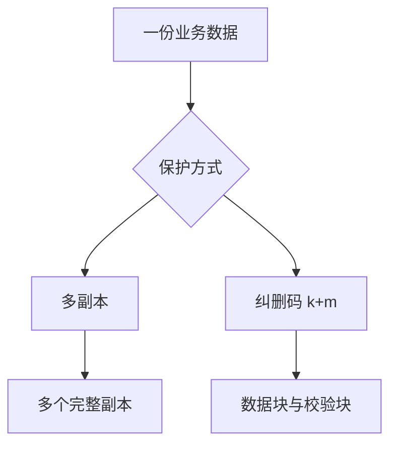
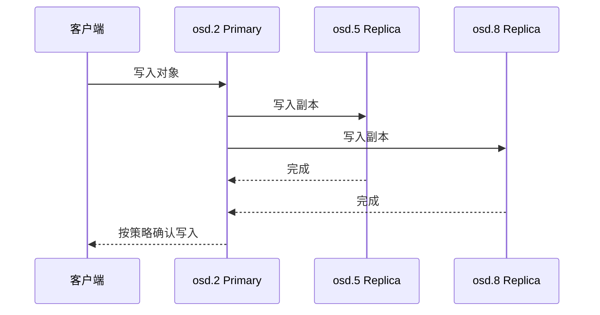
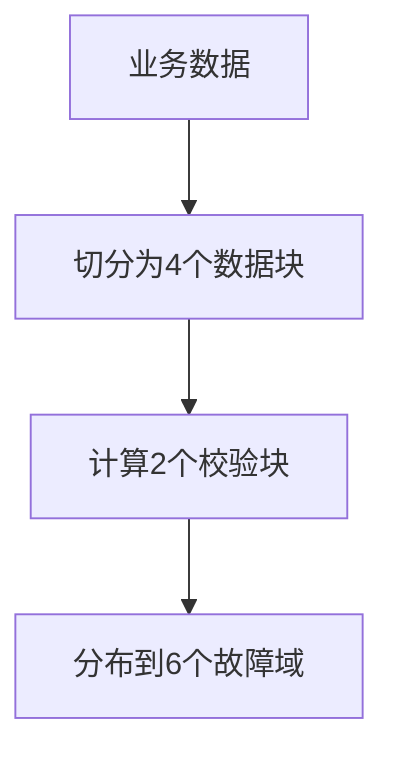
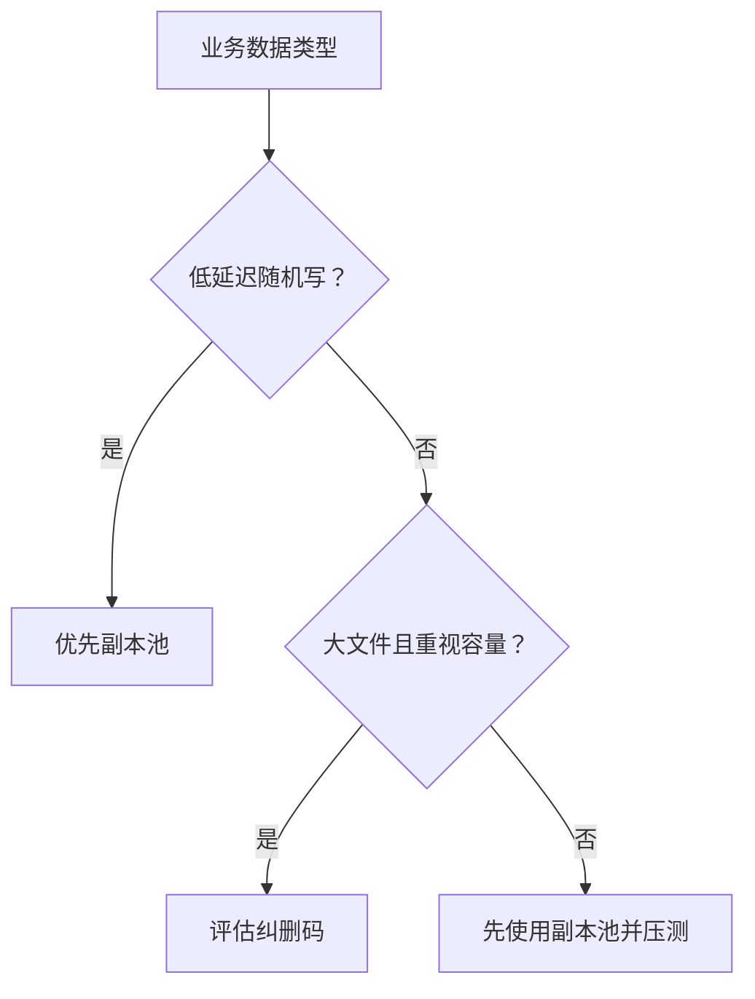

# Ceph 数据保护原理：副本、纠删码、minsize 与 Scrub

《Ceph 从零基础到生产运维实战》第 6 篇

← [第 5 篇：CRUSH 数据分布原理](./05-CRUSH数据分布原理.md)

前面已经讲清楚数据如何经过 Object、Pool、PG 和 CRUSH 找到目标 OSD。

现在需要回答另一个决定生产可靠性的核心问题：

> 数据写到多个 OSD 以后，Ceph 如何保证部分磁盘故障时仍然可以访问和恢复？

Ceph 主要提供两种数据保护方式：

- **Replicated Pool**，也就是副本池
- **Erasure-Coded Pool**，也就是纠删码池

两者都能提供冗余，但容量利用率、性能、恢复成本和适用场景不同。

本文还会讲清几个经常被混淆的概念：

- size 和 min_size
- 三副本与可容忍故障数
- k、m 和 k+m
- Scrub 与 Deep Scrub
- 副本、快照和备份之间的区别

## 1. 为什么数据需要冗余 {/* #为什么数据需要冗余 */}

磁盘和服务器都会故障。可能出现的问题包括：

- 磁盘介质损坏
- OSD 进程崩溃
- 服务器断电
- 网卡或交换机故障
- 机架或机房故障
- 数据静默损坏
- 运维过程中同时下线多个设备

如果一份数据只存在于一个 OSD 中，该 OSD 损坏后就可能永久丢失。

Ceph 通过冗余把数据放到多个故障域，并在副本或数据块缺失时，从剩余数据恢复到目标保护级别。



## 2. 副本池：保存多份完整数据 {/* #副本池保存多份完整数据 */}

副本池会把同一份 RADOS 对象保存到多个 OSD。

以三副本为例：

```text
PG Acting Set：[osd.2, osd.5, osd.8]

osd.2 → 完整副本
osd.5 → 完整副本
osd.8 → 完整副本
```

其中 `osd.2` 通常是 Primary，负责协调客户端请求和其他 Replica。

### 2.1 副本池的优点 {/* #1-副本池的优点 */}

- 原理直观
- 读取和随机写入性能相对较好
- 故障恢复逻辑相对简单
- 适合 RBD 和小块随机 IO
- 所有副本都是完整数据，读取路径直接

### 2.2 副本池的缺点 {/* #2-副本池的缺点 */}

最大的代价是空间利用率。

三副本情况下：

```text
1 TB 业务数据 ≈ 3 TB 原始空间
理论空间利用率 ≈ 33.3%
```

两副本情况下：

```text
1 TB 业务数据 ≈ 2 TB 原始空间
理论空间利用率 = 50%
```

但不能只因为两副本容量更高，就忽略故障重叠时的数据风险。

## 3. size：目标副本数 {/* #size目标副本数 */}

副本池的 `size` 表示每个对象的目标副本数量。

查看配置：

```bash
ceph osd pool get <pool-name> size
```

常见示例：

```text
size = 3
```

表示 Ceph 希望每个对象最终拥有三个副本，并由对应 PG 的三个 OSD 位置保存。

### 3.1 size=3 能容忍几个故障 {/* #size3-能容忍几个故障 */}

理论上，如果三个副本位于三个独立故障域，丢失其中一个副本后，数据仍有两份；丢失两个副本后，数据仍可能剩一份。

但「数据还剩一份」不等于「集群一定继续允许业务读写」。是否继续提供 IO，还要看 `min_size`、PG 状态以及剩余副本是否拥有权威数据。

同时，副本必须真正跨故障域分布。如果三个 OSD 都在同一台 Host 中，Host 故障会同时失去三个副本。

## 4. min_size：降级时允许 IO 的最低条件 {/* #minsize降级时允许-io-的最低条件 */}

`min_size` 用于控制副本池在降级情况下，至少需要多少有效副本条件才能继续处理 IO。

查看配置：

```bash
ceph osd pool get <pool-name> min_size
```

常见组合示例：

```text
size = 3
min_size = 2
```

可以用下面的简化表理解：

| 可用副本情况 | PG 状态与业务影响 |
| --- | --- |
| 3 份 | 正常达到目标副本数 |
| 2 份 | 可能降级但仍允许 IO，并等待恢复第三份 |
| 1 份 | 低于 `min_size=2`，通常停止 IO 以保护一致性 |
| 0 份 | 数据不可访问 |

### 4.1 min_size 不是「允许丢失的副本数」 {/* #minsize-不是允许丢失的副本数 */}

下面两个概念不同：

- `size` 决定目标保存多少份
- `min_size` 决定降级到什么程度时仍允许 IO

### 4.2 为什么不建议随意改成 min_size=1 {/* #为什么不建议随意改成-minsize1 */}

如果三副本池只剩一个副本时仍允许写入，虽然可能短期恢复业务，但风险非常高：

- 最后一份数据再次故障就可能永久丢失
- 网络分区和 OSD 反复上下线时，状态判断更复杂
- 恢复期间缺乏足够冗余
- 错误操作可能扩大故障

因此，降低 `min_size` 不能作为常规「解除告警」手段。只有在充分确认数据状态、风险和恢复路径后，才可能作为特殊应急决策。

## 5. 三副本写入和故障恢复过程 {/* #三副本写入和故障恢复过程 */}

假设三副本 PG 的 Acting Set 为：

```text
[osd.2, osd.5, osd.8]
```

### 5.1 正常写入 {/* #正常写入 */}



Primary 负责协调对象版本和副本写入，达到当前策略要求后再向客户端返回结果。

### 5.2 一个 OSD 故障 {/* #一个-osd-故障 */}

如果 `osd.5` 故障：

1. PG 发现副本数不足
2. PG 可能显示 `active+undersized+degraded`
3. 如果仍满足 `min_size`，业务可以继续 IO
4. CRUSH 选择新的 OSD
5. Ceph 从健康副本恢复缺失对象
6. 恢复完成后回到 `active+clean`

自动恢复依赖两个前提：

- 存在健康、可用的权威副本
- 集群还有足够的故障域和剩余容量

## 6. 纠删码：数据块加校验块 {/* #纠删码数据块加校验块 */}

纠删码不会保存多份完整对象，而是把数据切分成 **k** 个数据块，再计算 **m** 个校验块。

```text
k = 数据块数量
m = 校验块数量
k + m = 每个对象条带需要的总块数
```

例如 k=4、m=2：

```text
数据块：D1 D2 D3 D4
校验块：C1 C2
总块数：6
```

这些块会通过 CRUSH 分布到不同 OSD 或故障域。



理论上，k=4、m=2 可以在任意两个块丢失时，利用剩余块重建原始数据。

但这要求 CRUSH 规则、故障域数量和数据状态满足设计条件，不能只看参数得出绝对容灾承诺。

## 7. 纠删码容量怎么计算 {/* #纠删码容量怎么计算 */}

纠删码的空间放大系数：

```text
空间放大系数 = (k + m) ÷ k
```

理论空间利用率：

```text
理论利用率 = k ÷ (k + m)
```

### 7.1 k=4、m=2 {/* #k4m2 */}

```text
空间放大系数 = 6 ÷ 4 = 1.5
理论利用率 = 4 ÷ 6 ≈ 66.7%
```

存储 1TB 业务数据，大约需要 1.5TB 原始空间。

### 7.2 台 2TB 服务器示例 {/* #10-台-2tb-服务器示例 */}

原始容量：

```text
10 × 2 TB = 20 TB
```

使用 k=4、m=2 纠删码：

```text
理论业务容量 = 20 TB × 4 ÷ 6 ≈ 13.33 TB
```

如果预留 20% 用于恢复、分布不均衡和运行安全：

```text
建议规划容量 ≈ 13.33 TB × 80% ≈ 10.67 TB
```

与三副本进行对比：

| 方案 | 理论可用容量 | 预留 20% 后的估算容量 |
| --- | --- | --- |
| 三副本 | 约 6.67TB | 约 5.33TB |
| EC 4+2 | 约 13.33TB | 约 10.67TB |

这只是容量估算，不代表 10 台机器一定应该选择 EC 4+2。还要评估性能、故障域、恢复时间和业务类型。

## 8. 纠删码为什么更省空间但更复杂 {/* #纠删码为什么更省空间但更复杂 */}

### 8.1 写入需要编码计算 {/* #1-写入需要编码计算 */}

数据写入时需要切分数据并计算校验块，比简单复制完整副本更消耗 CPU 和计算资源。

### 8.2 小块随机写成本更高 {/* #2-小块随机写成本更高 */}

部分写入可能涉及读取、修改和重新计算相关数据块及校验块，写放大和延迟通常高于副本池。

### 8.3 故障读取需要重建 {/* #3-故障读取需要重建 */}

某个数据块不可用时，需要读取其他数据块和校验块，计算出缺失内容。

### 8.4 Recovery 和 Backfill 更重 {/* #4-recovery-和-backfill-更重 */}

恢复缺失块需要读取多个剩余块并进行解码，产生更多网络、磁盘和 CPU 开销。

### 8.5 对故障域数量有要求 {/* #5-对故障域数量有要求 */}

k=4、m=2 通常需要至少 6 个可选 CRUSH 故障域。如果 Failure Domain 为 Host，至少需要 6 台可用 Host，规划上最好还留有额外故障域用于维护和恢复。

## 9. RBD 和 CephFS 能不能使用纠删码 {/* #rbd-和-cephfs-能不能使用纠删码 */}

可以，但不能简单地把所有相关 Pool 都改成纠删码。

### 9.1 EC Pool 默认更适合完整对象写入 {/* #1-ec-pool-默认更适合完整对象写入 */}

RGW 的大对象数据天然比较适合纠删码。RBD 和 CephFS 存在覆盖写和小块随机写，需要根据 Ceph 能力启用 EC Overwrite，并进行充分测试。

相关设置示例：

```bash
ceph osd pool set <ec-data-pool> allow_ec_overwrites true
```

这要求使用支持该能力的 BlueStore OSD。

### 9.2 元数据通常仍使用副本池 {/* #2-元数据通常仍使用副本池 */}

纠删码 Pool 对部分元数据能力存在限制，常见设计是：

| 业务 | 元数据 Pool | 数据 Pool |
| --- | --- | --- |
| RBD | 副本池 | 可选择副本池或 EC Pool |
| CephFS | 副本池 | 可选择副本池或 EC Pool |
| RGW | 索引、元数据使用副本池 | 大对象数据可使用 EC Pool |

这也是为什么一个业务往往不只使用一个 Pool。

### 9.3 能使用不等于适合 {/* #3-能使用不等于适合 */}

数据库、虚拟机系统盘和低延迟随机写业务，通常更偏向副本池。大文件、归档、备份和对象数据更可能从纠删码的容量优势中获益。

必须通过实际业务压测，而不是只按理论容量做选型。

## 10. 副本池和纠删码池怎么选 {/* #副本池和纠删码池怎么选 */}

| 对比项 | 副本池 | 纠删码池 |
| --- | --- | --- |
| 数据保护方式 | 保存多个完整副本 | k 个数据块加 m 个校验块 |
| 空间利用率 | 较低 | 较高 |
| 随机写性能 | 通常较好 | 通常较弱 |
| CPU 开销 | 较低 | 编解码开销较高 |
| 故障恢复 | 直接复制健康副本 | 读取多个块并重建 |
| 小规模集群 | 相对容易规划 | 受 k+m 故障域限制 |
| 常见场景 | RBD、元数据、热数据 | RGW 大对象、归档、冷数据 |

可以采用以下选型思路：



## 11. Ceph 如何检查副本一致性 {/* #ceph-如何检查副本一致性 */}

多副本并不代表副本永远不会出现差异。硬盘可能发生静默损坏，内存、控制器或传输过程也可能造成异常。

Ceph 通过 Scrub 和 Deep Scrub 定期检查 PG 中的对象一致性。

### 11.1 Scrub {/* #1-scrub */}

普通 Scrub 主要检查对象元数据和副本之间的结构性一致性，例如对象是否缺失、大小和属性是否一致。

### 11.2 Deep Scrub {/* #2-deep-scrub */}

Deep Scrub 会进一步读取对象数据并结合校验信息检查内容，能够发现部分静默数据损坏问题。

| 检查方式 | 主要范围 | 资源开销 |
| --- | --- | --- |
| Scrub | 对象元数据和副本结构 | 相对较低 |
| Deep Scrub | 对象数据及校验 | 较高 |

Deep Scrub 需要读取大量数据，可能增加磁盘负载和业务延迟，因此生产环境要合理安排时间窗口和并发。

### 11.3 查看 Scrub 相关状态 {/* #3-查看-scrub-相关状态 */}

```bash
ceph -s
ceph health detail
ceph pg dump pgs_brief
```

手动触发特定 PG 检查：

```bash
ceph pg scrub <pg-id>
ceph pg deep-scrub <pg-id>
```

不要在不了解集群负载和故障状态时，对大量 PG 同时手动执行 Deep Scrub。

## 12. 发现 inconsistent 后怎么办 {/* #发现-inconsistent-后怎么办 */}

如果 Scrub 发现副本之间不一致，PG 可能出现：

```text
active+clean+inconsistent
```

或者集群出现：

```text
PG_DAMAGED
OSD_SCRUB_ERRORS
```

建议按照以下顺序处理。

### 12.1 第一步：确认告警范围 {/* #第一步确认告警范围 */}

```bash
ceph health detail
ceph pg stat
```

### 12.2 第二步：查看 PG 详情 {/* #第二步查看-pg-详情 */}

```bash
ceph pg query <pg-id>
```

### 12.3 第三步：列出不一致对象 {/* #第三步列出不一致对象 */}

```bash
rados list-inconsistent-obj <pg-id> --format=json-pretty
```

### 12.4 第四步：检查相关 OSD 和硬件 {/* #第四步检查相关-osd-和硬件 */}

重点查看：

- OSD 日志
- SMART 信息
- 内核磁盘错误
- BlueStore 校验错误
- 网络及控制器异常
- 是否有 OSD 反复重启

### 12.5 第五步：判断权威副本后再修复 {/* #第五步判断权威副本后再修复 */}

修复命令为：

```bash
ceph pg repair <pg-id>
```

但 `repair` 是修改操作，不能看到 `inconsistent` 就立即执行。必须先确认不一致类型、健康副本和底层硬件状态，否则可能用错误数据覆盖正确数据，或者掩盖正在恶化的磁盘问题。

## 13. 强一致性应该怎样理解 {/* #强一致性应该怎样理解 */}

在 RADOS 副本池的正常写入路径中，客户端向 Primary OSD 发送请求，Primary 协调副本并管理对象版本。满足当前写入策略后，客户端才收到成功响应。

因此，客户端不会简单地随机向三个副本分别写入，也不应该把 Ceph 理解成「后台慢慢复制、三个副本可能长期各不相同」。

不过，强一致性不意味着：

- 任意数量的故障都能继续读写
- 网络分区时永远优先保持可用
- 应用层事务由 Ceph 自动保证
- 数据误删除可以靠副本恢复

当可用副本低于 `min_size` 或 PG 无法完成 Peering 时，Ceph 可能选择停止 IO，而不是冒险接受无法安全确认的写入。

## 14. 副本、快照、备份和容灾的区别 {/* #副本快照备份和容灾的区别 */}

| 保护方式 | 主要解决的问题 | 能否防止误删除 |
| --- | --- | --- |
| 多副本 / 纠删码 | 磁盘、OSD 和部分节点故障 | 通常不能 |
| 快照 | 保存某个时间点状态 | 在快照仍存在时可以恢复 |
| 独立备份 | 集群外保存可恢复副本 | 可以 |
| 异地容灾 | 机房或区域级灾难 | 根据方案决定 |

如果用户删除一个对象，删除操作可能会正常同步到所有副本。副本只会忠实保存「删除后的正确状态」，不会自动替用户保留旧数据。

因此必须记住：

> **Ceph 副本解决硬件故障，不等于完整的数据备份与容灾方案。**

## 15. 常见误区 {/* #常见误区 */}

**误区一：size=3 表示可以随便坏两个节点**

还要看副本是否跨独立故障域、`min_size` 配置、剩余副本状态以及故障是否重叠。

**误区二：min_size=2 表示最少永久保存两份**

`min_size` 主要控制降级时允许 IO 的条件，目标副本数量仍由 `size` 决定。

**误区三：把 min_size 改成 1 就能安全恢复业务**

这会显著降低保护水平。它可能是极端情况下的风险决策，不是常规修复办法。

**误区四：纠删码可以免费提升容量**

纠删码会增加 CPU、网络、小写和恢复成本，并要求足够的故障域。

**误区五：EC 4+2 只需要两台服务器**

k+m=6 意味着通常需要至少 6 个可选故障域。如果 Failure Domain 为 Host，就需要至少 6 台合适的 Host。

**误区六：Scrub 会自动解决所有数据错误**

Scrub 负责检查；Repair 能否安全修复取决于错误类型和权威副本。底层磁盘故障仍需处理。

**误区七：三副本可以替代备份**

误删除、应用覆盖和集群级事故会影响所有副本，仍然需要独立备份。

## 16. 本篇总结 {/* #本篇总结 */}

需要掌握以下结论：

1. 副本池保存多份完整对象，性能和恢复逻辑相对直接
2. `size` 是目标副本数，`min_size` 是降级时允许 IO 的最低条件
3. 三副本常见组合为 `size=3`、`min_size=2`，但应以实际 Pool 配置为准
4. 副本数必须与 CRUSH 故障域一起分析
5. 纠删码把数据分为 k 个数据块和 m 个校验块
6. EC 4+2 理论空间利用率约 66.7%，但性能与恢复成本更高
7. RBD 和 CephFS 使用 EC 数据 Pool 时，元数据通常仍需要副本 Pool
8. Scrub 检查对象和副本结构，Deep Scrub 进一步检查数据内容
9. 出现 `inconsistent` 时应先分析，再谨慎执行 Repair
10. 多副本和纠删码不等于备份

**部署 Ceph 之前，服务器角色、CPU、内存、磁盘、网络和故障域应该怎样规划？**

## 17. 自测题 {/* #自测题 */}

1. `size` 和 `min_size` 分别控制什么？
2. `size=3`、`min_size=2` 时只剩一个副本，通常会发生什么？
3. EC 4+2 中的 4 和 2 分别表示什么？
4. 20TB 原始容量使用 EC 4+2，理论业务容量是多少？
5. 为什么纠删码的小块随机写成本通常高于副本池？
6. RBD 使用 EC 数据 Pool 时，为什么通常还要准备副本元数据 Pool？
7. Scrub 与 Deep Scrub 有什么区别？
8. 为什么不应该看到 `inconsistent` 就立即执行 `ceph pg repair`？
9. 为什么三副本不能代替独立备份？

### 17.1 参考答案 {/* #参考答案 */}

1. `size`是PG期望保存的副本数或EC分片集合规模；`min_size`是PG允许继续处理IO所需的最少可用副本/分片数，主要影响降级时可用性与数据风险。
2. 只剩1个副本低于`min_size=2`，PG通常不再允许正常IO，表现为不可用/阻塞，以避免在唯一副本上继续写入扩大数据丢失风险。
3. `k=4`表示4个数据分片，`m=2`表示2个校验分片；任意满足可恢复条件的4个分片可重建原数据，通常能容忍2个分片故障，但故障域和配置仍必须正确。
4. 理论利用率为`4/(4+2)=66.67%`，20TB Raw理论业务容量约`13.33TB`，未扣除元数据、BlueStore和安全水位。
5. 小块覆盖可能需要读取旧数据/校验、重新编码并写多个分片，产生读改写和网络放大；副本池可直接向多副本写相同数据，路径更简单。
6. RBD元数据与小对象操作需要覆写语义，普通EC Pool通常不适合作为元数据Pool；常用副本Pool保存RBD元数据，启用overwrite能力的EC Pool保存大块数据。
7. Scrub核对对象元数据、存在性和基本一致性；Deep Scrub还读取数据并校验内容/校验和，发现介质静默损坏的能力更强但IO开销更大。
8. `inconsistent`可能来自磁盘、内存、链路或副本内容差异。盲目repair可能用错误副本覆盖正确副本；应先查`rados list-inconsistent-*`、OSD日志、SMART和读错误，确认权威数据来源。
9. 副本共享集群控制面和故障域，会同步删除、勒索、应用逻辑损坏与运维误操作；备份需要独立位置、历史版本、访问隔离和定期恢复验证。

## 18. 参考资料 {/* #参考资料 */}

- [Ceph Pools 文档](https://docs.ceph.com/en/latest/rados/operations/pools/)
- [Ceph 纠删码文档](https://docs.ceph.com/en/latest/rados/operations/erasure-code/)
- [Erasure Code Profiles](https://docs.ceph.com/en/latest/rados/operations/erasure-code-profile/)
- [Placement Group States](https://docs.ceph.com/en/latest/rados/operations/pg-states/)
- [Ceph Health Checks](https://docs.ceph.com/en/latest/rados/operations/health-checks/)
- [Monitoring OSDs and PGs](https://docs.ceph.com/en/latest/rados/operations/monitoring-osd-pg/)

→ [第 7 篇：部署前的集群规划](../03-deployment/07-部署前的集群规划.md)
