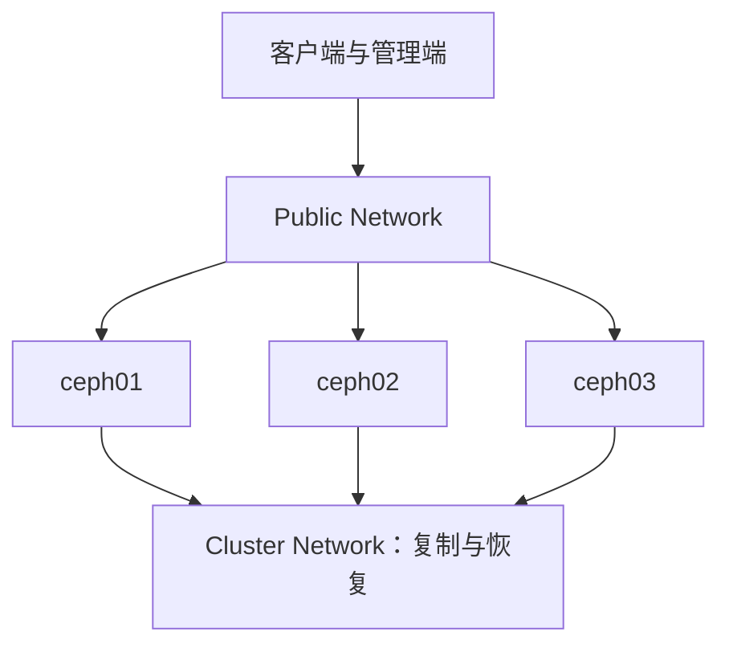

# Cephadm 部署 Ceph：从主机准备到创建 OSD 的完整流程

《Ceph 从零基础到生产运维实战》第 9 篇

← [第 8 篇：Ceph 容量计算](./08-Ceph容量计算.md)

从本篇开始，我们真正动手部署 Ceph。

当前 Ceph 官方推荐使用 **cephadm** 管理容器化 Ceph 集群。它负责：

- Bootstrap 第一个 MON 和 MGR
- 通过 SSH 管理其他主机
- 使用 Podman 或 Docker 运行 Ceph 守护进程
- 根据 ServiceSpec 部署和维护服务
- 添加、替换和移除 OSD
- 部署 Dashboard 和监控组件
- 执行滚动升级

本文将搭建一个三节点学习集群，并同时说明生产环境需要做哪些不同处理。

:::caution 安全提醒
创建 OSD 会初始化匹配到的空白磁盘。请只在实验设备或已经完成数据确认的生产设备上操作。执行任何 `apply osd` 前必须先检查设备并使用 `--dry-run` 预览。
:::

## 1. 实验拓扑 {/* #实验拓扑 */}

本文使用以下示例。请把主机名、网卡和 IP 替换成自己的环境。

| 主机 | Public IP | Cluster IP | 初始角色 |
| --- | --- | --- | --- |
| ceph01 | 10.10.10.11 | 10.20.20.11 | MON、MGR、OSD |
| ceph02 | 10.10.10.12 | 10.20.20.12 | MON、MGR、OSD |
| ceph03 | 10.10.10.13 | 10.20.20.13 | MON、OSD |

网络：

```text
Public Network：10.10.10.0/24
Cluster Network：10.20.20.0/24
```



如果只有一张网卡，可以只配置 Public Network，Bootstrap 时省略 `--cluster-network`。三节点适合学习和功能验证；生产环境还要根据第 7、8 篇中的故障域、容量和恢复要求增加节点与余量。

每台主机假设至少有：

```text
/dev/sda  操作系统盘，不能用于 OSD
/dev/sdb  空白数据盘，准备创建 OSD
```

生产中不应依赖 `/dev/sdb` 永久对应某个槽位，后续应结合型号、大小、序列号或 `/dev/disk/by-id/` 完成设备验收。

## 2. 选择并固定 Ceph 版本 {/* #选择并固定-ceph-版本 */}

部署前先选择仍在支持周期内、适合当前操作系统和容器运行时的 Ceph 稳定版本。

不要在生产文档中写：

```text
安装最新版 Ceph
```

「最新版」会变化，也可能与现有 Podman、内核或客户端不兼容。更可靠的做法是记录：

```text
Ceph 发行名称：<release-name>
Ceph 具体版本：<major.minor.patch>
容器镜像 Digest：<sha256:...>
操作系统版本：<os-version>
Podman 或 Docker 版本：<runtime-version>
```

学习环境可以选官方当前 Active Release；生产环境应先阅读该版本 Release Notes、已知问题和 cephadm 兼容矩阵，再在测试集群验证。

## 3. 所有节点的基础准备 {/* #所有节点的基础准备 */}

cephadm 官方当前要求包括：

- Python 3
- systemd
- Podman 或 Docker
- Chrony 或 ntpd 等时间同步服务
- LVM2
- 可用的 SSH 服务

### 3.1 设置唯一且稳定的主机名 {/* #1-设置唯一且稳定的主机名 */}

在三台主机分别设置：

```bash
hostnamectl set-hostname ceph01
hostnamectl set-hostname ceph02
hostnamectl set-hostname ceph03
```

每台只执行与自己对应的一条。

检查：

```bash
hostname -s
hostname -f
```

cephadm 使用主机名进行调度。主机名、DNS 解析、`hostname` 返回结果不一致，是添加 Host 失败的常见原因。

### 3.2 配置名称解析 {/* #2-配置名称解析 */}

生产环境优先使用可靠 DNS。实验环境可以在所有节点的 `/etc/hosts` 中维护：

```text
10.10.10.11 ceph01
10.10.10.12 ceph02
10.10.10.13 ceph03
```

验证每台节点都能正确解析：

```bash
getent hosts ceph01
getent hosts ceph02
getent hosts ceph03
```

### 3.3 安装基础依赖 {/* #3-安装基础依赖 */}

以 RHEL 兼容系统为例：

```bash
dnf install -y podman lvm2 chrony openssh-server
systemctl enable --now chronyd sshd
```

以 Ubuntu 为例：

```bash
apt update
apt install -y podman lvm2 chrony openssh-server
systemctl enable --now chrony ssh
```

实际选择 Podman 还是 Docker，应根据目标 Ceph 版本的兼容性文档和企业标准决定，不要在同一集群随意混用未经验证的版本。

### 3.4 检查时间同步 {/* #4-检查时间同步 */}

```bash
timedatectl
chronyc tracking
chronyc sources -v
```

重点确认：

- System clock synchronized 为 yes
- 所有节点使用可靠且一致的上游时间源
- 时区不同不会影响时间戳本身，但运维展示应统一
- 没有明显 Clock Skew

MON 时钟不同步可能引发选举、租约和消息处理异常，因此时间同步是集群基础条件，不是可选优化。

### 3.5 检查网络连通与 MTU {/* #5-检查网络连通与-mtu */}

```bash
ip -br addr
ip route
ping -c 3 10.10.10.12
ping -c 3 10.20.20.12
```

如果使用巨帧，必须端到端一致，包括主机、Bond、VLAN、交换机和路由路径。不要只改主机 MTU。

默认常见 TCP 端口包括：

| 服务 | 端口 |
| --- | --- |
| SSH | 22 |
| MON msgr2 | 3300 |
| MON msgr1 | 6789 |
| OSD、MDS、MGR 等 | 6800～7568 |

防火墙应只允许可信 Public/Cluster 网段访问所需端口。容器运行时与防火墙规则交互因操作系统而异，生产变更应逐台验证，不要简单永久关闭防火墙。

### 3.6 核对磁盘 {/* #6-核对磁盘 */}

在每台主机执行：

```bash
lsblk -e7 -o NAME,SIZE,TYPE,FSTYPE,MOUNTPOINTS,MODEL,SERIAL
blkid
pvs
vgs
lvs
```

确认 OSD 候选盘：

- 没有业务数据
- 没有挂载
- 没有仍在使用的文件系统
- 没有遗留 LVM
- 设备型号、序列号和槽位与规划一致

此时不要为了让设备显示 Available 就直接格式化或 Zap。先查清设备为何被占用。

## 4. 在第一台主机安装 cephadm {/* #在第一台主机安装-cephadm */}

在 `ceph01` 操作。

cephadm 可以通过发行版包安装，也可以使用官方 Curl 方式取得初始可执行文件。两种方式二选一，不要混合。

### 4.1 方式 1：发行版提供了目标版本 {/* #方式-1发行版提供了目标版本 */}

例如 Ubuntu 仓库：

```bash
apt install -y cephadm
```

安装前要确认仓库中的版本正是计划使用的版本，而不是只看包名存在。

### 4.2 方式 2：使用官方 Curl 方式 {/* #方式-2使用官方-curl-方式 */}

下面保留版本占位符，执行前必须替换成选定的 Active Release 版本：

```bash
CEPH_RELEASE=<major.minor.patch>
curl --silent --remote-name --location \
  https://download.ceph.com/rpm-${CEPH_RELEASE}/el9/noarch/cephadm
chmod +x cephadm
./cephadm version
```

然后添加所选发行版仓库并安装：

```bash
./cephadm add-repo --release <release-name>
./cephadm install
which cephadm
cephadm version
```

不要直接复制文档中的旧示例版本。应从 Ceph Active Releases 页面确认当前受支持版本，并保存下载文件的校验结果和部署记录。

## 5. Bootstrap 第一个节点 {/* #bootstrap-第一个节点 */}

### 5.1 只有 Public Network {/* #1-只有-public-network */}

```bash
cephadm bootstrap --mon-ip 10.10.10.11
```

### 5.2 Public 与 Cluster Network 分离 {/* #2-public-与-cluster-network-分离 */}

```bash
cephadm bootstrap \
  --mon-ip 10.10.10.11 \
  --cluster-network 10.20.20.0/24
```

`--mon-ip` 必须是其他 Ceph 节点和需要访问 MON 的客户端能够到达的地址。不要误填 BMC 管理地址、临时 DHCP 地址或只能本机访问的地址。

Bootstrap 主要会：

- 在本机创建第一个 MON
- 创建第一个 MGR
- 生成 cephadm 使用的 SSH 密钥
- 把公钥保存到 `/etc/ceph/ceph.pub`
- 写入最小 `/etc/ceph/ceph.conf`
- 写入高权限 `client.admin` Keyring
- 给 Bootstrap 主机添加 `_admin` 标签
- 启用 Dashboard 并输出初始访问提示

保存 Bootstrap 输出，但要把 Dashboard 密码和 Admin Keyring 视为敏感信息，不要粘贴到公开文章、工单或聊天群。

### 5.3 验证最小集群 {/* #3-验证最小集群 */}

```bash
cephadm shell -- ceph -s
cephadm shell -- ceph versions
cephadm shell -- ceph orch ps
```

此时只有一个 MON 和一个 MGR。它是可管理的最小集群，不是已经完成高可用的生产集群。

### 5.4 启用方便的 Ceph CLI {/* #4-启用方便的-ceph-cli */}

可以一直使用：

```bash
cephadm shell -- ceph -s
```

也可以在管理节点安装 `ceph-common`：

```bash
cephadm add-repo --release <release-name>
cephadm install ceph-common
ceph -v
ceph status
```

下文中的 `ceph ...` 命令假设已进入 `cephadm shell`，或者已在带有配置和 Admin Keyring 的管理节点安装 `ceph-common`。如果没有，可以统一加前缀：

```bash
cephadm shell -- ceph <subcommand>
```

## 6. 添加 ceph02 和 ceph03 {/* #添加-ceph02-和-ceph03 */}

### 6.1 分发 cephadm 公钥 {/* #1-分发-cephadm-公钥 */}

在 `ceph01` 执行：

```bash
ssh-copy-id -f -i /etc/ceph/ceph.pub root@ceph02
ssh-copy-id -f -i /etc/ceph/ceph.pub root@ceph03
```

如果企业禁止 Root SSH，可以在 Bootstrap 时使用 `--ssh-user <user>` 指定具有免密 sudo 能力的专用用户。不要临时绕过安全策略。

### 6.2 添加 Host {/* #2-添加-host */}

```bash
ceph orch host add ceph02 10.10.10.12
ceph orch host add ceph03 10.10.10.13
```

显式提供 IP 比依赖当时的 DNS 解析更清晰。

检查：

```bash
ceph orch host ls --detail
ceph cephadm check-host ceph02 10.10.10.12
ceph cephadm check-host ceph03 10.10.10.13
```

如果 `check-host` 子命令在目标版本中的输出或参数不同，以该版本 `ceph cephadm -h` 为准；`ceph orch host ls --detail` 仍应确认 Host 已被编排器管理。

### 6.3 添加管理入口 {/* #3-添加管理入口 */}

让 `ceph02` 也获得 `ceph.conf` 和 Admin Keyring：

```bash
ceph orch host label add ceph02 _admin
```

`_admin` 意味着分发高权限凭据。只应授予受控管理节点，不要给每台普通客户端都添加。

## 7. 部署 MON 和 MGR 高可用 {/* #部署-mon-和-mgr-高可用 */}

创建 `core-services.yaml`：

```yaml
service_type: mon
placement:
  hosts:
    - ceph01
    - ceph02
    - ceph03
---
service_type: mgr
placement:
  hosts:
    - ceph01
    - ceph02
```

应用：

```bash
ceph orch apply -i core-services.yaml --dry-run
ceph orch apply -i core-services.yaml
```

验证：

```bash
ceph -s
ceph quorum_status --format json-pretty
ceph mgr stat
ceph orch ls
ceph orch ps --daemon_type mon --refresh
ceph orch ps --daemon_type mgr --refresh
```

为什么用一个 YAML 一次声明三个 MON？因为 `ceph orch apply mon ceph01`、再执行 `apply mon ceph02` 并不是「逐个追加」；新的 Apply 会覆盖前一个服务放置声明，最后可能只剩后一次指定的 Host。

## 8. 安全创建 OSD {/* #安全创建-osd */}

这是整篇最需要谨慎的步骤。

### 8.1 先查看 cephadm 发现的设备 {/* #1-先查看-cephadm-发现的设备 */}

```bash
ceph orch device ls --wide --refresh
```

关注：

- HOST 和 PATH
- 设备型号、序列号与大小
- AVAILABLE 是否为 Yes
- REJECT REASONS
- 是否误把系统盘、日志盘或 DB 盘当成数据盘

再到对应主机交叉核对：

```bash
lsblk -e7 -o NAME,SIZE,TYPE,FSTYPE,MOUNTPOINTS,MODEL,SERIAL
```

### 8.2 实验环境：匹配所有可用空白设备 {/* #2-实验环境匹配所有可用空白设备 */}

先预览：

```bash
ceph orch apply osd --all-available-devices --dry-run
```

只有输出中的每块设备都确认可被初始化，才执行：

```bash
ceph orch apply osd --all-available-devices
```

这条命令会保存为持久化声明。以后新插入或重新 Zap 后变为 Available 的设备，也可能自动被创建为 OSD。生产环境不应在未理解此行为时使用。

### 8.3 生产环境：使用明确的 OSD ServiceSpec {/* #3-生产环境使用明确的-osd-servicespec */}

先给目标 OSD 主机打标签：

```bash
ceph orch host label add ceph01 osd_hdd
ceph orch host label add ceph02 osd_hdd
ceph orch host label add ceph03 osd_hdd
```

创建 `osd-hdd.yaml`：

```yaml
service_type: osd
service_id: hdd_data
placement:
  label: osd_hdd
spec:
  data_devices:
    rotational: 1
```

这个 Spec 只在带 `osd_hdd` 标签的 Host 上匹配内核识别为旋转盘且满足 Available 条件的设备。

预览：

```bash
ceph orch apply -i osd-hdd.yaml --dry-run
```

逐项核对 Host 和设备后再执行：

```bash
ceph orch apply -i osd-hdd.yaml
```

对于复杂生产环境，可以进一步使用设备型号、容量范围或独立 DB 设备过滤。例如 HDD 做数据盘、指定型号 SSD 做 DB。但任何过滤都可能匹配未来新增设备，必须先理解持久化声明，并为不同磁盘布局使用唯一 `service_id`。

### 8.4 不要把 Zap 当作普通清理命令 {/* #4-不要把-zap-当作普通清理命令 */}

下面命令会擦除设备上的 Ceph/LVM 等元数据，使设备可重新使用：

```bash
ceph orch device zap <hostname> <device-path>
```

它具有破坏性。如果已有 OSD ServiceSpec 会自动匹配该设备，Zap 完成后 cephadm 还可能立即重新创建 OSD。生产中执行前必须确认设备身份、OSD 移除状态、数据已恢复以及 Spec 行为。

### 8.5 验证 OSD {/* #5-验证-osd */}

```bash
ceph orch ps --daemon_type osd --refresh
ceph osd tree
ceph osd stat
ceph osd df tree
ceph -s
```

检查：

- 预期的 OSD 数量是否全部 up 和 in
- 每个 OSD 是否位于正确 Host
- CRUSH 权重是否与容量大致对应
- 是否有设备创建失败
- 是否出现慢请求、认证或网络告警

## 9. 部署后的完整验收 {/* #部署后的完整验收 */}

### 9.1 集群健康 {/* #1-集群健康 */}

```bash
ceph -s
ceph health detail
ceph versions
```

`HEALTH_WARN` 不一定代表部署失败，例如尚未创建 Pool 时可能有相应提示。但每一条告警都要解释清楚，不能为了得到 `HEALTH_OK` 而盲目关闭检查。

### 9.2 编排状态 {/* #2-编排状态 */}

```bash
ceph orch host ls --detail
ceph orch ls
ceph orch ps --refresh
ceph orch device ls --wide --refresh
```

### 9.3 核心服务 {/* #3-核心服务 */}

```bash
ceph mon stat
ceph mgr stat
ceph osd stat
ceph osd tree
```

### 9.4 网络和时间 {/* #4-网络和时间 */}

```bash
chronyc tracking
ss -lntp
ceph orch ps --refresh
```

端口检查命令只是辅助，实际端口应结合 `ceph orch ps`、目标版本和防火墙策略确认。

### 9.5 保存基线 {/* #5-保存基线 */}

建议在受控配置仓库保存：

```bash
ceph orch ls --export > cluster-services.yaml
ceph config dump > ceph-config-dump.txt
ceph osd tree > ceph-osd-tree.txt
ceph versions > ceph-versions.txt
```

这些文件可能包含内部主机名、网段和配置，不能直接发布到公网。Admin Keyring 和 SSH 私钥更不能提交到 Git。

## 10. 常见失败与排查 {/* #常见失败与排查 */}

### 10.1 Bootstrap 无法拉取镜像 {/* #1-bootstrap-无法拉取镜像 */}

检查：

- DNS 和默认路由
- 代理配置
- 容器 Registry 访问
- 私有 Registry 登录信息
- 镜像名称和版本
- Podman/Docker 日志

离线环境应提前同步镜像和软件仓库，并记录镜像 Digest。不要在生产集群临时绕过证书校验。

### 10.2 添加 Host 失败 {/* #2-添加-host-失败 */}

先让 cephadm 执行主机检查：

```bash
ceph cephadm check-host ceph02 10.10.10.12
ceph orch host ls --detail
```

并检查：

- `/etc/ceph/ceph.pub` 是否已加入目标用户 `authorized_keys`
- SSH 用户是否与 Bootstrap 配置一致
- 主机名是否匹配
- Python、LVM2、容器运行时和时间同步是否可用
- 防火墙是否允许 SSH 和 Ceph 通信

`/etc/ceph/ceph.pub` 是公钥，只用于分发，不能作为 SSH 私钥传给 `ssh -i`。

### 10.3 设备显示不可用 {/* #3-设备显示不可用 */}

```bash
ceph orch device ls --wide --refresh
lsblk -f
pvs
blkid
```

根据 REJECT REASONS 查明是否存在分区、文件系统、LVM、挂载或旧 OSD 元数据。只有确认数据不再需要，才进入清理流程。

### 10.4 OSD 创建后不在正确 Host 或设备类 {/* #4-osd-创建后不在正确-host-或设备类 */}

检查：

```bash
ceph osd tree
ceph osd crush class ls
ceph osd crush tree --show-shadow
ceph orch ls --service_type osd --export
```

确认 ServiceSpec 的 Placement、设备过滤器和 `crush_device_class` 是否符合设计。

### 10.5 集群只有一个 MON {/* #5-集群只有一个-mon */}

Bootstrap 只创建初始 MON。需要显式应用 MON ServiceSpec，并确认三个 MON 都进入 Quorum。不要通过重复执行 Bootstrap 添加 MON。

## 11. 部署中的常见误区 {/* #部署中的常见误区 */}

**误区 1：Bootstrap 成功就表示生产部署完成**

Bootstrap 只提供第一个 MON 和 MGR。还要部署冗余服务、添加 OSD、验证故障域、设置监控、完成容量和故障演练。

**误区 2：容器化后可以直接用 Podman 重启 Ceph**

Ceph 守护进程由 cephadm 和 systemd 管理。日常操作应通过 `ceph orch` 或 cephadm 提供的接口进行，避免编排器状态与手工容器操作不一致。

**误区 3：设备名相同就代表磁盘相同**

`/dev/sdb` 可能因控制器和启动顺序变化。应结合型号、序列号、槽位、容量和稳定设备标识验证。

**误区 4：为了省事关闭防火墙和 SELinux**

这会把安全问题推迟到上线之后。应按官方端口、网段和目标系统安全机制正确配置并验证。

**误区 5：all-available-devices 只执行一次**

它是持久化声明，未来满足条件的磁盘仍可能被自动使用。

## 12. 本篇总结 {/* #本篇总结 */}

cephadm 部署流程可以概括为：

```text
选择并固定版本
→ 准备主机、时间、网络和容器运行时
→ 在 ceph01 执行 Bootstrap
→ 分发 cephadm SSH 公钥
→ 添加 Host
→ 用 ServiceSpec 部署 MON/MGR
→ 发现并核对磁盘
→ Dry Run 预览 OSD 布局
→ 创建 OSD
→ 完成健康、编排和故障域验收
```

需要记住：

1. 版本、OS 和容器运行时必须先验证兼容性
2. 时间同步、稳定主机名和名称解析是基础条件
3. Bootstrap 创建的是最小集群，不是完整生产集群
4. MON 和 MGR 需要通过 ServiceSpec 形成高可用
5. OSD 创建前必须核对设备并执行 `--dry-run`
6. OSD ServiceSpec 是持久化声明，会继续匹配未来设备
7. zap 会擦除设备信息，不能当作无风险排障命令
8. 部署完成后要保存服务规格和配置基线，但不能泄露密钥

**Host 标签、Placement、ServiceSpec、守护进程操作、维护模式、日志和配置管理。**

## 13. 自测题 {/* #自测题 */}

1. cephadm 部署依赖哪些基础组件？
2. Bootstrap 默认创建哪些 Ceph 核心服务？
3. `/etc/ceph/ceph.pub` 是什么，应该放到哪里？
4. 为什么连续执行三次 `ceph orch apply mon <host>` 可能只保留最后一次声明？
5. `_admin` 标签有什么作用，为什么不应给所有主机添加？
6. `--all-available-devices` 为什么具有持续影响？
7. 创建 OSD 前要核对哪些设备信息？
8. 为什么 Zap 设备后可能自动重新创建 OSD？

## 14. 参考资料 {/* #参考资料 */}

- [Using Cephadm to Deploy a New Ceph Cluster](https://docs.ceph.com/en/latest/cephadm/install/)
- [Host Management](https://docs.ceph.com/en/latest/cephadm/host-management/)
- [Service Management](https://docs.ceph.com/en/latest/cephadm/services/)
- [OSD Service](https://docs.ceph.com/en/latest/cephadm/services/osd/)
- [Network Configuration Reference](https://docs.ceph.com/en/latest/rados/configuration/network-config-ref/)
- [Ceph Releases](https://docs.ceph.com/en/latest/releases/)

→ [第 10 篇：Cephadm 管理机制](./10-Cephadm管理机制.md)
