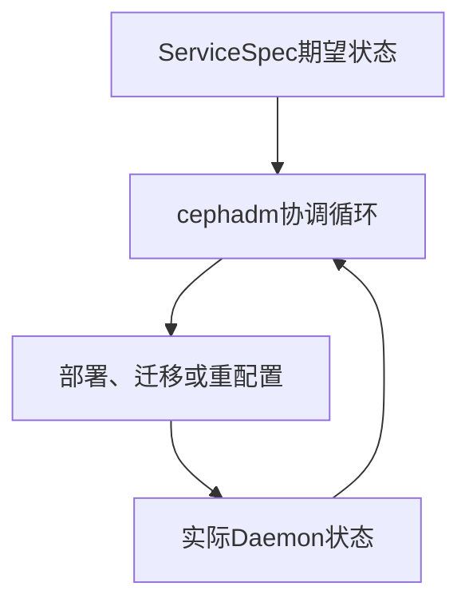

# Cephadm 日常管理：Host、ServiceSpec、维护模式与日志排查

《Ceph 从零基础到生产运维实战》第 10 篇

← [第 9 篇：使用 Cephadm 部署集群](./09-使用Cephadm部署集群.md)

上一篇完成了 cephadm 集群部署，但「能部署」只是起点。

生产运维还需要解决：

- 如何查看 Host、Service 和 Daemon 状态
- 如何使用标签和 Placement 控制服务位置
- 为什么修改 ServiceSpec 后 cephadm 会自动调度
- 如何安全重启一个守护进程
- 主机维护应该使用 Maintenance 还是 Drain
- 容器化 Ceph 的日志在哪里
- 怎样修改配置并保留变更记录
- cephadm 显示的状态为什么可能不是最新
- 移除主机前要完成哪些安全检查

这篇文章会建立 cephadm 的日常管理模型，并给出可直接用于值班的检查流程。


## 先理解四个管理对象

### 1. Host

Host 是被 cephadm 纳管的服务器，例如：

```text
ceph01
ceph02
ceph03
```

查看：

```bash
ceph orch host ls
ceph orch host ls --detail
```

Host 记录包含主机名、管理地址、标签和状态。它不是 CRUSH Host 的完全同义词：前者属于 cephadm 编排层，后者属于数据放置层。多数标准部署会让二者对应，但排障时要明确正在查看哪一层。

### 2. Service

Service 描述一组由同一规则管理的守护进程，例如：

```text
mon
mgr
osd.hdd_data
mds.cephfs
rgw.prod
prometheus
```

查看：

```bash
ceph orch ls
```

### 3. Daemon

Daemon 是 Service 的一个具体实例，例如：

```text
mon.ceph01
mgr.ceph02.xxxxxx
osd.0
osd.1
```

查看：

```bash
ceph orch ps
ceph orch ps --refresh
ceph orch ps --daemon_type osd
ceph orch ps --hostname ceph02
```

### 4. ServiceSpec

ServiceSpec 是声明 Service 应该如何存在的 YAML 配置，例如希望三个 MON 分别运行在三台主机：

```yaml
service_type: mon
placement:
  hosts:
    - ceph01
    - ceph02
    - ceph03
```

cephadm 会持续比较：

```text
期望状态：ServiceSpec
实际状态：当前 Daemon
```

如果两者不一致，cephadm 会尝试调度、部署或移除 Daemon，使实际状态重新符合声明。



这就是 cephadm 最重要的设计思想：**声明式管理**。

## 日常查看状态的正确顺序

当值班人员收到告警时，不要一上来就重启容器。先按层次查看。

### 第 1 层：集群健康

```bash
ceph -s
ceph health detail
```

回答：

- 是容量、PG、OSD、MON 还是 cephadm 告警？
- 业务是否受影响？
- 是否正在 Recovery 或 Backfill？

### 第 2 层：编排器和 Host

```bash
ceph orch status
ceph orch host ls --detail
```

回答：

- cephadm 编排器是否可用？
- 哪台 Host 为 Offline 或 Maintenance？
- SSH、时间、容器运行时或设备信息是否异常？

### 第 3 层：Service

```bash
ceph orch ls --refresh
```

回答：

- 期望 Daemon 数量和实际运行数量是否一致？
- 哪个 Service 处于异常状态？
- 最近是否修改过 Placement 或 Spec？

### 第 4 层：具体 Daemon

```bash
ceph orch ps --refresh
ceph orch ps --hostname ceph02 --refresh
ceph orch ps --daemon_type osd --refresh
```

回答：

- 哪个具体 Daemon 停止、报错或反复重启？
- 它在哪台 Host、使用哪个镜像版本？
- REFRESHED 字段是否足够新？
- 内存使用和限制是否异常？

### 为什么要使用 `--refresh`

`ceph orch ps` 的数据有缓存，默认输出不一定代表此刻状态。排障时关注 REFRESHED 列，必要时添加 `--refresh` 请求重新采集。

但刷新需要 cephadm 连接主机。如果 Host 离线，刷新也不会凭空获得远端实时状态，应继续检查 SSH、网络和主机本身。

## Host 标签和 Placement

### 1. 普通标签

普通标签由管理员定义，本身没有内置动作，主要用于 Placement。

```bash
ceph orch host label add ceph01 mon_nodes
ceph orch host label add ceph02 mon_nodes
ceph orch host label add ceph03 mon_nodes
```

查看：

```bash
ceph orch host ls --label mon_nodes
```

删除：

```bash
ceph orch host label rm ceph03 mon_nodes
```

使用标签 Placement：

```yaml
service_type: mon
placement:
  label: mon_nodes
  count: 3
```

标签适合表达角色或硬件布局：

```text
mon_nodes
mgr_nodes
osd_hdd
osd_nvme
rgw_frontend
rack_a
```

不要让标签名称同时表达太多含义，例如 `fast-prod-rack-a-rgw-osd`，否则后期变更困难。

### 2. 特殊标签

以下标签以下划线开头，由 cephadm 赋予特殊语义。

| 标签 | 作用 |
| --- | --- |
| `_admin` | 向该 Host 分发受管的 `ceph.conf` 和 Admin Keyring |
| `_no_schedule` | 不再向该 Host 调度或部署 Daemon |
| `_no_conf_keyring` | 不向该 Host 分发配置和 Keyring |
| `_no_autotune_memory` | 禁止在该 Host 进行守护进程内存自动调优 |

重要细节：给已有 Daemon 的 Host 添加 `_no_schedule`，cephadm 可能把非 OSD Daemon 迁移到其他符合 Placement 的 Host；已有 OSD 不会仅因为这个标签就自动删除。

### 3. 显式 Host、标签还是 Pattern

| Placement 方式 | 适用场景 | 风险 |
| --- | --- | --- |
| 显式 Hosts | 小集群、MON 等位置必须明确 | 扩容时需要改 Spec |
| Label | 中大型集群、角色或硬件分组 | 错误加标签会触发调度 |
| Host Pattern | 主机命名高度规范、批量部署 | 模式可能匹配意外 Host |
| Count | 只关心实例数 | 仍需配合故障域和 Host 范围 |

生产变更前必须同时查看 Host 标签和当前 Spec，避免「标签改动看似无害，实际触发 Daemon 迁移」。

## ServiceSpec 的安全变更流程

### 1. 导出当前声明

导出全部 ServiceSpec：

```bash
ceph orch ls --export > cluster-services.yaml
```

只导出某类服务：

```bash
ceph orch ls --service-type mgr --export > mgr.yaml
```

只导出指定 Service：

```bash
ceph orch ls --service-name osd.hdd_data --export > osd.hdd_data.yaml
```

### 2. 在版本库中修改

建议流程：

```text
导出当前 Spec
→ 提交基线
→ 创建变更分支
→ 修改 YAML
→ 同行评审
→ Dry Run
→ 执行 Apply
→ 观察健康状态
→ 提交执行记录
```

不要把 Admin Keyring、Registry 密码、TLS 私钥等敏感信息提交到普通 Git 仓库。

### 3. Dry Run

```bash
ceph orch apply -i mgr.yaml --dry-run
```

OSD Spec 尤其要执行 Dry Run：

```bash
ceph orch apply -i osd.hdd_data.yaml --dry-run
```

### 4. 应用并观察

```bash
ceph orch apply -i mgr.yaml
ceph orch ls --service-type mgr --refresh
ceph orch ps --daemon_type mgr --refresh
ceph -s
```

### 5. Apply 不是追加

每次 Apply 都会更新该 Service 的完整期望状态。例如：

```bash
ceph orch apply mon ceph01
ceph orch apply mon ceph02
ceph orch apply mon ceph03
```

不会得到三个 MON，而可能让最后一次声明覆盖前面 Placement。正确写法应一次声明全部位置：

```bash
ceph orch apply mon "ceph01,ceph02,ceph03"
```

更推荐使用经过版本控制的 YAML。

## Daemon 操作：什么时候重启，什么时候重部署

先从 `ceph orch ps` 获得完整 Daemon 名称：

```bash
ceph orch ps --hostname ceph02 --refresh
```

### 1. 启动、停止和重启

```bash
ceph orch daemon start <daemon-name>
ceph orch daemon stop <daemon-name>
ceph orch daemon restart <daemon-name>
```

例如：

```bash
ceph orch daemon restart osd.3
```

执行前要检查：

```bash
ceph -s
ceph orch ps --daemon_type osd --daemon_id 3 --refresh
```

重启 OSD 会让相关 PG 短暂降级。重启 MON 可能影响 Quorum，重启 Active MGR 可能触发主备切换。任何操作都要先确认剩余副本、Quorum 和 Standby 情况。

### 2. Reconfig

Reconfig 让 cephadm 重新生成或下发 Daemon 配置。命令形式以目标版本帮助为准，常见 Daemon 级操作为：

```bash
ceph orch daemon reconfig <daemon-name>
```

它不等于「把容器全部删除重建」。如果配置项本身支持运行时更新，也可能不需要重启。

### 3. Redeploy

Redeploy 重新部署 Daemon 容器或 Service，常用于镜像、挂载配置或容器定义发生变化后的重建。Service 级示例：

```bash
ceph orch redeploy <service-name>
```

它的影响通常大于普通 Reconfig。执行前检查服务冗余并采用滚动方式，不能把整个 MON 或 OSD 服务一次性中断。

### 4. 为什么不建议直接 `podman restart`

cephadm 使用 systemd 单元、容器定义和编排状态管理 Daemon。直接运行：

```bash
podman stop ...
podman rm ...
```

可能造成：

- cephadm 缓存状态与实际不一致
- 容器被 systemd 或协调循环重新拉起
- 手工参数在重部署后丢失
- 值班人员无法从变更记录理解发生了什么

容器运行时命令适合只读诊断；生命周期管理优先使用 `ceph orch`。

## Ceph 配置应该在哪里修改

现代 Ceph 的大部分配置保存在 Monitor 维护的配置数据库中，不应把手工编辑某台主机 `/etc/ceph/ceph.conf` 当作集群级配置方式。

### 1. 查看配置

```bash
ceph config dump
ceph config show osd.3
ceph config get osd osd_memory_target
```

### 2. 配置作用域

常见作用域：

```text
global    所有 Daemon
mon       所有 MON
mgr       所有 MGR
osd       所有 OSD
osd.3     只作用于 osd.3
```

越具体的有效配置通常会覆盖更宽泛作用域的值。

### 3. 设置和删除配置

通用语法：

```bash
ceph config set <who> <option> <value>
ceph config rm <who> <option>
```

修改前先执行：

```bash
ceph config get <who> <option>
ceph config dump
```

并记录旧值、修改原因、影响范围、是否动态生效和回滚方式。

### 4. 不要复制不理解的调优参数

网络文章或旧版本案例中的参数可能已经更名、失效或改变默认值。设置前检查：

- 目标版本官方配置参考
- `ceph config help <option>` 输出
- 是否可 Runtime Update
- 作用域应该是 global、类型还是单个 Daemon
- 是否需要 Restart、Reconfig 或 Redeploy
- 测试环境中对吞吐、尾延迟和恢复的影响

## 容器化 Ceph 的日志在哪里

cephadm 部署的 Daemon 默认把日志交给容器运行环境，并通常进入 journald。因此看不到传统的 `/var/log/ceph/ceph-osd.0.log` 不代表没有日志。

### 1. 先定位 Daemon 所在 Host

```bash
ceph orch ps --daemon_type osd --daemon_id 3 --refresh
```

然后登录该 Host。

### 2. 使用 cephadm 查看单个 Daemon 日志

```bash
cephadm logs --name osd.3 -- -n 200
cephadm logs --name osd.3 -- -f
```

`-n 200` 查看最后 200 行，`-f` 持续跟踪。

### 3. 使用 journalctl

先取得 FSID：

```bash
ceph fsid
```

对应 systemd 单元通常类似：

```bash
journalctl -u 'ceph-<fsid>@osd.3' --since '30 minutes ago'
journalctl -u 'ceph-<fsid>@osd.3' -f
```

可先列出实际单元名，避免猜测：

```bash
systemctl list-units 'ceph-*'
```

### 4. cephadm 自身日志

cephadm 执行和编排相关问题还应查看：

```text
/var/log/ceph/cephadm.log
```

以及 MGR/cephadm 模块对应日志。区分两类问题：

1. Ceph Daemon 本身启动或运行失败
2. cephadm 无法通过 SSH、容器运行时或 ServiceSpec 完成部署

### 5. 收集日志时注意敏感信息

日志可能包含：

- 内部 IP 和主机名
- Pool、租户或 Bucket 名称
- 客户端实体
- Registry 地址
- 命令参数和路径

向外部提交日志前应脱敏，但不要删除故障时间线、Daemon 名称、错误码和版本等关键上下文。

## Maintenance、`_no_schedule` 与 Drain 的区别

这三个概念经常被混用，但它们的影响完全不同。

| 操作 | 核心目的 | 对 OSD 的影响 | 典型场景 |
| --- | --- | --- | --- |
| Maintenance | 临时停止一台 Host 上的 Ceph Daemon | OSD 暂时 Down，不移除数据 | 更换内存、升级内核、短时重启 |
| `_no_schedule` | 阻止 cephadm 继续调度 Daemon 到 Host | 已有 OSD 不会自动删除 | 暂停新调度、准备后续操作 |
| Drain | 永久排空 Host 上的 Daemon | 会调度移除 OSD 并迁移数据 | 服务器退役或永久移除 |

最重要的一句话：

> **主机只是重启维护，用 Maintenance；主机准备永久退出集群，才考虑 Drain。**

不要为了重启服务器执行 Drain。Drain 可能触发整台 Host 的数据迁移，带来巨大 IO 和长时间 Recovery。

## 安全维护一台 Host

假设需要维护 `ceph03`。

### 1. 维护前检查

```bash
ceph -s
ceph health detail
ceph orch host ls --detail
ceph orch ps --hostname ceph03 --refresh
ceph osd tree
```

确认：

- 当前没有其他相关故障
- PG 状态稳定
- MON Quorum 在停掉该 Host 后仍能维持
- MGR 有可用 Standby
- 副本或 EC 剩余块满足业务 IO 条件
- 集群没有正在进行的高风险变更

### 2. 让 cephadm 执行安全检查

```bash
ceph orch host ok-to-stop ceph03
```

如果检查不通过，应解决原因，而不是习惯性添加 `--force`。

### 3. 进入维护模式

```bash
ceph orch host maintenance enter ceph03
```

这会停止并禁用该 Host 上的 Ceph Daemon。随后确认：

```bash
ceph orch host ls --detail
ceph orch ps --hostname ceph03 --refresh
ceph -s
```

### 4. 执行主机维护

例如系统补丁、固件更新或硬件更换。过程中持续监控剩余集群，不要并行维护同一保护集合中的多台 Host。

### 5. 退出维护模式

```bash
ceph orch host maintenance exit ceph03
```

### 6. 维护后验收

```bash
ceph orch ps --hostname ceph03 --refresh
ceph osd tree
ceph -s
ceph health detail
```

等待相关 PG 恢复到预期状态，再关闭变更。

### 关于强制参数

`--force` 和 `--yes-i-really-mean-it` 会绕过部分甚至全部安全检查，可能导致数据不可用、MON 失去 Quorum 或 MGR/编排命令失效。它们不是「命令报错时再加一下」的普通选项。

## 永久移除 Host 的流程

假设 `ceph03` 要退役。这个操作会改变集群拓扑并迁移数据，必须有变更窗口和回滚方案。

### 1. 先检查容量和故障域

```bash
ceph -s
ceph df detail
ceph osd df tree
ceph orch ps --hostname ceph03 --refresh
```

确认剩余集群能够：

- 容纳该 Host 上的数据
- 满足副本或 EC 故障域数量
- 在 Full 阈值之前完成迁移
- 承受 Recovery 带来的性能压力

### 2. 更新所有引用该 Host 的 ServiceSpec

```bash
ceph orch ls --export > before-host-removal.yaml
```

删除或调整 Placement 中的 `ceph03`，先 Dry Run，再 Apply。否则移除 Host 后，Spec 仍会持续期望在不存在的 Host 上部署服务。

### 3. Drain

```bash
ceph orch host drain ceph03
```

Drain 会添加 `_no_schedule` 和 `_no_conf_keyring`，并为该 Host 上的 OSD 安排移除。

监控：

```bash
ceph orch osd rm status
ceph orch ps ceph03
ceph -s
ceph progress
```

不要默认添加 `--zap-osd-devices`。Zap 会擦除设备，只有明确需要且数据迁移已安全完成时才考虑。

### 4. 确认 Daemon 全部移除

```bash
ceph orch ps ceph03
ceph orch osd rm status
ceph osd tree
ceph -s
```

### 5. 从编排器移除 Host

```bash
ceph orch host rm ceph03
```

离线强制移除可能直接清除 OSD 记录并造成数据丢失，不能作为普通「Host 删不掉」的解决方法。

## 服务移除和 Unmanaged 状态

### 1. 移除 Service

通用命令：

```bash
ceph orch rm <service-name>
```

它会移除该 Service 的所有 Daemon。对于 MON、MGR、MDS、RGW、NFS 等服务，影响可能是控制面失效或业务入口中断；对带有数据的服务，风险更高。

执行前至少要：

- 导出 ServiceSpec
- 明确服务依赖和业务流量
- 确认剩余实例和故障域
- 阅读目标版本的服务移除文档
- 设计回滚方式

不要随意使用 `--force-delete-data`。

### 2. Unmanaged 不是停止服务

ServiceSpec 中：

```yaml
unmanaged: true
```

表示 cephadm 暂停根据 Placement 自动部署和移除该 Service 的 Daemon。现有 Daemon 不会因此自动停止。

它适合极少数需要暂时接管布局的场景，但也会失去编排器自动修复能力。完成特殊操作后，应恢复 Managed 并重新核对 Spec。

## 配置和服务变更后的观察方法

一次变更不能以「命令返回 0」作为完成标准。

### 1. 看协调结果

```bash
ceph orch ls --refresh
ceph orch ps --refresh
```

### 2. 看集群健康

```bash
ceph -s
ceph health detail
ceph progress
```

### 3. 看版本和镜像一致性

```bash
ceph versions
ceph orch ps --refresh
```

### 4. 看数据面

```bash
ceph osd stat
ceph osd tree
ceph pg stat
```

### 5. 看业务指标

- 客户端吞吐和 IOPS
- P95/P99/P999 延迟
- 慢请求
- Recovery/Backfill 速率
- 网络重传和磁盘延迟
- 错误率和业务超时

### 6. 设定观察窗口

不同变更的观察时长不同。重启 MGR 可能很快稳定，OSD 迁移或 CRUSH 变更可能持续数小时甚至数天。变更单应说明「达到什么条件才算完成」。

## 常见管理错误

**错误 1：看到 Daemon Error 就立即重启**

先看集群健康、具体日志和依赖。磁盘损坏、网络丢包或容量 Full 不会因为反复重启 OSD 得到根治。

**错误 2：把 `ceph orch ps` 缓存当作实时状态**

关注 REFRESHED 并使用 `--refresh`，同时从目标 Host 的 systemd 和日志交叉验证。

**错误 3：手工改容器参数**

cephadm 下一次 Redeploy 可能覆盖手工变化。持久化变更应进入配置数据库或 ServiceSpec。

**错误 4：Apply MON 三次就是新增三个 MON**

Apply 更新完整期望状态，不是逐条追加。

**错误 5：维护主机使用 Drain**

Drain 用于永久排空，会迁移数据；短期重启使用 Maintenance。

**错误 6：通过 `--force` 绕过所有检查**

强制参数意味着你主动承担 Quorum 丢失、数据不可用或数据丢失风险，必须有明确证据和批准。

**错误 7：删除 Host 但不更新 ServiceSpec**

编排器仍然期望旧 Host 存在，可能持续报错或无法满足实例数。

## 每日与每周巡检建议

### 每日巡检

```bash
ceph -s
ceph health detail
ceph orch host ls
ceph orch ls
ceph osd stat
ceph df
```

重点：新告警、Offline Host、Daemon 数量、容量增长和 Recovery。

### 每周巡检

```bash
ceph orch ps --refresh
ceph orch device ls --wide --refresh
ceph osd df tree
ceph versions
ceph config dump
```

同时检查：

- ServiceSpec 是否与配置仓库一致
- 是否有长期 Down 或 Out 的 OSD
- 设备 SMART/NVMe 健康
- 时间同步与网络错误
- 容量预计达到规划线的日期
- 告警是否存在长期未关闭项
- 最近是否完成恢复和 Scrub

巡检不是为了保存一堆命令输出，而是发现趋势和偏差，并形成可跟踪的处置项。

## 本篇总结

cephadm 日常管理的核心关系是：

```text
Host 承载 Daemon
Service 组织一组 Daemon
ServiceSpec 声明期望状态
cephadm 持续协调实际状态
```

需要记住：

1. `ceph -s` 看集群，`ceph orch ls` 看 Service，`ceph orch ps` 看 Daemon
2. 排障时关注 REFRESHED，必要时使用 `--refresh`
3. 标签会影响 Placement，特殊标签还有内置动作
4. ServiceSpec 变更应走导出、评审、Dry Run、Apply 和观察流程
5. Apply 更新完整声明，不是追加一台 Daemon
6. 守护进程生命周期优先使用 `ceph orch`，不要直接管理容器
7. 集群配置优先使用配置数据库，而不是手工修改单机 `ceph.conf`
8. 短期维护使用 Maintenance，永久退役才使用 Drain
9. cephadm 默认日志通常在 journald，可用 `cephadm logs` 查看
10. 命令成功只是开始，必须验证编排、健康、数据面和业务指标

后续文章将先进入 Pool 与 CephX，再分别创建和使用 CephFS、RBD 与 RGW，并解释它们如何映射到 RADOS Pool。


## 自测题

1. Service 与 Daemon 有什么区别？
2. cephadm 的声明式协调是什么意思？
3. `_admin` 和 `_no_schedule` 分别有什么作用？
4. 为什么修改普通 Host 标签也可能触发 Daemon 变更？
5. `ceph orch ps --refresh` 解决的是什么问题？
6. Reconfig 和 Redeploy 的目的有什么不同？
7. 为什么不推荐直接 `podman restart` Ceph 容器？
8. Maintenance 与 Drain 分别适合什么场景？
9. Host Drain 为什么必须先检查容量和故障域？
10. 一次变更应从哪些层面判断是否真正完成？

## 参考资料

- [Host Management](https://docs.ceph.com/en/latest/cephadm/host-management/)
- [Service Management](https://docs.ceph.com/en/latest/cephadm/services/)
- [Cephadm Operations](https://docs.ceph.com/en/latest/cephadm/operations/)
- [Cephadm Troubleshooting](https://docs.ceph.com/en/latest/cephadm/troubleshooting/)
- [Orchestrator CLI](https://docs.ceph.com/en/latest/mgr/orchestrator/)
- [Centralized Configuration Management](https://docs.ceph.com/en/latest/rados/configuration/ceph-conf/#ceph-configuration-database)

下一篇将从应用视角开始：先设计 Pool 与 CephX 最小权限，再接入 RBD、CephFS 和 RGW。

→ [第 11 篇：Pool 与 CephX 权限管理](../04-client-usage/11-Pool与CephX权限管理.md)
