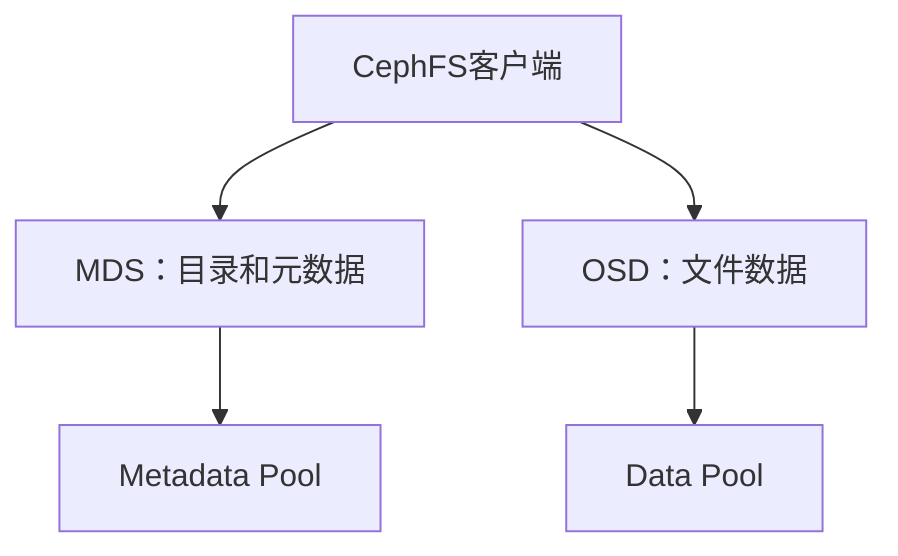

# CephFS 实战：MDS、客户端挂载、Subvolume、Quota 与快照

《Ceph 从零基础到生产运维实战》第 12 篇

← [第 11 篇：Pool 与 CephX 权限管理](./11-Pool与CephX权限管理.md)

上一篇完成了 Pool 与 CephX 权限管理。RBD 像一块远程硬盘，适合虚拟机磁盘、云硬盘和单主机文件系统。

但如果需求是：

> 多台服务器同时访问同一批目录和文件

就需要文件存储接口。Ceph 提供的原生分布式文件系统叫 **CephFS**。

CephFS 常见场景包括：

- 多台应用服务器共享目录
- Kubernetes ReadWriteMany 持久卷
- 用户 Home 目录
- AI 训练数据集和共享工作区
- HPC 临时数据
- 媒体素材与内容生产
- 需要 POSIX 目录、权限和文件语义的业务

本篇将完成：

```text
创建 CephFS
→ 部署 MDS 主备
→ 创建 Subvolume
→ 创建最小权限客户端
→ 使用内核客户端挂载
→ 配置 Quota
→ 创建快照和 Clone
→ 进行 MDS 与客户端故障排查
```

## 1. CephFS 是什么 {/* #cephfs-是什么 */}

CephFS 是构建在 RADOS 之上的 POSIX 分布式文件系统。

客户端看到：

```text
/project/a.txt
/project/models/model.bin
/home/user/report.md
```

Ceph 内部会把两类信息分开保存：

- **文件数据**：保存到 Data Pool
- **文件元数据**：保存到 Metadata Pool，由 MDS 管理

文件元数据包括：

- 目录层级
- 文件名
- Inode
- 所有者与权限
- 时间戳
- 文件锁
- 客户端 Capabilities
- 文件到 RADOS 对象的布局信息



### 1.1 客户端数据是否经过 MDS {/* #客户端数据是否经过-mds */}

一般情况下：

1. 客户端向 MDS 查询目录、权限和文件布局
2. 获得必要信息后，客户端直接访问 OSD 读写文件数据
3. MDS 负责协调元数据缓存、锁和客户端状态

所以 MDS 不是所有文件数据的转发代理，但 MDS 性能会直接影响创建文件、遍历目录、重命名、权限检查等元数据操作。

## 2. CephFS 与 RBD、NFS 有什么区别 {/* #cephfs-与-rbdnfs-有什么区别 */}

| 对比项 | RBD | CephFS | NFS |
| --- | --- | --- | --- |
| 存储接口 | 块 | 文件 | 文件 |
| 客户端看到 | 虚拟磁盘 | 目录树 | 导出目录 |
| 多客户端共享 | 需上层集群文件系统 | 原生支持 | 原生支持 |
| 数据路径 | 客户端直连 OSD | 客户端直连 OSD，元数据经 MDS | 客户端通常经过 NFS Server |
| POSIX 语义 | 由 Image 内文件系统提供 | CephFS 提供 | NFS 协议与服务端文件系统提供 |
| 常见用途 | VM 盘、云硬盘 | 大规模共享目录 | 传统共享文件、兼容旧客户端 |

CephFS 不等于 NFS。CephFS 客户端需要理解 Ceph 协议并访问 MON、MDS 和 OSD；传统 NFS 客户端只需要访问 NFS 服务端。

如果旧业务只能使用 NFS，可以通过 NFS-Ganesha 导出 CephFS，但会增加一层网关和运维组件，因此需要单独评估高可用、性能、权限映射和故障域。

## 3. CephFS 的核心组件 {/* #cephfs-的核心组件 */}

### 3.1 Metadata Pool {/* #1-metadata-pool */}

保存文件系统元数据和 MDS Journal。

Metadata Pool 的特点：

- 容量通常比 Data Pool 小
- 对延迟非常敏感
- 损坏可能导致整个文件系统不可访问
- 必须使用副本池，不能使用 EC 池
- 生产中通常应放在低延迟 SSD/NVMe 设备类上
- 需要较高保护级别和可靠备份策略

### 3.2 Data Pool {/* #2-data-pool */}

保存文件内容对应的 RADOS 对象。

Data Pool 可以根据业务选择：

- 副本池：适合小文件、随机写和性能优先
- 纠删码池：适合大文件、容量效率优先，但要评估小 IO 和恢复成本

CephFS 的默认 Data Pool 还会保存 Inode Backtrace 等小对象信息，因此官方建议默认 Data Pool 优先使用性能较好的副本池，再附加 EC Pool 保存特定目录的大文件数据。

### 3.3 MDS {/* #3-mds */}

MDS 是 Metadata Server。

MDS 负责：

- 维护目录树
- 管理元数据缓存
- 处理文件打开、重命名和权限
- 向客户端发放 Capabilities
- 协调多个客户端缓存一致性
- 把元数据变更记录到 RADOS Journal

MDS 本地磁盘不是元数据的唯一保存位置。MDS 故障后，Standby 可以读取 RADOS 中的 Journal 和 Metadata Pool 接管服务。

## 4. MDS Active、Standby 和 Rank {/* #mds-activestandby-和-rank */}

### 4.1 单 Active MDS {/* #1-单-active-mds */}

默认常见形态：

```text
1 个 Active MDS
+ 1 个或多个 Standby MDS
```

Active 处理当前文件系统元数据，Standby 等待接管。

### 4.2 多 Active MDS {/* #2-多-active-mds */}

CephFS 支持多个 Active Rank，把元数据树动态分区给不同 MDS 处理。

```text
max_mds = 1  → 一个 Active Rank
max_mds = 2  → 两个 Active Rank
```

多 Active 主要用于扩展元数据吞吐，不是简单的「开两个就性能翻倍」。它会增加：

- 元数据迁移
- MDS 间协调
- 负载判断复杂度
- 故障和恢复路径
- 内存需求

在没有证明单 Active MDS 是瓶颈前，不要只为了「高可用」提高 `max_mds`。高可用主要依靠 Standby；多 Active 主要用于性能扩展。

### 4.3 MDS 内存为什么重要 {/* #3-mds-内存为什么重要 */}

MDS 会在内存中缓存活跃元数据。目录和小文件越多、客户端越多、工作集越大，MDS 内存需求越高。

内存不足可能导致：

- 缓存频繁回收
- 元数据操作延迟增加
- MDS 触发健康告警
- 极端情况下被 OOM Kill

因此 CephFS 规划不能只看文件数据容量，还要估算文件数量、目录宽度、并发客户端和元数据工作集。

## 5. 创建 CephFS {/* #创建-cephfs */}

实验示例：

```text
文件系统名称：cephfs-prod
MDS 主机：ceph01、ceph02
客户端：client.team-a
挂载点：/mnt/team-a
```

### 5.1 检查集群 {/* #1-检查集群 */}

```bash
ceph -s
ceph orch status
ceph orch host ls
```

### 5.2 使用 Volume 命令创建 {/* #2-使用-volume-命令创建 */}

```bash
ceph fs volume create cephfs-prod
```

该命令会创建 CephFS 及其 Data Pool 和 Metadata Pool。使用 cephadm 时，编排器能够为文件系统部署 MDS；不同 Ceph 版本的自动 Placement 能力有所区别，因此不能只看命令返回成功。

检查：

```bash
ceph fs ls
ceph fs status cephfs-prod
ceph mds stat
ceph orch ls --service_type mds
ceph orch ps --daemon_type mds --refresh
```

### 5.3 显式声明 MDS 主备位置 {/* #3-显式声明-mds-主备位置 */}

为了让 MDS 位置清晰，可以创建 `mds.cephfs-prod.yaml`：

```yaml
service_type: mds
service_id: cephfs-prod
placement:
  hosts:
    - ceph01
    - ceph02
```

预览并应用：

```bash
ceph orch apply -i mds.cephfs-prod.yaml --dry-run
ceph orch apply -i mds.cephfs-prod.yaml
```

再次验证：

```bash
ceph fs status cephfs-prod
ceph orch ps --service_name mds.cephfs-prod --refresh
```

两台主机应位于独立故障域，且具备足够 CPU、内存和低延迟网络。

### 5.4 检查自动创建的 Pool {/* #4-检查自动创建的-pool */}

```bash
ceph osd pool ls detail
ceph fs get cephfs-prod
ceph df detail
```

确认 Metadata Pool 和 Data Pool 的：

- 副本数
- min_size
- CRUSH 规则
- 设备类
- PG Autoscaler 状态
- 容量配额
- Application 标签

`ceph fs volume create` 解决的是创建流程，不会替你完成所有生产 Pool 设计。

## 6. 手工创建方式为什么仍需要了解 {/* #手工创建方式为什么仍需要了解 */}

某些生产环境需要预先创建带有指定 CRUSH 规则的 Pool。

基本过程是：

```bash
ceph osd pool create cephfs-prod-data
ceph osd pool create cephfs-prod-metadata
ceph fs new cephfs-prod cephfs-prod-metadata cephfs-prod-data
```

然后通过 cephadm 部署对应 MDS Service。

手工方式适用于：

- Metadata 必须使用专用 SSD CRUSH 规则
- Data Pool 需要特定副本或 EC 策略
- 多个 Data Pool 有不同设备类
- 企业要求 Pool 先经过容量与保护策略审批

危险点：

- `ceph fs rm` 只删除 FSMap 中的文件系统定义，不会自动删除 Data 和 Metadata Pool
- 删除 Pool 则可能真正删除文件数据
- 默认 Data Pool 创建后不能像普通附加 Pool 一样随意替换
- Metadata Pool 配置错误会影响整个 CephFS

学习环境可以使用 Volume 命令，生产环境应明确记录自动创建了什么。

## 7. 创建 Subvolume {/* #创建-subvolume */}

Subvolume 是 CephFS 中的独立目录树抽象，常被 Ceph CSI 和 OpenStack Manila 用作租户卷。

创建 100 GiB Subvolume：

```bash
ceph fs subvolume create \
  cephfs-prod team-a \
  --size 100G \
  --namespace-isolated
```

查看信息：

```bash
ceph fs subvolume info cephfs-prod team-a
```

获取路径：

```bash
ceph fs subvolume getpath cephfs-prod team-a
```

输出通常类似：

```text
/volumes/_nogroup/team-a/<uuid>
```

### 7.1 为什么使用 `--namespace-isolated` {/* #为什么使用---namespace-isolated */}

路径限制主要作用于 MDS 管理的目录层级。为了进一步隔离底层 RADOS 数据，可以让 Subvolume 使用独立 RADOS Namespace，并通过 OSD Caps 限制客户端。

这比只限制挂载路径更适合不受信任的多租户环境。

### 7.2 Subvolume 大小的含义 {/* #subvolume-大小的含义 */}

`--size 100G` 通过 Quota 限制该目录树，不是提前分配 100 GiB 物理空间。实际 Raw 占用仍由写入量和 Pool 保护策略决定。

## 8. 创建最小权限 CephFS 用户 {/* #创建最小权限-cephfs-用户 */}

使用 Subvolume 专用授权命令，让 Ceph 同时根据 Subvolume 路径和 RADOS Namespace 生成相应 Caps：

```bash
ceph fs subvolume authorize \
  cephfs-prod team-a team-a \
  --access_level=rw
```

这里第一个 `team-a` 是 Subvolume 名称，第二个 `team-a` 是认证 ID；最终生成的 CephX 实体是 `client.team-a`。与手工复制包含 UUID 的内部路径相比，这种方式更不容易授权错目录，也能正确处理启用了 Namespace 隔离的 Subvolume。

保存 Keyring：

```bash
ceph auth get client.team-a \
  -o /etc/ceph/ceph.client.team-a.keyring
chmod 600 /etc/ceph/ceph.client.team-a.keyring
```

生成只包含 Secret 的文件供 Kernel Mount 使用：

```bash
ceph auth get-key client.team-a \
  > /etc/ceph/team-a.secret
chmod 600 /etc/ceph/team-a.secret
```

查看 Caps：

```bash
ceph auth get client.team-a
```

验证用户：

- 能挂载授权 Subvolume
- 不能挂载根目录
- 不能访问其他团队 Subvolume
- 没有 Admin 权限
- 不能修改 Layout 或 Quota，除非明确授予相应能力

## 9. 使用 Kernel Client 挂载 CephFS {/* #使用-kernel-client-挂载-cephfs */}

Kernel Client 通常是大多数 Linux 场景的首选。

### 9.1 准备客户端 {/* #1-准备客户端 */}

客户端需要：

```text
ceph-common 或 mount.ceph
/etc/ceph/ceph.conf
/etc/ceph/team-a.secret
能够访问 MON、MDS 和 OSD 网络
```

检查：

```bash
stat /sbin/mount.ceph
uname -r
ceph -s --id team-a
```

客户端内核中的 CephFS 驱动版本与 Ceph 服务端版本不是同一个概念。旧内核可能缺少新 Feature 或包含已知 Bug，应按操作系统厂商支持矩阵验证。

### 9.2 创建挂载点 {/* #2-创建挂载点 */}

```bash
mkdir -p /mnt/team-a
```

### 9.3 挂载授权 Subvolume {/* #3-挂载授权-subvolume */}

使用前面获取的真实 Subvolume 路径：

```bash
mount -t ceph \
  team-a@.cephfs-prod=/volumes/_nogroup/team-a/12345678-... \
  /mnt/team-a \
  -o secretfile=/etc/ceph/team-a.secret
```

设备字符串中的点不能省略：

```text
team-a@.cephfs-prod
       ↑
       这里的点表示让 mount helper 从配置中发现 FSID
```

如果客户端没有可用的 `ceph.conf`，需要显式提供 MON 地址和 FSID。生产中应使用多个 MON 地址或可靠的配置发现方式，不要只绑定单个 MON。

### 9.4 验证挂载 {/* #4-验证挂载 */}

```bash
findmnt /mnt/team-a
df -hT /mnt/team-a
touch /mnt/team-a/cephfs-test.txt
mkdir /mnt/team-a/project-a
ls -la /mnt/team-a
```

在第二台授权客户端挂载同一 Subvolume，应能看到相同文件。这正是 CephFS 与普通 RBD 文件系统的关键区别。

### 9.5 安全卸载 {/* #5-安全卸载 */}

```bash
sync
umount /mnt/team-a
```

卸载 Busy 时使用 `fuser` 和 `lsof` 定位占用，不要把强制或 Lazy Unmount 作为普通流程。

## 10. Kernel Client 与 Ceph-FUSE 怎么选 {/* #kernel-client-与-ceph-fuse-怎么选 */}

### 10.1 Kernel Client {/* #kernel-client */}

优点：

- 内核数据路径
- 通常性能和系统集成更好
- 可以像普通文件系统一样使用
- 大多数生产 Linux 客户端的首选

注意：

- Feature 取决于 Linux 内核和发行版回补
- 内核升级需要兼容性验证
- 故障可能影响内核 IO 路径

### 10.2 Ceph-FUSE {/* #ceph-fuse */}

示例：

```bash
ceph-fuse \
  --id team-a \
  --client_fs cephfs-prod \
  -r /volumes/_nogroup/team-a/12345678-... \
  /mnt/team-a
```

优点：

- 客户端 Feature 与 Ceph 用户态软件版本更接近
- 不依赖内核 CephFS 驱动更新
- 便于调试和特定兼容场景

缺点：

- 经过用户态 FUSE
- CPU 和上下文切换开销可能更高
- 部署和进程管理方式不同

应使用真实业务压测决定，而不是只凭「内核一定快」或「FUSE 一定兼容」。

## 11. CephFS Quota {/* #cephfs-quota */}

CephFS 可以对目录限制：

- 最大字节数：`ceph.quota.max_bytes`
- 最大文件数：`ceph.quota.max_files`

### 11.1 通过 Subvolume 命令管理 {/* #1-通过-subvolume-命令管理 */}

创建时指定：

```bash
ceph fs subvolume create cephfs-prod team-a --size 100G
```

后续调整：

```bash
ceph fs subvolume resize cephfs-prod team-a 200G
```

防止缩到当前已用空间以下：

```bash
ceph fs subvolume resize cephfs-prod team-a 50G --no_shrink
```

### 11.2 通过扩展属性管理普通目录 {/* #2-通过扩展属性管理普通目录 */}

在已挂载 CephFS 目录中：

```bash
setfattr -n ceph.quota.max_bytes -v 100G /mnt/cephfs/project-a
setfattr -n ceph.quota.max_files -v 1000000 /mnt/cephfs/project-a
```

查看：

```bash
getfattr -n ceph.quota.max_bytes /mnt/cephfs/project-a
getfattr -n ceph.quota.max_files /mnt/cephfs/project-a
```

删除 Quota：

```bash
setfattr -x ceph.quota.max_bytes /mnt/cephfs/project-a
setfattr -x ceph.quota.max_files /mnt/cephfs/project-a
```

客户端要修改 Quota 扩展属性，需要 CephFS Caps 中的 `p` 权限。普通业务用户不应默认获得此权限。

### 11.3 Quota 不是强安全边界 {/* #3-quota-不是强安全边界 */}

CephFS Quota 主要由正常客户端配合执行。它不能替代：

- CephX 路径权限
- RADOS Namespace 隔离
- 操作系统 UID/GID 和 ACL
- 租户审计
- Pool 容量监控

同时，Quota 值是逻辑使用限制，Raw 消耗还要乘副本或 EC 开销。

## 12. CephFS 快照和 Clone {/* #cephfs-快照和-clone */}

### 12.1 创建 Subvolume 快照 {/* #1-创建-subvolume-快照 */}

```bash
ceph fs subvolume snapshot create \
  cephfs-prod team-a before-upgrade
```

查看：

```bash
ceph fs subvolume snapshot ls cephfs-prod team-a
ceph fs subvolume snapshot info \
  cephfs-prod team-a before-upgrade
```

获取快照路径：

```bash
ceph fs subvolume snapshot getpath \
  cephfs-prod team-a before-upgrade
```

### 12.2 创建 Clone {/* #2-创建-clone */}

```bash
ceph fs subvolume snapshot clone \
  cephfs-prod team-a before-upgrade team-a-restore
```

CephFS Subvolume Clone 是异步的数据复制，不像 RBD COW Clone 那样只是长期依赖父快照。

查看进度：

```bash
ceph fs clone status cephfs-prod team-a-restore
```

状态可能包括：

```text
pending
in-progress
complete
failed
canceled
```

### 12.3 删除快照 {/* #3-删除快照 */}

```bash
ceph fs subvolume snapshot rm \
  cephfs-prod team-a before-upgrade
```

如果存在进行中的 Clone，删除会失败。不要使用 `--force` 掩盖依赖关系。

### 12.4 一致性问题 {/* #4-一致性问题 */}

CephFS 快照能保存目录树的时间点状态，但业务级一致性仍需要考虑：

- 数据库是否完成事务
- 应用是否仍在写多个文件
- 多个 Subvolume 是否需要同一时间点
- 客户端缓存是否已完成必要同步
- 恢复时应用版本和配置是否匹配

快照不是异地备份。重要数据仍需 CephFS Mirror、备份软件或其他独立复制方案。

## 13. 增加附加 Data Pool {/* #增加附加-data-pool */}

一个 CephFS 可以关联多个 Data Pool。

例如：

- 默认副本池保存小文件和 Backtrace
- EC Pool 保存归档大文件
- SSD Pool 保存热点目录
- HDD Pool 保存冷数据

添加 Pool：

```bash
ceph fs add_data_pool cephfs-prod cephfs-archive-ec
```

之后通过 CephFS File Layout 或 Subvolume 的 `--pool_layout` 让指定目录使用它。

使用前确认：

- EC Pool 启用了 Overwrite
- 只能作为 Data Pool，不能作为 Metadata Pool
- 客户端 CephX OSD Caps 允许访问该 Pool
- 目录迁移不会自动把历史对象全部搬到新 Pool
- CRUSH 规则、故障域和容量阈值符合设计

不要在不知道哪些文件使用某 Pool 时执行 `ceph fs rm_data_pool`。仍引用该 Pool 的文件可能变得不可访问。

## 14. MDS 高可用与性能扩展 {/* #mds-高可用与性能扩展 */}

### 14.1 检查 MDS 状态 {/* #1-检查-mds-状态 */}

```bash
ceph fs status cephfs-prod
ceph mds stat
ceph fs dump
ceph orch ps --daemon_type mds --refresh
```

重点看：

- Active Rank 是否存在
- Standby 数量是否足够
- 是否有 MDS 处于 Replay、Resolve、Reconnect 等过渡状态
- 是否发生频繁 Failover
- Daemon 版本和内存是否一致

### 14.2 调整 Active MDS 数量 {/* #2-调整-active-mds-数量 */}

```bash
ceph fs set cephfs-prod max_mds 2
```

这会让文件系统使用两个 Active Rank。执行前必须完成：

- 单 Active 确实是瓶颈的证据
- 足够的 MDS Daemon 和 Standby
- MDS 节点 CPU、内存和网络评估
- 元数据负载压测
- 故障切换演练
- 调整后的观察和回滚计划

### 14.3 多 MDS 不一定解决慢 IO {/* #3-多-mds-不一定解决慢-io */}

如果慢的是大文件顺序读写，瓶颈更可能在 OSD、网络或 Data Pool；增加 MDS 只会改善元数据部分。

典型 MDS 相关负载：

- 每秒创建大量小文件
- 大目录遍历
- 高频 Rename
- 大量客户端同时打开关闭文件
- 深层目录和权限操作
- 元数据缓存工作集过大

## 15. CephFS 监控重点 {/* #cephfs-监控重点 */}

### 15.1 文件系统健康 {/* #1-文件系统健康 */}

```bash
ceph fs status
ceph mds stat
ceph health detail
```

### 15.2 MDS 资源 {/* #2-mds-资源 */}

- CPU 使用率
- RSS 与 Cache 内存
- 请求延迟
- Journal 写入
- Recall 和 Caps 回收
- Session 数量
- Standby 与 Failover 次数

### 15.3 Pool 资源 {/* #3-pool-资源 */}

```bash
ceph df detail
ceph osd pool stats
ceph osd df tree
```

分别观察 Metadata Pool 和各 Data Pool，不能只看 CephFS 逻辑总量。

### 15.4 客户端 {/* #4-客户端 */}

- 挂载是否存在
- IO 延迟和错误
- Dirty Page 与缓存
- 网络重传
- 客户端内核版本
- 长期不释放的 Capabilities
- 被驱逐或 Blocklisted 的客户端

## 16. 常见 CephFS 故障排查 {/* #常见-cephfs-故障排查 */}

### 16.1 客户端挂载失败 {/* #1-客户端挂载失败 */}

检查：

```bash
ceph -s
ceph fs status cephfs-prod
ceph auth get client.team-a
getent hosts <mon-hostname>
dmesg -T | tail -n 100
journalctl -k --since '30 minutes ago'
```

常见原因：

- MDS 没有 Active Rank
- CephX Secret 错误
- 授权路径与挂载路径不一致
- 文件系统名称写错
- MON、MDS 或 OSD 端口不可达
- 客户端内核太旧
- 时钟或 DNS 异常
- 客户端被 Blocklist

### 16.2 `df` 显示的容量与集群不同 {/* #2-df-显示的容量与集群不同 */}

如果挂载根目录或 Subvolume 设置了 Quota，`df` 可能显示：

```text
Quota 上限 - 当前逻辑已用
```

而不是整个 CephFS 或集群 Raw 剩余空间。

同时检查：

```bash
df -hT /mnt/team-a
ceph fs subvolume info cephfs-prod team-a
ceph df detail
```

### 16.3 MDS Slow Request {/* #3-mds-slow-request */}

分析方向：

- Metadata Pool OSD 延迟
- MDS CPU 或内存压力
- 大量客户端请求
- 客户端迟迟不释放 Caps
- Recovery 或 Scrub 挤压 IO
- 网络延迟和丢包
- 超大目录或小文件风暴
- MDS Journal 问题

不要只重启 MDS。重启可能触发 Failover 和 Cache 重建，短期延迟反而更高。

### 16.4 Active MDS 故障 {/* #4-active-mds-故障 */}

正常情况下 Standby 会接管。检查：

```bash
ceph fs status cephfs-prod
ceph mds stat
ceph orch ps --daemon_type mds --refresh
ceph health detail
```

如果没有接管，检查：

- 是否存在可用 Standby
- MDS ServiceSpec 是否满足实例数
- Standby 是否能访问 Metadata Pool
- CephX 与网络是否正常
- Metadata Pool 是否健康
- 是否所有 MDS 都位于同一故障 Host

### 16.5 客户端卡死或无法卸载 {/* #5-客户端卡死或无法卸载 */}

检查：

```bash
findmnt /mnt/team-a
fuser -vm /mnt/team-a
lsof +D /mnt/team-a
dmesg -T | tail -n 200
```

先区分：

- 本地进程仍占用
- 网络断开
- MDS 无 Active
- OSD Slow Ops
- 客户端内核问题

Lazy Unmount 只是从当前命名空间隐藏挂载关系，不一定终止底层 IO，应谨慎使用。

## 17. 生产 CephFS 检查表 {/* #生产-cephfs-检查表 */}

- [ ] 已确认业务需要共享文件，而不是块或对象接口
- [ ] Metadata Pool 使用副本池和低延迟设备
- [ ] 默认 Data Pool 的 Backtrace 与小对象性能经过评估
- [ ] EC 只用于合适的附加 Data Pool
- [ ] MDS 至少具备 Active 和 Standby
- [ ] MDS 分散在独立故障域
- [ ] MDS 内存按文件数、客户端和工作集规划
- [ ] 客户端内核或 Ceph-FUSE 版本经过验证
- [ ] 使用最小权限 CephX 和路径限制
- [ ] 多租户使用 RADOS Namespace 隔离
- [ ] Quota 同时考虑逻辑容量和 Raw 放大
- [ ] 快照有保留、Clone 和清理流程
- [ ] 已配置独立备份或 CephFS Mirror
- [ ] 监控 MDS、Metadata Pool、Data Pool 和客户端
- [ ] 已演练 MDS 故障、客户端重连和 Host 维护

## 18. 常见误区 {/* #常见误区 */}

**误区 1：CephFS 数据全部经过 MDS**

MDS 主要处理元数据；客户端通常直接访问 OSD 读写文件数据。

**误区 2：部署两个 Active MDS 才叫高可用**

高可用依赖 Active 和 Standby；多个 Active 主要用于扩展元数据吞吐。

**误区 3：Metadata Pool 容量小，所以用 HDD 就够了**

它的容量可能小，但延迟直接影响大量文件操作，而且损坏影响整个文件系统。

**误区 4：Quota 等于物理空间预留**

Quota 限制逻辑使用量，不会提前预留 Raw 空间。

**误区 5：只限制挂载路径就完成租户隔离**

不受信任客户端还应结合 RADOS Namespace 和 OSD Caps 隔离底层对象访问。

**误区 6：CephFS 快照就是备份**

快照仍在同一集群中，不能抵抗所有集群级故障和高权限误操作。

## 19. 本篇总结 {/* #本篇总结 */}

CephFS 的数据路径可以概括为：

```text
客户端向 MDS 获取目录、权限与布局
→ 客户端直接访问 OSD 读写文件数据
→ 元数据进入 Metadata Pool
→ 文件内容进入 Data Pool
```

需要记住：

1. CephFS 提供原生共享文件系统，适合多客户端访问同一目录
2. Metadata Pool 必须使用副本池，并优先使用低延迟设备
3. MDS 管理元数据，不是所有文件数据的转发代理
4. Active 加 Standby 提供高可用，多 Active 用于元数据性能扩展
5. Subvolume 是适合租户、CSI 和共享服务的独立目录树抽象
6. CephX 路径限制应与 RADOS Namespace 隔离配合
7. Kernel Client 通常是首选，Ceph-FUSE 适合特定兼容场景
8. Quota 是逻辑限制，不是物理容量预留或绝对安全边界
9. Subvolume Clone 是异步复制，要监控状态
10. CephFS 快照仍不能替代独立备份

**部署 S3 对象网关、创建用户与 Access Key、使用 AWS CLI 访问 Bucket，并配置 Quota、版本控制和高可用入口。**

## 20. 自测题 {/* #自测题 */}

1. CephFS 为什么需要 Metadata Pool 和 Data Pool？
2. 文件数据是否必须经过 MDS？
3. Active MDS、Standby MDS 和多 Active Rank 分别解决什么问题？
4. 为什么 Metadata Pool 不能使用纠删码？
5. Subvolume 的 `--namespace-isolated` 解决什么问题？
6. Kernel Client 和 Ceph-FUSE 如何选择？
7. 为什么挂载路径要与 CephX 授权路径一致？
8. CephFS Quota 与 Raw 容量有什么区别？
9. CephFS Subvolume Clone 为什么需要查看异步状态？
10. MDS Slow Request 应该从哪些层面排查？

## 21. 参考资料 {/* #参考资料 */}

- [Ceph File System](https://docs.ceph.com/en/latest/cephfs/)
- [Create a CephFS File System](https://docs.ceph.com/en/latest/cephfs/createfs/)
- [FS Volumes and Subvolumes](https://docs.ceph.com/en/latest/cephfs/fs-volumes/)
- [Mount CephFS using Kernel Driver](https://docs.ceph.com/en/latest/cephfs/mount-using-kernel-driver/)
- [Mount CephFS using FUSE](https://docs.ceph.com/en/latest/cephfs/mount-using-fuse/)
- [CephFS Client Capabilities](https://docs.ceph.com/en/latest/cephfs/client-auth/)
- [CephFS Quotas](https://docs.ceph.com/en/latest/cephfs/quota/)
- [CephFS Health Messages](https://docs.ceph.com/en/latest/cephfs/health-messages/)

下一篇学习 RBD 块存储：镜像、映射、快照与克隆。

→ [第 13 篇：RBD 块存储实战](./13-RBD块存储实战.md)
