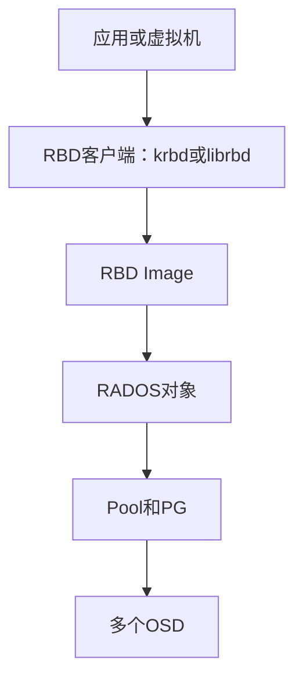
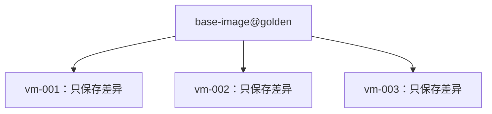

# Ceph RBD 实战：创建块设备、挂载、快照、克隆与故障排查

《Ceph 从零基础到生产运维实战》第 13 篇

← [第 12 篇：CephFS 文件存储实战](./12-CephFS文件存储实战.md)

前面已经完成 Ceph 集群部署和 cephadm 日常管理。现在开始真正向业务提供存储服务。

Ceph 有三种主要数据接口：

- **RBD**：块存储
- **CephFS**：文件存储
- **RGW**：对象存储

本篇先学习 RBD，也就是 RADOS Block Device。

RBD 常用于：

- OpenStack 云硬盘
- Kubernetes 持久卷
- KVM/QEMU 虚拟机磁盘
- Linux 服务器数据盘
- 数据库或应用的块设备
- 需要快照、克隆和精简配置的场景

本文将完成一套完整实验：

```text
创建 RBD Pool
→ 创建最小权限用户
→ 创建 RBD Image
→ 映射为 Linux 块设备
→ 格式化并挂载
→ 扩容
→ 创建快照和克隆
→ 放入 Trash 并恢复
→ 进行常见故障排查
```

:::caution 安全提醒
`mkfs`、缩容、快照回滚和删除 Image 都可能破坏数据。本文中的格式化命令只能对新创建、已经核实的实验 Image 执行。
:::

## 1. RBD 到底是什么 {/* #rbd-到底是什么 */}

RBD 把 RADOS 中的对象组织成一个逻辑块设备。

业务看到的是：

```text
一块 100 GiB 虚拟磁盘
```

Ceph 内部看到的是：

```text
RBD 元数据
+ 多个 RADOS 对象
+ Pool、PG、CRUSH 和 OSD
```



### 1.1 RBD 不是单个大文件 {/* #1-rbd-不是单个大文件 */}

一个 RBD Image 会被切分成多个 RADOS 对象，分散存放在 Pool 对应的 PG 和 OSD 上。客户端根据对象位置直接和 OSD 通信，而不是所有数据都经过 MON 或 MGR。

MON 负责提供集群 Map 和认证信息，MGR 负责管理与监控；它们不承担每次块 IO 的数据转发。

### 1.2 RBD 是块设备，不是文件系统 {/* #2-rbd-是块设备不是文件系统 */}

RBD 只提供类似硬盘的块读写能力。映射后通常还需要：

- 创建分区，可选
- 格式化为 XFS、ext4 等文件系统
- 挂载文件系统
- 或直接交给支持裸块设备的应用

### 1.3 同一个普通文件系统不能随意多机读写 {/* #3-同一个普通文件系统不能随意多机读写 */}

如果在一个 RBD Image 中创建了 ext4 或 XFS，然后同时映射到两台服务器并以读写方式挂载，两个内核会各自维护文件系统状态，可能导致文件系统损坏。

错误理解：RBD 是分布式存储，所以 ext4 也自动支持多机共享

正确理解：RBD 提供分布式块设备；普通 ext4/xfs 仍是单主机文件系统

需要多客户端共享文件目录时，优先考虑 CephFS；确实需要共享块设备时，必须使用经过验证的集群文件系统、锁机制和上层产品方案。

## 2. RBD 的两种主要访问方式 {/* #rbd-的两种主要访问方式 */}

### 2.1 krbd：Linux 内核 RBD 客户端 {/* #1-krbdlinux-内核-rbd-客户端 */}

使用 `rbd device map` 把 Image 映射为：

```text
/dev/rbd0
/dev/rbd/<pool>/<image>
```

优点：

- 作为标准 Linux 块设备使用
- 可以格式化并挂载
- 适合普通服务器和部分容器场景
- 数据路径位于内核中

限制：

- 可用 Feature 受客户端内核版本影响
- 内核过旧可能不支持新特性或包含已知问题
- 升级 Ceph 集群时也要评估客户端内核兼容性

### 2.2 librbd：应用直接访问 RBD {/* #2-librbd应用直接访问-rbd */}

QEMU、OpenStack Cinder、部分 Kubernetes CSI 组件可以通过 librbd 直接访问 Image，不需要先在宿主机映射成 `/dev/rbd0`。

优点：

- 应用能直接调用 RBD 能力
- 更容易使用快照、克隆、缓存等高级特性
- 避免额外的手工映射流程

生产环境中，虚拟机磁盘通常应由 QEMU/libvirt 或云平台统一管理，而不是运维人员手工执行 `rbd device map` 再交给虚拟机。

## 3. 实验前检查 {/* #实验前检查 */}

### 3.1 检查集群健康 {/* #1-检查集群健康 */}

```bash
ceph -s
ceph health detail
ceph osd tree
```

建议在 PG 稳定、没有容量红线和重大 OSD 故障时进行创建和测试。

### 3.2 检查客户端工具 {/* #2-检查客户端工具 */}

```bash
rbd --version
ceph -v
modinfo rbd
```

`rbd` 命令通常由 `ceph-common` 软件包提供。

### 3.3 本文示例参数 {/* #3-本文示例参数 */}

| 项目 | 示例值 |
| --- | --- |
| Pool | rbd-prod |
| CephX 用户 | client.rbdapp |
| Image | lab-disk |
| 初始大小 | 10 GiB |
| 挂载点 | /mnt/rbd-lab |

生产环境应按业务、租户、保护策略和性能需求规划 Pool，不要把所有虚拟机、数据库和测试数据都混到一个默认 Pool 中。

## 4. 创建并初始化 RBD Pool {/* #创建并初始化-rbd-pool */}

### 4.1 创建 Pool {/* #1-创建-pool */}

```bash
ceph osd pool create rbd-prod
```

现代 Ceph 通常由 PG Autoscaler 管理 PG 数量。不要从旧文章中随意复制固定 PG 数；应根据目标版本、OSD 规模和 Autoscaler 状态规划。

### 4.2 初始化 RBD Pool {/* #2-初始化-rbd-pool */}

```bash
rbd pool init rbd-prod
```

这一步会为 RBD 功能初始化 Pool 所需的元数据。

### 4.3 验证 Pool {/* #3-验证-pool */}

```bash
ceph osd pool ls detail
ceph osd pool application get rbd-prod
ceph osd pool get rbd-prod size
ceph osd pool get rbd-prod min_size
```

确认：

- Application 标签为 `rbd`
- 副本或 EC 策略符合设计
- CRUSH 规则指向正确设备类和故障域
- Pool 没有设置意外的配额

## 5. 创建最小权限 RBD 用户 {/* #创建最小权限-rbd-用户 */}

日常业务不应使用 `client.admin`。

创建只访问 `rbd-prod` 的用户：

```bash
ceph auth get-or-create client.rbdapp \
  mon 'profile rbd' \
  osd 'profile rbd pool=rbd-prod' \
  mgr 'profile rbd pool=rbd-prod' \
  -o /etc/ceph/ceph.client.rbdapp.keyring
```

设置权限：

```bash
chmod 600 /etc/ceph/ceph.client.rbdapp.keyring
```

查看 Capabilities：

```bash
ceph auth get client.rbdapp
```

测试该用户是否能访问指定 Pool：

```bash
rbd --id rbdapp --pool rbd-prod ls
```

再尝试访问一个无权限 Pool，应该被拒绝。权限测试既要验证「应该成功」，也要验证「越权必须失败」。

### 5.1 为什么还需要 MON 和 MGR 权限 {/* #为什么还需要-mon-和-mgr-权限 */}

- MON Profile 允许客户端获取必要的集群 Map 和认证信息
- OSD Profile 决定可以访问哪些 RBD 数据
- MGR Profile 用于部分 RBD 管理和监控操作

应使用官方 Profile，而不是为了省事授予 `allow *`。

## 6. 创建 RBD Image {/* #创建-rbd-image */}

创建 10 GiB Image：

```bash
rbd create --size 10G rbd-prod/lab-disk --id rbdapp
```

查看列表：

```bash
rbd ls rbd-prod --long --id rbdapp
```

查看详情：

```bash
rbd info rbd-prod/lab-disk --id rbdapp
```

### 6.1 RBD 默认是 Thin Provisioning {/* #1-rbd-默认是-thin-provisioning */}

创建一个 10 GiB Image，并不会立即占用 10 GiB Raw 空间。

```text
逻辑大小：客户端最多可使用的地址空间
实际占用：已经真正写入且仍被引用的数据
```

随着客户端写入，实际占用才逐渐增加。

### 6.2 Thin Provisioning 不等于无限超卖 {/* #2-thin-provisioning-不等于无限超卖 */}

可以创建很多逻辑容量大于集群物理容量的 Image，但如果所有业务同时写满，Ceph 仍会达到 Nearfull 或 Full。

生产环境必须监控：

- Pool 逻辑分配总量
- Image 实际占用
- 集群 Raw 使用率
- 快照和克隆占用
- 增长趋势
- 最大故障域恢复空间

## 7. 把 RBD 映射为 Linux 块设备 {/* #把-rbd-映射为-linux-块设备 */}

在客户端安装 `ceph-common`，并准备：

```text
/etc/ceph/ceph.conf
/etc/ceph/ceph.client.rbdapp.keyring
```

映射：

```bash
rbd device map rbd-prod/lab-disk \
  --id rbdapp \
  --keyring /etc/ceph/ceph.client.rbdapp.keyring
```

命令会返回设备路径，例如：

```text
/dev/rbd0
```

查看映射：

```bash
rbd device list
lsblk -o NAME,SIZE,TYPE,FSTYPE,MOUNTPOINTS
```

还可能存在更容易识别的路径：

```text
/dev/rbd/rbd-prod/lab-disk
```

脚本不要盲目假设设备永远是 `/dev/rbd0`，应读取映射结果或使用稳定路径。

## 8. 格式化并挂载实验 Image {/* #格式化并挂载实验-image */}

再次确认设备是刚创建的空白实验 Image：

```bash
rbd device list
lsblk -f
```

### 8.1 创建文件系统 {/* #1-创建文件系统 */}

下面假设正确设备是 `/dev/rbd/rbd-prod/lab-disk`：

```bash
mkfs.xfs /dev/rbd/rbd-prod/lab-disk
```

`mkfs` 会覆盖设备上的文件系统信息。生产中执行前必须通过 Image 名称、映射关系、设备大小和变更单多重确认。

### 8.2 挂载 {/* #2-挂载 */}

```bash
mkdir -p /mnt/rbd-lab
mount /dev/rbd/rbd-prod/lab-disk /mnt/rbd-lab
```

验证：

```bash
findmnt /mnt/rbd-lab
df -hT /mnt/rbd-lab
touch /mnt/rbd-lab/rbd-test.txt
sync
ls -l /mnt/rbd-lab
```

### 8.3 卸载并取消映射 {/* #3-卸载并取消映射 */}

```bash
umount /mnt/rbd-lab
rbd device unmap /dev/rbd/rbd-prod/lab-disk
```

如果提示设备 Busy，不要使用强制参数直接处理。先检查仍在使用该挂载点或块设备的进程。

## 9. 开机自动映射和挂载怎么设计 {/* #开机自动映射和挂载怎么设计 */}

生产客户端需要考虑启动顺序：

```text
网络可用
→ DNS 和 MON 可达
→ RBD 映射成功
→ 文件系统挂载
→ 依赖业务启动
```

可以使用发行版提供的 systemd RBD 映射机制或编写受控的 systemd Unit。不要只在 `rc.local` 中堆积命令。

一个可靠方案应具备：

- 明确依赖 `network-online.target`
- Keyring 权限为 600
- 映射失败时业务不能误写本地空目录
- 停机时先停止业务，再卸载并取消映射
- 超时和重试有边界
- 监控映射和挂载状态
- 主机重启演练已经完成

如果业务本身支持 librbd，应优先采用产品集成方式，而不是重复实现映射生命周期。

## 10. RBD 扩容 {/* #rbd-扩容 */}

RBD Image 扩容分两层：

```text
先扩大 RBD 块设备
再扩大设备内部的分区和文件系统
```

### 10.1 扩大 Image {/* #1-扩大-image */}

```bash
rbd resize --size 20G rbd-prod/lab-disk --id rbdapp
```

检查：

```bash
rbd info rbd-prod/lab-disk --id rbdapp
lsblk
```

### 10.2 扩大文件系统 {/* #2-扩大文件系统 */}

如果 XFS 直接创建在整个 RBD 设备上，并已挂载：

```bash
xfs_growfs /mnt/rbd-lab
```

如果设备上还有分区、LVM 或其他文件系统，应按对应层级依次扩容。

### 10.3 缩容为什么危险 {/* #3-缩容为什么危险 */}

RBD 支持使用 `--allow-shrink` 缩小 Image，但块设备缩小不等于文件系统自动缩小。

如果先缩 RBD 而没有正确缩小上层数据结构，Image 尾部数据会被截断，文件系统可能永久损坏。

另外，XFS 本身不支持常规在线缩容。因此生产中通常采用：

```text
创建较小的新 Image
→ 创建文件系统
→ 迁移并校验数据
→ 切换业务
→ 旧 Image 进入 Trash 观察
```

不要把 `--allow-shrink` 当作普通容量回收命令。

## 11. RBD 快照 {/* #rbd-快照 */}

创建快照：

```bash
rbd snap create rbd-prod/lab-disk@before-upgrade --id rbdapp
```

查看：

```bash
rbd snap ls rbd-prod/lab-disk --id rbdapp
```

### 11.1 快照默认只是 Crash-Consistent {/* #1-快照默认只是-crash-consistent */}

RBD 只看到块，不理解 Image 内部的文件系统、数据库事务或应用缓存。

如果业务正在写入，直接创建快照通常只能保证类似突然断电后的块设备状态，也就是 Crash-Consistent。

需要 Application-Consistent 时，应协调上层：

- 暂停应用写入
- 刷新数据库缓存和事务日志
- 对文件系统执行 `fsfreeze`
- 虚拟机使用 QEMU Guest Agent
- 多个卷组成一个业务时使用一致性组或编排流程
- 快照完成后及时恢复业务 IO

### 11.2 快照回滚 {/* #2-快照回滚 */}

```bash
rbd snap rollback rbd-prod/lab-disk@before-upgrade --id rbdapp
```

回滚会用快照内容覆盖 Image 当前状态，快照之后的数据会丢失，并且耗时随 Image 大小增长。

执行前应：

- 停止业务
- 卸载或断开 Image
- 确认回滚目标
- 备份当前状态
- 评估上层数据库和文件系统一致性

官方文档建议在很多恢复场景中优先从快照创建 Clone，而不是直接覆盖原 Image。

### 11.3 删除快照 {/* #3-删除快照 */}

```bash
rbd snap rm rbd-prod/lab-disk@before-upgrade --id rbdapp
```

删除快照后，OSD 通过 Snaptrim 异步释放数据，因此 Raw 空间不一定立即下降。

### 11.4 快照不是备份 {/* #4-快照不是备份 */}

快照仍在同一个 Ceph 集群中。以下问题可能同时影响 Image 和快照：

- 集群级数据损坏
- 管理员误删
- CephX 高权限凭据泄露
- 机房级灾难
- 软件缺陷或错误自动化

重要数据仍需复制到独立故障域或独立存储系统。

## 12. RBD 克隆与 Flatten {/* #rbd-克隆与-flatten */}

Clone 使用 Copy-on-Write 快速创建新 Image。

### 12.1 创建模板快照 {/* #1-创建模板快照 */}

```bash
rbd snap create rbd-prod/base-image@golden
rbd snap protect rbd-prod/base-image@golden
```

### 12.2 创建 Clone {/* #2-创建-clone */}

```bash
rbd clone \
  rbd-prod/base-image@golden \
  rbd-prod/vm-001
```

Clone 创建速度快，因为初始时主要保存与父快照的引用。读取未修改数据时可以从父快照获得；新写入内容保存在子 Image 中。



### 12.3 查看依赖 {/* #3-查看依赖 */}

```bash
rbd children rbd-prod/base-image@golden
rbd info rbd-prod/vm-001
```

### 12.4 Flatten {/* #4-flatten */}

```bash
rbd flatten rbd-prod/vm-001
```

Flatten 会把依赖的父数据复制到子 Image，使子 Image 脱离父快照。

代价是：

- 消耗 IO 和网络
- 需要更多容量
- 大 Image 耗时较长
- 可能影响业务延迟

所有子 Clone 被删除或 Flatten 后，才能解除父快照保护并删除：

```bash
rbd snap unprotect rbd-prod/base-image@golden
rbd snap rm rbd-prod/base-image@golden
```

生产平台要记录完整的父子依赖关系，不能只根据 Image 名称判断是否可删除。

## 13. 删除 RBD Image：优先使用 Trash {/* #删除-rbd-image优先使用-trash */}

直接删除：

```bash
rbd rm rbd-prod/lab-disk
```

这类操作恢复困难。生产环境更适合先移入 Trash：

```bash
rbd trash mv rbd-prod/lab-disk
```

查看：

```bash
rbd trash ls rbd-prod
```

恢复时使用 Trash 中的 Image ID：

```bash
rbd trash restore rbd-prod/<image-id> --image lab-disk-restored
```

最终删除：

```bash
rbd trash rm rbd-prod/<image-id>
```

可以使用延迟删除时间，给误删恢复留出窗口。Trash 不能替代备份，但比立即 `rbd rm` 更适合生产回收流程。

删除前至少确认：

- Image 没有活跃 Watcher
- 没有被虚拟机、Pod 或主机使用
- 快照与 Clone 依赖已梳理
- 业务负责人已确认
- 备份和保留周期符合要求
- 删除后容量释放可能是异步的

## 14. 常见 RBD Feature {/* #常见-rbd-feature */}

查看 Image Feature：

```bash
rbd info rbd-prod/lab-disk
```

常见 Feature 包括：

| Feature | 主要作用 |
| --- | --- |
| layering | 支持快照分层和 Clone |
| exclusive-lock | 支持客户端独占锁相关能力 |
| object-map | 跟踪哪些对象实际存在，加速部分操作 |
| fast-diff | 加速快照之间的差异计算 |
| deep-flatten | Flatten 时处理快照中的父依赖 |
| journaling | 为 RBD Mirror 等功能记录更新日志 |

Feature 之间可能存在依赖。例如 `fast-diff` 通常依赖 `object-map`，`object-map` 又依赖 `exclusive-lock`。

不要看到 Feature 多就全部开启。需要同时检查：

- 目标 Ceph 版本
- krbd 内核版本
- QEMU、CSI 或 OpenStack 支持情况
- 是否需要 RBD Mirror
- 启停 Feature 对现有 Image 的影响

## 15. RBD 监控 {/* #rbd-监控 */}

### 15.1 集群侧 {/* #1-集群侧 */}

```bash
ceph -s
ceph df detail
ceph osd perf
ceph health detail
```

### 15.2 Pool 和 Image 侧 {/* #2-pool-和-image-侧 */}

```bash
rbd ls rbd-prod --long
rbd du rbd-prod
rbd status rbd-prod/lab-disk
rbd info rbd-prod/lab-disk
```

`rbd status` 可以看到 Watcher 等使用信息。实际使用量统计可能受 Feature、快照和统计方式影响，不要把单个命令当作计费唯一依据。

### 15.3 Prometheus 按 Image 采集 {/* #3-prometheus-按-image-采集 */}

Ceph Prometheus 模块默认不会为所有 RBD Image 采集详细 IO 统计，因为大规模 Image 扫描和动态性能计数器会产生开销。

可以仅指定需要的 Pool：

```bash
ceph config set mgr mgr/prometheus/rbd_stats_pools "rbd-prod"
```

生产环境不要不加评估就配置 `*` 采集所有 Pool 和 Namespace。

## 16. 常见故障排查 {/* #常见故障排查 */}

### 16.1 `rbd device map` 失败 {/* #1-rbd-device-map-失败 */}

依次检查：

```bash
ceph -s
rbd --id rbdapp --pool rbd-prod ls
rbd info rbd-prod/lab-disk --id rbdapp
modinfo rbd
dmesg -T | tail -n 100
```

常见原因：

- Keyring 路径或权限错误
- CephX Caps 不允许访问该 Pool
- MON 地址不可达
- DNS、防火墙或时间异常
- 内核 RBD 客户端不支持 Image Feature
- Image 被不兼容方式加密
- 集群处于严重健康异常

### 16.2 取消映射提示 Busy {/* #2-取消映射提示-busy */}

```bash
findmnt
lsblk
fuser -vm /dev/rbd/rbd-prod/lab-disk
lsof /dev/rbd/rbd-prod/lab-disk
```

常见占用：

- 文件系统仍挂载
- 当前 Shell 位于挂载目录
- 应用仍打开文件
- LVM、Multipath 或容器仍引用设备
- 虚拟机仍在使用 Image

先停止上层使用者，再正常卸载和 Unmap。强制取消映射可能导致未写数据丢失。

### 16.3 Image 删除失败 {/* #3-image-删除失败 */}

```bash
rbd status rbd-prod/lab-disk
rbd snap ls rbd-prod/lab-disk
rbd children rbd-prod/lab-disk@<snapshot>
```

检查：

- 是否有 Watcher
- 是否存在快照
- 快照是否 Protected
- 是否有 Clone 依赖
- Image 是否仍被平台记录为使用中

### 16.4 延迟突然升高 {/* #4-延迟突然升高 */}

从四层分析：

| 层次 | 检查方向 |
| --- | --- |
| 客户端 | 内核、队列、文件系统、应用 IO 模式 |
| 网络 | 丢包、重传、MTU、带宽和时延 |
| Ceph | Slow Ops、PG 状态、Recovery、Scrub |
| 设备 | OSD 延迟、SMART、NVMe 健康、DB/WAL 瓶颈 |

命令示例：

```bash
ceph -s
ceph health detail
ceph osd perf
ceph pg stat
iostat -x 1
ss -s
```

不要看到 RBD 慢就只调 RBD 缓存。根因可能在故障恢复、最慢 OSD、网络或上层小随机同步写。

### 16.5 发现锁或 Watcher 怎么办 {/* #5-发现锁或-watcher-怎么办 */}

Watcher 通常表示有客户端正在使用 Image，不是异常本身。

删除锁或清理 Watcher 前必须确认：

- 对应虚拟机或 Pod 是否仍在运行
- 客户端是否只是网络隔离
- 是否发生双主风险
- 平台控制面是否会自动重新连接
- 清理后如何保证文件系统或数据库一致性

不要把「删锁」作为通用解法。

## 17. 生产 RBD 交付检查表 {/* #生产-rbd-交付检查表 */}

- [ ] Pool 保护策略和 CRUSH 规则符合业务等级
- [ ] 已计算 Thin Provisioning 超卖比例
- [ ] 业务使用最小权限 CephX 用户
- [ ] Keyring 通过受控方式分发并设置 600 权限
- [ ] 客户端内核或 librbd 版本经过兼容性验证
- [ ] Image 命名能关联业务、租户和生命周期
- [ ] 已明确单主机文件系统还是上层集群方案
- [ ] 快照流程能达到 Crash-Consistent 或 Application-Consistent 目标
- [ ] 快照保留、Clone 依赖和 Snaptrim 受到监控
- [ ] 删除优先进入 Trash 并设置保留窗口
- [ ] 扩容已覆盖 RBD、分区/LVM 和文件系统全部层级
- [ ] 已配置独立备份或异地复制
- [ ] 已监控容量、IO 延迟、Watcher 和业务错误
- [ ] 已演练客户端重启、网络中断和 OSD 恢复

## 18. 常见误区 {/* #常见误区 */}

**误区 1：创建 100 GiB Image 立即占用 100 GiB**

RBD 默认 Thin Provisioning，实际空间随写入和快照引用增长。

**误区 2：RBD 是分布式存储，所以 ext4 可以多机挂载**

RBD 的后端是分布式的，但普通文件系统仍不具备多客户端协调能力。

**误区 3：有快照就不需要备份**

快照和原 Image 位于同一集群，不能覆盖所有集群级和人为故障。

**误区 4：扩完 RBD 就完成扩容**

上层分区、LVM 和文件系统还需要按顺序扩容。

**误区 5：删除 Image 后空间立即下降**

快照、Clone 引用和 OSD 异步回收都会影响释放速度。

**误区 6：Watcher 说明 Image 有问题**

Watcher 通常说明有客户端连接。关键是确认它是否与业务实际状态一致。

## 19. 本篇总结 {/* #本篇总结 */}

RBD 的数据路径是：

```text
应用或虚拟机
→ krbd/librbd
→ RBD Image
→ RADOS 对象
→ Pool、PG 与 OSD
```

需要记住：

1. RBD 提供块设备，不直接提供共享文件目录
2. Pool 创建后要执行 `rbd pool init`
3. 业务应使用限定到目标 Pool 的 CephX 用户
4. RBD 默认 Thin Provisioning，但物理容量不能无限超卖
5. 映射后才能像普通磁盘一样格式化和挂载
6. 扩容要同时处理 Image 和上层文件系统
7. RBD 快照默认是 Crash-Consistent，应用一致性需要上层配合
8. Clone 依赖父快照，Flatten 后才真正独立
9. 生产删除优先进入 Trash
10. 快照、三副本和 Trash 都不能替代独立备份

**创建分布式共享文件系统、部署 MDS、挂载客户端、配置 Subvolume、Quota 和快照。**

## 20. 自测题 {/* #自测题 */}

1. RBD Image 在 Ceph 内部如何保存？
2. krbd 与 librbd 有什么区别？
3. 为什么一个 ext4 格式的 RBD 不能随意在两台主机同时读写挂载？
4. `rbd pool init` 的作用是什么？
5. Thin Provisioning 会带来什么容量风险？
6. RBD 扩容后为什么还要扩文件系统？
7. Crash-Consistent 与 Application-Consistent 快照有什么区别？
8. Clone 为什么依赖父快照？
9. Flatten 会带来什么容量和性能影响？
10. 为什么生产删除更适合先使用 RBD Trash？

## 21. 参考资料 {/* #参考资料 */}

- [Basic Block Device Commands](https://docs.ceph.com/en/latest/rbd/rados-rbd-cmds/)
- [Kernel Module Operations](https://docs.ceph.com/en/latest/rbd/rbd-ko/)
- [RBD Snapshots](https://docs.ceph.com/en/latest/rbd/rbd-snapshot/)
- [RBD Exclusive Locks](https://docs.ceph.com/en/latest/rbd/rbd-exclusive-locks/)
- [RBD Configuration](https://docs.ceph.com/en/latest/rbd/rbd-config-ref/)
- [Prometheus RBD IO Statistics](https://docs.ceph.com/en/latest/mgr/prometheus/#rbd-io-statistics)

下一篇学习 RGW 对象存储：S3 API、用户密钥与 Bucket 实践。

→ [第 14 篇：RGW 对象存储实战](./14-RGW对象存储实战.md)
