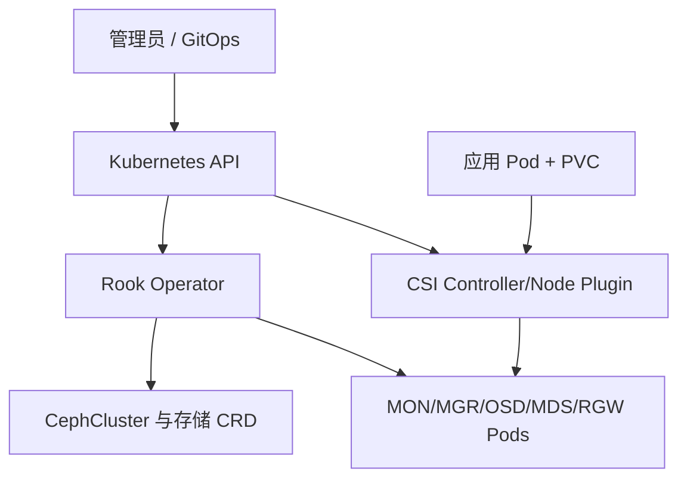
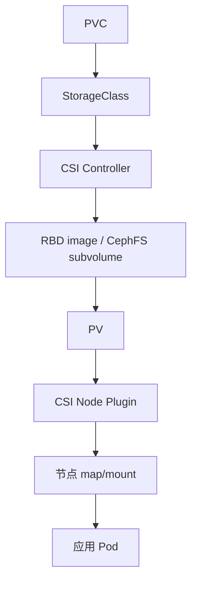

# Rook + Ceph on Kubernetes：架构、生产部署、CSI 使用与双层排障

《Ceph 从零基础到生产运维实战》第 15 篇

← [第 14 篇：RGW 对象存储实战](./14-RGW对象存储实战.md)

Rook 不是把 Ceph 简化成几个 Pod，而是用 Kubernetes Operator 和 CRD 管理 Ceph 的生命周期，再通过 CSI 向工作负载提供 RBD 与 CephFS。本篇从架构开始，逐步完成部署、StorageClass/PVC 使用、监控、维护、升级和故障排查。

## 1. 本文目标 {/* #本文目标 */}

读完并完成测试环境实验后，你应该能够：

- 解释 Rook Operator、CephCluster CRD、Ceph daemon Pod 和 CSI 的关系
- 判断什么时候适合使用内部 Rook Ceph，什么时候使用外部 Ceph 集群
- 规划节点、裸盘、failure domain、网络和资源
- 使用固定版本清单或 Helm 部署 Rook
- 读懂 CephCluster、CephBlockPool 和 CephFilesystem 资源
- 使用 RBD StorageClass 提供 RWO 块存储
- 使用 CephFS StorageClass 提供 RWX 文件存储
- 区分 PVC、CSI、节点挂载和 Ceph 数据面故障
- 安全执行节点维护、扩容、换盘和升级
- 识别删除 CephCluster、cleanupPolicy 和擦盘操作的破坏性风险

:::danger 最高风险提示
Rook 的测试清单可能使用所有可用裸盘；`cleanupPolicy`、删除 CephCluster、OSD purge 和磁盘 zap 都可能永久删除数据。只能在明确识别设备、确认集群和完成审批后执行。
:::

## 2. Rook 到底是什么 {/* #rook-到底是什么 */}

Rook 是 Kubernetes 的存储编排器。它通过 Operator 模式把 Ceph 运维动作转换为 Kubernetes 声明式资源。

当你创建：

```yaml
apiVersion: ceph.rook.io/v1
kind: CephCluster
```

Rook Operator 会持续协调实际状态，使 MON、MGR、OSD 等资源向 spec 收敛。

Rook 管理 Ceph，但数据可靠性、CRUSH、PG、副本、容量和恢复仍由 Ceph 机制决定。

## 3. 架构组件 {/* #架构组件 */}



### 3.1 Rook Operator {/* #rook-operator */}

- Watch Rook CRD
- 创建和更新 Ceph daemon
- 执行配置收敛
- 协调升级、健康检查和部分运维动作

### 3.2 Ceph daemon Pod {/* #ceph-daemon-pod */}

- MON、MGR、OSD
- 可选 MDS、RGW、rbd-mirror 等
- 它们仍是标准 Ceph 守护进程

### 3.3 CSI Controller {/* #csi-controller */}

- 处理 CreateVolume、DeleteVolume、ControllerPublish
- 创建 RBD image 或 CephFS subvolume
- 处理快照、扩容等控制面请求

### 3.4 CSI Node Plugin {/* #csi-node-plugin */}

- 通常以 DaemonSet 运行
- 在目标节点 map/mount/unmount
- 与 kubelet 交互

## 4. 两套控制面必须同时理解 {/* #两套控制面必须同时理解 */}

Rook Ceph 故障可能发生在：

### 4.1 Kubernetes 层 {/* #kubernetes-层 */}

- Pod Pending/CrashLoopBackOff
- Operator 无法 reconcile
- CRD/RBAC/Webhook
- 调度、taint、资源不足
- kubelet/container runtime
- CSI controller/node plugin
- PV/PVC/VolumeAttachment

### 4.2 Ceph 层 {/* #ceph-层 */}

- MON quorum
- OSD down/full
- PG inactive/degraded
- CephX
- RBD lock/watcher
- CephFS MDS
- 网络和磁盘

`kubectl get pod` 全是 Running，不代表 PG 健康；`ceph -s` 为 `HEALTH_OK`，也不能证明某个节点的 CSI mount 正常。

## 5. 内部集群还是外部集群 {/* #内部集群还是外部集群 */}

### 5.1 内部 Rook Ceph {/* #内部-rook-ceph */}

Ceph daemon 与业务都运行在同一 Kubernetes 集群或由同一集群管理。

优点：

- 声明式管理
- 与节点、Secret、CSI 集成紧密
- 适合云原生团队统一运维

风险：

- Kubernetes 故障可能影响存储管理面
- 存储与计算争抢 CPU、内存、网络
- 节点维护同时影响应用和 OSD
- 集群级灾难恢复更复杂

### 5.2 外部 Ceph 集群 {/* #外部-ceph-集群 */}

Ceph 由独立 bare-metal/cephadm 或另一管理域提供，Kubernetes 只运行 CSI/消费者配置。

优点：

- 存储与 Kubernetes 故障域解耦
- 多个 Kubernetes 集群可共享存储平台
- 存储团队可独立扩容和升级

代价：

- 网络和认证配置更复杂
- 外部集群变更要同步消费者
- 故障归属跨团队
- 跨集群依赖必须纳入 RTO

选择取决于组织、规模、SLO 和故障域，不是「云原生就必须内部部署」。

## 6. 生产前置条件 {/* #生产前置条件 */}

### 6.1 Kubernetes 兼容性 {/* #kubernetes-兼容性 */}

每个 Rook release 只支持一定范围的 Kubernetes 和 Ceph 版本。部署前检查：

- Rook release notes
- Kubernetes compatibility
- Ceph image compatibility
- Ceph-CSI 版本
- 内核 RBD/CephFS 支持
- 容器运行时

不要从 latest-release 页面复制清单，却部署一个旧版 Rook 镜像。

### 6.2 节点 {/* #节点 */}

生产 host-based 示例通常要求至少三个 worker 节点，以承载 MON quorum 和副本故障域。还应评估：

- rack/zone
- 电源和交换机
- CPU、内存
- 系统盘与 OSD 盘分离
- 节点重启策略
- taint/toleration
- PodDisruptionBudget

### 6.3 设备 {/* #设备 */}

可使用的后端取决于版本，包括：

- 未格式化裸盘
- 未格式化分区
- LVM LV
- 加密设备
- multipath
- block-mode PV

设备必须准确盘点。不要根据 `/dev/sdb` 名称长期绑定，设备枚举可能在重启后变化，优先使用稳定设备标识和显式选择。

## 7. 存储节点是否与业务节点混部 {/* #存储节点是否与业务节点混部 */}

### 7.1 混部 {/* #混部 */}

适合小型或成本敏感环境，但需：

- 为 Ceph daemon 设置 request/limit
- 避免业务挤压 OSD 内存
- 规划磁盘、网络和 CPU
- 设置节点标签、亲和和 taint
- 测试 drain 和资源压力

### 7.2 专用存储节点 {/* #专用存储节点 */}

优点：

- 性能更可预测
- 故障域清晰
- 维护不会同时迁移大量业务 Pod
- 更容易使用本地裸盘

代价是硬件利用率和管理成本。关键生产环境通常更倾向专用或至少强隔离。

## 8. 网络规划 {/* #网络规划 */}

需要考虑：

- Pod network
- Kubernetes Service network
- Ceph public/cluster traffic
- CSI node 到 MON/OSD
- RGW/Dashboard 外部入口
- NetworkPolicy 是否覆盖 hostNetwork 流量
- MTU 与 CNI 封装
- 跨节点和跨 zone 带宽

RBD/CephFS 客户端最终需要访问 MON 和 OSD。只允许访问 Operator Service 并不能满足数据面。

CNI 的 VXLAN/Geneve 等封装会降低有效 MTU。小请求正常、大 I/O 卡住时应检查端到端 MTU。

## 9. Rook 的安装方式 {/* #rook-的安装方式 */}

常见两种：

- 固定 release 的官方 YAML
- 官方 Helm chart

生产建议：

- 固定 Rook chart/manifest 版本
- 镜像固定 tag 或 digest
- 清单纳入 Git
- 使用 Kustomize/Helm values 管理差异
- 先在预生产验证
- 不直接从主分支 raw URL apply

官方 Quickstart 的典型顺序为：

```bash
kubectl create -f crds.yaml -f common.yaml -f csi-operator.yaml
kubectl create -f operator.yaml
```

具体文件组合随 Rook release 变化，必须使用同一 tagged release 的清单。

验证 Operator：

```bash
kubectl -n rook-ceph get pods -o wide
kubectl -n rook-ceph logs deploy/rook-ceph-operator --tail=200
```

Operator 稳定 Running 后再创建 CephCluster。

## 10. 一个 CephCluster 骨架 {/* #一个-cephcluster-骨架 */}

下面只展示结构，不应直接作为生产完整配置：

```yaml
apiVersion: ceph.rook.io/v1
kind: CephCluster
metadata:
  name: rook-ceph
  namespace: rook-ceph
spec:
  dataDirHostPath: /var/lib/rook
  mon:
    count: 3
    allowMultiplePerNode: false
  mgr:
    count: 2
    allowMultiplePerNode: false
  dashboard:
    enabled: true
  monitoring:
    enabled: true
  storage:
    useAllNodes: false
    useAllDevices: false
    nodes:
      - name: storage-01
        devices:
          - name: /dev/disk/by-id/<stable-id-1>
      - name: storage-02
        devices:
          - name: /dev/disk/by-id/<stable-id-2>
      - name: storage-03
        devices:
          - name: /dev/disk/by-id/<stable-id-3>
```

重点不是字段数量，而是：

- 明确节点
- 明确设备
- MON/MGR 分散
- `dataDirHostPath` 持久并与其他集群隔离
- 不使用危险的全节点/全设备匹配
- resource、network、placement、security 按生产设计补全

## 11. dataDirHostPath 为什么重要 {/* #datadirhostpath-为什么重要 */}

该目录保存 daemon 的主机侧状态和配置。需要：

- 使用稳定持久路径
- 不与其他 Rook 集群共用
- 监控容量和 inode
- 节点重装时按恢复流程处理
- 删除集群时谨慎清理残留

它不是 OSD 业务数据本身的备份，但错误丢失会影响 daemon 身份和恢复。

## 12. 显式设备选择 {/* #显式设备选择 */}

生产中推荐：

- `useAllDevices: false`
- 用 device filter 或 nodes/devices 明确选择
- 应用前核对 `lsblk`、序列号、WWN
- 系统盘、日志盘、数据库盘和预留盘排除
- 新盘上线先进入待认领状态
- Git 变更与硬件工单关联

Rook 检测到「可用盘」并不代表它是「应该用于 Ceph 的盘」。

## 13. 创建并观察 CephCluster {/* #创建并观察-cephcluster */}

```bash
kubectl apply -f cluster.yaml
kubectl -n rook-ceph get cephcluster
kubectl -n rook-ceph get pods -o wide
kubectl -n rook-ceph get events --sort-by=.lastTimestamp
```

观察：

- CephCluster phase/state
- MON 是否形成 quorum
- MGR active/standby
- prepare OSD Job
- OSD Pod
- Operator reconcile 日志
- 设备发现结果

不要因为 Pod 创建慢就重复 apply 不同版本配置。

## 14. Toolbox {/* #toolbox */}

Toolbox 提供包含 `ceph`、`rbd`、`rados` 等工具的 Pod。应从同一 tagged Rook release 使用 `toolbox.yaml`：

```bash
kubectl apply -f toolbox.yaml
kubectl -n rook-ceph rollout status deploy/rook-ceph-tools
kubectl -n rook-ceph exec -it deploy/rook-ceph-tools -- bash
```

进入后：

```bash
ceph -s
ceph health detail
ceph osd tree
ceph df
```

Toolbox 通常持有高权限，生产中应：

- 限制 RBAC
- 不长期对所有人开放 exec
- 记录操作
- 使用后按制度删除或收紧
- 不把 keyring 复制出集群

## 15. 验证 Ceph 健康 {/* #验证-ceph-健康 */}

Kubernetes：

```bash
kubectl -n rook-ceph get cephcluster rook-ceph -o yaml
kubectl -n rook-ceph get pods -o wide
```

Ceph：

```bash
ceph -s
ceph health detail
ceph osd tree
ceph versions
```

至少满足：

- MON quorum
- MGR active/standby
- OSD up/in 数量符合盘数
- PG 处于预期状态
- CRUSH host/rack 正确
- 没有意外消费设备
- 版本符合审批

## 16. CephBlockPool {/* #cephblockpool */}

示例：

```yaml
apiVersion: ceph.rook.io/v1
kind: CephBlockPool
metadata:
  name: replicapool
  namespace: rook-ceph
spec:
  failureDomain: host
  replicated:
    size: 3
  enableRBDStats: true
```

解释：

- `failureDomain: host` 要求副本跨主机
- `size: 3` 是三副本
- `enableRBDStats` 可开启 per-image I/O 指标，但会增加指标和管理开销
- 生产还要考虑 `requireSafeReplicaSize`、device class、compression、quota 等版本字段

节点不足时不要为了让 Pool 创建成功把 size 降为 1。

## 17. RBD StorageClass {/* #rbd-storageclass */}

下例展示主要字段，Secret 名称应以对应 release 官方示例为准：

```yaml
apiVersion: storage.k8s.io/v1
kind: StorageClass
metadata:
  name: rook-ceph-block
provisioner: rook-ceph.rbd.csi.ceph.com
parameters:
  clusterID: rook-ceph
  pool: replicapool
  imageFormat: "2"
  imageFeatures: layering
  csi.storage.k8s.io/provisioner-secret-name: rook-csi-rbd-provisioner
  csi.storage.k8s.io/provisioner-secret-namespace: rook-ceph
  csi.storage.k8s.io/controller-expand-secret-name: rook-csi-rbd-provisioner
  csi.storage.k8s.io/controller-expand-secret-namespace: rook-ceph
  csi.storage.k8s.io/node-stage-secret-name: rook-csi-rbd-node
  csi.storage.k8s.io/node-stage-secret-namespace: rook-ceph
reclaimPolicy: Delete
allowVolumeExpansion: true
volumeBindingMode: Immediate
```

### 17.1 reclaimPolicy {/* #reclaimpolicy */}

- `Delete`：删除 PVC 后，通常删除底层 RBD image
- `Retain`：保留 PV 和数据，需人工回收

关键数据不应只靠 Retain 代替备份，但它能降低误删 PVC 的即时损失。

### 17.2 RBD 访问模式 {/* #rbd-访问模式 */}

普通文件系统上的 RBD 常用于 ReadWriteOnce。不要因为 Kubernetes 接受某个 AccessMode，就假设普通 ext4/xfs 卷可以被多节点同时安全写入。

## 18. 创建 RBD PVC {/* #创建-rbd-pvc */}

```yaml
apiVersion: v1
kind: PersistentVolumeClaim
metadata:
  name: app-data
spec:
  accessModes:
    - ReadWriteOnce
  storageClassName: rook-ceph-block
  resources:
    requests:
      storage: 20Gi
```

应用：

```bash
kubectl apply -f pvc-rbd.yaml
kubectl get pvc app-data
kubectl get pv
kubectl describe pvc app-data
```

验证底层：

```bash
rbd ls replicapool
rbd du --pool replicapool
```

不要依赖底层自动生成的 image 名称作为业务标识，应通过 PV/PVC/CSI 元数据关联。

## 19. CephFilesystem {/* #cephfilesystem */}

示例：

```yaml
apiVersion: ceph.rook.io/v1
kind: CephFilesystem
metadata:
  name: myfs
  namespace: rook-ceph
spec:
  metadataPool:
    replicated:
      size: 3
  dataPools:
    - name: replicated
      failureDomain: host
      replicated:
        size: 3
  metadataServer:
    activeCount: 1
    activeStandby: true
```

关键点：

- metadata Pool 应使用高性能、可靠介质
- MDS active 数量按元数据负载设计
- standby 用于故障切换
- 数据 Pool 可按容量和性能设计 replicated/EC
- 节点不足时不能安全使用三副本故障域

## 20. CephFS StorageClass {/* #cephfs-storageclass */}

示意：

```yaml
apiVersion: storage.k8s.io/v1
kind: StorageClass
metadata:
  name: rook-cephfs
provisioner: rook-ceph.cephfs.csi.ceph.com
parameters:
  clusterID: rook-ceph
  fsName: myfs
  pool: myfs-replicated
  csi.storage.k8s.io/provisioner-secret-name: rook-csi-cephfs-provisioner
  csi.storage.k8s.io/provisioner-secret-namespace: rook-ceph
  csi.storage.k8s.io/controller-expand-secret-name: rook-csi-cephfs-provisioner
  csi.storage.k8s.io/controller-expand-secret-namespace: rook-ceph
  csi.storage.k8s.io/node-stage-secret-name: rook-csi-cephfs-node
  csi.storage.k8s.io/node-stage-secret-namespace: rook-ceph
reclaimPolicy: Delete
allowVolumeExpansion: true
```

具体 Pool 名称和 Secret 必须从实际 CephFilesystem 与对应 release 示例确认。

CephFS 常用于：

- 多 Pod 共享文件
- ReadWriteMany
- 共享模型、制品和内容目录

它不是所有数据库的最佳后端，需按元数据、小文件和一致性负载压测。

## 21. RBD 与 CephFS 如何选 {/* #rbd-与-cephfs-如何选 */}

| 维度 | RBD | CephFS |
| --- | --- | --- |
| 接口 | 块设备 | 共享文件系统 |
| 常见模式 | RWO | RWX |
| 适合 | 数据库、单 Pod 卷、虚拟机 | 多 Pod 共享、文件目录 |
| 元数据 | 客户端文件系统 | MDS 集群 |
| 故障排查 | CSI map/mount、RBD lock | CSI mount、MDS、session |
| 性能模型 | 块 I/O | 文件与元数据操作 |

选择基于应用语义，不是基于哪个 YAML 更短。

## 22. PVC 从创建到挂载的路径 {/* #pvc-从创建到挂载的路径 */}



排障时先确认卡在哪一步，而不是一开始就查看 OSD 日志。

## 23. PVC Pending 排查 {/* #pvc-pending-排查 */}

```bash
kubectl get pvc -A
kubectl describe pvc <pvc> -n <namespace>
kubectl get storageclass
kubectl get events -n <namespace> --sort-by=.lastTimestamp
kubectl -n rook-ceph get pods -o wide
```

常见原因：

- StorageClass 名错误
- provisioner 名不匹配
- CSI controller 不健康
- Secret 缺失或错误
- Pool/CephFS 不存在
- CephX caps
- 集群 full
- topology/WaitForFirstConsumer 等待调度
- API/RBAC
- Ceph MON 不可达

查看 controller 日志前先列出实际 Pod/容器名称，因为不同 release 命名可能变化：

```bash
kubectl -n rook-ceph get pods | grep csi
kubectl -n rook-ceph logs <csi-controller-pod> -c <container> --tail=200
```

## 24. Pod Pending 与 PVC Bound {/* #pod-pending-与-pvc-bound */}

PVC 已 Bound 但 Pod Pending，可能是：

- 节点资源
- node affinity
- taint/toleration
- topology 限制
- VolumeAttachment 冲突
- RWO 卷仍附着在旧节点
- Pod 调度策略

```bash
kubectl describe pod <pod> -n <namespace>
kubectl get volumeattachment
kubectl describe pv <pv>
```

不要删除 PV/PVC 来「重试」，这可能触发底层 RBD 删除。

## 25. MountVolume/Map 失败 {/* #mountvolumemap-失败 */}

检查应用 Pod 事件：

```bash
kubectl describe pod <pod> -n <namespace>
```

检查目标节点的 CSI node plugin：

```bash
kubectl -n rook-ceph get pods -o wide | grep <node>
kubectl -n rook-ceph logs <csi-node-pod> -c <plugin-container> --tail=300
```

检查节点：

```bash
journalctl -u kubelet --since '-30 min'
journalctl -k --since '-30 min'
```

可能原因：

- 节点无法访问 MON/OSD
- key/caps
- 内核模块/客户端版本
- RBD image 被旧节点锁定
- CephFS mount helper
- MTU
- kubelet 路径残留
- CSI plugin 异常

强制解除 lock 或删除 VolumeAttachment 前必须确认旧节点不会继续写。

## 26. Pod Running 但 I/O 卡住 {/* #pod-running-但-io-卡住 */}

这是数据面问题，需同时查：

Kubernetes：

- 应用日志
- 节点 CSI plugin
- kubelet
- 节点网络/内核

Ceph：

```bash
ceph -s
ceph health detail
ceph osd perf
ceph pg stat
```

RBD：

```bash
rbd status <pool>/<image>
```

CephFS：

```bash
ceph fs status
```

不要只重启应用 Pod。新 Pod 调度到同一故障节点后会再次失败，调到其他节点可能暂时掩盖节点问题。

## 27. Operator 不收敛 {/* #operator-不收敛 */}

```bash
kubectl -n rook-ceph logs deploy/rook-ceph-operator --since=30m
kubectl -n rook-ceph get events --sort-by=.lastTimestamp
kubectl -n rook-ceph get cephcluster rook-ceph -o yaml
kubectl get crd | grep ceph.rook.io
```

检查：

- CR status/conditions
- reconcile error
- RBAC forbidden
- unsupported field/version
- daemon health gate
- upgrade 状态
- Kubernetes API/etcd
- Operator leader election
- 镜像拉取

不要删除 finalizer 作为第一步。finalizer 通常在保护挂载和数据清理流程。

## 28. OSD prepare 失败 {/* #osd-prepare-失败 */}

```bash
kubectl -n rook-ceph get jobs,pods | grep osd
kubectl -n rook-ceph logs <prepare-pod> --all-containers
lsblk -f
```

常见原因：

- 设备已有文件系统/分区/LVM
- 设备被挂载
- 设备 filter 未匹配
- 节点名不匹配
- LVM/udev
- 权限或 privileged
- 同一盘残留旧 Ceph metadata
- 盘实际故障

不要看到「盘不干净」就执行全节点 zap。先通过序列号/WWN 确认唯一目标盘，并查明残留是否来自仍有用的集群。

## 29. OSD Pod CrashLoopBackOff {/* #osd-pod-crashloopbackoff */}

```bash
kubectl -n rook-ceph describe pod <osd-pod>
kubectl -n rook-ceph logs <osd-pod> --previous --all-containers
journalctl -k --since '-30 min'
```

结合 Ceph：

```bash
ceph osd tree
ceph health detail
ceph crash ls-new
```

可能原因：

- 块设备不可见
- LVM mapping
- 权限/SELinux
- BlueStore/BlueFS
- OOM
- 主机内核 I/O error
- 版本/镜像
- 错误 node replacement

Pod 重建无法修复故障磁盘。

## 30. 节点维护与 drain {/* #节点维护与-drain */}

直接 `kubectl drain` 存储节点可能同时：

- 驱逐业务 Pod
- 停止 MON/MGR/MDS
- 影响 OSD Pod
- 触发数据恢复
- 触发 RWO 卷重新附着

维护前：

```bash
ceph -s
ceph osd tree
kubectl get pods -A -o wide --field-selector spec.nodeName=<node>
kubectl get pdb -A
```

还要阅读所用 Rook release 的 Node Maintenance 指南。根据维护时长和集群状态决定 `noout`、maintenance timeout 和 drain 参数。

原则：

- 一次一个 failure domain
- 维护前确认数据健康和容量
- 验证 PDB
- 不把本地存储系统盘误当可驱逐卷
- 节点回来后确认 OSD up/in 和 PG 恢复
- 清理临时 flag

## 31. 新增 OSD 节点 {/* #新增-osd-节点 */}

步骤：

1. 安装并验证 Kubernetes 节点
2. 设置 topology label
3. 盘点稳定设备 ID
4. 检查网络、MTU、时间、内核
5. 更新 CephCluster storage spec
6. 观察 OSD prepare
7. 验证 CRUSH location
8. 观察 backfill 和业务
9. 更新 CMDB 和容量预测

```bash
kubectl get nodes --show-labels
kubectl -n rook-ceph get pods -o wide
ceph osd tree
ceph -s
```

一次新增太多 OSD 会产生大规模数据迁移，应分批并观察网络和尾延迟。

## 32. 移除故障 OSD {/* #移除故障-osd */}

先确认：

- 剩余容量
- PG 和其他 OSD 健康
- 一次只处理受控数量
- CephCluster spec 不会重新认领旧盘
- 数据已迁移或盘确实不可恢复

典型 Ceph 流程包括 out、等待 backfill、确认 safe-to-destroy、purge，再清理 Deployment/设备。Rook 某些版本支持 `removeOSDsIfOutAndSafeToRemove`。

不要只删除 OSD Pod/Deployment 并认为 OSD 已从 Ceph 移除。

具体步骤必须使用对应 Rook release 的 OSD Management 文档，因为 host-based 与 PVC-based 集群不同。

## 33. 监控 {/* #监控 */}

Rook 可通过 Ceph MGR prometheus module 和 ceph-exporter 提供指标。

CephCluster：

```yaml
spec:
  monitoring:
    enabled: true
```

如果使用 Prometheus Operator，还需正确的 ServiceMonitor、RBAC 和 Prometheus 选择器。

验证：

```bash
kubectl -n rook-ceph get servicemonitor
kubectl -n rook-ceph get prometheusrule
```

应监控：

- Ceph health、MON、OSD、PG、容量
- Rook Operator reconcile
- CSI controller/node
- PVC provisioning/mount 延迟
- 节点磁盘、网络、kubelet
- 应用 I/O 和错误率

官方文档提醒：Prometheus 不宜依赖它自己要监控的同一个 Ceph 集群作为唯一存储，否则 Ceph 故障时监控也可能不可用。

## 34. 备份与灾备 {/* #备份与灾备 */}

必须备份：

- Kubernetes manifests/Helm values
- CephCluster 和各类 Rook CR
- StorageClass、Secret 管理流程
- RBD/CephFS/RGW 业务数据
- KMS
- 外部集群连接信息
- GitOps 仓库
- 集群恢复 Runbook

Kubernetes etcd 备份不能替代 Ceph 数据备份；Ceph 三副本也不能替代 Kubernetes 控制面和声明式配置备份。

VolumeSnapshot 仍依赖快照源和底层集群，需要独立备份与恢复演练。

## 35. Rook 与 Ceph 升级 {/* #rook-与-ceph-升级 */}

升级涉及至少三层：

1. Kubernetes
2. Rook Operator/CRD/CSI
3. Ceph image/daemon

不要一次同时升级三层。每一步：

1. 查兼容矩阵
2. 阅读源版本到目标版本说明
3. 先做 health verification
4. 导出 manifests/values
5. 在预生产演练
6. 观察 Operator、CSI、Ceph 和业务
7. 完成后再进入下一层

Rook upgrade 和 Ceph upgrade 是不同流程。仅更新 Operator 镜像不一定会升级 Ceph；仅修改 Ceph image 也不会自动更新 CRD/RBAC/CSI。

## 36. GitOps 注意事项 {/* #gitops-注意事项 */}

声明式管理适合审计和回滚，但要避免：

- 自动同步 `cleanupPolicy`
- 自动删除带数据的 CR
- 多个控制器同时修改同一字段
- Helm 与手工 kubectl 混用
- secret 明文进 Git
- 使用浮动镜像
- 未设置 sync wave 就先删 Operator/CRD

高风险资源可设置：

- 人工审批
- 删除保护
- policy admission
- 独立项目/权限
- diff 告警
- 生产 sync window

Git 回滚 YAML 不代表数据状态会自动回滚。

## 37. 删除集群的最高风险 {/* #删除集群的最高风险 */}

Rook 支持通过 `cleanupPolicy` 确认销毁，并在删除 CephCluster 后清理主机路径和设备。

只有在明确永久销毁集群时才会使用类似确认字段：

```yaml
spec:
  cleanupPolicy:
    confirmation: yes-really-destroy-data
```

这不是普通卸载开关。设置后再删除 CephCluster 可能永久擦除数据。

生产防护：

- admission policy 禁止未审批设置 confirmation
- GitOps 目录独立
- RBAC 限制 delete/patch
- 启用备份并验证
- 删除前列出全部 PVC/PV/业务
- 四眼复核集群名、namespace 和 kube-context
- 不复制粘贴 teardown 文档到生产终端

## 38. 常见误区 {/* #常见误区 */}

### 38.1 误区一：Pod Running 就代表 Ceph 健康 {/* #误区一pod-running-就代表-ceph-健康 */}

错误。还要检查 quorum、OSD、PG、容量和业务 I/O。

### 38.2 误区二：Rook 让我们不需要学习 Ceph {/* #误区二rook-让我们不需要学习-ceph */}

错误。Operator 自动化生命周期，但事故仍需要理解 CRUSH、PG、OSD 和 Pool。

### 38.3 误区三：PVC Bound 就代表应用一定能挂载 {/* #误区三pvc-bound-就代表应用一定能挂载 */}

错误。节点 CSI、网络、内核和 VolumeAttachment 仍可能失败。

### 38.4 误区四：删除 OSD Pod 等于删除 OSD {/* #误区四删除-osd-pod-等于删除-osd */}

错误。Ceph map、CRUSH、数据迁移和底层设备仍需处理。

### 38.5 误区五：删除 PVC 只是删除 Kubernetes 对象 {/* #误区五删除-pvc-只是删除-kubernetes-对象 */}

在 `reclaimPolicy: Delete` 下可能删除底层 RBD/CephFS 数据。

### 38.6 误区六：etcd 备份包含 Ceph 业务数据 {/* #误区六etcd-备份包含-ceph-业务数据 */}

错误。etcd 保存 Kubernetes 对象，不保存 RBD/CephFS 实际数据块。

## 39. 生产上线检查清单 {/* #生产上线检查清单 */}

### 39.1 版本与部署 {/* #版本与部署 */}

- Kubernetes、Rook、Ceph、CSI 兼容
- 使用固定 tagged release
- CRD/common/Operator/CSI 来自同一版本
- 镜像来源和 digest 受控
- manifests/Helm values 已版本管理
- 预生产完成升级和故障演练

### 39.2 硬件与故障域 {/* #硬件与故障域 */}

- 至少满足副本所需的独立节点
- rack/zone 标签与物理一致
- 系统盘与 OSD 盘分离
- 设备按稳定 ID 显式选择
- 不使用未知范围的 `useAllDevices`
- 网络、MTU、带宽经过验证
- 资源 request/limit 与混部策略明确

### 39.3 存储接口 {/* #存储接口 */}

- RBD/CephFS 选择符合应用语义
- Pool size、failureDomain 正确
- StorageClass reclaimPolicy 已评审
- 扩容、快照、克隆经过测试
- CSI Secret 和 RBAC 最小权限
- PVC 删除保护和备份策略明确

### 39.4 运维 {/* #运维 */}

- Toolbox 访问受控
- Ceph 与 Kubernetes 两层监控
- 节点维护 Runbook 已验证
- 换盘/扩容流程已验证
- Operator/CSI/OSD 日志可查询
- `cleanupPolicy` 和 delete 有策略保护
- 灾备与恢复演练完成

## 40. 本文小结 {/* #本文小结 */}

Rook Ceph 的正确理解是：

- Rook Operator 通过 CRD 管理 Ceph 生命周期
- Ceph 仍负责副本、PG、CRUSH、容量和数据恢复
- CSI 将 PVC 请求转换为 RBD image 或 CephFS subvolume
- 故障排查必须同时检查 Kubernetes 控制面和 Ceph 数据面
- 生产部署应固定版本、显式选择节点和设备
- RBD 更适合块存储/RWO，CephFS 更适合共享文件/RWX
- PVC Pending、Pod Pending、mount 失败和 I/O 卡顿是不同阶段
- 节点 drain、OSD 移除、升级必须按故障域逐步执行
- 删除 CephCluster 和 `cleanupPolicy` 是数据销毁操作
- etcd、三副本和 VolumeSnapshot 都不能单独替代完整备份

下一篇建立 Ceph 日常运维方法：固定巡检顺序、变更观察与恢复验收。

→ [第 16 篇：Ceph 日常运维](../05-operations/16-Ceph日常运维.md)

## 41. 课后练习 {/* #课后练习 */}

1. Rook Operator 和 Ceph daemon 的职责如何划分？
2. 内部 Rook Ceph 与外部 Ceph 各有什么故障域特点？
3. 为什么 `useAllDevices: true` 在生产中风险很高？
4. PVC 从创建到应用挂载经过哪些组件？
5. PVC Bound 但 Pod Pending 应先检查什么？
6. MountVolume 失败为什么要定位目标节点的 CSI Pod？
7. `reclaimPolicy: Delete` 有什么数据风险？
8. 为什么不能直接 drain 一个存储节点？
9. Rook upgrade 与 Ceph upgrade 为什么要分开？
10. `cleanupPolicy` 应如何防止误操作？

## 42. 官方资料 {/* #官方资料 */}

- [Rook Ceph Quickstart](https://rook.io/docs/rook/latest/Getting-Started/quickstart/)
- [CephCluster CRD](https://rook.io/docs/rook/latest/CRDs/Cluster/ceph-cluster-crd/)
- [Rook Toolbox](https://rook.io/docs/rook/latest/Troubleshooting/ceph-toolbox/)
- [Rook Ceph 常见故障](https://rook.io/docs/rook/latest/Troubleshooting/ceph-common-issues/)
- [Rook Prometheus Monitoring](https://rook.io/docs/rook/latest/Storage-Configuration/Monitoring/ceph-monitoring/)
- [Rook Upgrade](https://rook.io/docs/rook/latest/Upgrade/rook-upgrade/)
- [Rook OSD Management](https://rook.io/docs/rook/latest/Storage-Configuration/Advanced/ceph-osd-mgmt/)
- [Rook Cluster Cleanup](https://rook.io/docs/rook/latest/Getting-Started/ceph-teardown/)
