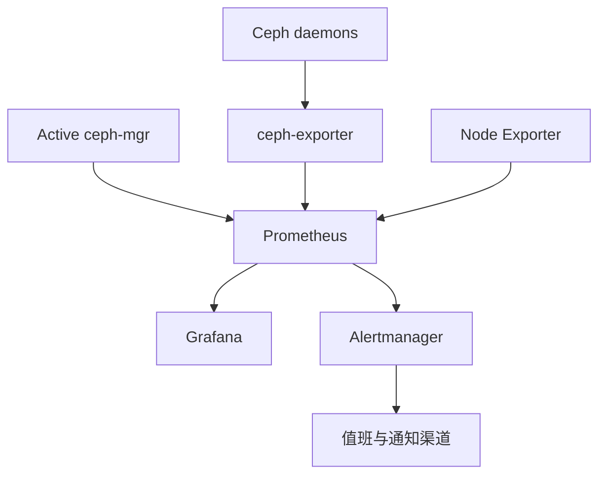

# Ceph 监控与健康检查：Prometheus、Grafana、告警设计与排障方法

《Ceph 从零基础到生产运维实战》第 17 篇

← [第 16 篇：Ceph 日常运维](./16-Ceph日常运维.md)

前面的文章已经完成 Ceph 原理、集群部署和 RBD、CephFS、RGW 三类服务的基础实践。本篇开始建立生产运维的「观察系统」：知道集群现在发生了什么、影响了谁、是否还在恶化，以及下一步应该查哪里。

## 1. 本文目标 {/* #本文目标 */}

读完并完成实验后，你应该能够：

- 区分健康状态、性能指标、日志和业务探测各自解决的问题
- 使用 cephadm 部署或检查 Prometheus、Grafana、Alertmanager 和 Node Exporter
- 理解 Ceph Manager Prometheus 模块和 ceph-exporter 的作用
- 建立集群、主机、服务和业务四个层次的监控
- 设计有优先级、持续时间和处置说明的告警
- 使用一套稳定的顺序排查 Ceph 故障
- 避免「看到告警就重启」「看到 HEALTH_WARN 就静音」等错误做法
- 为 OSD、PG、MON、容量、CephFS、RBD 和 RGW 编写基础 Runbook

本文命令以 cephadm 管理的较新 Ceph 集群为例。不同版本提供的指标名、Dashboard 和告警规则可能不同，执行前应对照当前版本官方文档并在测试环境验证。

## 2. 监控不是一张 Grafana 大屏 {/* #监控不是一张-grafana-大屏 */}

一套真正有用的监控，需要回答六个问题：

1. 发生了什么？
2. 从什么时候开始？
3. 影响哪些服务和用户？
4. 问题仍在恶化，还是正在恢复？
5. 最可能位于哪一层？
6. 谁负责处理，下一步动作是什么？

Grafana 只是展示数据的工具。如果指标采集不完整、告警没有分级、时间不一致、没有 Runbook，即使大屏很漂亮，故障时仍然无法快速定位。

### 2.1 Ceph 可观测性的四类信号 {/* #ceph-可观测性的四类信号 */}

| 信号 | 回答的问题 | 示例 |
| --- | --- | --- |
| 健康检查 | Ceph 已经识别出什么异常 | OSD down、PG inactive、Pool nearfull |
| 指标 | 异常何时出现、趋势如何 | 容量、延迟、吞吐、错误率 |
| 日志 | 某个组件为什么失败 | 认证失败、磁盘 I/O 错误、进程崩溃 |
| 业务探测 | 用户是否真的能使用服务 | RBD I/O、CephFS 文件操作、S3 PUT/GET |

四类信号不能互相替代。例如：

- `ceph -s` 显示健康，不代表业务延迟一定正常
- 主机 CPU 正常，不代表 PG 一定可用
- RGW 进程存活，不代表 S3 鉴权和底层写入一定成功
- 一条错误日志不代表当前仍有业务影响

## 3. 监控链路的整体架构 {/* #监控链路的整体架构 */}

cephadm 可以管理 Ceph 自身守护进程，也可以部署常用监控组件。



各组件职责如下：

| 组件 | 主要职责 |
| --- | --- |
| Ceph Manager Prometheus 模块 | 导出集群级状态和指标 |
| ceph-exporter | 在较新版本中导出守护进程性能计数器，减轻 Manager 压力 |
| Node Exporter | 导出 CPU、内存、磁盘、网络等主机指标 |
| Prometheus | 定期抓取指标并保存时序数据 |
| Grafana | Dashboard 展示和查询 |
| Alertmanager | 告警分组、路由、抑制、静默和通知 |

### 3.1 为什么不能只监控 Ceph 指标 {/* #为什么不能只监控-ceph-指标 */}

Ceph 的症状经常来自主机层：

- 磁盘出现介质错误
- 网卡丢包或重传
- 内存压力触发 OOM
- CPU 被其他进程抢占
- 时间同步异常
- 系统盘写满导致日志和容器异常

因此 Ceph 指标必须与主机指标、交换机指标和业务探测一起观察。

## 4. 检查现有监控栈 {/* #检查现有监控栈 */}

`cephadm bootstrap` 默认通常会部署监控栈，除非部署时使用了跳过监控的选项。先不要重复部署，先检查当前状态：

```bash
ceph orch ls
ceph orch ps --refresh
ceph mgr services
```

重点查找：

- prometheus
- grafana
- alertmanager
- node-exporter
- ceph-exporter（是否存在取决于 Ceph 版本和配置）

查看某类服务：

```bash
ceph orch ls --service_type prometheus
ceph orch ls --service_type grafana
ceph orch ls --service_type alertmanager
ceph orch ls --service_type node-exporter
```

`ceph mgr services` 通常可以显示 Dashboard、Prometheus 等服务地址。访问前还应确认管理网络、防火墙和证书策略。

## 5. 部署监控组件 {/* #部署监控组件 */}

如果 bootstrap 时跳过了监控栈，可以由 cephadm 部署：

```bash
ceph orch apply node-exporter
ceph orch apply alertmanager
ceph orch apply prometheus
ceph orch apply grafana
```

然后检查：

```bash
ceph orch ls
ceph orch ps --refresh
ceph health detail
```

生产环境还要考虑监控系统自身的可用性：

- Prometheus 数据保留时间
- 时序数据占用磁盘空间
- Prometheus 和 Alertmanager 是否需要多个实例
- Grafana 管理员密码和单点登录
- Dashboard、指标和告警接口是否仅对管理网络开放
- 监控系统故障是否有外部监控发现

### 5.1 不要把监控和被监控对象放在同一个故障篮子里 {/* #不要把监控和被监控对象放在同一个故障篮子里 */}

如果 Prometheus、Grafana、Alertmanager 和 Ceph 全部依赖同一组故障节点或同一套不可用存储，Ceph 故障时监控也可能一起消失。

规模较大的生产环境可以：

- 把长期监控数据存到独立平台
- 从外部对 Ceph API 和业务入口做黑盒探测
- 把关键告警同时送往独立通知系统
- 定期验证监控链路本身是否工作

## 6. Ceph Manager Prometheus 模块 {/* #ceph-manager-prometheus-模块 */}

如果只需要启用 Manager 的 Prometheus 模块：

```bash
ceph mgr module enable prometheus
ceph mgr services
```

默认情况下，该模块通常在端口 9283 提供 `/metrics`。以 `ceph mgr services` 返回的实际地址为准：

```bash
curl http://<active-mgr-address>:9283/metrics
```

不要把占位符原样复制执行。

### 6.1 抓取间隔 {/* #抓取间隔 */}

Ceph 官方监控栈常用 15 秒抓取间隔。过于频繁的抓取会增加 Manager、Exporter、Prometheus 和网络开销。通常不建议把间隔设置得低于 10 秒，除非经过容量评估和压测。

### 6.2 Active Manager 切换 {/* #active-manager-切换 */}

Ceph Manager 有 Active 和 Standby。只把外部 Prometheus 永久指向某个固定 Active Manager 地址，会在 Manager 切换后失去采集。

cephadm 管理的监控栈会处理相应服务发现。自建外部 Prometheus 时，应设计：

- 多 Manager 目标
- 服务发现或稳定入口
- Standby 响应策略
- Manager 切换后的自动恢复

### 6.3 指标接口的安全 {/* #指标接口的安全 */}

指标可能暴露：

- 主机名
- 守护进程名称
- Pool 名称
- 集群容量和状态
- 服务拓扑

不要把 9283、Node Exporter、Prometheus 和 Grafana 直接暴露到互联网。应通过管理网络、访问控制、TLS、反向代理或统一身份认证进行保护。

## 7. 先认识 `ceph -s`，再看大屏 {/* #先认识-ceph--s再看大屏 */}

任何 Ceph 告警的第一轮检查通常从以下命令开始：

```bash
ceph -s
ceph health detail
```

`ceph -s` 提供集群摘要，通常包括：

- MON quorum
- MGR Active/Standby
- MDS 状态
- OSD up/in 数量
- Pool、PG 和对象数量
- 容量使用
- 客户端 I/O
- 恢复、回填和重平衡进度
- 当前健康状态

### 7.1 三种健康级别 {/* #三种健康级别 */}

| 状态 | 含义 | 运维态度 |
| --- | --- | --- |
| HEALTH_OK | Ceph 未发现已知健康异常 | 仍需观察性能和业务探测 |
| HEALTH_WARN | 存在风险或降级，但不一定已经中断 | 必须阅读 detail，判断影响和趋势 |
| HEALTH_ERR | 存在严重问题 | 立即按事故流程处理 |

不要把 `HEALTH_WARN` 简单理解为「不严重」。例如 nearfull 可能暂时不影响业务，但如果增长速度很快，数小时后就可能阻断写入。

### 7.2 健康检查名称 {/* #健康检查名称 */}

常见健康检查包括：

| 检查 | 说明 | 第一关注点 |
| --- | --- | --- |
| MON_DOWN | MON 不可用 | quorum 是否仍满足多数派 |
| MON_CLOCK_SKEW | MON 时间偏差 | NTP/Chrony 与网络 |
| MGR_DOWN | 没有可用 MGR | 编排、监控和管理能力 |
| OSD_DOWN | 一个或多个 OSD down | 数据冗余、主机和设备状态 |
| OSD_NEARFULL | OSD 接近容量阈值 | 增长趋势和扩容时间 |
| OSD_BACKFILLFULL | 回填受容量限制 | 恢复能否继续 |
| OSD_FULL | 达到 full 阈值 | 写入可能被阻止，优先级极高 |
| PG_AVAILABILITY | PG 当前不可提供完整 I/O | 业务是否中断 |
| PG_DEGRADED | PG 副本或分片不完整 | 故障域与恢复进度 |
| SLOW_OPS | 操作长时间未完成 | OSD、磁盘、网络和恢复负载 |
| MDS_ALL_DOWN | CephFS 没有可用 MDS | CephFS 客户端访问 |
| MDS_INSUFFICIENT_STANDBY | MDS Standby 不足 | 故障切换能力 |

健康检查名随版本可能增加或变化，应以 `ceph health detail` 和对应版本文档为准。

## 8. 建立分层健康检查 {/* #建立分层健康检查 */}

不要只检查一个总状态。推荐按以下层次建立检查表。

### 8.1 第一层：集群控制面 {/* #第一层集群控制面 */}

```bash
ceph -s
ceph quorum_status
ceph mgr stat
ceph mon stat
```

关注：

- MON 是否形成 quorum
- MGR 是否有 Active 和 Standby
- 是否有时间偏差
- 管理命令是否响应缓慢

### 8.2 第二层：OSD 和 PG {/* #第二层osd-和-pg */}

```bash
ceph osd stat
ceph osd tree
ceph osd df tree
ceph osd perf
ceph pg stat
```

关注：

- up 和 in 是否符合预期
- OSD 是否集中在同一主机或故障域 down
- 容量是否严重不均衡
- OSD 延迟是否异常
- PG 是否 `active+clean`
- 是否正在 recovery、backfill、remapped

### 8.3 第三层：Pool 和容量 {/* #第三层pool-和容量 */}

```bash
ceph df detail
ceph osd pool ls detail
ceph osd dump
```

关注：

- Pool 的 STORED、USED、MAX AVAIL
- 副本数、纠删码配置和 CRUSH 规则
- nearfull、backfillfull、full 阈值
- 使用率增长速度
- 是否保留故障恢复空间

### 8.4 第四层：服务接口 {/* #第四层服务接口 */}

根据业务类型检查：

| 服务 | 检查内容 |
| --- | --- |
| RBD | 镜像可见、客户端映射、测试读写、锁和延迟 |
| CephFS | MDS 状态、客户端挂载、目录操作、会话和元数据延迟 |
| RGW | LB 健康、S3 认证、PUT/GET/DELETE、错误率和延迟 |

### 8.5 第五层：真实业务 {/* #第五层真实业务 */}

最有价值的探测是从接近用户的位置执行最小业务操作，例如：

- 对测试 RBD 文件系统写入并读取一个小文件
- 在 CephFS 测试目录创建、读取、重命名并删除文件
- 对专用 S3 探测 Bucket 执行 PUT、HEAD、GET 和 DELETE

探测账号必须最小权限，数据必须独立，频率必须受控。

## 9. Prometheus 指标应该如何读 {/* #prometheus-指标应该如何读 */}

### 9.1 先发现，再复制 PromQL {/* #先发现再复制-promql */}

不同 Ceph 版本可能修改指标来源、名称或标签。先查看当前集群实际暴露的指标：

```bash
curl -s http://<active-mgr-address>:9283/metrics \
  | grep '^ceph_' \
  | head
```

也可以在 Prometheus 表达式浏览器中查询：

```promql
{__name__=~"ceph_.*"}
```

不要从旧博客复制一条 PromQL 后直接上线告警。至少确认：

- 指标是否存在
- 指标类型是 counter、gauge 还是 histogram
- 标签含义是什么
- 数值单位是什么
- Active Manager 切换后是否连续
- 查询是否会造成高基数

### 9.2 健康检查指标 {/* #健康检查指标 */}

Prometheus 模块可以导出按健康检查名称和严重程度区分的指标。例如：

```promql
ceph_health_detail == 1
```

常见标签包括健康检查名称和 Ceph 严重程度。可以先用该查询查看当前有哪些检查处于激活状态，再为关键故障编写单独规则。

### 9.3 核心指标类别 {/* #核心指标类别 */}

生产 Dashboard 至少覆盖：

| 类别 | 关键观察项 |
| --- | --- |
| 健康 | HEALTH 状态、健康检查明细 |
| MON/MGR | quorum、Active/Standby、切换次数 |
| OSD | up/in、每 OSD 容量、延迟、slow ops |
| PG | active+clean、inactive、degraded、undersized、remapped |
| 容量 | 原始容量、已用、可用、Pool 使用率、增长趋势 |
| I/O | 客户端读写带宽、IOPS、恢复和回填流量 |
| 主机 | CPU、内存、磁盘延迟、网络错误和时间同步 |
| 服务 | MDS、RGW、RBD 镜像或业务接口指标 |

### 9.4 Counter 必须计算速率 {/* #counter-必须计算速率 */}

累计字节数和累计操作数通常是 Counter。直接展示累计值意义有限，应计算单位时间速率，例如：

```promql
rate(<counter_metric>[5m])
```

具体指标名称从当前 `/metrics` 中选择。窗口过短容易抖动，窗口过长会掩盖短时异常，应结合抓取间隔和故障响应目标设置。

### 9.5 RBD 单镜像指标 {/* #rbd-单镜像指标 */}

默认逐镜像采集会带来额外开销和高基数，因此通常不是对所有镜像自动开启。需要时可指定 Pool：

```bash
ceph config set mgr mgr/prometheus/rbd_stats_pools "rbd-prod"
```

如果镜像数量很大，应先评估 Manager、Prometheus 存储和查询开销，只对确有需要的 Pool 或命名空间采集。

## 10. Grafana Dashboard 应该怎么设计 {/* #grafana-dashboard-应该怎么设计 */}

大屏不是面板越多越好。推荐按「总览—容量—性能—组件—业务」分层。

### 10.1 首页：一分钟判断影响 {/* #首页一分钟判断影响 */}

首页只保留关键问题：

- 当前健康状态
- 活跃健康检查
- MON quorum
- OSD up/in
- inactive/degraded PG
- 原始容量和最危险 OSD 使用率
- 客户端吞吐和延迟
- 当前告警
- RBD、CephFS、RGW 业务探测结果

值班人员应在一分钟内判断是否存在业务风险。

### 10.2 容量页面 {/* #容量页面 */}

至少展示：

- 集群总容量、已用和可用
- 每个 Pool 的使用量
- 每个 OSD 的使用率分布
- 最近 7 天、30 天、90 天增长趋势
- nearfull/backfillfull/full 阈值
- 按当前增长速度估算的阈值到达时间

只看平均使用率会掩盖单个 OSD 过满。容量页面必须包含最大值和分布。

### 10.3 性能页面 {/* #性能页面 */}

分开展示：

- 客户端 I/O
- recovery/backfill I/O
- OSD 延迟
- 网络吞吐和重传
- 磁盘延迟和队列
- CPU 与内存

这样才能判断业务变慢是客户端负载增加、后台恢复争抢，还是某个设备异常。

### 10.4 服务页面 {/* #服务页面 */}

分别为 RBD、CephFS 和 RGW 建立页面：

- CephFS 重点看 MDS 状态、客户端会话和元数据负载
- RGW 重点看请求率、状态码、延迟、连接数和 LB 后端
- RBD 重点看 Pool、客户端 I/O，以及经过评估后开启的镜像级指标

## 11. 好告警的五个组成部分 {/* #好告警的五个组成部分 */}

每条告警至少应包含：

1. **条件**：什么指标达到什么状态
2. **持续时间**：持续多久才告警
3. **严重级别**：P1、P2、P3 或 Warning/Critical
4. **影响描述**：可能影响什么业务
5. **Runbook**：收到后先查什么、谁负责

### 11.1 一个基础健康告警示例 {/* #一个基础健康告警示例 */}

下面只是结构示例，必须在当前环境验证标签和通知路由：

```yaml
groups:
  - name: ceph-health
    rules:
      - alert: CephHealthCheckActive
        expr: ceph_health_detail == 1
        for: 5m
        labels:
          severity: warning
        annotations:
          summary: "Ceph health check {{ $labels.name }} is active"
          description: "Ceph reported {{ $labels.name }} for more than 5 minutes."
          runbook_url: "https://runbook.example.internal/ceph/health"
```

这个通用规则适合兜底，但生产中仍应把严重故障拆成独立规则。

### 11.2 关键可用性告警 {/* #关键可用性告警 */}

例如：

```yaml
- alert: CephCriticalAvailability
  expr: ceph_health_detail{name=~"MON_DOWN|OSD_FULL|PG_AVAILABILITY|MDS_ALL_DOWN"} == 1
  for: 1m
  labels:
    severity: critical
  annotations:
    summary: "Critical Ceph check {{ $labels.name }} is active"
    runbook_url: "https://runbook.example.internal/ceph/critical"
```

`PG_AVAILABILITY`、`OSD_FULL` 等直接威胁 I/O 的问题，等待时间通常比一般告警短。具体时长应基于业务 SLO 和历史抖动确定。

### 11.3 不要让所有告警同一个级别 {/* #不要让所有告警同一个级别 */}

可以按影响分类：

| 级别 | 示例 | 处理要求 |
| --- | --- | --- |
| P1/Critical | PG 不可用、OSD full、MON 失去多数派 | 立即响应并建立事故群 |
| P2/High | 多副本降级、多个 OSD down、容量快速逼近阈值 | 值班人员尽快处理 |
| P3/Warning | 单个冗余组件不足、容量趋势风险 | 工作时间跟进并排期 |
| Info | 计划内恢复、滚动升级事件 | 记录或看板展示 |

级别应依据用户影响，而不是依据组件名称看起来是否重要。

## 12. 告警降噪：持续时间、分组、抑制和静默 {/* #告警降噪持续时间分组抑制和静默 */}

### 12.1 持续时间 {/* #持续时间 */}

短暂的 OSD 重启或 PG remapped 可能在计划维护中迅速恢复。合理的 `for` 可以避免瞬时抖动产生通知风暴。

但不能给所有告警都设置很长等待：

- PG inactive 直接影响可用性，应快速告警
- 容量趋势告警可以持续更久
- 单个瞬时 slow op 可以观察，持续 slow ops 则需要告警

### 12.2 分组 {/* #分组 */}

一台主机宕机可能同时产生：

- 主机失联
- 多个 OSD down
- PG degraded
- Ceph health warn
- 业务延迟上升

Alertmanager 应按集群、主机或故障域合理分组，减少几十条独立通知淹没根因。

### 12.3 抑制 {/* #抑制 */}

已确认主机宕机时，可以抑制由它派生的低优先级 OSD 告警，但不应抑制 PG 不可用等更严重结果。

### 12.4 静默 {/* #静默 */}

计划维护可以创建有开始和结束时间的静默，并记录：

- 变更单
- 负责人
- 影响范围
- 自动到期时间

永久静默不是修复。临时静默到期后若问题仍存在，告警必须恢复。

## 13. 一套稳定的故障排查方法 {/* #一套稳定的故障排查方法 */}

面对 Ceph 故障，最危险的是没有证据就连续重启多个组件。推荐使用以下八步。

### 13.1 第一步：确认用户影响 {/* #第一步确认用户影响 */}

先回答：

- 哪个业务失败
- 是完全不可用还是变慢
- 读失败、写失败还是都失败
- RBD、CephFS、RGW 中哪一个受影响
- 所有客户端还是部分客户端
- 从什么时间开始

### 13.2 第二步：保存现场 {/* #第二步保存现场 */}

记录：

- 当前时间和时区
- `ceph -s`
- `ceph health detail`
- 告警开始时间
- 近期变更
- 受影响的主机、Pool、PG 和业务

后续状态会随着恢复不断变化，最初现场可能很快消失。

### 13.3 第三步：判断范围 {/* #第三步判断范围 */}

区分：

- 单客户端
- 单网络区域
- 单 Pool
- 单主机
- 单 OSD
- 某类服务
- 整个集群

范围越小，越不应该直接操作整个集群。

### 13.4 第四步：建立时间线 {/* #第四步建立时间线 */}

对齐：

- 监控曲线
- Ceph 日志
- Linux 日志
- 交换机和硬件告警
- 发布、扩容、重启和配置变更
- 用户首次报障时间

所有节点时间必须同步，否则时间线会误导判断。

### 13.5 第五步：先稳定业务 {/* #第五步先稳定业务 */}

根据证据选择最小影响动作，例如：

- 把异常 RGW 从 LB 摘除
- 停止非必要批处理
- 控制恢复流量，前提是明确业务与恢复的优先级
- 隔离明确故障设备
- 扩容或释放安全容量
- 切换到已演练的容灾服务

应急操作必须记录，并明确回退条件。

### 13.6 第六步：修复根因 {/* #第六步修复根因 */}

业务恢复后仍要处理根因，例如：

- 更换故障盘或网卡
- 修复时间同步
- 调整错误 CRUSH 拓扑
- 扩容
- 修复应用重试风暴
- 修改不合理的超时和限流配置

### 13.7 第七步：验证恢复 {/* #第七步验证恢复 */}

不能只看告警消失。至少验证：

- Ceph 健康检查恢复或处于可解释状态
- PG 恢复进度正常
- 业务读写探测成功
- 延迟、错误率和吞吐回到基线
- 容量和冗余满足要求
- 临时措施已经回收

### 13.8 第八步：复盘和改进 {/* #第八步复盘和改进 */}

复盘应输出：

- 根因和触发条件
- 用户影响
- 为什么现有保护没有阻止故障
- 哪个信号最先出现
- 哪些告警缺失或太吵
- Runbook 和自动化如何改进
- 负责人和完成时间

## 14. 只读现场采集清单 {/* #只读现场采集清单 */}

下面的命令以观察为主，适合故障初期建立快照：

```bash
date -Is
ceph -s
ceph health detail
ceph versions
ceph quorum_status
ceph mgr stat
ceph orch host ls --detail
ceph orch ls
ceph orch ps --refresh
ceph osd stat
ceph osd tree
ceph osd df tree
ceph osd perf
ceph pg stat
ceph df detail
```

执行时注意：

- 保留完整输出和时间
- 不要在公开工单暴露主机名、IP 和业务 Pool 名
- 大集群中某些详细命令输出很多，应评估管理节点和终端负担
- 初始采集后再针对异常对象深入查询

## 15. OSD down 的排查路径 {/* #osd-down-的排查路径 */}

### 15.1 确认是单 OSD 还是整机 {/* #确认是单-osd-还是整机 */}

```bash
ceph osd tree
ceph orch ps --daemon_type osd --refresh
```

如果同一主机多个 OSD 同时 down，优先检查主机、电源、网络和系统，而不是逐个重启 OSD。

### 15.2 检查主机和守护进程 {/* #检查主机和守护进程 */}

在对应主机检查：

- 主机是否在线
- 系统负载和内存
- 容器和 systemd 单元
- 数据盘是否存在
- 内核是否报告 I/O、NVMe、SCSI 或文件系统错误
- 网络是否能访问集群网络

### 15.3 检查数据保护状态 {/* #检查数据保护状态 */}

```bash
ceph -s
ceph health detail
ceph pg stat
```

关注副本是否降级、PG 是否 inactive，以及是否还有其他 OSD 故障。

### 15.4 不要第一时间把 OSD 标记丢失 {/* #不要第一时间把-osd-标记丢失 */}

`lost`、销毁 OSD、清除认证和重新创建等操作可能造成不可逆的数据风险。只有在明确设备永久丢失、确认冗余状态并理解数据后果时，才进入对应恢复流程。

## 16. PG 异常的排查路径 {/* #pg-异常的排查路径 */}

PG 告警必须先区分「不可用」和「冗余不足」。

| 状态 | 大致含义 | 优先级 |
| --- | --- | --- |
| inactive | 当前不能正常提供 I/O | 很高 |
| stale | MON 长时间未收到 PG 状态 | 很高 |
| peering | 正在确定权威历史和副本集合 | 看持续时间和上下文 |
| degraded | 部分对象副本不完整 | 高 |
| undersized | PG 副本/分片数少于目标 | 高 |
| remapped | PG 临时映射改变 | 恢复期间常见 |
| backfilling | 正在回填数据 | 观察进度和影响 |

查看卡住的 PG：

```bash
ceph pg dump_stuck inactive
ceph pg dump_stuck stale
ceph pg dump_stuck degraded
```

对单个 PG 深入查询：

```bash
ceph pg <pgid> query
ceph pg map <pgid>
```

分析时回答：

- 该 PG 属于哪个 Pool
- acting set 和 up set 是哪些 OSD
- 哪些 OSD down 或不在集群
- 是否因容量阈值不能回填
- 是否正在恢复且进度稳定
- 是否出现反复 peering
- 是否影响实际业务对象

不要看到 `inconsistent` 就直接执行 `repair`。应先确认是 scrub 发现的数据、元数据还是校验和问题，检查底层设备错误，并按当前 Ceph 版本的修复流程处理。

## 17. 容量告警的排查路径 {/* #容量告警的排查路径 */}

### 17.1 观察集群和单 OSD {/* #观察集群和单-osd */}

```bash
ceph df detail
ceph osd df tree
ceph osd dump
```

要同时观察：

- 集群整体使用率
- 最满 OSD
- 使用率分布
- 每个 Pool 的使用量
- 当前增长速度
- 恢复和回填所需空间

### 17.2 为什么平均还有空间，仍然会 nearfull {/* #为什么平均还有空间仍然会-nearfull */}

Ceph 的 full ratio 主要按 OSD 判断，而不是只看全局平均。某些 OSD 因 CRUSH、PG 分布、设备容量不同或历史数据不均衡而更满，会提前触发阈值。

### 17.3 正确处置顺序 {/* #正确处置顺序 */}

1. 确认增长来源
2. 停止可安全停止的异常写入
3. 清理明确可删除且有审批的数据
4. 检查数据分布和 balancer
5. 尽快扩容
6. 验证数据恢复和均衡
7. 调整容量预测和提前量

不要为了让告警消失而随意提高 nearfull/full 阈值。提高阈值并不会增加一字节物理空间，反而会压缩恢复余量。

## 18. Slow Ops 的排查路径 {/* #slow-ops-的排查路径 */}

`SLOW_OPS` 表示操作在 OSD 或相关组件中等待时间过长。它是症状，不直接等于磁盘坏了。

可能原因包括：

- HDD/SSD/NVMe 延迟异常
- BlueStore DB/WAL 设备拥塞
- 网络丢包、重传或带宽饱和
- OSD CPU 或内存压力
- recovery/backfill/scrub 与业务争抢
- 单个热 Pool 或热 PG
- 底层设备重置
- 客户端请求风暴

第一轮检查：

```bash
ceph health detail
ceph osd perf
ceph -s
ceph osd tree
```

再结合主机指标查看：

- 磁盘平均和尾延迟
- I/O 队列
- 设备错误
- 网络错误和重传
- CPU iowait
- 恢复吞吐
- 问题是否集中在同一主机、机架或设备型号

只重启 OSD 可能暂时清除现场，却不能修复慢盘、网络或容量问题。

## 19. MON 和时间同步故障 {/* #mon-和时间同步故障 */}

MON 使用多数派 quorum 保证集群映射和关键状态一致。三个 MON 中失去一个通常还能工作，失去多数派则会严重影响集群。

检查：

```bash
ceph mon stat
ceph quorum_status
ceph health detail
```

如果出现 clock skew：

```bash
timedatectl
chronyc tracking
chronyc sources -v
```

排查：

- NTP/Chrony 服务是否运行
- 节点能否访问时间源
- 虚拟化宿主机时间是否异常
- 防火墙是否拦截时间同步
- 是否有人手工修改系统时间

不要通过放宽时间偏差阈值掩盖真实的时间同步故障。错误时间还会影响 S3 签名、日志关联、证书和审计。

## 20. 服务级排查入口 {/* #服务级排查入口 */}

### 20.1 RBD {/* #rbd */}

```bash
rbd ls <pool>
rbd info <pool>/<image>
rbd status <pool>/<image>
ceph df detail
ceph health detail
```

关注：

- 是单镜像、单客户端还是整个 Pool
- 是否存在独占锁或失联客户端
- RBD 客户端内核和功能是否兼容
- 底层 PG 和 OSD 是否异常
- 应用、文件系统和块设备哪一层先变慢

### 20.2 CephFS {/* #cephfs */}

```bash
ceph fs status
ceph mds stat
ceph fs dump
ceph health detail
```

关注：

- Active MDS 是否可用
- Standby 是否足够
- 客户端会话是否异常
- 元数据负载是否集中
- 数据 Pool 与元数据 Pool 是否健康
- 问题是路径权限、MDS 还是底层 RADOS

### 20.3 RGW {/* #rgw */}

```bash
ceph orch ps --daemon_type rgw --refresh
ceph health detail
radosgw-admin user info --uid=<user>
radosgw-admin bucket stats --bucket=<bucket>
```

从外到内检查：

1. DNS
2. TLS
3. 负载均衡
4. RGW 进程
5. 用户和 Policy
6. Bucket
7. RADOS Pool、PG、OSD

## 21. 日志应该怎么查 {/* #日志应该怎么查 */}

### 21.1 先找到守护进程所在主机 {/* #先找到守护进程所在主机 */}

```bash
ceph orch ps --refresh
```

记录：

- daemon name
- hostname
- status
- 启动时间
- 镜像版本

### 21.2 查看 cephadm 守护进程日志 {/* #查看-cephadm-守护进程日志 */}

在对应主机上可以使用：

```bash
cephadm logs --name <daemon-name>
```

也可以根据实际 systemd 单元使用 `journalctl`。不同 Ceph 版本和部署方式的单元名称可能不同，应先通过 `systemctl` 确认，不要猜测。

### 21.3 日志检索需要上下文 {/* #日志检索需要上下文 */}

有效的检索条件包括：

- 准确时间范围
- daemon name
- OSD ID 或 PG ID
- RGW request ID
- 客户端 ID
- 错误码
- 设备名

不要只搜索 `error`。有些严重问题用 slow request、reset、timeout、blocked 或内核设备错误表达；有些 error 则是已预期的客户端认证失败。

### 21.4 日志保留 {/* #日志保留 */}

事故发生后才发现日志只保留十分钟，等于失去关键证据。应提前规划：

- 本地 journald 大小
- 集中日志平台
- 保留周期
- 时间同步
- 敏感信息脱敏
- 按集群、主机和守护进程查询

## 22. 性能基线比固定阈值更有价值 {/* #性能基线比固定阈值更有价值 */}

同一个延迟值在不同集群中意义不同：

- 全 NVMe 集群的正常延迟
- HDD 容量集群的正常延迟
- 深夜空闲时延迟
- 恢复期间延迟
- 小对象随机写和大对象顺序读延迟

上线前应通过代表性压测建立基线：

| 项目 | 建议记录 |
| --- | --- |
| 客户端 | 并发、块大小、读写比例、队列深度 |
| 性能 | IOPS、吞吐、平均/P95/P99 延迟 |
| 集群 | OSD 延迟、CPU、网络、磁盘利用率 |
| 恢复 | 降级和回填时业务性能 |
| 容量 | 不同使用率下的性能 |

告警阈值应结合基线、SLO 和容量趋势，而不是机械照搬其他公司的数字。

## 23. 业务 SLI 与 SLO {/* #业务-sli-与-slo */}

基础设施指标最终要服务于用户体验。

### 23.1 可选择的 SLI {/* #可选择的-sli */}

| 服务 | SLI 示例 |
| --- | --- |
| RBD | 测试卷读写成功率、I/O 尾延迟 |
| CephFS | 文件创建/读取/删除成功率和耗时 |
| RGW | S3 PUT/GET 成功率、P95/P99 延迟 |
| Ceph 集群 | PG 可用性、读写错误、容量安全余量 |

### 23.2 SLO 示例思路 {/* #slo-示例思路 */}

例如 RGW 可以定义：

- 月度成功请求比例目标
- P99 GET/PUT 延迟目标
- 单次不可用最大持续时间
- 恢复点和恢复时间目标

具体数字必须来自业务需求和压测，不应直接照抄示例。

### 23.3 错误预算 {/* #错误预算 */}

SLO 允许一定比例失败，这部分就是错误预算。错误预算消耗过快时，应减少高风险变更，优先处理稳定性问题。这样可以把「Ceph 健康」与「用户是否得到承诺的服务」连接起来。

## 24. 变更与监控必须关联 {/* #变更与监控必须关联 */}

Ceph 异常常与近期变更有关：

- 新增或移除 OSD
- 调整 CRUSH
- 修改副本数或纠删码
- 升级 Ceph
- 调整恢复参数
- 修改网络和防火墙
- 应用发布带来负载突增

监控平台应显示变更标记，值班人员可以把延迟、错误率和容量变化与发布时间对齐。

每次变更至少定义：

- 观察指标
- 成功标准
- 停止条件
- 回退条件
- 观察时间
- 负责人

## 25. Runbook 应该写什么 {/* #runbook-应该写什么 */}

一条可执行的 Runbook 至少包含：

- 告警含义
- 可能的用户影响
- 第一轮只读命令
- 如何判断范围
- 常见原因
- 可选的止损动作
- 哪些动作具有数据风险
- 升级给谁
- 恢复验证
- 需要保留的证据

### 25.1 一个简化映射表 {/* #一个简化映射表 */}

| 告警 | 第一轮命令 | 重点判断 |
| --- | --- | --- |
| OSD down | `ceph osd tree`、`ceph orch ps` | 单盘还是整机 |
| PG unavailable | `ceph health detail`、`ceph pg <id> query` | acting OSD 和数据可用性 |
| Nearfull | `ceph df detail`、`ceph osd df tree` | 最满 OSD、增长源和扩容时间 |
| Slow ops | `ceph osd perf`、主机磁盘/网络指标 | 集中设备、网络还是恢复负载 |
| MON down | `ceph quorum_status`、`ceph mon stat` | 是否仍有多数派 |
| MDS down | `ceph fs status`、`ceph mds stat` | Active/Standby 和 CephFS 影响 |
| RGW 5xx | RGW 后端测试、`ceph -s` | LB、RGW 还是 RADOS |

Runbook 不是一次写完。每次故障和演练后都应更新。

## 26. 常见错误做法 {/* #常见错误做法 */}

**错误一：看到告警先重启**

重启会破坏现场，还可能触发更多 PG peering 和恢复。先确认范围、保存证据，再执行最小必要操作。

**错误二：只看 `ceph -s`**

它是入口，不是全部。性能下降、单客户端故障和外部 LB 问题可能不会直接出现在总状态中。

**错误三：只看平均值**

平均容量、平均延迟会掩盖最满 OSD、慢盘和尾延迟。必须看分布、最大值和 P95/P99。

**错误四：所有 HEALTH_WARN 都发最高级通知**

这会造成告警疲劳。应按用户影响、持续时间和恢复能力分级。

**错误五：永久静默烦人的告警**

告警烦人通常说明规则或根因需要修复。永久静默会把未来真正事故一起隐藏。

**错误六：复制旧版本 PromQL**

指标名、标签和来源可能已经变化。先检查当前 `/metrics`，再验证查询。

**错误七：只监控 Ceph，不监控业务入口**

Ceph 健康时，DNS、证书、负载均衡、客户端权限仍可能失败。必须做端到端探测。

**错误八：为了消除容量告警提高 full ratio**

阈值不是容量。无计划地提高阈值会减少恢复空间并放大数据风险。

## 27. 每日、每周和每月检查建议 {/* #每日每周和每月检查建议 */}

### 27.1 每日自动检查 {/* #每日自动检查 */}

- 集群健康状态和健康明细
- MON/MGR/MDS/OSD 数量
- inactive、degraded PG
- nearfull/full 风险
- 业务探测成功率
- 关键告警是否正常投递
- 硬件和时间同步告警

自动检查应产生异常通知，而不是要求人工每天复制大量命令。

### 27.2 每周检查 {/* #每周检查 */}

- 容量增长和最满 OSD
- OSD 延迟和设备异常趋势
- 告警噪声和重复告警
- 长期恢复、scrub 或同步异常
- CephFS、RGW、RBD 服务趋势
- 备份任务与恢复验证结果

### 27.3 每月检查 {/* #每月检查 */}

- 容量预测与扩容计划
- Ceph 版本和安全更新
- 证书及密钥到期
- 故障域和冗余是否符合设计
- Runbook 和联系人是否有效
- 恢复、主机故障和入口切换演练
- SLO 与错误预算

## 28. 生产上线检查清单 {/* #生产上线检查清单 */}

### 28.1 指标与展示 {/* #指标与展示 */}

- [ ] Prometheus 能持续抓取 Ceph 和主机指标
- [ ] Active Manager 切换后采集自动恢复
- [ ] Grafana 总览能在一分钟内判断影响
- [ ] 容量页面包含单 OSD 分布和趋势
- [ ] 性能页面区分客户端与恢复流量
- [ ] RBD、CephFS、RGW 有服务级视图
- [ ] 指标接口只对授权网络开放

### 28.2 告警 {/* #告警 */}

- [ ] PG 不可用、OSD full、MON quorum 有高优先级告警
- [ ] Nearfull 告警提前量覆盖采购和扩容周期
- [ ] 告警包含集群、对象、影响和 Runbook
- [ ] Alertmanager 已配置分组和抑制
- [ ] 计划维护静默会自动到期
- [ ] 已测试通知渠道，不只是规则语法
- [ ] 监控系统自身有外部探测

### 28.3 排障能力 {/* #排障能力 */}

- [ ] 值班人员能完成只读现场采集
- [ ] 日志集中保存且时间一致
- [ ] 可以按 daemon、PG、请求 ID 查询日志
- [ ] OSD、PG、容量、MON、MDS、RGW 有 Runbook
- [ ] 高风险命令有审批和双人复核
- [ ] 故障后会进行恢复验证和复盘

### 28.4 业务验证 {/* #业务验证 */}

- [ ] RBD 有受控读写探测
- [ ] CephFS 有受控文件操作探测
- [ ] RGW 有受控 S3 API 探测
- [ ] 探测账号和数据遵循最小权限
- [ ] 业务 SLO 和基础设施告警已经关联

## 29. 本文小结 {/* #本文小结 */}

监控 Ceph 的核心不是收集尽可能多的数据，而是建立一条可靠的判断链：

```text
用业务探测确认用户影响
→ 用 ceph -s 和健康检查识别集群症状
→ 用 Prometheus 指标判断开始时间、范围和趋势
→ 用主机、网络和日志定位组件根因
→ 选择最小影响的止损和修复动作
→ 用业务读写、健康状态和性能基线验证恢复
→ 通过复盘改进告警和 Runbook
```

到这里，我们已经完成从 Ceph 基础原理、部署、三类存储接口到生产监控的第一轮闭环。接下来的文章可以进入更具体的故障场景：OSD 故障与磁盘更换、PG 异常、容量危机、网络故障、性能分析和升级维护。

下一篇将建立 Ceph 故障排查方法，从 PG 状态入手系统分析异常。

→ [第 18 篇：建立 Ceph 故障排查方法](../06-troubleshooting/18-建立Ceph故障排查方法.md)

## 30. 课后练习 {/* #课后练习 */}

1. 为什么 `HEALTH_OK` 不能证明业务一定正常？
2. Prometheus、Grafana 和 Alertmanager 的职责分别是什么？
3. 为什么只监控 Ceph 指标不够？
4. PG inactive 与 PG degraded 的处理优先级有什么区别？
5. OSD down 时，为什么要先判断是单盘还是整机？
6. 为什么提高 full ratio 不能解决容量不足？
7. Slow Ops 可能由哪些层次的问题引起？
8. 一条可执行的 Runbook 至少应包含哪些内容？
9. 为什么告警需要分组、抑制和自动到期静默？
10. 故障恢复后，为什么还要进行业务验证和复盘？

## 31. 官方资料 {/* #官方资料 */}

- [Cephadm 监控服务](https://docs.ceph.com/en/latest/cephadm/services/monitoring/)
- [Ceph Manager Prometheus 模块](https://docs.ceph.com/en/latest/mgr/prometheus/)
- [Ceph 健康检查](https://docs.ceph.com/en/latest/rados/operations/health-checks/)
- [Ceph 监控集群](https://docs.ceph.com/en/latest/rados/operations/monitoring/)
- [Ceph 故障排查](https://docs.ceph.com/en/latest/rados/troubleshooting/)
- [Prometheus Alerting Rules](https://prometheus.io/docs/prometheus/latest/configuration/alerting_rules/)
- [Alertmanager](https://prometheus.io/docs/alerting/latest/alertmanager/)
