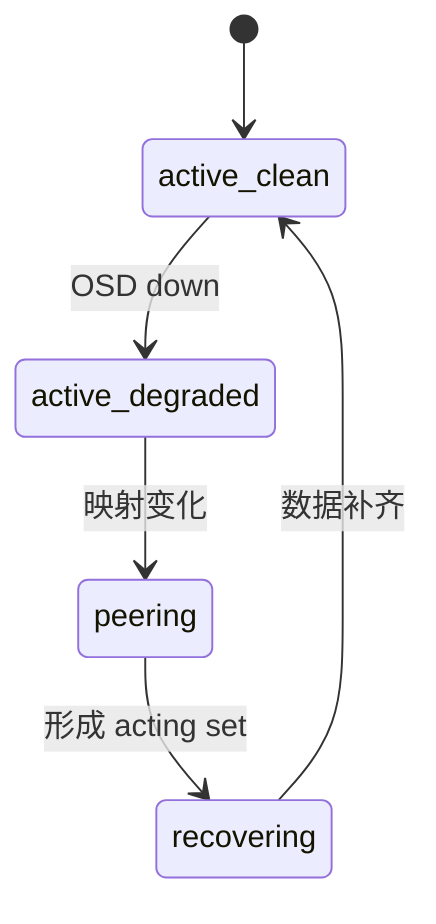
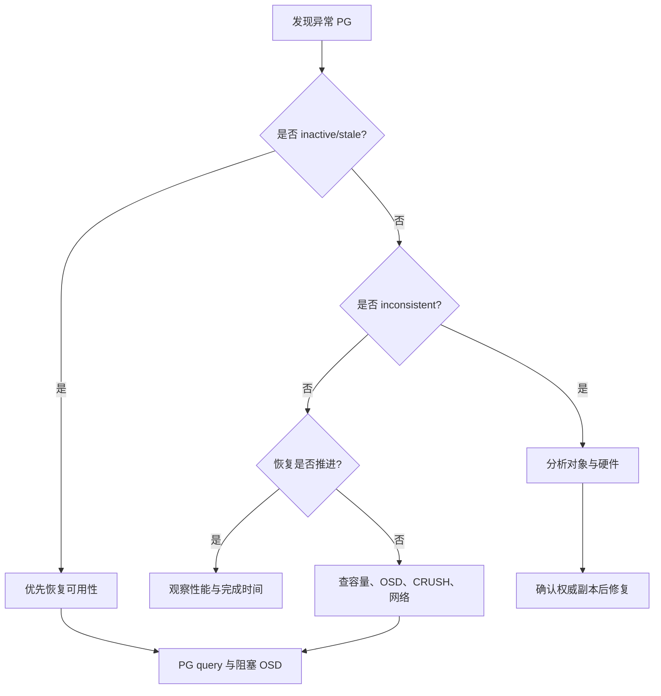

# Ceph PG 异常排查：从状态含义到 Inactive、Peering、Inconsistent 与 Unfound

《Ceph 从零基础到生产运维实战》第 18 篇

← [第 17 篇：Ceph 监控告警](../05-operations/17-Ceph监控告警.md)

PG 是 Ceph 数据放置、复制、恢复和一致性检查的核心单位。很多故障最后都会表现为 PG 状态变化，因此看懂 PG，才算真正具备 Ceph 故障分析能力。


## 本文目标

读完本文后，你应该能够：

- 解释 PG 为什么存在，以及它与 Pool、对象、OSD 的关系
- 读懂常见 PG 组合状态
- 区分「暂时不 clean」「冗余不足」和「业务不可用」
- 使用 `ceph pg <pgid> query` 分析 peering 阻塞位置
- 排查 inactive、stale、undersized、degraded 和 backfillfull
- 理解 scrub、deep-scrub、inconsistent 和 `pg repair` 的边界
- 判断 unfound 对象可能位于哪些 OSD
- 认识 `mark_unfound_lost` 的不可逆数据风险
- 建立一套从告警到恢复验证的 PG Runbook

:::danger 风险提示
PG 修复涉及数据副本选择。`pg repair`、降低 `min_size`、强制恢复、标记 unfound 对象丢失等操作不能按模板盲目执行。生产中必须先保存现场、判断权威副本并确认应用影响。
:::

## PG 到底解决了什么问题

假设集群有数十亿个对象。如果 MON 为每个对象保存「它在哪几块盘上」，映射规模会非常大，数据变化时管理成本也难以接受。

Ceph 在对象和 OSD 之间增加了 PG：


简化理解：

1. 对象名经过哈希映射到某个 PG
2. PG 再通过 CRUSH 映射到一组 OSD
3. 故障与恢复主要按 PG 组织
4. MON 管理有限数量的 PG 状态，而不是逐对象位置

### PG ID 的形式

PG ID 通常类似：

```text
3.a7
```

- `3` 是 Pool ID
- `a7` 是该 Pool 内 PG 的十六进制标识

查看 Pool ID：

```bash
ceph osd lspools
ceph osd pool ls detail
```

知道 Pool 后，才能继续判断受影响的是 RBD、CephFS、RGW 还是其他业务。

## PG 状态为什么经常是组合形式

PG 状态可能是：

```text
active+clean
active+degraded
active+undersized+degraded
down+peering
active+clean+inconsistent
active+remapped+backfilling
```

每个词描述一个维度：

- 能否处理 I/O
- 副本/分片是否完整
- 是否正在确定权威历史
- 是否正在迁移
- 一致性检查是否发现错误

不能只看到一个词就下结论，要读完整组合。

## 最常见 PG 状态速查表

| 状态 | 含义 | 是否一定影响业务 |
| --- | --- | --- |
| creating | PG 正在创建 | 新 Pool 阶段可能正常 |
| peering | OSD 正在交换 PG 历史并选择权威集合 | 持续过久可能不可用 |
| active | PG 可以处理客户端请求 | 通常可用 |
| clean | 对象副本/EC 分片达到目标并一致 | 理想状态 |
| degraded | 部分对象副本或分片缺失 | 可能仍可用，但冗余下降 |
| undersized | acting set 数量少于 Pool size | 可能仍可用，风险增加 |
| inactive | PG 不能处理读写 | 会影响对应数据 |
| stale | MON 长时间未收到 PG 状态 | 可能所有相关 OSD 都不可达 |
| down | 没有足够 OSD 形成可用 PG | 对应数据不可用 |
| remapped | 当前 acting set 与正常 up set 不同 | 恢复/重平衡期间常见 |
| recovering | 正在补齐缺失对象 | 通常可用但性能受影响 |
| backfilling | 正在批量迁移对象 | 通常可用但性能受影响 |
| backfill_wait | 等待回填资源或调度 | 观察等待原因和持续时间 |
| backfill_toofull | 目标 OSD 容量不允许回填 | 恢复被容量阻塞 |
| scrubbing | 正在做浅层一致性检查 | 正常后台任务 |
| deep | 正在做深度校验和检查 | 可能增加磁盘负载 |
| inconsistent | scrub 发现副本、校验和或元数据不一致 | 需要调查 |
| recovery_unfound | 恢复所需对象没有找到可用副本 | 可能存在数据丢失 |

### 第一优先级看什么

先按业务影响分三层：

| 层级 | 示例 | 判断 |
| --- | --- | --- |
| 可用性问题 | inactive、down、stale | 优先处理，可能直接中断 I/O |
| 数据保护问题 | degraded、undersized、unfound | 数据可能仍可读写，但容错能力下降 |
| 恢复过程 | remapped、recovering、backfilling | 可能是正常进展，要看是否持续推进 |

`active+degraded` 与 `inactive` 不是同一严重程度。前者通常还能服务请求，后者对应数据当前不能正常提供 I/O。

## PG 正常恢复时会经历什么

一个 OSD 短暂故障后，PG 可能经历：



过程中短暂出现 peering、degraded、remapped、recovering 不一定是故障。关键是：

- 是否符合近期变更或设备故障
- PG 数量是否持续下降
- 恢复字节和对象是否持续推进
- 客户端延迟是否可接受
- 是否出现 inactive、unfound、backfill_toofull
- 是否反复在几个状态之间震荡

### 「不是 active+clean」不等于必须人工修复

Ceph 的设计目标之一就是自动恢复。恢复正在正常推进时，过早执行 repair、强制 recovery 或反复重启 OSD，反而可能打断正常过程。

## PG 排障的第一轮命令

```bash
date -Is
ceph -s
ceph health detail
ceph pg stat
ceph osd stat
ceph osd tree
ceph osd df tree
ceph osd perf
```

查看长期卡住的 PG：

```bash
ceph pg dump_stuck stale
ceph pg dump_stuck inactive
ceph pg dump_stuck unclean
```

回答：

1. 异常 PG 有多少个？
2. 属于同一个 Pool 还是多个 Pool？
3. acting set 是否集中在同一 OSD、主机或机架？
4. 是否有 OSD down/out？
5. 是否存在 nearfull/backfillfull/full？
6. 是否刚发生换盘、扩容、CRUSH 或副本数变更？
7. 状态是否持续推进？
8. 对应业务是否读写失败？

## 从 PG ID 反查业务范围

假设异常 PG 为 `3.a7`。

### 找 Pool

```bash
ceph osd lspools
ceph osd pool ls detail
```

找到 ID 为 3 的 Pool。

### 判断 Pool 用途

检查：

- Pool application 标签
- RBD 镜像是否位于该 Pool
- 是否为 CephFS metadata/data Pool
- 是否为 RGW data/index/metadata Pool
- 是否为测试 Pool

```bash
ceph osd pool application get <pool-name>
```

### 为什么这一步重要

同样是一个 PG inactive：

- RBD Pool 可能让部分虚拟机磁盘 I/O 卡住
- CephFS metadata Pool 可能影响整个文件系统命名空间
- RGW index Pool 可能影响 Bucket 列表和写入
- 废弃测试 Pool 可能没有业务影响

没有业务映射，无法正确设置事故级别。

## 使用 `ceph pg query` 深入分析

```bash
ceph pg 3.a7 query
```

输出较长，重点观察：

| 字段/区域 | 关注点 |
| --- | --- |
| state | 当前组合状态 |
| up | CRUSH 计算出的目标 OSD 集合 |
| acting | 当前实际负责该 PG 的 OSD 集合 |
| recovery_state | peering/recovery 卡在哪一步 |
| enter_time | 进入当前阶段的时间 |
| blocked / blocked_by | 被哪些 OSD 或条件阻塞 |
| probing_osds | 正在向哪些 OSD 查询历史 |
| might_have_unfound | 哪些 OSD 可能含缺失对象 |
| peer_info | 各副本知道的 PG 历史 |

### up set 与 acting set

- **up**：当前 CRUSH 和 OSDMap 希望 PG 所在的位置
- **acting**：当前实际承担 PG 的 OSD

两者不同可能出现在恢复、临时映射、upmap 或 OSD 故障期间。不能仅凭不同就判断错误，要结合 remapped 和恢复过程。

### recovery_state

如果 PG 卡在 peering，`recovery_state` 是最重要的证据之一。它可以显示：

- 等待某些 OSD 的 PG info
- 等待日志
- 等待获取缺失集
- 找不到足够权威历史
- 被 down OSD 阻塞

记录最早进入阻塞阶段的时间，并到对应 OSD 和主机检查日志、磁盘和网络。

## Inactive PG 排查

### inactive 意味着什么

inactive 表示 PG 当前不能正常处理客户端读写。它不是单纯的「副本少一份」，而是可用性问题。

### 常见原因

- acting set 中关键 OSD down
- 可用副本/EC 分片少于 `min_size`
- PG peering 无法完成
- MON 与 OSD 状态不一致或网络隔离
- CRUSH 约束无法找到足够 OSD
- 多重故障导致没有可选权威副本
- Pool size 大于当前可满足的故障域数量

### 排查顺序

```bash
ceph health detail
ceph pg dump_stuck inactive
ceph pg <pgid> query
ceph osd tree
ceph osd df tree
```

然后检查 Pool 参数：

```bash
ceph osd pool get <pool-name> size
ceph osd pool get <pool-name> min_size
ceph osd pool get <pool-name> crush_rule
```

### 不要为了恢复写入随便降低 min_size

`min_size` 是允许 PG 处理 I/O 所需的最小副本/分片数。降低它可能让集群在冗余不足时接受新写入。

风险包括：

- 新写入只存在极少副本
- 再坏一块盘就丢失最新数据
- EC Pool 可能无法重建
- 应用以为写入成功，但保护等级远低于预期

只有在明确数据风险、业务优先级、后续恢复方案和审批后，才可能作为特定灾难场景的临时决策。

## Stale PG 排查

### stale 的含义

MON 长时间没有收到 PG 的最新状态。常见情况是该 PG 的 primary OSD，以及可能的所有相关 OSD 都不可达。

### 排查步骤

```bash
ceph pg dump_stuck stale
ceph health detail
ceph osd tree
ceph pg <pgid> query
```

重点判断：

- last acting set 是哪些 OSD
- 这些 OSD 是否位于同一主机或机架
- 主机是否整体失联
- 网络分区是否让 OSD 不能向 MON 上报
- 是否刚修改 MON/cluster network
- OSD 是否在启动但无法完成认证

stale 常指向「相关 OSD 都没有上报」，因此要优先从共同故障域寻找原因。

## Peering 长时间不结束

### peering 做什么

OSD 需要交换 PG 历史，确定：

- 谁拥有最新日志
- 哪些对象缺失
- 哪个副本可以作为权威来源
- acting set 如何组成

短时 peering 是正常的，长时间卡住才需要排查。

### 常见阻塞原因

- 某个包含关键历史的 OSD down
- OSD 网络不通或延迟极高
- OSD 启动失败
- PG 日志或元数据异常
- 多次故障造成历史不完整
- CRUSH 无法满足放置规则
- OSDMap 或 PGMap 正在快速变化

### 查看阻塞 OSD

```bash
ceph pg <pgid> query
```

如果输出显示 `probing_osds`、`blocked_by` 或某个 `might_have_unfound` OSD，优先恢复该 OSD 的可访问性，不要先删除它。

一个旧 OSD 可能持有完成 peering 所需的唯一 PG 历史。此时「清理掉故障 OSD」可能把可恢复问题变成永久丢失。

## Degraded 与 Undersized

### degraded

表示部分对象没有达到目标副本数或 EC 分片数。

例如副本数为 3，某些对象目前只有 2 份可用副本，PG 可能是：

```text
active+undersized+degraded
```

active 表示还能服务 I/O，degraded 表示数据保护下降。

### undersized

表示 PG 的 acting set 数量少于 Pool 配置的 size。常见原因：

- OSD down/out
- 故障域数量不够
- CRUSH 规则无法选出足够 OSD
- 新集群 OSD 数量少于副本要求
- 某类 device class 可用设备不足

### 什么时候算异常

换盘和恢复期间短暂出现通常正常。但以下情况需要处理：

- 数量不下降
- 持续时间超过恢复基线
- 同时出现 inactive
- 恢复速度为零
- 容量阻止回填
- OSD 反复 flapping
- 集群又出现第二故障

## Recovering、Backfilling 与 Remapped

### recovery

通常根据缺失对象集合补齐数据，粒度更偏对象恢复。

### backfill

当 PG 需要迁移到新 OSD 或数据差异较大时，会扫描和回填较多对象。

### remapped

表示 acting set 暂时不同于正常 CRUSH 目标。在 OSD out、新盘加入、CRUSH 修改和 balancer 调整期间常见。

### 如何判断恢复是否推进

反复观察：

```bash
ceph -s
ceph pg stat
ceph osd perf
ceph osd df tree
```

记录：

- degraded objects 数量
- misplaced objects 数量
- recovering/backfilling PG 数量
- recovery bytes/s 和 objects/s
- 客户端 I/O 延迟
- 最慢 OSD
- 最满 OSD

不要只看某一分钟速度。恢复会受调度、对象大小、PG 分布和客户端负载影响而波动，应看一段时间的趋势。

## Backfill_toofull 与恢复被容量阻塞

### 现象

PG 可能出现：

```text
active+remapped+backfill_toofull
```

含义是目标 OSD 已超过或预计会超过 backfillfull 阈值，拒绝继续接收回填。

### 检查

```bash
ceph health detail
ceph df detail
ceph osd df tree
ceph osd dump
```

### 处理思路

1. 找到最满 OSD 和增长最快 Pool
2. 停止非必要的大量写入
3. 清理确认可删除的数据
4. 增加符合 CRUSH 和 device class 的容量
5. 检查数据分布与 balancer
6. 观察回填是否重新推进

不要把提高 backfillfull/full 阈值当作常规修复。它不增加物理空间，只会压缩安全余量。

## Scrub 与 Deep Scrub

### scrub 做什么

Scrub 类似文件系统的一致性检查，比较 PG 副本的对象和元数据。

- **shallow scrub**：主要检查对象存在性和元数据
- **deep scrub**：读取对象数据并比较校验和，开销更高

### 正常状态

```text
active+clean+scrubbing
active+clean+scrubbing+deep
```

这通常是正常后台任务，不应看到 scrubbing 就停止。

### 手工触发前要评估负载

```bash
ceph pg deep-scrub <pgid>
```

深度 scrub 会增加磁盘读取和后台负载。生产高峰、恢复期间或慢盘环境不应批量盲目触发。

## Inconsistent PG 排查

### inconsistent 表示什么

Scrub 发现同一对象的副本之间存在差异，可能包括：

- 对象大小不同
- 对象缺失
- 数据校验和不一致
- omap 不一致
- snapset 不一致
- 对象信息或属性不一致

典型状态：

```text
active+clean+inconsistent
```

它可能仍是 active，但数据一致性已经需要调查。

### 找到不一致 PG 和对象

```bash
ceph health detail
rados list-inconsistent-pg <pool-name>
rados list-inconsistent-obj <pgid> --format=json-pretty
rados list-inconsistent-snapset <pgid> --format=json-pretty
```

重点查看：

- 哪些 shard 报错
- 错误是 data_digest、omap_digest、size 还是 missing
- primary 与 replica 各自记录
- 是否集中到同一个 OSD
- 是否同时有内核 I/O 或 SMART 错误

### 先查硬件，再 repair

```bash
ceph osd perf
ceph osd tree
```

在相关 OSD 主机查看：

```bash
journalctl -k --since "24 hours ago"
smartctl -x /dev/<confirmed-device>
```

如果某个设备正在损坏，直接 repair 可能只是重新读取并写入不可靠介质。应先判断是否需要隔离或更换硬件。

### `ceph pg repair` 的边界

```bash
ceph pg repair <pgid>
```

它会尝试根据 Ceph 选出的权威副本修复不一致，但不能解决所有问题。

执行前至少确认：

- 已保存 inconsistent object 输出
- 相关 OSD 和设备日志已检查
- 理解 Ceph 将选择哪个副本
- 对象是否属于重要业务
- 有可用备份或应用级校验
- 当前 Ceph 版本对该错误类型的处理方式

「repair 成功」也不等于底层故障消失。必须再次 deep scrub 并检查硬件。

## Unfound 对象

### found、missing 与 unfound

- **missing**：Ceph 知道某个对象版本缺失
- **found**：在某个可用 OSD 找到可恢复副本
- **unfound**：Ceph 知道对象应存在，但在当前已查询位置找不到所需版本

### 列出 unfound 对象

```bash
ceph pg <pgid> list_unfound
```

输出中重点关注：

- num_missing
- num_unfound
- 对象 ID
- locations
- might_have_unfound
- 对应 OSD 是 down、already probed 还是尚未查询

### 正确优先级：找回可能的数据源

如果输出表明 `osd.12` 可能有缺失对象，优先考虑：

- 恢复该 OSD 主机
- 修复网络
- 让原磁盘只读上线进行评估
- 检查是否有离线但未销毁的 OSD
- 从应用备份恢复对象

不要先 purge 可能含唯一数据的 OSD。

## mark_unfound_lost 为什么极其危险

当所有可能位置都已查询，仍找不到对象时，Ceph 提供：

```bash
ceph pg <pgid> mark_unfound_lost revert
ceph pg <pgid> mark_unfound_lost delete
```

这不是「找回数据」的命令，而是告诉集群如何接受数据已经丢失的事实。

### revert

尝试回退到旧版本；如果是新对象，可能相当于忘记它。纠删码 Pool 不支持该选择。应用可能看到数据回退或对象消失。

### delete

直接让集群忘记这些对象。对象数据将被视为丢失。

### 执行前必须完成

- [ ] 获取完整 unfound 对象清单
- [ ] 把 RADOS 对象映射到 RBD/CephFS/RGW 业务
- [ ] 确认所有潜在 OSD 都不可恢复
- [ ] 检查备份、快照或上游副本
- [ ] 评估应用一致性
- [ ] 获得业务所有者和数据负责人批准
- [ ] 保留事故证据
- [ ] 制定应用级恢复和校验方案

任何文章都不应把这条命令描述成普通 PG 修复步骤。

## CRUSH 约束无法满足

集群可能有足够 OSD 数量，但 CRUSH 仍无法为 PG 找到足够位置。

例子：

- 副本数为 3
- CRUSH failure domain 为 host
- 符合目标 device class 的 OSD 只分布在 2 台主机

即使有 20 块盘，也无法选出 3 个不同主机的副本。

检查：

```bash
ceph osd pool get <pool-name> size
ceph osd pool get <pool-name> crush_rule
ceph osd crush rule dump <rule-name>
ceph osd tree
```

纠删码还要确认 k+m 与 failure domain 数量是否满足。

正确修复通常是：

- 增加符合规则的主机或 OSD
- 修复错误 device class
- 修正 CRUSH 拓扑
- 把数据迁移到重新设计的 Pool

不应为了让 PG 变 clean 就随意降低故障域保护。

## 恢复速度慢与 PG 卡住的区别

### 恢复慢

- recovery 数量和字节持续变化
- PG 数量逐渐下降
- 没有固定 blocked_by
- 只是吞吐较低或业务竞争明显

### 真正卡住

- 长时间计数完全不变
- 同一 PG 反复 peering
- query 始终等待同一个 OSD
- backfill_toofull
- 网络或设备持续报错
- CRUSH 约束不满足
- 出现 unfound

两种情况的处理不同。恢复慢需要性能分析和调度；卡住需要解决具体阻塞条件。

## 不要盲目做的操作

### 反复重启所有 OSD

这会使 OSDMap 和 peering 状态继续变化，破坏现场并可能扩大不可用范围。

### 随意降低 size 或 min_size

告警可能暂时减少，但数据保护发生实质下降。

### 看到 inconsistent 就立即 repair

应先分析 shard、校验和、设备和权威副本。

### 看到 unfound 就 mark lost

这会接受对象丢失，必须先尝试找回潜在数据源并完成业务审批。

### 手工修改 acting set 或 upmap

不了解 PG 历史和 CRUSH 时强行修改映射，可能让问题更复杂。应先解决 OSD、网络、容量或规则根因。

### 同时进行多项大变更

换盘、升级、CRUSH 调整、Pool 参数修改和恢复限速不应无计划地叠加，否则很难判断哪一步影响了 PG。

## PG 排障决策流程



无论走哪条路径，都要保留 PG ID、Pool、acting set、时间和业务影响。

## PG Runbook 模板

### 告警信息

```text
集群：
告警时间：
PG ID：
完整状态：
Pool ID/名称：
业务用途：
up set：
acting set：
相关 OSD/主机：
用户影响：
近期变更：
```

### 第一轮证据

```bash
ceph -s
ceph health detail
ceph pg stat
ceph pg <pgid> query
ceph osd tree
ceph osd df tree
ceph osd perf
```

### 分支判断

- **inactive/stale**：恢复可用 OSD、主机和网络
- **degraded/undersized**：检查故障、CRUSH 和恢复进度
- **backfill_toofull**：处理容量
- **inconsistent**：列出对象，检查硬件和权威副本
- **unfound**：寻找潜在副本，进入数据丢失流程
- **recovery 慢**：进入性能分析

### 恢复完成标准

- PG 恢复 `active+clean`，或达到预先定义的可接受状态
- 无 inactive/stale/unfound
- inconsistent 已处理并通过后续 deep scrub
- OSD 和主机硬件健康
- 业务探测成功
- 性能回到基线
- 临时配置和告警静默已恢复
- 事故原因和改进项已记录

## 生产检查清单

### 发现异常时

- [ ] 保存时间和完整 PG 状态
- [ ] 找到 Pool 和业务
- [ ] 区分可用性问题与冗余问题
- [ ] 查询 up/acting set
- [ ] 检查相关 OSD、主机和故障域
- [ ] 检查容量、网络和近期变更

### 修复前

- [ ] 已保存 `pg query`
- [ ] 已确认潜在权威副本
- [ ] 已检查设备和内核日志
- [ ] 已评估业务影响
- [ ] 高风险操作已审批
- [ ] 有备份或应用恢复方案

### 修复后

- [ ] PG 状态恢复
- [ ] 重新 scrub/deep-scrub 验证
- [ ] 无新的设备错误
- [ ] 业务读写和一致性检查通过
- [ ] 恢复速度与性能正常
- [ ] 更新告警和 Runbook

## 本文小结

PG 排障最重要的是读懂「组合状态」和它代表的数据阶段：

- **active** 关注可用性
- **clean** 关注副本完整
- **degraded/undersized** 关注保护等级
- **peering** 关注 PG 历史和权威集合
- **remapped/recovering/backfilling** 关注恢复进度
- **inconsistent** 关注副本和校验和差异
- **unfound** 关注潜在数据丢失

真正专业的处理不是把状态词消掉，而是确认数据可用、权威副本正确、根因修复并完成业务验证。

**Nearfull、Backfillfull 和 Full 容量危机。**


下一篇将处理另一个经常让恢复停滞的问题：容量危机与 Nearfull/Backfillfull/Full。

→ [第 19 篇：常见故障实战](./19-常见故障实战.md)

## 课后练习

1. 为什么 PG ID 的前半部分可以帮助定位 Pool？
2. `active+degraded` 与 `inactive` 的业务影响有何区别？
3. up set 与 acting set 分别表示什么？
4. peering 长时间卡住时，`pg query` 中应重点看什么？
5. stale PG 为什么经常指向共同故障域？
6. `backfill_toofull` 为什么不是单纯的性能问题？
7. inconsistent 出现后为什么要先检查磁盘再 repair？
8. missing 与 unfound 有什么区别？
9. `mark_unfound_lost delete` 实际上做了什么？
10. 为什么不能为了恢复写入随便降低 `min_size`？

## 官方资料

- [PG 故障排查](https://docs.ceph.com/en/latest/rados/troubleshooting/troubleshooting-pg/)
- [监控 OSD 与 PG](https://docs.ceph.com/en/latest/rados/operations/monitoring-osd-pg/)
- [PG 概念](https://docs.ceph.com/en/latest/rados/operations/placement-groups/)
- [Ceph 健康检查](https://docs.ceph.com/en/latest/rados/operations/health-checks/)
- [rados 工具手册](https://docs.ceph.com/en/latest/man/8/rados/)
