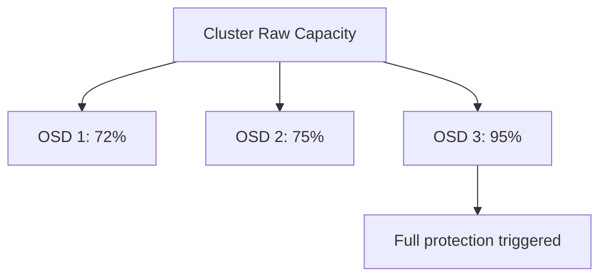
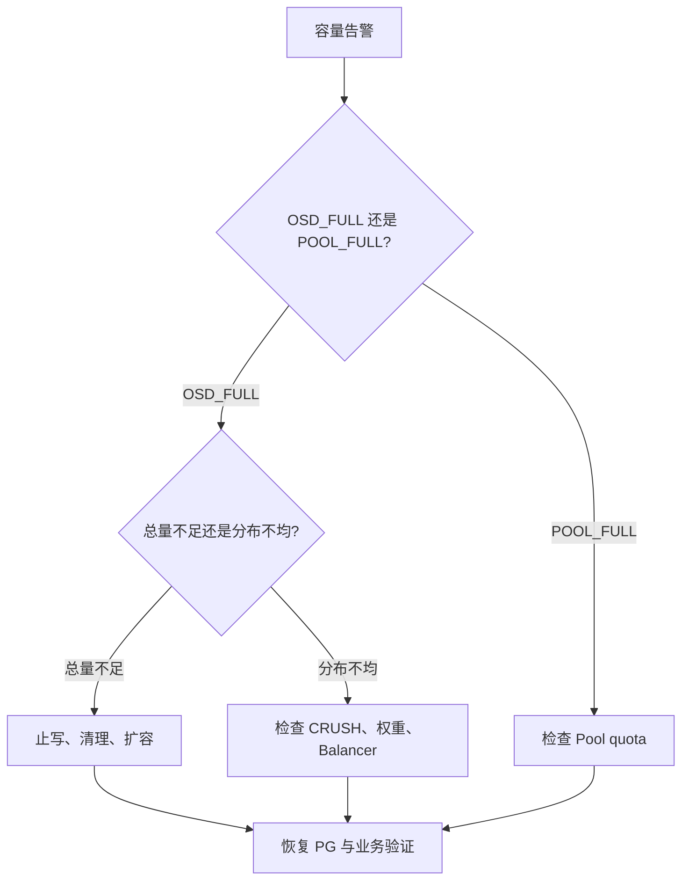

# Ceph 容量危机实战：Nearfull、Backfillfull、Full 的判断与应急处理

《Ceph 从零基础到生产运维实战》第 19 篇

← [第 18 篇：建立 Ceph 故障排查方法](./18-建立Ceph故障排查方法.md)

第 8 篇讲过容量规划，本篇聚焦事故现场：为什么集群平均还有空间却不能写、为什么换盘后 PG 停在 `backfill_toofull`，以及如何在不放大数据风险的前提下恢复服务。

## 1. 本文目标 {/* #本文目标 */}

读完本文后，你应该能够：

- 区分集群 Raw 容量、Pool 可用容量和单 OSD 使用率
- 解释 nearfull、backfillfull、full 和 failsafe full 的保护逻辑
- 区分 OSD_FULL 与 POOL_FULL
- 找出最满 OSD、增长最快 Pool 和真实容量消费者
- 判断容量问题是总量不足、数据不均衡还是 CRUSH 约束导致
- 在 full 事故中制定止写、清理、扩容和恢复顺序
- 理解提高 full ratio 只能短暂买时间，不能创造容量
- 清理 RBD、CephFS、RGW 和压测残留时避免绕过上层元数据
- 建立容量预测、提前告警和扩容安全余量

:::danger 风险提示
删除数据、修改容量阈值、改变 CRUSH、调整 OSD reweight 和移除 Pool 都可能造成数据丢失或更大范围故障。生产操作必须明确对象归属、备份、审批和回退方案。
:::

## 2. Ceph 的「满」为什么不能只看总容量 {/* #ceph-的满为什么不能只看总容量 */}

假设集群共有 100 TiB Raw 容量，显示还有 20 TiB 空闲，但其中一个 OSD 已经达到 full 阈值，Ceph 仍可能阻止相关写入。

原因是 Ceph 的安全判断主要落在单 OSD，而不是只看全局平均。



为什么需要这样设计？

- 对象必须按 CRUSH 放到指定 OSD
- 某个 OSD 写满后无法继续安全落盘
- BlueStore 还需要内部元数据和 RocksDB 空间
- 恢复和回填需要额外空闲空间
- 全局平均会掩盖最满设备

所以容量监控必须同时看：

- 集群整体
- 每个 Pool
- 每个 OSD
- 每个故障域
- 增长趋势
- 恢复安全余量

## 3. 四个容量阈值 {/* #四个容量阈值 */}

逻辑顺序必须满足：

```text
nearfull < backfillfull < full < failsafe_full
```

不同 Ceph 版本和环境的默认值可能不同，不能凭记忆判断。查看实际配置：

```bash
ceph osd dump | grep -E 'nearfull_ratio|backfillfull_ratio|full_ratio'
ceph config get osd osd_failsafe_full_ratio
```

### 3.1 Nearfull {/* #nearfull */}

表示某些 OSD 已接近危险区间。通常还可以服务写入，但必须立刻确认：

- 当前增长速度
- 最满 OSD
- 扩容交付时间
- 如果现在坏一台主机，剩余空间是否能完成恢复

Nearfull 是行动告警，不是「以后有空再看」。

### 3.2 Backfillfull {/* #backfillfull */}

表示 OSD 已经达到或预计完成当前回填后会达到 backfillfull 阈值，因此拒绝接收更多 backfill 数据。

结果可能是：

- PG 长期 remapped
- OSD 换盘 drain 无法完成
- 集群长期 degraded/undersized
- 再次故障时容错能力不足

### 3.3 Full {/* #full */}

一个或多个 OSD 达到 full 阈值后，Ceph 会阻止相关写入，避免把设备彻底写爆。

这时常见现象包括：

- RBD 写入卡住或返回错误
- CephFS 创建、写入或元数据操作失败
- RGW PUT 返回 5xx
- PG 恢复停滞
- `HEALTH_ERR OSD_FULL`

### 3.4 Failsafe full {/* #failsafe-full */}

这是 OSD 自身最后一道保护，防止设备空间耗尽到无法维持内部运行。它不应被当作正常容量水位。

## 4. OSD_FULL 与 POOL_FULL 不一样 {/* #osdfull-与-poolfull-不一样 */}

### 4.1 OSD_FULL {/* #osdfull */}

某个实际 OSD 超过 full ratio。

检查：

```bash
ceph health detail
ceph osd df tree
ceph df detail
```

### 4.2 POOL_FULL {/* #poolfull */}

Pool 达到了人为配置的容量或对象数量配额，即使底层 OSD 还有空间，该 Pool 也会拒绝写入。

检查：

```bash
ceph df detail
ceph osd pool ls detail
```

### 4.3 两者的处理区别 {/* #两者的处理区别 */}

| 问题 | 根因方向 | 典型处理 |
| --- | --- | --- |
| OSD_FULL | 物理容量或数据分布 | 扩容、受控清理、均衡 |
| POOL_FULL | Pool quota | 审核配额、清理该 Pool 或调整额度 |

看到「full」必须先确认是哪一种。

## 5. 第一轮现场采集 {/* #第一轮现场采集 */}

```bash
date -Is
ceph -s
ceph health detail
ceph df detail
ceph osd df tree
ceph osd tree
ceph osd stat
ceph pg stat
ceph orch device ls --wide
ceph orch ls --service_type osd --export
```

记录：

- 最满 OSD 使用率
- OSD 平均值和离散程度
- 哪些 OSD、主机和 device class 接近阈值
- 每个 Pool 的 STORED、USED、MAX AVAIL
- degraded/misplaced 对象数量
- recovery/backfill 是否停止
- 最近 24 小时和 7 天增长量
- 是否刚加入/移除 OSD 或修改 CRUSH
- 当前业务是否仍在高速写入

### 5.1 为什么要保留时间 {/* #为什么要保留时间 */}

容量事故最关键的信息之一是增长速度：

```text
剩余安全空间 / 每小时增长量 = 距离下一阈值的大致时间
```

没有时间序列，只看一次 `ceph df`，无法判断还有三个月还是三小时。

## 6. 判断是哪一种容量问题 {/* #判断是哪一种容量问题 */}

### 6.1 总量真的不足 {/* #总量真的不足 */}

特征：

- 大多数 OSD 使用率都高
- Pool 数据持续正常增长
- 最满与平均差距不大
- 没有明显错误权重或 CRUSH 分布

根本解决方案是扩容、数据生命周期治理或把数据迁出。

### 6.2 数据分布不均衡 {/* #数据分布不均衡 */}

特征：

- 少数 OSD 很满，其他 OSD 空闲较多
- 同容量同类型 OSD 使用率差异大
- PG 或 primary 分布不均
- 历史扩容、reweight 或 upmap 可能造成偏差

检查：

```bash
ceph osd df tree
ceph balancer status
ceph balancer eval
```

### 6.3 CRUSH 或 device class 约束 {/* #crush-或-device-class-约束 */}

特征：

- 集群整体有空闲，但目标 Pool 使用的 device class 已接近满
- 某个机架或主机无法再放副本
- Pool 的 CRUSH rule 只允许使用部分 OSD
- 新增 OSD 没有进入目标规则

检查：

```bash
ceph osd pool get <pool-name> crush_rule
ceph osd crush rule dump <rule-name>
ceph osd tree
```

### 6.4 单 OSD 权重或容量异常 {/* #单-osd-权重或容量异常 */}

可能原因：

- OSD CRUSH weight 与实际容量不匹配
- 大小不同的磁盘混用
- OSD 曾被手工 reweight
- 某个 OSD 统计异常
- BlueStore 空间和逻辑统计差异

不要看到不均衡就立即手工修改 weight。先确定是否由 balancer、upmap、异构容量或正在进行的恢复造成。

### 6.5 业务异常增长 {/* #业务异常增长 */}

常见来源：

- 应用日志无限写入
- 备份任务重复执行
- 快照和克隆长期不清理
- RBD 镜像删除后仍在 trash
- RGW 版本控制保留大量旧版本
- 未完成 multipart upload
- 测试和压测对象未清理
- CephFS 临时数据没有生命周期
- Pool quota 或租户 quota 缺失

## 7. 容量告警的严重程度怎么判断 {/* #容量告警的严重程度怎么判断 */}

不能只按百分比固定分级，还要考虑增长速度和扩容周期。

| 场景 | 示例判断 | 建议级别 |
| --- | --- | --- |
| 使用率不高但增长突然放大十倍 | 可能很快越过阈值 | 高 |
| Nearfull，扩容需要两个月 | 安全窗口不足 | 高 |
| Backfillfull，PG 恢复已停止 | 数据保护无法恢复 | 很高 |
| Full，业务写入失败 | 已产生业务中断 | Critical |
| 单 Pool quota 达限 | 影响该 Pool 业务 | 按业务等级 |

### 7.1 提前量公式 {/* #提前量公式 */}

简化估算：

```text
到达阈值天数 =（目标阈值容量 - 当前已用容量）÷ 近期日均增长量
```

其中：

- `目标阈值容量`：目标阈值对应容量
- `当前已用容量`：当前已经使用的容量
- `近期日均增长量`：选定观察窗口内的日均增长量
- `到达阈值天数`：预计到达目标阈值的天数

告警提前量至少覆盖：

```text
审批 + 采购 + 到货 + 上架 + 回填 + 验收 + 风险缓冲
```

只在越过 85% 时告警，可能已经来不及扩容。

## 8. Nearfull 阶段怎么处理 {/* #nearfull-阶段怎么处理 */}

Nearfull 是最有价值的处理窗口，业务通常还未中断。

### 8.1 第一步：确认增长源 {/* #第一步确认增长源 */}

```bash
ceph df detail
ceph osd df tree
```

与 Prometheus 历史数据对比：

- 哪个 Pool 增长最快
- 从哪天开始
- 是否与版本发布、备份、数据导入一致
- 是容量增长还是对象数增长
- 是否集中到某种设备类

### 8.2 第二步：控制非必要写入 {/* #第二步控制非必要写入 */}

可以考虑：

- 暂停重复备份
- 限制测试数据写入
- 停止无用数据导入
- 调整应用日志保留
- 对异常租户限流或启用配额

不能未经业务确认直接停止生产写入。

### 8.3 第三步：制定扩容计划 {/* #第三步制定扩容计划 */}

扩容必须匹配：

- 目标 device class
- CRUSH failure domain
- OSD 规格和 DB/WAL 布局
- 网络和电力
- 主机槽位
- 数据恢复带来的性能影响

只往不相关 device class 加盘，不会增加目标 Pool 的 MAX AVAIL。

### 8.4 第四步：清理可确认数据 {/* #第四步清理可确认数据 */}

清理必须通过正确业务接口，并先确认备份与保留策略。后文会分类说明。

## 9. Backfillfull 阶段怎么处理 {/* #backfillfull-阶段怎么处理 */}

Backfillfull 表示容量已经开始阻塞数据恢复，比普通 nearfull 更紧急。

### 9.1 典型现象 {/* #典型现象 */}

```text
OSD_BACKFILLFULL
active+remapped+backfill_toofull
recovery throughput 接近 0
OSD removal 一直 draining
```

### 9.2 处理顺序 {/* #处理顺序 */}

1. 暂停非必要的大写入和非紧急变更
2. 找到阻止回填的最满 OSD
3. 判断目标 Pool 和 CRUSH 规则
4. 释放明确可释放的数据
5. 优先增加能被目标规则使用的容量
6. 验证 backfill 重新开始
7. 观察客户端延迟和恢复趋势

### 9.3 为什么不能此时随便 out 更多 OSD {/* #为什么不能此时随便-out-更多-osd */}

把 OSD out 会触发更多数据迁移，而集群已经没有足够回填空间。这可能增加 remapped PG，让恢复范围继续扩大。

## 10. Full 阶段的事故处理 {/* #full-阶段的事故处理 */}

Full 通常意味着写入已经或即将失败，应进入正式事故流程。

### 10.1 稳定现场 {/* #第一阶段稳定现场 */}

1. 建立事故负责人和通信渠道
2. 冻结非必要的 Ceph 变更
3. 暂停高风险扩容外操作
4. 保存 `ceph -s`、health、df 和时间序列
5. 确认受影响 Pool 和业务
6. 控制异常写入源
7. 检查是否同时存在 OSD/PG 故障

### 10.2 选择最快的安全释放方式 {/* #第二阶段选择最快的安全释放方式 */}

优先级通常是：

1. 删除明确无用、可重新生成的数据
2. 清理过期快照、trash、旧版本和测试残留
3. 停止异常数据源
4. 加入已准备好的可用 OSD
5. 执行已经验证的容量迁移方案

实际顺序取决于业务数据可删除性和新硬件准备情况。

### 10.3 恢复写入与数据保护 {/* #第三阶段恢复写入与数据保护 */}

容量降到 full 以下后，还不能立刻结束事故。继续观察：

- OSD_FULL 是否清除
- PG 是否重新 peering/recovery
- backfillfull 是否仍阻塞
- 客户端写入是否成功
- 最满 OSD 是否仍继续增长
- 是否有足够空间恢复完整副本

### 10.4 回到长期安全水位 {/* #第四阶段回到长期安全水位 */}

只从 95.1% 降到 94.9% 并不安全。必须继续扩容或清理，让集群回到能承受故障域丢失的水位。

## 11. 修改容量阈值的真实含义 {/* #修改容量阈值的真实含义 */}

查看当前阈值：

```bash
ceph osd dump | grep -E 'nearfull_ratio|backfillfull_ratio|full_ratio'
```

修改命令形式：

```bash
ceph osd set-nearfull-ratio <ratio>
ceph osd set-backfillfull-ratio <ratio>
ceph osd set-full-ratio <ratio>
```

### 11.1 提高 full ratio 什么时候可能被考虑 {/* #提高-full-ratio-什么时候可能被考虑 */}

官方文档把小幅提高 full threshold 描述为恢复写可用性的短期手段之一，但必须满足：

- 设备仍有少量真实可用空间
- 已经停止主要增长源
- 正在同步执行清理或扩容
- 提升幅度很小且经过审批
- 持续监控最满 OSD
- 明确恢复后的阈值回退计划

### 11.2 它为什么危险 {/* #它为什么危险 */}

提高阈值：

- 不会增加物理容量
- 会减少 BlueStore 内部安全空间
- 会压缩恢复余量
- 可能更接近 failsafe full
- 可能把短时可写换成更难恢复的彻底写满

因此不能把阈值提高当作「修复完成」。

### 11.3 不要把 nearfull 调高来消除告警 {/* #不要把-nearfull-调高来消除告警 */}

Nearfull 的价值就是提前暴露风险。提高告警阈值只会让下一次通知更晚。

## 12. 正确清理 RBD 容量 {/* #正确清理-rbd-容量 */}

### 12.1 找出镜像和真实占用 {/* #找出镜像和真实占用 */}

```bash
rbd ls <rbd-pool> --long
rbd du --pool <rbd-pool>
```

注意：稀疏镜像的 provisioned size 与实际占用不同；快照会让旧数据继续被引用。

### 12.2 查看快照 {/* #查看快照 */}

```bash
rbd snap ls <rbd-pool>/<image>
```

删除前确认：

- 快照是否用于备份或回滚
- 是否是 clone 的父快照
- 是否被保护
- 业务保留策略
- 删除后空间是否会立即回收

### 12.3 查看 RBD Trash {/* #查看-rbd-trash */}

```bash
rbd trash ls <rbd-pool> --long
```

镜像进入 trash 后数据可能仍占用容量。确认到期、镜像 ID 和业务审批后，再按 RBD 管理流程清理。

### 12.4 不要直接删除底层 RADOS 对象 {/* #不要直接删除底层-rados-对象 */}

RBD 有对象映射、快照和元数据。使用 `rados rm` 删除底层对象会破坏镜像，而不是正确释放业务容量。

## 13. 正确清理 CephFS 容量 {/* #正确清理-cephfs-容量 */}

### 13.1 找到大目录与 Subvolume {/* #找到大目录与-subvolume */}

从客户端和管理接口结合检查：

```bash
ceph fs status
ceph fs subvolume ls <fs-name>
ceph fs subvolume info <fs-name> <subvolume>
```

在挂载端使用 `du` 时注意：

- 大目录扫描会给 MDS 和 OSD 增加负载
- 快照保留的数据可能不会直接体现在普通目录大小中
- Hard Link、稀疏文件和客户端缓存会影响理解
- Quota 是逻辑限制，不等于 Raw 占用

### 13.2 检查 Subvolume 快照 {/* #检查-subvolume-快照 */}

```bash
ceph fs subvolume snapshot ls <fs-name> <subvolume>
```

按保留策略删除快照，不要绕过 CephFS 目录和快照元数据直接操作 RADOS。

### 13.3 检查异步删除 {/* #检查异步删除 */}

Subvolume 删除通常会先进入内部 trash，再由后台异步清理。删除命令返回后，Raw 容量不一定立即下降。应观察 volume info 和 Pool 使用趋势。

## 14. 正确清理 RGW 容量 {/* #正确清理-rgw-容量 */}

### 14.1 常见容量消费者 {/* #常见容量消费者 */}

- 当前对象
- 非当前对象版本
- 删除标记
- 未完成 multipart upload
- 生命周期规则未生效
- 重复备份 Bucket
- 租户配额缺失

### 14.2 使用 S3 API 和管理统计 {/* #使用-s3-api-和管理统计 */}

```bash
radosgw-admin user stats --uid=<user> --sync-stats
radosgw-admin bucket stats --bucket=<bucket>
```

再使用应用相同 Endpoint 的 S3 客户端检查版本和 multipart upload。

### 14.3 版本控制删除的误区 {/* #版本控制删除的误区 */}

启用版本控制后，普通 DELETE 往往只创建删除标记，旧版本仍占空间。真正释放容量需要根据保留策略删除非当前版本。

### 14.4 使用生命周期规则 {/* #使用生命周期规则 */}

长期治理应使用经过测试的生命周期策略：

- 当前对象到期
- 非当前版本到期
- 删除标记清理
- 未完成 multipart upload 到期

生产容量事故中临时修改生命周期可能造成批量误删，必须先在小范围验证。

### 14.5 不要直接清理 RGW Pool {/* #不要直接清理-rgw-pool */}

RGW 对象数据、Bucket 索引和元数据相互关联。直接 `rados rm` 可能制造 orphan 和索引不一致。

## 15. 检查压测和测试残留 {/* #检查压测和测试残留 */}

`rados bench --no-cleanup` 会保留测试对象，供后续顺序或随机读取测试使用。如果忘记 cleanup，可能占用大量空间。

在明确的测试 Pool 中检查：

```bash
rados -p <bench-pool> ls
```

清理对应 benchmark run：

```bash
rados -p <bench-pool> cleanup --run-name <run-name>
```

只对明确的压测 Pool 和 run-name 执行。不要在业务 Pool 中根据对象名前缀批量删除，因为可能误匹配真实对象。

## 16. 扩容的正确姿势 {/* #扩容的正确姿势 */}

### 16.1 扩容前确认目标 {/* #扩容前确认目标 */}

```bash
ceph osd pool get <pool-name> crush_rule
ceph osd crush rule dump <rule-name>
ceph osd tree
```

确认新容量会进入：

- 正确 root
- 正确 failure domain
- 正确 device class
- 正确 OSD 服务规格

### 16.2 预览 OSDSpec {/* #预览-osdspec */}

```bash
ceph orch device ls --wide --refresh
ceph orch apply -i osd-spec.yaml --dry-run
```

确认主机、设备、data、DB/WAL 映射，再应用：

```bash
ceph orch apply -i osd-spec.yaml
```

### 16.3 不要一次加入所有设备后不观察 {/* #不要一次加入所有设备后不观察 */}

分批扩容可以：

- 控制 recovery/backfill 对业务影响
- 及时发现设备规格或 CRUSH 错误
- 验证容量是否进入目标 Pool
- 避免同时出现大规模新盘故障

### 16.4 扩容后看什么 {/* #扩容后看什么 */}

```bash
ceph -s
ceph osd tree
ceph osd df tree
ceph pg stat
ceph df detail
```

确认：

- 新 OSD up + in
- device class 正确
- 数据开始向新 OSD 分布
- 没有 backfillfull
- 客户端延迟可接受
- 最满 OSD 使用率持续下降

## 17. Balancer 与数据不均衡 {/* #balancer-与数据不均衡 */}

查看状态：

```bash
ceph balancer status
ceph balancer eval
```

Balancer 可以通过 upmap 等方式改善 PG 分布，但它不是容量不足的替代品。

### 17.1 适合处理 {/* #适合处理 */}

- 同类同容量 OSD 间 PG/数据分布偏差
- 历史扩容后需要优化映射
- CRUSH 合法范围内的均衡

### 17.2 不能解决 {/* #不能解决 */}

- 整体 Raw 容量不足
- 目标 device class 没有空闲
- failure domain 数量不够
- 单个业务持续异常增长
- OSD 物理容量与 weight 严重不匹配

### 17.3 不要混用多套调权方法 {/* #不要混用多套调权方法 */}

手工 reweight、reweight-by-utilization、upmap 和 balancer 同时使用，可能让分布难以理解。变更前应导出现状，明确由哪一种机制负责。

## 18. 为什么扩容也需要空闲空间 {/* #为什么扩容也需要空闲空间 */}

新增 OSD 后，数据需要从旧 OSD 迁到新 OSD。在此过程中：

- 旧副本不能在新副本安全完成前直接删除
- recovery/backfill 会产生额外读写
- 目标 OSD 需要接收数据
- PG 映射不断变化

如果集群已经接近彻底写满，连正常重平衡都可能受阻。因此扩容应在 nearfull 之前完成，而不是等 full 后才采购。

## 19. 故障域安全余量 {/* #故障域安全余量 */}

只保留「还能写一点」的空间不够。容量规划应保证丢失一个设计故障域后，剩余设备仍能接收恢复数据。

简化表达：

```text
安全空闲容量 ≥ 最大故障域贡献量 + 规划期增长量 + 恢复缓冲
```

需要结合：

- 最大主机或机架承载的数据
- 副本或 EC 开销
- CRUSH 可放置范围
- 故障期间业务增长
- 扩容和恢复耗时
- OSD 使用率不均衡

公式只能做初步估算，生产设计还应通过故障演练、CRUSH 模拟和历史恢复数据验证。

## 20. 建立容量预算 {/* #建立容量预算 */}

为每个 Pool 或租户记录：

| 字段 | 含义 |
| --- | --- |
| 业务 owner | 谁对数据负责 |
| 当前逻辑容量 | 用户实际数据量 |
| Raw 占用 | 副本/EC 后的物理消耗 |
| 对象数量 | 小对象压力判断 |
| 日/周增长 | 预测基础 |
| 保留周期 | 数据何时可删除 |
| Quota | 最大允许使用量 |
| 扩容交付时间 | 从申请到可用 |
| RPO/RTO | 清理和迁移决策依据 |

### 20.1 超分配 {/* #超分配 */}

RBD 稀疏卷、CephFS Quota 和 RGW 用户配额之和都可能大于实际 Raw 容量。超分配不是一定错误，但必须有：

- 实际使用率监控
- 增长预测
- 租户配额
- 扩容阈值
- 应急止损规则

## 21. 容量事故决策流程 {/* #容量事故决策流程 */}



事故中每个动作都要回答：能释放多少、多久生效、是否影响业务、失败如何回退。

## 22. 容量事故 Runbook 模板 {/* #容量事故-runbook-模板 */}

### 22.1 现场信息 {/* #现场信息 */}

```text
告警时间：
健康检查：
最满 OSD：
最满使用率：
增长最快 Pool：
当前增长速度：
PG 状态：
受影响业务：
预计到达下一阈值时间：
```

### 22.2 立即动作 {/* #立即动作 */}

1. 确认 OSD_FULL/POOL_FULL
2. 停止异常或非必要写入
3. 冻结无关变更
4. 明确可安全清理的数据
5. 确认可快速加入的容量
6. 持续观察 PG 和业务

### 22.3 高风险动作审批 {/* #高风险动作审批 */}

- 修改 full/backfillfull ratio
- 删除快照、版本或 Pool
- 手工调整 CRUSH/weight
- 强制移除 OSD
- 降低副本数或 min_size
- 绕过上层接口删除 RADOS 对象

### 22.4 恢复完成标准 {/* #恢复完成标准 */}

- 写入恢复
- OSD_FULL/POOL_FULL 解除
- backfill/recovery 正常推进并完成
- 最满 OSD 回到安全水位
- 能承受设计故障域丢失
- 业务一致性和读写验证通过
- 临时阈值、限流和静默已回退
- 长期扩容和数据治理任务已落实

## 23. 常见错误做法 {/* #常见错误做法 */}

**错误一：集群平均没满，所以不是容量问题**

错误。单个 OSD 或目标 device class 满就可能阻止写入和回填。

**错误二：提高 full ratio 就算修好了**

错误。它只缩短安全距离，最多是短期买时间。

**错误三：Full 时继续 out 多个 OSD**

错误。会触发更多迁移，而集群可能已经没有回填空间。

**错误四：直接删除底层 RADOS 对象**

错误。RBD、CephFS 和 RGW 都有上层元数据，绕过接口会破坏一致性。

**错误五：新加了盘，所有 Pool 都会增加容量**

错误。新盘必须满足对应 CRUSH rule 和 device class。

**错误六：删除文件后容量应该立即下降**

错误。快照、trash、版本控制、异步清理和 BlueStore 回收都会影响释放时间。

**错误七：只设置百分比告警**

错误。还要看增长速度、最满 OSD 和扩容交付周期。

## 24. 生产检查清单 {/* #生产检查清单 */}

### 24.1 日常治理 {/* #日常治理 */}

- [ ] 监控集群、Pool、OSD 和故障域容量
- [ ] 记录 7/30/90 天增长趋势
- [ ] 告警提前量覆盖扩容周期
- [ ] RBD trash/快照有保留策略
- [ ] CephFS 快照和临时数据有生命周期
- [ ] RGW 版本和 multipart 有清理策略
- [ ] 压测使用独立 Pool 并自动 cleanup
- [ ] 租户有合理 quota

### 24.2 事故处理 {/* #事故处理 */}

- [ ] 区分 OSD_FULL 与 POOL_FULL
- [ ] 找到最满 OSD 和增长最快 Pool
- [ ] 确认 CRUSH 和 device class
- [ ] 控制异常写入
- [ ] 清理通过正确业务接口
- [ ] 阈值变更有审批和回退
- [ ] 扩容先 dry-run
- [ ] 持续观察 PG 和业务延迟

### 24.3 恢复后 {/* #恢复后 */}

- [ ] 回到长期安全水位
- [ ] PG active+clean
- [ ] 数据分布合理
- [ ] 业务探测成功
- [ ] 临时配置全部回退
- [ ] 更新容量模型和采购阈值
- [ ] 复盘异常增长来源

## 25. 本文小结 {/* #本文小结 */}

Ceph 容量危机的核心规律是：

1. 安全性由最满 OSD 和 CRUSH 可用范围决定，不是只看全局平均
2. nearfull 是扩容和治理窗口
3. backfillfull 表示恢复能力已经受阻
4. full 表示写入可用性已经受到直接威胁
5. 清理必须通过 RBD、CephFS、RGW 等正确上层接口
6. 扩容必须进入正确 device class 和故障域
7. 修改阈值只能短期买时间，不能创造空间
8. 事故结束标准是回到能承受故障和增长的安全水位

**如何建立基线、如何正确压测，以及如何从客户端一路定位到网络、OSD、BlueStore 和磁盘。**

下一篇把排障方法应用到最常见场景：OSD 异常与物理磁盘更换。

→ [第 20 篇：磁盘故障与数据恢复](./20-磁盘故障与数据恢复.md)

## 26. 课后练习 {/* #课后练习 */}

1. 为什么集群平均使用率不高仍可能触发 OSD_FULL？
2. nearfull、backfillfull 和 full 分别保护什么？
3. OSD_FULL 与 POOL_FULL 有何区别？
4. 为什么 Full 时不应继续 out 多个 OSD？
5. 提高 full ratio 为什么只能短期买时间？
6. RBD 镜像删除后为什么可能仍占空间？
7. RGW 开启版本控制后，普通 DELETE 为什么不一定释放容量？
8. 为什么新增 SSD 不一定增加 HDD Pool 的可用容量？
9. 容量告警为什么必须结合增长速度？
10. 怎样判断容量事故已经真正结束？

### 26.1 参考答案 {/* #参考答案 */}

1. full按OSD或Pool局部水位触发，不按集群平均值。数据倾斜、特定CRUSH Root/Device Class过满或Pool配额可让局部先停止写入。
2. nearfull提前预警高水位；backfillfull阻止把恢复数据继续写入过满目标OSD；full阻止正常写入，避免介质彻底写满和更严重损坏。
3. OSD_FULL表示具体OSD越过full阈值；POOL_FULL表示Pool达到quota或底层可用空间约束。两者定位和解除方式不同，但都可能导致业务写失败。
4. OSD out会让其PG数据迁到其他盘，在已经full时可能把剩余盘进一步填满并扩大不可用范围。先止写/清理/扩容和评估目的空间。
5. 它只把保护线后移，提供少量操作窗口，却增加恢复无空间和磁盘写满风险；数据增长与Raw缺口仍然存在。
6. Image可能进入RBD Trash、存在快照/Clone父依赖，或删除/回收仍在后台进行；应检查Trash、快照、子Image和实际RADOS占用。
7. Versioned Bucket的普通DELETE通常写入Delete Marker，旧版本仍保留并继续占空间；需按保留策略删除历史版本和未完成Multipart。
8. HDD Pool若CRUSH Rule只选择`class=hdd`，新增SSD不在其合法放置集合中，因此不增加该Pool容量；需扩相同Device Class或有计划地迁移策略。
9. 当前水位相同，日增1%与日增0.01%的剩余时间完全不同。告警应结合增长斜率、扩容Lead Time、最大故障恢复空间和预测到阈值时间。
10. 所有OSD/Pool退出危险阈值且有恢复余量，PG恢复clean，Backfill不再受阻，业务写入/延迟正常，增长预测覆盖扩容周期，临时阈值/Flags已撤销并完成原因复盘，才算结束。

## 27. 官方资料 {/* #官方资料 */}

- [Ceph 健康检查](https://docs.ceph.com/en/latest/rados/operations/health-checks/)
- [监控 OSD 与 PG](https://docs.ceph.com/en/latest/rados/operations/monitoring-osd-pg/)
- [MON 存储容量配置](https://docs.ceph.com/en/latest/rados/configuration/mon-config-ref/)
- [Balancer 模块](https://docs.ceph.com/en/latest/rados/operations/balancer/)
- [Cephadm OSD 服务](https://docs.ceph.com/en/latest/cephadm/services/osd/)
- [rados 工具手册](https://docs.ceph.com/en/latest/man/8/rados/)
