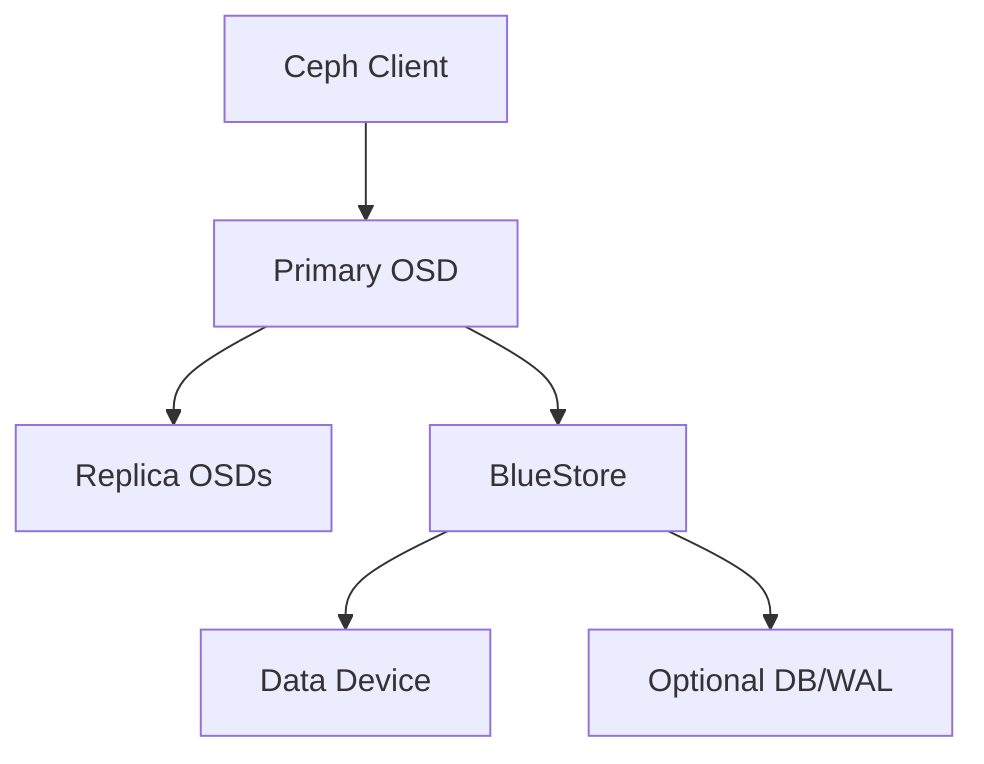

# Ceph OSD 故障与换盘实战：判断、下线、替换和恢复验证

《Ceph 从零基础到生产运维实战》第 20 篇

← [第 19 篇：常见故障实战](./19-常见故障实战.md)

上一篇处理了容量危机实战。本篇把排障方法应用到 Ceph 最常见、也最容易误操作的场景：OSD 异常和物理磁盘更换。


## 本文目标

读完并完成实验后，你应该能够：

- 区分 OSD 进程故障、磁盘故障、主机故障和网络故障
- 从 OSD ID 准确找到主机、数据盘以及可能的 DB/WAL 设备
- 理解 up/down、in/out、ok-to-stop、safe-to-destroy 的区别
- 使用 cephadm 的替换流程安全更换 OSD 磁盘
- 理解 `--replace`、`--zap`、`--force` 的风险边界
- 避免设备名识别错误、自动编排抢盘和一次更换过多 OSD
- 判断数据迁移和 PG 恢复是否真正结束
- 编写可执行的换盘 Runbook

本文以 cephadm 管理的 BlueStore 集群为例，假设故障对象为 `osd.12`，所在主机为 `ceph03`。示例中的 OSD ID、主机名、磁盘路径和序列号必须替换为现场实际值。

:::danger 高风险提示
OSD 删除、设备擦除和物理拔盘都可能造成数据丢失。生产操作前必须确认集群冗余、故障域、目标设备身份、近期变更和回退方案。不要把本文命令当作无需判断的一键脚本。
:::

## OSD 故障不等于磁盘坏了

OSD 是一个 Ceph 守护进程，它通常管理一个 BlueStore 数据设备，也可能使用独立的 DB/WAL 设备。



当监控显示 `OSD_DOWN` 时，可能原因包括：

- OSD 容器或进程退出
- 主机重启、宕机或失联
- 数据盘介质故障
- DB/WAL 设备故障
- OSD 到 MON 或其他 OSD 的网络中断
- 文件描述符、内存或系统盘资源耗尽
- 配置、权限、LVM 或加密设备激活失败
- Ceph 版本缺陷
- 人工停止或维护操作

因此正确的问题不是「OSD down 了，怎么换盘」，而是：

> OSD 为什么 down？它是否还能安全恢复？如果必须替换，数据是否有足够的其他副本？

## 先理解 OSD 的四种组合状态

查看状态：

```bash
ceph osd stat
ceph osd tree
```

OSD 有两个非常重要的维度：

- **up/down**：OSD 进程是否能与集群正常通信
- **in/out**：CRUSH 是否继续把 PG 数据放到该 OSD

| 状态 | 常见含义 |
| --- | --- |
| up + in | 正常提供服务并参与数据放置 |
| down + in | 进程不可用，但数据映射暂时仍包含它 |
| down + out | 不可用且数据正在或已经迁离 |
| up + out | 进程可达，但不再承载新的正常数据映射 |

### 为什么 OSD down 后不会立刻 out

短暂重启时，如果立即把大量数据迁走，OSD 很快回来后又要迁回来，会制造无意义的恢复流量。因此 Ceph 通常等待一段时间后再自动标记 out。

等待时间给了运维人员判断故障是短暂还是永久的机会，但不能因此长期忽略 down OSD。OSD 一直 down + in 会让部分 PG 长期降级。

### out 不等于磁盘已经可以拔

out 只表示不再作为正常数据放置目标。必须等待 PG 从该 OSD 迁移完成，并通过安全检查，才能进行销毁或物理更换。

## ok-to-stop 与 safe-to-destroy 的区别

这两个检查经常被混淆。

### ok-to-stop

```bash
ceph osd ok-to-stop 12
```

它回答：

> 如果现在临时停止 `osd.12`，PG 是否仍能保持可用？

适用于计划维护、重启进程或主机前的风险判断。检查通过不代表 OSD 数据已经迁走，也不代表可以销毁磁盘。

### safe-to-destroy

```bash
ceph osd safe-to-destroy 12
```

它回答：

> 集群是否已经不再依赖这个 OSD 上的数据，销毁它是否不会进一步降低当前数据冗余？

它通常用于 OSD 已完成 drain、准备移除或换盘的阶段。

| 检查 | 关注点 | 常见场景 |
| --- | --- | --- |
| ok-to-stop | 临时停止后的可用性 | 维护、重启 |
| safe-to-destroy | 永久销毁后的数据安全 | 移除、换盘 |

两者都只是 Ceph 根据当前集群状态给出的判断。生产操作仍要检查是否存在第二块故障盘、是否正在恢复、是否有 EC Pool 和特殊 CRUSH 约束。

## 收到 OSD down 告警后的第一轮检查

先保存现场：

```bash
date -Is
ceph -s
ceph health detail
ceph osd tree
ceph osd df tree
ceph osd perf
ceph pg stat
ceph orch ps --daemon_type osd --refresh
```

回答以下问题：

1. 只有一个 OSD down，还是同一主机多个 OSD 同时 down？
2. `osd.12` 是 in 还是 out？
3. 是否有 PG inactive、stale、undersized 或 degraded？
4. 是否还有其他 OSD、主机或机架异常？
5. 集群是否接近 nearfull/backfillfull/full？
6. 当前是否正在升级、回填、扩容或进行计划维护？
7. 受影响的是副本 Pool 还是纠删码 Pool？
8. 客户端是否已经出现读写失败或延迟升高？

### 同一主机多个 OSD 同时 down

如果 `ceph03` 上全部 OSD 同时 down，优先检查：

- 主机电源和带外管理
- 主机网络
- 系统是否重启或内核崩溃
- 根文件系统和容器运行时
- Ceph 集群网络路由
- 整机级变更

此时逐个换盘通常是错误方向。

### 只有单个 OSD down

单 OSD 故障更可能与以下内容有关：

- 单盘介质错误
- LVM 或 BlueStore 激活失败
- OSD 容器异常
- 该 OSD 的 DB/WAL 分区异常
- 局部设备连接、背板或控制器问题

## 准确定位 OSD 对应的设备

### 从编排器查看 OSD 所在主机

```bash
ceph orch ps --daemon_id 12 --daemon_type osd --refresh
ceph osd find 12
```

记录主机、CRUSH 位置和 daemon name。

### 查看主机设备清单

```bash
ceph orch device ls --hostname ceph03 --wide --refresh
```

输出中重点记录：

- 设备路径
- 型号
- 序列号或稳定设备 ID
- 容量
- HDD/SSD/NVMe 类型
- 是否可用
- Reject Reasons
- 是否关联 OSD

### 在 OSD 主机查看 ceph-volume 映射

进入 cephadm 环境后查看：

```bash
cephadm shell -- ceph-volume lvm list 12
```

确认：

- block 数据设备
- block.db
- block.wal
- OSD FSID
- LVM VG/LV
- 设备路径

### `/dev/sdX` 不是可靠身份

设备名可能在重启、热插拔和控制器扫描后变化。工单和换盘标签应优先记录：

- 序列号
- WWN
- `/dev/disk/by-id/` 路径
- 槽位
- 控制器或机箱信息
- OSD ID 和 OSD FSID

不能仅凭「昨天是 `/dev/sdc`」就直接拔盘。

## 判断是进程问题还是硬件问题

### 检查 OSD 日志

先找到 daemon name 和主机：

```bash
ceph orch ps --daemon_id 12 --daemon_type osd --refresh
```

在对应主机查看：

```bash
cephadm logs --name osd.12
```

关注首次异常时间附近，而不是只看最后几行。

常见线索包括：

- I/O error
- read/write failure
- BlueStore mount failure
- RocksDB/BlueFS 错误
- assertion 或进程崩溃
- permission denied
- address/network timeout
- out of memory
- missing block device

### 检查内核和硬件日志

在 OSD 主机上：

```bash
journalctl -k --since "1 hour ago"
dmesg -T
```

重点查找：

- I/O error
- medium error
- reset
- timeout
- nvme
- scsi
- ata
- PCIe/AER 错误

日志中的设备名仍需与序列号、WWN 和槽位交叉确认。

### 检查 SMART 或 NVMe 健康

SATA/SAS 示例：

```bash
smartctl -x /dev/<confirmed-device>
```

NVMe 示例：

```bash
nvme smart-log /dev/<confirmed-nvme-device>
```

关注：

- 重分配、待处理或不可校正扇区
- 介质和数据完整性错误
- 温度
- CRC/链路错误
- NVMe percentage used
- unsafe shutdown
- 错误日志数量

SMART 显示 PASSED 也不能证明磁盘一定健康，应结合内核日志、延迟、厂商阈值和历史趋势判断。

## 三种典型处置场景

### 场景 A：OSD 进程异常，设备健康

特征：

- 设备可见
- 无明显介质错误
- 只有进程或容器异常
- 日志指向临时资源、配置或软件问题

处理思路：

1. 保存日志和现场
2. 修复明确的配置或资源问题
3. 评估是否可以重启单个 OSD
4. 验证 OSD 回到 up + in
5. 观察 PG 和延迟

单个守护进程重启：

```bash
ceph orch daemon restart osd.12
```

执行前先运行 `ceph osd ok-to-stop 12`，并确认不是同一故障域的多个 OSD 同时操作。

### 场景 B：短时主机维护

特征：

- 硬件未永久损坏
- 有明确维护窗口
- 主机会在可接受时间内恢复

优先使用 cephadm 主机维护流程，并验证维护安全性。若必须设置 noout，应限制范围和持续时间，而不是全局永久设置。

针对单个 OSD：

```bash
ceph osd add-noout osd.12
```

维护结束后及时取消：

```bash
ceph osd rm-noout osd.12
```

`noout` 只是不让 OSD 自动 out，它不会增加数据副本，也不会修复故障。永久损坏的磁盘不应长期保持 noout，否则数据无法迁走。

### 场景 C：磁盘确认永久故障

特征：

- 设备失联或反复掉线
- 出现介质错误
- 延迟持续异常
- 厂商工具判定需要更换
- OSD 无法可靠恢复

此时进入换盘流程。

## 换盘前的安全检查

在任何破坏性操作前执行：

```bash
ceph -s
ceph health detail
ceph osd tree
ceph osd df tree
ceph pg stat
ceph osd safe-to-destroy 12
```

检查清单：

- [ ] 已确认准确的 OSD ID、主机、序列号和槽位
- [ ] 已确认 block、DB、WAL 关系
- [ ] 当前没有同故障域的第二个高风险 OSD
- [ ] 没有 inactive/stale PG，或已明确影响与恢复方案
- [ ] 集群有足够空间完成迁移
- [ ] 业务和负责人已知晓可能的性能影响
- [ ] OSDSpec 的自动调度行为已经确认
- [ ] 新盘型号、容量、扇区格式和接口符合要求
- [ ] 有回退、停止和升级处理条件

如果 `safe-to-destroy` 未通过，不要通过 `--force` 直接跳过。先查明哪些 PG 仍依赖这个 OSD。

## cephadm 推荐换盘流程

### 调度 OSD 替换

```bash
ceph orch osd rm 12 --replace
```

`--replace` 的意义是：

- 迁移该 OSD 上的 PG
- 删除旧 OSD 守护进程
- 在 CRUSH 层保留对应位置
- 把 OSD 标记为 destroyed
- 允许符合 OSDSpec 的新设备在同一主机复用该 OSD ID

官方流程要求替换 OSD 的新设备位于原 OSD 的同一主机。

### 查看迁移状态

```bash
ceph orch osd rm status
ceph -s
ceph pg stat
ceph osd tree
```

状态可能经历：

```text
started -> draining -> done, waiting for purge -> destroyed
```

同时观察：

- PG_COUNT 是否下降
- recovery/backfill 是否持续推进
- 是否出现 backfillfull
- 客户端延迟是否明显上升
- 是否出现新的 OSD 或主机故障

### 必要时停止移除任务

如果出现容量危机、第二故障或业务不可接受的影响，可以停止尚未完成的移除任务：

```bash
ceph orch osd rm stop 12
```

停止后重新评估集群状态。不要在不了解状态时反复开始、停止和强制删除。

### 何时使用 `--zap`

```bash
ceph orch osd rm 12 --replace --zap
```

`--zap` 会擦除旧设备上的 LVM 和分区信息，使设备变为可重新部署状态。只在以下条件全部满足时考虑：

- 已准确确认目标设备
- 设备仍可访问
- 不再需要保留现场做硬件或数据分析
- 集群已不依赖该设备数据
- 已理解 OSDSpec 可能立即重新消费该设备

对于需要返厂分析或物理失效的盘，不一定要在移除命令中 zap。

### 为什么不要随便使用 `--force`

`--force` 可能绕过正常的安全等待或数据迁移条件。它适用于少数已明确风险、由有经验人员处理的异常场景，不是「命令卡住时再加一个参数」。

错误使用可能导致：

- 唯一可用副本被移除
- PG 永久不可恢复
- unfound 对象
- 应用级数据丢失

## 物理更换磁盘

只有在 OSD 已安全退出、工单中设备身份经过复核后，才进入硬件操作。

### 换盘前再次核对

至少由两个人或两种独立信息核对：

| 信息 | 示例 |
| --- | --- |
| OSD ID | osd.12 |
| 主机 | ceph03 |
| 序列号 | 现场实际值 |
| WWN | 现场实际值 |
| 槽位 | 机箱实际位置 |
| 容量与型号 | 旧盘与新盘规格 |

如果机箱和管理工具支持定位灯，先点亮目标盘并与序列号交叉确认。

### 热插拔不代表可以无流程拔盘

硬件支持热插拔只说明接口层允许在线操作，不代表 Ceph 数据已经安全迁走。必须同时满足 Ceph 安全条件和硬件操作要求。

### 共享 DB/WAL 设备要特别小心

一个高速 DB/WAL 设备可能服务多个 HDD OSD。如果故障的是共享 DB 盘，影响范围可能是多个 OSD，不能把它当作单个数据盘替换。

必须先通过 `ceph-volume lvm list` 建立完整映射，明确：

- 哪些 OSD 使用该 DB/WAL
- 数据设备是否仍完整
- 是否支持迁移或需要逐个重建
- 一次操作会触发多少数据恢复

## 让 cephadm 识别新盘

插入新盘后刷新设备信息：

```bash
ceph orch device ls --hostname ceph03 --wide --refresh
```

确认：

- 新盘型号和容量正确
- 序列号与换盘记录一致
- AVAILABLE 状态符合预期
- 没有旧文件系统、分区或 LVM
- Reject Reasons 已解释

### 新盘不是 AVAILABLE

常见原因：

- 存在分区表
- 存在文件系统签名
- 存在 LVM
- 设备被挂载
- 存在旧 BlueStore OSD
- 容量不满足 OSDSpec
- 型号、旋转属性或主机标签不匹配

先确认新盘上没有需要保留的数据，再考虑擦除。设备擦除命令是破坏性操作：

```bash
ceph orch device zap ceph03 /dev/<confirmed-new-device>
```

必须使用经过序列号确认的目标设备；不要用模糊脚本遍历 `/dev/sd*`。

## 重新部署 OSD

### 使用已有 OSDSpec

查看 OSD 服务规格：

```bash
ceph orch ls --service_type osd --export
```

先预览：

```bash
ceph orch apply -i osd-spec.yaml --dry-run
```

确认输出只包含预期主机和新盘后，再应用：

```bash
ceph orch apply -i osd-spec.yaml
```

如果 OSD 已通过 `--replace` 标记为 destroyed，且新盘位于同一主机并匹配 OSDSpec，cephadm 可以复用原 OSD ID。

### 明确指定单盘部署

没有合适 OSDSpec 的实验或受控场景可以明确指定：

```bash
ceph orch daemon add osd ceph03:/dev/<confirmed-new-device>
```

生产中更推荐使用受版本控制的 OSDSpec，因为它能记录设备选择、DB/WAL 布局、加密和主机范围。

### 自动编排可能比你更快

如果曾使用：

```bash
ceph orch apply osd --all-available-devices
```

那么 cephadm 会持续协调声明状态。新盘或被 zap 的旧盘一旦变为 available，可能被自动创建为 OSD。

因此换盘前必须检查 OSDSpec。否则可能发生：

- 旧盘刚 zap 就被重新部署
- 临时插入的维护盘被消费
- DB/WAL 布局与预期不一致
- 还没完成硬件验证就开始回填

## 换盘后的恢复验证

### 验证 OSD 状态

```bash
ceph osd tree
ceph osd stat
ceph orch ps --daemon_type osd --refresh
```

确认新 OSD：

- 在正确主机
- 位于正确 CRUSH 层级
- device class 正确
- 状态为 up + in
- OSD ID 是否按计划复用
- 版本与集群一致

### 验证设备映射

```bash
cephadm shell -- ceph-volume lvm list 12
ceph orch device ls --hostname ceph03 --wide --refresh
```

再次记录新盘序列号、WWN、槽位和 OSD FSID，更新资产系统。

### 验证 PG 恢复

```bash
ceph -s
ceph pg stat
ceph health detail
```

「新 OSD 已启动」不等于「换盘完成」。还要等待：

- PG 完成 remap
- degraded/undersized 数量归零或回到维护前状态
- recovery/backfill 结束
- 没有 inactive/stale PG
- 集群容量分布恢复合理

### 验证性能和业务

检查：

```bash
ceph osd perf
ceph osd df tree
```

并完成对应业务探测：

- RBD 测试卷读写
- CephFS 测试目录文件操作
- RGW 测试 Bucket PUT/GET/DELETE

观察至少覆盖一个合理的稳定窗口，确认没有持续 slow ops、磁盘错误和网络异常。

## 计划性换盘与故障换盘的差别

### 计划性换盘

磁盘仍可访问，只是寿命、介质错误趋势或厂商预警表明需要更换。推荐：

- 在业务低峰操作
- 让 Ceph 正常 drain 数据
- 观察迁移对业务的影响
- 安全退出后再拔盘

### 故障换盘

设备已经完全失联，无法从旧盘读取。此时：

- 恢复依赖其他副本或 EC 分片
- 必须检查是否有第二故障
- `safe-to-destroy` 可能要等待恢复完成
- 如果唯一数据只在故障盘，强制移除会确认数据损失，而不是修复数据

### 同时出现多块故障盘

不要按告警顺序机械地全部删除。应先建立矩阵：

| OSD | 主机/机架 | 当前状态 | 是否可能含唯一数据 | 设备能否恢复 |
| --- | --- | --- | --- | --- |
| osd.12 | ceph03/rack-a | down/in | 待查询 | 可见但有错误 |
| osd.25 | ceph05/rack-b | down/in | 待查询 | 完全失联 |

优先恢复可能包含最新数据的 OSD，避免同时销毁多个潜在权威副本。

## 常见失败场景

### OSD 移除一直 draining

检查：

```bash
ceph orch osd rm status
ceph -s
ceph health detail
ceph osd df tree
```

可能原因：

- 目标 OSD 仍有 PG
- 其他 OSD 接近 backfillfull
- CRUSH 约束找不到新的放置位置
- 其他 OSD down
- recovery/backfill 被限速或暂停
- 网络或磁盘性能太差
- Pool 的 size/min_size、EC 约束无法满足

不要因为「等得久」就加 `--force`。先定位阻塞原因。

### 新盘没有自动创建 OSD

检查：

```bash
ceph orch device ls --hostname ceph03 --wide --refresh
ceph orch ls --service_type osd --export
```

可能原因：

- 新盘不满足 OSDSpec
- OSDSpec 为 unmanaged
- 主机标签不匹配
- 盘上有旧签名
- 容量范围写得太精确
- 新盘被系统或其他服务使用

### 新 OSD ID 没有复用

检查：

- 是否使用了 `--replace`
- 新盘是否位于原主机
- 新盘是否通过相同 OSDSpec 创建
- 原 OSD 是否处于 destroyed 状态
- 是否手工创建了另一个普通 OSD

OSD ID 是否复用通常不影响数据正确性，但会影响资产记录和预期流程，应查明原因。

### 换盘后 PG 一直 degraded

检查：

- 新 OSD 是否 up + in
- recovery/backfill 是否推进
- 是否还有别的 OSD down
- 容量是否阻止回填
- CRUSH 是否能满足副本或 EC 故障域
- PG query 中等待哪个 OSD

## 不推荐的操作

### 一次重启整个 OSD 服务

不要直接对整个 OSD 服务做并行 restart。编排器未必会按 CRUSH 故障域逐个判断，可能造成短时数据不可用甚至更严重风险。

### 全局长期设置 noout

全局 noout 容易被遗忘，使真正坏盘的数据长期不迁移。确有维护需要时，尽量限定到具体 OSD 或故障域，并设置到期检查。

### 看见 down 就 purge

down 只说明进程不可用，不说明数据已经迁走。必须完成安全判断。

### 只凭 `/dev/sdX` 拔盘

设备名会变化。必须使用序列号、WWN、槽位和 OSD 映射交叉确认。

### 忽略共享 DB/WAL

更换共享 DB 设备可能同时影响多个 OSD。必须先画出完整设备关系。

### 为了加快恢复盲目调大参数

恢复速度受磁盘、网络、容量和业务竞争共同限制。调高并发可能让客户端延迟恶化或触发更多 slow ops。

## 换盘 Runbook 模板

### 事件信息

```text
告警时间：
集群：
OSD ID：
主机：
故障域：
磁盘序列号/WWN：
槽位：
业务影响：
当前 PG 状态：
当前容量状态：
负责人：
审批/变更单：
```

### 判断记录

- 故障是单 OSD、整机还是网络
- 磁盘、DB/WAL、背板和控制器检查结果
- ok-to-stop 结果
- safe-to-destroy 结果
- 是否存在其他故障
- 是否有 inactive/unfound 数据
- 新盘是否满足规格

### 操作记录

- 调度替换时间
- drain 开始和结束时间
- 旧盘下架时间
- 新盘序列号
- 新 OSD 创建时间
- PG 恢复结束时间
- 每一步执行人和复核人

### 完成标准

- 新 OSD 位于正确主机和 CRUSH 位置
- OSD up + in
- PG 恢复到预期状态
- 无新增硬件和 slow ops 告警
- 业务探测成功
- 资产、监控和工单已更新
- 临时 noout 或静默已经解除

## 生产换盘检查清单

### 操作前

- [ ] 保存 `ceph -s` 和 `ceph health detail`
- [ ] 确认 OSD、主机、序列号、WWN 和槽位
- [ ] 确认 block、DB、WAL 映射
- [ ] 检查同故障域其他 OSD
- [ ] 检查容量和 PG 可用性
- [ ] 运行安全检查
- [ ] 确认 OSDSpec 和自动消费行为
- [ ] 完成审批、通知和回退计划

### 操作中

- [ ] 使用 `--replace` 调度替换
- [ ] 持续观察 removal、PG 和业务延迟
- [ ] 未确认安全前不使用 `--force`
- [ ] 物理拔盘前再次双重确认
- [ ] 新盘上架后核对型号、容量和序列号
- [ ] OSDSpec dry-run 结果符合预期

### 操作后

- [ ] 新 OSD up + in
- [ ] CRUSH 位置和 device class 正确
- [ ] PG 恢复完成
- [ ] 容量分布合理
- [ ] 业务探测成功
- [ ] 观察期无新增错误
- [ ] 清理静默/noout
- [ ] 更新资产和 Runbook

## 本文小结

安全换盘的核心不是记住一条删除命令，而是按证据推进：

```text
先判断 OSD、磁盘、主机还是网络故障
→ 准确建立 OSD、block、DB/WAL、序列号和槽位映射
→ 区分临时停止安全与永久销毁安全
→ 使用 cephadm 的 drain 和 --replace 流程
→ 在物理操作前进行双重设备确认
→ 使用 OSDSpec 受控部署新盘
→ 等 PG、容量、性能和业务全部验证后才算完成
```


下一篇将学习 Ceph 性能分析：建立负载模型、分层压测并定位 Slow Ops。

→ [第 21 篇：Ceph 性能分析与优化](../07-performance/21-Ceph性能分析与优化.md)

## 课后练习

1. down + in 与 down + out 的区别是什么？
2. ok-to-stop 和 safe-to-destroy 分别回答什么问题？
3. 为什么不能只根据 `/dev/sdc` 确认故障盘？
4. 同一主机所有 OSD 同时 down 时，为什么不应逐个换盘？
5. `--replace` 如何帮助复用原 OSD ID？
6. 为什么永久故障盘不应长期设置 noout？
7. cephadm 为什么可能在 zap 后立即重新创建 OSD？
8. 共享 DB/WAL 设备故障为什么比单数据盘复杂？
9. 新 OSD 已经 up，为什么换盘任务仍可能没有结束？
10. 哪些情况下必须停止换盘并重新评估？

## 官方资料

- [Cephadm OSD 服务与换盘](https://docs.ceph.com/en/latest/cephadm/services/osd/)
- [添加和移除 OSD](https://docs.ceph.com/en/latest/rados/operations/add-or-rm-osds/)
- [OSD 故障排查](https://docs.ceph.com/en/latest/rados/troubleshooting/troubleshooting-osd/)
- [监控 OSD 与 PG](https://docs.ceph.com/en/latest/rados/operations/monitoring-osd-pg/)
- [Ceph 设备管理](https://docs.ceph.com/en/latest/cephadm/inventory/)
