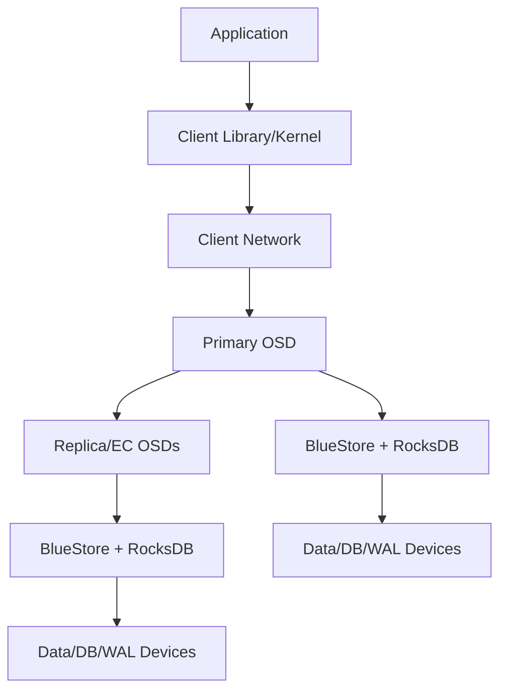
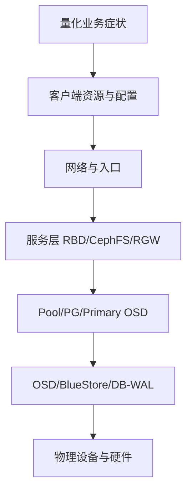

# 性能分析与压测：从业务模型、RADOS/RBD/FIO 到 Slow Ops 定位

《Ceph 从零基础到生产运维实战》第 21 篇

← [第 20 篇：磁盘故障与数据恢复](../06-troubleshooting/20-磁盘故障与数据恢复.md)

性能问题不能靠「调几个参数」解决。本篇先建立可重复的负载模型，再分别测试设备、RADOS、RBD、CephFS 和 RGW，最后沿客户端、网络、PG、OSD、BlueStore、磁盘逐层定位瓶颈。

## 1. 本文目标 {/* #本文目标 */}

读完并完成受控实验后，你应该能够：

- 区分 IOPS、吞吐、平均延迟和尾延迟
- 用 I/O 大小、并发、读写比和随机性描述业务负载
- 理解单盘测试、RADOS 测试和业务接口测试的边界
- 使用 `rados bench` 和 `rbd bench` 建立基础性能结果
- 使用 FIO 对独立测试 RBD 进行可重复压测
- 为 CephFS 和 RGW 设计接近真实业务的测试
- 在压测过程中同步采集客户端、网络、OSD 和磁盘证据
- 使用 OSD op tracker 分析 slow ops
- 区分客户端瓶颈、网络瓶颈、热 PG、恢复争抢和慢盘
- 建立性能基线、变更对比和性能事故 Runbook

:::danger 破坏性风险提示
FIO、RBD bench 和 RADOS bench 会产生真实读写。对已有块设备执行写测试可能覆盖业务数据。所有示例必须使用专用测试 Pool、专用镜像、专用目录和最小权限账号，禁止指向生产卷或未知设备。
:::

## 2. 「Ceph 很慢」不是一个可排查的问题 {/* #ceph-很慢不是一个可排查的问题 */}

一个有效的问题应该像这样：

> 2026-08-06 10:15 起，生产虚拟机使用的 RBD Pool 在 4 KiB 随机写、4 个客户端、每客户端 iodepth 32 时，P99 延迟从 8 ms 上升到 120 ms；同期集群正在进行 OSD backfill。

至少包含：

- 时间范围
- 存储接口
- Pool/业务
- 读还是写
- 顺序还是随机
- I/O 大小
- 并发和队列深度
- 平均/P95/P99 延迟
- 是否有恢复、scrub 或变更
- 影响范围

如果只有「用户说慢」，第一步不是调参数，而是把现象量化。

## 3. 四个基本性能指标 {/* #四个基本性能指标 */}

### 3.1 IOPS {/* #iops */}

每秒完成的 I/O 操作数。

适合描述：

- 4 KiB 随机读写
- 数据库
- 虚拟机系统盘
- 大量小文件或小对象请求

### 3.2 Throughput {/* #throughput */}

每秒传输的数据量，常用 MiB/s 或 GiB/s。

适合描述：

- 大对象上传下载
- 备份
- 视频
- 顺序读写

### 3.3 Latency {/* #latency */}

完成一次 I/O 所需时间。

平均延迟可能掩盖少量极慢请求，因此要看：

- Average
- P50
- P95
- P99
- Max

### 3.4 并发与队列深度 {/* #并发与队列深度 */}

并发增加通常可以提高吞吐，但也会增加排队和尾延迟。比较结果时必须保持并发条件一致。

### 3.5 三者关系 {/* #三者关系 */}

在简化稳定系统中，可以使用 Little's Law 理解并发、吞吐和延迟：

```text
并发数 ≈ 每秒操作数 × 单次操作延迟（秒）
```

例如 32 个并发 I/O、平均延迟 8 ms，理论完成率大约为：

```text
32 ÷ 0.008 = 4000 IOPS
```

这只是帮助理解排队关系，不代表 Ceph 一定达到该结果。

## 4. 用工作负载模型描述测试 {/* #用工作负载模型描述测试 */}

每次测试都记录：

| 维度 | 示例 |
| --- | --- |
| 接口 | RADOS、RBD、CephFS、S3 |
| I/O 模式 | 顺序、随机 |
| 读写比 | 100% 读、70/30、100% 写 |
| I/O 大小 | 4 KiB、64 KiB、1 MiB、4 MiB |
| 并发 | 1、4、16、32、64 |
| 队列深度 | 1、8、32 |
| 数据集大小 | 是否超过客户端和设备缓存 |
| 持续时间 | 预热、正式测试、冷却 |
| 客户端数量 | 单机还是多机 |
| 数据保护 | 3 副本或 EC k+m |
| 后台任务 | recovery、backfill、scrub |
| 集群水位 | 当前容量使用率 |

### 4.1 为什么 4 KiB 和 4 MiB 结果不能直接比较 {/* #为什么-4-kib-和-4-mib-结果不能直接比较 */}

假设同样达到 1000 IOPS：

- 4 KiB I/O 大约只有 3.9 MiB/s
- 4 MiB I/O 大约达到 3.9 GiB/s

所以报告「1000 IOPS」而不写 I/O 大小几乎没有意义。

### 4.2 为什么测试时间不能太短 {/* #为什么测试时间不能太短 */}

十秒测试容易受到：

- 客户端缓存
- BlueStore 缓存
- 瞬时突发
- CPU 频率变化
- 网络 buffer
- 后台任务时间片

生产评估通常需要预热和较长稳定窗口，并重复多次。

## 5. Ceph I/O 路径 {/* #ceph-io-路径 */}

性能问题可能出现在任何一层：



一次副本 Pool 写入的简化过程：

1. 客户端根据 Cluster Map 计算 PG 和 primary OSD
2. 客户端把请求发给 primary
3. primary 把写入复制给其他 acting OSD
4. 各 OSD 通过 BlueStore 落盘
5. 满足持久化和副本条件后向客户端确认

尾延迟可能由 acting set 中较慢的环节决定。一块慢盘、一个拥塞网卡或一个热 primary 都可能拖慢请求。

## 6. 压测前检查清单 {/* #压测前检查清单 */}

### 6.1 业务与风险 {/* #业务与风险 */}

- [ ] 测试目标和成功标准明确
- [ ] 使用独立 Pool/镜像/Bucket/目录
- [ ] 已确认测试会产生多少 Raw 数据
- [ ] 有容量余量
- [ ] 有停止条件
- [ ] 生产测试已审批并通知业务
- [ ] 清理方法已验证

### 6.2 集群状态 {/* #集群状态 */}

```bash
ceph -s
ceph health detail
ceph df detail
ceph osd tree
ceph osd perf
ceph pg stat
```

如果集群已有：

- inactive/degraded PG
- OSD down
- nearfull/backfillfull/full
- 持续 slow ops
- 未知网络或设备错误

不要直接开始大规模压测。

### 6.3 记录环境 {/* #记录环境 */}

```bash
ceph versions
ceph orch ps --refresh
ceph osd pool ls detail
```

还应记录：

- Ceph 版本
- 内核和客户端版本
- CPU、内存和 NUMA
- 网卡速率、MTU 和 bonding
- OSD 数量与设备类型
- DB/WAL 布局
- Pool size/EC profile/CRUSH rule
- mClock profile
- 当前容量水位

没有环境信息，结果无法复现。

## 7. 建立测试账号和 Pool {/* #建立测试账号和-pool */}

以下仅用于隔离实验环境。

### 7.1 创建专用 Pool {/* #创建专用-pool */}

```bash
ceph osd pool create ceph-bench 32
```

PG 数量应根据测试集群规模和 autoscaler 设计，不要把示例中的 32 直接用于所有环境。

### 7.2 创建 RADOS 压测用户 {/* #创建-rados-压测用户 */}

```bash
ceph auth get-or-create client.radosbench \
  mon 'allow r' \
  osd 'allow rw pool=ceph-bench' \
  -o /etc/ceph/ceph.client.radosbench.keyring
```

### 7.3 创建 RBD 压测用户 {/* #创建-rbd-压测用户 */}

```bash
ceph auth get-or-create client.rbdbench \
  mon 'profile rbd' \
  osd 'profile rbd pool=ceph-bench' \
  mgr 'profile rbd pool=ceph-bench' \
  -o /etc/ceph/ceph.client.rbdbench.keyring
```

RADOS 对象压测与 RBD 管理需要的权限不同，因此分成两个账号。不要为了省事让压测客户端使用 `client.admin`。

### 7.4 记录初始容量 {/* #记录初始容量 */}

```bash
ceph df detail
rados --id radosbench df
```

## 8. 使用 rados bench 测试 RADOS {/* #使用-rados-bench-测试-rados */}

RADOS 测试绕过 RBD、文件系统和 RGW，可以观察底层对象存储能力，但不能直接代表最终业务性能。

### 8.1 写测试 {/* #写测试 */}

```bash
rados --id radosbench -p ceph-bench bench 60 write \
  --concurrent-ios 16 \
  --object-size 4M \
  --run-name article18 \
  --no-cleanup
```

参数含义：

| 参数 | 含义 |
| --- | --- |
| 60 | 测试 60 秒 |
| write | 写测试 |
| --concurrent-ios 16 | 16 个并发 I/O |
| --object-size 4M | 对象大小 4 MiB |
| --run-name | 本轮测试标识 |
| --no-cleanup | 保留对象供后续读测试 |

### 8.2 顺序读 {/* #顺序读 */}

写测试和顺序读测试应在同一客户端执行：

```bash
rados --id radosbench -p ceph-bench bench 60 seq \
  --concurrent-ios 16 \
  --run-name article18
```

### 8.3 随机读 {/* #随机读 */}

```bash
rados --id radosbench -p ceph-bench bench 60 rand \
  --concurrent-ios 16 \
  --run-name article18
```

### 8.4 清理测试对象 {/* #清理测试对象 */}

```bash
rados --id radosbench -p ceph-bench cleanup --run-name article18
```

清理后验证：

```bash
rados --id radosbench -p ceph-bench ls
ceph df detail
```

### 8.5 结果怎么看 {/* #结果怎么看 */}

重点记录：

- Bandwidth
- Average IOPS
- Average Latency
- Max Latency
- 测试对象大小
- 并发数
- 测试客户端数量

### 8.6 rados bench 的局限 {/* #rados-bench-的局限 */}

- 默认对象模型不等于 RBD 4 KiB 随机写
- 不包含文件系统和应用开销
- 单客户端可能先达到 CPU 或网卡上限
- 写测试会受副本/EC 配置影响
- 结果可能受缓存和对象数量影响
- `--no-cleanup` 会留下真实容量

## 9. 使用 rbd bench 测试 RBD {/* #使用-rbd-bench-测试-rbd */}

### 9.1 初始化测试 Pool {/* #初始化测试-pool */}

```bash
rbd --id rbdbench pool init ceph-bench
```

### 9.2 创建独立测试镜像 {/* #创建独立测试镜像 */}

```bash
rbd --id rbdbench create ceph-bench/bench-image --size 100G
rbd --id rbdbench info ceph-bench/bench-image
```

镜像必须确认没有业务数据。

### 9.3 KiB 随机写 {/* #4-kib-随机写 */}

```bash
rbd --id rbdbench bench \
  --io-type write \
  --io-size 4K \
  --io-threads 16 \
  --io-total 10G \
  --io-pattern rand \
  ceph-bench/bench-image
```

### 9.4 MiB 顺序读 {/* #4-mib-顺序读 */}

```bash
rbd --id rbdbench bench \
  --io-type read \
  --io-size 4M \
  --io-threads 16 \
  --io-total 20G \
  --io-pattern seq \
  ceph-bench/bench-image
```

如果此前没有写入足够数据，读取稀疏的未分配区域不能代表真实磁盘读取性能。

### 9.5 混合读写 {/* #混合读写 */}

```bash
rbd --id rbdbench bench \
  --io-type readwrite \
  --rw-mix-read 70 \
  --io-size 4K \
  --io-threads 32 \
  --io-total 10G \
  --io-pattern rand \
  ceph-bench/bench-image
```

### 9.6 结果边界 {/* #结果边界 */}

`rbd bench` 使用 librbd 路径，适合快速比较，但仍不包含：

- 虚拟机 QEMU 配置
- 客户端文件系统
- 数据库 fsync 模型
- 真实多租户并发
- 应用缓存

## 10. 使用 FIO 测试映射后的 RBD {/* #使用-fio-测试映射后的-rbd */}

FIO 可以构造更接近块设备业务的负载，并输出延迟分位数。

### 10.1 映射专用测试镜像 {/* #映射专用测试镜像 */}

```bash
rbd device map ceph-bench/bench-image --id rbdbench
rbd device list
```

确认返回设备路径与专用测试镜像对应。

### 10.2 KiB 随机读 {/* #4-kib-随机读 */}

```bash
fio \
  --name=rbd-randread-4k \
  --filename=/dev/rbd/ceph-bench/bench-image \
  --direct=1 \
  --ioengine=libaio \
  --rw=randread \
  --bs=4k \
  --iodepth=32 \
  --numjobs=4 \
  --runtime=300 \
  --time_based \
  --group_reporting
```

### 10.3 70/30 随机混合读写 {/* #7030-随机混合读写 */}

```bash
fio \
  --name=rbd-randrw-4k \
  --filename=/dev/rbd/ceph-bench/bench-image \
  --direct=1 \
  --ioengine=libaio \
  --rw=randrw \
  --rwmixread=70 \
  --bs=4k \
  --iodepth=32 \
  --numjobs=4 \
  --runtime=300 \
  --time_based \
  --group_reporting
```

此命令包含写入，会覆盖测试镜像中的数据。绝对不能把 `--filename` 改成业务盘、系统盘或未确认设备。

### 10.4 大块顺序写 {/* #大块顺序写 */}

```bash
fio \
  --name=rbd-seqwrite-1m \
  --filename=/dev/rbd/ceph-bench/bench-image \
  --direct=1 \
  --ioengine=libaio \
  --rw=write \
  --bs=1m \
  --iodepth=16 \
  --numjobs=1 \
  --runtime=300 \
  --time_based \
  --group_reporting
```

### 10.5 为什么使用 direct I/O {/* #为什么使用-direct-io */}

`--direct=1` 尽量减少客户端页缓存对结果的影响，但不同内核、ioengine、文件系统和应用仍可能有额外缓存。报告中必须写明参数。

### 10.6 测试结束 {/* #测试结束 */}

```bash
rbd device unmap /dev/rbd/ceph-bench/bench-image
```

确认无人使用后再删除测试镜像：

```bash
rbd --id rbdbench rm ceph-bench/bench-image
```

## 11. 测试单盘和本地主机的边界 {/* #测试单盘和本地主机的边界 */}

单盘测试可以回答：

- 设备顺序吞吐大约多少
- 随机 IOPS 和延迟
- DB/WAL 设备能力
- 是否有异常慢盘

它不能回答完整 Ceph 性能，因为不包含：

- 网络
- 副本/EC
- primary OSD
- BlueStore/RocksDB
- PG 分布
- 多客户端竞争

### 11.1 FIO 原始设备写测试非常危险 {/* #fio-原始设备写测试非常危险 */}

对 `/dev/sdX` 或 `/dev/nvmeXn1` 执行写测试会破坏已有数据、分区和 OSD。本文不提供可直接复制的原始盘写命令。

设备验收应使用：

- 完全独立、可丢弃的新设备
- 已确认序列号和用途
- 与生产 OSD 隔离的测试主机
- 厂商和团队批准的 FIO job 文件
- 明确的 destructive 标记和双人复核

### 11.2 文件方式测试也有边界 {/* #文件方式测试也有边界 */}

在专用本地测试文件系统上使用 FIO 文件，可以降低误写整盘风险，但结果包含文件系统开销，且不能完全代表裸设备。

## 12. CephFS 性能测试 {/* #cephfs-性能测试 */}

CephFS 同时包含数据路径和 MDS 元数据路径，不能只用大文件顺序写评估。

### 12.1 数据 I/O 测试 {/* #数据-io-测试 */}

在专用测试 Subvolume 挂载点中：

```bash
fio \
  --name=cephfs-seqwrite \
  --directory=/mnt/cephfs-bench \
  --filename=bench.dat \
  --size=20G \
  --direct=1 \
  --ioengine=libaio \
  --rw=write \
  --bs=1m \
  --iodepth=16 \
  --runtime=300 \
  --time_based \
  --group_reporting
```

### 12.2 元数据测试 {/* #元数据测试 */}

需要单独测试：

- 创建大量小文件
- stat
- 目录遍历
- rename
- unlink
- 多客户端访问同一目录
- 多目录分散访问

元数据测试工具和脚本应限制文件数量和清理范围。不要在 CephFS 根目录或业务目录生成百万文件。

### 12.3 同时观察 MDS {/* #同时观察-mds */}

```bash
ceph fs status
ceph mds stat
ceph health detail
```

监控：

- MDS CPU 和内存
- request latency
- client sessions
- cache pressure
- metadata Pool 延迟
- 是否出现 slow metadata IO
- 单目录热点

### 12.4 Kernel Client 与 Ceph-FUSE {/* #kernel-client-与-ceph-fuse */}

两种客户端路径性能不同。报告必须注明：

- 客户端类型
- 内核/FUSE 版本
- mount options
- 是否使用 client cache
- 测试路径和 Data Pool layout

## 13. RGW/S3 性能测试 {/* #rgws3-性能测试 */}

RGW 性能不仅受 RADOS 影响，还包含：

- DNS
- TLS
- 负载均衡
- RGW frontend
- S3 签名
- Bucket index
- multipart
- 客户端 SDK

### 13.1 设计测试矩阵 {/* #设计测试矩阵 */}

| 场景 | 对象大小 | 请求类型 | 并发 |
| --- | --- | --- | --- |
| 小对象写 | 4 KiB/64 KiB | PUT | 16/64/128 |
| 小对象读 | 4 KiB/64 KiB | GET | 16/64/128 |
| 大对象上传 | 1/4/64 GiB | Multipart PUT | 4/16 |
| 大对象下载 | 1/4/64 GiB | GET | 4/16 |
| 元数据 | 小对象 | LIST/HEAD/DELETE | 按业务 |

### 13.2 必须走生产相同入口 {/* #必须走生产相同入口 */}

如果要评估用户体验，应通过：

```text
Client -> DNS -> TLS -> Load Balancer -> RGW -> RADOS
```

只压 RGW 后端 IP 会绕过实际入口，适合分层定位，不适合作为最终业务结果。

### 13.3 记录 S3 结果 {/* #记录-s3-结果 */}

- 每秒请求数
- 吞吐
- P50/P95/P99
- HTTP 状态码
- 重试次数
- TLS 和连接复用
- multipart part size
- Bucket 数量、shard 和对象数量
- 每个 RGW 后端请求分布

### 13.4 避免测试制造长期垃圾 {/* #避免测试制造长期垃圾 */}

使用专用用户、Bucket 和前缀，并提前验证：

- 批量删除
- 版本控制状态
- multipart abort
- 生命周期规则
- quota
- 测试后 bucket stats

## 14. 压测时必须同步观察什么 {/* #压测时必须同步观察什么 */}

只保存 FIO 最后一行是不够的。每轮测试同步采集：

### 14.1 Ceph 集群 {/* #ceph-集群 */}

```bash
ceph -s
ceph osd perf
ceph pg stat
ceph df detail
```

### 14.2 客户端 {/* #客户端 */}

```bash
pidstat 1
iostat -x 1
sar -n DEV 1
```

关注：

- 压测进程 CPU
- 客户端网卡是否打满
- 客户端本地盘是否参与
- context switch
- 内存和 page cache
- 网络重传

### 14.3 OSD 主机 {/* #osd-主机 */}

```bash
iostat -x 1
pidstat 1
sar -n DEV 1
```

关注每个 OSD 设备和 DB/WAL 设备：

- r/s、w/s
- r_await、w_await
- queue depth
- %util
- CPU iowait
- OSD 进程 CPU
- 网卡吞吐、丢包和重传

### 14.4 Prometheus/Grafana {/* #prometheusgrafana */}

在同一时间轴观察：

- 客户端 I/O
- recovery/backfill
- OSD apply/commit latency
- 主机 CPU、内存、磁盘、网络
- slow ops
- PG 状态
- MDS 或 RGW 指标

测试报告必须保存开始/结束时间，才能对齐曲线。

## 15. 建立性能基线 {/* #建立性能基线 */}

基线不是「集群最高能跑多少」，而是特定工作负载下的正常范围。

### 15.1 建议基线矩阵 {/* #建议基线矩阵 */}

| 负载 | I/O 大小 | 读写比 | 并发 | 记录 |
| --- | --- | --- | --- | --- |
| 随机读 | 4 KiB | 100/0 | 1/16/64 | IOPS、P99 |
| 随机写 | 4 KiB | 0/100 | 1/16/64 | IOPS、P99 |
| 混合 | 4 KiB | 70/30 | 16/64 | IOPS、P99 |
| 顺序读 | 1 MiB | 100/0 | 4/16 | MiB/s、P99 |
| 顺序写 | 1 MiB | 0/100 | 4/16 | MiB/s、P99 |

### 15.2 至少测三种集群状态 {/* #至少测三种集群状态 */}

1. 健康且空闲
2. 典型业务负载
3. 单 OSD/主机故障后的 recovery/backfill

只测试健康空闲状态，无法预测故障恢复时业务表现。

### 15.3 结果要重复 {/* #结果要重复 */}

每个测试至少重复多轮，并记录：

- 中位结果
- 波动范围
- 异常轮次原因
- 是否经过预热
- 每轮之间的冷却和清理

一次最好成绩不能作为容量承诺。

## 16. 性能问题的分层定位顺序 {/* #性能问题的分层定位顺序 */}



每层先问：

- 现象是否集中
- 何时开始
- 是否达到资源上限
- 是否有错误和重试
- 与哪项变更相关

## 17. 第一层：客户端瓶颈 {/* #第一层客户端瓶颈 */}

### 17.1 常见问题 {/* #常见问题 */}

- 单客户端 CPU 打满
- 单网卡带宽达到上限
- 并发太低，无法填满链路
- 并发太高，导致排队和尾延迟
- 旧内核或旧 librbd
- 虚拟机 virtio/QEMU 配置
- FIO 测试集小于缓存
- 应用 fsync 频率高
- SDK 重试形成放大

### 17.2 如何判断 {/* #如何判断 */}

如果增加第二个客户端后总吞吐明显提升，而单客户端已打满 CPU 或网络，瓶颈很可能先在客户端。

如果所有客户端同时在相同时间变慢，则更可能是共享网络、集群、Pool 或后台任务。

### 17.3 对比不同客户端路径 {/* #对比不同客户端路径 */}

- krbd 与 librbd
- Kernel CephFS 与 Ceph-FUSE
- RGW 直连与 LB 入口
- 不同内核和 SDK 版本

对比时一次只改变一个变量。

## 18. 第二层：网络瓶颈 {/* #第二层网络瓶颈 */}

### 18.1 典型信号 {/* #典型信号 */}

- 客户端或 OSD 网卡吞吐接近线速
- TCP retransmit 增加
- 网卡 drop/error
- bonding 单流量哈希到单链路
- MTU 不一致
- 交换机端口拥塞或 pause frame
- 同一机架明显慢于其他机架
- OSD heartbeat 慢

### 18.2 检查命令 {/* #检查命令 */}

```bash
ip -s link
ethtool <interface>
ethtool -S <interface>
sar -n DEV 1
ss -s
```

需要同时检查：

- 客户端端口
- OSD 主机端口
- 交换机端口
- bonding/LACP
- 路由和防火墙

### 18.3 不要只用 ping 判断网络正常 {/* #不要只用-ping-判断网络正常 */}

Ping 的小 ICMP 包成功不能证明：

- 大吞吐无丢包
- TCP 无重传
- MTU 全路径一致
- 多队列/RSS 正常
- 交换机没有微突发
- OSD 到 OSD 复制网络正常

需要吞吐、错误计数和交换机侧证据。

## 19. 第三层：Pool、PG 与热点 {/* #第三层poolpg-与热点 */}

### 19.1 单 Pool 或单业务慢 {/* #单-pool-或单业务慢 */}

检查：

```bash
ceph osd pool ls detail
ceph osd pool get <pool-name> crush_rule
ceph pg ls-by-pool <pool-name>
ceph osd df tree
```

关注：

- Pool 使用哪类 OSD
- PG 数量和 autoscaler 状态
- acting set 是否集中
- 是否有单个 primary OSD 过热
- 是否存在大 Bucket、大目录或热点镜像

### 19.2 热点不一定靠增加 PG 解决 {/* #热点不一定靠增加-pg-解决 */}

增加 PG 可能改善分布，但：

- PG 数调整会触发迁移
- 单个大 RBD 镜像仍可能受对象访问模式影响
- RGW 单 Bucket 索引可能是热点
- CephFS 单目录元数据可能集中到一个 MDS rank
- 客户端请求本身可能集中在相同对象

必须先判断热点位于数据、索引、元数据还是客户端。

### 19.3 Primary OSD 与副本 OSD {/* #primary-osd-与副本-osd */}

客户端先联系 PG primary，因此 primary 分布不均会影响读写处理。较新 Ceph 版本提供 read balancer 等能力，但启用前要确认版本、模式和现有 upmap 状态。

## 20. 第四层：OSD 延迟与 Slow Ops {/* #第四层osd-延迟与-slow-ops */}

### 20.1 快速查看 OSD 延迟 {/* #快速查看-osd-延迟 */}

```bash
ceph osd perf
ceph health detail
```

如果某个 OSD 的 commit/apply latency 长期高于同类设备，继续检查该主机和设备。

### 20.2 查看正在处理的操作 {/* #查看正在处理的操作 */}

```bash
ceph daemon osd.<id> dump_ops_in_flight
```

关注：

- op age
- client IP
- PG ID
- 当前 flag_point
- 是否等待 subops
- 是否排队或等待磁盘

### 20.3 查看历史慢操作 {/* #查看历史慢操作 */}

```bash
ceph daemon osd.<id> dump_historic_ops_by_duration
ceph daemon osd.<id> dump_historic_slow_ops
```

这些命令应针对已确认的异常 OSD，避免对所有 OSD 同时拉取大量输出。

### 20.4 常见 flag point 思路 {/* #常见-flag-point-思路 */}

具体字段随版本变化，但可以按阶段理解：

- 等待 PG active：可能是 peering/PG 问题
- queued：OSD 调度或负载
- waiting for subops：副本 OSD、网络或副本磁盘慢
- waiting for commit：本地 BlueStore/设备延迟
- waiting for map：集群映射或控制面问题

必须结合当前版本输出解释，不能只匹配旧资料中的字符串。

## 21. 第五层：BlueStore、DB/WAL 与磁盘 {/* #第五层bluestoredbwal-与磁盘 */}

### 21.1 设备延迟 {/* #设备延迟 */}

在目标 OSD 主机：

```bash
iostat -x 1
journalctl -k --since "1 hour ago"
```

关注：

- await
- queue
- utilization
- I/O error/reset/timeout
- 同型号设备对比
- DB/WAL 与数据盘谁先饱和

### 21.2 BlueStore DB/WAL {/* #bluestore-dbwal */}

HDD OSD 使用高速 SSD/NVMe 承载 RocksDB/BlueFS 时，DB 设备可能成为共享瓶颈。

检查：

- 一个 DB 设备服务多少 OSD
- DB 空间是否不足发生 spillover
- DB 设备延迟是否饱和
- 小对象/omap 负载是否很高
- 设备是否出现写放大和寿命问题

### 21.3 BlueFS spillover {/* #bluefs-spillover */}

如果 RocksDB 数据溢出到慢设备，性能可能明显下降。出现相关健康告警时，应检查 DB 空间和布局，而不是只关闭告警。

### 21.4 碎片化 {/* #碎片化 */}

BlueStore 长期使用可能出现空间碎片。健康检查和 allocator score 可以提供线索，但碎片不是所有慢 I/O 的默认答案。先排除设备、网络、容量和恢复负载。

### 21.5 慢盘判断必须做同类对比 {/* #慢盘判断必须做同类对比 */}

把 HDD 延迟与 NVMe 直接比较没有意义。应比较：

- 同型号
- 同容量
- 同 OSD 角色
- 同一时间业务负载
- 相似 PG/容量分布

## 22. Recovery、Backfill、Scrub 对业务的影响 {/* #recoverybackfillscrub-对业务的影响 */}

### 22.1 后台任务为什么抢资源 {/* #后台任务为什么抢资源 */}

恢复会占用：

- OSD 磁盘读写
- OSD CPU
- 集群网络
- PG 锁和队列
- BlueStore/DB 资源

### 22.2 先确定优先级 {/* #先确定优先级 */}

两个目标存在张力：

1. 加快恢复，缩短冗余不足时间
2. 保护客户端延迟和业务吞吐

生产策略应根据：

- 当前剩余副本
- 是否还有第二故障风险
- 业务 SLO
- 故障窗口
- 设备和网络余量

### 22.3 mClock {/* #mclock */}

现代 BlueStore OSD 通常使用 mClock 调度客户端、恢复和后台 I/O。常见 profile 包括平衡、偏客户端和偏恢复等方向。

不要只因为「业务慢」就直接切 profile。先记录：

- 当前 profile
- 客户端与恢复吞吐
- OSD capacity 识别值
- 延迟基线
- 变更停止和回退条件

### 22.4 不要同时修改多组恢复参数 {/* #不要同时修改多组恢复参数 */}

不同版本的 mClock 和传统 recovery 参数交互不同。一次修改多个并发、sleep、backfill 和 profile 参数，会让结果无法解释。

## 23. 小对象与大对象性能差异 {/* #小对象与大对象性能差异 */}

### 23.1 小 I/O/小对象 {/* #小-io小对象 */}

更容易受以下因素限制：

- IOPS
- 请求处理 CPU
- RocksDB/omap
- 网络包率
- 元数据
- 尾延迟

### 23.2 大 I/O/大对象 {/* #大-io大对象 */}

更容易受以下因素限制：

- 网络带宽
- 磁盘顺序吞吐
- multipart 并发
- 客户端内存和缓冲
- 单流或多流限制

### 23.3 不能用一个结果代表所有业务 {/* #不能用一个结果代表所有业务 */}

4 MiB rados bench 达到很高吞吐，不代表数据库 4 KiB fsync 延迟优秀；小对象 S3 QPS 很高，也不代表单个 100 GiB 对象上传能跑满带宽。

## 24. 副本与纠删码的性能差异 {/* #副本与纠删码的性能差异 */}

### 24.1 副本 Pool {/* #副本-pool */}

3 副本写入会在多个 OSD 保存完整数据，并产生网络和介质写放大。优势是逻辑和小写路径相对直接，恢复也容易理解。

### 24.2 EC Pool {/* #ec-pool */}

EC k+m 将数据编码成 k 个数据分片和 m 个校验分片。容量效率更高，但：

- 编码需要 CPU
- 小覆盖写可能涉及读改写
- 需要访问更多 OSD
- 故障恢复计算和网络路径更复杂
- 参数、stripe 和业务 I/O 大小会影响结果

### 24.3 公平比较 {/* #公平比较 */}

比较副本与 EC 时保持：

- 相同设备和故障域
- 相同客户端数和 I/O 模型
- 相同容量水位
- 相同后台任务
- 明确 Raw 成本和数据保护等级

不能只拿吞吐结果比较，而忽略容量成本和容错能力。

## 25. 缓存如何让测试失真 {/* #缓存如何让测试失真 */}

可能参与的缓存包括：

- 应用缓存
- 客户端页缓存
- QEMU/librbd cache
- RBD persistent write-back cache
- OSD 内存
- BlueStore/RocksDB cache
- 设备写缓存

### 25.1 常见假象 {/* #常见假象 */}

- 数据集太小，读测试全部命中缓存
- 短时写入先进入缓存，测试结束前未体现稳定落盘
- 第一次和第二次读结果差异巨大
- 测试工具未使用 direct I/O
- 设备断电保护能力与写缓存策略不匹配

### 25.2 正确报告 {/* #正确报告 */}

写明：

- direct/buffered
- 数据集大小
- 预热时间
- 测试持续时间
- cache 配置
- fsync/fdatasync 模式
- 是否冷读或热读

不要为了得到漂亮数字盲目清系统缓存或修改生产缓存策略。

## 26. 通过对照实验定位瓶颈 {/* #通过对照实验定位瓶颈 */}

一次只改变一个变量。

### 26.1 示例矩阵 {/* #示例矩阵 */}

| 轮次 | 变量变化 | 目的 |
| --- | --- | --- |
| A | 单客户端、QD=1 | 测基础延迟 |
| B | 单客户端、QD=32 | 测单客户端并发能力 |
| C | 四客户端、每个 QD=32 | 判断客户端/网络上限 |
| D | 4 KiB 改 1 MiB | 区分 IOPS 与吞吐瓶颈 |
| E | 停止测试恢复任务 | 量化后台恢复影响 |
| F | 直连 RGW 与 LB 对比 | 判断入口开销 |

### 26.2 结果解释示例 {/* #结果解释示例 */}

- 增加客户端后总性能提升：单客户端可能受限
- 增加并发后吞吐不升、P99 激增：后端已饱和
- RADOS 快、RBD 慢：关注客户端/librbd/镜像路径
- RBD 快、应用慢：关注文件系统、QEMU、数据库或应用
- RGW 直连快、LB 慢：关注 LB/TLS/DNS
- 所有接口同时慢：关注共享网络、OSD、设备和后台任务

## 27. 性能变更的正确方法 {/* #性能变更的正确方法 */}

每项优化都写成实验：

```text
问题：
假设：
观察指标：
当前基线：
只改变的变量：
预期结果：
停止条件：
回退命令：
观察窗口：
实际结果：
结论：
```

### 27.1 常见可优化方向 {/* #常见可优化方向 */}

- 客户端并发和队列
- 网络带宽、RSS、bonding 和 MTU
- OSD 主机 CPU/内存
- DB/WAL 设备比例和容量
- Pool/CRUSH/device class
- PG 与 primary 分布
- mClock profile
- RGW 实例数和 LB
- MDS rank 和目录设计
- 应用 I/O 合并、批量和缓存

### 27.2 参数不是越大越好 {/* #参数不是越大越好 */}

例如提高队列深度可能增加吞吐，但 P99 更差；提高 recovery 并发可能缩短降级时间，但压垮生产 I/O。优化必须围绕业务 SLO。

## 28. 性能事故 Runbook {/* #性能事故-runbook */}

### 28.1 量化现象 {/* #量化现象 */}

```text
开始时间：
存储接口：
业务/Pool：
读/写：
I/O 大小：
并发/QD：
基线 IOPS/吞吐/P99：
当前 IOPS/吞吐/P99：
影响客户端范围：
近期变更：
```

### 28.2 第一轮证据 {/* #第一轮证据 */}

```bash
ceph -s
ceph health detail
ceph osd perf
ceph pg stat
ceph osd df tree
ceph orch ps --refresh
```

同时保存：

- 客户端 CPU、内存、网络
- OSD 主机 CPU、内存、网络
- 设备 iostat
- recovery/backfill
- Prometheus 曲线
- 变更时间线

### 28.3 缩小范围 {/* #缩小范围 */}

- 单客户端还是全部客户端
- 单服务还是所有服务
- 单 Pool 还是所有 Pool
- 单 OSD/主机/机架还是全局
- 只在恢复期间还是持续
- 平均慢还是少量尾延迟慢

### 28.4 最小止损 {/* #最小止损 */}

根据证据考虑：

- 摘除异常 RGW 后端
- 暂停非必要批任务
- 控制异常客户端重试
- 调整已确认的恢复与客户端优先级
- 隔离明确故障设备
- 回退近期配置或版本变更

不要没有证据就重启整个 OSD 服务。

### 28.5 恢复验证 {/* #恢复验证 */}

- 业务 P95/P99 回到基线
- 错误率恢复
- Ceph health 可解释
- OSD 延迟恢复
- 网络和设备无持续错误
- 临时限流和参数回退
- 观察足够稳定窗口

## 29. 性能测试报告模板 {/* #性能测试报告模板 */}

### 29.1 环境 {/* #环境 */}

```text
Ceph 版本：
节点/OSD 数量：
设备：
DB/WAL：
网络：
Pool：
副本/EC：
CRUSH：
客户端版本：
集群容量水位：
健康状态：
```

### 29.2 工作负载 {/* #工作负载 */}

```text
工具与版本：
接口：
I/O 类型：
I/O 大小：
读写比：
并发/QD：
客户端数：
数据集大小：
预热时间：
持续时间：
重复次数：
```

### 29.3 结果 {/* #结果 */}

| 指标 | Round 1 | Round 2 | Round 3 | Median |
| --- | --- | --- | --- | --- |
| IOPS |  |  |  |  |
| MiB/s |  |  |  |  |
| Avg latency |  |  |  |  |
| P95 latency |  |  |  |  |
| P99 latency |  |  |  |  |
| Max latency |  |  |  |  |

### 29.4 集群侧结果 {/* #集群侧结果 */}

- 最忙 OSD
- 最高磁盘延迟
- 网卡峰值
- CPU 峰值
- 是否出现 slow ops
- PG/恢复状态
- 测试 Raw 容量
- 测试对象是否清理

### 29.5 结论 {/* #结论 */}

只回答测试覆盖的范围，不要把单客户端 RADOS 结果扩大成整个生产业务承诺。

## 30. 常见错误做法 {/* #常见错误做法 */}

**错误一：直接在生产盘执行 FIO 写测试**

可能覆盖数据。必须使用经过确认的专用测试设备或镜像。

**错误二：只跑十秒并取最高值**

结果容易被缓存和瞬时突发影响，不能代表稳态性能。

**错误三：只看 IOPS，不看延迟**

高并发可以堆出 IOPS，但 P99 可能已经无法满足业务。

**错误四：用 RADOS 结果代表数据库性能**

RADOS bench 不包含 RBD、文件系统、QEMU、fsync 和数据库行为。

**错误五：压测时不记录集群状态**

无法判断结果差异来自参数、恢复、容量还是硬件异常。

**错误六：一次修改多个参数**

无法证明哪个变量有效，也无法安全回退。

**错误七：看到 slow ops 就重启 OSD**

Slow ops 可能来自副本 OSD、网络、恢复、磁盘和请求风暴。重启可能扩大 peering。

**错误八：忘记清理测试数据**

测试对象会真实占用 Raw 容量，甚至引发 nearfull。

## 31. 生产检查清单 {/* #生产检查清单 */}

### 31.1 测试前 {/* #测试前 */}

- [ ] 目标和成功标准明确
- [ ] 独立测试资源
- [ ] 最小权限账号
- [ ] 容量和 Raw 开销已估算
- [ ] 集群健康
- [ ] 监控、时间和日志正常
- [ ] 停止条件与清理流程已验证
- [ ] 生产测试已有审批

### 31.2 测试中 {/* #测试中 */}

- [ ] 保存完整参数
- [ ] 同步采集客户端和集群指标
- [ ] 观察 P95/P99 和错误率
- [ ] 观察 OSD、PG、容量、slow ops
- [ ] 观察网络、磁盘、CPU
- [ ] 达到停止条件立即终止
- [ ] 一次只改变一个变量

### 31.3 测试后 {/* #测试后 */}

- [ ] 清理对象、镜像、文件和 Bucket
- [ ] 验证 Pool 容量恢复
- [ ] 检查没有遗留 mapped device
- [ ] 检查集群恢复 active+clean
- [ ] 汇总多轮中位数与尾延迟
- [ ] 记录环境、版本和异常轮次
- [ ] 结论没有超出测试范围

## 32. 本文小结 {/* #本文小结 */}

Ceph 性能分析的正确顺序是：

```text
把「慢」定义成可量化的业务现象
→ 使用 I/O 大小、读写比、随机性、并发和数据集描述负载
→ 分别测试设备、RADOS 和最终业务接口
→ 压测同时采集客户端、网络、PG、OSD、BlueStore 和磁盘指标
→ 用对照实验一次改变一个变量
→ 优先观察 P95/P99、错误率和业务 SLO
→ 完成数据清理和集群恢复验证
```

到这里，系列已经从基础原理、部署、三类存储接口、监控、换盘、PG、容量扩展到性能分析。接下来可以进入网络专项、升级维护、备份容灾和更复杂的真实事故案例。

下一篇将讲解如何使用 cephadm 安全地完成滚动升级，以及升级卡住时如何暂停、恢复和排查。

→ [第 22 篇：Cephadm 滚动升级实战](./22-Cephadm滚动升级实战.md)

## 33. 课后练习 {/* #课后练习 */}

1. 为什么 IOPS 必须和 I/O 大小一起报告？
2. 平均延迟正常时，为什么业务仍可能感觉卡顿？
3. `rados bench` 为什么不能直接代表 RBD 或数据库性能？
4. 顺序读测试前为什么要保留写入对象？
5. FIO 的并发提高后 IOPS 不再上升、P99 激增，通常说明什么？
6. 如何判断瓶颈在单客户端还是 Ceph 集群？
7. Ping 正常为什么不能证明 Ceph 网络正常？
8. Slow ops 中 waiting for subops 可能指向哪些方向？
9. 为什么要在 recovery/backfill 状态下建立性能基线？
10. 一份可复现的性能报告至少要记录哪些参数？

### 33.1 参考答案 {/* #参考答案 */}

1. `IOPS × I/O大小 = 吞吐量`。相同10万IOPS，4KiB约390MiB/s而1MiB约97.7GiB/s，后端压力完全不同；还要说明随机/顺序和读写比例。
2. 平均值会掩盖少量超慢请求，用户感知通常受P95/P99/最大值和排队超时支配；周期性Scrub、恢复或单慢盘可能只抬高尾延迟。
3. `rados bench`直接测试RADOS对象，绕过RBD对象布局、缓存、文件系统、QEMU/内核和应用队列；它适合定位底层基线，不能代表上层数据库路径。
4. `rados bench seq`读取前一轮写入的测试对象；如果写测试自动清理了对象，就没有相同数据可读。写入时需使用正确的保留选项，并在全部测试后显式cleanup。
5. 系统已到某个共享瓶颈或排队拐点，可能是客户端队列、网卡、OSD CPU、磁盘/DB或PG热点。继续加并发只增加队列和尾延迟，应分层看饱和指标。
6. 先从单客户端逐步增加iodepth/jobs，再在多节点并发同一负载。单客户端早平台而集群仍有余量，多为客户端/单路径瓶颈；多客户端聚合也平台且OSD/NIC饱和，才指向集群。
7. Ping只测少量ICMP小包，不能覆盖MTU、大流量丢包、队列拥塞、ECN/PFC、TCP重传和多路径。Ceph需要业务端口、持续吞吐、重传及端到端延迟验证。
8. Primary已收到请求但在等待Replica/EC subop完成，可能是副本OSD磁盘/BlueStore DB慢、网络丢包/拥塞、CPU调度、锁竞争或目标OSD恢复负载高，应定位具体peer。
9. 正常状态基线无法回答故障恢复时业务还剩多少性能。生产必须知道Recovery/Backfill与前台IO竞争后的P99、恢复时长和安全限速点。
10. 至少记录Ceph/OS/内核/客户端版本、拓扑与容量水位、Pool/CRUSH/PG/副本、介质/DB、网络、客户端配置、I/O大小/模式/并发/时长、缓存状态、恢复状态、原始命令、P50/P95/P99和监控时间窗。

## 34. 官方资料 {/* #官方资料 */}

- [rados 工具手册](https://docs.ceph.com/en/latest/man/8/rados/)
- [rbd 工具手册](https://docs.ceph.com/en/latest/man/8/rbd/)
- [OSD 故障与 Slow Ops 排查](https://docs.ceph.com/en/latest/rados/troubleshooting/troubleshooting-osd/)
- [mClock 配置参考](https://docs.ceph.com/en/latest/rados/configuration/mclock-config-ref/)
- [BlueStore 配置参考](https://docs.ceph.com/en/latest/rados/configuration/bluestore-config-ref/)
- [Ceph 性能计数器](https://docs.ceph.com/en/latest/dev/perf_counters/)
