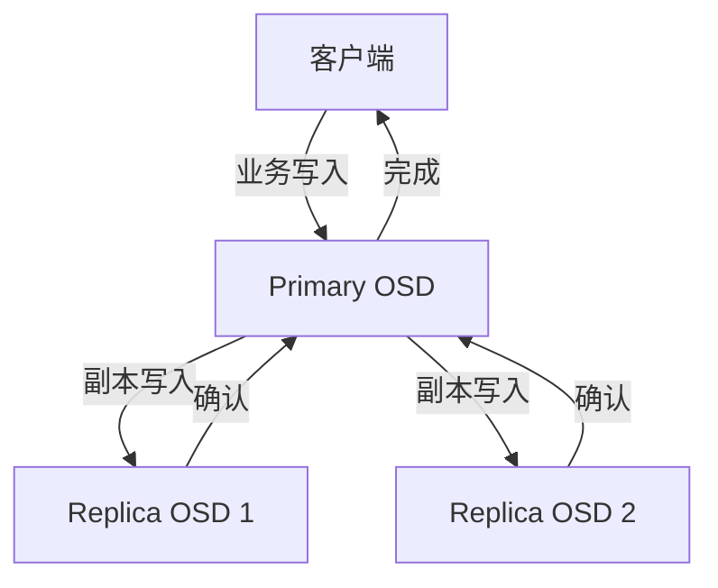
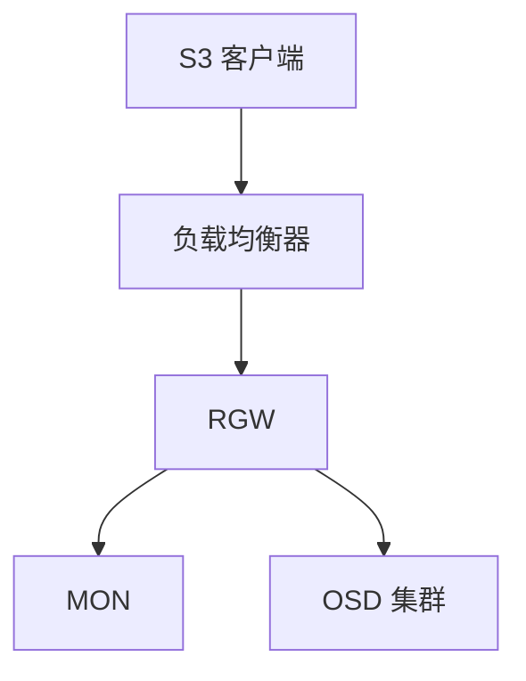
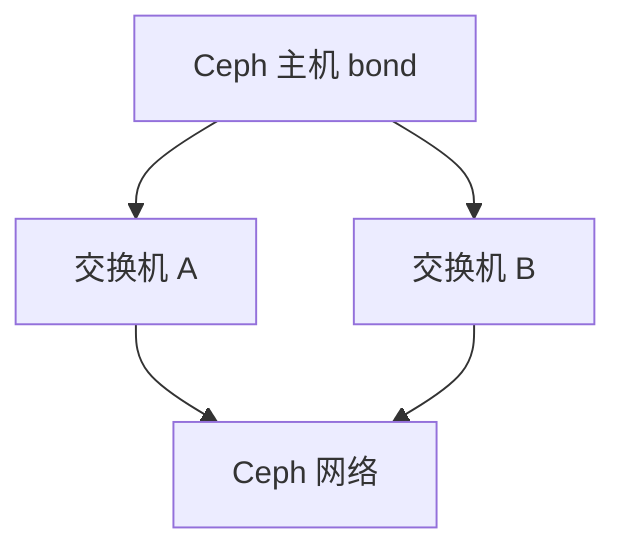

# Ceph 网络设计与故障排查：Public/Cluster Network、丢包、MTU 与带宽

《Ceph 从零基础到生产运维实战》第 23 篇

← [第 22 篇：Cephadm 滚动升级实战](./22-Cephadm滚动升级实战.md)

Ceph 的客户端会直接访问 OSD，OSD 之间还要进行副本、恢复、回填和心跳通信，因此网络不是外围组件，而是存储路径的一部分。本篇从流量模型讲到生产设计，再给出一套不靠猜测的排障方法。


## 本文目标

读完并完成实验后，你应该能够：

- 画出 RBD、CephFS、RGW 请求经过的网络路径
- 区分 Public Network 和 Cluster Network
- 判断单网络与双网络设计各自适用的场景
- 正确开放 MON 和其他 Ceph 守护进程的端口
- 理解带宽、时延、丢包、重传、拥塞和抖动的关系
- 识别 MTU 不一致、LACP 哈希不合理和单链路故障
- 使用 `ip`、`ethtool`、`ss`、`ping`、`tracepath`、`iperf3` 和 `tcpdump` 收集证据
- 按照「现象—路径—主机—接口—交换网络」的顺序排查
- 为网络故障建立可复用的 Runbook

:::caution 风险提示
不要在生产中直接刷新防火墙、修改 MTU、重启网卡、切换 bond 模式或执行无边界的满速 `iperf3`。这些操作可能同时中断 MON quorum、OSD 心跳和客户端 I/O。先做只读检查，再在维护窗口逐台变更。
:::

## 为什么 Ceph 对网络特别敏感

传统存储常由控制器代理所有 I/O；Ceph 客户端从 MON 获取集群映射后，会直接与目标 OSD 通信。

以三副本写入为例：

1. 客户端根据 CRUSH 计算目标 PG
2. 客户端把写请求发给该 PG 的 Primary OSD
3. Primary OSD 将数据发送给其他副本 OSD
4. 各副本完成要求的持久化
5. Primary OSD 向客户端确认



这意味着：

- 一次业务写入会产生额外的集群内部流量
- 最慢的副本路径可能决定写尾延迟
- 少量丢包会引发 TCP 重传和队头阻塞
- 恢复、回填和 scrub 会与业务 I/O 共享网络
- 「网卡利用率没有 100%」不代表网络健康

## 三类入口的流量路径

### RBD

RBD 客户端通过 librbd 或内核 RBD 直接连接 OSD。数据面一般不经过 MON，也不经过一个固定的 RBD 网关。

MON 的主要作用是：

- 认证
- 提供 MONMap、OSDMap 等集群映射
- 维护集群一致状态

### CephFS

CephFS 客户端：

- 向 MDS 请求目录、inode、锁等元数据
- 直接向 OSD 读写文件数据

因此「可以列目录但读文件卡住」与「挂载失败」可能是不同网络路径的问题。

### RGW

对象客户端先访问负载均衡器或 RGW；RGW 再以 Ceph 客户端身份访问 MON 和 OSD。



如果 S3 请求失败，至少要区分：

1. 客户端到负载均衡器
2. 负载均衡器到 RGW
3. RGW 到 Ceph 集群

## Public Network 与 Cluster Network

### Public Network

Public Network 承载：

- 客户端到 MON、MGR、MDS、RGW、OSD 的通信
- 守护进程对外公布的地址
- 未配置 Cluster Network 时的 OSD 心跳、副本、恢复和回填

### Cluster Network

可选的 Cluster Network 主要承载 OSD 之间的：

- 副本写入
- recovery
- backfill
- heartbeat

它不是「管理网络」，也不能替代 Public Network。

### 单网络并不等于错误

高带宽、低拥塞、冗余良好的单网络完全可以用于许多生产集群，尤其在 25/40/100 GbE 环境中。单网络的优点是：

- 拓扑简单
- 路由和 MTU 更容易保持一致
- 故障面较少
- 网卡带宽可供任意流量动态使用

双网络适合：

- 恢复流量很大，需要与客户端流量隔离
- 安全域或组织规范要求物理/逻辑隔离
- 已有足够网卡、交换机端口和运维能力
- 经基准测试确认单网络是瓶颈

双网络的代价包括：

- 更多网卡、交换端口、光模块和布线
- 双份 bond、VLAN、路由、防火墙和监控
- Cluster Network 故障可能导致 OSD 互相不可见，但客户端网络仍看似正常
- 带宽被固定分区，空闲网络不能自动借给另一侧

结论不是「必须双网」，而是根据流量、故障域和运维能力设计。

## 推荐的物理冗余结构



生产环境应尽量做到：

- 主机使用两块或更多网卡
- 上联到不同交换机
- 交换机支持 MLAG、堆叠或等效跨设备聚合能力
- 电源、光模块、链路和交换机故障域分离
- 每条链路都有错误、丢包、速率和流量监控

若交换机不支持跨设备聚合，不要仅凭主机侧配置就建立跨交换机 LACP。

## LACP 的一个常见误区

两条 25 GbE 做 bond，不代表一个 TCP 流一定能达到 50 Gbit/s。

LACP 通常根据以下字段哈希选择成员链路：

- 源/目的 MAC
- 源/目的 IP
- 源/目的 TCP/UDP 端口

单个流通常固定在一条物理链路上。Ceph 有许多 OSD 和连接，整体吞吐可以分散，但某个客户端到某个 OSD 的单流仍受单成员链路限制。

检查 bond：

```bash
cat /proc/net/bonding/bond0
```

重点看：

- Bonding Mode
- Transmit Hash Policy
- MII Status
- 每个 Slave 的状态
- Link Failure Count
- Partner MAC 与 Aggregator ID

不要只在主机侧改哈希策略；交换机两端配置必须匹配，并由网络团队共同确认。

## Ceph 常用端口

| 组件 | 默认端口/范围 | 说明 |
| --- | --- | --- |
| MON msgr2 | TCP 3300 | 新版 Messenger v2 |
| MON msgr1 | TCP 6789 | 兼容旧版客户端 |
| OSD/MGR/MDS 等 | TCP 6800–7568 | 动态绑定范围 |
| Dashboard、RGW、Prometheus 等 | 由服务配置决定 | 不能套用固定端口 |

OSD 可能为不同用途绑定多个端口，例如客户端/监视器、复制和心跳。防火墙策略必须覆盖实际部署所需的双向通信。

查看实际监听：

```bash
ss -lntp
```

查看 MON 公布地址：

```bash
ceph mon dump
```

查看守护进程位置和状态：

```bash
ceph orch ps --refresh
```

不要用 `iptables -F`、`nft flush ruleset` 或关闭整台主机防火墙来「验证」。应增加精确、可回滚、带来源网段限制的规则。

## 查看当前网络配置

不同版本和部署方式的配置来源可能不同，先用 Ceph 配置数据库确认：

```bash
ceph config get global public_network
ceph config get global cluster_network
```

如果返回空值，再结合以下内容判断：

```bash
ceph config dump | grep -E 'public_network|cluster_network'
ceph mon dump
ceph osd metadata 0
ceph orch ls --export
```

主机侧检查：

```bash
ip -br address
ip route show
ip rule show
```

注意：

- 同一配置可包含多个子网
- 多个子网之间必须可路由
- 守护进程必须在主机上找到匹配地址
- `public_network` 和 `cluster_network` 不是适合随意在线切换的普通参数
- 修改绑定网络通常需要有计划地重新配置或重启相关守护进程

## 带宽、时延、丢包和重传

### 带宽

带宽是单位时间可传输的数据量。恢复时即使磁盘很快，也可能被网卡或交换机上联限制。

### 时延

存储 I/O 常包含多个串行或并行阶段。每个阶段增加 1 ms，可能在副本确认和队列中被放大。

### 丢包

TCP 会重传丢失数据。应用看到的通常不是「丢包错误」，而是：

- 延迟尖峰
- 吞吐下降
- slow ops
- OSD 心跳超时和 flapping
- MON 选举或断连

### 抖动

平均 RTT 正常但波动很大，仍会恶化 P99。要看时间序列，不能只看一次 ping 的平均值。

## 主机网络只读检查

### 接口状态

```bash
ip -br link
ip -br address
```

### 计数器

```bash
ip -s link show dev <iface>
ethtool -S <iface>
```

重点关注持续增长的：

- rx/tx errors
- dropped
- missed
- CRC/FCS errors
- frame errors
- carrier/link failures
- pause frames
- queue drops

不同驱动的字段名称不同。绝对值不是全部，排障期间的增长速度更重要。

### 速率与双工

```bash
ethtool <iface>
```

确认：

- Speed 与预期一致
- Duplex 为 Full
- Link detected 为 yes
- auto-negotiation 与交换机设计匹配

### TCP 统计

```bash
nstat -az | grep -E 'TcpRetransSegs|TcpExtTCPTimeouts|TcpExtTCPSynRetrans'
ss -s
```

一次快照难以说明问题，应记录前后差值，并与故障时间对齐。

### 接口流量

```bash
sar -n DEV 1
```

如果系统没有 sysstat，可以使用监控系统的 node exporter 指标，或受控地用：

```bash
ip -s link show dev <iface>
```

## MTU：必须端到端一致

MTU 9000 不是性能开关。它只有在以下路径全部支持时才可用：

- 主机物理接口
- bond
- VLAN 子接口
- Linux bridge/OVS
- 交换机接入口和中继口
- 三层网关
- 隧道或虚拟化封装
- 对端主机

查看 MTU：

```bash
ip link show
```

IPv4、无额外封装、目标 MTU 为 9000 时，可用以下命令初步测试不可分片报文：

```bash
ping -M do -s 8972 -c 5 <peer-ip>
```

原因是 8972 字节负载加 20 字节 IPv4 头和 8 字节 ICMP 头等于 9000。IPv6、VLAN、VXLAN 等环境的计算不同，应配合：

```bash
tracepath <peer-ip>
```

典型 MTU 黑洞表现：

- 小 ping 正常
- TCP 能握手
- 小请求正常、大请求卡住
- 某些节点或某类流量异常
- 抓包看到重复重传

修复时应先确定统一标准，再从网络基础设施到主机逐段变更，不要逐台随意改。

## 连通性测试的正确层次

### 路由选择

```bash
ip route get <peer-ip>
```

它能回答：

- 使用哪个源 IP
- 从哪个接口出去
- 是否经过意外网关

### ICMP

```bash
ping -c 20 <peer-ip>
```

Ping 只证明当前 ICMP 条件，不能证明 Ceph TCP 端口、带宽和无拥塞。

### TCP 端口

```bash
nc -vz -w 3 <mon-ip> 3300
nc -vz -w 3 <mon-ip> 6789
```

若无 `nc`，可以使用发行版允许的等效工具。对 OSD 动态端口应先从实际地址或监听信息确定端口。

### 路径 MTU

```bash
tracepath <peer-ip>
```

### 吞吐

在受控窗口，两端运行 `iperf3`：

服务端：

```bash
iperf3 -s
```

客户端：

```bash
iperf3 -c <server-ip> -P 4 -t 30
```

反向测试：

```bash
iperf3 -c <server-ip> -P 4 -t 30 -R
```

需要同时观察：

- 多流和单流
- 正向和反向
- 重传数
- 每条 bond 成员链路
- 业务时段与空闲时段

`iperf3` 会主动占用带宽。不要在未知容量的生产网络直接压满链路。

## 抓包的最小化原则

只在明确的接口、主机、端口和时间窗口抓包：

```bash
tcpdump -ni <iface> host <peer-ip> and tcp port <port> \
  -s 128 -c 5000 -w /tmp/ceph-net-issue.pcap
```

分析方向：

- SYN 是否有响应
- TCP retransmission
- duplicate ACK
- zero window
- RST
- 是否走了错误接口或地址族

抓包文件可能包含主机地址、协议元数据，非加密模式下还可能暴露业务内容。应限制权限、最小化抓取长度、按制度传输并及时安全清理。

## 场景一：OSD 反复 down/up

现象可能包括：

- OSD_DOWN
- OSD 每隔几分钟重新加入
- PG peering
- 日志出现 heartbeat timeout
- 业务 P99 周期性升高

排查顺序：

1. 确定哪些 OSD、哪些主机、是否集中在一个机架
2. 对齐 OSD 日志、内核日志、交换机端口日志
3. 检查 Public 和 Cluster Network 两条路径
4. 检查网卡错误和 bond member 状态
5. 检查 MTU、路由和防火墙
6. 检查 CPU 卡死、磁盘长阻塞是否让心跳线程得不到调度
7. 只有证据指向网络后，才修改网络

命令示例：

```bash
ceph -s
ceph health detail
ceph osd tree
ceph orch ps --daemon-type osd --refresh
journalctl -k --since '-30 min'
```

「心跳超时」不等于一定是交换机故障，OSD 主机长时间卡顿也会产生相似表现。

## 场景二：MON quorum 不稳定

先确认 quorum：

```bash
ceph quorum_status --format json-pretty
ceph mon dump
```

检查 MON 之间：

- 3300/6789 TCP 连通性
- 地址是否仍是当前主机地址
- 路由是否对称
- 时钟同步
- MON 主机 CPU、磁盘和系统负载
- 是否频繁发生网络抖动或防火墙状态表耗尽

不要因为 quorum 丢失就同时重启所有 MON。保留仍在工作的多数派是第一原则。

## 场景三：业务慢，但集群健康

`HEALTH_OK` 只表示没有触发已知健康告警，不表示性能符合 SLO。

按路径拆分：

1. 客户端 CPU、队列和本机网卡
2. 客户端到目标 OSD 的 RTT、丢包和重传
3. OSD 节点网卡与 bond 分布
4. 交换机端口、上联和缓冲丢弃
5. OSD 磁盘和 BlueStore
6. recovery/backfill/scrub 是否争抢资源

对比测试很有价值：

- 同一客户端到不同 OSD 主机
- 不同客户端到同一 OSD 主机
- 同机架与跨机架
- 单流与多流
- 正向与反向

这样可以把故障范围缩小到客户端、链路、机架或服务端。

## 场景四：恢复期间客户端超时

先确认恢复状态和流量：

```bash
ceph -s
ceph pg stat
ceph osd perf
```

如果网络确实饱和：

1. 先保护业务 SLO
2. 临时、审慎地下调恢复并发或 QoS
3. 找出拥塞点是主机接口、TOR 上联还是跨机架链路
4. 评估长期扩容或流量隔离
5. 恢复完成后撤销临时参数

不要把暂停恢复当成永久方案。过慢的恢复会延长降级窗口，增加第二故障风险。

## 场景五：只有某一台主机慢

基于健康主机做对照：

```bash
ip -s link show dev <iface>
ethtool <iface>
ethtool -S <iface>
cat /proc/net/bonding/bond0
ip route get <peer-ip>
```

比较：

- 固件和驱动
- 网卡速率
- MTU
- offload 设置
- IRQ/NUMA 分布
- bond hash
- 交换机端口配置
- 光模块功率和错误
- 内核日志

不要先把健康主机也改成和异常主机一样，应该找出差异的原因。

## 常见误判

### Ping 不丢包，所以网络没问题

错误。小 ICMP 包不能覆盖 TCP、MTU、拥塞、带宽、交换机缓冲和业务并发。

### 双网一定比单网快

错误。低速双网可能不如高速冗余单网，而且复杂度更高。

### 两条链路聚合后单流速度自动翻倍

错误。单流通常落在一个成员接口。

### Jumbo Frame 一定提升性能

错误。收益取决于 CPU、包率和工作负载，配置不一致反而制造隐蔽故障。

### OSD heartbeat timeout 一定是网卡坏了

错误。CPU stall、磁盘阻塞、进程卡顿也可能让心跳超时。

### 临时关防火墙最快

危险。它扩大安全暴露面，还可能掩盖真正的端口和方向问题。

## 网络变更方法

网络变更应包含：

1. 当前拓扑、地址、VLAN、MTU、路由和端口基线
2. 目标设计与兼容性检查
3. 逐主机或逐故障域变更
4. 每一步的回滚点
5. MON quorum、OSD 状态和业务探针
6. 变更后持续观察
7. 配置、CMDB、监控和 Runbook 同步更新

每台主机变更后至少验证：

```bash
ceph -s
ceph health detail
ceph orch ps --hostname <host> --refresh
ip -s link
```

再执行对应的 RBD、CephFS 或 RGW 业务读写探针。

## 一份生产网络排障 Runbook

### 阶段 A：定义影响

- 哪个时间开始？
- 哪类业务受影响？
- 所有客户端还是部分客户端？
- 所有 OSD 还是某主机/机架？
- 错误、超时还是纯延迟？

### 阶段 B：保存集群证据

```bash
ceph -s
ceph health detail
ceph osd tree
ceph osd perf
ceph orch ps --refresh
```

### 阶段 C：验证实际路径

```bash
ip route get <peer-ip>
ss -ntp
```

### 阶段 D：对比主机和接口

- 健康节点 vs 异常节点
- 故障前 vs 故障后
- 入方向 vs 出方向
- Public vs Cluster Network

### 阶段 E：网络团队证据

提供明确的：

- 源/目的 IP
- 时间范围和时区
- 接口和 VLAN
- TCP 端口
- 主机错误计数增量
- 重传和抓包摘要
- 受影响的交换端口/机架

不要只提交「Ceph 网络有问题」。

### 阶段 F：受控缓解

- 切换故障链路
- 降低恢复流量
- 隔离异常主机
- 修复精确防火墙规则
- 在维护窗口修正 MTU/路由

### 阶段 G：验收与复盘

- 错误计数停止增长
- 重传回归基线
- OSD 不再 flapping
- PG 回到预期状态
- 业务 P99 和错误率恢复
- 临时措施已撤销

## 日常监控建议

至少监控：

- 每接口发送/接收带宽
- 丢包和错误计数增量
- TCP retransmission
- bond 成员状态
- 网卡速率变化
- 交换机端口 CRC、drop、pause
- TOR 上联利用率
- OSD heartbeat/slow ops
- MON 选举次数
- 业务 P95/P99

告警应尽量基于速率和持续时间，而不是陈旧的累计错误总数。

## 上线前检查清单

### 设计

- [ ] 网络带宽来自业务与恢复模型，而非经验猜测
- [ ] 单网/双网选择有明确理由
- [ ] 主机和交换机均有冗余
- [ ] LACP 和交换机侧配置匹配
- [ ] Public/Cluster 子网路由清晰
- [ ] 故障域不会被一个交换机击穿

### 配置

- [ ] 所有端点 MTU 一致
- [ ] MON 3300/6789 按兼容性开放
- [ ] Ceph 动态端口范围双向可达
- [ ] 服务端口基于实际 spec 开放
- [ ] 防火墙限制正确源网段
- [ ] 时间同步正常

### 验证

- [ ] 主机到主机双向连通
- [ ] 单流和多流结果符合设计
- [ ] bond 故障切换经过测试
- [ ] 链路切换期间业务行为符合 SLO
- [ ] 恢复流量下业务延迟经过测试
- [ ] 网卡与交换机指标已接入监控

## 本文小结

Ceph 网络排障的核心不是背命令，而是还原真实数据路径：

1. 客户端直接访问 OSD，集群内部还存在副本和恢复流量
2. Cluster Network 是可选隔离，不是生产 Ceph 的必选项
3. 端口、路由、MTU 和 bond 必须端到端一致
4. Ping 正常不能排除 TCP 重传、MTU 黑洞和拥塞
5. 用健康节点做对照，用计数器增量和时间线建立证据
6. 网络变更要逐故障域实施并持续验证业务
7. 最终验收必须回到错误率、尾延迟和业务 SLO


下一篇将建立 Ceph 的备份与灾难恢复体系，重点解释为什么「三副本、快照和异地镜像」仍然不能自动等于备份。

→ [第 24 篇：Ceph 备份与灾难恢复](./24-备份与灾难恢复.md)

## 课后练习

1. 为什么三副本写入会放大网络流量？
2. Public Network 和 Cluster Network 各承载什么流量？
3. 什么时候单网络比双网络更合理？
4. 为什么双口 bond 的单 TCP 流不一定翻倍？
5. `ping -M do -s 8972` 在 IPv4 MTU 9000 测试中如何计算？
6. 小 ping 正常、大请求卡住时应该优先怀疑什么？
7. OSD heartbeat timeout 为什么不一定是网络故障？
8. 为什么不能通过清空防火墙规则验证端口问题？
9. 恢复期间网络饱和时，永久停止恢复有什么风险？
10. 网络故障工单应向网络团队提供哪些精确信息？

## 官方资料

- [Ceph 网络配置参考](https://docs.ceph.com/en/latest/rados/configuration/network-config-ref/)
- [Messenger v2](https://docs.ceph.com/en/latest/rados/configuration/msgr2/)
- [Cephadm 网络与端口](https://docs.ceph.com/en/latest/cephadm/)
- [OSD 故障排查](https://docs.ceph.com/en/latest/rados/troubleshooting/troubleshooting-osd/)
