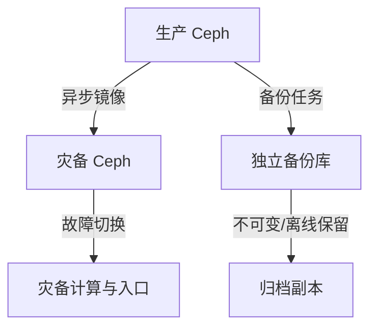
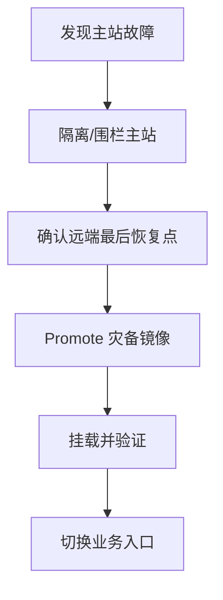
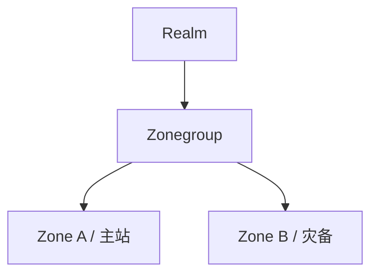

# Ceph 备份与灾难恢复：RPO/RTO、快照、镜像、异地容灾与恢复演练

《Ceph 从零基础到生产运维实战》第 24 篇

← [第 23 篇：Ceph 网络设计与故障排查](./23-Ceph网络设计与故障排查.md)

Ceph 的副本解决设备和节点故障，快照提供时间点，镜像提供异地副本，但这些能力都不能单独替代完整备份。本篇从威胁模型出发，分别设计 RBD、CephFS 和 RGW 的备份与灾难恢复方案。

## 1. 本文目标 {/* #本文目标 */}

读完后，你应该能够：

- 区分高可用、副本、纠删码、快照、镜像、备份和灾备
- 为不同业务定义 RPO 与 RTO
- 识别误删除、勒索软件、逻辑损坏和凭据泄露风险
- 判断 crash-consistent 与 application-consistent 的差异
- 设计 RBD 全量与增量备份链
- 理解 RBD journal-based 与 snapshot-based mirroring
- 使用 CephFS 快照镜像构建目录级异地副本
- 理解 RGW multisite 的复制与故障转移边界
- 备份 Ceph 配置、密钥和外部依赖
- 制定故障切换、回切和定期恢复演练 Runbook

:::caution 核心结论
没有经过恢复验证的「备份」只是一个希望。任何方案都必须明确恢复对象、恢复位置、恢复步骤、权限、依赖、RPO、RTO 和最近一次成功演练时间。
:::

## 2. 七个容易混淆的概念 {/* #七个容易混淆的概念 */}

| 能力 | 主要解决什么 | 能否抵御同集群误删除 | 能否独立于源集群恢复 |
| --- | --- | --- | --- |
| 多副本 | 盘/OSD/主机故障 | 否 | 否 |
| 纠删码 | 以更低空间开销容忍故障 | 否 | 否 |
| 快照 | 保存一个时间点 | 视权限与保留策略 | 通常否 |
| 镜像/复制 | 异步复制到另一站点 | 可能会复制删除/损坏 | 部分可以 |
| 备份 | 独立保留可恢复副本 | 是，取决于隔离 | 是 |
| 高可用 | 降低单点导致的中断 | 否 | 不一定 |
| 灾难恢复 | 大范围故障后恢复业务 | 取决于方案 | 是 |

最常见的危险误解是：

> 「我们有三副本，所以不需要备份。」

三副本会忠实保存同一个逻辑结果。用户删除对象、应用覆盖错误数据、管理员误删 Pool 时，副本不会替你保留旧数据。

## 3. 先从事故类型设计 {/* #先从事故类型设计 */}

### 3.1 物理故障 {/* #物理故障 */}

- 单盘
- 单 OSD
- 单主机
- 机架
- 机房断电或网络中断

### 3.2 逻辑故障 {/* #逻辑故障 */}

- 应用 bug 批量覆盖
- 数据库逻辑损坏
- 错误脚本删除文件或对象
- 管理员删除镜像、Pool、Bucket
- 错误生命周期策略

### 3.3 安全事件 {/* #安全事件 */}

- 客户端密钥泄露
- 勒索软件加密挂载的 CephFS/RBD
- S3 Access Key 泄露
- 管理员凭据被盗
- 备份系统同时被攻陷

### 3.4 区域灾难 {/* #区域灾难 */}

- 机房不可用
- 城市级网络中断
- 主站点长期断电
- 跨区域链路中断后发生双写

每类事故需要不同控制，不能用一个「异地有副本」覆盖全部风险。

## 4. RPO 与 RTO {/* #rpo-与-rto */}

### 4.1 RPO {/* #rpo */}

Recovery Point Objective：最多可以丢失多长时间的数据。

例如：

- RPO 24 小时：最多接受丢失一天数据
- RPO 15 分钟：需要至少每 15 分钟形成可恢复点
- RPO 接近 0：通常需要持续复制，并承担更高复杂度和成本

### 4.2 RTO {/* #rto */}

Recovery Time Objective：从事故发生到业务恢复最多允许多久。

RTO 包含：

- 发现和决策
- 调用人员
- 获取密钥
- 准备计算、网络、DNS 和负载均衡
- 恢复数据
- 一致性检查
- 应用启动和验收

只计算数据复制时间会严重低估 RTO。

### 4.3 用业务等级驱动成本 {/* #用业务等级驱动成本 */}

| 等级 | 示例 | 参考 RPO | 参考 RTO | 典型策略 |
| --- | --- | --- | --- | --- |
| 关键 | 交易、核心数据库 | 分钟级 | 小时级 | 持续镜像 + 独立备份 + 热/温备 |
| 重要 | 文档、虚拟机 | 小时级 | 数小时 | 周期快照 + 增量备份 + 异地副本 |
| 一般 | 可重建数据 | 天级 | 天级 | 周期全量或重新生成 |

表中只是示例，真正目标由业务影响分析确定。

## 5. 恢复点的两种一致性 {/* #恢复点的两种一致性 */}

### 5.1 Crash-consistent {/* #crash-consistent */}

类似突然断电时磁盘上的状态。文件系统或数据库可能通过 journal/WAL 恢复，但未提交事务、缓存和跨卷一致性未必满足业务要求。

### 5.2 Application-consistent {/* #application-consistent */}

在创建恢复点前协调应用：

- flush 数据
- 冻结文件系统
- 执行数据库 checkpoint
- 使用数据库原生备份
- 对多个卷执行一致性组流程

Ceph 快照很快，但不会自动理解 MySQL、PostgreSQL、Kubernetes 或虚拟机内的事务语义。

### 5.3 数据库优先用数据库能力 {/* #数据库优先用数据库能力 */}

对数据库，建议组合：

- 数据库原生全量备份
- binlog/WAL 归档
- Ceph 卷快照作为补充恢复点
- 异地、不可变的备份保留

只有块级快照时，往往只能保证 crash-consistent。

## 6. 3-2-1 是设计方向，不是机械数字 {/* #3-2-1-是设计方向不是机械数字 */}

常见原则：

- 至少 3 份数据
- 使用 2 类介质或独立系统
- 至少 1 份在异地

在 Ceph 场景中更重要的是「独立性」：

- 不同 Ceph 集群
- 不同管理员凭据
- 不同故障域/区域
- 备份账户不能删除源数据
- 生产账户不能删除备份
- 独立 KMS 和密钥恢复
- 保留不可变或离线副本

同一集群的三个副本不等于 3-2-1 的三份独立备份。

## 7. 总体架构 {/* #总体架构 */}



镜像用于快速恢复服务；独立备份用于回到历史版本和抵御逻辑/安全事故。二者解决的问题不同。

## 8. RBD 快照 {/* #rbd-快照 */}

创建前先确认对象：

```bash
rbd info <pool>/<image>
rbd snap ls <pool>/<image>
```

创建快照：

```bash
rbd snap create <pool>/<image>@<snapshot>
```

查看：

```bash
rbd snap ls <pool>/<image>
```

回滚会覆盖当前镜像状态，是破坏性操作：

```bash
rbd snap rollback <pool>/<image>@<snapshot>
```

生产恢复时更安全的方式通常是先 clone 或恢复到新镜像，验证后再切换，而不是直接覆盖原卷。

### 8.1 快照不是独立备份 {/* #快照不是独立备份 */}

RBD 快照：

- 与源镜像在同一集群
- 依赖相同 Pool 和 OSD
- 管理员或泄露凭据可能同时删除
- 集群级灾难时可能一起不可用

它适合快速本地恢复点，但还要 export 或复制到独立系统。

## 9. RBD 全量导出与恢复 {/* #rbd-全量导出与恢复 */}

导出到普通文件：

```bash
rbd export <pool>/<image> /backup/<image>.rbd
```

恢复为新镜像：

```bash
rbd import /backup/<image>.rbd <restore-pool>/<restore-image>
```

注意：

- 目标文件系统必须有足够空间
- 备份文件应校验哈希
- 文件权限和加密必须符合数据等级
- 传输过程应加密
- 恢复到隔离 Pool，完成验证后再切换

大镜像全量导出耗时和空间很大，因此通常需要增量链。

## 10. RBD 增量导出链 {/* #rbd-增量导出链 */}

首次创建基线快照：

```bash
rbd snap create <pool>/<image>@base
```

后续创建新快照：

```bash
rbd snap create <pool>/<image>@day-01
```

导出两个快照之间的差异：

```bash
rbd export-diff \
  --from-snap base \
  <pool>/<image>@day-01 \
  /backup/<image>-base-to-day-01.diff
```

下一周期：

```bash
rbd snap create <pool>/<image>@day-02
rbd export-diff \
  --from-snap day-01 \
  <pool>/<image>@day-02 \
  /backup/<image>-day-01-to-day-02.diff
```

恢复时必须按顺序应用：

1. 恢复全量基线
2. `import-diff` day-01
3. `import-diff` day-02
4. 校验最终快照和业务

示例：

```bash
rbd import-diff /backup/<diff-file> <restore-pool>/<restore-image>
```

### 10.1 增量链风险 {/* #增量链风险 */}

- 中间任一 diff 丢失，后续链可能无法使用
- 快照被提前删除会影响下一次生成
- 文件存在不代表可读
- 恢复顺序错误会失败
- 长链会增加 RTO 和运维复杂度

建议周期性生成新的全量基线，控制链长度，并定期做完整恢复。

## 11. 备份清单与校验 {/* #备份清单与校验 */}

每份 RBD 备份至少记录：

- 集群和 Pool
- 镜像 ID 与名称
- 源快照
- 备份类型（full/diff）
- 上一恢复点
- 创建开始/结束时间
- 文件大小与哈希
- Ceph 版本
- 加密和 KMS 信息
- 保留到期日
- 最近恢复验证结果

清单文件本身也需要备份和防篡改。

## 12. RBD Mirroring 两种模式 {/* #rbd-mirroring-两种模式 */}

RBD 镜像在两个 Ceph 集群之间异步复制镜像。

### 12.1 Journal-based {/* #journal-based */}

- 每次写入先进入 RBD journal
- 远端 rbd-mirror 拉取并重放
- 提供细粒度、crash-consistent 复制
- 每次业务写会增加额外 journal 写入，写延迟和资源消耗明显增加

官方文档提示，启用 journaling 后每次写会导致两次集群写入，写延迟可能接近翻倍。必须用实际业务压测。

### 12.2 Snapshot-based {/* #snapshot-based */}

- 由计划或手工 mirror snapshot 驱动
- 远端复制两个快照间的差异
- fast-diff 可帮助快速识别变化块
- 粒度由快照周期决定
- 故障切换前未完整同步的差异不会成为完整恢复点

### 12.3 选择 {/* #选择 */}

| 维度 | Journal-based | Snapshot-based |
| --- | --- | --- |
| RPO 潜力 | 更低 | 取决于快照周期 |
| 源端写开销 | 较高 | 通常较低 |
| 复制粒度 | 每次 journal 更新 | 快照间 delta |
| 运维重点 | journal 与 replay 延迟 | 快照计划和完整同步 |

## 13. RBD Mirroring 基本配置思路 {/* #rbd-mirroring-基本配置思路 */}

镜像按 Pool 配置。两端启用：

```bash
rbd --cluster <site-a> mirror pool enable \
  --site-name <site-a-name> <pool> image

rbd --cluster <site-b> mirror pool enable \
  --site-name <site-b-name> <pool> image
```

常见模式：

- `image`：逐镜像显式启用
- `pool`：符合条件的镜像按 Pool 镜像
- `init-only`：仅初始化 Pool 镜像配置，不自动选择默认 namespace 镜像

生产中通常优先显式选择关键镜像，避免无意复制大量测试卷。

使用 bootstrap token 建立 peer 时，token 内含连接和认证敏感信息，应通过安全渠道传输，不要写入工单或普通 Git。

一端创建 token：

```bash
rbd --cluster <site-a> mirror pool peer bootstrap create \
  --site-name <site-a-name> <pool> > /secure/path/token
```

另一端导入：

```bash
rbd --cluster <site-b> mirror pool peer bootstrap import \
  --site-name <site-b-name> \
  --direction rx-only \
  <pool> /secure/path/token
```

具体单向/双向设计、cephadm rbd-mirror 服务部署和版本参数，应按对应版本文档执行。

## 14. RBD 镜像状态 {/* #rbd-镜像状态 */}

常用检查：

```bash
rbd mirror pool info <pool> --all
rbd mirror pool status <pool> --verbose
rbd mirror image status <pool>/<image>
ceph orch ps --daemon-type rbd-mirror --refresh
```

持续监控：

- image health
- last update
- replay lag
- peer 连接
- mirror daemon 状态
- 跨站点带宽和延迟
- 远端容量

「镜像服务进程正在运行」不代表每个镜像都已同步。

## 15. RBD 故障切换原则 {/* #rbd-故障切换原则 */}

计划切换：

1. 停止或冻结源端应用写入
2. 等待镜像追平
3. 验证目标镜像一致状态
4. demote 源端
5. promote 目标端
6. 连接灾备计算
7. 执行业务一致性检查
8. 开放业务入口

灾难切换无法保证源端正常 demote，可能需要强制 promote。此时必须先进行 fencing，确保源站点不能继续写入，否则会形成两个 primary 和数据分叉。



镜像具体 promote/demote/resync 命令具有破坏性，必须依据现场状态和当前版本 Runbook 执行，不应只凭文章复制。

## 16. CephFS 快照 {/* #cephfs-快照 */}

CephFS 快照通常通过快照目录创建，具体名称可配置。示意：

```bash
mkdir <cephfs-mount>/<dir>/.snap/<snapshot-name>
```

它适合：

- 用户误删快速恢复
- 形成一致时间点
- 为快照镜像提供源恢复点

但它仍在原 CephFS 中，不能替代独立备份。

对大量目录创建高频快照会增加元数据和保留管理压力，应结合 MDS、目录规模和删除周期测试。

## 17. CephFS Snapshot Mirroring {/* #cephfs-snapshot-mirroring */}

CephFS 快照镜像异步复制指定目录的快照到另一个 CephFS。

配置思路：

1. 在目标集群准备独立 CephFS 和最小权限实体
2. 在目标端创建 bootstrap token
3. 在源端导入 peer
4. 将需要复制的绝对目录加入镜像
5. 持续创建目录快照
6. 监控每个目录的同步状态

目标端创建 token：

```bash
ceph fs snapshot mirror peer_bootstrap create \
  <target-fs> <client-entity> <site-name>
```

源端导入：

```bash
ceph fs snapshot mirror peer_bootstrap import \
  <source-fs> '<token>'
```

将目录加入镜像：

```bash
ceph fs snapshot mirror add <source-fs> /<absolute-path>
```

列出：

```bash
ceph fs snapshot mirror ls <source-fs>
ceph fs snapshot mirror peer_list <source-fs>
```

注意：

- 路径从 CephFS 根目录计算，不是主机挂载点
- 只接受绝对路径
- 已跟踪目录的祖先/子目录不能重复加入
- 当前版本的 peer 数量和能力限制必须查官方文档

## 18. CephFS 镜像状态 {/* #cephfs-镜像状态 */}

守护进程：

```bash
ceph fs snapshot mirror daemon status
```

每个目录的集群级同步状态：

```bash
ceph fs snapshot mirror status <fs-name>
ceph fs snapshot mirror status <fs-name> /<path>
```

重点看：

- idle、syncing、stale 等状态
- last synced snapshot
- failure reason
- 最近指标更新时间
- 目录是否持续失败
- 目标容量与 MDS 状态

镜像只会复制满足机制要求的快照。没有持续创建快照，就不会自然产生新的恢复点。

## 19. CephFS 的独立备份 {/* #cephfs-的独立备份 */}

对关键文件数据，除快照镜像外还可采用：

- 备份软件通过挂载点读取
- 文件级增量与去重
- 将备份写入独立对象库或磁带
- 应用原生导出
- 定期离线归档

需要验证：

- UID/GID
- mode、ACL、xattr
- 硬链接、软链接
- 稀疏文件
- 特殊文件
- 文件名编码
- 大目录性能
- 恢复后的配额和布局

只验证「文件内容能复制」还不够。

## 20. RGW 版本控制和生命周期 {/* #rgw-版本控制和生命周期 */}

对 S3 Bucket，可考虑：

- Bucket versioning
- 生命周期管理旧版本
- MFA Delete（取决于实现与客户端能力）
- Object Lock/WORM（取决于版本和合规设计）
- 跨账户备份
- 独立归档 Bucket

Versioning 能帮助恢复覆盖和删除，但：

- 有权限的攻击者可能删除版本
- 生命周期配置错误可能批量过期
- Bucket 和元数据仍依赖同一集群
- 成本和容量会持续增长

因此仍需独立备份或异地不可变保留。

## 21. RGW Multisite {/* #rgw-multisite */}

RGW multisite 使用 realm、zonegroup 和 zone 构建异步多站点复制。



它适合：

- 异地对象副本
- 读就近
- 主 zone 故障时切换
- 多区域对象服务

它不是自动备份，因为：

- 合法删除可能复制到其他 zone
- 错误对象和勒索加密对象也会复制
- realm/period 配置错误可能影响全局
- 共享管理员凭据扩大爆炸半径
- 复制存在延迟

## 22. RGW Multisite 状态与切换 {/* #rgw-multisite-状态与切换 */}

日常检查可包括：

```bash
radosgw-admin realm list
radosgw-admin zonegroup list
radosgw-admin zone list
radosgw-admin sync status
```

持续观察：

- metadata sync
- data sync
- shard 错误
- lag
- 目标 zone 容量
- 跨站点网络
- RGW 请求错误率

灾难切换通常涉及把辅助 zone 设为 master/default，并提交新的 period：

```bash
radosgw-admin zone modify --rgw-zone=<zone> --master --default
radosgw-admin period update --commit
```

随后还要按 cephadm 部署方式重启或重新配置 RGW、更新 DNS/负载均衡和验证业务。

这些命令会改变 multisite 控制面。切换前必须：

- 围栏旧主站
- 保存 realm/period 配置
- 确认最后同步点
- 明确未同步数据风险
- 按当前版本官方灾备步骤执行

不要同时让两个站点以冲突主角色接受写入。

## 23. Ceph 集群配置也必须备份 {/* #ceph-集群配置也必须备份 */}

数据可用并不代表能快速重建服务。应安全保存：

- FSID
- `ceph.conf` 或生成配置
- cephadm SSH 公钥和部署信息
- `ceph orch ls --export` 的服务规格
- 主机清单与标签
- CRUSH map 的文本和二进制备份
- Pool、应用标签、配额和 PG 参数
- CephFS、MDS、subvolume 和配额设计
- RGW realm/zonegroup/zone/period 配置
- Dashboard、监控和告警配置
- 外部 DNS、LB、证书和 KMS 依赖
- 自动化代码和版本
- 密钥清单与恢复流程

示例只读/导出命令：

```bash
ceph fsid
ceph config dump
ceph orch ls --export
ceph osd getcrushmap -o crushmap.bin
ceph osd crush dump -f json-pretty
ceph osd pool ls detail
```

输出可能含敏感信息或内部拓扑，应加密、限制访问并设置保留策略。

## 24. 密钥与 KMS 的灾备 {/* #密钥与-kms-的灾备 */}

如果数据已加密，而密钥丢失，完好的数据副本也无法恢复。

应单独设计：

- CephX keyring 恢复
- LUKS/OSD 加密密钥
- RBD 客户端加密密钥
- RGW SSE/KMS 密钥
- TLS 私钥和 CA 链
- 备份库加密密钥
- KMS 自身备份和异地可用性
- break-glass 访问

密钥备份应与数据备份分离保存，但恢复时可在受控流程中重新关联。不要把明文密钥放进普通代码仓库或文章命令历史。

## 25. 网络、DNS 与计算资源 {/* #网络dns-与计算资源 */}

灾备不只是存储。还需要：

- 灾备客户端或计算集群
- VLAN、路由和防火墙
- DNS TTL 与切换权限
- 负载均衡器
- 证书
- 身份认证
- 镜像仓库
- 监控和日志
- 数据库/消息队列的启动顺序

如果灾备 Ceph 有数据，但没有能访问它的计算环境，RTO 仍然无法满足。

## 26. 故障转移中的 fencing {/* #故障转移中的-fencing */}

Fencing 的目标是确保旧主站不能继续写。

方式可能包括：

- 关闭旧站点计算
- 禁用旧站点客户端凭据
- 隔离网络
- 从负载均衡移除
- 撤销写权限
- 电源围栏

选择何种方式取决于架构，但原则相同：在提升灾备副本为新主之前，必须避免双主写入。

网络不可达不等于旧站点已经停止。它可能仍在隔离网络内接受本地写入。

## 27. 故障切换 Runbook {/* #故障切换-runbook */}

### 27.1 阶段 A：宣布事故 {/* #阶段-a宣布事故 */}

- 确认事故等级
- 冻结非必要变更
- 建立统一时间线
- 指定决策人和记录人

### 27.2 阶段 B：判断源站状态 {/* #阶段-b判断源站状态 */}

- 源集群是否完全不可达？
- 是否仍有业务写入？
- 最后成功复制时间？
- 数据损坏还是基础设施中断？

### 27.3 阶段 C：围栏 {/* #阶段-c围栏 */}

- 阻止旧客户端写入
- 隔离旧主站
- 保存执行证据

### 27.4 阶段 D：选择恢复点 {/* #阶段-d选择恢复点 */}

- 最新镜像点是否健康？
- 是否需要回退到更早备份？
- RPO 损失是多少？
- 是否包含已知逻辑损坏？

### 27.5 阶段 E：提升与挂载 {/* #阶段-e提升与挂载 */}

- 按 RBD/CephFS/RGW 专项步骤提升
- 使用隔离客户端先挂载
- 检查文件系统/数据库/对象一致性

### 27.6 阶段 F：应用启动 {/* #阶段-f应用启动 */}

- 按依赖顺序启动
- 执行读写探针
- 更新 DNS/LB
- 逐步放量

### 27.7 阶段 G：观察 {/* #阶段-g观察 */}

- 错误率、延迟、容量
- 数据差异
- 复制状态
- 安全告警

## 28. 回切比切换更难 {/* #回切比切换更难 */}

灾备站点已经产生新写入后，恢复原站不能简单反向连接。

回切前回答：

- 原站数据是否应丢弃并从新主重同步？
- 两边是否发生分叉？
- 新主的所有写入是否已复制回去？
- 谁是权威数据源？
- 是否需要再次停写？
- DNS/LB 何时切回？

推荐把回切当作新的计划变更：

1. 修复并验证原站
2. 以当前新主为权威源重建复制
3. 等待追平
4. 计划停写
5. 完成角色切换
6. 业务验证
7. 恢复正常复制拓扑

## 29. 恢复演练的层次 {/* #恢复演练的层次 */}

### 29.1 文件/对象级 {/* #文件对象级 */}

- 恢复一个文件
- 恢复一个 RBD 镜像到新名称
- 恢复一个对象的旧版本

### 29.2 应用级 {/* #应用级 */}

- 恢复数据库和日志
- 启动应用
- 执行业务一致性检查

### 29.3 集群/站点级 {/* #集群站点级 */}

- 模拟主站不可用
- 执行 fencing
- 提升灾备
- 切换网络入口
- 测量实际 RPO/RTO

### 29.4 安全事件级 {/* #安全事件级 */}

- 假设生产管理员凭据泄露
- 确认攻击者不能删除不可变备份
- 使用 break-glass 账户恢复
- 轮换密钥后重新上线

演练必须记录实际耗时和失败步骤，并更新 Runbook。

## 30. 备份监控指标 {/* #备份监控指标 */}

至少包括：

- 最近成功备份时间
- 备份持续时长
- 备份文件大小变化
- 哈希校验结果
- 全量/增量链完整性
- 目标容量和增长率
- RBD mirror image health/lag
- CephFS mirror per-directory state
- RGW metadata/data sync lag
- 最近恢复演练时间和结果
- 备份凭据/证书到期时间

「任务退出码为 0」不是唯一成功标准，还要验证产物和可恢复性。

## 31. 常见失败模式 {/* #常见失败模式 */}

### 31.1 所有副本都在同一个管理员域 {/* #所有副本都在同一个管理员域 */}

一个泄露的 admin key 可以同时删除生产、快照和镜像。

### 31.2 只做增量，从不做新全量 {/* #只做增量从不做新全量 */}

链越来越长，恢复时间和失败概率上升。

### 31.3 镜像一直运行，所以默认追平 {/* #镜像一直运行所以默认追平 */}

单个镜像、目录或 shard 可能早已失败。

### 31.4 只恢复数据，不恢复依赖 {/* #只恢复数据不恢复依赖 */}

缺少 DNS、证书、KMS、计算、网络或应用配置，业务仍不能启动。

### 31.5 从不演练强制切换 {/* #从不演练强制切换 */}

真正事故时才第一次处理 fencing、promote 和回切，风险最高。

### 31.6 把备份密钥和数据放在同一位置 {/* #把备份密钥和数据放在同一位置 */}

一个故障或攻击即可同时摧毁两者。

## 32. 生产设计检查清单 {/* #生产设计检查清单 */}

### 32.1 业务目标 {/* #业务目标 */}

- 每类业务有明确 RPO
- 每类业务有明确 RTO
- 明确 crash-consistent 或 application-consistent
- 定义保留周期和合规要求

### 32.2 数据保护 {/* #数据保护 */}

- 副本/EC 不被当作备份
- 快照有保留和清理策略
- 有独立备份系统
- 至少一份异地
- 关键备份不可变或离线
- 生产与备份管理权限隔离

### 32.3 RBD/CephFS/RGW {/* #rbdcephfsrgw */}

- RBD 全量与增量链可验证
- RBD mirror 每镜像有状态监控
- CephFS 每目录镜像有状态监控
- RGW metadata/data sync 有监控
- 删除和逻辑损坏不会只依靠镜像防护

### 32.4 恢复能力 {/* #恢复能力 */}

- 配置、CRUSH、service spec 已备份
- KMS 和密钥有独立灾备
- 灾备网络/计算/DNS/LB 已准备
- fencing 方式经过验证
- 回切 Runbook 已编写
- 定期完整恢复演练
- 实测 RPO/RTO 满足目标

## 33. 本文小结 {/* #本文小结 */}

Ceph 数据保护必须建立多层防线：

- 副本和纠删码保护硬件故障
- 快照提供本地快速恢复点
- RBD、CephFS、RGW 镜像提供异地服务恢复能力
- 独立、隔离、不可变的备份抵御误删除、逻辑损坏和攻击
- 配置、密钥、KMS、网络和计算同样属于灾备范围
- 故障切换前必须 fencing，回切必须重新确认权威数据源
- 只有成功完成恢复演练，才能证明 RPO/RTO

下一篇将讲解 Ceph 安全加固，包括 CephX 最小权限、msgr2 secure、网络隔离、OSD 静态加密与密钥治理。

→ [第 25 篇：Ceph 安全加固实战](./25-Ceph安全加固.md)

## 34. 课后练习 {/* #课后练习 */}

1. 为什么三副本不是三份独立备份？
2. RPO 和 RTO 分别度量什么？
3. crash-consistent 与 application-consistent 的差异是什么？
4. RBD 增量链缺少中间文件会怎样？
5. journal-based 与 snapshot-based mirroring 如何选择？
6. 为什么镜像会复制逻辑损坏？
7. CephFS 镜像目录路径为什么不是主机挂载路径？
8. RGW multisite 为什么仍需要独立备份？
9. 灾难 promote 前为什么必须 fencing？
10. 哪些非数据依赖会影响实际 RTO？

### 34.1 参考答案 {/* #参考答案 */}

1. 三副本实时维护同一逻辑状态，删除、覆盖、勒索或控制面误操作会同步影响全部副本；它没有独立历史、隔离账号和离线恢复能力。
2. RPO是事故时最多可接受丢失多长时间范围的数据；RTO是从事故发生到业务恢复到约定状态允许耗费的时间。
3. Crash-consistent只保证存储在某个断电式时间点可恢复，应用日志可能要重放；Application-consistent在快照前协调应用事务、Flush和Freeze，使跨文件/卷状态满足应用一致性。
4. 增量文件依赖前一个基线/增量的变化链，缺少中间段就无法正确重放到后续时间点；必须保护链元数据并定期合成新全量基线。
5. Journal-based按写入日志复制，RPO低但持续开销和版本约束更强；Snapshot-based按快照差异周期复制，管理简单但RPO取决于周期。按RPO、带宽、故障切换和版本支持选择。
6. 镜像忠实复制源端逻辑写入，应用写坏、误删、勒索加密也会被同步到灾备端；因此仍需不可变历史备份和延迟/隔离策略。
7. CephFS Mirror配置的是CephFS命名空间内目录路径，例如`/volumes/...`，不是某台客户端的`/mnt/cephfs/...`挂载点；两者根目录语义不同。
8. Multisite提供跨Zone异步副本和服务连续性，但逻辑删除/权限错误可能复制，且不能替代历史保留、不可变副本和独立恢复演练。
9. 必须先隔离旧主站写入和客户端，避免两边同时成为Primary产生Split-Brain；Fencing完成后再Promote并开放流量。
10. DNS/VIP/证书、认证密钥、KMS、网络路由、防火墙、应用配置、Kubernetes对象、镜像、运行脚本、人员权限和恢复决策时间都会延长实际RTO，必须纳入演练。

## 35. 官方资料 {/* #官方资料 */}

- [RBD 快照](https://docs.ceph.com/en/latest/rbd/rbd-snapshot/)
- [RBD Mirroring](https://docs.ceph.com/en/latest/rbd/rbd-mirroring/)
- [CephFS Snapshot Mirroring](https://docs.ceph.com/en/latest/cephfs/cephfs-mirroring/)
- [RGW Multisite](https://docs.ceph.com/en/latest/radosgw/multisite/)
- [rbd 命令手册](https://docs.ceph.com/en/latest/man/8/rbd/)
