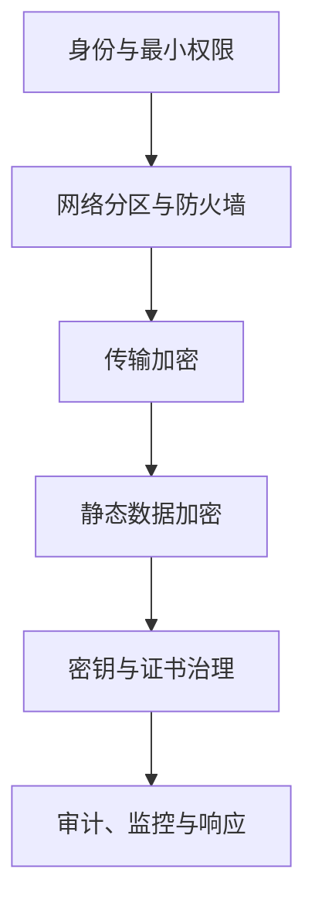

# Ceph 安全加固实战：CephX、最小权限、传输加密、静态加密与密钥治理

《Ceph 从零基础到生产运维实战》第 25 篇

← [第 24 篇：Ceph 备份与灾难恢复](./24-备份与灾难恢复.md)

Ceph 安全不是「开启 CephX」就结束了：身份、权限、网络、链路、磁盘、密钥、Dashboard、cephadm、监控和审计共同构成防线。本篇给出一套从盘点到整改再到事件响应的生产加固方法。

## 1. 本文目标 {/* #本文目标 */}

读完后，你应该能够：

- 解释 CephX 认证和 capabilities 授权
- 区分 Ceph 存储集群用户、CephFS POSIX 用户和 RGW S3 用户
- 为 RBD、CephFS 和运维账号设计最小权限
- 安全查看、创建、修改和撤销 CephX 实体
- 理解 msgr2 crc 与 secure 模式
- 正确规划网络分区和防火墙
- 为新 OSD 启用 LUKS 静态加密
- 建立密钥、证书和 KMS 的全生命周期治理
- 加固 Dashboard、监控栈、容器仓库和 cephadm SSH 管理面
- 处理密钥泄露和高权限账号滥用事件

:::caution 风险提示
`ceph auth caps` 会覆盖该实体当前 capabilities，遗漏某项会直接中断业务；`ceph auth del` 会撤销实体；强制 msgr2 secure 或修改网络规则可能断开旧客户端。生产修改必须先导出当前状态、验证客户端兼容性并准备回滚。
:::

## 2. 先建立威胁模型 {/* #先建立威胁模型 */}

至少考虑以下攻击者：

- 获得业务服务器权限的攻击者
- 获得普通 Ceph 客户端 keyring 的攻击者
- 获得 `client.admin` 的攻击者
- 能监听存储网络的人
- 能接触退役磁盘的人
- 获得 Dashboard、监控或容器仓库凭据的人
- 内部误操作或恶意管理员
- 攻陷生产后试图删除备份的人

安全设计必须回答：

- 他能认证成谁？
- 他能访问哪些 Pool、namespace、目录、Bucket？
- 流量是否可被监听或篡改？
- 磁盘离线后数据是否可读？
- 他能否获取或删除密钥？
- 是否有审计证据？
- 能否同时摧毁生产和备份？

## 3. 分层防御模型 {/* #分层防御模型 */}



任何单层都不能替代其他层：

- CephX 不会自动加密磁盘
- LUKS 不会限制在线客户端权限
- 防火墙不替代最小权限
- 传输加密不阻止合法但过度授权的用户删除数据

## 4. Ceph 中有三套常被混淆的用户 {/* #ceph-中有三套常被混淆的用户 */}

### 4.1 Ceph 存储集群用户 {/* #ceph-存储集群用户 */}

形如：

- `client.admin`
- `client.rbd-app`
- `client.cephfs-app`

由 CephX 认证，并通过 MON/MGR/OSD/MDS caps 授权。

### 4.2 CephFS 文件用户 {/* #cephfs-文件用户 */}

CephFS 仍使用 POSIX UID/GID、mode、ACL 等文件权限。CephX caps 限制客户端能挂载哪里、能否读写；挂载后文件访问还受到 POSIX 语义约束。

### 4.3 RGW S3 用户 {/* #rgw-s3-用户 */}

S3 用户和 Access Key/Secret Key 由 RGW 管理。RGW 守护进程本身使用 CephX 实体访问底层 RADOS，但终端 S3 用户不是 `client.*` CephX 用户。

这三者不能互相替代。

## 5. CephX 解决什么 {/* #cephx-解决什么 */}

CephX 提供：

- 客户端和守护进程身份认证
- 会话密钥和票据
- 通过 capabilities 授权访问 MON、MGR、OSD、MDS
- 对 Pool、namespace、网络来源等范围做限制

CephX 默认启用。不要关闭：

```ini
auth_cluster_required = none
auth_service_required = none
auth_client_required = none
```

这类配置会破坏认证边界，不应出现在生产方案中。

CephX 本身并不等于所有业务数据都已传输加密；链路机密性由 msgr2 secure 等机制提供。

## 6. capabilities 基本语义 {/* #capabilities-基本语义 */}

常见权限：

| 标记 | 含义 |
| --- | --- |
| `r` | 读取 |
| `w` | 写入 |
| `x` | 执行 class method/相关操作 |
| `*` / `all` | 全权限，谨慎使用 |

一般形式：

```text
<daemon-type> '<cap-spec>'
```

OSD caps 可限制：

- Pool
- namespace
- object prefix
- application tag
- 来源网络

MON/MGR caps 也可使用 profile 或更精确的命令/服务限制。

## 7. 盘点现有实体 {/* #盘点现有实体 */}

列出全部认证实体：

```bash
ceph auth ls
```

这会显示密钥，输出属于敏感信息，不要直接粘贴到工单或聊天。

查看单个实体：

```bash
ceph auth get client.<name>
```

建议建立不暴露密钥的权限清单，至少记录：

- entity
- 负责人和业务
- caps 摘要
- 分发到哪些主机
- 创建/最近轮换时间
- 到期或复核日期
- 是否仍被使用
- 泄露后的吊销流程

## 8. 最小权限原则 {/* #最小权限原则 */}

### 8.1 每个应用独立实体 {/* #每个应用独立实体 */}

不要让所有业务共享 `client.admin`，也不要让多个环境共享同一个客户端密钥。

推荐至少按以下边界拆分：

- 生产/测试
- 业务系统
- 只读/读写
- Pool 或 namespace
- 人员/自动化
- 备份/恢复

这样才能：

- 快速撤销单个业务
- 降低泄露影响
- 做使用追踪
- 独立轮换

### 8.2 默认拒绝跨 Pool {/* #默认拒绝跨-pool */}

官方文档明确提醒：OSD caps 如果没有限制到合适的 Pool，可能访问所有 Pool。每个业务账号都应检查是否有不必要的 `allow *` 或未限定 Pool 的权限。

## 9. RBD 最小权限示例 {/* #rbd-最小权限示例 */}

对 `volumes` Pool 创建 RBD 客户端，可使用 profile：

```bash
ceph auth get-or-create client.rbd-app \
  mon 'profile rbd' \
  osd 'profile rbd pool=volumes' \
  mgr 'profile rbd pool=volumes' \
  -o /secure/path/ceph.client.rbd-app.keyring
```

注意：

- profile 是否需要 MGR caps 取决于操作和版本
- 只读消费者可研究 `profile rbd-read-only`
- 对多 Pool 访问要逐项写清
- keyring 路径必须受控

创建后验证：

```bash
ceph auth get client.rbd-app
```

再使用该身份做正向和反向测试：

- 应能访问授权 Pool
- 不应访问其他 Pool
- 不应执行集群管理命令

只有正向测试是不完整的最小权限验证。

## 10. CephFS 最小权限示例 {/* #cephfs-最小权限示例 */}

CephFS 客户端通常需要 MON、MDS 和 OSD caps。路径限制示意：

```bash
ceph fs authorize <fs-name> client.cephfs-app \
  /app-data rw
```

查看结果：

```bash
ceph auth get client.cephfs-app
```

验证：

- 能挂载目标文件系统
- 能访问 `/app-data`
- 不能越过授权路径
- POSIX UID/GID 和 ACL 仍按预期生效
- snapshot、quota 等额外能力没有被无意授予

CephFS caps 的语法和功能随版本演进，应以所用版本的 Client Capabilities 文档为准。

## 11. 只读运维与自动化账号 {/* #只读运维与自动化账号 */}

监控或审计通常不需要 `client.admin`。应根据所需命令创建只读或 profile 账号。

设计步骤：

1. 列出自动化实际调用的 Ceph 命令
2. 从最小 profile/command caps 开始
3. 在测试环境验证
4. 记录拒绝日志
5. 只增加必要权限
6. 设置负责人和复核周期

不要因为权限调试麻烦就永久授予 `allow *`。

## 12. 修改 caps 的高风险点 {/* #修改-caps-的高风险点 */}

查看原状态并导出：

```bash
ceph auth get client.<name> -o /secure/path/client-name.before.keyring
```

修改示意：

```bash
ceph auth caps client.<name> \
  mon 'allow r' \
  osd 'allow rw pool=<pool>'
```

`ceph auth caps` 会用新内容覆盖已有 caps。必须把需要保留的 MON、MGR、MDS、OSD caps 全部写入。

生产流程：

1. 导出原实体
2. 四眼复核新 caps
3. 在同能力测试账号验证
4. 修改
5. 正向/反向业务测试
6. 失败时从受控文件恢复原 caps
7. 删除临时敏感文件

不要对 `client.admin` 试验 caps。遗漏能力可能让管理员账号失效。

## 13. 删除实体 {/* #删除实体 */}

命令：

```bash
ceph auth del client.<name>
```

删除前必须确认：

- 哪些主机仍在使用
- 是否有长连接
- 是否属于镜像、备份、RGW 或 CSI
- 是否已有替代凭据
- 回滚如何恢复 key 和 caps
- 审批和审计是否完整

仅从服务器删除 keyring 文件不会撤销集群中的密钥；仅从 Ceph 删除实体也不会清理所有泄露副本。两端都要处理。

## 14. Keyring 文件安全 {/* #keyring-文件安全 */}

推荐：

- 每个应用独立 keyring
- 最小文件所有者和权限
- 常见情况下 `chmod 600`
- 不放在 Web 根目录、共享目录和容器镜像层
- 不写入普通 Git
- 不通过命令行参数直接传 secret
- 不在 CI 日志输出
- 临时文件安全删除或使用受控 secret store

检查：

```bash
stat /etc/ceph/ceph.client.<name>.keyring
```

注意容器编排器可能把 Secret 复制到多节点，应把实际分发范围纳入盘点。

## 15. 密钥轮换策略 {/* #密钥轮换策略 */}

轮换目标：

- 定期缩短泄露窗口
- 人员离职或服务下线
- 主机入侵
- 日志/工单意外暴露
- 加密或算法策略升级

CephX 单个 entity 在某一时刻通常只有一个有效 key。安全轮换可采用「新实体过渡」：

1. 创建 `client.app-v2`，复制并收紧 caps
2. 安全分发新 keyring
3. 分批让客户端改用新实体
4. 观察旧实体连接是否消失
5. 完成业务验证
6. 撤销 `client.app-v1`
7. 清理旧 keyring 副本

这种方式比直接覆盖一个共享 key 更容易回滚，也能实现灰度迁移。

紧急泄露时安全性优先，可能必须立即撤销并接受受控业务中断。

## 16. msgr2 与链路安全 {/* #msgr2-与链路安全 */}

Messenger v2 默认使用：

- TCP 3300 连接 MON
- 可与 legacy v1 6789 并存
- 支持 crc 和 secure 两类连接模式

### 16.1 crc 模式 {/* #crc-模式 */}

提供：

- 基于 CephX 的初始强认证
- CRC32C 检测随机比特错误

不提供完整的数据机密性，也不能抵御能修改并重新计算 CRC 的主动中间人。

### 16.2 secure 模式 {/* #secure-模式 */}

提供：

- 强认证
- 认证后全部流量加密
- 密码学完整性保护

### 16.3 默认值不等于强制加密 {/* #默认值不等于强制加密 */}

常见默认 `ms_cluster_mode`、`ms_service_mode` 和 `ms_client_mode` 为：

```text
crc secure
```

列表前面的模式优先，因此这表示兼容两种模式并优先 crc，而不是「已经强制 secure」。MON 专用默认顺序在新版本中可能不同。

查看：

```bash
ceph config get global ms_cluster_mode
ceph config get global ms_service_mode
ceph config get global ms_client_mode
```

这些配置通常不是 runtime updatable。强制切换前要验证所有守护进程、内核客户端、librbd、CephFS、RGW、CSI 和第三方客户端。

## 17. 向 msgr2 secure 迁移 {/* #向-msgr2-secure-迁移 */}

推荐分阶段：

1. 盘点所有客户端版本
2. 确认 MON 已公布 v2 地址
3. 在测试环境启用并抓取性能基线
4. 对一组非关键客户端验证 secure
5. 观察 CPU、延迟、吞吐和连接错误
6. 逐业务迁移
7. 最后根据安全策略决定是否拒绝 crc/v1
8. 保留明确回滚方案

查看 MON 地址：

```bash
ceph mon dump
```

旧集群向 v2 迁移时可能使用：

```bash
ceph mon enable-msgr2
```

该命令的适用版本和前置条件必须查对应版本文档。不要为了「更安全」一次性让所有旧客户端断开。

## 18. 网络分区与防火墙 {/* #网络分区与防火墙 */}

至少区分：

- 管理网络
- Ceph Public Network
- 可选 Cluster Network
- RGW/Dashboard/监控入口网络
- 备份/跨站点复制网络

规则原则：

- 按源、目的、端口和方向最小开放
- MON 3300/6789 仅对需要的 Ceph 节点和客户端开放
- OSD/MGR/MDS 动态端口范围 6800–7568 只在所需网段开放
- Dashboard、Prometheus、Grafana 不直接暴露公网
- RGW 外部入口与后端 Ceph 网络分离
- 管理 SSH 通过堡垒机、MFA 和审计
- 不通过清空防火墙做排障

网络分区不能替代 msgr2 secure，但可以减少暴露面和横向移动。

## 19. OSD 静态加密 {/* #osd-静态加密 */}

cephadm OSD spec 可为新 OSD 启用加密：

```yaml
service_type: osd
service_id: encrypted_hdd
placement:
  host_pattern: 'ceph*'
spec:
  data_devices:
    rotational: 1
  encrypted: true
```

提交前必须预览设备选择，避免匹配系统盘或预留盘。

加密通常由 LUKS/ceph-volume 实现，主要保护：

- 磁盘被拔走
- 退役盘未完全擦除
- 离线读取块设备

它不能阻止已认证的在线客户端读取数据，也不能防止拥有运行中主机 root 权限的攻击者访问已解锁设备。

### 19.1 现有 OSD 不是原地开关 {/* #现有-osd-不是原地开关 */}

`encrypted: true` 影响新建 OSD。已有未加密 OSD 通常需要按换盘/迁移流程重建为加密 OSD，涉及数据回填、容量和故障域风险。

不要期待修改 spec 后旧盘自动安全加密。

## 20. TPM2 与版本条件 {/* #tpm2-与版本条件 */}

新版本 Ceph 支持在特定条件下为 LUKS2 OSD 使用 TPM2 token，例如 OSD spec 中：

```yaml
spec:
  data_devices:
    all: true
  encrypted: true
  tpm2: true
```

这需要：

- 对应 Ceph 版本支持
- 主机 TPM2 和操作系统工具支持
- 明确主板更换、TPM 清除和灾备恢复流程
- 不把 TPM 当作密钥备份

硬件更换时若没有恢复设计，加密可能把硬件故障变成数据不可访问事故。

## 21. RBD 客户端侧加密 {/* #rbd-客户端侧加密 */}

RBD 可在客户端层使用 LUKS 或 RBD encryption 能力实现卷级加密。优势是：

- Ceph 只看到密文
- 不同租户可使用独立密钥
- 存储管理员与数据密钥可以职责分离

代价：

- 密钥丢失即无法恢复
- 快照、克隆和镜像的恢复流程更复杂
- KMS 可用性影响挂载
- 需要验证性能和 discard/trim 行为
- 备份必须包含正确的密钥元数据和恢复步骤

对数据库或虚拟机，还要考虑 guest 内部加密与宿主机层加密的边界。

## 22. RGW 数据加密 {/* #rgw-数据加密 */}

RGW 可根据版本和部署使用服务端加密、SSE-C 或外部 KMS 等能力。设计时区分：

- HTTPS：客户端到 RGW 的传输加密
- msgr2 secure：RGW 到 Ceph 集群的传输加密
- SSE：对象静态内容加密
- OSD LUKS：磁盘离线保护
- 客户端预加密：对象在上传前已是密文

它们位于不同层，不能互相替代。

KMS 设计应包括：

- 高可用
- TLS 和身份认证
- 最小权限
- key version
- rotation
- 审计
- 异地恢复
- 删除保护

## 23. Dashboard 加固 {/* #dashboard-加固 */}

至少做到：

- 不使用默认密码
- 每人独立账号
- 使用 RBAC
- 管理入口不暴露公网
- 配置受信任 TLS 证书
- 在支持条件下集成 SSO/MFA
- 限制来源网络
- 定期复核用户和角色
- 监控登录失败和高风险操作
- Dashboard 不可用时仍保留受控 CLI 管理路径

不要多人共享一个管理员账户，否则无法审计和单独撤销。

证书轮换必须纳入监控，避免过期导致运维入口或 API 突然不可用。

## 24. 监控栈加固 {/* #监控栈加固 */}

Prometheus、Alertmanager 和 Grafana 可能暴露：

- 主机名和内网 IP
- Ceph 拓扑
- 容量和故障信息
- 告警接收地址
- 业务标签

应：

- 限制网络访问
- 使用 TLS
- 启用认证和最小权限
- 保护 Alertmanager API
- 轮换 Grafana 密码和 token
- 不在 Dashboard 变量中泄露 secret
- 保护备份和快照

较新 cephadm 版本可提供 secure monitoring stack 配置，但功能和迁移方式依版本而异。启用前检查所有采集端和外部集成兼容性。

## 25. cephadm SSH 管理面 {/* #cephadm-ssh-管理面 */}

cephadm 需要通过 SSH 管理主机。攻击者获得对应私钥可能控制整个集群。

建议：

- 使用专用账号和密钥
- 私钥仅保存在受控管理节点/secret store
- SSH 来源限制到管理网络
- 使用堡垒机和操作审计
- 禁止密码登录
- 限制无关人员访问 cephadm key
- 定期轮换
- 人员离职及时撤销
- 备份公钥配置和恢复流程
- 管理节点纳入 EDR、补丁和最小服务基线

不要把 cephadm 私钥复制到所有运维人员笔记本。

## 26. 容器镜像与仓库 {/* #容器镜像与仓库 */}

cephadm 从 registry 拉取运行镜像。供应链控制包括：

- 使用可信官方或内部镜像源
- 固定版本和 digest
- 漏洞扫描
- 镜像签名和准入策略
- TLS 验证
- registry 凭据最小权限
- 避免长期使用 insecure registry
- 记录镜像来源和审批
- 监控异常镜像变化

不要在生产使用浮动 `latest` 标签，也不要让所有主机持有 registry 管理员凭据。

## 27. 操作系统与容器运行时 {/* #操作系统与容器运行时 */}

Ceph 安全还依赖主机：

- 内核、OpenSSL、Podman/Docker、systemd 补丁
- SELinux/AppArmor
- 最小安装
- 关闭无关服务
- SSH 加固
- 时间同步
- auditd/系统日志
- 主机防火墙
- 安全启动和固件策略

补丁前先查 Ceph 与容器运行时兼容矩阵。不要把全主机内核重启与 Ceph 大版本升级合并成一个不可归因的变更。

## 28. 日志与审计 {/* #日志与审计 */}

至少审计：

- Ceph CLI 高风险命令
- Dashboard 登录和角色变更
- `ceph auth` 创建、修改、删除
- Pool/CRUSH/OSD 操作
- RGW 用户、key、policy、realm/period 变更
- cephadm service spec 变更
- SSH 登录和 sudo
- KMS 密钥访问与删除
- 备份删除和保留策略修改

日志要求：

- 集中保存
- 限制删除权限
- 时间同步
- 防篡改或不可变保留
- 敏感字段脱敏
- 与工单/变更编号关联

命令历史不能作为唯一审计来源，因为它可能被关闭、删除或包含明文密钥。

## 29. Break-glass 管理 {/* #break-glass-管理 */}

日常账号不应持有永久全权限。可以建立：

- 受控的紧急管理员实体
- 离线或保险库保存的凭据
- 双人审批获取
- 限时使用
- 全程录屏/审计
- 使用后立即轮换
- 定期验证能否取出和使用

break-glass 凭据既不能无人可取，也不能任何人随手可取。

## 30. 密钥泄露响应 Runbook {/* #密钥泄露响应-runbook */}

### 30.1 阶段 A：确认范围 {/* #阶段-a确认范围 */}

- 泄露的是 CephX、S3、TLS、SSH、registry 还是 KMS 密钥？
- 权限范围是什么？
- 分发到哪些主机？
- 从何时可能泄露？
- 是否有异常访问或删除？

### 30.2 阶段 B：控制 {/* #阶段-b控制 */}

- 对低影响凭据立即撤销
- 对关键业务先准备替代 key，再快速切换
- 隔离被攻陷主机
- 禁止攻击者访问备份
- 保留日志和磁盘证据

### 30.3 阶段 C：轮换 {/* #阶段-c轮换 */}

- 创建新实体/密钥
- 更新客户端 secret
- 验证业务
- 撤销旧凭据
- 清理缓存、镜像层和 CI 变量中的副本

### 30.4 阶段 D：调查 {/* #阶段-d调查 */}

- Ceph/RGW/Dashboard/KMS 日志
- 对象或快照删除记录
- Pool 和 caps 变更
- SSH/sudo
- 备份完整性

### 30.5 阶段 E：恢复与复盘 {/* #阶段-e恢复与复盘 */}

- 从可信恢复点恢复受损数据
- 缩小 caps
- 修复分发和 secret scanning
- 更新 Runbook
- 评估通知和合规义务

## 31. 退役磁盘与主机 {/* #退役磁盘与主机 */}

下线 OSD 后，逻辑删除并不保证原盘不可恢复。

根据数据等级选择：

- 加密擦除（销毁唯一密钥）
- 合规覆盖
- 厂商 secure erase
- 物理销毁
- 资产和销毁证明

SSD/NVMe 的磨损均衡会让普通覆盖不可靠，应遵循设备厂商和组织介质销毁标准。

主机退役还要清理：

- cephadm SSH key
- keyring
- registry 凭据
- TLS 私钥
- 日志和 crash dump
- TPM token
- 监控 agent 凭据

## 32. 加固实施顺序 {/* #加固实施顺序 */}

不要在一天内同时强制 secure、改全部 caps、重建加密 OSD 和轮换所有密钥。建议：

### 32.1 发现 {/* #第一阶段发现 */}

- 用户、caps、keyring 分发
- 网络和端口
- 客户端版本
- 磁盘加密覆盖率
- TLS/KMS/SSH/registry
- 审计和备份

### 32.2 消除最高风险 {/* #第二阶段消除最高风险 */}

- 删除公开暴露
- 停止共享 `client.admin`
- 修复明文 secret
- 为 Dashboard 和 RGW 配置 TLS
- 隔离备份权限

### 32.3 最小权限 {/* #第三阶段最小权限 */}

- 应用独立实体
- Pool/path/namespace 范围
- 人员和自动化分离
- 正向与反向测试

### 32.4 加密 {/* #第四阶段加密 */}

- msgr2 兼容性和迁移
- 新 OSD 静态加密
- 客户端/对象加密
- KMS 灾备

### 32.5 持续治理 {/* #第五阶段持续治理 */}

- 定期轮换
- 权限复核
- 漏洞和版本管理
- 红蓝对抗/恢复演练
- 指标和告警

## 33. 安全基线检查清单 {/* #安全基线检查清单 */}

### 33.1 身份与权限 {/* #身份与权限 */}

- CephX 保持启用
- 应用不使用 `client.admin`
- 每业务/环境独立实体
- OSD caps 限制到 Pool/namespace
- CephFS caps 限制到所需路径
- 高权限账号定期复核
- 离职和下线有撤销流程
- break-glass 经过验证

### 33.2 Secret {/* #secret */}

- keyring 最小文件权限
- secret 不在 Git、镜像和日志
- 有负责人、清单和轮换周期
- KMS/证书有灾备
- 备份凭据与生产隔离
- 泄露响应 Runbook 已演练

### 33.3 网络与传输 {/* #网络与传输 */}

- 管理、存储、入口网络合理分区
- 防火墙按源/目的/端口最小开放
- Dashboard/监控不暴露公网
- RGW 外部 TLS 正确
- msgr2 secure 迁移有兼容性计划
- 旧协议退役有客户端清单

### 33.4 静态数据 {/* #静态数据 */}

- 新 OSD 默认加密策略明确
- 已有未加密 OSD 有迁移计划
- RBD/RGW 客户端加密按数据等级设计
- 加密密钥可异地恢复
- 退役介质按标准销毁

### 33.5 管理与审计 {/* #管理与审计 */}

- cephadm SSH 私钥严格受控
- 容器镜像固定版本/digest
- 主机和运行时持续补丁
- Dashboard 每人独立账号
- 审计日志集中、防篡改
- 高风险命令与变更单关联
- 监控和告警本身已加固

## 34. 常见误区 {/* #常见误区 */}

### 34.1 误区一：CephX 已启用，所以流量已经加密 {/* #误区一cephx-已启用所以流量已经加密 */}

错误。CephX 提供认证和授权；流量机密性要看 msgr2 连接模式。

### 34.2 误区二：crc secure 表示强制 secure {/* #误区二crc-secure-表示强制-secure */}

错误。它是允许模式和优先顺序，通常先尝试 crc。

### 34.3 误区三：OSD 加密后，管理员也无法读取业务数据 {/* #误区三osd-加密后管理员也无法读取业务数据 */}

错误。运行中的 OSD 已解锁，已授权客户端仍能读取。

### 34.4 误区四：把 keyring chmod 600 就完成密钥管理 {/* #误区四把-keyring-chmod-600-就完成密钥管理 */}

还需要分发、轮换、吊销、备份、审计和泄露响应。

### 34.5 误区五：内部网络不需要 TLS 或加密 {/* #误区五内部网络不需要-tls-或加密 */}

内部主机也可能被攻陷，存储网络也可能被错误接入或监听。

### 34.6 误区六：为了方便，所有脚本用 client.admin {/* #误区六为了方便所有脚本用-clientadmin */}

这会让一个脚本或 CI 泄露获得全集群破坏能力。

## 35. 本文小结 {/* #本文小结 */}

Ceph 安全加固要形成完整闭环：

- 先建威胁模型和资产清单
- 用 CephX 验证身份，用 caps 实施最小权限
- 区分 CephX、CephFS POSIX 和 RGW S3 用户
- 保护 keyring，使用可灰度的新实体轮换方法
- 用网络分区和精确防火墙降低暴露面
- 通过 msgr2 secure 保护链路机密性和完整性
- 通过 OSD/RBD/RGW 加密保护不同层的数据
- 把 KMS、证书、SSH、registry 和监控纳入治理
- 集中审计、定期复核并演练密钥泄露响应
- 安全整改分阶段实施，每一步都做兼容和业务验证

安全治理需要与事故复盘、自动化巡检、Kubernetes/Rook 接入和大型集群优化共同验证，不能脱离数据路径、故障域与恢复机制单独实施。

下一篇将设计只读、可比较、可告警的 Ceph 自动化巡检与健康评分。

→ [第 26 篇：Ceph 自动化巡检与报告](./26-Ceph自动化巡检与报告.md)

## 36. 课后练习 {/* #课后练习 */}

1. CephX 认证和 capabilities 授权分别解决什么？
2. CephX 用户、CephFS POSIX 用户和 RGW 用户有什么区别？
3. 为什么 OSD caps 必须限制 Pool？
4. `ceph auth caps` 为什么是高风险命令？
5. 为什么使用新 entity 轮换比原地覆盖共享 key 更稳妥？
6. msgr2 crc 与 secure 的安全能力有什么差异？
7. `crc secure` 为什么不代表强制加密？
8. OSD LUKS 能抵御哪些威胁，不能防御哪些威胁？
9. 为什么 TPM 不能替代密钥灾备？
10. 密钥泄露时如何兼顾快速吊销和业务连续性？

## 37. 官方资料 {/* #官方资料 */}

- [Ceph 用户与 Capabilities 管理](https://docs.ceph.com/en/latest/rados/operations/user-management/)
- [CephX 配置参考](https://docs.ceph.com/en/latest/rados/configuration/auth-config-ref/)
- [Messenger v2](https://docs.ceph.com/en/latest/rados/configuration/msgr2/)
- [CephFS Client Capabilities](https://docs.ceph.com/en/latest/cephfs/client-auth/)
- [Cephadm OSD Service 与加密 OSD](https://docs.ceph.com/en/latest/cephadm/services/osd/)
- [Ceph Dashboard](https://docs.ceph.com/en/latest/mgr/dashboard/)
