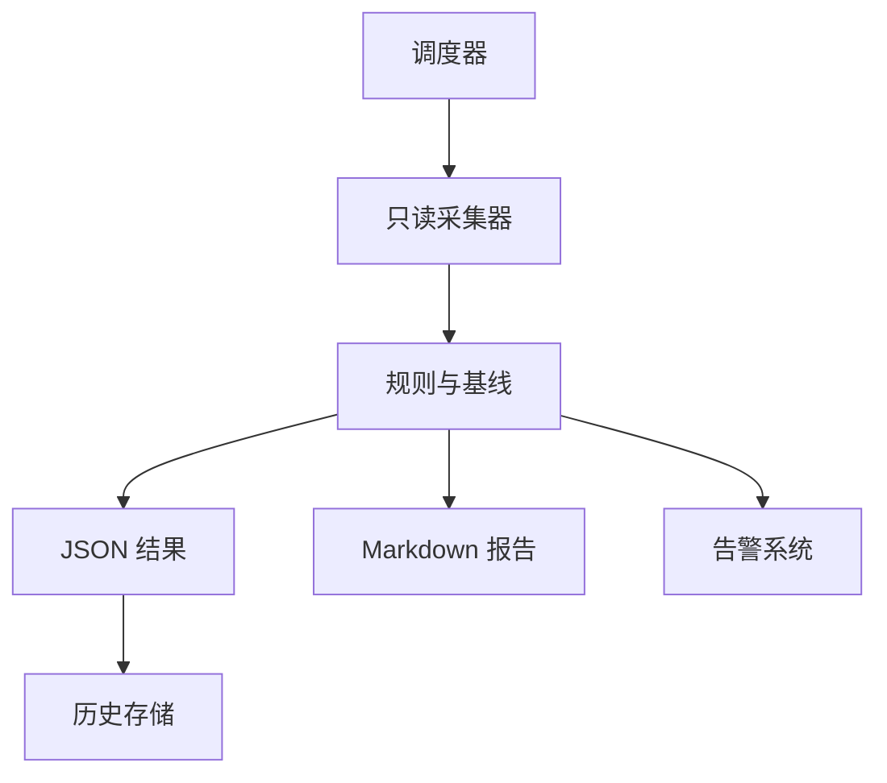

# Ceph 自动化巡检与报告：从只读命令、风险分级到每日健康评分

《Ceph 从零基础到生产运维实战》第 26 篇

← [第 25 篇：Ceph 安全加固实战](./25-Ceph安全加固.md)

人工登录服务器执行几条命令，只能得到某一时刻的零散信息。真正有价值的巡检应当可重复、只读、可比较、可告警，并能把异常定位到主机、守护进程、Pool、PG 和业务接口。本篇将从零设计一套 Ceph 自动化巡检方案。

## 1. 本文目标 {/* #本文目标 */}

读完并完成实验后，你应该能够：

- 区分监控、巡检、审计和主动测试
- 设计不会影响生产 I/O 的只读巡检项
- 使用 JSON 输出代替解析人类可读表格
- 检查 MON、MGR、OSD、MDS、RGW 和 cephadm
- 检查 PG、容量、Pool、CRUSH、版本和 crash
- 发现 MTU、链路速率、内核和 Ceph 版本不一致
- 为异常设置严重度、阈值和持续时间
- 编写可并发控制、超时、脱敏和留痕的 Shell 巡检脚本
- 生成 Markdown/JSON 报告并接入告警
- 通过历史基线发现「仍是 HEALTH_OK」的趋势风险

:::caution 安全边界
本文默认巡检为只读。`rados bench`、FIO、OSD bench、deep-scrub、Pool 创建删除、网络压测和故障注入均属于主动测试，不应混入日常巡检任务。
:::

## 2. 监控和巡检有什么区别 {/* #监控和巡检有什么区别 */}

### 2.1 监控 {/* #监控 */}

持续采集时间序列，擅长回答：

- 什么时候开始异常
- 异常持续多久
- 延迟、错误率、容量如何变化
- 是否超过 SLO

### 2.2 巡检 {/* #巡检 */}

按固定清单周期执行，擅长回答：

- 当前配置和拓扑是否符合基线
- 是否出现孤立主机、版本漂移、过期 crash
- Pool、CRUSH、keyring、服务规格是否被改变
- 是否存在尚未触发实时告警的趋势风险

### 2.3 审计 {/* #审计 */}

关注谁在何时做了什么，不能由健康巡检替代。

### 2.4 主动测试 {/* #主动测试 */}

通过真实读写、网络或故障行为验证服务，例如：

- 创建专用 RBD 镜像并读写
- CephFS 测试目录创建与删除
- RGW 测试 Bucket PUT/GET
- iperf3
- 故障切换演练

主动测试应使用独立账号、专用资源、限速和明确清理流程。

## 3. 一套巡检系统的结构 {/* #一套巡检系统的结构 */}



建议拆为五层：

1. 采集层：执行 Ceph、cephadm 和主机只读命令
2. 规范化层：把不同版本输出转成稳定字段
3. 规则层：判断严重度、阈值和趋势
4. 输出层：JSON、Markdown、指标和告警
5. 历史层：保留基线，用于差异比较

不要把所有逻辑写进一个巨大的 `grep | awk` 命令。

## 4. 为什么优先使用 JSON {/* #为什么优先使用-json */}

以下输出适合人阅读：

```bash
ceph -s
ceph osd tree
```

但自动化更应使用：

```bash
ceph status --format json
ceph health detail --format json
ceph osd tree --format json
ceph df detail --format json
```

原因：

- 表格列宽可能变化
- 新版本可能增加列
- 本地化和终端格式会影响文本
- JSON 可验证字段是否存在
- jq、Python、Go 都能稳定解析

仍需为版本差异设计兼容层：字段不存在时应返回 `unknown`，而不是默认判定健康。

## 5. 巡检账号应使用最小权限 {/* #巡检账号应使用最小权限 */}

不要把 `client.admin` keyring 分发到每个巡检节点。应先列出脚本实际需要的命令，然后创建只读实体并验证。

设计原则：

- MON/MGR 只授予读取健康和拓扑所需能力
- OSD 数据面不需要读业务对象时，不授予 Pool 读写
- 巡检进程使用独立系统账号
- keyring 权限最小
- 输出不能包含 key
- 凭据定期轮换
- 每个环境使用不同实体

由于不同巡检命令的 MGR module caps 会随版本变化，建议在测试环境从只读 profile 开始逐项验证，而不是直接复制一条全权限命令。

## 6. 巡检严重度设计 {/* #巡检严重度设计 */}

建议统一为：

| 等级 | 含义 | 示例动作 |
| --- | --- | --- |
| Critical | 数据不可用、可能丢失或业务已中断 | 立即电话/值班响应 |
| Warning | 冗余下降、容量逼近、异常持续 | 工单并限时处理 |
| Notice | 配置漂移、趋势或维护提醒 | 进入日报/周报 |
| OK | 符合当前基线 | 记录即可 |
| Unknown | 未采集成功或规则不适用 | 检查巡检系统本身 |

Unknown 不能当成 OK。如果巡检无法连接集群，最危险的做法就是生成一份「无异常」报告。

## 7. 第一层：巡检自身可用性 {/* #第一层巡检自身可用性 */}

在判断 Ceph 前，先检查采集器：

- DNS 是否能解析 MON
- keyring 是否存在且权限正确
- ceph CLI 是否可执行
- 命令是否在超时内完成
- 本机时间是否同步
- 输出目录是否可写
- 上次成功时间是否超期

示例：

```bash
timeout 15 ceph status --format json > /tmp/ceph-status.json
```

必须分别处理：

- 命令超时
- 认证失败
- 集群不可达
- JSON 无效
- 命令成功但健康异常

不要用一个 `if command; then OK; fi` 混在一起。

## 8. 集群总览 {/* #集群总览 */}

基础采集：

```bash
ceph status --format json
ceph health detail --format json
```

至少保存：

- overall health
- health check code
- message 和 summary
- MON quorum 数量
- OSD up/in 数
- PG 状态集合
- degraded/misplaced/unfound objects
- recovery I/O
- 客户端 I/O
- 采集时间

规则不能只判断 `HEALTH_OK`。例如：

- `HEALTH_WARN` 中的时钟偏移与容量逼近严重度不同
- 维护窗口中的 `noout` 可能有审批，但超期未清理应告警
- PG recovery 在换盘后可能合理，但持续超过恢复窗口就不合理

## 9. MON 巡检 {/* #mon-巡检 */}

```bash
ceph mon dump --format json
ceph quorum_status --format json
ceph mon stat
```

检查项：

- MON 数量是否符合设计
- quorum 是否包含预期 MON
- 是否频繁选举
- 地址是否仍为预期 v2/v1 地址
- MON 是否跨故障域
- MON 磁盘是否增长过快
- 时钟同步是否正常
- MON 数据库是否因异常操作膨胀

仅有三个 MON Pod/进程 Running，不能证明 quorum 正常。

## 10. MGR 与模块巡检 {/* #mgr-与模块巡检 */}

```bash
ceph mgr dump --format json
ceph mgr module ls --format json
ceph orch ps --daemon-type mgr --refresh --format json
```

检查：

- active MGR 存在
- 至少一个 standby（生产常见设计）
- active/standby 是否在不同主机
- prometheus、dashboard、balancer 等必要模块状态
- 模块是否 crash
- MGR 是否频繁切换

频繁 MGR failover 不一定影响数据 I/O，但会影响 Dashboard、Prometheus、cephadm 和编排能力。

## 11. OSD 状态巡检 {/* #osd-状态巡检 */}

```bash
ceph osd stat --format json
ceph osd tree --format json
ceph osd df tree --format json
ceph osd perf --format json
```

检查：

- 总数、up、in 是否一致
- down+in、up+out 等异常组合
- OSD 是否集中在单主机或机架
- 利用率离群
- commit/apply latency 离群
- weight/reweight 是否异常
- device class 是否正确
- 空盘是否意外被创建 OSD
- 最近新增/替换是否完成数据回填

延迟规则不应使用全局固定值。例如 HDD、SATA SSD、NVMe 基线不同。建议按 device class 和历史分位数比较。

## 12. PG 巡检 {/* #pg-巡检 */}

```bash
ceph pg stat --format json
ceph pg dump pgs_brief --format json
```

重点状态：

- `active+clean`
- degraded、undersized
- peering、activating
- backfill_wait、backfilling、recovering
- stale、inactive、incomplete
- inconsistent
- unfound objects

规则要包含持续时间：

- 换盘后短暂 recovering 可以是 Notice
- 长时间 inactive 应为 Critical
- inconsistent 需要立即进入数据一致性处理流程
- `active+clean` 比例下降要结合维护记录解释

不要每天自动执行 deep-scrub 作为巡检。它是真实磁盘负载，由 Ceph 调度并按维护策略管理。

## 13. 容量巡检 {/* #容量巡检 */}

```bash
ceph df detail --format json
ceph osd df tree --format json
ceph osd dump --format json
```

至少检查：

- 集群 RAW 使用率
- 每个 Pool STORED、OBJECTS、MAX AVAIL
- 每个 OSD 利用率
- 最大/最小 OSD 使用差异
- nearfull/backfillfull/full ratio
- 近 7/30/90 天增长率
- 达到阈值的预计日期
- 容量是否足以承受一个 failure domain 故障

容量告警建议同时包含：

- 静态阈值
- 增长预测
- 数据分布离群
- 恢复余量

只看集群平均使用率会掩盖单个 OSD 提前 full。

## 14. Pool 与 PG autoscaler 巡检 {/* #pool-与-pg-autoscaler-巡检 */}

```bash
ceph osd pool ls detail --format json
ceph osd pool autoscale-status --format json
```

检查：

- Pool 是否有 application tag
- size/min_size 是否符合标准
- EC profile 是否经过审批
- quota 是否缺失或超限
- pg_autoscale_mode
- autoscaler 是否建议 NEW PG_NUM
- target_size_ratio/bytes 是否矛盾
- 空闲或遗留 Pool
- 是否出现跨多个 CRUSH root 的异常 Pool

Pool 名称和数量也应与配置基线比较。一个新 Pool 可能来自合法业务，也可能是错误脚本。

## 15. CRUSH 巡检 {/* #crush-巡检 */}

```bash
ceph osd crush tree --format json
ceph osd crush dump --format json
ceph osd getcrushmap -o /secure/report/crushmap.bin
```

日常自动化通常只需解析前两条。二进制 CRUSH map 更适合作为受控备份。

检查：

- root、region、zone、rack、host 层级
- 主机是否进入正确机架
- device class
- CRUSH rule 与 Pool 对应
- failure domain
- 是否有空 bucket
- 与昨日基线的结构差异

CRUSH 差异应进入变更审计。错误的机架标签会让三副本看似分散，实际上落在同一物理故障域。

## 16. CephFS 巡检 {/* #cephfs-巡检 */}

```bash
ceph fs status --format json
ceph fs dump --format json
ceph orch ps --daemon-type mds --refresh --format json
```

检查：

- 文件系统是否 joinable
- active MDS 数量
- standby/replay 是否符合设计
- damaged rank
- MDS laggy
- client session 异常
- metadata/data Pool
- snapshot mirror 状态
- 配额和 subvolume 管理异常

如果有 CephFS 镜像：

```bash
ceph fs snapshot mirror daemon status
ceph fs snapshot mirror status <fs-name>
```

应检查每个目录的最近成功同步点，而不只是 mirror daemon 是否 Running。

## 17. RBD 巡检 {/* #rbd-巡检 */}

集群级巡检可检查：

```bash
rbd pool stats <pool> --format json
rbd mirror pool status <pool> --verbose
```

还应从控制系统获得：

- 镜像数量与总容量
- 快照数量和异常增长
- trash 中待删除镜像
- watcher/lock 异常
- mirror image health 和 lag
- orphan 或长期未使用卷

对成千上万镜像逐个执行昂贵命令会给 MON/MGR 增加压力。应分页、限并发，并优先从管理系统或批量接口取数。

## 18. RGW 巡检 {/* #rgw-巡检 */}

```bash
ceph orch ps --daemon-type rgw --refresh --format json
radosgw-admin sync status
```

结合监控检查：

- RGW 实例和分布
- 入口健康检查
- 4xx/5xx
- 请求延迟
- Bucket/object 增长
- multisite metadata/data sync
- quota 与 lifecycle
- 证书到期
- Access Key 异常使用

`radosgw-admin` 某些命令可能扫描大量元数据，不应高频无边界执行。先在测试环境测量成本。

## 19. Cephadm 巡检 {/* #cephadm-巡检 */}

```bash
ceph orch status --format json
ceph orch host ls --format json
ceph orch ps --refresh --format json
ceph orch ls --export
ceph log last cephadm
```

检查：

- orchestrator backend 可用
- 主机 online/offline
- daemon error/stopped/unknown
- service spec 与实际实例数
- `_admin`、mon 等标签
- stray host/daemon
- cephadm 是否意外 paused
- 镜像版本是否一致
- 最近部署失败事件

不要每天无条件执行 `ceph orch daemon redeploy` 或 restart 作为「自愈」。自动重启会掩盖根因并可能造成级联故障。

## 20. Cephadm 主机配置一致性检查 {/* #cephadm-主机配置一致性检查 */}

cephadm 可检查主机 OS、网络和版本差异。

启用前先确认当前版本支持并评估告警：

```bash
ceph config set mgr mgr/cephadm/config_checks_enabled true
```

查看状态与规则：

```bash
ceph cephadm config-check status
ceph cephadm config-check ls
```

当前检查范围包括：

- SELinux/AppArmor 状态
- 发行版订阅状态（特定系统）
- Public Network 成员关系
- OSD MTU 一致性
- OSD 链路速率一致性
- 配置网络是否存在
- Ceph release 一致性
- 内核主版本一致性

手工检查单个主机：

```bash
ceph cephadm check-host <hostname>
```

不要为了消除告警直接 disable 规则。若确有设计例外，应记录原因、范围和复核时间。

## 21. Crash 巡检 {/* #crash-巡检 */}

```bash
ceph crash ls-new
ceph crash stat
ceph crash info <crash-id>
```

规则：

- 新 crash 应进入分析
- 同一守护进程重复 crash 需要升级严重度
- crash 时间应与业务、主机和变更时间线关联
- 未分析前不要自动 `archive-all`
- crash 内容可能含路径、地址和调用栈，应控制报告访问

完成分析后再归档指定记录：

```bash
ceph crash archive <crash-id>
```

归档只表示已处理，不代表故障已修复。

## 22. 版本与镜像一致性 {/* #版本与镜像一致性 */}

```bash
ceph versions --format json
ceph orch ps --refresh --format json
```

检查：

- 守护进程 release 是否一致
- 是否处于已登记升级窗口
- 目标镜像 digest
- cephadm/ceph-common 是否兼容
- 容器运行时与内核是否出现漂移

混合版本在升级窗口内可以是预期状态；窗口结束仍混合则应告警。

规则必须能读取维护日历，否则容易产生大量无意义告警。

## 23. OSD flags 巡检 {/* #osd-flags-巡检 */}

```bash
ceph osd dump --format json
```

关注：

- `noout`
- `norebalance`
- `norecover`
- `nobackfill`
- `noscrub`
- `nodeep-scrub`
- `pause`
- `noup`/`nodown`/`noin`/`noout`

这些 flag 可能在维护中合法，但忘记清理会积累风险。

报告应显示：

- flag
- 设置时间
- 操作人/工单
- 计划撤销时间
- 是否超期

Ceph 本身未必保存完整业务审批信息，需要与变更平台关联。

## 24. 主机层巡检 {/* #主机层巡检 */}

只从 Ceph CLI 无法发现所有问题。主机检查包括：

```bash
uptime
timedatectl status
df -h
df -i
free -m
ip -s link
lsblk -o NAME,SIZE,TYPE,FSTYPE,MOUNTPOINTS
systemctl --failed
journalctl -k --since '-24 hours' --priority warning
```

重点：

- 根分区、`/var/lib/ceph`、日志分区
- inode
- OOM、I/O error、reset、NVMe timeout
- NIC error/drop
- 时间偏移
- 容器运行时
- 系统服务失败
- 磁盘 SMART/NVMe health

SMART long test、全盘读取等操作会消耗设备资源，不应在高峰自动并发运行。

## 25. 巡检频率 {/* #巡检频率 */}

| 频率 | 适合项目 |
| --- | --- |
| 1–5 分钟 | 健康、MON quorum、OSD up、PG 不可用、容量硬阈值 |
| 15–60 分钟 | 版本、守护进程、恢复、mirror lag、证书状态 |
| 每日 | Pool/CRUSH 差异、flags、crash、主机配置、增长预测 |
| 每周 | 权限清单、长周期趋势、闲置资源、备份恢复结果 |
| 每月/季度 | 故障演练、容量模型、SLO、架构和权限复核 |

实时风险应由监控处理，不要等每天 9 点巡检才发现 PG inactive。

## 26. 超时、并发和重试 {/* #超时并发和重试 */}

### 26.1 超时 {/* #超时 */}

每条外部命令必须有超时，否则一个卡住的 CLI 会阻塞整份报告。

```bash
timeout 20 ceph health detail --format json
```

### 26.2 并发 {/* #并发 */}

主机检查可受控并发，但不要同时向所有 OSD 发大量 admin socket 请求。

建议：

- 全局并发限制
- 按机架分批
- 命令间加入抖动
- 记录实际耗时
- 发现 MON 负载升高时自动降速

### 26.3 重试 {/* #重试 */}

只对短暂网络故障进行少量、带退避的重试。认证失败、JSON 结构错误和明确健康异常不应无限重试。

## 27. 一个安全的 Shell 脚本骨架 {/* #一个安全的-shell-脚本骨架 */}

下面示例演示工程结构，不包含所有规则：

```bash
#!/usr/bin/env bash
set -Eeuo pipefail

REPORT_DIR="${REPORT_DIR:-/var/lib/ceph-inspection}"
RUN_ID="$(date -u +%Y%m%dT%H%M%SZ)"
RUN_DIR="${REPORT_DIR}/${RUN_ID}"
COMMAND_TIMEOUT="${COMMAND_TIMEOUT:-20}"

umask 077
mkdir -p "${RUN_DIR}"

run_json() {
    local name="$1"
    shift
    local output="${RUN_DIR}/${name}.json"
    local error="${RUN_DIR}/${name}.stderr"

    if timeout "${COMMAND_TIMEOUT}" "$@" >"${output}" 2>"${error}"; then
        if jq -e . "${output}" >/dev/null 2>&1; then
            return 0
        fi
        printf '%s\n' "invalid_json" >"${RUN_DIR}/${name}.status"
        return 2
    fi

    printf '%s\n' "command_failed" >"${RUN_DIR}/${name}.status"
    return 1
}

overall_rc=0
run_json status ceph status --format json || overall_rc=1
run_json health ceph health detail --format json || overall_rc=1
run_json osd_tree ceph osd tree --format json || overall_rc=1
run_json df ceph df detail --format json || overall_rc=1
run_json versions ceph versions --format json || overall_rc=1

printf '%s\n' "${overall_rc}" >"${RUN_DIR}/collector.rc"
exit "${overall_rc}"
```

这个骨架体现：

- `set -Eeuo pipefail`
- 独立输出与 stderr
- 每条命令超时
- JSON 语法验证
- 目录权限
- 运行 ID
- 采集失败不伪装成健康

生产脚本还应有锁、日志轮转、指标输出、版本兼容层和脱敏。

## 28. 防止重复运行 {/* #防止重复运行 */}

```bash
exec 9>/run/lock/ceph-inspection.lock
if ! flock -n 9; then
    echo "another inspection is running" >&2
    exit 3
fi
```

如果上一次任务卡住，新任务无限叠加会增加 MON 压力。还应监控：

- 上一次开始时间
- 是否超过最大运行时长
- 锁是否来自活动进程
- 是否需要人工处理

不要盲目删除锁文件。

## 29. 规则输出结构 {/* #规则输出结构 */}

建议每条规则输出统一 JSON：

```json
{
  "rule_id": "CEPH_OSD_DOWN",
  "severity": "critical",
  "status": "fail",
  "summary": "2 OSDs are down",
  "evidence": {
    "osds": [12, 37]
  },
  "observed_at": "2026-08-06T01:30:00Z",
  "runbook": "https://example.internal/runbooks/ceph-osd-down"
}
```

稳定字段让它可以：

- 渲染 Markdown
- 转换 Prometheus 指标
- 发送告警
- 写入数据库
- 做跨天差异

`summary` 面向人，`rule_id` 和结构化 `evidence` 面向系统。

## 30. 健康评分的正确用法 {/* #健康评分的正确用法 */}

可以为管理层提供 0–100 分，但分数不能取代原始异常。

示例扣分模型：

| 项目 | 扣分示例 |
| --- | --- |
| PG inactive/unfound | 直接降到 0 或 Critical |
| MON 失去 quorum | 直接降到 0 |
| OSD down | 每个按故障域扣分 |
| nearfull | 按最满 OSD 和预测天数扣分 |
| 版本漂移 | 维护窗口外扣分 |
| 新 crash | 按数量和重复性扣分 |
| flags 超期 | 按影响扣分 |

需要设置「硬门槛」：数据不可用时不能因为其他 90 个项目正常还得到 85 分。

报告应同时展示：

- 总分
- 最高严重度
- Critical/Warning 数量
- 与昨日变化
- 预计风险
- 原始证据链接

## 31. 趋势与基线 {/* #趋势与基线 */}

单次状态正常不代表没有风险。历史比较包括：

- 容量增长速度
- 最满 OSD 与平均值差距
- OSD commit/apply latency 分位数
- recovery 完成时间
- MON DB 大小
- crash 次数
- PG 数和 Pool 数增长
- RBD 镜像/快照数量
- RGW 对象和 omap 增长
- 主机内核、MTU、链路速率漂移

建议保存规范化后的摘要，而不是永久保存所有原始命令输出。敏感原始数据按安全制度限期保留。

## 32. 报告模板 {/* #报告模板 */}

```markdown
# Ceph 每日巡检报告

- 集群：prod-ceph-a
- 时间：2026-08-06 09:00 +08:00
- 最高等级：Warning
- 健康评分：92/100

## 需要处理

1. OSD.12 apply latency 高于同类 SSD P99
2. osd.37 所在主机 bond1 RX drop 持续增长
3. noout flag 已超过维护窗口 40 分钟

## 容量预测

- RAW 使用率：68%
- 最满 OSD：76%
- 按近 30 天增速预计 43 天达到扩容线

## 与昨日变化

- 新增 1 个 crash
- Pool 数量无变化
- Ceph 版本无变化
```

报告第一屏应显示「下一步做什么」，而不是先堆数百行命令输出。

## 33. 接入 Prometheus {/* #接入-prometheus */}

脚本可以输出 textfile collector 指标，例如：

```text
ceph_inspection_success 1
ceph_inspection_timestamp_seconds 1785987600
ceph_inspection_critical_total 0
ceph_inspection_warning_total 3
ceph_inspection_score 92
```

注意：

- label 不要放 image、object、PG 等高基数字段
- timestamp 使用采集完成时间
- 必须有巡检自身 success 和 age 告警
- 原子写入临时文件后 rename，避免 Prometheus 读到半文件
- 详细证据放报告，不放高基数指标

## 34. 告警去重与维护窗口 {/* #告警去重与维护窗口 */}

一条 OSD down 可能同时触发：

- 集群 `HEALTH_WARN`
- PG degraded
- 主机 unreachable
- 容量变化
- 业务延迟

告警系统应按根因聚合，而不是给值班人员发送五十条消息。

维护窗口处理：

- 抑制已审批的预期告警
- 仍保留数据不可用等硬告警
- 窗口结束自动恢复
- flag 或静默超期单独告警
- 报告中注明维护影响

静默不能无限期，也不能把采集失败静默掉。

## 35. 巡检脚本测试 {/* #巡检脚本测试 */}

至少测试：

- `HEALTH_OK`
- `HEALTH_WARN` 多个 check
- CLI 超时
- keyring 认证失败
- 无效 JSON
- 某字段在旧版本不存在
- OSD down
- Pool nearfull
- 维护窗口中的预期 flag
- 报告目录满
- 两个实例同时运行
- 通知渠道失败

测试可使用保存的脱敏 JSON fixture，不必每次真实破坏 Ceph 集群。

## 36. 不应该自动修复什么 {/* #不应该自动修复什么 */}

以下动作默认需要人工决策：

- 自动将 OSD out/purge
- 自动修复 inconsistent PG
- 自动降低 Pool size/min_size
- 自动清除所有 OSD flags
- 自动重启整类守护进程
- 自动删除 Pool、镜像、快照
- 自动调整 CRUSH
- 自动提高 full ratio
- 自动 archive 所有 crash
- 自动停止 recovery

可以自动化「收集证据、创建工单、关联 Runbook、执行已审批的低风险动作」，但不能把危险命令藏在巡检脚本里。

## 37. 上线检查清单 {/* #上线检查清单 */}

### 37.1 采集器 {/* #采集器 */}

- 使用独立最小权限实体
- 所有命令有超时
- 有全局锁和最大运行时长
- 并发和请求频率经过压测
- JSON 字段有版本兼容处理
- 输出目录权限和轮转正确
- 不输出 key、token 和 secret

### 37.2 规则 {/* #规则 */}

- Critical/Warning/Notice/Unknown 定义统一
- 数据不可用设硬门槛
- 阈值按设备和业务基线
- 状态与持续时间结合
- 维护窗口可识别
- 每条异常有证据和 Runbook
- 未采集成功不会判定 OK

### 37.3 输出 {/* #输出 */}

- 报告首屏给出行动项
- JSON 可供系统消费
- Prometheus 指标无高基数
- 告警可去重和路由
- 历史趋势可查询
- 巡检自身失败有告警
- 报告访问符合数据安全要求

## 38. 本文小结 {/* #本文小结 */}

可靠的 Ceph 巡检系统应当：

- 明确监控、巡检、审计和主动测试的边界
- 日常采集坚持只读、超时、限并发
- 使用 JSON 和规范化字段，避免脆弱文本解析
- 覆盖 MON、MGR、OSD、PG、容量、Pool、CRUSH 和三类业务接口
- 同时检查 cephadm、主机、版本、flags 和 crash
- 将状态、持续时间、维护窗口和历史基线结合
- 把采集失败明确标记为 Unknown
- 报告给出行动项，指标用于趋势，原始证据用于排障
- 默认不执行高风险自动修复

下一篇将讲生产事故发生后的应急方法：如何判断事故等级、先止损还是先恢复、如何保存证据，以及怎样避免「越修越坏」。

→ [第 27 篇：Ceph 生产事故应急与复盘](./27-生产事故应急.md)

## 39. 课后练习 {/* #课后练习 */}

1. 为什么 Prometheus 监控不能完全替代每日巡检？
2. 自动化为什么应优先解析 JSON？
3. Unknown 为什么不能按 OK 处理？
4. 哪些 OSD 延迟规则需要按 device class 建基线？
5. OSD flags 巡检为什么需要维护工单信息？
6. 为什么不能高并发逐个查询所有 RBD 镜像？
7. 健康评分为什么必须设置硬门槛？
8. textfile collector 为什么要原子写入？
9. 哪些动作不适合自动修复？
10. 如何测试巡检脚本而不破坏生产集群？

### 39.1 参考答案 {/* #参考答案 */}

1. Prometheus擅长连续数值与实时告警；每日巡检还能核对拓扑漂移、长期Flags、版本混杂、备份可恢复性、证书/容量预测和需要关联工单的状态，两者互补。
2. JSON字段有稳定结构和类型，能明确区分空值、数组和错误；解析人类表格容易受版本、列宽、本地化和空格变化影响，产生静默误判。
3. Unknown表示采集失败、权限不足或格式变化，真实健康状态不可知；按OK处理会让监控失明。应单独告警并保留命令错误。
4. HDD、SSD/NVMe及分离DB的正常apply/commit延迟差异很大，应按Device Class、型号/角色和负载时段建立P95/P99基线，再识别相对异常。
5. `noout/nobackfill/norebalance/noscrub`可能是维护期间合理状态，也可能被遗忘。巡检必须关联工单、设置时间、Owner和到期解除条件，不能仅判断“是否存在”。
6. 每个Image查询会放大MON/OSD/客户端请求和进程开销，大规模并发本身可能成为生产负载；应使用批量/分页、缓存、限速和抽样，并在低峰执行。
7. 总分可能让一个致命项被多个正常项平均掉，例如PG inactive却得80分。Quorum丢失、full、inactive、备份失败等必须直接判为不通过。
8. Prometheus抓取时如果恰好读到半写文件，会解析失败或读到混合数据；先写同目录临时文件并`rename`，利用文件系统原子替换保证每次只看到完整快照。
9. 数据删除、`pg repair`、`mark_unfound_lost`、OSD out/destroy、提高full阈值、修改CRUSH和大规模重启都不适合无审批自动修复，因为判断错误不可逆或会扩大故障。
10. 用保存的JSON Fixture、Mock命令和不同版本样本做单元测试；在测试集群注入nearfull/down/超时；生产只以只读、低并发、超时和最小权限运行，先Shadow报告不触发动作。

## 40. 官方资料 {/* #官方资料 */}

- [Ceph 健康检查说明](https://docs.ceph.com/en/latest/rados/operations/health-checks/)
- [Cephadm Operations 与配置一致性检查](https://docs.ceph.com/en/latest/cephadm/operations/)
- [Cephadm 故障排查](https://docs.ceph.com/en/latest/cephadm/troubleshooting/)
- [Crash Module](https://docs.ceph.com/en/latest/mgr/crash/)
- [Ceph Prometheus 模块](https://docs.ceph.com/en/latest/mgr/prometheus/)
