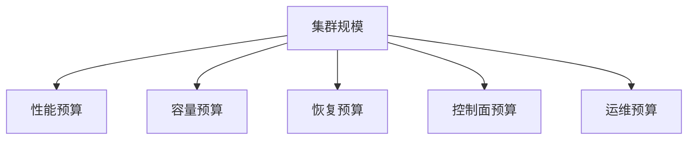
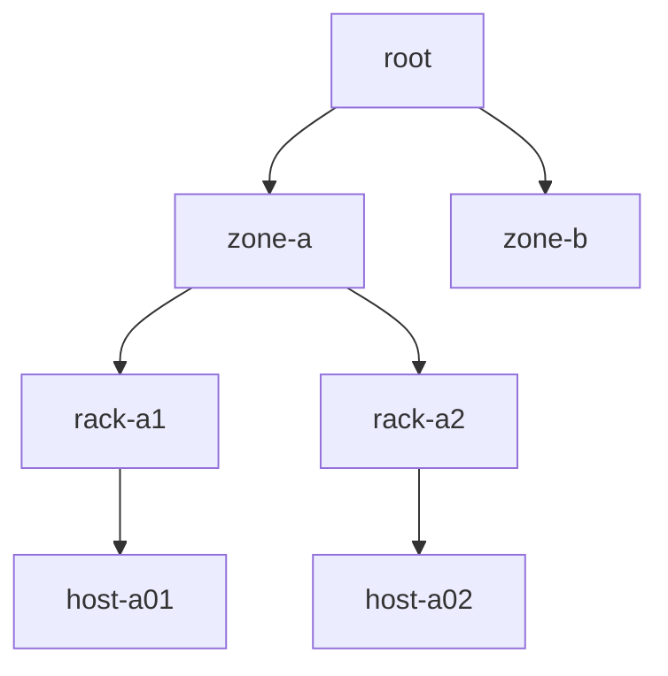

# 大规模 Ceph 集群设计与运维：OSD、PG、对象、恢复窗口和爆炸半径

《Ceph 从零基础到生产运维实战》第 28 篇

← [第 27 篇：Ceph 生产事故应急与复盘](./27-生产事故应急.md)

大规模 Ceph 并不只是「容量更大」：OSD、PG、Pool、对象、客户端、故障域和变更数量都会放大控制面开销。一个百 PB 集群可能因对象很大而相对简单，一个容量较小但拥有数十亿小对象和大量 Pool 的集群反而更难。本篇建立一套面向规模增长的设计和运维方法。


## 本文目标

读完后，你应该能够：

- 从多个维度判断集群是否进入「大规模」阶段
- 在单大集群与多集群之间做风险权衡
- 设计 region/zone/rack/host/OSD 的 CRUSH 层级
- 理解 OSD 数、PG 副本数和对象分布的关系
- 使用 PG autoscaler、bulk、target size 和边界值
- 控制 Pool、namespace、对象和 omap 的规模
- 规划 MON、MGR、BlueStore DB/WAL 和主机资源
- 设计网络超售、恢复窗口、mClock 和 scrub 策略
- 分批执行扩容、换盘、升级和故障域维护
- 建立容量、性能、控制面和运维复杂度的规模基线

:::caution 核心原则
扩容不能只增加磁盘。每一次 OSD 增长都要重新验证 PG 预算、网络上联、MON/MGR、恢复窗口、CMDB、监控基数、备件和人员操作能力。
:::

## 「大规模」没有一个统一数字

以下任一维度都可能让集群变复杂：

- OSD 数量
- 主机、机架、可用区
- 原始/可用容量
- PG 和 PG replica 数
- Pool/CRUSH rule 数
- 对象总数和平均对象大小
- RGW Bucket/index shard/omap
- RBD image/snapshot/clone 数
- CephFS inode、目录和客户端数
- 并发客户端和连接数
- 每日换盘/扩容/变更数量
- 一次故障需要恢复的数据量
- MON map、MGR 指标和监控基数

真正的分界线是：人工逐台处理、单一维护窗口和默认配置已经无法稳定控制风险。

## 用五个预算管理规模



### 性能预算

- 客户端 IOPS/吞吐/尾延迟
- 设备、CPU 和网络上限
- 背景任务影响

### 容量预算

- 副本/EC 放大
- full 阈值
- 故障域恢复空间
- 增长率

### 恢复预算

- 单盘、单主机、单机架恢复时间
- 恢复期间业务 SLO
- 第二故障概率

### 控制面预算

- MON map/PG/认证
- MGR 模块和指标
- PG peering
- CRD/Operator（Rook 场景）

### 运维预算

- 每日工单和换盘
- 升级总时长
- 人员、备件、自动化
- 误操作爆炸半径

## 单大集群还是多个集群

### 单大集群的优势

- 容量池化效率高
- OSD 多，恢复可并行
- 统一监控、升级和客户端配置
- 减少固定 MON/MGR 等基础开销
- 跨业务使用空闲容量

### 单大集群的风险

- 一个控制面或配置错误影响所有业务
- 升级时间长
- CRUSH/Pool/权限变更爆炸半径大
- 不同工作负载相互干扰
- full、网络或 MON 事故范围大
- 多团队共享治理困难

### 多集群的优势

- 故障和变更隔离
- 可按业务优化介质与版本
- 安全域清晰
- 升级和容量策略独立
- 一个集群事故不会击穿全部业务

### 多集群的代价

- 容量碎片
- 更多 MON/MGR、监控、证书和 Runbook
- 客户端配置复杂
- 备件和人员分散
- 跨集群迁移困难

## 拆分集群的常见边界

可以按：

- 生产/测试
- 安全或租户域
- Region/城市
- 块/文件/对象的极端工作负载
- HDD 容量型与 NVMe 低延迟型
- 合规和数据主权
- 生命周期和升级节奏
- 业务 SLO
- 团队所有权

不建议只因为「Pool 很多」立刻拆分，也不应因为容量池化率而无限扩张一个故障域。决策要量化容量损耗和事故影响。

## CRUSH 层级必须对应真实世界

典型结构：



层级可能包括：

- root
- region
- datacenter
- zone/room
- row
- pod
- rack
- chassis
- host
- OSD

只建实际独立的故障域。两个 rack 如果共享同一电源和单一 TOR，上层还应体现真实共同故障点，或在架构上消除单点。

## CRUSH 标签质量比层级数量更重要

错误标签会制造「逻辑三副本、物理一故障域」。

上线时核对：

- CMDB rack/zone
- 交换机端口
- 电源 PDU
- 主机序列号
- `ceph osd tree`
- `ceph osd crush tree`
- Pool 使用的 CRUSH rule

自动化应每天比较 CMDB 与 CRUSH。大规模环境靠人工发现标签漂移不可行。

## failure domain 不等于地理容灾

将副本跨 host/rack 能抵御对应故障，但跨城市同步三副本会引入：

- RTT
- 写确认延迟
- 链路抖动
- 网络分区和仲裁
- 跨站点带宽和费用

跨 Region 通常更适合异步 RBD/CephFS/RGW 镜像或独立备份。Stretch cluster 只适用于满足特定网络、仲裁和故障模型的场景，不能把普通三节点集群拉到两个城市就叫容灾。

## OSD 主机规模的平衡

每台主机放更多 OSD：

- 降低主机数和网络端口成本
- 共享 CPU、内存和网络
- 单机故障丢失更多 OSD，恢复量更大

每台主机放较少 OSD：

- 故障粒度小
- 网络和 CPU 更分散
- 主机、系统盘、交换端口和管理成本增加

计算单机故障恢复量：

```text
单机故障待恢复数据量 ≈ 该 Host 上所有 OSD 已用数据量之和
```

再结合可用恢复吞吐估计：

```text
恢复时间 ≥ 待恢复数据量 ÷ 有效恢复带宽
```

有效带宽通常远低于网卡标称值，因为同时受源盘、目标盘、CPU、网络超售和业务 QoS 限制。

## 大盘并不总是更经济

大容量 HDD/NVMe 能降低机架和端口成本，但会：

- 增加单盘恢复数据量
- 延长降级窗口
- 增加第二故障暴露时间
- 让容量增长步长变大
- 对 DB/WAL、CPU 和网络提出更高要求

评估盘型时除了每 TB 价格，还要计算：

- 单盘故障 RTO
- 全集群年故障次数
- 重建期间业务影响
- 备件交付
- 故障相关性
- 保修和固件

## PG 为什么影响规模

PG 是对象映射和恢复的管理单位。更多 PG 可以提升分布和并行度，但也会增加：

- OSD 内存
- MON/MGR 元数据
- peering 消息
- 状态统计
- recovery 复杂度
- scrub 调度

过少 PG 可能导致：

- 只有部分 OSD 被 Pool 使用
- 数据分布不均
- 恢复并行度不足
- 热点更明显

所以不是「越多越好」或「越少越省」，而是按 Pool 容量、OSD 数和工作负载分配预算。

## 看 PG replica，不只看 PG 总数

三副本 Pool 的一个 PG 会映射到三个 OSD；EC k+m 会映射到更多 shard。

粗略理解：

```text
PG 副本总量 ≈ 各 Pool 的 PG 数量 × 对应放置倍率，再对所有 Pool 求和
```

其中 replicated Pool 的 placement rate 约为 size，EC Pool 约为 k+m。

巡检：

```bash
ceph df
ceph osd df tree
ceph osd pool autoscale-status
```

`ceph df` 的每 OSD PGS 列比「集群 PG 总数 / OSD 数」更接近实际副本分布。

## 优先使用 PG autoscaler

```bash
ceph osd pool autoscale-status
```

模式：

- `on`：自动调整
- `warn`：只建议并告警
- `off`：完全手工

```bash
ceph osd pool set <pool> pg_autoscale_mode on
```

大规模生产常见方法：

- 新平台先用 `warn` 观察建议和业务窗口
- 经过验证后对合适 Pool 使用 `on`
- 升级、扩容和重大迁移时关注 PG split/merge
- 为关键 Pool 设置合理 target/bulk/bounds
- 不同时手工改 PG 和让 autoscaler 收敛

## mon_target_pg_per_osd 不要照抄旧经验

官方文档和默认值会随版本、balancer 和算法演进。现代文档对大多数非极小集群给出的建议可能高于旧时代常见值，但高到一定程度会增加 peering 和内存压力。

正确方法：

```bash
ceph config get global mon_target_pg_per_osd
ceph osd pool autoscale-status
ceph df
```

再结合：

- 当前 Ceph release 文档
- balancer
- OSD 内存
- PG peering 时间
- Pool/CRUSH roots
- 实际对象与容量分布

不要因为文章写了 100、200 或 250 就直接全局修改。

## bulk、target size 和边界

### bulk

预计从一开始就很大的数据 Pool 可设置 bulk，使 autoscaler 更早分配足够 PG：

```bash
ceph osd pool set <pool> bulk true
```

### target size

已知未来容量可设置：

```bash
ceph osd pool set <pool> target_size_bytes 500T
```

或相对比例：

```bash
ceph osd pool set <pool> target_size_ratio 0.6
```

不要同时设置矛盾值。metadata/omap-rich Pool 可能更适合 bias，而不是把 bias 与 target ratio 叠加。

### PG 上下界

```bash
ceph osd pool set <pool> pg_num_min <num>
ceph osd pool set <pool> pg_num_max <num>
```

边界可保护关键 Pool 的并行度或控制控制面成本，但设置错误会阻止 autoscaler 做正确调整。

## Pool 爆炸

每个 Pool 都带来：

- PG
- 配置和权限
- CRUSH rule
- autoscaler 预算
- 监控和运维对象
- 删除/恢复风险

不要为每个小租户、每个 PVC 或每个临时任务创建 Pool。隔离选择包括：

- RBD namespace
- CephFS subvolume/group
- RGW Bucket/tenant
- RADOS namespace
- CephX caps
- 配额和 application metadata

Pool 应服务于真正不同的介质、CRUSH、冗余、性能、安全或生命周期需求。

## 对象数量可能比容量更难

同样 1 PB：

- 1 GiB 对象约一百万个
- 4 KiB 对象数量高出多个数量级

大量小对象会增加：

- BlueStore/RocksDB metadata
- CPU
- 内存/cache
- scrub 时间
- recovery enumeration
- RGW index/omap
- 删除和 snapshot trim 成本

容量规划必须包含：

- 平均/分位对象大小
- 每秒创建/删除
- 生命周期
- metadata/omap 增长
- DB/WAL 需求
- 恢复和 scrub 基线

## RGW 大规模小对象专项

重点关注：

- Bucket index shard
- 单 Bucket 对象数
- dynamic resharding
- omap
- lifecycle
- versioned objects/delete markers
- multipart orphan
- multisite lag
- request distribution

不要让所有租户写入一个超大 Bucket，也不要无边界增加 shard。reshard 本身有成本，需要结合请求模式和版本能力。

监控应区分：

- data Pool
- index Pool
- metadata Pool
- 单 Bucket 热点
- RGW instance 负载

## RBD 大规模专项

成千上万镜像/快照/克隆会影响：

- trash
- snapshot metadata
- clone dependency
- object-map/fast-diff
- mirror status
- CSI OMAP
- 逐镜像指标基数

治理：

- 镜像命名和 owner
- 空闲卷回收
- snapshot 保留
- flatten 策略
- trash 延迟删除
- 控制平面批量 API
- 分页和限并发巡检
- 避免对每镜像导出高基数指标

不要每天对所有镜像执行昂贵命令。

## CephFS 大规模专项

重要维度：

- inode/目录数
- 元数据操作速率
- 单目录 entries
- client session
- caps 和 cache
- active MDS 数
- subtree 分布
- metadata Pool
- snapshot 和 purge queue

MDS 更依赖高频 CPU 和足够内存。把 metadata Pool 放在慢 HDD 上，增加更多 MDS 未必能解决底层 metadata I/O 瓶颈。

多 active MDS 只对可拆分的元数据工作负载有帮助，需要实际压测和目录布局设计。

## MON 设计

生产常用奇数 MON，通常 3 或 5，目的是形成多数派。更多 MON 不会线性提升性能，反而增加一致性通信和运维复杂度。

设计：

- 分布在独立故障域
- 低延迟、可靠网络
- 快速可靠的本地 SSD
- 根分区与 MON 数据风险隔离
- 足够 RAM/CPU
- 时间同步
- 监控 DB 大小和 compaction
- 定期验证 quorum 和恢复 Runbook

不要把 MON 放在高延迟跨区域链路两侧，却没有明确仲裁站点和故障模型。

## MON 控制面压力来源

- OSDMap 频繁变化
- OSD flapping
- 大量 PG peering
- 大量客户端认证
- Pool/PG 大规模变化
- config-key/health/crash 数据
- 慢盘
- 日志和订阅者

监控：

- election 次数
- quorum
- commit latency
- store size
- CPU/内存/磁盘
- OSDMap epoch 增长速度
- 慢请求

解决 flapping 根因比「给 MON 加 CPU」更重要。

## MGR 设计

MGR 承载：

- Dashboard
- Prometheus exporter
- cephadm
- balancer
- PG autoscaler
- progress、crash 等模块

生产应有 active 和 standby，并分布在不同主机。

规模增大时关注：

- active MGR CPU/内存
- prometheus scrape 时长和数据量
- Dashboard 大查询
- cephadm inventory/refresh
- 模块 crash
- failover 时模块恢复时间

关闭不使用模块可以降低复杂度，但不要为了性能关闭关键健康和自动化能力而不评估后果。

## 指标高基数

危险 label：

- object name
- PG ID（大规模逐 PG）
- RBD image ID
- Bucket/user
- client address
- request ID

高基数会让 Prometheus：

- 内存膨胀
- scrape 超时
- 磁盘增长
- 查询和规则变慢
- 在事故中首先失效

策略：

- 默认集群/Pool/OSD 级
- per-image 指标只对关键 Pool 开启
- 详细对象存日志或按需查询
- recording rules 降维
- 监控系统容量独立规划
- 保留周期与分辨率分层

## OSD 内存

BlueStore 使用缓存来平衡 metadata 和 data。`osd_memory_target` 是目标而非绝对硬上限，实际 RSS 可能受碎片、线程、PG、RocksDB 和工作负载影响。

检查：

```bash
ceph config get osd osd_memory_target
ceph config get osd bluestore_cache_autotune
```

主机容量应包含：

- 所有 OSD target 之和
- MON/MGR/exporter/container runtime
- 内核 page cache/slab
- recovery 峰值
- 安全余量

不要简单用「OSD 数 × target = 主机内存」刚好配满。OOM 会导致 OSD flapping 和级联恢复。

## CPU 与 NUMA

CPU 消耗来自：

- checksum
- replication/EC
- compression/encryption
- RocksDB
- 网络协议
- 小 I/O
- recovery/scrub

NVMe 能轻易把瓶颈推到 CPU 和网络。

大规格双路主机需关注：

- NVMe/NIC 的 NUMA 归属
- IRQ 分布
- OSD 容器 CPU 限制
- 跨 NUMA memory
- 单核饱和而总 CPU 仍低
- CPU frequency/power policy

优化前用 perf、IRQ、CPU per-core 和延迟证据验证，不要盲目绑核。

## BlueStore DB/WAL

HDD OSD 把 RocksDB/WAL 放到 SSD/NVMe 可改善 metadata 和小写性能，但共享设计有风险：

- 一块 DB 设备故障可能影响多个 OSD
- DB 空间不足发生 spillover
- 随机写耐久和延迟不足
- 设备数量与 failure domain 不匹配

规划：

- 按对象数量和工作负载估算 DB
- 预留增长和 compaction
- 监控 BlueFS spillover
- 评估共享比例
- 备件和更换流程
- 不把单个廉价 NVMe 变成整机 OSD 单点

DB/WAL 不是业务数据的独立副本，故障仍可能让对应 OSD 不可用。

## 网络超售

主机有 2×25 GbE，不代表机架有「主机数 × 50 GbE」的无阻塞上联。

需要计算：

- 每主机业务峰值
- recovery 峰值
- TOR 下行总带宽
- TOR 上联
- MLAG peer-link
- 跨机架比例
- 跨 zone/region 链路
- bond 单流限制

单机架故障恢复会让其他机架同时向新目标发送数据，是验证上联超售最重要的场景之一。

不要只在空闲时做单主机 iperf3 就宣称网络满足集群恢复。

## 恢复窗口是核心 SLO

大规模集群每年会经常遇到磁盘故障。应分别测量：

- 单 OSD 恢复
- 单主机恢复
- 单机架故障
- 新机架扩容回填
- 大版本升级时长

恢复窗口过长意味着：

- 更长时间处于 reduced redundancy
- 更高的级联故障概率
- 运维事件堆积
- scrub/升级/扩容互相等待

容量和性能正常，但恢复窗口失控，仍然是架构风险。

## mClock：业务与后台任务的 QoS

mClock 将请求分为：

- client
- background recovery
- background best-effort（backfill、scrub、snap trim、PG deletion 等）

内置 profile：

- `balanced`
- `high_client_ops`
- `high_recovery_ops`

查看：

```bash
ceph config get osd osd_mclock_profile
```

修改前必须在相同盘型和负载下测试。`high_client_ops` 保护前台但延长恢复；`high_recovery_ops` 缩短风险窗口但可能提高业务延迟。

不要同时修改大量底层 recovery 参数和 mClock profile。官方文档提示内置 profile 会覆盖部分 recovery/backfill 参数，自定义 profile 只适合高级用户。

## 恢复策略应按时段和风险切换

示例策略：

- 白天高峰：保护 P99，但设置最长恢复窗口
- 夜间：提高恢复优先级
- 只剩最低副本：数据安全优先于部分性能
- 单盘新增：平滑回填
- 机架故障：评估网络、容量和第二故障风险

每次临时配置必须记录：

- 原值
- 变更值
- 适用 OSD/设备类
- 工单和截止时间
- 撤销条件
- 业务和恢复指标

配置超期比配置本身更常见。

## Scrub 规划

Scrub 用于发现不一致和潜在介质问题，不能为了性能长期关闭。

规模增大后要平衡：

- light scrub 与 deep scrub
- 允许时间窗口
- 最大并发
- 设备类型
- 业务高峰
- 未完成 scrub 积压
- 恢复期间行为

监控：

- overdue
- inconsistent
- scrub duration
- scrub I/O 对 P99 的影响
- `noscrub`/`nodeep-scrub` flag 超期

不要通过永久设置 flag 消除性能告警。数据静默损坏可能因此长期不被发现。

## Balancer 与数据分布

查看：

```bash
ceph balancer status
ceph osd df tree
ceph osd pool autoscale-status
```

Balancer 可以改善 PG/容量分布，但它不是：

- 容量扩容
- 热对象自动拆分
- 错误 CRUSH 拓扑修复
- 单个超大对象问题的解决方案

变更 CRUSH rule、device class、PG 数和 balancer 时要避免同时大规模移动数据。

先记录目标、预计迁移量和停止条件。

## 容量扩容线不能等于 nearfull

扩容线应早于 Ceph nearfull，并包含：

- 采购和上架周期
- 数据回填时间
- 一个主机/机架故障空间
- 增长预测误差
- 快照/版本突增
- EC/replication 放大
- OSD 利用率离群
- 业务活动峰值

示例思路：

```text
扩容触发 = max(
  固定使用率阈值,
  预计 N 天后达到安全线,
  无法容纳最大故障域恢复,
  最满 OSD 超过离群阈值
)
```

阈值由本集群恢复能力和采购周期决定，不应机械套用一个百分比。

## 分批扩容

推荐：

1. 新主机完成 burn-in
2. 验证网络、MTU、固件、时间
3. 设置 CRUSH location
4. 小批加入 OSD
5. 观察 backfill、业务 P99、MON/MGR
6. 完成后再下一批
7. 更新容量模型

一次加入整机架可能导致巨大数据迁移。即使最终平衡正确，中间过程也可能压垮网络和磁盘。

扩容期间不要同步做大版本升级和大规模 PG 调整。

## 换盘流水线

大规模集群换盘是日常，而不是偶发事故。流水线应包括：

1. 告警关联 OSD、主机、机架、序列号、槽位
2. 判断是盘、线缆、背板还是主机
3. 数据状态和 safe-to-destroy
4. 工单审批
5. 现场更换
6. 新盘 burn-in
7. OSD 自动/受控创建
8. CRUSH 和 device class 验证
9. 恢复完成
10. 旧盘安全销毁
11. 库存补充

避免现场人员只收到 `/dev/sdX`。应使用机箱槽位、序列号和 LED 定位。

## 故障相关性

大规模环境不能假设磁盘独立随机故障。相关性来自：

- 同批次盘
- 相同固件 bug
- 同背板/HBA
- 同电源
- 同机架温度
- 同交换机
- 同一错误自动化
- 同一升级版本

监控和巡检应能按：

- vendor/model/firmware
- 采购批次
- host/rack/zone
- 错误类型
- 时间窗口

聚合异常。发现同批盘错误增长后，应在第二批故障前制定替换计划。

## 版本升级的规模效应

守护进程越多：

- 镜像拉取时间越长
- 每个 daemon 重启累积时间越长
- 混合版本窗口越长
- 某主机异常概率更高
- 监控和业务验收更复杂

大规模升级需要：

- 镜像预热/私有仓库容量
- 分阶段/故障域计划
- 明确 canary
- standby MGR/MON
- 升级门控
- 业务探针
- 充足窗口
- 暂停和继续能力

停止升级不是版本回滚。不要把「能暂停」当作「可以无计划开始」。

## 配置治理

大规模环境应使用配置数据库和声明式 spec，并追踪：

```bash
ceph config dump
ceph config assimilate-conf -i <file> --dry-run
ceph orch ls --export
```

原则：

- Git 管理期望配置
- Secret 不进普通 Git
- 变更有 review
- 一次只变一个目的
- 有 canary/范围
- 自动比较运行值
- 临时 override 有到期时间
- 版本升级前清理废弃参数

不要让 `/etc/ceph/ceph.conf`、central config、container args 和临时 injectargs 同时成为无人知道优先级的配置源。

## 自动化的安全边界

适合自动化：

- 只读巡检
- 容量预测
- 主机/CRUSH/CMDB 对比
- 备件和序列号关联
- 变更前检查
- 报告和工单
- 已审批、可回滚的单节点维护

需要人工/双人审批：

- Pool 删除
- OSD purge
- CRUSH 大改
- 副本/min_size
- `mark_unfound_lost`
- full ratio
- 批量 restart
- `cleanupPolicy`
- 跨站点 promote

自动化应默认 fail closed：无法确认 OSD ID、设备序列号或集群上下文时停止，而不是猜测。

## 多集群统一运营

当拆成多个集群后，需要统一：

- 命名和标签
- SLO 与告警
- 版本生命周期
- 容量口径
- 权限和密钥轮换
- 备份/灾备
- CMDB
- 巡检报告
- 变更模板
- 事故严重度

全局看板应显示：

- 每集群 health
- 最满 OSD/Pool
- 预测耗尽天数
- degraded/unavailable
- 版本
- mirror/backup
- 事故与维护窗口

不要把所有集群的逐 OSD 指标永久汇总到一个不受控的高基数 Prometheus。

## SLO 分层

### 集群 SLO

- MON quorum 可用性
- PG unavailable 时间
- 数据耐久
- 恢复窗口

### 存储接口 SLO

- RBD I/O 错误与 P99
- CephFS mount/metadata 延迟
- RGW 请求可用性和延迟

### 运维 SLO

- 告警发现时间
- 单盘更换时间
- 扩容 lead time
- 备份恢复演练
- 升级完成周期

只设置「Ceph HEALTH_OK 99.9%」会漏掉大量业务体验和风险窗口。

## 容量与恢复演练

建议定期验证：

- 一个 OSD out 时恢复耗时
- 一台主机维护时业务 P99
- 一个 rack 网络隔离时 PG 可用性
- 新 OSD 批次加入的回填
- recovery profile 切换
- nearfull 前的限写和扩容
- 监控在 Ceph 故障时仍可用

不要在未知生产集群直接故障注入。可以先在同架构预生产、数字孪生或受控低峰执行，并设置停止条件。

## 大规模集群健康看板

建议第一屏只保留：

- overall health 与具体 check
- PG unavailable/degraded
- OSD up/in 和 failure domain
- 最满 OSD、集群使用率、预测天数
- 客户端 IOPS/带宽/P99
- recovery rate 与预计完成时间
- MON quorum/election
- crash
- 版本和维护窗口

第二层：

- Pool
- device class
- host/rack
- BlueStore
- 网络
- RBD/CephFS/RGW

第三层才是单 daemon 和详细 perf counter。大规模看板必须支持从总览下钻，而不是首页渲染一万条曲线。

## 扩容前检查清单

- 当前瓶颈是容量、性能还是恢复窗口
- 新 OSD/主机/机架数量有模型
- CRUSH 层级和物理故障域已确认
- 网络 TOR/上联有回填带宽
- MON/MGR/监控能承受规模增长
- PG autoscaler 建议已评估
- Pool target/bulk/bounds 正确
- CPU、RAM、DB/WAL 与设备匹配
- 固件、内核、Ceph 版本一致
- 分批计划和停止条件
- 业务 P99 与 recovery 观察面板
- 备件、CMDB、序列号和现场流程准备完毕

## 日常治理检查清单

### 控制面

- MON quorum、磁盘和 DB 增长正常
- MGR active/standby 与模块正常
- OSDMap/选举/peering 无异常增长
- 版本和配置无漂移
- 监控 scrape 和查询在预算内

### 数据面

- OSD 使用率分布正常
- PG replica 在目标范围
- autoscaler 建议已处理
- scrub 无积压
- recovery 时间符合 SLO
- BlueFS/DB/WAL 无风险
- 网络无丢包和上联拥塞

### 业务与资源

- Pool 数增长有审批
- 小对象/omap 规模有趋势
- RBD image/snapshot/trash 受控
- CephFS inode/MDS 受控
- RGW Bucket/index/lifecycle 受控
- 容量扩容提前量充足

### 运维

- 换盘流水线可用
- 备件覆盖常见批次
- 临时 flags/config 无超期
- 高风险自动化有审批保护
- 事故和恢复演练定期执行
- 多集群 SLO 和版本统一治理

## 常见误区

### 误区一：容量越大，集群就越难

对象、PG、Pool、客户端和恢复窗口可能比 TB/PB 更关键。

### 误区二：一个集群可以无限横向扩展

数据面可扩展不代表控制面和运维爆炸半径没有边界。

### 误区三：PG 越多分布越好，所以越多越好

过多 PG 会增加内存、peering 和控制面开销。

### 误区四：加大 recovery 并发一定缩短事故

磁盘/网络已饱和时，更多并发可能恶化业务和有效吞吐。

### 误区五：更多 MON 会更可靠、更快

MON 依赖多数派，3/5 个常见；无限增加会增加一致性成本。

### 误区六：扩容就是一次加入全部新盘

大规模回填可能击穿网络、磁盘和业务 P99，应分批。

## 本文小结

大规模 Ceph 的治理重点是预算和边界：

- 不用单一容量或 OSD 数定义规模
- 同时管理性能、容量、恢复、控制面和运维预算
- 在单大集群的池化效率与多集群的故障隔离之间权衡
- CRUSH 必须真实映射物理故障域，并自动与 CMDB 对比
- 使用 PG autoscaler、bulk、target size 和上下界管理 PG
- 避免 Pool 爆炸，关注小对象、omap、快照和客户端规模
- MON/MGR、内存、CPU、DB/WAL、网络上联都要随 OSD 扩展
- 用恢复窗口而不仅是稳态性能评价架构
- mClock、scrub、balancer 和扩容都要受控、分批、可撤销
- 自动化应降低重复劳动，但高风险数据操作必须保留审批和防呆

至此，这套系列已经覆盖从 Ceph 零基础到部署、存储接口、监控、故障排查、性能、网络、升级、灾备、安全、自动化、事故响应、Rook 和大规模治理。后续可以继续进入源码级原理、协议抓包、BlueStore/RocksDB 专项以及完整生产案例复盘。


下一篇将把整套主线组合成完整项目：10 台 2TB 服务器从规划、部署到故障演练。

→ [第 29 篇：10 台 2TB 服务器完整建设案例](../../../projects/ceph-cluster/29-十台2TB服务器完整建设案例.md)

## 课后练习

1. 为什么容量较小的集群也可能属于运维上的「大规模」？
2. 单大集群与多集群分别有哪些主要风险？
3. CRUSH rack 标签错误为什么会突破三副本设计？
4. 为什么要看 PG replica 而不只看 PG 总数？
5. bulk 与 target_size 解决什么问题？
6. 为什么不应为每个租户创建一个 Pool？
7. 小对象如何影响 BlueStore、scrub 和恢复？
8. `osd_memory_target` 为什么不是严格内存上限？
9. 单主机恢复窗口如何影响每台主机的 OSD 密度？
10. 为什么扩容应分批，并避免与升级同时进行？

## 官方资料

- [Ceph 硬件建议](https://docs.ceph.com/en/latest/start/hardware-recommendations/)
- [Placement Groups 与 PG Autoscaler](https://docs.ceph.com/en/latest/rados/operations/placement-groups/)
- [CRUSH Map](https://docs.ceph.com/en/latest/rados/operations/crush-map/)
- [Monitor 配置参考](https://docs.ceph.com/en/latest/rados/configuration/mon-config-ref/)
- [BlueStore 配置参考](https://docs.ceph.com/en/latest/rados/configuration/bluestore-config-ref/)
- [mClock 配置参考](https://docs.ceph.com/en/latest/rados/configuration/mclock-config-ref/)
- [Balancer Module](https://docs.ceph.com/en/latest/rados/operations/balancer/)
- [OSD 配置参考](https://docs.ceph.com/en/latest/rados/configuration/osd-config-ref/)
